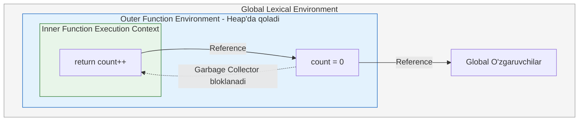

# Closures (Yopilishlar)

> [!IMPORTANT]
> **Nima uchun muhim?**  
> Dasturlash tillarida odatda funksiya o'z ishini tugatgach, uning ichidagi barcha o'zgaruvchilar xotiradan (Call Stack) o'chirib yuboriladi (Garbage Collection). Lekin JavaScript'da Closure xususiyati tufayli funksiyalar "o'zining eski uyini va undagi narsalarni" hech qachon unutmaydi. React'dagi `useState`, lodash'dagi `debounce`, API'larda xavfsizlik (Data Privacy) — bularning barchasi aynan Closure ustiga qurilgan. Uni tushunmaslik "stale closure" kabi soatlab vaqtni oladigan bug'larga olib keladi.

## 🟢 Junior (Asoslar va Tushunchalar)

### Terminologiya
**Closure (Yopilish)** — bu ichki funksiyaning o'zi yaratilgan tashqi funksiyaning muhitiga (o'zgaruvchilariga) kira olish qobiliyati. Yopilish funksiya yaratilayotgan vaqtdagi Leksik Muhit (Lexical Environment) ni eslab qolishidan hosil bo'ladi.

### Nima uchun kerak?
Closure asosan ma'lumotlarni tashqi tomondan ruxsatsiz o'zgartirilishidan himoya qilish (**Data Privacy**) va biror funksiyaning holatini uning ishi tugagandan keyin ham xotirada saqlab qolish uchun ishlatiladi.

> [!NOTE]
> **Hayotiy o'xshatish: "Sohil bo'yidagi Choyxona va Surati"**  
> Tasavvur qiling siz yoshligingizda bir qishloqda yashagansiz. U qishloqda bitta chiroyli "Choyxona" bor edi. Siz o'sha paytda u yerda suratga (funksiya) tushdingiz. Yillar o'tib qishloqdan katta shaharga ko'chib keldingiz. 
> Endi qishloqqa qaytib bormasangiz ham, qo'lingizdagi o'sha suratga qarab, fondagi "Choyxona"ni qayerda bo'lishingizdan qat'iy nazar eslay olasiz. 
> JavaScript funksiyalari ham xuddi shunday — ular qayerda yaratilgan bo'lsa (qishloq/tashqi funksiya), o'sha yerdagi o'zgaruvchilarni (choyxona/ma'lumotlar) o'ziga bog'lab oladi va uni boshqa joyga (boshqa fayl yoki scope) olib ketsangiz ham ularga yetib bora oladi.

### Sodda Misol

```javascript
function tashqiFunksiya() {
  // Bu o'zgaruvchi tashqi muhitda yashaydi
  const xabar = "Salom, Junior!";

  function ichkiFunksiya() {
    // Ichki funksiya tashqaridagi o'zgaruvchiga yetib boradi
    console.log(xabar);
  }

  return ichkiFunksiya;
}

const meningFunksiyam = tashqiFunksiya();
// tashqiFunksiya o'z ishini tugatdi, lekin "xabar" xotirada qoldi

meningFunksiyam(); // "Salom, Junior!" chiqadi
```

<TryIt href="https://stackblitz.com/edit/js-closure-basic?file=index.js" label="Closure asosini sinab ko'ring" />

---

## 🟡 Middle (Amaliyot va Detallar)

### Qanday ishlaydi? (Scope Chain)
Funksiya yaratilganda JavaScript uning ichida yashirin `[[Environment]]` xususiyatini saqlab qoladi. Bu xususiyat ushbu funksiya qaysi muhitda yaratilganiga ishora (reference) qiladi.

```javascript
function counterYaratish() {
  let count = 0; // Private holat

  return function() {
    count++; // count ni Closure orqali topadi
    return count;
  };
}

const counter1 = counterYaratish();
const counter2 = counterYaratish();

console.log(counter1()); // 1
console.log(counter1()); // 2
console.log(counter2()); // 1 (Mutlaqo alohida xotira muhiti!)
```

<TryIt href="https://stackblitz.com/edit/js-closure-counter?file=index.js" label="Counter misolini sinab ko'ring" />

> E'tibor bering: `counter1` va `counter2` o'zining alohida yopiq muhitlariga ega.

### Keng tarqalgan real use-caselar

**1. Module Pattern (Data Encapsulation)**
Obyektga to'g'ridan-to'g'ri ulanishni cheklash uchun:
```javascript
const userModule = (function() {
  let users = []; // Private
  let nextId = 1;

  return {
    addUser(name) {
      users.push({ id: nextId++, name });
    },
    getUserCount() {
      return users.length;
    }
  };
})();

userModule.addUser('Ali');
console.log(userModule.users); // undefined (Himoyalangan!)
console.log(userModule.getUserCount()); // 1
```

<TryIt href="https://stackblitz.com/edit/js-module-pattern?file=index.js" label="Module Pattern sinab ko'ring" />

**2. Memoization (Kesh kiritish)**
Og'ir hisoblashlarni eslab qolish uchun:
```javascript
function memoize(fn) {
  const cache = {}; // Kesh closure orqali saqlanadi
  return function(args) {
    if (cache[args]) return cache[args];
    const result = fn(args);
    cache[args] = result;
    return result;
  }
}
```

<TryIt href="https://stackblitz.com/edit/js-memoization?file=index.js" label="Memoization sinab ko'ring" />

### Ko'p uchraydigan xatolar va muammolar (Pitfalls)

**1. Loop Variable Capture (Sikl ichidagi closure)**
```javascript
// XATO: var block-scoped emas. Natija 3, 3, 3 chiqadi.
for (var i = 0; i < 3; i++) {
  setTimeout(() => console.log(i), 100);
}

// TO'G'RI: let ishlating. U har bir sikl uchun yangi closure muhitini yaratadi.
for (let i = 0; i < 3; i++) {
  setTimeout(() => console.log(i), 100); // 0, 1, 2
}
```

<TryIt href="https://stackblitz.com/edit/js-loop-closure?file=index.js" label="var vs let farqini ko'ring" />

**2. Stale Closure (React'da Eskirgan yopilish)**
```javascript
function Counter() {
  const [count, setCount] = useState(0);

  useEffect(() => {
    const timer = setInterval(() => {
      // count doim 0 bo'lib qoladi! (Stale closure)
      setCount(count + 1);
    }, 1000);
    return () => clearInterval(timer);
  }, []); // Bo'sh massiv - closure yaratilgandagi count(0) ga qotib qolgan.

  // Yechim: setCount(prevCount => prevCount + 1)
}
```

<TryIt href="https://stackblitz.com/edit/react-stale-closure?file=src/App.tsx" label="Stale Closure muammosini ko'ring" />

## Eng Yaxshi Amaliyotlar (Best Practices)
- **Globalni ifloslantirmang:** Vaqtinchalik yoki o'zgaruvchan holatlarni (state) `window`ga yozgandan ko'ra closure yordamida yashiring.
- **`var` ishlata ko'rmang:** Closure yaratadigan joylarda doim `let` yoki `const` foydalaning. Bu kutilmagan sikl xatolarining oldini oladi.
- **Copy qaytaring:** Module pattern ichidan massiv yoki obyekt qaytarayotganda ularni spread `[...items]` orqali qaytaring, aks holda tashqaridan original ma'lumot mutatsiya qilinishi mumkin.

---

## 🔴 Senior (Arxitektura va Optimallashtirish)

### "Under the hood" (Qopqoq ostida nimalar ro'y beradi)
V8 dvigateli (JavaScript Engine) ishlash mexanizmida, funksiya tugashi bilan uning *Execution Context* (bajarilish konteksti) *Call Stack* dan (Chaqiruvlar steki) olib tashlanadi. Odatda funksiyaning o'zgaruvchilari ham xotiradan tozalanadi. 

Lekin, dvigatel agar funksiya ichida boshqa bir funksiya qolganini (va qaytarilganini) ko'rsa, leksik analiz vaqtida closure kerak bo'lishini tushunadi. O'sha zudlik bilan kerakli o'zgaruvchilar **Stack xotirasidan o'chirilmasdan, Heap (uyum) xotirasiga o'tkaziladi.** Bu amaliyot *Variable Hoisting to Heap* deb ataladi. Shuning uchun ham closure'lar uzoq vaqt "tirik" qoladi.

### Xotira (Memory) va Unumdorlik (Performance)
Closure'larni ehtiyotsizlik bilan yaratish **Memory Leak** (Xotira sizishi) ga sabab bo'lishi mumkin. Chunki JavaScript'ning Garbage Collector'i (Musor yig'uvchi) closure reference qilib turgan ma'lumotlarni hech qachon o'chirmaydi.

```javascript
// Xavfli Memory Leak:
function createHandler() {
  const bigData = new Array(1000000).fill('Heavy Object');

  return function handler(event) {
    // Agar bu handler butun dastur ishlashi davomida yashasa,
    // bigData hech qachon GC tomonidan tozalanmaydi.
    console.log("Event tushdi!", bigData.length);
  };
}

// Optimallashtirilgan yechim:
function createHandlerOptimized() {
  const bigData = new Array(1000000).fill('Heavy Object');
  const sizeNeeded = bigData.length; // Faqat kerakli qiymatni ajratib olamiz
  // V8 endi faqat 'sizeNeeded' ni Heap'da saqlaydi, 'bigData' ni o'chiradi.
  return function handler(event) {
    console.log("Event tushdi!", sizeNeeded);
  };
}
```

<TryIt href="https://stackblitz.com/edit/js-memory-leak-closure?file=index.js" label="Memory Leak misolini sinab ko'ring" />

*Advanced Level yechimi:* Mod zamonaviy JS da **`WeakRef`** va **`FinalizationRegistry`** yordamida memory-safe closure'lar yozish mumkin. 

### Arxitektura Patternlari (Intervyu tayyorgarligi)
Katta masshtabli tizimlarda Closure'lar **Memoization**, **Currying (Funksional Dasturlash)** va **Event Emitter** yozishda asosiy rol o'ynaydi. Currying'ga misol:
```javascript
const apiConnect = (baseURL) => (endpoint) => (params) => {
    return fetch(`${baseURL}/${endpoint}?${new URLSearchParams(params)}`);
};
const userAPI = apiConnect('https://api.com/v1')('users');
userAPI({ id: 1 }).then(res => res.json()); // https://api.com/v1/users?id=1
```

<TryIt href="https://stackblitz.com/edit/js-currying-api?file=index.js" label="Currying API misolini sinab ko'ring" />

### Vizualizatsiya (Leksik Zanjir)


---

## Xulosa

| Daraja | Yondashuv va Fokus | Nimalarga qodir bo'lish kerak? |
| --- | --- | --- |
| **Junior** | **Mantiq:** Tashqi o'zgaruvchini funksiya ichida ishlatishni biladi. | Asosiy counter yaratish, HTML click handlerlarida tashqi o'zgaruvchilarni ko'rish. |
| **Middle** | **Qo'llash:** Data privacy, React stale closures, Loop `var/let` muammolarini yaxshi farqlaydi. | React Hook'larida qotib qolgan statelarni tuzatish, Module pattern orqali private field'lar yozish. |
| **Senior** | **Arxitektura & V8:** Heap va Stack mexanizmlari, Garbage Collection'ni bloklash va Memory leak'larni anglash. | Ilg'or Currying, Keshlashtirish, Event tizimlari qurish va katta datalarni WeakRef orqali optimallashtirish. |
