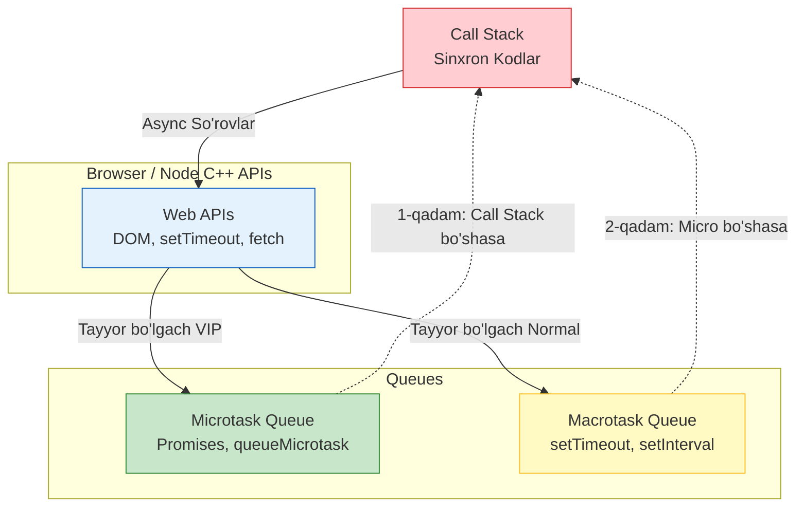

# Event Loop

> [!IMPORTANT]
> **Nima uchun muhim?**  
> JavaScript faqatgina **bitta thread** (bir oqim) da ishlaydi, ya'ni bir vaqtning o'zida faqat bitta qator kodni ishlata oladi. Agar u API ga so'rov yuborib 5 soniya kutib tursa, butun veb-saytingiz qotib (freeze bo'lib) qolardi. Lekin unday bo'lmaydi. Sayt ishlashda davom etadi. Nega? Chunki unda **Event Loop** mexanizmi bor! Uni tushunmaslik "setTimeout nega kutilgan vaqtda ishlamadi?" yoki "Nega veb-saytim qotib qoldi?" kabi soatlab vaqtni oladigan muammolarga olib keladi.

## 🟢 Junior (Asoslar va Tushunchalar)

### Terminologiya
**Event Loop** — bu JavaScript'ning sinxron (ketma-ket) va asinxron (kutiladigan) kodlarni qanday boshqarishini ta'minlovchi doimiy aylanib turuvchi mexanizm. U har doim avval hozirgi ishni tugatib, keyin kutib turgan ishlarni bajarishga o'tadi.

### Nima uchun kerak?
Sayt foydalanuvchiga qotib qolmasdan (non-blocking) tez ishlashi uchun, og'ir va vaqt oladigan operatsiyalar orqa fonga o'tkazilishi kerak. Event loop o'sha orqa fondagi ishlarni kerakli vaqtda ekranga olib chiqish uchun kerak.

> [!NOTE]
> **Hayotiy o'xshatish: "Yolg'iz ofitsiant va Oshxona"**  
> Tasavvur qiling restoranda faqat **1 ta ofitsiant** (JavaScript Thread) bor. U mijozdan buyurtma oladi (Sinxron kod). Agar u buyurtmani oshpazga bersa va oshpaz ovqatni pishirmagunicha u yerda qotib tursa (Sinxron kutish), qolgan mijozlar xizmat ko'rmasdan qochib ketardi. 
> Lekin ofitsiant "aqlli". U buyurtmani oshpazga (`Web API`) beradi-da, darhol keyingi mijozga xizmat qilgani ketadi. Oshpaz ovqatni pishirib bo'lgach, tayyor ovqatni "Tayyor buyurtmalar stoli" ga (`Callback Queue`) qo'yadi. Ofitsiant (Event Loop) zalda ishi qolmagan (Call Stack bo'shagan) zahoti o'sha tayyor ovqatlarni olib mijozlarga tarqatadi.

### Sodda Misol

```javascript
console.log('1. Boshlandi'); // Sinxron kod darhol ishlaydi

setTimeout(() => {
  console.log('2. Asinxron (Kutish tugadi)'); // Event Loop orqali keladi
}, 1000);

console.log('3. Tugadi'); // Sinxron kod darhol ishlaydi

// Natija:
// 1. Boshlandi
// 3. Tugadi
// 2. Asinxron (Kutish tugadi)
```

---

## 🟡 Middle (Amaliyot va Detallar)

### Qanday ishlaydi? (Mexanizmlar)
Event loop arxitekturasi 4 ta asosiy qismdan iborat:
1. **Call Stack (Chaqiruvlar steki):** Sinxron kodlar bajariladigan joy. U LIFO (Oxirgi kirgan, birinchi chiqadi) tizimida ishlaydi.
2. **Web API'lar:** DOM, `setTimeout`, `fetch` kabi brauzer (yoki Node.js C++) funksiyalari.
3. **Microtask Queue:** Promise (`.then`, `.catch`) kabi juda yuqori ustuvorlikka ega vazifalar saqlanadi.
4. **Macrotask Queue:** `setTimeout`, `setInterval`, va event handlerlar kabi past ustuvorlikka ega vazifalar saqlanadi.

**Event Loop Qoidasi:** Call Stack to'liq bo'shab qolmaguncha Queue'dan hech qanday vazifa stack'ga olinmaydi. Stack bo'shagach, **birinchi o'rinda** Microtask Queue to'liq tozalanadi, va undan keyingina Macrotask Queue'dan faqat bitta vazifa olinadi.

### Keng tarqalgan real use-caselar
**Non-blocking UI (Chunking):** Agar juda og'ir hisoblash (masalan, 100 000 marta aylanish) bo'lsa, u brauzerni muzlatib qo'yadi. Buni oldini olish uchun ishni `setTimeout` yordamida qismlarga bo'lamiz (Chunking).

```javascript
function heavyTask() {
  // Brauzerni qotirib qo'yadigan funksiya
  let i = 0;
  function processChunk() {
    do {
      i++;
    } while (i % 100 !== 0 && i < 10000); // Kichik qismlarga bo'lamiz
    
    if (i < 10000) {
      setTimeout(processChunk, 0); // Event Loop'ga navbatni beramiz
    } else {
      console.log('Tugadi!');
    }
  }
  processChunk();
}
```

### Ko'p uchraydigan xatolar va muammolar (Pitfalls)

**1. `setTimeout(fn, 0)` ni noto'g'ri tushunish**
Ko'pchilik "0 millisoniyadan keyin darhol ishlaydi" deb o'ylaydi. Lekin bu xato! `0` degani "Vazifani darhol Queue (navbat) ga qo'sh" degani. Navbat qachon kelishini esa Call Stack'ning bo'shashiga bog'liq.

**2. Microtask Starvation (Cheksiz kutish)**
Agar Microtask ichidan o'zini o'zi chaqiradigan yangi Microtask yarataversangiz, Macrotask (masalan, setTimeout) lar va **UI rendering (ekranni chizish)** hech qachon ishlamay qoladi.

```javascript
function infiniteMicrotask() {
  Promise.resolve().then(() => {
    infiniteMicrotask(); // XATO: Brauzer butunlay qotadi!
  });
}
```

## Eng Yaxshi Amaliyotlar (Best Practices)
- **Og'ir ishlarni Web Worker'ga yuboring:** Brauzerning asosiy oqimi (Main Thread) render qilish uchun mas'ul. Uni UI ni qotiradigan matematik hisoblashlar bilan to'ldirmang. Web Worker ishlating.
- **Animatsiyalar uchun `requestAnimationFrame` ishlating:** `setInterval` bilan animatsiya qilmang, u brauzerning chastotasi bilan muvofiq ishlamaydi va qotish (jank) hosil qiladi. Animatsiya va ekran yangilanishi uchun doim `requestAnimationFrame` ishlating.
- **`await` main thread'ni to'xtatmaydi:** Async funksiyada `await` yozganingizda u butun dasturni to'xtatmaydi. U shunchaki shu funksiyani bajarilishini to'xtatib turadi, bu paytda Event loop boshqa kodlarni bajarishda davom etadi.

---

## 🔴 Senior (Arxitektura va Optimallashtirish)

### "Under the hood" (Qopqoq ostida nimalar ro'y beradi)
JavaScript dvigateli (V8) ichida Event Loop aslida C++ dasturidir (Brauzerda `libevent` yoki Node.js'da `libuv`). 
Qopqoq ostida u cheksiz sikl: `while(true)`.

Event Loop'ning bir marta aylanib o'tishi **Tick (shiqillash)** deb ataladi. U har bir tick'da quyidagi bosqichlarni bosib o'tadi:
1. **Timerlar bosqichi:** `setTimeout`, `setInterval` larni tekshiradi va bajaradi.
2. **Pending Callbacks:** Ba'zi I/O operatsiyalar.
3. **Poll bosqichi:** Yangi I/O hodisalar (fayl tizimi, network) ni qabul qiladi. Node.js ko'pincha shu yerda bloklanib kutadi.
4. **Check bosqichi:** `setImmediate` ni bajaradi.
5. **Close bosqichi:** `socket.on('close')` larni bajaradi.

Microtask'lar (Promise) esa bu bosqichlarga bog'liq emas. Har bir oddiy vazifa (Macrotask) yoki sinxron kod (Call stack) tugaganidan keyin dvigatel **darhol** barcha Microtask'larni oxirigacha bajarishga o'tadi. Ya'ni, V8 uchun Promise'lar eng yuqori darajadagi "VIP mijozlar".

### Xotira va Unumdorlik
Qachonki Event loop'ga ko'p vazifa tushib ketsa, **Layout Thrashing** (Qayta-qayta dizaynni chizish) yuz beradi. Buni oldini olish uchun DOM o'qish (read) va DOM yozish (write) amallarini birgalikda (batching) bajarish kerak.

```javascript
// XATO: Layout Thrashing (Har bir loopda DOM hisoblanadi)
elements.forEach(el => {
  const width = el.offsetWidth; // Read
  el.style.width = width + 10 + 'px'; // Write
});

// TO'G'RI: Batching
const widths = elements.map(el => el.offsetWidth); // Faqat Read
requestAnimationFrame(() => {
  elements.forEach((el, i) => {
    el.style.width = widths[i] + 10 + 'px'; // Faqat Write
  });
});
```

### Intervyu Savollari (Qiyin daraja)
**Savol:** Ushbu kod qanday ketma-ketlikda natija chiqaradi?
```javascript
setTimeout(() => console.log('1'), 0);
Promise.resolve().then(() => {
  console.log('2');
  Promise.resolve().then(() => console.log('3'));
});
console.log('4');
```
**Javob:** `4 -> 2 -> 3 -> 1`. Chunki `4` bu sinxron (Call Stack). Keyin barcha Microtasklar qat'iy tekshiriladi: `2` chiqariladi. Lekin uning ichidagi kod yangi Promise (`3`) yaratadi va u ham shu zahoti microtask queue'ga tushadi, shuning uchun Macrotask'ga o'tmasdan oldin u ham bajariladi. Eng oxirida Macrotask'dagi `1` chiqadi.

### Vizualizatsiya (Event Loop)


---

## Xulosa

| Daraja | Yondashuv va Fokus | Nimalarga qodir bo'lish kerak? |
| --- | --- | --- |
| **Junior** | **Mantiq:** Kod tepadan pastga ishlamasligini tushunadi. | Koddagi `setTimeout` nega oxirida ishlashini bilsa bo'ldi. Asinxron so'rov qila oladi. |
| **Middle** | **Qo'llash:** Microtask va Macrotask o'rtasidagi prioritetni farqlaydi. | Murakkab Promise ketma-ketliklarini boshqara oladi, non-blocking chunking haqida biladi, "0 ms" afsonasiga aldanmaydi. |
| **Senior** | **Arxitektura & V8:** Node.js libuv / Brauzer rendering sikli bilan integratsiya qilishni tushunadi. | Layout thrashingni oldini olish, Worker'larni yozish, `requestAnimationFrame` arxitekturasini optimal qurish. |
