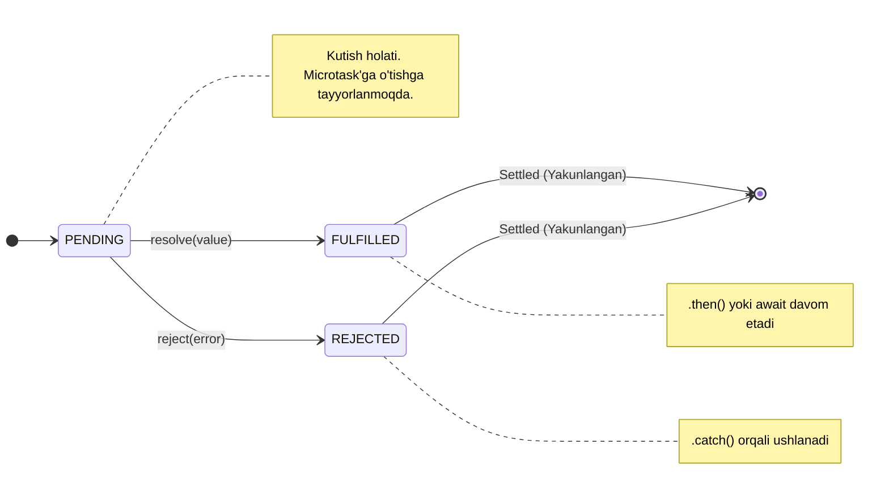

# Promises va Async/Await

> [!IMPORTANT]
> **Nima uchun muhim?**  
> Dasturlashda ko'p jarayonlar vaqt oladi: serverdan ma'lumot yuklash, fayl o'qish yoki taymerlar. Agar biz bu javoblarni "Sinxron" (kodni to'xtatib) kutsak, butun sayt aylanib qotib qoladi. Promises va Async/Await — bu o'sha vaqt oluvchi operatsiyalarni fonda (backgroundda) bajarib, natijasi kelganda bizga "Xabar qilish" ni ta'minlovchi eng kuchli zamonaviy JS vositasi hisoblanadi. Bugungi kunda ushbu mavzusiz hech qanday loyihada ishlay olmaysiz.

## 🟢 Junior (Asoslar va Tushunchalar)

### Terminologiya
**Promise (Va'da)** — bu hozircha natijasi yo'q, lekin kelajakda qandaydir natija yoki xato qaytarishga "va'da beruvchi" maxsus JavaScript obyekti. 
**Async/Await** — bu xuddi o'sha Promiselarni xuddi sinxrondek (oddiy qatorma-qator) yozish imkonini beradigan qulay sintaksis.

### Nima uchun kerak?
Tarmoq bilan ishlashda (masalan API dan datani kutish) vaqt kerak bo'ladi. Promise kutish jarayonini boshqarish va xatolarni (catch) ushlash uchun eng zo'r vosita.

> [!NOTE]
> **Hayotiy o'xshatish: "Fast-food Restoranidagi Chek"**  
> Kassirga pul to'lab pitsa buyurtma qildingiz. U sizga darhol pitsani emas, qog'oz **Chek (Promise)** berdi. Bu chek shuni anglatadiki, sizga kelajakda yoki Pitsa beriladi (Resolved), yoki pulingiz qaytariladi (Rejected — masalan masalliq tugagan). 
> Siz chekni qo'lda ushlab, rastaga suyanib turmaysiz. Joyga borib o'tirasiz, telefoningizni titkalaysiz (boshqa ishlarni qilasiz). Tabloda "14-raqam tayyor" degan yozuv chiqishi (Event Loop tomonidan Call Stackka kelishi) bilan borib pitsangizni olasiz. `async/await` esa xuddi o'rningizdan turmasdan VIP stolda o'tirishingiz va pitsa pishganida stolingizga olib kelishlariga o'xshaydi (kod o'qilishi xuddi sinxrondek sodda ko'rinadi).

### Sodda Misol

```javascript
// Promise yaratish
const pitsaBuyurtma = new Promise((resolve, reject) => {
  let masalliqBor = true;
  if (masalliqBor) {
    resolve("Pitsa Tayyor!"); // Muvaffaqiyat!
  } else {
    reject("Kechirasiz, masalliq tugadi."); // Xato!
  }
});

// Promise natijasini kutish (Eski usul .then)
pitsaBuyurtma
  .then(natija => console.log(natija)) // "Pitsa Tayyor!"
  .catch(xato => console.log(xato));

// Async/Await (Yangi, zo'r usul)
async function ovqatlanish() {
  try {
    const natija = await pitsaBuyurtma; 
    console.log(natija);
  } catch (xato) {
    console.log(xato);
  }
}
ovqatlanish();
```

---

## 🟡 Middle (Amaliyot va Detallar)

### Qanday ishlaydi? (Mexanizmlar)
Promise asosan 3 xil holat (State) da bo'ladi:
1. **Pending (Kutilmoqda):** Boshlang'ich holat, hali natija aniq emas.
2. **Fulfilled (Bajarildi):** Operatsiya muvaffaqiyatli yakunlandi (`resolve` ishladi).
3. **Rejected (Rad etildi):** Xato yuz berdi (`reject` ishladi).

Bir marta *Fulfilled* yoki *Rejected* bo'lgan promise ortga qaytmaydi (bu "Settled" holati deyiladi).

### Keng tarqalgan real use-caselar

**1. API ga so'rov yuborish (Fetch API bilan)**
```javascript
async function getUserData(userId) {
  try {
    const response = await fetch(`https://api.example.com/users/${userId}`);
    if (!response.ok) throw new Error('Foydalanuvchi topilmadi');
    
    const data = await response.json();
    console.log(data.name);
  } catch (error) {
    console.error("Tarmoq xatosi:", error.message);
  } finally {
    console.log("So'rov yakunlandi (xato yoki to'g'ri farqisiz ishlaydi).");
  }
}
```

**2. Ko'p so'rovlarni bir vaqtda kutish (Promise.all)**
Agar sizga 3 ta boshqa-boshqa API lardan ma'lumot kerak bo'lsa va ular bir-biriga bog'liq bo'lmasa, ularni ketma-ket `await` qilib kutib o'tirish XATO (sekin ishlaydi). Ularni bir vaqtda yuborish kerak:

```javascript
async function parallelRequests() {
  // Promise.all barcha va'dalar bajarilishini bir vaqtda kutadi
  const [users, posts] = await Promise.all([
    fetch('/api/users').then(res => res.json()),
    fetch('/api/posts').then(res => res.json())
  ]);
  
  console.log(users, posts);
}
```

### Ko'p uchraydigan xatolar va muammolar (Pitfalls)

**1. Ketma-ket keraksiz kutish (Waterfall muammosi)**
```javascript
// XATO: 1-so'rov 2 sekund, 2-so'rov ham 2 sekund olsa jami 4 sekund kutiladi.
const user = await fetch('/user');
const posts = await fetch('/posts'); // user ga bog'liq emas, lekin uni kutyapti.

// TO'G'RI: Ikkalasini bir vaqtda parallel jo'natish (2 sekundda tugaydi).
const [user, posts] = await Promise.all([ fetch('/user'), fetch('/posts') ]);
```

**2. `async` ni faqat `await` bilan ishlatish shart emas**
Har qanday funksiya oldiga `async` qo'ysangiz u avtomatik tarzda oddiy ma'lumotni ham Promise qilib qaytaradi.
```javascript
async function test() {
  return "Salom"; 
}
test().then(res => console.log(res)); // "Salom" 
```

## Eng Yaxshi Amaliyotlar (Best Practices)
- **Doim `try/catch` ishlating:** Async funksiyalar ichida so'rovlar xato berishi ehtimoli doim bor (masalan, internet uzilsa). Shuning uchun serverga qilingan so'rovni albatta try-catch blokiga o'rang.
- **Promise.allSettled() haqida biling:** Agar `Promise.all` da bittagina so'rov xato bersa, qolgan 99 tasi tayyor bo'lsa ham hammasi fail(reject) bo'ladi. Agar sizga "qaysi biri o'xshasa shuni olaman" desangiz, ES2020 da qo'shilgan `Promise.allSettled()` ni ishlating. U xato bersa ham qolganlarini qaytaradi.
- **Microtask Queue'ni to'ldirmang:** Judayam ko'p sonli ketma-ket Promise zanjirlari brauzerni qotirishi mumkin. (Event loop darsini eslang).

---

## 🔴 Senior (Arxitektura va Optimallashtirish)

### "Under the hood" (Qopqoq ostida nimalar ro'y beradi)
`async/await` aslida **Generators** (`function*` va `yield`) larning sintaktik shakaridir (syntactic sugar). Qopqoq ostida har safar V8 `await` ni ko'rganda:
1. Joriy funksiyaning ijrosini "muzlatadi" (pause).
2. Funksiyaning qolgan qismini **Microtask Queue** ga tashlaydi.
3. Call Stack ni bo'shatib, Event Loop ga "Borib boshqa Macrotasklarni qilib kelaver" deb javob yuboradi.
4. Va'da qilingan qiymat (Promise resolve) kelgandagina, funksiyani o'sha muzlagan joyidan boshlab davom ettiradi.

### Xotira (Memory) va Unumdorlik (Performance)
**Promise Memory Leaks:** 
Agar siz Promise qaytarib u uzoq muddat (masalan socket kutish orqali) pendind bo'lib tursa va Garbage Collector (GC) o'ziga bog'langan scope'dagi o'zgaruvchilarni tozalamasa sizda memory leak kuzatiladi.

```javascript
// Ilg'or yechim: So'rovlarni timeout yordamida to'xtatish (AbortController)
async function fetchWithTimeout(url, time) {
  const controller = new AbortController();
  const timeoutId = setTimeout(() => controller.abort(), time); // 3 sek dan keyin to'xtatish

  try {
    const res = await fetch(url, { signal: controller.signal });
    return await res.json();
  } catch (err) {
    if (err.name === 'AbortError') console.log("So'rov vaqti tugadi!");
  } finally {
    clearTimeout(timeoutId); // Memory leak'ni oldini olish
  }
}
```

### Arxitektura Patternlari (Intervyu tayyorgarligi)
Katta masshtabli loyihalarda, ayniqsa Node.js mikroservislarida **"Promise Concurrency Control"** (parallelizmni cheklash) pattern'i ko'p ishlatiladi. Masalan 10 000 ta faylni o'qishingiz kerak. Ularni hammasini birdaniga `Promise.all` qilsangiz operativ xotira (RAM) to'lib qoladi. Buni **Async Queue** qilib, bir vaqtda faqat 5 tadan Promise ni ishlashini ta'minlash Senior darajali malaka hisoblanadi (masalan `p-limit` paketiga o'xshash).

### Vizualizatsiya (Promise Lifecycle)


---

## Xulosa

| Daraja | Yondashuv va Fokus | Nimalarga qodir bo'lish kerak? |
| --- | --- | --- |
| **Junior** | **Mantiq:** Asinxron kod nimaligini tushunadi. | `async/await` va `try/catch` yordamida API dan datani muvaffaqiyatli olib kela oladi. |
| **Middle** | **Qo'llash:** Waterfall muammolarini topa oladi va paralel jo'natishni biladi. | `Promise.all`, `Promise.allSettled`, va `Promise.race` lar farqini amalda qayerda ishlatishni aniq farqlaydi. |
| **Senior** | **Arxitektura & V8:** Generatordagi uzilishlarni, Event Loop va Microtask munosabatini chuqur biladi. | `AbortController` yordamida qotgan promise larni o'ldirish va "Concurrency control" (limitli parallel) tizimlarini tuza oladi. |
