# Debounce va Throttle

> [!IMPORTANT]
> **Nima uchun muhim?**  
> Foydalanuvchilar ba'zan juda "sho'x" bo'lishadi: sichqonchani tinmay qimirlatib `mousemove` ni ishga tushirishadi, yoki qidiruv qatoriga tez-tez yozib API ni so'rovlarga ko'mib yuborishadi. Bunga qarshi hech narsa qilmasangiz, serveringiz xarajatlardan yonib ketishi, mijozning kompyuteri esa qotib qolishi aniq. Debounce va Throttle - qaysar oqimni boshqarish (Rate limiting) va ilova tezligini (Performance) saqlab qolish uchun 2 xil kuchli qurol hisoblanadi.

## 🟢 Junior (Asoslar va Tushunchalar)

### Terminologiya
- **Debounce:** Funksiyani faqatgina foydalanuvchi qandaydir harakatni **to'xtatgandan** keyin (masalan, klaviaturada yozishni to'xtatgandan 1 soniya o'tib) ishga tushiradigan mexanizm.
- **Throttle:** Funksiyani har doim ma'lum bir **qat'iy vaqt oraliqlarida** (masalan, tinmay scroll qilsa ham, har 1 soniyada maksimum 1 marta) ishga tushiradigan mexanizm.

### Nima uchun kerak?
Performance ni oshirish va serverni ortiqcha "Garbage" (keraksiz) so'rovlardan asrash uchun kerak. Agar foydalanuvchi qidiruvga "Olma" deb yozsa (O, l, m, a), 4 ta harf uchun 4 marta serverga so'rov yubormaslik uchun kerak.

> [!NOTE]
> **Hayotiy o'xshatish: "Lift va Avtobus"**  
> **Debounce (Lift):** Siz lift ichidasiz, eshik yopilayapti. Shu payt kimdir yugurib keldi va tashqaridagi tugmani bosdi. Eshik yana ochiladi va yopilish uchun *yana noldan boshlab kutadi*. Odamlar tinmay kelaversa, lift eshigi yopilmay kutib turaveradi. U faqat hech kim kelmay qolganda, jimlik bo'lgandagina yopilib yuqoriga chiqadi. (Input Search ga yozish xuddi shunday).  
> **Throttle (Avtobus):** Avtobus bekatda 15 minut kutadi va ketadi. Unga farqi yo'q, odam kelib-ketaveradi, to'lib ketadi yoki bo'm-bo'sh — baribir har 15 minutda faqat bittadan avtobus jo'nab turaveradi. (Scroll hodisasini ushlash shunga o'xshaydi).

### Sodda Misol

```javascript
// Oddiy kod: Har bir harf yozganda ishlayveradi (YOMON)
inputEl.addEventListener('input', () => {
  console.log("Serverga qidiruv ketti!"); 
});

// Tayyor library (masalan Lodash) yordamida Debounce (YAXSHI)
const qidiruv = _.debounce(() => {
  console.log("Serverga qidiruv ketti!");
}, 1000);

inputEl.addEventListener('input', () => {
  qidiruv(); // Faqat foydalanuvchi yozishni to'xtatib 1 soniya kutsa ishlaydi!
});
```

---

## 🟡 Middle (Amaliyot va Detallar)

### Qanday ishlaydi? (Qo'lda yozish)

Agar loyihada tayyor kutubxona bo'lmasa, Debounce va Throttle'ni o'zingiz yozishingizga to'g'ri keladi. Bu yerdagi asosiy mexanizm **Closure** hisoblanadi.

**1. Debounce (O'zimiz yozamiz)**
```javascript
function debounce(fn, delay) {
  let timer; // Closure orqali saqlanadigan xotira
  
  return function(...args) {
    clearTimeout(timer); // Avvalgi taymerni bekor qilamiz (Eshikni qayta ochamiz)
    
    timer = setTimeout(() => {
      fn.apply(this, args); // Faqat jimlikdan keyin ishlaydi
    }, delay);
  }
}
```

**2. Throttle (O'zimiz yozamiz)**
```javascript
function throttle(fn, limit) {
  let inThrottle; // Hozir tanaffusdamizmi?
  
  return function(...args) {
    if (!inThrottle) { // Agar tanaffusda bo'lmasak...
      fn.apply(this, args); // Funksiyani ishlatamiz
      inThrottle = true; // Tanaffusni yoqamiz
      
      setTimeout(() => {
        inThrottle = false; // Belgilangan vaqtdan keyin tanaffusni ochamiz
      }, limit);
    }
  }
}
```

### Keng tarqalgan real use-caselar
| Konsept | Qachon ishlatiladi? (Use-cases) |
| --- | --- |
| **Debounce** | Qidiruv qatorlari (Search box), formani auto-save (avtomatik saqlash) qilish, oyna hajmini o'zgartirish (Window Resize). |
| **Throttle** | Infinite Scroll (pastga tushganda yangi datani yuklash), tugmani qayta-qayta bosishdan (Spam) saqlash, sichqoncha harakatini kuzatish (Mouse tracking). |

### Ko'p uchraydigan xatolar va muammolar (Pitfalls)

**1. React komponentlarida Debounce'ni to'g'ridan-to'g'ri yozish**
```javascript
function SearchComponent() {
  // XATO: Har render bo'lganda yangi debounce funksiyasi yaratilaveradi va ishlamaydi!
  const handleChange = debounce((text) => send(text), 1000); 

  // TO'G'RI: useCallback ishlating (Yoki ref da saqlang)
  const handleChange = useCallback(debounce((text) => send(text), 1000), []);
}
```

**2. Memory leak qoldirish**
Komponent o'chib ketganidan (Unmount) keyin ham taymer ishlab yotmasligi uchun, professional debounce metodlarida `.cancel()` degan funksiya bo'ladi. Uni useEffect ning cleanup qismida chaqirib yuborish kerak.

## Eng Yaxshi Amaliyotlar (Best Practices)
- **To'g'ri vaqt tanlang:** Qidiruv (Debounce) uchun **300ms - 500ms** ideal. Scroll (Throttle) uchun **100ms - 200ms** mos keladi.
- **Noldan yozmang:** Iloji boricha qo'lda yozmasdan lodash (`lodash.debounce`, `lodash.throttle`) yoki `use-debounce` (React) paketlarini ishlating. Chunki ularning ichida memory-safe (xavfsiz) va "leading/trailing edge" larni hisobga oluvchi qator to'g'rilashlar bor.

---

## 🔴 Senior (Arxitektura va Optimallashtirish)

### "Under the hood" (Qopqoq ostida nimalar ro'y beradi)
Throttle dagi oddiy `setTimeout` ba'zan UI ning fps (kadrlar soni) ga to'g'ri tushmasligi va ekranda qotishlar (jank) lar keltirib chiqarishi mumkin. 
Shuning uchun zamonaviy frontend da Scroll va Animatsiyaga bog'liq Throttle lar asosan **`requestAnimationFrame` (rAF)** orqali amalga oshiriladi. Brauzer har doim ekranni yangilashdan oldin rAF ni chaqiradi (taxminan sekundiga 60 marta, ya'ni 16.6ms da 1 marta).

```javascript
// High-performance Throttle (Scroll uchun eng zo'ri)
function throttleRAF(fn) {
  let isRunning = false;
  
  return function(...args) {
    if (isRunning) return;
    
    isRunning = true;
    requestAnimationFrame(() => {
      fn.apply(this, args);
      isRunning = false; // Keyingi ekranni chizishgacha yana bloklanadi
    });
  }
}
```

### Leading va Trailing tushunchalari
Mukammal darajadagi Debounce/Throttle arxitekturalarida 2 ta holat bo'ladi:
- **Leading Edge (Boshlanishi):** Foydalanuvchi harakatni boshlagan zahoti DARHOL 1 marta ishlaydi, so'ngra qolganlarni ignor qiladi. (Masalan, Submit tugmasiga spam qilmaslik uchun mos).
- **Trailing Edge (Tugashi):** Foydalanuvchi harakatni to'xtatgandan keyin ishlaydi. (Search box uchun mos).

Agar `leading: true` qilib yuborilgan debounce bo'lsa, xuddi throttle kabi 1-so'rov darhol serverga uchadi va darhol qidiruv boshlanadi.

### Intervyu Savollari (Qiyin daraja)
**Savol:** Men Reactda Debounce yozdim, u ishlayapti, lekin foydalanuvchi yozib bo'lib darhol "Submit" tugmasini bossa, submit ishlaganda formadagi eski ma'lumot ketib qolyapti (chunki debounce state'ni hali yangilab ulgurmadi). Nima qilish kerak?
**Javob:** Eng yaxshi Debounce funksiyalarida `.flush()` amali bo'ladi. U barcha taymerlarni o'sha zahoti o'chirib, kutib turgan funksiyani **kutmasdan** darhol bajarib yuboradi. Formani submit qilishdan oldin `debouncedFunction.flush()` chaqirilishi kerak.

### Vizualizatsiya (Timeline)

```mermaid
gantt
    title Debounce va Throttle farqi
    dateFormat  s
    axisFormat  %S
    
    section User Input
    (tinmay) Typing   :done, 0, 4s
    
    section Debounce Natijasi
    (Kutmoqda...) :active, 0, 4s
    Faqat 1 ta o'q   :crit, 4, 4.1s
    
    section Throttle Natijasi
    1-o'q :crit, 0, 0.1s
    2-o'q :crit, 2, 2.1s
    3-o'q :crit, 4, 4.1s
```


---

## Xulosa

| Daraja | Yondashuv va Fokus | Nimalarga qodir bo'lish kerak? |
| --- | --- | --- |
| **Junior** | **Mantiq:** Qaysi biri qayerda ishlatilishini biladi. | Lodash orqali inputga debounce ulashni va search API so'rovlarni tejamkor qilishni uddalaydi. |
| **Middle** | **Qo'llash:** Orqa fonda (closure va setTimeout) qanday ishlashini to'liq tushunadi. | O'zining custom debounce/throttle logikasini yoza oladi, React da useCallback muammosini yecha oladi, memory leak larni cancel qiladi. |
| **Senior** | **Arxitektura & V8:** rAF (requestAnimationFrame) ning afzalliklari, frame rate (fps) va Edge qirralari. | `throttleRAF` orqali UI dagi sakrashlarni yo'q qiladi, .flush() va leading/trailing konfiguratsiyalari bo'yicha arxitektura yozadi. |
