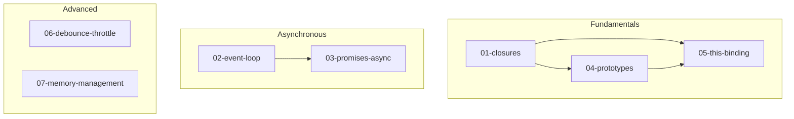

# Core JavaScript

> [!IMPORTANT]
> **Nima uchun muhim?**  
> Dasturchilar ko'pincha freymvorklarni (React, Vue, Angular) tezroq o'rganishga shoshishadi. Lekin tag zaminida ularning hammasi Core JavaScript da ishlaydi. Agar siz `this` qanday ishlashini, `Event Loop` qachon to'xtashini yoki `Closure` xotirani qanday to'ldirishini bilmasangiz, ertasiga loyihada tushunarsiz "jodugarlik" kabi bug'larga duch kelasiz. Yaxshi muhandis vositani (freymvork) emas, materialni (tilni) mukammal tushunishi shart.

> [!NOTE]
> **Real-hayot analogiyasi: "Poydevor"**  
> Chiroyli g'ishtlar, naqshlar (Vue, React) bilan uy qursangizu, ostida mustahkam beton poydevor (Core JS) bo'lmasa nima bo'ladi? Kichik bir yer qimirlashi yoki kuchli shamol (Murakkab funksionallik, katta foydalanuvchilar oqimi) uyingizni ag'darib yuboradi. Ushbu bo'limdagi barcha darsliklar Sizning poydevoringizga qo'yiladigan "beton" dir.

Bu bo'lim JavaScript'ning fundamental tushunchalarini chuqur o'rganishga bag'ishlangan. Senior darajadagi bilim uchun zarur bo'lgan barcha mavzular qamrab olingan.

## Bo'lim Tarkibi

| # | Mavzu | Tavsif |
|---|-------|--------|
| 01 | [Closures](./01-closures.md) | Leksik muhit, closure mexanizmi, memory leak, practical patterns |
| 02 | [Event Loop](./02-event-loop.md) | Call stack, task queue, microtask, rendering pipeline |
| 03 | [Promises & Async/Await](./03-promises-async.md) | Promise internals, async patterns, error handling, concurrency |
| 04 | [Prototypes](./04-prototypes.md) | Prototype chain, inheritance, Object.create, class vs prototype |
| 05 | [this Binding](./05-this-binding.md) | Implicit/explicit binding, arrow functions, call/apply/bind |
| 06 | [Debounce & Throttle](./06-debounce-throttle.md) | Rate limiting, implementation, use cases |
| 07 | [Memory Management](./07-memory-management.md) | Garbage collection, memory leaks, WeakMap/WeakSet, profiling |

## Nima Uchun Bu Mavzular?

Bu mavzular frontend interview'larda eng ko'p so'raladigan va real loyihalarda eng ko'p muammolarga sabab bo'ladigan tushunchalardir.

### Closures
- React hooks'ning ishlash prinsipi
- Module pattern
- Callback hell va uning yechimlari

### Event Loop
- UI blocking muammolari
- Async operatsiyalarning ketma-ketligi
- Animation frame timing

### Promises
- API integratsiya
- Error handling strategiyalari
- Parallel vs sequential execution

### Prototypes
- Framework'lar ichki ishlashi
- Class syntax tushunish
- Performance optimizatsiya

### this Binding
- Event handler'larda xatolar
- OOP JavaScript
- Functional vs OOP paradigm

### Debounce/Throttle
- Search input optimization
- Scroll event handling
- API request limiting

### Memory Management
- SPA memory leaks
- Large dataset handling
- Performance profiling

## O'rganish Tartibi

1. **Closures** - boshqa barcha tushunchalar uchun asos
2. **Prototypes** - JavaScript OOP tushunish
3. **this Binding** - closures va prototypes bilan bog'liq
4. **Event Loop** - async JavaScript tushunish
5. **Promises** - modern async patterns
6. **Debounce/Throttle** - practical performance
7. **Memory Management** - production-ready bilim

## Interview Tayyorgarlik

Har bir faylda interview savollari mavjud. Ularni ketma-ket o'rganish tavsiya etiladi.

**Eslatma:** Kod misollarini faqat o'qish emas, balki console'da ishlatib ko'rish muhim. Har bir tushunchani real loyihada qo'llash imkoniyatini izlang.

## Eng Yaxshi Amaliyotlar (Best Practices)

1. **Tilni seving, freymvorkni emas:** Frameworklar kelib ketaveradi, lekin JavaScript qoladi. JS'ni yaxshi bilgan dasturchi istalgan frameworkni 1-2 haftada mukammal o'zlashtira oladi.
2. **"Nega?" deb so'rang:** Kod ishlaganida xursand bo'lib ketavermang, "Nega bunday ishladi?" degan savolni har doim berishni va Core JS prinsiplari orqali isbotlashni odat qiling.
