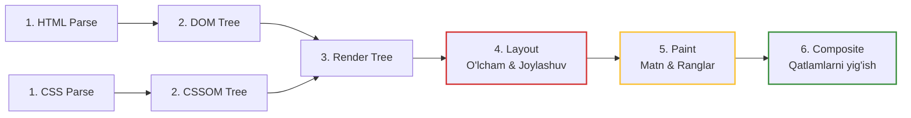

# Rendering Pipeline (Brauzer Rendering Jarayoni)

> [!IMPORTANT]
> **Nima uchun muhim?**  
> Dasturchilar yozgan HTML, CSS va JS kodlarini brauzer qanday qilib ekranda biz ko'rib turgan chiroyli ranglar va shakllarga aylantirishi (Rendering) haqida ko'pincha o'ylashmaydi. Agar siz bu jarayonni (Rendering Pipeline) bilmasangiz, tasodifan juda sekin ishlaydigan animatsiyalar yozib qo'yasiz yoki sahifa yuklanganda elementlarning sakrashiga (Layout Shifts) sababchi bo'lasiz. Ushbu quvurning ishlash mexanizmini tushunish — 60 FPS (soniyada 60 kadr) tezlikdagi silliq animatsiyalar yaratishning kalitidir.

## 🟢 Junior (Asoslar va Tushunchalar)

### Terminologiya
**Rendering Pipeline** — bu brauzerning kodlarni ekrandagi haqiqiy rasm (piksel) larga aylantirish fabrikasidir. U 5 ta asosiy qadamdan iborat: **Parse** -> **Style** -> **Layout** -> **Paint** -> **Composite**.

### Nima uchun kerak?
Brauzer siz yozgan kodni birdaniga ko'ra olmaydi. U avval matnni o'qiydi, keyin unga qoidalar qo'llaydi, keyin uni ekranda qayerda turishini o'lchaydi va oxiri chizadi. Buni bilish orqali qaysi qadam ko'p vaqt (qotish) olishini tushunib olasiz.

> [!NOTE]
> **Hayotiy o'xshatish: "Uy qurish loyihasi"**  
> HTML, CSS va JS kodlarini piksellarga aylantirish — uy qurish jarayoniga o'xshaydi:
> - **DOM va CSSOM (Xomashyo va chizmalar):** HTML — g'ishtlar va xomashyolar (DOM). CSS — ranglar va dizayn chizmalari (CSSOM).
> - **Render Tree (Reja):** Qaysi g'isht qayerga qo'yilishi va qaysi rangga bo'yalishini ko'rsatuvchi yakuniy qurilish rejasi. (Masalan: ko'rinmaydigan - `display: none` bo'lganlar rejadan chiqarib tashlanadi).
> - **Layout (O'lchash va joylashtirish):** Har bir g'ishtning aniq o'lchami va koordinatasini (enini, bo'yini, joylashuvini) ruletkada o'lchab chiqish.
> - **Paint (Bo'yash):** Xonalarning devorlarini rangga bo'yash, matnlarni chizish.
> - **Composite (Qatlamlarni yig'ish):** Alohida qatlamlarni (masalan, oyna ustiga parda) bir-birining ustiga to'g'ri joylashtirib uyni yakunlash.

### Sodda Misol
Agar siz elementning bo'yini (`height`) o'zgartirsangiz, ruletka bilan qaytadan o'lchash (Layout) ga to'g'ri keladi va uyning qolgan barcha narsalari yana chizib chiqiladi. Bu kompyuterni juda qiynaydi.

---

## 🟡 Middle (Amaliyot va Detallar)

### Qanday ishlaydi? (Bosqichma-bosqich)

1. **Parse HTML:** Brauzer HTML ni o'qib undan **DOM Tree** (tugunlar daraxti) yasaydi.
2. **Parse CSS:** Brauzer CSS ni o'qib undan **CSSOM Tree** yasaydi.
3. **Render Tree:** Ikkala daraxt qo'shiladi. Bu yerda faqat ko'rinadigan narsalar qoladi. (Head qismi yoki `display: none` bo'lgan elementlar bu daraxtda bo'lmaydi. Lekin `visibility: hidden` qoladi, chunki u joy egallaydi).
4. **Layout (Reflow):** Ekranning qayerida va qanday kattalikda turishi hisoblanadi (px, %, em).
5. **Paint:** Har bir tugun uchun soyalar, ranglar, gradientlar (pixels) tayyorlanadi. 
6. **Composite:** Turli qatlamlar (layers) ni z-index va boshqa qoidalarga asosan biriktirilib ekranga uzatiladi.

### Ko'p uchraydigan xatolar va muammolar (Pitfalls)

**1. CSS yuklanishi (Render-Blocking)**
CSS brauzerni kutishga majbur qiladi (Render-Blocking). Agar `<link rel="stylesheet">` hajmi juda katta bo'lsa, ekran oq bo'lib turaveradi. Shuning uchun "Critical CSS" degan tushuncha bor - eng kerakli qismini `<style>` qilib ichkariga yozish kerak.

**2. JS ni Headerda yuklash (Parser-Blocking)**
Agar `<script>` tegi HTML ning `<head>` qismiga shunchaki qo'yilsa, brauzer HTML chizishni to'xtatib JS ni yuklashni kutadi.
```html
<!-- YOMON (Kutib turadi) -->
<script src="app.js"></script> 

<!-- YAXSHI (Parallel yuklaydi) -->
<script src="app.js" defer></script> 
```

**3. Animatsiyalarda Layout ni tebratish**
Margin, width yoki left kabi xususiyatlarni CSS da animatsiya qilmang. Bu har bir millisekundda Layout, Paint bosqichlarini qayta ishga tushiraveradi.
```css
/* YOMON ANIMATSIYA (Juda qotadi) */
.box {
  animation: move 1s;
}
@keyframes move {
  to { left: 100px; width: 200px; }
}

/* YAXSHI ANIMATSIYA (GPU orqali yumshoq ishlaydi) */
@keyframes moveGood {
  to { transform: translateX(100px) scaleX(2); }
}
```

## Eng Yaxshi Amaliyotlar (Best Practices)
- **Animatsiyalar uchun faqat Transform va Opacity ishlating:** Bu xususiyatlar Layout va Paint bosqichlaridan sakrab o'tib, to'g'ridan-to'g'ri oxirgi **Composite** bosqichida GPU tomonidan qayta ishlanadi. Shuning uchun ular 60 FPS da qotmasdan ishlaydi.
- **Layout Thrashing dan saqlaning:** JS orqali avval `el.style.width = '10px'` deb yozib, so'ng darhol `console.log(el.clientWidth)` qilsangiz, brauzer majburan barcha bosqichlarni o'sha zahoti hisoblab chiqadi. Yozish va o'qish amallarini aralashtirmang!

---

## 🔴 Senior (Arxitektura va Optimallashtirish)

### "Under the hood" (Qopqoq ostida nimalar ro'y beradi)
V8 dvigateli va Blink (Brauzer engine) ishlashi:
Main Thread (Asosiy oqim) bir o'zi JS, Layout va Paint ni bajaradi. Agar JS hisoblashingiz 16.6ms dan ko'p vaqt olsa (60 FPS uchun chegara), brauzer chizishga ulgurmaydi va kadrlar tushib qoladi (Jank/Stuttering).
`transform` va `opacity` ishlatganda nima bo'ladi? Bu o'zgarishlar Main Thread da emas, balki **Compositor Thread** da (ko'pincha GPU yordamida) alohida hisoblanadi. Shuning uchun Main Thread JS logic bilan to'lib yotsa ham, animatsiya tekis davom etaveradi.

### Layer Architecture (Qatlamlar va will-change)
Agar siz qaysidir element alohida qatlam (Layer) da bo'lishini xohlasangiz, `will-change: transform` kabi xususiyatlar berasiz. Ammo!
```css
/* XAVFLI: Hech qachon hamma narsaga will-change bermang! */
* { will-change: transform; }
```
Har bir qatlam (Layer) RAM va VRAM (Video xotira) da qo'shimcha joy egallaydi. Katta jadvallardagi minglab elementlarga qatlam ochsangiz, brauzer Memory Limitga tushib "Crash" (Qulash) berishi kafolatlanadi. `will-change` ni faqat qachonki user hover qilganda JS orqali ulab, animatsiya tugashi bilan olib tashlash eng professional usul hisoblanadi.

### Intervyu Savollari (Qiyin daraja)
**1. CSSOM daraxti nega aynan daraxt strukturada saqlanadi?**
*Javob:* Ota element qoidalari bolalariga "Meros" (Cascade / Inheritance) bo'lib o'tishi kerakligi sababli daraxt tuzilmasi eng optimal yo'l. Shuningdek har safar CSS o'zgarganda faqat o'sha o'zgargan tugun va uning bolalarinigina tekshirish (recalculate) osonroq bo'ladi.

**2. requestAnimationFrame (rAF) nima va nega setTimeout dan afzal?**
*Javob:* Animatsiyalarni JS orqali qilishda `setTimeout(fn, 16)` ishlatish - qotishga olib keladi, chunki timeout brauzer qachon ekranni yangilashini (refresh rate) bilmaydi. `requestAnimationFrame` esa brauzer bilan sinxronlashgan. U har doim navbatdagi Frame (Paint) boshlanishidan biroz oldin ishlaydi, shuning uchun ekranda ko'zdan qochgan kadrlarsiz (tear/jank siz) silliq harakat paydo bo'ladi.

### Vizualizatsiya (Rendering Pipeline)

*Eslatma: Qizil quti og'ir, Yashil quti tezkor jarayon!*

---

## Xulosa

| Daraja | Yondashuv va Fokus | Nimalarga qodir bo'lish kerak? |
| --- | --- | --- |
| **Junior** | **Mantiq:** CSS, HTML va DOM qanday birikishini biladi. | Skriptlarni sahifa oxiriga qo'yishni yoki `defer` ishlatishni odat qilgan. `display: none` ning ishlashini biladi. |
| **Middle** | **Qo'llash:** Animatsiyalar va CSS ishlashini optimallashtiradi. | Layout Shift lardan qochadi. Hover animatsiyalarida qat'iy ravishda `margin` o'rniga `transform` ishlata oladi. Layout thrashing dan ogoh. |
| **Senior** | **Arxitektura & V8:** Compositor va Main Thread munosabatlari, GPU Layer lari. | DevTools orqali FPS larni (Performance profiling) o'lchay oladi, `requestAnimationFrame` ni qo'lda boshqaradi va `will-change` ni RAM ga zarar yetkazmasdan ishlata oladi. |
