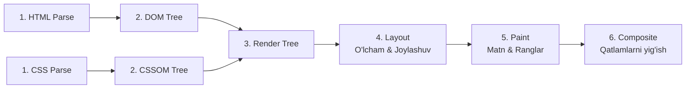

# Rendering Pipeline - Brauzer Rendering Jarayoni

## Kirish

> [!IMPORTANT]
> **Nima uchun muhim?**  
> Dasturchilar yozgan HTML, CSS va JS kodlarini brauzer qanday qilib ekranda biz ko'rib turgan chiroyli ranglar va shakllarga aylantirishi (Rendering) haqida o'ylashmaydi. Agar siz bu jarayonni (Rendering Pipeline) bilmasangiz, tasodifan juda sekin ishlaydigan animatsiyalar yozib qo'yasiz yoki sahifa yuklanganda elementlarning sakrashiga (Layout Shifts) sababchi bo'lasiz. Ushbu quvurning ishlash mexanizmini tushunish — 60 FPS (soniyada 60 kadr) tezlikdagi silliq animatsiyalar yaratishning kalitidir.

> [!NOTE]
> **Real-hayot analogiyasi: "Uy qurish loyihasi (Pixel Pipeline)"**  
> HTML, CSS va JS kodlarini piksellarga aylantirish — uy qurish jarayoniga o'xshaydi:
> - **DOM va CSSOM (Xomashyo va chizmalar):** HTML — g'ishtlar va xomashyolar (DOM). CSS — ranglar va dizayn chizmalari (CSSOM).
> - **Render Tree (Reja):** Qaysi g'isht qayerga qo'yilishi va qaysi rangga bo'yalishini ko'rsatuvchi yakuniy qurilish rejasi (ko'rinmaydigan elementlar, masalan `display: none` bo'lganlar, bu rejadan chiqarib tashlanadi).
> - **Layout (O'lchash va joylashtirish):** Har bir g'ishtning aniq o'lchami va koordinatasini (enini, bo'yini, joylashuvini) o'lchash.
> - **Paint (Bo'yash):** Devorlarni rangga bo'yash, matnlarni chizish.
> - **Composite (Qatlamlarni yig'ish):** Alohida qatlamlarni (masalan, shisha oynalar, eshiklar) bir-birining ustiga to'g'ri joylashtirib uyni yakunlash.

---

---

## Rendering Pipeline Bosqichlari


*Bosqichlarning har biri millisekundlar yoki mikrosoniyalar ichida optimal bajarilishi shart.*

---

## 1. HTML Parsing va DOM Construction

### Jarayon
```
HTML bytes → Characters → Tokens → Nodes → DOM Tree
```

### Misol
```html
<!DOCTYPE html>
<html>
<head>
    <title>Sahifa</title>
</head>
<body>
    <div class="container">
        <h1>Salom</h1>
        <p>Matn</p>
    </div>
</body>
</html>
```

### DOM Tree Natijasi
```
Document
└── html
    ├── head
    │   └── title
    │       └── "Sahifa"
    └── body
        └── div.container
            ├── h1
            │   └── "Salom"
            └── p
                └── "Matn"
```

### Blocking Behavior
```html
<!-- MUAMMO: Script parsing'ni to'xtatadi -->
<head>
    <script src="analytics.js"></script> <!-- Blocking! -->
</head>

<!-- YECHIM 1: defer - DOM tayyor bo'lgach execute -->
<script src="analytics.js" defer></script>

<!-- YECHIM 2: async - download parallel, execute immediately -->
<script src="analytics.js" async></script>

<!-- YECHIM 3: body oxirida -->
<body>
    <!-- content -->
    <script src="analytics.js"></script>
</body>
```

### Script Loading Comparison
```
defer:
HTML:  ====|parsing|===============|parsing|====|DOMContentLoaded|
JS:              |download|                 |execute|

async:
HTML:  ====|parsing|=====|blocked|===|parsing|===|DOMContentLoaded|
JS:              |download|     |execute|

blocking (default):
HTML:  ====|parsing|=====|blocked|=====|blocked|====|parsing|====
JS:              |download|      |execute|
```

---

## 2. CSS Parsing va CSSOM Construction

### Jarayon
```
CSS bytes → Characters → Tokens → Nodes → CSSOM Tree
```

### Misol
```css
body {
    font-size: 16px;
}

.container {
    width: 100%;
    max-width: 1200px;
}

.container h1 {
    font-size: 2em;
    color: #333;
}
```

### CSSOM Tree
```
StyleSheetList
└── CSSStyleSheet
    └── CSSRuleList
        ├── CSSStyleRule (body)
        │   └── font-size: 16px
        ├── CSSStyleRule (.container)
        │   ├── width: 100%
        │   └── max-width: 1200px
        └── CSSStyleRule (.container h1)
            ├── font-size: 2em
            └── color: #333
```

### CSS Render-Blocking
```html
<!-- MUAMMO: CSS render-blocking -->
<head>
    <link rel="stylesheet" href="huge-framework.css"> <!-- ~500KB -->
</head>

<!-- YECHIM: Critical CSS inline -->
<head>
    <style>
        /* Critical above-the-fold CSS */
        body { margin: 0; font-family: sans-serif; }
        .header { height: 60px; background: #fff; }
    </style>
    <link rel="stylesheet" href="full.css" media="print" onload="this.media='all'">
</head>
```

### Media Query Optimization
```html
<!-- Faqat kerakli CSS yuklanadi -->
<link rel="stylesheet" href="base.css">
<link rel="stylesheet" href="desktop.css" media="(min-width: 1024px)">
<link rel="stylesheet" href="print.css" media="print">
```

---

## 3. Render Tree Construction

### Jarayon
DOM + CSSOM = Render Tree

### Muhim Qoidalar
1. **Ko'rinmas elementlar qo'shilmaydi:**
   - `display: none` - Render Tree'da YO'Q
   - `visibility: hidden` - Render Tree'da BOR (joy egallaydi)

2. **Pseudo-elements qo'shiladi:**
   - `::before`, `::after` - Render Tree'da BOR

3. **Head, script, meta** - Render Tree'da YO'Q

### Misol
```html
<body>
    <div class="visible">Ko'rinadi</div>
    <div class="hidden" style="display: none">Ko'rinmaydi</div>
    <div class="invisible" style="visibility: hidden">Joy egallaydi</div>
</body>
```

```
Render Tree:
└── RenderBody
    ├── RenderBlock (div.visible)
    │   └── RenderText "Ko'rinadi"
    └── RenderBlock (div.invisible)  ← visibility:hidden BOR!
```

### Computed Styles
```javascript
// Har bir element uchun computed style hisoblanadi
const element = document.querySelector('.container');
const styles = window.getComputedStyle(element);

console.log(styles.width);      // "1200px" (max-width hisoblanib)
console.log(styles.fontSize);   // "16px" (inherited from body)
console.log(styles.display);    // "block" (default)
```

---

## 4. Layout (Reflow)

### Vazifasi
Har bir elementning ANIQ pozitsiyasi va o'lchami hisoblanadi.

### Box Model Calculation
```css
.box {
    width: 100px;
    padding: 20px;
    border: 5px solid;
    margin: 10px;
}
```

```
┌─────────────────────────────────┐
│           margin: 10px          │
│  ┌──────────────────────────┐  │
│  │      border: 5px         │  │
│  │  ┌────────────────────┐  │  │
│  │  │   padding: 20px    │  │  │
│  │  │  ┌──────────────┐  │  │  │
│  │  │  │ content:100px│  │  │  │
│  │  │  └──────────────┘  │  │  │
│  │  └────────────────────┘  │  │
│  └──────────────────────────┘  │
└─────────────────────────────────┘

Actual width = 100 + 40 + 10 = 150px (content + padding*2 + border*2)
```

### Layout Process
```javascript
// Layout trigger qiladigan operatsiyalar
element.offsetWidth;      // READ - layout trigger
element.offsetHeight;     // READ - layout trigger
element.getBoundingClientRect(); // READ - layout trigger

element.style.width = '200px';   // WRITE - layout pending
element.style.height = '100px';  // WRITE - layout pending
// Next read triggers layout calculation
```

### Layout Boundaries
```css
/* Layout scope ni cheklash */
.widget {
    contain: layout; /* Bu element ichidagi o'zgarish tashqariga ta'sir qilmaydi */
}

/* Butun containment */
.isolated {
    contain: strict; /* layout + paint + size + style */
}
```

---

## 5. Paint

### Vazifasi
Har bir pikselning rangi aniqlanadi (text, colors, images, borders, shadows).

### Paint Layers
```css
/* Yangi paint layer yaratadigan properties */
.layer-trigger {
    position: fixed;      /* new stacking context */
    position: sticky;     /* new stacking context */
    opacity: 0.99;        /* opacity < 1 */
    transform: translateZ(0); /* 3D transform */
    will-change: transform;   /* explicit hint */
    filter: blur(5px);    /* filter */
    mix-blend-mode: multiply; /* blend mode */
}
```

### Paint Order
```
1. Background color
2. Background image
3. Border
4. Children (recursively)
5. Outline
```

### Misol - Paint Debug
```javascript
// DevTools Console'da
// 1. More Tools → Rendering → Paint flashing ON
// 2. Qizil joylarda repaint bo'lyapti

// Paint trigger qilmaslik uchun
// YOMON:
element.style.backgroundColor = 'red'; // Paint trigger

// YAXSHI (agar animatsiya kerak):
element.style.transform = 'scale(1.1)'; // Composite only
element.style.opacity = '0.5';          // Composite only
```

---

## 6. Composite

### Vazifasi
Layerlarni to'g'ri tartibda birlashtirish va GPU'ga yuborish.

### Layer Architecture
```
┌─────────────────────────────────────────┐
│              Root Layer                 │
│  ┌───────────────────────────────────┐ │
│  │          Background Layer         │ │
│  │  ┌─────────────────────────────┐ │ │
│  │  │      Content Layer          │ │ │
│  │  │  ┌───────────────────────┐ │ │ │
│  │  │  │   Fixed Header Layer  │ │ │ │
│  │  │  └───────────────────────┘ │ │ │
│  │  │  ┌───────────────────────┐ │ │ │
│  │  │  │   Animated Element    │ │ │ │
│  │  │  │   (GPU Layer)         │ │ │ │
│  │  │  └───────────────────────┘ │ │ │
│  │  └─────────────────────────────┘ │ │
│  └───────────────────────────────────┘ │
└─────────────────────────────────────────┘
```

### GPU Accelerated Properties
```css
/* BU XOSSALAR FAQAT COMPOSITE TRIGGER QILADI - ENG TEZKOR */
.gpu-accelerated {
    transform: translateX(100px);  /* position */
    transform: scale(1.5);         /* size */
    transform: rotate(45deg);      /* rotation */
    opacity: 0.5;                  /* transparency */
}

/* BU XOSSALAR PAINT + COMPOSITE TRIGGER QILADI */
.paint-trigger {
    background-color: red;
    color: blue;
    box-shadow: 0 2px 4px rgba(0,0,0,0.1);
}

/* BU XOSSALAR LAYOUT + PAINT + COMPOSITE TRIGGER QILADI */
.layout-trigger {
    width: 200px;
    height: 100px;
    padding: 20px;
    margin: 10px;
    top: 50px;
    left: 100px;
    font-size: 18px;
}
```

---

## To'g'ri va Noto'g'ri Misollar

### Animatsiya

```css
/* NOTO'G'RI: Layout trigger har frame */
@keyframes move-bad {
    from { left: 0; top: 0; }
    to { left: 100px; top: 100px; }
}

/* TO'G'RI: Faqat composite */
@keyframes move-good {
    from { transform: translate(0, 0); }
    to { transform: translate(100px, 100px); }
}
```

### Modal Animation

```css
/* NOTO'G'RI: height animatsiya = layout har frame */
.modal-bad {
    height: 0;
    overflow: hidden;
    transition: height 0.3s;
}
.modal-bad.open {
    height: 400px;
}

/* TO'G'RI: transform + opacity */
.modal-good {
    transform: scale(0.95);
    opacity: 0;
    transition: transform 0.3s, opacity 0.3s;
}
.modal-good.open {
    transform: scale(1);
    opacity: 1;
}
```

### Scroll Performance

```javascript
// NOTO'G'RI: Har scroll event'da DOM o'zgarish
window.addEventListener('scroll', () => {
    const scrollY = window.scrollY;
    document.querySelector('.parallax').style.top = scrollY * 0.5 + 'px';
});

// TO'G'RI: transform + requestAnimationFrame
let ticking = false;
window.addEventListener('scroll', () => {
    if (!ticking) {
        requestAnimationFrame(() => {
            const scrollY = window.scrollY;
            document.querySelector('.parallax').style.transform =
                `translateY(${scrollY * 0.5}px)`;
            ticking = false;
        });
        ticking = true;
    }
});
```

---

## Real-World Case: CSS Animation Lag

### Muammo
```css
/* Sekin animatsiya - har frame layout */
.card-hover-bad {
    transition: all 0.3s;
}
.card-hover-bad:hover {
    margin-top: -10px;      /* Layout! */
    box-shadow: 0 10px 20px rgba(0,0,0,0.2); /* Paint! */
}
```

### Diagnoz
1. DevTools → Performance → Record
2. Hover qiling
3. "Layout" va "Paint" vaqtini tekshiring
4. 16ms dan oshsa = jank

### Yechim
```css
/* Tez animatsiya - faqat composite */
.card-hover-good {
    transition: transform 0.3s, box-shadow 0.3s;
    will-change: transform; /* GPU layer yaratadi */
}
.card-hover-good:hover {
    transform: translateY(-10px); /* Composite only! */
    box-shadow: 0 10px 20px rgba(0,0,0,0.2);
}

/* will-change ni dinamik qo'shish (optimal) */
.card-hover-optimal {
    transition: transform 0.3s;
}
.card-hover-optimal:hover {
    transform: translateY(-10px);
}
```

```javascript
// will-change ni faqat kerak paytda qo'shish
const cards = document.querySelectorAll('.card');
cards.forEach(card => {
    card.addEventListener('mouseenter', () => {
        card.style.willChange = 'transform';
    });
    card.addEventListener('mouseleave', () => {
        // Animatsiya tugagach olib tashlash
        setTimeout(() => {
            card.style.willChange = 'auto';
        }, 300);
    });
});
```

---

## Interview Savollari

### 1. Savol: Rendering pipeline bosqichlarini tushuntiring
**Javob:**
1. **Parse** - HTML/CSS tokenizatsiya va parsing
2. **Style** - CSS selektorlar matching, computed styles
3. **Layout** - Geometriya hisoblash (position, size)
4. **Paint** - Piksel ranglari (text, images, borders)
5. **Composite** - Layerlarni GPU'da birlashtirish

Optimal animatsiya faqat **Composite** bosqichini trigger qiladi (`transform`, `opacity`).

### 2. Savol: Nima uchun `transform: translateX()` `left` dan tezroq?
**Javob:**
- `left` o'zgarganda: Layout → Paint → Composite (barcha bosqichlar)
- `transform` o'zgarganda: Faqat Composite (GPU'da)

`transform` asosiy thread'ni band qilmaydi, GPU parallel ishlaydi.

### 3. Savol: Render Tree va DOM Tree farqi nima?
**Javob:**
- **DOM Tree** - HTML struktura, barcha elementlar
- **Render Tree** - Faqat ko'rinadigan elementlar + computed styles
  - `display: none` → Render Tree'da YO'Q
  - `visibility: hidden` → Render Tree'da BOR
  - `<head>`, `<script>` → Render Tree'da YO'Q

### 4. Savol: CSSOM nima va nima uchun render-blocking?
**Javob:**
CSSOM (CSS Object Model) - CSS qoidalarining daraxt strukturasi.

**Render-blocking chunki:**
1. Render Tree = DOM + CSSOM
2. CSSOM to'liq bo'lmaguncha Render Tree qurib bo'lmaydi
3. CSSOM bo'lmasa Flash of Unstyled Content (FOUC) bo'ladi

**Yechim:** Critical CSS inline, qolganini async yuklash.

### 5. Savol: 60fps uchun har frame necha ms?
**Javob:**
- 1000ms / 60 frames = **16.67ms** per frame
- JavaScript + Rendering < 10ms bo'lishi kerak
- Qolgan 6ms = browser overhead

```javascript
// Frame budget monitoring
const start = performance.now();
// ... kod ...
const duration = performance.now() - start;
if (duration > 10) {
    console.warn(`Frame budget exceeded: ${duration}ms`);
}
```

---

## Performance Tips

### 1. Layout Thrashing Oldini Olish
```javascript
// Avval READ, keyin WRITE
function batchDOMOperations(elements) {
    // READ phase
    const measurements = elements.map(el => ({
        width: el.offsetWidth,
        height: el.offsetHeight
    }));

    // WRITE phase
    elements.forEach((el, i) => {
        el.style.transform = `scale(${measurements[i].width / 100})`;
    });
}
```

### 2. Contain Property
```css
/* Layout scope cheklash */
.widget {
    contain: layout style paint;
}

/* Content-visibility (lazy rendering) */
.below-fold {
    content-visibility: auto;
    contain-intrinsic-size: 0 500px;
}
```

### 3. requestAnimationFrame
```javascript
// DOM o'zgarishlarni bir frame'ga jamlash
let scheduled = false;
const changes = [];

function scheduleUpdate(element, property, value) {
    changes.push({ element, property, value });

    if (!scheduled) {
        scheduled = true;
        requestAnimationFrame(() => {
            changes.forEach(({ element, property, value }) => {
                element.style[property] = value;
            });
            changes.length = 0;
            scheduled = false;
        });
    }
}
```

### 4. CSS Animation vs JavaScript Animation
```css
/* CSS - Compositor thread'da */
.css-animate {
    animation: slide 0.3s ease-out;
}

@keyframes slide {
    from { transform: translateX(-100%); }
    to { transform: translateX(0); }
}
```

```javascript
// JavaScript - Main thread'da (faqat murakkab logic kerak bo'lsa)
element.animate([
    { transform: 'translateX(-100%)' },
    { transform: 'translateX(0)' }
], {
    duration: 300,
    easing: 'ease-out',
    fill: 'forwards'
});
```

### 5. Layer Management
```css
/* Keraksiz layer yaratmang */
.bad {
    /* 1000 ta element, 1000 ta layer = memory issue */
    will-change: transform;
}

/* Faqat animatsiya paytida */
.good {
    /* Default: no layer promotion */
}
.good.animating {
    will-change: transform;
}
```

---

## Debugging Workflow

### 1. Performance Panel
```
1. DevTools → Performance
2. Record (reload yoki interaction)
3. Analyze:
   - Yellow = JavaScript
   - Purple = Layout (Recalculate Style + Layout)
   - Green = Paint
   - Composite = ko'k
```

### 2. Layers Panel
```
1. DevTools → More Tools → Layers
2. 3D view
3. Har layer uchun:
   - Compositing reasons
   - Memory usage
   - Paint count
```

### 3. Rendering Panel
```
1. DevTools → More Tools → Rendering
2. Enable:
   - Paint flashing (qizil = repaint)
   - Layout Shift Regions (ko'k = layout shift)
   - Layer borders (sariq = composited layers)
```

---

## Eng Yaxshi Amaliyotlar (Best Practices)

1. **Animatsiyalar uchun faqat Transform va Opacity ishlating:** Har qanday siljish (top, left, margin) yoki kattalashish (width, height) animatsiyalari butun pipeline'ni (Layout, Paint, Composite) qayta ishga tushiradi. `transform` (scale, translate) va `opacity` esa faqatgina **Composite** bosqichini chaqiradi va GPU (video karta) yordamida juda silliq ishlaydi.
2. **will-change atributini ehtiyotkorlik bilan ishlating:** `will-change` brauzerga "bu element yaqinda o'zgaradi, unga GPU layer yarat" deb aytadi. Biroq, har bir elementga `will-change` berish video xotirani (VRAM) to'ldirib, saytni yanada sekinlashtirib yuboradi. Faqatgina rostdan ham muammo bo'layotgan og'ir animatsiyali elementlarga bering va u tugagach CSS'dan o'chiring.
3. **DOM elementlari sonini kamaytiring:** DOM daraxti qanchalik katta bo'lsa, Layout va Paint bosqichlari shunchalik og'ir va uzoq davom etadi. Sahifadagi umumiy elementlar soni 1500 tadan oshib ketmasligini nazorat qilib boring.

---

## Xulosa

Rendering Pipeline bosqichlari va optimallashtirish xulosasi:

| Bosqich (Pipeline) | Nima sabab bo'ladi? | Tizim yuki (Cost) | Optimallashtirish |
| --- | --- | --- | --- |
| **Parse (O'qish)** | HTML/CSS yuklanganda | O'rtacha | CSS/HTML ni qisqartirish, minifitsiya qilish |
| **Style (Uslub)** | Class/Style o'zgarishi | Kam | CSS selectorlarini oddiyroq qilish |
| **Layout (Joylashuv)**| Geometriya (`width`, `height`, `left`) o'zgarishi | 🔴 **Juda Yuqori** | O'lchamlarni o'zgartirmaslik, `transform` ishlatish |
| **Paint (Chizish)** | Ranglar, soyalar, matn o'zgarishi | O'rtacha-Yuqori | Og'ir shadow (`box-shadow`) va gradientlarni kamaytirish |
| **Composite (Yig'ish)**| Qatlamlar joylashuvi (`transform`, `opacity`) |  **Juda Kam** | Animatsiyalarni faqat GPU qatlamida qilish |
