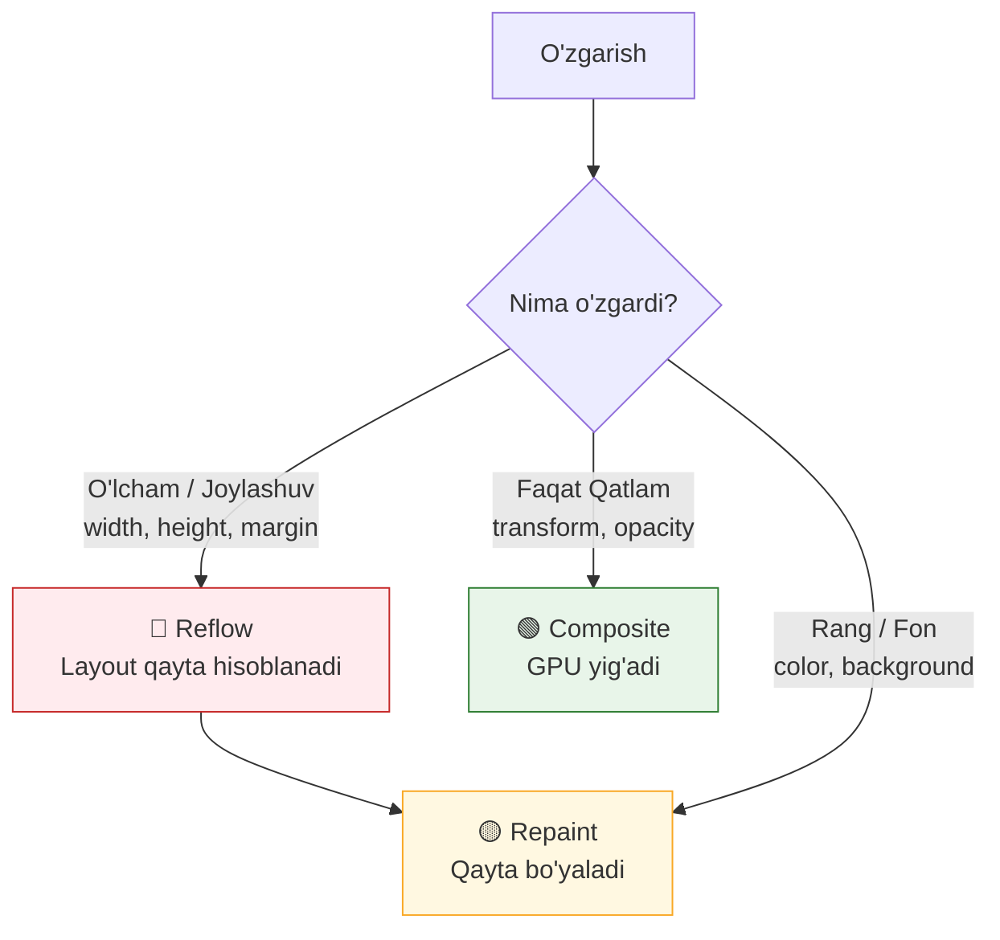

# Reflow va Repaint (Qayta hisoblash va Qayta chizish)

> [!IMPORTANT]
> **Nima uchun muhim?**  
> Dasturchi sifatida sahifadagi bitta matn rangini o'zgartirish (Repaint) va element o'lchamini o'zgartirish (Reflow) orasidagi farqni bilish loyihangizning ishlash tezligini (performance) aniqlaydi. Ko'pincha, JS kodi ichida o'lchamlarni tinimsiz o'qib, keyin yozish (Layout Thrashing) brauzerning har bir kadrda qayta-qayta hisoblash ishlarini bajarishiga olib keladi va bu sahifani butunlay muzlatib (qotirib) qo'yadi. Reflow va Repaint tushunchalarini chuqur bilish bu og'ir jarayonlarning oldini olishga yordam beradi.

## 🟢 Junior (Asoslar va Tushunchalar)

### Terminologiya
- **Reflow (Layout):** Elementning bo'yi, eni yoki joylashuvi o'zgarganda brauzer barcha narsani o'lchamini qaytadan hisoblab chiqish jarayoni.
- **Repaint (Paint):** Elementning rangi yoki fon rasmi o'zgarganda brauzer uni piksellarda qaytadan bo'yab chiqish jarayoni.

### Nima uchun kerak?
Brauzer siz aytgan o'zgarishlarni darhol ekranda ko'rsatishi kerak. Shuning uchun u doim nimadir o'zgarsa ekran yangilanadigan mexanizmga ega.

> [!NOTE]
> **Hayotiy o'xshatish: "Sahnadagi dekoratsiyalar"**  
> Tasavvur qiling, siz teatr sahnasini bezayapsiz.  
> - **Repaint (Pardozlash/Bo'yash):** Sahnadagi bitta stulning rangini qizildan yashilga o'zgartirdingiz. Barcha narsalar o'z joyida turibdi, faqatgina bo'yoq o'zgardi. Bu oson va tez bitadi.
> - **Reflow (Qayta joylashtirish):** Siz stulni olib o'rniga kattaroq stol qo'ydingiz. Endi boshqa barcha mebellarni joyini surish kerak bo'ladi, chunki yangi stol hammaga xalaqit qilyapti. Barcha mebellarni yangi joylashuv koordinatalarini o'lchab qayta taxlash — juda og'ir va vaqt talab qiladi.

### Sodda Misol

```javascript
const quti = document.querySelector('.quti');

// 1. Faqat REPAINT (Yengil jarayon)
quti.style.backgroundColor = 'blue';
quti.style.color = 'white';

// 2. REFLOW (Og'ir jarayon, chunki o'lcham va joylashuv o'zgaradi)
quti.style.width = '200px'; 
quti.style.margin = '20px'; 
```

---

## 🟡 Middle (Amaliyot va Detallar)

### Qanday ishlaydi? (Qaysi CSS Reflow beradi?)
Brauzer "Piksel quvuri" da Reflow har doim Repaint ni o'zi bilan ergashtirib keladi. Ya'ni Reflow bo'lsa orqasidan aniq Repaint bo'ladi. Lekin Repaint bo'lsa Reflow bo'lishi shart emas.

| Xususiyat guruhi | Trigger (Nima ishga tushadi?) | Misollar |
| --- | --- | --- |
| Geometriya | **Reflow + Repaint** | `width`, `height`, `margin`, `padding`, `display`, `position` |
| Tashqi ko'rinish | **Faqat Repaint** | `color`, `background`, `border-color`, `visibility` |
| Qatlamlar (Compositing)| **Ikkalasi ham EMAS** | `transform` (scale, translate), `opacity` |

### Ko'p uchraydigan xatolar va muammolar (Pitfalls)

**Layout Thrashing (Eng yomon amaliyot)**
Agar siz For sikli ichida (yoki oddiy kodda) navbatma-navbat uqish va yozish amallarini qilsangiz brauzer "Layout Thrashing" (Qayta-qayta ruletkada o'lchash) kasaliga chalinadi.

```javascript
const qutilar = document.querySelectorAll('.quti');

// XATO (Layout Thrashing): 
// O'qib, srazi yozib, yana o'qib, srazi yozish...
for (let i = 0; i < qutilar.length; i++) {
  const eni = qutilar[i].offsetWidth; // O'QISH
  qutilar[i].style.width = eni + 10 + 'px'; // YOZISH
}

// TO'G'RI (Batched DOM Reads/Writes):
// Avval hammasini bittada o'qib olamiz
const enilar = Array.from(qutilar).map(q => q.offsetWidth);

// Keyin hammasiga bittada yozamiz
for (let i = 0; i < qutilar.length; i++) {
  qutilar[i].style.width = enilar[i] + 10 + 'px';
}
```

## Eng Yaxshi Amaliyotlar (Best Practices)
- **DOM daraxtining pastidan o'zgartiring:** Ota elementlarni o'lchamini o'zgartirish bolalariga ham Reflow beradi. Iloji boricha chuqurroqdagi "barg" (leaf node) larni o'zgartiring.
- **Yashirin holda o'zgartiring:** Elementga katta ko'lamdagi JS o'zgarishlarini qilmoqchi bo'lsangiz uni `display: none` (1 marta Reflow) qilib oling, ichida 100 ta o'zgarish qiling va yana `display: block` (1 marta Reflow) qiling. Shunda 100 ta Reflow dan qutulasiz.
- **Fragment ishlating:** Agar DOM ga 50 ta yangi element qo'shmoqchi bo'lsangiz `document.createDocumentFragment()` dan foydalaning. Bu barchasini RAM da yig'ib 1 martadayoq DOM ga kiritadi.

---

## 🔴 Senior (Arxitektura va Optimallashtirish)

### "Under the hood" (Qopqoq ostida nimalar ro'y beradi)
V8 dvigateli `element.offsetWidth` yoki `element.getBoundingClientRect()` kabi metodlarni chaqirganingiz zahoti **Forced Synchronous Layout (Majburiy Sinxron Layout)** deb nomlangan qoidani ishga tushiradi. U pending (kutib turgan) barcha CSS o'zgarishlarni majburiy hisoblab chiqadi, chunki siz aniq o'lchamni hozir so'rayapsiz. Agar siz buni RequestAnimationFrame (rAF) dan tashqarida qilsangiz, Main Thread bloklanadi.

### FastDOM arxitekturasi va React Virtual DOM
Zamonaviy freymvorklar nima uchun tez degan savolga eng zo'r javob shu — ular **Virtual DOM** da barcha ishlarni bajarib, Reflow ni mutlaqo minimallashtiradi. 
Agar siz freymvorksiz ishlayotgan bo'lsangiz `fastdom` kabi arxitektura yozishingiz kerak. Bu Reads (o'qish) va Writes (yozish) amallarini rAF yordamida ikkita navbatga (Queue) yig'adi.

```javascript
// Oddiy FastDOM yondashuvi:
let oqishlar = [];
let yozishlar = [];

function jadvalgaQoy() {
  requestAnimationFrame(() => {
    oqishlar.forEach(fn => fn()); // Avval faqat oqish
    yozishlar.forEach(fn => fn()); // Keyin yozish
    oqishlar = []; yozishlar = [];
  });
}
```

### CSS Containment (Layout izolyatsiyasi)
Eng tajribali Senior dasturchilar saytning bitta joyidagi Reflow boshqa joyiga ta'sir qilmasligini CSS orqali ta'minlay oladilar. Bu `contain` propertysi yordamida o'ziga xos devor (boundary) yaratish demakdir.

```css
.sidebar {
  /* Sidebar ichida qancha p element qo'shilib/o'chsa ham, main content ga Reflow ta'sir qilmaydi! */
  contain: layout; 
}

/* Yana ham kuchli optimizatsiya (Lazy rendering) */
.footer-articles {
  content-visibility: auto; /* Ekrandan tashqarida bo'lsa umuman Reflow hisoblanmaydi! */
  contain-intrinsic-size: 500px;
}
```

### Intervyu Savollari (Qiyin daraja)
**1. `visibility: hidden` bilan `display: none` farqi nima?**
*Javob:* `visibility: hidden` o'zining geometriyasini (o'lchami va bo'shlig'ini) saqlab qoladi va faqat **Repaint** trigger qiladi. `display: none` esa elementni Render Tree dan butunlay uzib tashlaydi va boshqa elementlarning siljishiga (og'ir **Reflow**) sabab bo'ladi.

**2. Animatsiyalarda nega `top` yoki `left` o'rniga `transform: translate()` ishlatish kerak?**
*Javob:* `top` / `left` geometrik qiymat bo'lib doimiy Reflow beradi (GPU ishtirok etmaydi, protsessor qiynaladi). `transform` esa Composite Layer (Qatlam) o'zgarishi hisoblanadi. U o'z o'lchamini saqlagan holda videokarta (GPU) da rasm kabi siljiydi va hech qachon Reflow/Repaint qilinmaydi (eng arzon).

### Vizualizatsiya (Jarayon oqimi)


---

## Xulosa

| Daraja | Yondashuv va Fokus | Nimalarga qodir bo'lish kerak? |
| --- | --- | --- |
| **Junior** | **Mantiq:** Reflow o'lcham o'zgarishi, Repaint rang o'zgarishi ekanini biladi. | Animatsiya yozganda `width` o'rniga `transform` ni ko'proq yoqtiradi. DOM ni For loop ichida buzmaydi. |
| **Middle** | **Qo'llash:** Layout Thrashing (o'qish va yozish) muammosini oldini oladi. | Batch DOM updates (Hammasini birgalikda o'qib, keyin yozish) qila oladi. Fragment (DocumentFragment) tushunchasini amalda qullaydi. |
| **Senior** | **Arxitektura & V8:** Forced Synchronous Layout mexanizmini va `requestAnimationFrame` sinxronizatsiyasini tushunadi. | CSS da `contain` va `content-visibility` orqali arxitekturaviy reflow to'siqlarini qura oladi. FastDOM strukturasida kod yoza oladi. |
