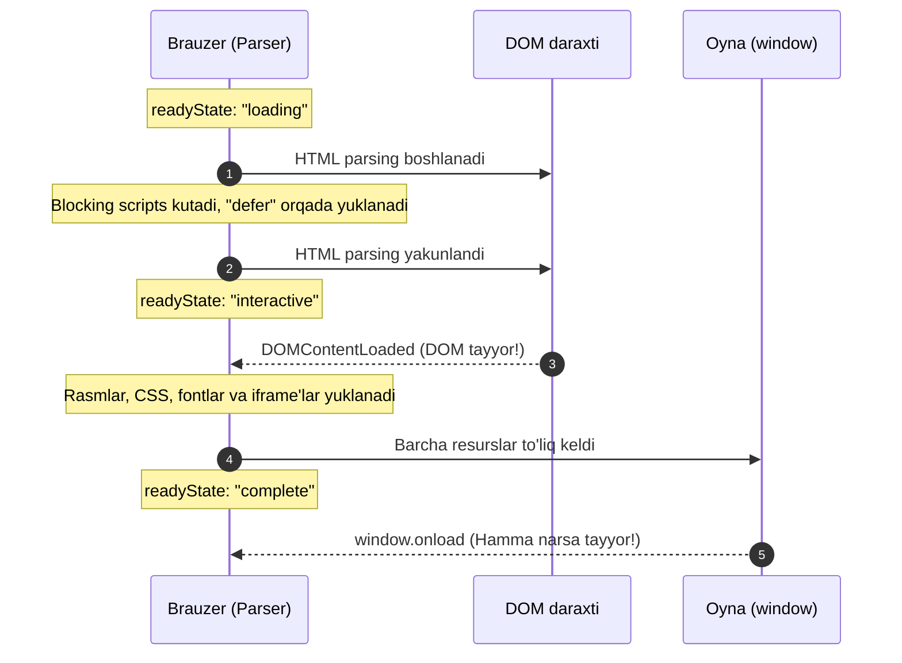

# DOM Lifecycle va Observerlar (Hujjat Hayot Sikli)

> [!IMPORTANT]
> **Nima uchun muhim?**  
> Foydalanuvchi sahifangizni ochganda, skriptlaringiz qachon ishga tushishi va qaysi resurslar qachon yuklanishi sahifaning tezligini belgilaydi. Agar siz `DOMContentLoaded` va `window.onload` farqini bilmasangiz, skriptlaringiz hali rasm va shriftlar yuklanmay turib sahifani muzlatib qo'yishiga yo'l qo'yasiz. Yoki foydalanuvchi sahifadan chiqib ketayotganda ma'lumotlarni saqlab qolish (analytics beacon) mantiqini yozolmasligingiz mumkin. DOM Lifecycle (Hujjat hayot sikli) va zamonaviy Observer APIlarni mukammal bilish — ishonchli va tezkor sahifalar qurish uchun muhimdir.

## 🟢 Junior (Asoslar va Tushunchalar)

### Terminologiya
**DOM Lifecycle** — bu sahifa ochiq turgan vaqtda u bosib o'tadigan bosqichlar. "Yuklanyapti", "DOM yasaldi", "Hamma narsa keldi", "Yopilyapti" degan 4 ta asosiy bekatdan iborat.

> [!NOTE]
> **Hayotiy o'xshatish: "Yangi Uyga Ko'chib O'tish"**  
> Sahifaning yuklanish hayot sikli — yangi uy qurib, unga ko'chib kirishga o'xshaydi:
> - **loading (HTML parse bo'lmoqda):** Uy g'ishtlari terilmoqda va devorlar ko'tarilmoqda.
> - **DOMContentLoaded (DOM tayyor - ko'chib kirish):** Uyni qurib bitirdingiz, kalitni oldingiz va ichkariga kirdingiz. Devorlar bo'yalmagan bo'lishi, mebellar (rasmlar, shriftlar) hali kelmagan bo'lishi mumkin, lekin uydan foydalansa bo'ladi.
> - **window.onload (Hammasi yuklandi):** Barcha mebellar (rasmlar) yetkazildi, devorlar bo'yaldi (CSS chizildi), pardalar taqildi. Uy to'laqonli tayyor.
> - **beforeunload / unload (Ko'chib ketish):** Siz uyni tark etyapapsiz. Chiqishdan oldin chiroqlar o'chganligini tekshirish (ma'lumotlarni saqlash) va eshikni qulflash.

### Sodda Misol (DOMContentLoaded va Load)
```javascript
// 1. Birinchi bu ishlaydi. DOM qurib bo'lindi. (Rasmlar yo'q)
document.addEventListener('DOMContentLoaded', () => {
    const quti = document.querySelector('.quti');
    quti.addEventListener('click', () => alert('Salom'));
});

// 2. Ikkinchi bu ishlaydi. Hamma rasm, CSS kelib bo'ldi.
window.addEventListener('load', () => {
    const rasm = document.querySelector('img');
    console.log("Rasm bo'yi:", rasm.naturalHeight); // Rasm kelgani uchun aniq chiqadi!
});
```

---

## 🟡 Middle (Amaliyot va Detallar)

### Script Loading (Scripts qanday yuklanadi?)
JS fayllarni HTML da ulashning 3 xil mashhur yo'li bor va ular DOM Lifecycle ga to'g'ridan-to'g'ri bog'liq:

1. **`<script src="app.js"></script>` (Standart):** HTML to'xtab qoladi, JS fayl yuklab olinadi, ishlab bo'ladi, keyin HTML davom etadi. (Eski va yomon usul).
2. **`<script src="app.js" async></script>` (Asinxron):** JS fayl fonda yuklanadi. Yuklanib bo'lgan zahoti HTML qayerda to'xtagan bo'lishidan qat'iy nazar uzib qo'yib ishga tushadi. (Bir-biriga bog'liq bo'lmagan mustaqil kodlar — masalan, Google Analytics uchun yaxshi).
3. **`<script src="app.js" defer></script>` (Kechiktirilgan):** JS fayl fonda yuklanadi. Lekin DOM to'liq yasalib bo'lishini kutadi va `DOMContentLoaded` dan salgina oldin tartib bilan ishga tushadi. (Loyihaning asosiy kodi uchun eng zo'ri!)

### O'zgarishlarni kuzatish (Observer API)
Bizda sahifani qiynamasdan uni kuzatib turuvchi 3 ta ajoyib kuzatuvchi (Observer) bor:

**1. IntersectionObserver (Ekranda ko'rindimi?)**
Element sahifada (viewport) ko'rinishni boshlaganida aytib beradi. Lazy loading (scroll qilganda rasmlar chiqishi) yoki Infinite Scroll (pastga tushganda yangi postlar yuklanishi) uchun eng zo'r vosita.
```javascript
const qorovul = new IntersectionObserver((entries) => {
    entries.forEach(entry => {
        if (entry.isIntersecting) {
            console.log("Rasm ekranda ko'rindi, rasmni yuklaymiz!");
            entry.target.src = entry.target.dataset.src;
            qorovul.unobserve(entry.target); // Boshqa kuzatmaymiz
        }
    });
});
qorovul.observe(document.querySelector('.dangasa-rasm'));
```

**2. ResizeObserver (Kattalashdimi?)**
Elementning o'lchami o'zgarganda xabar beradi. Ekran `resize` hodisasidan farqli o'laroq, faqat kerakli elementning o'zini kuzatadi. Responsive Chart'lar qilishda zo'r.

**3. MutationObserver (DOM o'zgardimi?)**
Qaysidir Div ni ichiga yangi element tushsa, atributi yoki klassi o'zgarsa xabar beradi.

### Ko'p uchraydigan xatolar va muammolar (Pitfalls)
**Yopilayotganda `fetch` ishlatish**
Sahifa yopilayotganda (`unload`) serverga "Foydalanuvchi chiqib ketdi" deb ma'lumot yubormoqchi bo'lsangiz `fetch()` yoki `axios` ishlata olmaysiz, brauzer so'rov oxiriga yetishini kutmay sahifani o'ldirib yuboradi.

```javascript
// XATO: Serverga bormay qoladi!
window.addEventListener('unload', () => {
   fetch('/user-left', { method: 'POST' }); 
});

// TO'G'RI: sendBeacon brauzer yopilsa ham fonda aniq yetkazib boradi
window.addEventListener('pagehide', () => {
   navigator.sendBeacon('/user-left', "ketdi");
});
```

## Eng Yaxshi Amaliyotlar (Best Practices)
- **Defer va Async atributlaridan foydalaning:** Tashqi scriptlarni (`<script src="...">`) yuklaganda doimo `defer` yoki `async` atributlarini qo'llang. Bu brauzerga scriptni parallel yuklab, HTML parsing jarayonini bloklamaslik imkonini beradi.
- **DOMContentLoaded da dastlabki ulanishlarni qiling:** Rasm va shriftlar yuklanishini kutib o'tirmasdan, DOM tayyor bo'lishi bilanoq ishga tushadigan logic'larni `DOMContentLoaded` event listeneriga ulab qo'ying. 
- **Qorovullarni (Observer) ishdan bo'shating:** Agar React Component o'chib ketsa yoki rasm yuklanib bo'lsa, `observer.disconnect()` yoki `observer.unobserve()` orqali xotirani tozalash esdan chiqmasin (Memory Leak).

---

## 🔴 Senior (Arxitektura va Optimallashtirish)

### "Under the hood" (Qopqoq ostida nimalar ro'y beradi)
V8 va Blink engine DOM Lifecycle da eventlarni qat'iy tartibda chaqiradi. Ammo e'tibor qarating, zamonaviy brauzerlar `unload` o'rniga `pagehide` ni afzal ko'rishadi, chunki brauzerda **BFCache (Back/Forward Cache)** degan tushuncha mavjud. 

Agar siz sahifada `unload` event listeneni ishlatsangiz, Chrome ushbu sahifani BFCache ga qo'ya olmaydi! Chunki unload tozalash ishlarini qilib tashlaydi deb o'ylaydi. Agar foydalanuvchi brauzerning "Orqaga" (Back) tugmasini bossa, sahifa 0 dan noldan render qilinadi. BFCache bu butunlay muzlatilgan (freeze) sahifadir. U darhol ochiq holda ko'rsatiladi. BFCache bilan mos ishlash uchun `pagehide` va `pageshow` dan foydalanish shart.

### Passive Event Listeners (Optimizatsiya)
Scroll hodisasi asinxron, ya'ni ekranni surganingizda UI Main Thread dan qat'iy nazar surilishi kerak. Ammo eski `window.addEventListener('scroll', fn)` ishlatilganda brauzer JS ichida qachondir `e.preventDefault()` (scroll ni to'xtatish) qilinib qolishi mumkinligini kutib turadi. Natijada Scroll qotib qoladi.
**Yechim:** Brauzerga qasamyod qiling! 
`window.addEventListener('scroll', fn, { passive: true })` — bu orqali brauzerga "Men e.preventDefault() qilmayman, bemalol silliq scroll qilaver" deysiz!

### Intervyu Savollari (Qiyin daraja)
**1. IntersectionObserver oddiy `window.onscroll` dan qanday va nega farq qiladi?**
*Javob:* `window.onscroll` har pikselli surilishda yuzlab marta chaqiriladi va Main Thread ni bloklaydi, ustiga-ustak siz o'zingiz `getBoundingClientRect()` orqali koordinatalarni hisoblashingiz kerak. IntersectionObserver esa C++ (brauzer engine) darajasida asinxron hisoblab o'tiradi va faqat kerakli nuqtada Main Thread ga habar beradi.

**2. `DOMContentLoaded` va `window.onload` qachon bir vaqtda ishga tushishi mumkin?**
*Javob:* Agar sahifada faqatgina text bo'lsa va hech qanday tashqi rasm, shriftlar, iframe yoki css fayllar bo'lmasa. Hamma narsa ichkariga (inline) yozilgan holatda ikkala event ketma-ket deyarli bir vaqtda ishlaydi.

### Vizualizatsiya (Jarayon oqimi)


---

## Xulosa

| Daraja | Yondashuv va Fokus | Nimalarga qodir bo'lish kerak? |
| --- | --- | --- |
| **Junior** | **Mantiq:** DOM va Load hodisalari ketma-ketligini biladi. | Skriptlarni tag qismida yoki `defer` bilan yozadi. Scroll eventlarida ehtiyotkor. |
| **Middle** | **Qo'llash:** Observerlarni to'g'ri tanlash va ishlatish. | IntersectionObserver bilan lazy-load qila oladi, komponentlar o'chganda `disconnect()` qilib Memory Leak dan qochadi. |
| **Senior** | **Arxitektura & V8:** BFCache muammolari va Passive eventlarni biladi. | Analytics yuborishda `sendBeacon` va `pagehide` kombinatsiyasini qo'llay oladi. UI/Main thread ziddiyatlarini (Performance) yecha oladi. |
