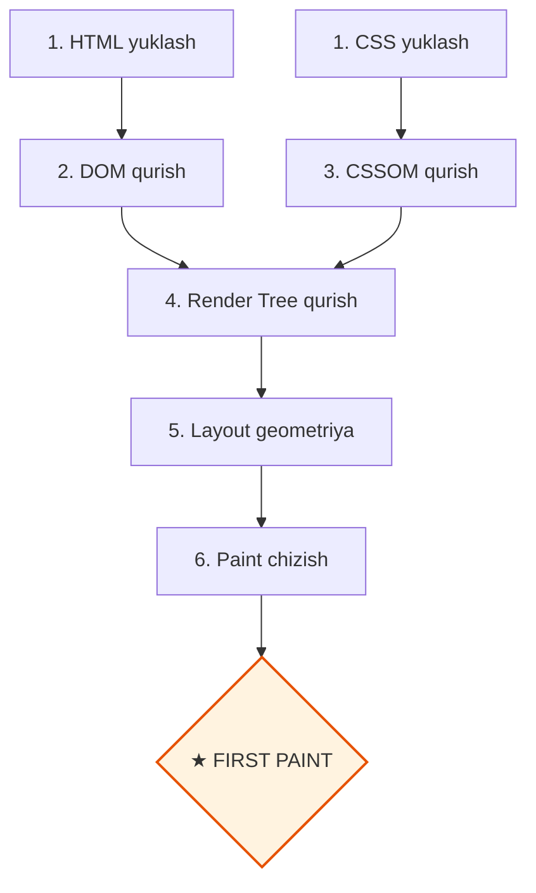

# Critical Rendering Path - Birinchi Paint Optimizatsiyasi

## Kirish

> [!IMPORTANT]
> **Nima uchun muhim?**  
> Foydalanuvchilar oq sahifaga qarab turishni yomon ko'rishadi. Agar sayt ochilganda birinchi piksel (First Paint) 3 soniyadan kech ko'rinsa, foydalanuvchilarning yarmi saytdan darhol chiqib ketadi (Bounce Rate ortadi). **Critical Rendering Path (CRP)** — bu brauzerning sayt kodini yuklab olib, birinchi pikselni chizguncha bosib o'tadigan eng muhim zanjiridir. Uni optimallashtirish (zanjirni qisqartirish va to'siqlarni olib tashlash) orqali saytingizning yuklanish tezligini bir necha barobar oshirishingiz mumkin.

> [!NOTE]
> **Real-hayot analogiyasi: "Oshxonadagi taom tayyorlash zanjiri (CRP)"**  
> Mijoz restoranga kirdi va ovqat buyurtma qildi. Ovqat stolga yetib kelguncha (First Paint) bir necha bosqichlar bor:
> - **HTML yuklash (Masalliqlarni olib kelish):** Bozordan go'sht va sabzavotlar olib kelindi.
> - **CSS yuklash (Retseptlarni o'qish - Render Blocking):** Oshpaz retseptni oxirigacha o'qib chiqmaguncha go'shtni qozonga solmaydi (CSS to'liq o'qilmaguncha sahifa chizilmaydi).
> - **JS yuklash (Oshxonadagi maxsus robotlar - Parser Blocking):** Robot oshxonaga kirib ishlashni boshlasa, oshpazning yo'lini to'sib qo'yadi (JavaScript yuklanib bajarilmaguncha HTML parsing to'xtab turadi).
> - **Optimallashtirilgan CRP:** Retseptni (CSS) faqat birinchi kerakli qismini o'qib, robotlarni (JS) keyinroqqa surib qo'yish (defer/async) orqali mijozga taomni ancha tezroq yetkazib berish mumkin.

---

---

## CRP Bosqichlari

### Critical Rendering Path Oqimi



---

## Render-Blocking Resources

### CSS - Doim Render-Blocking

```html
<!-- CSS render-blocking chunki CSSOM kerak -->
<link rel="stylesheet" href="styles.css">

<!-- Brauzer CSS yuklanmaguncha render qilmaydi -->
<!-- FOUC (Flash of Unstyled Content) oldini olish uchun -->
```

### JavaScript - Default Blocking

```html
<!-- Default: Parser-blocking -->
<script src="app.js"></script>
<!-- HTML parsing to'xtaydi, script yuklanib execute bo'ladi -->

<!-- YECHIM 1: defer -->
<script src="app.js" defer></script>
<!-- Parallel yuklash, DOMContentLoaded dan oldin execute -->

<!-- YECHIM 2: async -->
<script src="app.js" async></script>
<!-- Parallel yuklash, yuklanganda execute -->
```

### Blocking Waterfall
```
MUAMMO: Ketma-ket blocking

HTML:   |====|download|===|parse|===|blocked|===|blocked|===|parse|===
CSS:                             |download|===
JS:                                            |download|===|execute|===

                                                          ★ First Paint

YECHIM: Parallel + defer

HTML:   |====|download|===|parse|================================|execute|
CSS:                  |download|===
JS:                   |download|====================================|

                      ★ First Paint (ancha tezroq)
```

---

## Critical CSS

### Konsept
"Above the fold" (ekranda darhol ko'rinadigan qism) uchun kerakli CSS ni inline qilish.

### Muammo
```html
<!-- YOMON: Katta CSS fayl - render blocking -->
<head>
    <link rel="stylesheet" href="framework.css"> <!-- 200KB -->
    <link rel="stylesheet" href="styles.css">    <!-- 50KB -->
</head>
<!-- First paint 250KB CSS yuklanguncha kutadi -->
```

### Yechim
```html
<head>
    <!-- Critical CSS inline (above-the-fold uchun) -->
    <style>
        /* ~14KB dan kam */
        :root { --primary: #3b82f6; }
        body { margin: 0; font-family: system-ui, sans-serif; }
        .header {
            height: 60px;
            background: white;
            box-shadow: 0 1px 3px rgba(0,0,0,0.1);
        }
        .hero {
            min-height: 400px;
            display: flex;
            align-items: center;
            justify-content: center;
        }
    </style>

    <!-- Non-critical CSS async yuklash -->
    <link rel="preload" href="styles.css" as="style" onload="this.onload=null;this.rel='stylesheet'">
    <noscript><link rel="stylesheet" href="styles.css"></noscript>
</head>
```

### Critical CSS Extraction Tools
```javascript
// 1. Critical (Node.js)
const critical = require('critical');

critical.generate({
    inline: true,
    base: 'dist/',
    src: 'index.html',
    target: 'index-critical.html',
    width: 1300,
    height: 900
});

// 2. Penthouse
const penthouse = require('penthouse');

penthouse({
    url: 'http://localhost:3000',
    css: 'styles.css',
    width: 1300,
    height: 900
}).then(criticalCss => {
    // criticalCss ni <style> ga qo'shish
});
```

---

## Resource Hints

### Preload
```html
<!-- Joriy sahifa uchun kerakli resurslarni oldindan yuklash -->
<link rel="preload" href="critical-font.woff2" as="font" type="font/woff2" crossorigin>
<link rel="preload" href="hero-image.webp" as="image">
<link rel="preload" href="main.js" as="script">
```

### Preconnect
```html
<!-- Tashqi domenga oldindan ulanish -->
<link rel="preconnect" href="https://fonts.googleapis.com">
<link rel="preconnect" href="https://fonts.gstatic.com" crossorigin>
<link rel="preconnect" href="https://api.example.com">

<!-- DNS prefetch (preconnect dan yengil) -->
<link rel="dns-prefetch" href="https://analytics.example.com">
```

### Prefetch
```html
<!-- Keyingi sahifalar uchun resurslarni oldindan yuklash -->
<link rel="prefetch" href="/next-page.html">
<link rel="prefetch" href="/next-page.js">
```

### Prerender (Speculation Rules API)
```html
<script type="speculationrules">
{
    "prerender": [{
        "urls": ["/likely-next-page"]
    }]
}
</script>
```

### Resource Hints Priority
```
               Urgency
                  ▲
                  │
    preload ●     │
                  │
    preconnect ●  │
                  │
    prefetch ●    │
                  │
                  └──────────────────────▶ When needed
                      Current   Next    Future
                      page      page    pages
```

---

## Font Optimization

### Muammo: FOIT va FOUT
```
FOIT (Flash of Invisible Text):
- Font yuklanguncha matn ko'rinmaydi
- User waiting, content invisible

FOUT (Flash of Unstyled Text):
- System font ko'rsatiladi, keyin custom font
- Layout shift bo'lishi mumkin
```

### Yechim 1: font-display
```css
@font-face {
    font-family: 'CustomFont';
    src: url('font.woff2') format('woff2');

    /* swap: Darhol fallback, keyin swap */
    font-display: swap;

    /* optional: Faqat cache'da bo'lsa */
    /* font-display: optional; */

    /* block: 3s invisible, keyin fallback */
    /* font-display: block; */

    /* fallback: 100ms invisible, 3s swap window */
    /* font-display: fallback; */
}
```

### Yechim 2: Preload fonts
```html
<link rel="preload"
      href="font.woff2"
      as="font"
      type="font/woff2"
      crossorigin>
```

### Yechim 3: Font subsetting
```css
/* Faqat kerakli belgilar */
@font-face {
    font-family: 'CustomFont';
    src: url('font-latin.woff2') format('woff2');
    unicode-range: U+0000-00FF; /* Latin only */
}

@font-face {
    font-family: 'CustomFont';
    src: url('font-cyrillic.woff2') format('woff2');
    unicode-range: U+0400-04FF; /* Cyrillic */
}
```

### Yechim 4: Variable fonts
```css
/* 1 fayl, barcha weights */
@font-face {
    font-family: 'Inter';
    src: url('Inter-Variable.woff2') format('woff2-variations');
    font-weight: 100 900;
    font-display: swap;
}

.light { font-weight: 300; }
.regular { font-weight: 400; }
.bold { font-weight: 700; }
```

---

## JavaScript Optimization

### Code Splitting
```javascript
// YOMON: Barcha kod bir bundle'da
import { heavyFeature } from './heavyFeature';
import { rarelyUsedFeature } from './rarelyUsedFeature';

// YAXSHI: Dynamic imports
const button = document.querySelector('.feature-button');
button.addEventListener('click', async () => {
    const { heavyFeature } = await import('./heavyFeature');
    heavyFeature();
});

// Route-based splitting (framework)
const routes = {
    '/': () => import('./pages/Home'),
    '/about': () => import('./pages/About'),
    '/dashboard': () => import('./pages/Dashboard'),
};
```

### Tree Shaking
```javascript
// YOMON: Butun library import
import _ from 'lodash'; // ~70KB
_.debounce(fn, 300);

// YAXSHI: Faqat kerakli funksiya
import debounce from 'lodash/debounce'; // ~2KB
debounce(fn, 300);

// YAXSHI: Named import (tree-shakeable library)
import { debounce } from 'lodash-es';
```

### Script Loading Patterns
```html
<!-- 1. Inline critical JS -->
<script>
    // < 1KB, first paint uchun kerak
    document.documentElement.classList.add('js');
</script>

<!-- 2. Preload main bundle -->
<link rel="preload" href="main.js" as="script">

<!-- 3. Defer main app -->
<script src="main.js" defer></script>

<!-- 4. Async third-party -->
<script src="analytics.js" async></script>

<!-- 5. Dynamic import for features -->
<script type="module">
    if ('IntersectionObserver' in window) {
        import('./lazyFeature.js');
    }
</script>
```

---

## Image Optimization

### Lazy Loading
```html
<!-- Native lazy loading -->


<!-- Fetchpriority for above-the-fold -->

```

### Responsive Images
```html
<picture>
    <!-- AVIF (eng kichik) -->
    <source srcset="image.avif" type="image/avif">
    <!-- WebP -->
    <source srcset="image.webp" type="image/webp">
    <!-- Fallback -->
    
</picture>

<!-- srcset bilan -->

```

### LCP Image Optimization
```html
<!-- LCP element uchun maxsus optimizatsiya -->
<head>
    <!-- Preload LCP image -->
    <link rel="preload"
          as="image"
          href="hero.webp"
          imagesrcset="hero-320.webp 320w, hero-640.webp 640w, hero-1280.webp 1280w"
          imagesizes="100vw">
</head>

<body>
    
</body>
```

---

## Real-World Optimization Example

### Optimizatsiyadan Oldin
```html
<!DOCTYPE html>
<html>
<head>
    <!-- MUAMMO: Barcha CSS render-blocking -->
    <link rel="stylesheet" href="bootstrap.css">
    <link rel="stylesheet" href="fontawesome.css">
    <link rel="stylesheet" href="styles.css">

    <!-- MUAMMO: Parser-blocking JS -->
    <script src="jquery.js"></script>
    <script src="app.js"></script>
</head>
<body>
    <!-- MUAMMO: LCP image optimized emas -->
    

    <!-- MUAMMO: Lazy loading yo'q -->
    
    
    
</body>
</html>
```

**Natija:** FCP ~4s, LCP ~6s

### Optimizatsiyadan Keyin
```html
<!DOCTYPE html>
<html>
<head>
    <!-- Resource hints -->
    <link rel="preconnect" href="https://fonts.googleapis.com">
    <link rel="preconnect" href="https://fonts.gstatic.com" crossorigin>

    <!-- Preload critical resources -->
    <link rel="preload" href="hero.webp" as="image" fetchpriority="high">
    <link rel="preload" href="inter-var.woff2" as="font" type="font/woff2" crossorigin>

    <!-- Critical CSS inline -->
    <style>
        :root { --primary: #3b82f6; }
        body { margin: 0; font-family: 'Inter', system-ui, sans-serif; }
        .header { height: 60px; display: flex; align-items: center; }
        .hero { min-height: 60vh; position: relative; }
        .hero-img { width: 100%; height: 100%; object-fit: cover; }
    </style>

    <!-- Non-critical CSS async -->
    <link rel="preload" href="styles.css" as="style" onload="this.onload=null;this.rel='stylesheet'">
    <noscript><link rel="stylesheet" href="styles.css"></noscript>

    <!-- Defer JS -->
    <script src="app.js" defer></script>
</head>
<body>
    <!-- Optimized LCP image -->
    <picture>
        <source srcset="hero.avif" type="image/avif">
        <source srcset="hero.webp" type="image/webp">
        
    </picture>

    <!-- Lazy loaded images -->
    
    
    

    <!-- Third-party async -->
    <script src="analytics.js" async></script>
</body>
</html>
```

**Natija:** FCP ~1.2s, LCP ~2.0s

---

## Measurement Tools

### Lighthouse
```bash
# CLI
npx lighthouse https://example.com --view

# Metrics:
# - First Contentful Paint (FCP)
# - Largest Contentful Paint (LCP)
# - Total Blocking Time (TBT)
# - Cumulative Layout Shift (CLS)
# - Speed Index
```

### WebPageTest
```
1. webpagetest.org
2. Enter URL
3. Analyze:
   - Waterfall chart
   - Filmstrip view
   - Core Web Vitals
   - Third-party impact
```

### Chrome DevTools
```javascript
// Performance API
const timing = performance.getEntriesByType('navigation')[0];
console.log({
    dns: timing.domainLookupEnd - timing.domainLookupStart,
    tcp: timing.connectEnd - timing.connectStart,
    ttfb: timing.responseStart - timing.requestStart,
    domLoad: timing.domContentLoadedEventEnd - timing.navigationStart,
    fullLoad: timing.loadEventEnd - timing.navigationStart
});

// Paint timing
const paintEntries = performance.getEntriesByType('paint');
paintEntries.forEach(entry => {
    console.log(`${entry.name}: ${entry.startTime}ms`);
});

// LCP
new PerformanceObserver((list) => {
    const entries = list.getEntries();
    const lastEntry = entries[entries.length - 1];
    console.log('LCP:', lastEntry.startTime);
}).observe({ type: 'largest-contentful-paint', buffered: true });
```

---

## Interview Savollari

### 1. Savol: Critical Rendering Path nima va qanday bosqichlardan iborat?
**Javob:**
CRP - brauzer HTML/CSS/JS ni birinchi pikselga aylantiradigan bosqichlar:

1. **HTML Parse** → DOM Tree
2. **CSS Parse** → CSSOM Tree
3. **DOM + CSSOM** → Render Tree
4. **Layout** → Pozitsiya va o'lcham
5. **Paint** → Piksellar

**Optimizatsiya maqsadi:** CRP uzunligini qisqartirish va render-blocking resurslarni kamaytirish.

### 2. Savol: CSS nima uchun render-blocking?
**Javob:**
- Render Tree = DOM + CSSOM
- CSSOM bo'lmasa, brauzer render qila olmaydi
- FOUC (Flash of Unstyled Content) oldini olish uchun

**Yechim:**
- Critical CSS inline
- Non-critical CSS async (`preload` + `onload`)
- Media queries bilan bo'lish

### 3. Savol: preload, preconnect, prefetch farqi nima?
**Javob:**
| Hint | Nima qiladi | Qachon ishlatish |
|------|-------------|------------------|
| **preload** | Resursni yuklaydi | Joriy sahifada kerak |
| **preconnect** | Connection o'rnatadi | Tashqi domen |
| **prefetch** | Resursni cache'laydi | Keyingi sahifa uchun |

```html
<link rel="preload" href="font.woff2" as="font" crossorigin>
<link rel="preconnect" href="https://api.example.com">
<link rel="prefetch" href="/next-page.js">
```

### 4. Savol: font-display: swap nima qiladi?
**Javob:**
- **swap**: Darhol system font ko'rsatadi, font yuklangach almashtiradi
- FOIT (invisible text) oldini oladi
- Layout shift bo'lishi mumkin, lekin content ko'rinadi

```css
@font-face {
    font-family: 'CustomFont';
    src: url('font.woff2') format('woff2');
    font-display: swap;
}
```

### 5. Savol: LCP ni qanday yaxshilash mumkin?
**Javob:**
LCP = Largest Contentful Paint, odatda hero image yoki heading.

**Optimizatsiya:**
1. **Preload LCP image:** `<link rel="preload" as="image">`
2. **fetchpriority="high"** attributi
3. **WebP/AVIF** format
4. **Responsive images** (srcset)
5. **Critical CSS** inline
6. **Server-side render** (SSR)

```html
<link rel="preload" href="hero.webp" as="image" fetchpriority="high">

```

---

## Performance Tips

### 1. Critical CSS Workflow
```javascript
// Build process'da
// 1. Critical CSS extract qilish
// 2. Inline qilish
// 3. Full CSS async yuklash

// Gulp example
const critical = require('critical');

gulp.task('critical', () => {
    return critical.generate({
        inline: true,
        base: 'dist/',
        src: 'index.html',
        target: 'index.html',
        width: 1300,
        height: 900,
        minify: true
    });
});
```

### 2. Resource Hints Generator
```javascript
// Sahifa analysi va hints generatsiyasi
function generateResourceHints(page) {
    const hints = [];

    // Third-party domenlar
    const externalDomains = new Set();
    document.querySelectorAll('script[src], link[href], img[src]').forEach(el => {
        const url = new URL(el.src || el.href, location.origin);
        if (url.origin !== location.origin) {
            externalDomains.add(url.origin);
        }
    });

    externalDomains.forEach(domain => {
        hints.push(`<link rel="preconnect" href="${domain}">`);
    });

    // Critical images
    const lcpImage = document.querySelector('img[fetchpriority="high"]');
    if (lcpImage) {
        hints.push(`<link rel="preload" href="${lcpImage.src}" as="image">`);
    }

    return hints.join('\n');
}
```

### 3. Async CSS Pattern
```html
<!-- Print media trick -->
<link rel="stylesheet"
      href="styles.css"
      media="print"
      onload="this.media='all'">

<!-- Preload pattern -->
<link rel="preload"
      href="styles.css"
      as="style"
      onload="this.onload=null;this.rel='stylesheet'">
<noscript>
    <link rel="stylesheet" href="styles.css">
</noscript>
```

### 4. Core Web Vitals Monitoring
```javascript
// web-vitals library
import { getLCP, getFID, getCLS, getFCP, getTTFB } from 'web-vitals';

function sendToAnalytics(metric) {
    const body = JSON.stringify({
        name: metric.name,
        value: metric.value,
        delta: metric.delta,
        id: metric.id
    });

    navigator.sendBeacon('/analytics', body);
}

getLCP(sendToAnalytics);
getFID(sendToAnalytics);
getCLS(sendToAnalytics);
getFCP(sendToAnalytics);
getTTFB(sendToAnalytics);
```

### 5. Server-Side Optimization
```javascript
// Express.js example
app.use(compression()); // Gzip/Brotli

// Cache headers
app.use('/static', express.static('public', {
    maxAge: '1y',
    immutable: true
}));

// Preload headers
app.use((req, res, next) => {
    res.setHeader('Link', [
        '</fonts/inter.woff2>; rel=preload; as=font; crossorigin',
        '</styles/critical.css>; rel=preload; as=style'
    ].join(', '));
    next();
});
```

---

## Eng Yaxshi Amaliyotlar (Best Practices)

1. **Critical CSS-ni inline qiling:** Birinchi ekrandagi kontent (Above-the-fold) uchun zarur bo'lgan minimal CSS'ni (Critical CSS) aniqlab, uni `<style>` tegi ichida bevosita HTML'ning o'ziga yozib yuboring (inline). Qolgan barcha katta CSS fayllarni esa asinxron ravishda keyinroq yuklang. Bu FCP metrikasini 1 soniyadan ko'proq tezlattiradi.
2. **JavaScript-ni defer atributi bilan ishlating:** Hech qachon `<script>` tegini `defer` yoki `async` atributlarisiz ishlatmang. Oddiy script yuklanganda HTML parsing jarayonini darhol to'xtatadi. `defer` esa skriptni fonda parallel yuklab, faqat DOM daraxti to'liq tayyor bo'lgandan so'ng (`DOMContentLoaded` oldidan) tartib bilan ishga tushiradi.
3. **LCP rasmini preload qiling:** Saytda birinchi bo'lib ko'rinadigan eng katta rasmni (masalan, Hero image) `<link rel="preload" as="image" href="...">` orqali brauzerga oldindan yuklash buyrug'ini bering. Bu Largest Contentful Paint (LCP) metrikasini sezilarli darajada yaxshilaydi.

---

## Xulosa

CRP optimallashtirish usullari xulosasi:

| Optimizatsiya Usuli | FCP va LCP ga ta'siri | Qiyinlik darajasi | Tavsiya etilgan yechim |
| --- | --- | --- | --- |
| **Critical CSS (Inline)** |  **Juda Yuqori** | O'rtacha | CSS-in-JS yoki maxsus kutubxonalar orqali ajratish |
| **JS defer / async** |  **Juda Yuqori** | Oson | Skriptlarni to'liq `defer` qilish |
| **Resource Hints (Preload)**|  **O'rtacha** | Oson | LCP rasmlari va shriftlarni preload qilish |
| **Font Display Swap** |  **O'rtacha** | Oson | CSS-da `font-display: swap` qo'llash |
| **Code Splitting** |  **Juda Yuqori** | Murakkab | Marshrutlar bo'yicha dinamik importlardan foydalanish |
