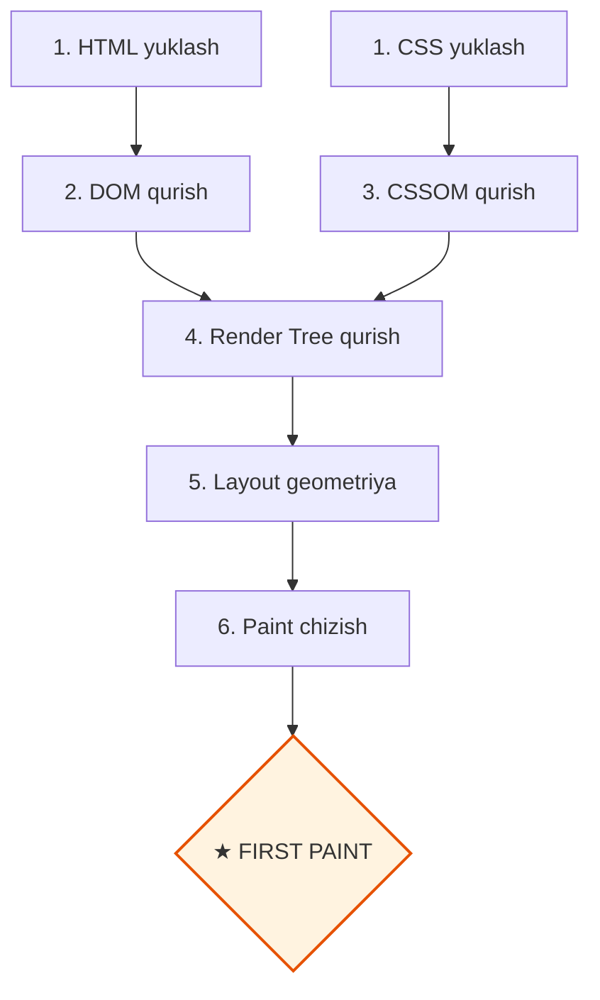

# Critical Rendering Path (Birinchi Paint Optimizatsiyasi)

> [!IMPORTANT]
> **Nima uchun muhim?**  
> Foydalanuvchilar oq sahifaga qarab turishni yomon ko'rishadi. Agar sayt ochilganda birinchi piksel (First Paint) 3 soniyadan kech ko'rinsa, foydalanuvchilarning yarmi saytdan darhol chiqib ketadi (Bounce Rate ortadi). **Critical Rendering Path (CRP)** — bu brauzerning sayt kodini yuklab olib, birinchi pikselni chizguncha bosib o'tadigan eng muhim qadamlari zanjiridir. Uni optimallashtirish orqali saytingizning yuklanish tezligini bir necha barobar oshirishingiz mumkin.

## 🟢 Junior (Asoslar va Tushunchalar)

### Terminologiya
**CRP (Critical Rendering Path)** — brauzerga kerakli fayllarni (HTML, CSS, JS) kelib tushgandan boshlab to ekranda "Nimadir" ko'ringuncha bo'lgan jarayon (yo'lak). 

> [!NOTE]
> **Hayotiy o'xshatish: "Oshxonadagi taom tayyorlash zanjiri"**  
> Mijoz restoranga kirdi va ovqat buyurtma qildi. Ovqat stolga yetib kelguncha (First Paint) bir necha bosqichlar bor:
> - **HTML yuklash (Masalliqlarni olib kelish):** Bozordan go'sht va sabzavotlar olib kelindi.
> - **CSS yuklash (Retseptlarni o'qish - Render Blocking):** Oshpaz retseptni oxirigacha o'qib chiqmaguncha go'shtni qozonga solmaydi (CSS to'liq o'qilmaguncha sahifa chizilmaydi).
> - **JS yuklash (Oshxonadagi maxsus robotlar - Parser Blocking):** Robot oshxonaga kirib ishlashni boshlasa, oshpazning yo'lini to'sib qo'yadi (JavaScript yuklanib bajarilmaguncha HTML parse to'xtab turadi).
> - **Optimallashtirilgan CRP:** Retseptni (CSS) faqat birinchi kerakli qismini o'qib, robotlarni (JS) keyinroqqa surib qo'yish (defer/async) orqali mijozga taomni ancha tezroq yetkazib berish mumkin.

### Sodda Misol
Tasavvur qiling HTML keldi. Lekin Head qismida 10 MB lik CSS va 5 MB lik JS fayl bor. Brauzer ikkalasi to'liq yuklanib bo'lmagunicha HTML ni qolgan qismini ekranda chizmaydi. Ekran oq bo'lib qotaveradi! Buni Render-Blocking (chizishni to'sib qo'yuvchi) deyiladi.

---

## 🟡 Middle (Amaliyot va Detallar)

### Render-Blocking Resources (To'siqlar)
Brauzer sahifani render qilishi uchun **DOM Tree** va **CSSOM Tree** kerak. Demak, CSS doimiy ravishda "Render-Blocking" hisoblanadi. JavaScript esa HTML ni o'qishdan to'xtatadi ("Parser-blocking").

**JS To'siqlarini Olib Tashlash:**
```html
<!-- YOMON: HTML o'qilishi shu yerda to'xtaydi -->
<script src="katta-app.js"></script>

<!-- YAXSHI: Fonda parallel yuklanadi va HTML yasalib bo'lgach ishlaydi -->
<script src="katta-app.js" defer></script>
```

**CSS To'siqlarini Kichraytirish (Critical CSS):**
Sayt kirganda ko'rinadigan qismi (Above the fold) uchun kerakli CSS qoidalarini ajratib olib, to'g'ridan-to'g'ri `<style>` ichiga yozish kerak. Qolgan minglab qator CSS ni pastda asinxron yuklash kerak.

### Font Optimization (Shriftlarni optimallash)
Agar sizda Google Fonts yoki custom shrift bo'lsa, u yuklanguncha saytda yozuv ko'rinmaydi. Buni FOIT (Flash of Invisible Text) deyiladi. Buni tuzatish uchun shriftga CSS orqali zaxira berish kerak:
```css
@font-face {
    font-family: 'MeningShriftim';
    src: url('shrift.woff2') format('woff2');
    font-display: swap; /* Shrift kelguncha browser o'zini shriftini korsatib turadi! */
}
```

### Ko'p uchraydigan xatolar va muammolar (Pitfalls)
**Barcha rasmlarni birdan yuklash**
Agar sahifada 50 ta rasm bo'lsa barchasini birdaniga yuklash Tarmoqni (Network) to'ldirib tashlaydi. Pastyog'dagi (skrolldan keyingi) rasmlarga doimo `loading="lazy"` berish kerak. Eng birinchi turgan rasmga (LCP - Largest Contentful Paint) esa aslo lazy qo'yish mumkin emas!

## Eng Yaxshi Amaliyotlar (Best Practices)
- **Kritik (Critical) CSS ni inline qiling:** Birinchi ekrandagi kontent uchun zarur bo'lgan minimal CSS'ni aniqlab, uni `<style>` tegi ichiga bevosita HTML'ning o'ziga yozib yuboring (inline).
- **JavaScript ni defer atributi bilan ishlating:** Skriptlarni fonda parallel yuklab, DOM tayyor bo'lgandan so'ng ishga tushirish (defer) uchun u doim bo'lishi kerak.
- **Resource Hints ishlating:** Juda katta rasmni brauzer topgunicha vaqt o'tadi. Head ichida `<link rel="preload" as="image" href="kattarasm.jpg">` bilan unga birinchi navbatda olib kelishni buyuring.

---

## 🔴 Senior (Arxitektura va Optimallashtirish)

### "Under the hood" (Qopqoq ostida nimalar ro'y beradi)
V8 dvigateli va Network Protocol ishlashi:
CRP ni chuqur optimallashtirish uchun siz **Resource Hints** (preload, preconnect, prefetch) nimaligini tushunishingiz shart. 
Brauzer boshqa serverdan (masalan: `fonts.googleapis.com`) fayl olmoqchi bo'lsa, TCP connection, DNS Lookup, TLS Handshake kabi jarayonlarga 300-500ms yo'qotadi. `preconnect` orqali brauzerga oldindan "Ulanib tur" deb buyruq berish mumkin.

```html
<!-- DNS, TCP va TLS ga ketadigan vaqtni oldindan qilib qo'yish -->
<link rel="preconnect" href="https://fonts.googleapis.com">
```

### Web Vitals Monitoring va LCP
Eng yaxshi CRP optimizatsiyasi LCP (Largest Contentful Paint - Ekranda eng katta narsa chiqadigan vaqt) ni yaxshilashdir. Buning uchun `<picture>` va zamonaviy `WebP` / `AVIF` formatlaridan foydalanibgina qolmay, maxsus atributlar qo'shiladi:
```html

```
`fetchpriority="high"` brauzer Network paneliga "Bu resursni birinchi navbatda, CSS dan ham oldinroq yukla" degan signalni yuboradi.

### Intervyu Savollari (Qiyin daraja)
**1. `defer` va `async` farqi nimada va qaysi birida kod qat'iy ketma-ketlikda ishlaydi?**
*Javob:* Ikkalasi ham parallel yuklanadi. Lekin `async` qaysi biri birinchi yuklanib bo'lsa o'shani ishga tushirib yuboradi (tartib buziladi). `defer` esa har doim HTML yozilgan tartibini saqlagan holda DOM to'liq o'qilib bo'lgach (`DOMContentLoaded` dan oldin) ketma-ket ishga tushadi. 

**2. CSSOM qurilishi tugamaguncha JS nega kutib turadi?**
*Javob:* JS kodi ichida siz elementning rangini (CSS) yoki o'lchamini so'rashingiz mumkin. CSSOM tayyor bo'lmasa, JS o'zida noto'g'ri axborot bilan ishlay boshlaydi. Shuning uchun brauzer majburan JS execution ni CSSOM Tree to'liq qurilib bo'lgunicha bloklab turadi.

### Vizualizatsiya (CRP)


---

## Xulosa

| Daraja | Yondashuv va Fokus | Nimalarga qodir bo'lish kerak? |
| --- | --- | --- |
| **Junior** | **Mantiq:** CSS yuqorida, JS pastda turishi kerakligini biladi. | `async` va `defer` nimaligini biladi. Rasmlarga dangasa yuklanish (lazy) ni ko'r-ko'rona ishlata oladi. |
| **Middle** | **Qo'llash:** FOIT muammolarini, Render-Blocking tushunchasini biladi. | Shriftlarni `font-display: swap` bilan himoyalaydi, katta rasmlarni alohida optimallashtiradi. |
| **Senior** | **Arxitektura & V8:** Web Vitals va Resource hints ustasi. | Critical CSS ajrata oladi, `preload`, `preconnect`, `fetchpriority` lar orqali LCP, FCP vaqtini 1 soniyadan pastga tushira oladi. |
