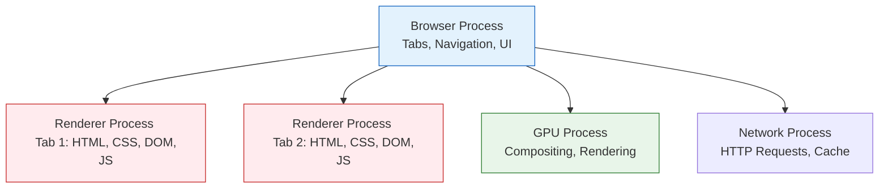

# Browser Internals - Brauzer Ichki Ishlash Mexanizmlari

## Kirish

> [!IMPORTANT]
> **Nima uchun muhim?**  
> Agar siz brauzerning ichki tuzilishini, uning qanday ishlashini bilmasangiz, yozgan kodingiz "qora quti" (black box) ichida ishlayotgandek bo'ladi. Har bir frontend dasturchisi brauzer arxitekturasini, xotirani qanday boshqarishini, qatlamlarni qanday tuzishini va JavaScript event loop bilan qanday ishlashini bilishi shart. Ushbu bo'lim sizga brauzerning qopqog'i ostiga qarash va uni senior darajasida tushunish imkonini beradi.

> [!NOTE]
> **Real-hayot analogiyasi: "Teatr truppasi (Browser Process Architecture)"**  
> Brauzerning ishlashi — butun boshli teatr truppasiga o'xshaydi:
> - **Browser Process (Direktor):** Barcha jarayonlarni boshqaradi, tablarni ochib-yopadi va sahifalar xavfsizligini ta'minlaydi.
> - **Renderer Process (Aktyorlar va Rejissyor):** Har bir sahifa uchun alohida truppa ishlaydi. Ular HTML va CSS ssenariylarini o'qib, sahnada chiroyli o'yin ko'rsatishadi (DOM, Layout, Paint).
> - **GPU Process (Chiroq va Effekt Ustasi):** Sahna chiroqlari va murakkab visual effektlarni boshqaradi. Aktyorlar unga faqat ko'rsatma beradi, GPU esa buni bir zumda sahnaga chiqaradi.

---

## Mundarija

| # | Mavzu | Tavsif |
|---|-------|--------|
| 01 | [Rendering Pipeline](./01-rendering-pipeline.md) | DOM, CSSOM, Render Tree, Layout, Paint, Composite |
| 02 | [Reflow va Repaint](./02-reflow-repaint.md) | Layout thrashing, forced synchronous layout |
| 03 | [DOM Lifecycle](./03-dom-lifecycle.md) | DOMContentLoaded, load, beforeunload, MutationObserver |
| 04 | [Critical Rendering Path](./04-critical-rendering-path.md) | Render-blocking resources, CRP optimization |
| 05 | [GPU Acceleration](./05-gpu-acceleration.md) | Compositor layers, will-change, transform tricks |

### Brauzer Arxitekturasi (Multi-process Architecture)


*Har bir tab alohida xotira maydonida (sandbox) xavfsiz ishlashi uchun brauzer multi-process arxitekturasidan foydalanadi.*

---

## Nega Bu Muhim?

### 1. Performance Debugging
```javascript
// Tushunmasdan yozilgan kod
function updatePositions(elements) {
    elements.forEach(el => {
        // HAR BIR ITERATSIYADA LAYOUT TRIGGER!
        el.style.left = el.offsetLeft + 10 + 'px';
    });
}

// Layout thrashing tushunib yozilgan kod
function updatePositionsOptimized(elements) {
    // 1. AVVAL BARCHA O'QISHLAR
    const positions = elements.map(el => el.offsetLeft);

    // 2. KEYIN BARCHA YOZISHLAR
    elements.forEach((el, i) => {
        el.style.left = positions[i] + 10 + 'px';
    });
}
```

### 2. Animation Performance
```css
/* YOMON: Layout trigger */
.animate-bad {
    animation: move-bad 1s infinite;
}
@keyframes move-bad {
    from { left: 0; }
    to { left: 100px; }
}

/* YAXSHI: GPU-accelerated */
.animate-good {
    animation: move-good 1s infinite;
}
@keyframes move-good {
    from { transform: translateX(0); }
    to { transform: translateX(100px); }
}
```

### 3. Initial Load Optimization
```html
<!-- YOMON: Render-blocking -->
<head>
    <link rel="stylesheet" href="huge-framework.css">
    <script src="analytics.js"></script>
</head>

<!-- YAXSHI: Optimized CRP -->
<head>
    <link rel="stylesheet" href="critical.css">
    <link rel="preload" href="fonts.woff2" as="font" crossorigin>
    <script src="analytics.js" defer></script>
</head>
```

---

## Brauzer Arxitekturasi

```
┌─────────────────────────────────────────────────────────────┐
│                      BROWSER PROCESS                        │
│  ┌─────────────┐  ┌─────────────┐  ┌─────────────────────┐ │
│  │ UI Thread   │  │ Network     │  │ Storage Thread      │ │
│  │             │  │ Thread      │  │ (IndexedDB, etc.)   │ │
│  └─────────────┘  └─────────────┘  └─────────────────────┘ │
└─────────────────────────────────────────────────────────────┘
                              │
                              ▼
┌─────────────────────────────────────────────────────────────┐
│                     RENDERER PROCESS                        │
│  ┌─────────────────────────────────────────────────────┐   │
│  │                    MAIN THREAD                       │   │
│  │  ┌─────────┐  ┌─────────┐  ┌─────────┐  ┌────────┐ │   │
│  │  │ HTML    │  │ Style   │  │ Layout  │  │ Paint  │ │   │
│  │  │ Parser  │  │ Calc    │  │         │  │        │ │   │
│  │  └─────────┘  └─────────┘  └─────────┘  └────────┘ │   │
│  │                      │                              │   │
│  │              ┌───────▼───────┐                     │   │
│  │              │   JavaScript  │                     │   │
│  │              │    Engine     │                     │   │
│  │              │   (V8, etc.)  │                     │   │
│  │              └───────────────┘                     │   │
│  └─────────────────────────────────────────────────────┘   │
│                              │                              │
│  ┌───────────────────────────▼──────────────────────────┐  │
│  │                 COMPOSITOR THREAD                     │  │
│  │  ┌─────────────┐  ┌─────────────┐  ┌──────────────┐ │  │
│  │  │ Layer       │  │ Tile        │  │ GPU Raster   │ │  │
│  │  │ Management  │  │ Management  │  │ (Optional)   │ │  │
│  │  └─────────────┘  └─────────────┘  └──────────────┘ │  │
│  └──────────────────────────────────────────────────────┘  │
└─────────────────────────────────────────────────────────────┘
                              │
                              ▼
┌─────────────────────────────────────────────────────────────┐
│                       GPU PROCESS                           │
│           ┌─────────────────────────────────┐              │
│           │  Rasterization & Compositing    │              │
│           └─────────────────────────────────┘              │
└─────────────────────────────────────────────────────────────┘
```

---

## Asosiy Tushunchalar

### Thread Model
| Thread | Vazifasi | Blocking Effect |
|--------|----------|-----------------|
| **Main Thread** | JS execution, DOM, Layout, Paint | UI freeze |
| **Compositor Thread** | Scrolling, CSS animations | Smooth |
| **Raster Threads** | Tile rasterization | Background |
| **GPU Process** | Hardware rendering | Fast |

### Rendering Steps
1. **Parse HTML** → DOM Tree
2. **Parse CSS** → CSSOM Tree
3. **Combine** → Render Tree
4. **Layout** → Position & Size
5. **Paint** → Pixel colors
6. **Composite** → Layer ordering

### Performance Metrics
| Metric | Target | Measures |
|--------|--------|----------|
| FCP | < 1.8s | First Contentful Paint |
| LCP | < 2.5s | Largest Contentful Paint |
| FID | < 100ms | First Input Delay |
| CLS | < 0.1 | Cumulative Layout Shift |
| TTI | < 3.8s | Time to Interactive |

---

## DevTools Workflow

### Performance Panel
```javascript
// Custom performance marks
performance.mark('feature-start');
// ... kod ...
performance.mark('feature-end');
performance.measure('feature-duration', 'feature-start', 'feature-end');

// Natijani ko'rish
console.log(performance.getEntriesByType('measure'));
```

### Layers Panel
1. DevTools → More Tools → Layers
2. 3D view orqali layerlarni ko'rish
3. Compositing reasons ni tekshirish

### Rendering Panel
1. DevTools → More Tools → Rendering
2. Paint flashing (qizil = repaint)
3. Layout Shift Regions
4. FPS meter

---

## Real-World Checklist

### Initial Load
- [ ] Critical CSS inline
- [ ] JavaScript defer/async
- [ ] Font preload
- [ ] Image lazy loading
- [ ] Resource hints (preconnect, prefetch)

### Runtime Performance
- [ ] Transform/opacity for animations
- [ ] will-change on animated elements
- [ ] Avoid layout thrashing
- [ ] Debounce/throttle event handlers
- [ ] Virtual scrolling for long lists

### Memory
- [ ] Event listener cleanup
- [ ] WeakMap/WeakSet for caches
- [ ] Avoid closures holding DOM refs
- [ ] Profile memory in DevTools

---

## Eng Yaxshi Amaliyotlar (Best Practices)

1. **DOM daraxtini minimal saqlang:** Brauzer rendering pipeline (Layout/Paint) tezligi to'g'ridan-to'g'ri DOM elementlari soniga bog'liq. Saytingizda ortiqcha `<div>` lardan qoching va ro'yxatlar juda uzun bo'lib ketsa, virtual scrolling texnikasidan foydalaning.
2. **Animatsiyalar uchun GPU qatlamini ishlating:** Har bir harakat (Layout properties) CPU da emas, balki GPU da `transform` va `opacity` orqali silliq (60fps) bajarilishini ta'minlang.
3. **Optimallashtirilgan Script yuklash:** Javascript fayllarni inline yoki oddiy yuklamasdan, doimo asinxron va parsing bloklamaydigan `defer` yoki `async` atributlari orqali yuklang.

---

## Xulosa

Browser Internals bo'limi bo'yicha yakuniy xulosa:

| Bosqich / Muammo | Nima sodir bo'ladi? | Qanday hal qilinadi (Yechim)? |
| --- | --- | --- |
| **Initial Load (FCP / LCP)** | Sahifa yuklanishining kechikishi (Oq ekran) | Critical CSS inline qilish, JS fayllarni defer yuklash, fontlarni preload qilish |
| **Layout Thrashing** | Kodda ketma-ket read/write amallarini bajarish | Read va Write amallarini guruhlash, `requestAnimationFrame` ishlatish |
| **Animation Jank (Qotish)** | Animatsiyada o'lchamlarni (top, left) o'zgartirish | Animatsiyalarni faqat `transform` va `opacity` yordamida GPU-ga o'tkazish |

**Eslatma:** Har doim veb-saytingizni past darajadagi mobil qurilmalar va zaif tarmoq sharoitlarida ham (Chrome DevTools Performance & Network Throttling orqali) test qilib ko'ring. Saytning chinakam sifati eng yomon tarmoq sharoitida qanday ishlashi bilan o'lchanadi.
