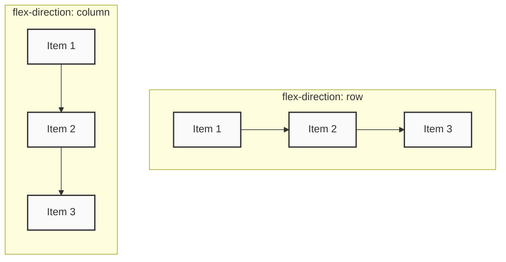

# Flexbox (Flexible Box Layout)

> [!IMPORTANT]
> **Nima uchun muhim?**  
> Flexbox veb-sahifalarda elementlarni bir o'lchovda (qator yoki ustun) joylashtirish, tekislash va bo'sh joylarni taqsimlashning eng kuchli va zamonaviy usulidir. Eski `float` va `table-layout` usullaridan butunlay voz kechib, responsiv (moslashuvchan) dizaynlarni osongina yaratish imkonini beradi. Har qanday web dasturchi Flexbox ni suvdek bilishi shart!

## 🟢 Junior (Asoslar va Tushunchalar)

### Terminologiya
**Flexbox** — bu sahifadagi qutilarni (elementlarni) elastik va egiluvchan qilish xususiyati. Unda asosiy "Ona quti" (Container) va ichida "Bola qutilar" (Items) bo'ladi.

> [!NOTE]
> **Hayotiy o'xshatish: "Poyezd vagonlari"**  
> Flexbox'ni poyezd vagonlariga o'xshatish mumkin. Agar relsda (qator) vagonlar (items) sig'masa, ular keyingi yo'lga o'tishi mumkin (`flex-wrap`). Agar vagonlar orasida ortiqcha bo'sh joy qolsa, bu joyni teng bo'lib olishlari mumkin (`justify-content: space-between`). Yo'lovchilar vagonda qanday joylashishi esa `align-items` orqali boshqariladi.

### Sodda Misol
Flexbox har doim ota elementga (Container) yoziladi. Va u avtomatik tarzda ichidagi barcha bolalarni bir qatorga terib beradi.

```html
<div class="ota-quti">
  <div class="bola">1</div>
  <div class="bola">2</div>
  <div class="bola">3</div>
</div>
```

```css
.ota-quti {
  display: flex; /* Barcha bolalar bir qatorga o'tadi! */
  justify-content: center; /* Bolalarni o'rtaga yig'adi */
  align-items: center; /* Tepadan va pastdan o'rtaga qo'yadi */
  gap: 20px; /* Bolalar orasida 20px bo'shliq ochadi */
}
```

---

## 🟡 Middle (Amaliyot va Detallar)

### Asosiy O'qlar (Axis) qoidasi
Flexbox da 2 ta o'q bor:
1. **Main Axis (Asosiy o'q):** Odatda chapdan o'ngga qarab yotadi (`flex-direction: row`). Buni har doim `justify-content` boshqaradi.
2. **Cross Axis (Kesib o'tuvchi o'q):** Odatda tepadan pastga yotadi. Buni har doim `align-items` boshqaradi.

Agar siz `flex-direction: column` qilib qo'ysangiz, o'qlar o'z o'rnini almashtiradi! Endi `justify-content` tepadan pastga qarab boshqaradi.



### Muhim Xususiyatlar (Itemlar uchun)
Bolalarning o'lchamini CSS dagi oddiy `width` o'rniga Flexbox ni o'ziga xos 3 ta kuchi bilan boshqarish to'g'riroq:

- `flex-grow: 1` -> "Bo'sh qolgan joyni o'zingga qamrab ol!"
- `flex-shrink: 0` -> "Ekran qisqarsa ham sen aslo siqilma!"
- `flex-basis: 200px` -> "Boshlang'ich ening 200px bo'lsin"

**Qisqartma (Shorthand):** `flex: 1` deb yozish aslida — o'sishga ruxsat, siqilishga ruxsat va boshlang'ich joy yo'q (`flex: 1 1 0`) deganidir. Bu barcha qutilar bir xil o'lchamga kelishini ta'minlaydi.

### Ko'p uchraydigan xatolar va muammolar (Pitfalls)
**Matn toshib ketishi (Overflow)**
Agar `flex: 1` berilgan quti ichiga juda uzun so'z yozsangiz, quti boshqa qutilarni siqib, chegaradan toshib ketadi. Chunki flex qutilarning eng minimal o'lchami uning ichidagi matnga tengdir (`min-width: auto`).
*Yechimi:* O'sha qutiga `min-width: 0` berish kerak!

## Eng Yaxshi Amaliyotlar (Best Practices)
- **Margin o'rniga Gap ishlating:** Flex bolalari orasini ochish uchun har doim `gap: 20px;` ishlating. Eski maktabdagi `margin-right` berib keyin oxirgisidan `last-child` yordamida marginni olib tashlash shart emas.
- **RTL ni hisobga oling:** Joylashuvlarni to'g'ri qilish uchun `margin-left` emas, balki `margin-inline-start` kabi mantiqiy (logical) CSS property larini qo'llang.
- **Markazlashtirish hiylasi:** Biror div ni qo'q o'rtaga qo'ymoqchi bo'lsangiz `display: flex; place-items: center;` ishlating. Bu `justify-content` va `align-items` ning qisqartmasidir.

---

## 🔴 Senior (Arxitektura va Optimallashtirish)

### "Under the hood" (Qopqoq ostida nimalar ro'y beradi)
Flexbox algoritmi qanday ishlaydi?
Brauzer `display: flex` ni ko'rganda, u quyidagi bosqichlarni bajaradi:
1. **Hypothetical Size (Faraziy o'lcham) hisoblash:** Brauzer barcha bolalarni "xuddi cheksiz joy bor" deb tasavvur qilib o'lchab chiqadi (`flex-basis` yoki content hajmiga qarab).
2. **Deficit / Surplus (Kamomad yoki Ortiqcha joy) aniqlash:** Container enidan faraziy o'lchamlarni ayirib chiqadi.
3. **Distribyutsiya:** Agar ortiqcha joy qolsa, u `flex-grow` ga ega elementlarga ulashiladi. Agar kamomad bo'lsa (joy yetmasa), brauzer `flex-shrink` parametriga qarab elementlarni qisqartirib chiqadi.
4. **Main Axis / Cross Axis Alignment:** Eng oxirida `justify-content` va `align-items` orqali elementlarni surib tekislaydi.

Shu sababli, Flexbox sahifa yuklanayotganda `float` ga nisbatan CPU ni ko'proq hisoblashga majbur qiladi (lekin Grid dan tezroq).

### Flexbox va Grid ziddiyati (Performance & Use Cases)
Katta sahifaning arxitekturasini (Skeletini) Flexbox da qurmang!
- **Grid** = Sahifa maketlari (Page layout) va 2 o'lchamli qat'iy vizuallar uchun yaratilgan. (Maketni tepadan (ota) boshqaradi).
- **Flexbox** = Komponentlar ichidagi mayda detallar (Navbar, Card content, Buttonlar qatori) uchun va 1 o'lchamli kontentga qarab o'zgaradigan elementlar uchun yaratilgan. (Maketni bolalar boshqaradi).

### Intervyu Savollari (Qiyin daraja)
**1. Flexbox da `margin: auto` qanday mo'jiza yaratadi?**
*Javob:* Flexbox ichida elementga `margin-left: auto;` bersangiz, brauzer o'sha tomonda qolgan BARCHA bo'sh joyni aynan shu margin uchun ishlatib yuboradi. Natijada qolgan qutilar chapda, shu qutining o'zi esa eng o'ng chekkaga (space-between o'rnida) taqab qo'yiladi. Bu Navbar yasashda juda asqotadi.

**2. Nima uchun Flexbox da ba'zida rasmlar pachoqlanib (ezilib) qoladi?**
*Javob:* Chunki rasmlar ham flex item hisoblanadi va ularning default `flex-shrink` qiymati `1` ga teng. Joy torayganda brauzer ularni qisadi. Bunga yo'l qo'ymaslik uchun rasmga doimo `flex-shrink: 0` (qisqarishni taqiqlash) qo'shib qo'yish shart.

---

## Xulosa

| Daraja | Yondashuv va Fokus | Nimalarga qodir bo'lish kerak? |
| --- | --- | --- |
| **Junior** | **Mantiq:** `display: flex` orqali elementlarni bir qatorga qo'yadi. | Qutilarni o'rtaga (Center) keltira oladi, `gap` ishlata oladi. |
| **Middle** | **Qo'llash:** Shrink, Grow va Basis larni erkin boshqaradi. | `min-width: 0` xatosini biladi. Rasmlarning ezilib qolishini oldini oladi. Responsive navbar qila oladi. |
| **Senior** | **Arxitektura & V8:** Brauzerning layout chizish algoritmini tushunadi. | Flexbox vs Grid chegaralarini aniq bilib, sahifa arxitekturasini to'g'ri tanlaydi. Layout qotib qolmasligini (Performance) ta'minlaydi. |
