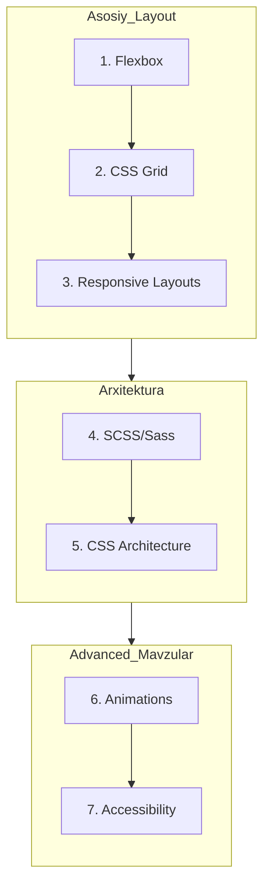

# Advanced HTML + CSS

Zamonaviy web development uchun ilg'or HTML va CSS texnikalar.

> [!IMPORTANT]
> **Nima uchun muhim?**  
> Dastlabki yillarda faqat "ishlaydigan" kod yozish yetarli bo'lsa, tajriba oshgani sari "sifatli va boshqarib bo'ladigan" kod yozish talab qilinadi. Advanced CSS — bu shunchaki chiroyli dizayn degani emas, u qanday qilib 60FPS animatsiyalar yasashni, kodni BEM orqali arxitektura qilishni va saytni barcha nogironligi bor insonlar (a11y) uchun moslashtirishni o'z ichiga oladi.

## Bo'lim tarkibi

| # | Mavzu | Tavsif | Daraja |
|---|-------|--------|--------|
| 01 | [Flexbox](./01-flexbox.md) | Bir o'lchovli layout tizimi (Asos) | Must Have |
| 02 | [CSS Grid](./02-grid.md) | Ikki o'lchovli layout tizimi | Must Have |
| 03 | [Responsive Layouts](./03-responsive-layouts.md) | Adaptiv dizayn va media queries, Container Queries | Must Have |
| 04 | [SCSS/Sass](./04-scss.md) | CSS preprocessor va uning imkoniyatlari | Important |
| 05 | [CSS Architecture](./05-css-architecture.md) | BEM, OOCSS, Utility-first (Tailwind) qoidalari | Important |
| 06 | [Animations](./06-animations.md) | Transitions, keyframes va Hardware Acceleration | Important |
| 07 | [Accessibility (A11y)](./07-accessibility.md) | WCAG, ARIA, Screen readers, Keyboard Navigation | Must Have |

---

## O'rganish tartibi (Roadmap)

---

## Junior, Middle, Senior - Nimalarni bilishi kerak?

### 🟢 Junior (Ishni bajaruvchi)
- Elementlarni o'rtaga keltirish uchun faqat **Flexbox** ishlata oladi.
- Asosiy **media query** yordamida telefon va kompyuterga moslashuvchan (Responsive) sayt yoza oladi.
- CSS da hover effektlari uchun oddiy **transition** bera oladi.
- Rasmlarga ko'r-ko'rona `alt` atributini qo'shib ketadi.

### 🟡 Middle (Muammolarni tahlil qiluvchi)
- Ikkita o'lchamli (ustun va qatorli) murakkab komponentlarni yasash uchun **CSS Grid** dan qo'rqmay foydalanadi.
- **SCSS** orqali `mixins` va o'zgaruvchilarni to'g'ri bog'lab takroriy kodni (DRY) kamaytiradi.
- Kodini doimiy ravishda **BEM** (Block__Element--Modifier) standarti bo'yicha yozadi.
- Murakkab harakatlar uchun `@keyframes` va to'g'ri `timing-function` lar tanlaydi.
- Klaviaturada ishlovchilar uchun `:focus-visible` larni esdan chiqarmaydi va contrast tekshiradi.

### 🔴 Senior (Arxitektura quruvchi va Optimallashtiruvchi)
- Qachon Grid va qachon Flex kerakligini 1 soniyada aniqlaydi. Eski brauzerlar muammosidan qochish uchun o'rinbosar texnikalar yozadi (Fallbacks).
- Loyiha uchun maxsus dizayn tokenlarini (Design Tokens) ishlab chiqadi va **CSS Variables** bilan Theming (Dark/Light mode) tizimini quradi.
- **Hardware Acceleration** ni (GPU render) biladi, Layout va Paint ni trigger qiluvchi animatsiyalar yozmaydi (faqat `transform` va `opacity`). `will-change` ni ongli ishlatadi.
- **ARIA** hossalari va Screen Reader larning qanday ishlashini to'liq tushunadi. Component larda Focus Trap (qopqon) yozishni biladi. Ekrani kichraytirib kattalashtirib tekshiradigan accessibility auditorlik qobiliyatiga ega bo'ladi.

---

## Interview Preparation (Asosiy savollar)
1. BEM qanday metodologiya va u Specificity (kuch) mojarosini qanday hal qiladi?
2. `rem`, `em`, `vh/vw` o'lchovlarining farqi va CSS Grid dagi `fr` birligi nima?
3. Nima uchun `width: 200px` ni animatsiya qilish asab buzishga, `transform: scaleX(2)` esa silliqlikka sabab bo'ladi? (Reflow va Repaint).
4. `aria-hidden="true"` berilgan elementni ko'rgan Screen Reader nima qiladi? `display: none` dan farqi bormi?
5. Container Queries (`@container`) nimasi bilan Media Queries (`@media`) dan kuchliroq va u nimalarni hal qila oladi?

---

## Foydali Resurslar

- [A Complete Guide to Flexbox (CSS-Tricks)](https://css-tricks.com/snippets/css/a-guide-to-flexbox/)
- [A Complete Guide to Grid (CSS-Tricks)](https://css-tricks.com/snippets/css/complete-guide-grid/)
- [WebAIM Contrast Checker](https://webaim.org/resources/contrastchecker/)
- [TailwindCSS Documentation](https://tailwindcss.com/docs) (Utility-first CSS uchun standart)

---

## Keyingi qadam

CSS'ning eng asosiysi bo'lgan Flexbox bilan boshlang: [01-flexbox.md](./01-flexbox.md)
