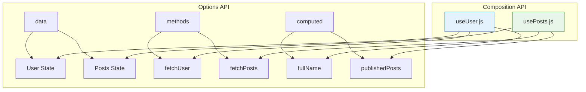

# Composition API - Vue 3 ning Yangi Reaktiv Tizimi

## Kirish

> [!IMPORTANT]
> **Nima uchun muhim?**  
> Agar sizda 1000 qatordan iborat `Options API` da yozilgan Vue 2 komponentingiz bo'lsa, uni o'qish naqadar azob ekanini bilasiz. Chunki bitta logikaga tegishli bo'lgan "State (data)", "Function (methods)" va "Computed" larni ko'rish uchun faylning boshidan oxirigacha scroll qilaverib charchaysiz. Vue 3 ning Composition API'si - xuddi shu mantiqlarni "joylar" bo'yicha emas, "vazifalar" bo'yicha bitta joyga guruhlash imkonini beradi. React Hooks ni biladiganlar uchun, bu deyarli o'sha narsa, faqat ancha ishonchli (Vue da reactivity dependency-arraylarsiz ishlaydi).

> [!NOTE]
> **Real-hayot analogiyasi: "Supermarketdagi Tartib"**  
> **Options API:** Supermarket hamma narsani turiga qarab terib chiqqan: "Meva", "Sabzavot", "Go'sht". Agar siz "Moshkichiri" qilmoqchi bo'lsangiz, go'shtni 1-qatordan, guruchni 5-qatordan, sabzini 10-qatordan qidirib sarson bo'lasiz.
> **Composition API:** Supermarketda "Moshkichiri", "Osh", "Shashlik" degan bo'limlar ochilgan. Moshkichiri uchun kerakli hamma narsa bitta bo'limda turibdi. Shuningdek, retseptni (composable) olib uyga ketsangiz ham bo'ladi!

Composition API - Vue 3 da kiritilgan yangi yondashuv bo'lib, komponent mantiqini qayta ishlatish va tashkil qilishni osonlashtiradi. Bu Options API'ni almashtiradigan narsa emas, balki alternativ va ko'p hollarda afzalroq yondashuvdir.

## Nima Uchun Composition API?

### Options API Muammosi



```javascript
// Options API - mantiq tarqalgan
export default {
  data() {
    return {
      // User feature
      user: null,
      userLoading: false,
      userError: null,

      // Posts feature
      posts: [],
      postsLoading: false,
      postsError: null,

      // Pagination feature
      currentPage: 1,
      totalPages: 0
    }
  },

  computed: {
    // User feature
    fullName() { /* ... */ },

    // Posts feature
    publishedPosts() { /* ... */ },

    // Pagination feature
    hasNextPage() { /* ... */ }
  },

  watch: {
    // User feature
    user() { /* ... */ },

    // Posts feature
    '$route.params.userId'() { /* ... */ }
  },

  methods: {
    // User feature
    fetchUser() { /* ... */ },
    updateUser() { /* ... */ },

    // Posts feature
    fetchPosts() { /* ... */ },
    deletePost() { /* ... */ },

    // Pagination feature
    nextPage() { /* ... */ },
    prevPage() { /* ... */ }
  },

  mounted() {
    this.fetchUser()
    this.fetchPosts()
  }
}
// Muammo: User, Posts, Pagination mantiqlari 5 joyga tarqalgan
```

### Composition API Yechimi

```javascript
// Composition API - mantiq guruhlangan
import { useUser } from '@/composables/useUser'
import { usePosts } from '@/composables/usePosts'
import { usePagination } from '@/composables/usePagination'

export default {
  setup() {
    // User feature - bir joyda
    const { user, loading: userLoading, error: userError, fetchUser } = useUser()

    // Posts feature - bir joyda
    const { posts, loading: postsLoading, publishedPosts, fetchPosts } = usePosts()

    // Pagination feature - bir joyda
    const { currentPage, totalPages, hasNextPage, nextPage, prevPage } = usePagination()

    return {
      user, userLoading, userError,
      posts, postsLoading, publishedPosts,
      currentPage, hasNextPage, nextPage, prevPage
    }
  }
}
```

## Setup Function

### Asosiy Tushunchalar

```javascript
import { ref, reactive, computed, watch, onMounted } from 'vue'

export default {
  props: {
    initialCount: {
      type: Number,
      default: 0
    }
  },

  // setup() - Composition API entry point
  // props - reaktiv props ob'ekti
  // context - { attrs, slots, emit, expose }
  setup(props, context) {
    // 1. Reactive State
    const count = ref(props.initialCount)
    const user = reactive({
      name: 'Ali',
      age: 25
    })

    // 2. Computed Properties
    const doubled = computed(() => count.value * 2)

    // 3. Methods
    function increment() {
      count.value++
      context.emit('change', count.value)
    }

    // 4. Watchers
    watch(count, (newVal, oldVal) => {
      console.log(`Count changed: ${oldVal} -> ${newVal}`)
    })

    // 5. Lifecycle Hooks
    onMounted(() => {
      console.log('Component mounted')
    })

    // 6. Expose public methods
    context.expose({
      increment,
      reset: () => count.value = 0
    })

    // Template'ga qaytarish
    return {
      count,
      doubled,
      user,
      increment
    }
  }
}
```

### Context Object

```javascript
export default {
  inheritAttrs: false,

  setup(props, { attrs, slots, emit, expose }) {
    // attrs - non-prop attributes (class, style, v-on handlers)
    console.log(attrs.class)
    console.log(attrs['data-id'])

    // slots - named slots
    const hasDefaultSlot = !!slots.default
    const headerContent = slots.header?.()

    // emit - event emitter
    function handleClick() {
      emit('click', { id: 1 })
      emit('update:modelValue', newValue)
    }

    // expose - public API (ref orqali accessible)
    expose({
      publicMethod() {
        console.log('Called from parent via ref')
      }
    })

    return { handleClick }
  }
}
```

## Script Setup Syntax

### Basic Usage

```vue
<script setup>
import { ref, computed, onMounted } from 'vue'
import ChildComponent from './ChildComponent.vue'

// ref automatically available in template
const count = ref(0)
const doubled = computed(() => count.value * 2)

function increment() {
  count.value++
}

onMounted(() => {
  console.log('Mounted')
})
</script>

<template>
  <div>
    <p>Count: {{ count }}</p>
    <p>Doubled: {{ doubled }}</p>
    <button @click="increment">+</button>
    <ChildComponent />
  </div>
</template>
```

### defineProps & defineEmits

```vue
<script setup>
// Compiler macros - import kerak emas

// defineProps - props declaration
const props = defineProps({
  title: String,
  count: {
    type: Number,
    required: true
  }
})

// TypeScript bilan
const props = defineProps<{
  title: string
  count: number
  items?: string[]
}>()

// Default values bilan (TypeScript)
const props = withDefaults(defineProps<{
  title?: string
  count?: number
}>(), {
  title: 'Default Title',
  count: 0
})

// defineEmits - events declaration
const emit = defineEmits(['update', 'delete'])

// TypeScript bilan
const emit = defineEmits<{
  update: [id: number, value: string]
  delete: [id: number]
}>()

function handleUpdate() {
  emit('update', 1, 'new value')
}
</script>
```

### defineModel (Vue 3.4+)

```vue
<!-- ChildComponent.vue -->
<script setup>
// defineModel - v-model uchun soddalashtirilgan sintaksis
const modelValue = defineModel()

// Named v-model
const title = defineModel('title')
const content = defineModel('content')

// TypeScript bilan
const count = defineModel<number>({ default: 0 })

// Modifiers bilan
const [value, modifiers] = defineModel({
  // modifiers.capitalize, modifiers.trim, etc.
})
</script>

<template>
  <input :value="modelValue" @input="modelValue = $event.target.value" />
</template>

<!-- ParentComponent.vue -->
<template>
  <ChildComponent v-model="text" />
  <ChildComponent v-model:title="title" v-model:content="content" />
</template>
```

### defineExpose

```vue
<script setup>
import { ref } from 'vue'

const count = ref(0)
const privateMethod = () => console.log('private')

// Faqat expose qilinganlar parent'ga ko'rinadi
defineExpose({
  count,
  publicMethod() {
    console.log('public')
  }
})
</script>

<!-- Parent -->
<script setup>
import { ref, onMounted } from 'vue'
import ChildComponent from './ChildComponent.vue'

const childRef = ref(null)

onMounted(() => {
  console.log(childRef.value.count) // 0
  childRef.value.publicMethod() // 'public'
  // childRef.value.privateMethod() - undefined!
})
</script>

<template>
  <ChildComponent ref="childRef" />
</template>
```

### defineSlots (Vue 3.3+)

```vue
<script setup lang="ts">
// Slot types uchun
const slots = defineSlots<{
  default(props: { item: Item; index: number }): any
  header(props: { title: string }): any
  footer(): any
}>()
</script>

<template>
  <div>
    <header v-if="slots.header">
      <slot name="header" :title="title" />
    </header>

    <ul>
      <li v-for="(item, index) in items" :key="item.id">
        <slot :item="item" :index="index" />
      </li>
    </ul>

    <footer v-if="slots.footer">
      <slot name="footer" />
    </footer>
  </div>
</template>
```

## Reactivity Utilities

### toRef & toRefs

```javascript
import { reactive, toRef, toRefs } from 'vue'

const state = reactive({
  foo: 1,
  bar: 2
})

// toRef - bitta property uchun ref yaratish
const fooRef = toRef(state, 'foo')
fooRef.value++ // state.foo ham o'zgaradi

// toRefs - barcha properties uchun refs
const { foo, bar } = toRefs(state)
foo.value++ // state.foo ham o'zgaradi
```

```vue
<!-- Props bilan ishlatish -->
<script setup>
import { toRef, toRefs, watch } from 'vue'

const props = defineProps(['user', 'count'])

// toRef - props'ni ref'ga aylantirish (composable'ga uzatish uchun)
const userId = toRef(props, 'user')

// toRefs - barcha props
const { user, count } = toRefs(props)

// Composable'ga uzatish
import { useUser } from '@/composables/useUser'
const { userData } = useUser(toRef(props, 'user'))
</script>
```

### unref & isRef

```javascript
import { ref, unref, isRef } from 'vue'

const count = ref(0)
const plain = 5

// unref - ref bo'lsa .value, bo'lmasa o'zi
console.log(unref(count)) // 0
console.log(unref(plain)) // 5

// isRef - ref ekanligini tekshirish
console.log(isRef(count)) // true
console.log(isRef(plain)) // false

// Composable'larda foydali
function useDouble(value) {
  return computed(() => {
    // value ref yoki oddiy qiymat bo'lishi mumkin
    return unref(value) * 2
  })
}
```

### shallowRef & shallowReactive

```javascript
import { shallowRef, shallowReactive, triggerRef } from 'vue'

// shallowRef - faqat .value o'zgarishi kuzatiladi
const state = shallowRef({ count: 0 })

state.value.count++ // Reaktiv EMAS!
state.value = { count: 1 } // Reaktiv

// triggerRef - majburan update
state.value.count++
triggerRef(state) // Endi update bo'ladi

// shallowReactive - faqat 1-level reaktiv
const user = shallowReactive({
  name: 'Ali',
  address: {
    city: 'Toshkent' // Reaktiv EMAS!
  }
})

user.name = 'Vali' // Reaktiv
user.address.city = 'Samarqand' // Reaktiv EMAS!
user.address = { city: 'Samarqand' } // Reaktiv
```

### readonly & shallowReadonly

```javascript
import { reactive, readonly, shallowReadonly } from 'vue'

const original = reactive({
  count: 0,
  nested: { value: 1 }
})

// readonly - deep immutable
const copy = readonly(original)
copy.count++ // Warning + ishlamaydi
copy.nested.value++ // Warning + ishlamaydi

// shallowReadonly - 1-level immutable
const shallowCopy = shallowReadonly(original)
shallowCopy.count++ // Warning + ishlamaydi
shallowCopy.nested.value++ // Ishlaydi!
```

### toRaw & markRaw

```javascript
import { reactive, toRaw, markRaw } from 'vue'

// toRaw - original ob'ektni olish
const original = { count: 0 }
const state = reactive(original)

console.log(toRaw(state) === original) // true

// markRaw - hech qachon reaktiv qilmaslik
const nonReactive = markRaw({
  // Katta ob'ekt yoki 3rd-party class
  data: new BigLibraryClass()
})

const state = reactive({
  // Bu nested ob'ekt reaktiv bo'lmaydi
  external: nonReactive
})
```

## Real-World Composables

### useAsync - Universal Async Handler

```javascript
// composables/useAsync.js
import { ref, shallowRef, readonly } from 'vue'

export function useAsync(asyncFn, options = {}) {
  const {
    immediate = false,
    resetOnExecute = true,
    onSuccess,
    onError
  } = options

  const data = shallowRef(null)
  const error = shallowRef(null)
  const loading = ref(false)

  async function execute(...args) {
    if (resetOnExecute) {
      data.value = null
      error.value = null
    }

    loading.value = true

    try {
      const result = await asyncFn(...args)
      data.value = result
      onSuccess?.(result)
      return result
    } catch (e) {
      error.value = e
      onError?.(e)
      throw e
    } finally {
      loading.value = false
    }
  }

  if (immediate) {
    execute()
  }

  return {
    data: readonly(data),
    error: readonly(error),
    loading: readonly(loading),
    execute
  }
}

// Ishlatish
const { data: user, loading, error, execute: fetchUser } = useAsync(
  (id) => api.getUser(id),
  {
    onSuccess: (user) => console.log('Loaded:', user.name),
    onError: (e) => toast.error(e.message)
  }
)

await fetchUser(123)
```

### usePagination

```javascript
// composables/usePagination.js
import { ref, computed, watch } from 'vue'

export function usePagination(fetchFn, options = {}) {
  const {
    pageSize = 20,
    initialPage = 1
  } = options

  const currentPage = ref(initialPage)
  const totalItems = ref(0)
  const items = ref([])
  const loading = ref(false)
  const error = ref(null)

  const totalPages = computed(() =>
    Math.ceil(totalItems.value / pageSize)
  )

  const hasNextPage = computed(() =>
    currentPage.value < totalPages.value
  )

  const hasPrevPage = computed(() =>
    currentPage.value > 1
  )

  async function fetchPage(page = currentPage.value) {
    loading.value = true
    error.value = null

    try {
      const response = await fetchFn({
        page,
        pageSize,
        offset: (page - 1) * pageSize
      })

      items.value = response.items
      totalItems.value = response.total
      currentPage.value = page
    } catch (e) {
      error.value = e
    } finally {
      loading.value = false
    }
  }

  function nextPage() {
    if (hasNextPage.value) {
      fetchPage(currentPage.value + 1)
    }
  }

  function prevPage() {
    if (hasPrevPage.value) {
      fetchPage(currentPage.value - 1)
    }
  }

  function goToPage(page) {
    if (page >= 1 && page <= totalPages.value) {
      fetchPage(page)
    }
  }

  // Initial fetch
  fetchPage()

  return {
    items,
    loading,
    error,
    currentPage,
    totalPages,
    totalItems,
    hasNextPage,
    hasPrevPage,
    fetchPage,
    nextPage,
    prevPage,
    goToPage
  }
}
```

### useForm - Form Handling

```javascript
// composables/useForm.js
import { reactive, ref, computed, watch } from 'vue'

export function useForm(initialValues, validationRules = {}) {
  const values = reactive({ ...initialValues })
  const errors = reactive({})
  const touched = reactive({})
  const isSubmitting = ref(false)

  const isValid = computed(() =>
    Object.keys(errors).length === 0
  )

  const isDirty = computed(() =>
    Object.keys(initialValues).some(
      key => values[key] !== initialValues[key]
    )
  )

  function validate(field) {
    const rules = validationRules[field]
    if (!rules) return true

    for (const rule of rules) {
      const result = rule(values[field], values)
      if (result !== true) {
        errors[field] = result
        return false
      }
    }

    delete errors[field]
    return true
  }

  function validateAll() {
    let valid = true
    for (const field of Object.keys(validationRules)) {
      if (!validate(field)) {
        valid = false
      }
    }
    return valid
  }

  function handleBlur(field) {
    touched[field] = true
    validate(field)
  }

  function reset() {
    Object.assign(values, initialValues)
    Object.keys(errors).forEach(key => delete errors[key])
    Object.keys(touched).forEach(key => delete touched[key])
  }

  async function handleSubmit(submitFn) {
    if (!validateAll()) return

    isSubmitting.value = true
    try {
      await submitFn(values)
    } finally {
      isSubmitting.value = false
    }
  }

  // Watch each field for validation
  for (const field of Object.keys(validationRules)) {
    watch(
      () => values[field],
      () => {
        if (touched[field]) {
          validate(field)
        }
      }
    )
  }

  return {
    values,
    errors,
    touched,
    isValid,
    isDirty,
    isSubmitting,
    handleBlur,
    validate,
    validateAll,
    reset,
    handleSubmit
  }
}

// Validation helpers
export const required = (message = 'Majburiy maydon') =>
  value => !!value || message

export const minLength = (min, message) =>
  value => value?.length >= min || message || `Kamida ${min} ta belgi`

export const email = (message = "Noto'g'ri email") =>
  value => /^[^\s@]+@[^\s@]+\.[^\s@]+$/.test(value) || message

// Ishlatish
const { values, errors, handleSubmit, handleBlur } = useForm(
  {
    email: '',
    password: '',
    name: ''
  },
  {
    email: [required(), email()],
    password: [required(), minLength(8)],
    name: [required()]
  }
)
```

### useEventListener - Auto Cleanup

```javascript
// composables/useEventListener.js
import { onMounted, onBeforeUnmount, unref, watch } from 'vue'

export function useEventListener(target, event, handler, options) {
  // target ref yoki element bo'lishi mumkin
  let cleanup

  const stopWatch = watch(
    () => unref(target),
    (el, _, onCleanup) => {
      if (!el) return

      el.addEventListener(event, handler, options)

      onCleanup(() => {
        el.removeEventListener(event, handler, options)
      })
    },
    { immediate: true, flush: 'post' }
  )

  // Manual cleanup
  function stop() {
    stopWatch()
  }

  // Auto cleanup on unmount
  onBeforeUnmount(stop)

  return stop
}

// Ishlatish
const buttonRef = ref(null)

useEventListener(buttonRef, 'click', () => {
  console.log('Button clicked')
})

useEventListener(window, 'resize', () => {
  console.log('Window resized')
})

useEventListener(document, 'keydown', (e) => {
  if (e.key === 'Escape') {
    closeModal()
  }
})
```

## Advanced Patterns

### Dependency Injection with Composition API

```javascript
// composables/useInject.js
import { inject, provide, ref, readonly } from 'vue'

// Theme example
const ThemeSymbol = Symbol('theme')

export function provideTheme() {
  const theme = ref('light')

  function toggleTheme() {
    theme.value = theme.value === 'light' ? 'dark' : 'light'
  }

  provide(ThemeSymbol, {
    theme: readonly(theme),
    toggleTheme
  })
}

export function useTheme() {
  const context = inject(ThemeSymbol)

  if (!context) {
    throw new Error('useTheme must be used within ThemeProvider')
  }

  return context
}
```

### State Machine Pattern

```javascript
// composables/useStateMachine.js
import { ref, computed, readonly } from 'vue'

export function useStateMachine(config) {
  const { initial, states } = config
  const current = ref(initial)

  const state = computed(() => states[current.value])

  function transition(event) {
    const currentState = states[current.value]
    const nextState = currentState.on?.[event]

    if (nextState) {
      // Exit action
      currentState.exit?.()

      // Transition
      current.value = nextState

      // Enter action
      states[nextState].enter?.()

      return true
    }

    return false
  }

  function can(event) {
    return !!states[current.value].on?.[event]
  }

  return {
    current: readonly(current),
    state,
    transition,
    can
  }
}

// Ishlatish - Fetch state machine
const { current, transition, can } = useStateMachine({
  initial: 'idle',
  states: {
    idle: {
      on: { FETCH: 'loading' }
    },
    loading: {
      enter() { console.log('Start loading...') },
      on: {
        SUCCESS: 'success',
        ERROR: 'error'
      }
    },
    success: {
      on: { RESET: 'idle', FETCH: 'loading' }
    },
    error: {
      on: { RETRY: 'loading', RESET: 'idle' }
    }
  }
})

async function fetchData() {
  transition('FETCH')
  try {
    await api.getData()
    transition('SUCCESS')
  } catch {
    transition('ERROR')
  }
}
```

## Vue 2 vs Vue 3 Composition API

```javascript
// Vue 2.7+ - Composition API mavjud (backport)
// Lekin ba'zi farqlar bor:

// Vue 2.7
import { ref, defineComponent } from 'vue'

export default defineComponent({
  setup() {
    const count = ref(0)
    return { count }
  }
})

// Vue 3 - script setup
<script setup>
import { ref } from 'vue'
const count = ref(0)
</script>
```

| Feature | Vue 2.7 | Vue 3 |
|---------|---------|-------|
| ref, reactive | ✓ | ✓ |
| computed, watch | ✓ | ✓ |
| Lifecycle hooks | ✓ | ✓ |
| `<script setup>` | ✗ | ✓ |
| defineModel | ✗ | ✓ (3.4+) |
| defineSlots | ✗ | ✓ (3.3+) |
| Suspense | ✗ | ✓ |

## Interview Savollari

### 1. Composition API ning Options API dan afzalliklari nimada?

**Javob:**

1. **Mantiqiy guruhlanish** - Feature bo'yicha kod bir joyda, Options API da 5 joyga tarqalgan (data, computed, methods, watch, lifecycle)

2. **Qayta ishlatish** - Composables orqali mantiqni oson qayta ishlatish mumkin. Options API da mixins ishlatiladi, lekin ular:
   - Nomlar to'qnashuvi (name collision)
   - Implicit dependencies
   - Qayerdan kelganini bilish qiyin

3. **TypeScript** - To'liq type inference. Options API da `this` context typing qiyin

4. **Tree-shaking** - Faqat import qilingan funksiyalar bundle'ga kiradi

5. **Testlash** - Composables oddiy JavaScript funksiyalari, test qilish oson

### 2. ref va reactive farqi nima? Qachon qaysi birini ishlatish kerak?

**Javob:**

```javascript
// ref - har qanday qiymat uchun
const count = ref(0)           // primitive
const user = ref({ name: '' }) // object ham bo'ladi
console.log(count.value)       // .value kerak

// reactive - faqat ob'ektlar uchun
const state = reactive({ count: 0 })
console.log(state.count)       // .value kerak EMAS
```

**Qachon qaysi:**
- `ref`: primitives, replaceable objects, composable return values
- `reactive`: complex state objects, form data, nested structures

**Muhim:** `reactive` destructure qilinganda reaktivlikni yo'qotadi:
```javascript
const state = reactive({ count: 0 })
const { count } = state // reaktiv EMAS!
const { count } = toRefs(state) // reaktiv
```

### 3. setup() funksiyasida `this` nima uchun ishlamaydi?

**Javob:**

`setup()` komponent instance yaratilishidan OLDIN chaqiriladi. Shuning uchun:
- `this` undefined
- `this.$emit` → `context.emit` yoki `defineEmits`
- `this.$refs` → `ref()` va template ref
- `this.$router` → `useRouter()`
- `this.$store` → `useStore()` (Pinia)

Bu aslida afzallik - barcha dependencies aniq import qilinadi, implicit magic yo'q.

### 4. watchEffect va watch farqi nima?

**Javob:**

```javascript
// watch - aniq dependency, old/new values
watch(count, (newVal, oldVal) => {
  console.log(`Changed: ${oldVal} -> ${newVal}`)
})

// watchEffect - avtomatik dependency tracking
watchEffect(() => {
  console.log(`Count is: ${count.value}`)
  // count avtomatik dependency sifatida track qilinadi
})
```

| Jihat | watch | watchEffect |
|-------|-------|-------------|
| Dependencies | Manual | Automatic |
| Old value | ✓ | ✗ |
| Lazy | ✓ (default) | ✗ (immediate) |
| Conditional | ✗ | ✓ |

### 5. Composable yaratishda qanday best practices bor?

**Javob:**

1. **Naming** - `use` prefix: `useUser`, `usePagination`

2. **Return values** - Object qaytarish (destructuring friendly):
```javascript
return { data, loading, error, execute }
```

3. **Parameters** - ref yoki getter qabul qilish:
```javascript
function useUser(id) {
  // id ref yoki getter bo'lishi mumkin
  watch(() => unref(id), fetchUser)
}
```

4. **Cleanup** - `onBeforeUnmount` da cleanup:
```javascript
function useInterval(fn, ms) {
  const id = setInterval(fn, ms)
  onBeforeUnmount(() => clearInterval(id))
}
```

5. **Readonly** - Internal state'ni readonly qaytarish:
```javascript
return {
  count: readonly(count),
  increment // mutator function
}
```

## Eng Yaxshi Amaliyotlar (Best Practices)

1. **`ref` vs `reactive` nizo:** Asosan `ref` ishlatish tavsiya qilinadi (Vue hamjamaotining xulosasi shunga kelgan). Ob'ektlar uchun `reactive` ishlatish muammosi destructuring (`const { name } = state`) qilinganda reaktivlikni yo'qotib qo'yishidir.
2. **`setup` ni unutmang:** `<script setup>` syntax-sugar (sintaktik shakar) Vue 3 da yozishning eng optimal yo'li. Bu yerda komponentlarni register qilish, `return` qilish kabi ortiqcha ishlar avtomatlashadi.
3. **Mantiqni ajrating (Composables):** Komponent ichi faqat UI render qilish va kichik state uchun qolsin. Asosiy API zaproslar, murakkab hisob-kitoblar `src/composables` ichiga chiqib ketishi kerak.

---

## Xulosa

| Yondashuv | Xususiyatlari | Qachon ishlatiladi? |
|-----------|--------------|---------------------|
| **Options API** | Mantiq (data, methods, computed) turiga qarab ajratilgan. | Kichik va oddiy komponentlar uchun, Vue 2 da eski kodlar bilan ishlaganda. |
| **Composition API** | Mantiq (funksiya va state) vazifasiga qarab bitta joyda guruhlangan. | Katta komponentlar, mantiqni qayta ishlatish kerak bo'lganda (composables). |
| **`ref()`** | Ixtiyoriy turdagi (primitive va obyekt) ma'lumotlarni reaktiv qiladi, qiymatini `.value` orqali oladi. | Asosan string, number, boolean qiymatlar uchun (eng tavsiya qilingan usul). |
| **`reactive()`** | Faqat obyektlarni (Object, Array, Map) chuqur reaktiv qiladi. `.value` yozilmaydi. | Yirik formalar yoki bitta obyekt ichida ko'p ma'lumot saqlanganda. |

Composition API Options API'ni almashtiradigan narsa emas, lekin kod organizatsiyasini tubdan yaxshilovchi, ayniqsa Typescript bilan ishlashda ideal echimdir.
