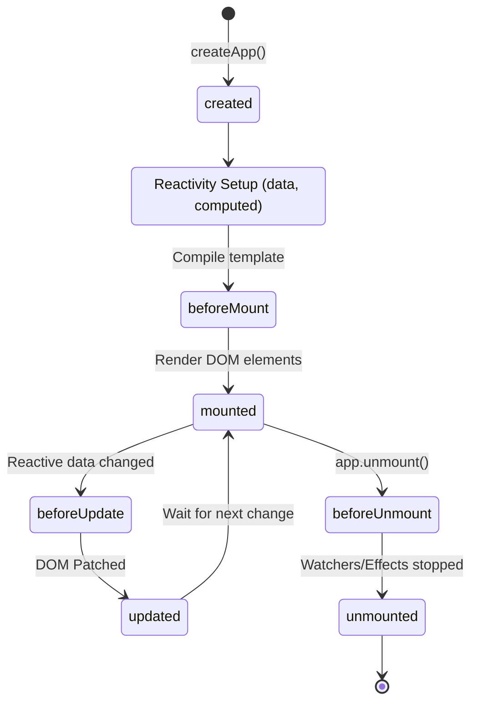

# Lifecycle Hooks - Komponent Hayot Sikli

## Kirish

> [!IMPORTANT]
> **Nima uchun muhim?**  
> Komponentlar ekranga chizilayotganda, o'zgarayotganda va ekrandan yo'qolayotganda ma'lum bir bosqichlardan o'tadi. Lifecycle (Hayot sikli) hook'lari bizga ushbu bosqichlarning har biriga "quloq solish" (eshtib turish) va aniq bir bosqichda kod ishga tushirish (masalan: ma'lumotni bazadan serverdan so'rash yoki listenerlarni o'chirish) imkonini beradi.

> [!NOTE]
> **Real-hayot analogiyasi: "Teatr tomoshasi"**  
> - **created()**: Aktyorlar ssenariyni o'qishmoqda, rollarni o'rganishmoqda (Ma'lumotlar bor, lekin sahna bo'sh).  
> - **mounted()**: Parda ochildi, aktyorlar sahnada. Tomoshabin ularni ko'rmoqda (Komponent DOM ga chizildi, ekranda ko'rindi. API so'rovlarni jo'natish uchun eng zo'r vaqt).  
> - **updated()**: Aktyor kiyimini o'zgartirib chiqdi (Data o'zgardi, DOM ham unga moslashdi).  
> - **unmounted()**: Tomosha tugadi, parda yopildi. Aktyorlar kiyimlarini yechib, uylariga tarqalishdi (Komponent o'chdi. Taymerlar, scroll listenerlarni o'chirish kerak).

## Lifecycle Diagramma



## Options API Lifecycle Hooks

### beforeCreate & created

```javascript
export default {
  data() {
    return {
      message: 'Hello'
    }
  },

  beforeCreate() {
    // this mavjud, lekin data/methods YO'Q!
    console.log(this.message) // undefined
    console.log(this.greet)   // undefined

    // Foydalanish: plugin initialization
    // (Vue 2 da Composition API polyfill)
  },

  created() {
    // data, computed, methods, watch - hammasi mavjud
    // DOM hali YO'Q!
    console.log(this.message) // 'Hello'
    console.log(this.$el)     // undefined

    // Foydalanish:
    // - API calls
    // - Event listeners (non-DOM)
    // - Timer setup
    this.fetchData()
  },

  methods: {
    async fetchData() {
      this.loading = true
      this.data = await api.getData()
      this.loading = false
    }
  }
}
```

### beforeMount & mounted

```javascript
export default {
  data() {
    return {
      chart: null
    }
  },

  beforeMount() {
    // Template compiled, but not rendered
    console.log(this.$el) // undefined (Vue 3)
    // Vue 2 da: template emas, target element

    // Foydalanish: kamdan-kam, SSR tekshiruvi
    if (typeof window === 'undefined') {
      // SSR environment
    }
  },

  mounted() {
    // DOM mavjud va accessible
    console.log(this.$el) // <div>...</div>
    console.log(this.$refs.chart) // DOM element

    // Foydalanish:
    // - DOM manipulation
    // - Third-party library initialization
    // - Focus management
    // - Scroll position

    this.initChart()
    this.$refs.input?.focus()
  },

  methods: {
    initChart() {
      // Chart.js, D3, etc.
      this.chart = new Chart(this.$refs.chart, {
        type: 'bar',
        data: this.chartData
      })
    }
  },

  beforeUnmount() {
    // Cleanup
    this.chart?.destroy()
  }
}
```

### beforeUpdate & updated

```javascript
export default {
  data() {
    return {
      items: [],
      scrollPosition: 0
    }
  },

  beforeUpdate() {
    // Data o'zgardi, DOM hali o'zgarmagan
    // Eski DOM state'ni saqlash mumkin
    this.scrollPosition = this.$el.scrollTop

    // EHTIYOT: bu yerda data o'zgartirmang!
    // Infinite loop bo'lishi mumkin
  },

  updated() {
    // DOM yangilandi
    // Yangi DOM state bilan ishlash

    // Scroll position restore
    this.$el.scrollTop = this.scrollPosition

    // Third-party library update
    this.chart?.update()

    // EHTIYOT: bu yerda data o'zgartirmang!
    // this.items.push(x) // Infinite loop!
  }
}
```

### beforeUnmount & unmounted

```javascript
export default {
  data() {
    return {
      timer: null,
      resizeHandler: null,
      subscription: null
    }
  },

  mounted() {
    // Setup
    this.timer = setInterval(this.tick, 1000)

    this.resizeHandler = () => this.handleResize()
    window.addEventListener('resize', this.resizeHandler)

    this.subscription = eventBus.subscribe('event', this.handler)
  },

  beforeUnmount() {
    // Cleanup - DOM hali mavjud
    // Animatsiya yoki transition uchun

    // Timer cleanup
    clearInterval(this.timer)

    // Event listener cleanup
    window.removeEventListener('resize', this.resizeHandler)

    // Subscription cleanup
    this.subscription?.unsubscribe()

    // WebSocket close
    this.socket?.close()
  },

  unmounted() {
    // Komponent to'liq o'chirildi
    // DOM yo'q
    console.log(this.$el) // null

    // Final cleanup (kamdan-kam kerak)
  }
}
```

## Composition API Lifecycle Hooks

### Basic Usage

```javascript
import {
  onBeforeMount,
  onMounted,
  onBeforeUpdate,
  onUpdated,
  onBeforeUnmount,
  onUnmounted,
  onErrorCaptured,
  onRenderTracked,
  onRenderTriggered
} from 'vue'

export default {
  setup() {
    // beforeCreate va created o'rniga
    // setup() o'zi shu vazifani bajaradi
    console.log('Component setup (≈ created)')

    onBeforeMount(() => {
      console.log('Before mount')
    })

    onMounted(() => {
      console.log('Mounted')
    })

    onBeforeUpdate(() => {
      console.log('Before update')
    })

    onUpdated(() => {
      console.log('Updated')
    })

    onBeforeUnmount(() => {
      console.log('Before unmount')
    })

    onUnmounted(() => {
      console.log('Unmounted')
    })
  }
}
```

### Script Setup Syntax

```vue
<script setup>
import { ref, onMounted, onBeforeUnmount } from 'vue'

const data = ref(null)
const timer = ref(null)

// Avtomatik cleanup pattern
onMounted(() => {
  console.log('Component mounted')

  // Fetch data
  fetchData()

  // Timer
  timer.value = setInterval(() => {
    console.log('tick')
  }, 1000)
})

onBeforeUnmount(() => {
  console.log('Cleanup')
  clearInterval(timer.value)
})

async function fetchData() {
  data.value = await api.getData()
}
</script>
```

### Multiple Hooks

```javascript
// Bir xil hook bir necha marta chaqirish mumkin
import { onMounted } from 'vue'

export default {
  setup() {
    // Feature A
    onMounted(() => {
      console.log('Feature A mounted')
    })

    // Feature B
    onMounted(() => {
      console.log('Feature B mounted')
    })

    // Ikkalasi ham chaqiriladi (tartib bo'yicha)
  }
}
```

## Error Handling Hooks

### errorCaptured

```javascript
// Options API
export default {
  errorCaptured(error, instance, info) {
    // Child komponent xatosini ushlash
    console.error('Error:', error)
    console.log('Component:', instance)
    console.log('Info:', info) // 'mounted hook', 'render', etc.

    // false qaytarsa, xato propagation to'xtaydi
    return false
  }
}

// Composition API
import { onErrorCaptured, ref } from 'vue'

export default {
  setup() {
    const error = ref(null)

    onErrorCaptured((err, instance, info) => {
      error.value = err
      // Log to service
      errorService.log(err, { component: instance, info })

      return false // Propagation to'xtatish
    })

    return { error }
  }
}
```

### Error Boundary Pattern

```vue
<!-- ErrorBoundary.vue -->
<template>
  <slot v-if="!error" />
  <div v-else class="error-fallback">
    <h2>Xatolik yuz berdi</h2>
    <p>{{ error.message }}</p>
    <button @click="retry">Qayta urinish</button>
  </div>
</template>

<script setup>
import { ref, onErrorCaptured } from 'vue'

const error = ref(null)

onErrorCaptured((err) => {
  error.value = err
  return false
})

function retry() {
  error.value = null
}
</script>

<!-- Usage -->
<template>
  <ErrorBoundary>
    <RiskyComponent />
  </ErrorBoundary>
</template>
```

## Debug Hooks (Vue 3)

### renderTracked & renderTriggered

```javascript
import { onRenderTracked, onRenderTriggered } from 'vue'

export default {
  setup() {
    // Dependency track qilinganda (development only)
    onRenderTracked((event) => {
      console.log('Tracked:', event)
      // {
      //   effect: ReactiveEffect,
      //   target: { count: 0 },
      //   type: 'get',
      //   key: 'count'
      // }
    })

    // Dependency o'zgarganda (development only)
    onRenderTriggered((event) => {
      console.log('Triggered:', event)
      // {
      //   effect: ReactiveEffect,
      //   target: { count: 0 },
      //   type: 'set',
      //   key: 'count',
      //   newValue: 1,
      //   oldValue: 0
      // }
    })
  }
}
```

## Server-Side Rendering Hooks

```javascript
// Nuxt.js / SSR specific hooks
import { onServerPrefetch } from 'vue'

export default {
  async setup() {
    const data = ref(null)

    // Faqat server-side da ishlaydi
    onServerPrefetch(async () => {
      data.value = await fetchData()
    })

    // Client-side da
    onMounted(async () => {
      if (!data.value) {
        data.value = await fetchData()
      }
    })

    return { data }
  }
}
```

## KeepAlive Hooks

### activated & deactivated

```vue
<!-- Parent -->
<template>
  <KeepAlive>
    <component :is="currentTab" />
  </KeepAlive>
</template>

<!-- TabComponent.vue -->
<script>
export default {
  // Options API
  activated() {
    // KeepAlive cache'dan chiqarilganda
    // mounted kabi, lekin cached component uchun
    console.log('Tab activated')
    this.refreshData()
  },

  deactivated() {
    // KeepAlive cache'ga qo'yilganda
    // unmounted o'rniga
    console.log('Tab deactivated')
    this.pausePolling()
  }
}
</script>

<!-- Composition API -->
<script setup>
import { onActivated, onDeactivated } from 'vue'

onActivated(() => {
  console.log('Activated')
})

onDeactivated(() => {
  console.log('Deactivated')
})
</script>
```

## Real-World Patterns

### Auto-cleanup Pattern

```javascript
// composables/useCleanup.js
import { onBeforeUnmount, ref } from 'vue'

export function useCleanup() {
  const cleanupFns = ref([])

  function addCleanup(fn) {
    cleanupFns.value.push(fn)
  }

  onBeforeUnmount(() => {
    cleanupFns.value.forEach(fn => fn())
    cleanupFns.value = []
  })

  return { addCleanup }
}

// Usage
<script setup>
import { onMounted } from 'vue'
import { useCleanup } from '@/composables/useCleanup'

const { addCleanup } = useCleanup()

onMounted(() => {
  const timer = setInterval(() => {}, 1000)
  addCleanup(() => clearInterval(timer))

  const handler = () => {}
  window.addEventListener('resize', handler)
  addCleanup(() => window.removeEventListener('resize', handler))

  const subscription = eventBus.subscribe('event', () => {})
  addCleanup(() => subscription.unsubscribe())
})
</script>
```

### Async Data Pattern

```javascript
// composables/useAsyncData.js
import { ref, onMounted, onBeforeUnmount } from 'vue'

export function useAsyncData(fetchFn, options = {}) {
  const { immediate = true } = options

  const data = ref(null)
  const error = ref(null)
  const loading = ref(false)
  let isMounted = true

  async function execute() {
    loading.value = true
    error.value = null

    try {
      const result = await fetchFn()
      // Komponent unmount bo'lgan bo'lsa, state yangilamaymiz
      if (isMounted) {
        data.value = result
      }
    } catch (e) {
      if (isMounted) {
        error.value = e
      }
    } finally {
      if (isMounted) {
        loading.value = false
      }
    }
  }

  onMounted(() => {
    if (immediate) {
      execute()
    }
  })

  onBeforeUnmount(() => {
    isMounted = false
  })

  return { data, error, loading, execute }
}
```

### Intersection Observer Pattern

```javascript
// composables/useIntersectionObserver.js
import { ref, onMounted, onBeforeUnmount } from 'vue'

export function useIntersectionObserver(target, callback, options = {}) {
  const isIntersecting = ref(false)
  let observer = null

  onMounted(() => {
    const element = target.value

    if (!element) return

    observer = new IntersectionObserver(([entry]) => {
      isIntersecting.value = entry.isIntersecting
      callback?.(entry)
    }, options)

    observer.observe(element)
  })

  onBeforeUnmount(() => {
    observer?.disconnect()
  })

  return { isIntersecting }
}

// Usage - Lazy loading
<script setup>
import { ref } from 'vue'
import { useIntersectionObserver } from '@/composables/useIntersectionObserver'

const containerRef = ref(null)
const isLoaded = ref(false)

const { isIntersecting } = useIntersectionObserver(
  containerRef,
  (entry) => {
    if (entry.isIntersecting && !isLoaded.value) {
      loadContent()
      isLoaded.value = true
    }
  },
  { threshold: 0.1 }
)
</script>
```

## Vue 2 vs Vue 3 Lifecycle

| Vue 2 | Vue 3 Options API | Vue 3 Composition API |
|-------|-------------------|----------------------|
| beforeCreate | beforeCreate | setup() |
| created | created | setup() |
| beforeMount | beforeMount | onBeforeMount() |
| mounted | mounted | onMounted() |
| beforeUpdate | beforeUpdate | onBeforeUpdate() |
| updated | updated | onUpdated() |
| **beforeDestroy** | **beforeUnmount** | onBeforeUnmount() |
| **destroyed** | **unmounted** | onUnmounted() |
| errorCaptured | errorCaptured | onErrorCaptured() |
| - | renderTracked | onRenderTracked() |
| - | renderTriggered | onRenderTriggered() |
| - | serverPrefetch | onServerPrefetch() |

## Interview Savollari

### 1. mounted va created farqi nima? Qachon qaysi birini ishlatish kerak?

**Javob:**

| Jihat | created | mounted |
|-------|---------|---------|
| DOM | Yo'q | Mavjud |
| $el | undefined | DOM element |
| $refs | Yo'q | Mavjud |
| SSR | Ishlaydi | Ishlamaydi |

**created** ishlatish:
- API calls (DOM kerak emas)
- Event bus subscription
- Data initialization
- SSR-friendly operations

**mounted** ishlatish:
- DOM manipulation
- Third-party libraries (Chart.js, etc.)
- Focus management
- Scroll position
- Canvas/WebGL

```javascript
// created - API call
created() {
  this.fetchData() // DOM kerak emas
}

// mounted - DOM kerak
mounted() {
  this.$refs.input.focus()
  new Chart(this.$refs.chart, config)
}
```

### 2. beforeUnmount da nimalarni cleanup qilish kerak?

**Javob:**

Memory leak'larni oldini olish uchun:

1. **Timers**
```javascript
clearInterval(this.timer)
clearTimeout(this.timeout)
```

2. **Event listeners**
```javascript
window.removeEventListener('resize', this.handler)
document.removeEventListener('keydown', this.keyHandler)
```

3. **WebSocket connections**
```javascript
this.socket.close()
```

4. **Subscriptions**
```javascript
this.subscription.unsubscribe()
this.eventBus.$off('event', this.handler)
```

5. **Third-party libraries**
```javascript
this.chart.destroy()
this.map.remove()
this.editor.dispose()
```

6. **AbortController**
```javascript
this.abortController.abort()
```

### 3. Composition API da beforeCreate va created yo'q. Nima uchun?

**Javob:**

`setup()` funksiyasi `beforeCreate` va `created` hook'lar orasida chaqiriladi va ularning vazifasini o'z ichiga oladi:

```javascript
// Options API
export default {
  beforeCreate() {
    // Reactivity setup oldin
  },
  created() {
    // Reactivity setup keyin
  }
}

// Composition API
export default {
  setup() {
    // Bu yerda hammasi tayyor
    // - reactive state
    // - computed
    // - watchers
    // - lifecycle hooks registration

    // created kabi API call
    fetchData()

    return { /* ... */ }
  }
}
```

`setup()` da `this` yo'q, shuning uchun `beforeCreate` semantikasi mantiqiy emas.

### 4. onRenderTracked va onRenderTriggered nima uchun kerak?

**Javob:**

Bu debug hook'lar **development mode** da ishlaydi va performance debugging uchun foydali:

```javascript
onRenderTracked((event) => {
  // Qaysi dependency track qilinayotganini ko'rish
  console.log('Tracked:', event.key, event.target)
})

onRenderTriggered((event) => {
  // Qaysi dependency re-render trigger qilayotganini ko'rish
  console.log('Triggered:', event.key, event.oldValue, '→', event.newValue)
})
```

**Use cases:**
- Unexpected re-renders topish
- Performance bottlenecks aniqlash
- Dependency graph tushunish

### 5. KeepAlive bilan ishlashda activated/deactivated qachon kerak?

**Javob:**

`KeepAlive` component'ni cache qiladi (unmount qilmaydi). Shuning uchun `mounted`/`unmounted` chaqirilmaydi.

```vue
<KeepAlive>
  <component :is="currentTab" />
</KeepAlive>
```

**activated** (cache'dan chiqqanda):
- Data refresh qilish
- Polling boshlash
- Animation trigger
- Scroll position restore

**deactivated** (cache'ga ketayotganda):
- Polling to'xtatish
- Temporary resources cleanup
- State save

```javascript
activated() {
  // Tab ko'rinayotganda
  this.startPolling()
  this.scrollToSavedPosition()
}

deactivated() {
  // Tab yashiringanda
  this.stopPolling()
  this.saveScrollPosition()
}
```

---

---

## Eng Yaxshi Amaliyotlar (Best Practices)

1. **Memory Leak (Xotira to'lib qolishi) ning oldini oling:** Agar siz `mounted` ichida `setInterval`, `window.addEventListener` yoki boshqa tashqi ob'ektlar ulagan bo'lsangiz, albatta ularni `unmounted` da o'chirib (clear) keting. Bo'lmasa dastur xotirani to'ldirib qo'yadi.
2. **API so'rovlari `mounted` da qiling:** Garchand API so'rovlarni `created` da qilish mumkin bo'lsa ham, eng ishonchli joy `mounted` yoki Composition API dagi `onMounted` hisoblanadi. Bu ayniqsa Nuxt.js (SSR) bilan ishlaganda double-fetch xatolarini oldini oladi.
3. **`updated` ni suiste'mol qilmang:** Odatda holat (state) o'zgarganda nimanidir o'zgartirish kerak bo'lsa, buning uchun `watch` (yoki `computed`) mosroq tushadi. `updated` har qanday holat o'zgarganda ishlayveradi, bu esa performance muammolariga olib kelishi mumkin.

---

## Xulosa

Lifecycle hooks Vue komponentining hayot siklini boshqarish uchun muhim vositalar:

- **created** - Data initialization, API calls
- **mounted** - DOM bilan ishlash, 3rd-party libraries
- **updated** - DOM yangilangandan keyin
- **beforeUnmount** - Cleanup, memory leak prevention

Vue 3 da:
- `beforeDestroy` → `beforeUnmount`
- `destroyed` → `unmounted`
- Yangi debug hooks: `renderTracked`, `renderTriggered`
- Composition API: `on` prefix (`onMounted`, etc.)
