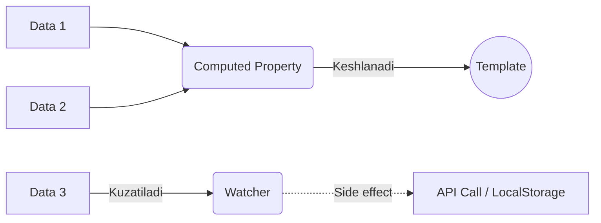

# Watchers va Computed Properties - Reaktiv Hisoblashlar

## Kirish

> [!IMPORTANT]
> **Nima uchun muhim?**  
> Dasturlashda ko'pincha bitta ma'lumotning o'zgarishi boshqalariga ham ta'sir qilishi kerak bo'ladi. Agar hisob-kitoblarni oddiy metodlar orqali qilsangiz, ular keraksiz marta qayta ishlayveradi (performance muammosi). `computed` va `watch` - bu qachon va qanday qilib o'zgarishlarga reaksiya bildirishni aniq boshqarishga imkon beradigan eng kuchli qurollardir.

> [!NOTE]
> **Real-hayot analogiyasi: "Soliqchi va Jurnalist"**  
> - **Computed (Soliqchi):** U faqat sizning sof daromadingiz (dependency) o'zgarsagina soliqlaringizni qayta hisoblab chiqadi. Agar ismingiz o'zgarsa, u soliqlarni qayta hisoblamaydi (keshlanadi). Hisoblash oxirida doim yangi qiymat (summa) qaytaradi.
> - **Watch (Jurnalist):** Sizning har bir harakatingizni kuzatib turadi. Agar siz mashina sotib olsangiz, u salkam doston yozib yuboradi, API chaqiradi yoki boshqa "side-effect" larni bajaradi. U albatta qiymat qaytarishi shart emas.



## Computed Properties

### Asosiy Tushuncha

Computed properties - bu boshqa reaktiv ma'lumotlarga asoslangan, keshlanadigan qiymatlar. Ular faqat dependency o'zgarganda qayta hisoblanadi.

```javascript
// Options API
export default {
  data() {
    return {
      firstName: 'Ali',
      lastName: 'Valiyev',
      items: [
        { name: 'Olma', price: 5000, quantity: 3 },
        { name: 'Nok', price: 7000, quantity: 2 }
      ]
    }
  },

  computed: {
    // Oddiy computed
    fullName() {
      console.log('fullName computed')
      return `${this.firstName} ${this.lastName}`
    },

    // Array bilan ishlash
    totalPrice() {
      return this.items.reduce((sum, item) => {
        return sum + (item.price * item.quantity)
      }, 0)
    },

    // Formatlangan qiymat
    formattedTotal() {
      return new Intl.NumberFormat('uz-UZ', {
        style: 'currency',
        currency: 'UZS'
      }).format(this.totalPrice)
    },

    // Filtered array
    expensiveItems() {
      return this.items.filter(item => item.price > 5000)
    },

    // Sorted array
    sortedItems() {
      // MUHIM: original array'ni mutate qilmaymiz
      return [...this.items].sort((a, b) => b.price - a.price)
    }
  }
}
```

```vue
<script setup>
import { ref, computed } from 'vue'

const firstName = ref('Ali')
const lastName = ref('Valiyev')
const items = ref([
  { name: 'Olma', price: 5000, quantity: 3 },
  { name: 'Nok', price: 7000, quantity: 2 }
])

// Computed
const fullName = computed(() => {
  console.log('fullName computed')
  return `${firstName.value} ${lastName.value}`
})

const totalPrice = computed(() => {
  return items.value.reduce((sum, item) => {
    return sum + (item.price * item.quantity)
  }, 0)
})

const expensiveItems = computed(() => {
  return items.value.filter(item => item.price > 5000)
})
</script>
```

### Getter va Setter

```javascript
// Options API
export default {
  data() {
    return {
      firstName: 'Ali',
      lastName: 'Valiyev'
    }
  },

  computed: {
    fullName: {
      get() {
        return `${this.firstName} ${this.lastName}`
      },
      set(newValue) {
        const [first, ...rest] = newValue.split(' ')
        this.firstName = first
        this.lastName = rest.join(' ')
      }
    }
  }
}

// Composition API
const firstName = ref('Ali')
const lastName = ref('Valiyev')

const fullName = computed({
  get() {
    return `${firstName.value} ${lastName.value}`
  },
  set(newValue) {
    const [first, ...rest] = newValue.split(' ')
    firstName.value = first
    lastName.value = rest.join(' ')
  }
})

// Ishlatish
fullName.value = 'Vali Karimov'
console.log(firstName.value) // 'Vali'
console.log(lastName.value)  // 'Karimov'
```

### Computed Caching

```javascript
const count = ref(0)
const random = ref(Math.random())

// CACHED - count o'zgarmasa qayta hisoblanmaydi
const doubled = computed(() => {
  console.log('doubled computed') // 1 marta
  return count.value * 2
})

// NOT CACHED - method har chaqiruvda ishlaydi
function getDoubled() {
  console.log('getDoubled called') // Har safar
  return count.value * 2
}
```

```vue
<template>
  <!-- 3 marta chiqariladi, lekin computed 1 marta hisoblanadi -->
  <p>{{ doubled }}</p>
  <p>{{ doubled }}</p>
  <p>{{ doubled }}</p>

  <!-- 3 marta method chaqiriladi! -->
  <p>{{ getDoubled() }}</p>
  <p>{{ getDoubled() }}</p>
  <p>{{ getDoubled() }}</p>
</template>
```

### Computed Best Practices

```javascript
// TO'G'RI - Pure function, side effect yo'q
const fullName = computed(() => {
  return `${firstName.value} ${lastName.value}`
})

// NOTO'G'RI - Side effect (API call)
const userData = computed(async () => {
  // Bu ishlamaydi! Computed async bo'lmasligi kerak
  return await api.getUser(userId.value)
})

// NOTO'G'RI - DOM manipulation
const element = computed(() => {
  document.title = 'New Title' // Side effect!
  return someValue.value
})

// NOTO'G'RI - Original array'ni mutate qilish
const sorted = computed(() => {
  return items.value.sort() // Original array o'zgaradi!
})

// TO'G'RI - Yangi array yaratish
const sorted = computed(() => {
  return [...items.value].sort()
})
```

## Watchers

### Basic Watch

```javascript
// Options API
export default {
  data() {
    return {
      query: '',
      userId: 1
    }
  },

  watch: {
    // Basic watcher
    query(newValue, oldValue) {
      console.log(`Query: ${oldValue} -> ${newValue}`)
      this.search(newValue)
    },

    // Method name
    userId: 'fetchUser'
  },

  methods: {
    search(query) { /* ... */ },
    fetchUser() { /* ... */ }
  }
}
```

```vue
<script setup>
import { ref, watch } from 'vue'

const query = ref('')
const userId = ref(1)

// Basic watch
watch(query, (newValue, oldValue) => {
  console.log(`Query: ${oldValue} -> ${newValue}`)
  search(newValue)
})

// Immediate - darhol chaqiriladi
watch(userId, (newValue) => {
  fetchUser(newValue)
}, { immediate: true })
</script>
```

### Watch Options

```javascript
// Options API
export default {
  data() {
    return {
      user: {
        name: 'Ali',
        profile: {
          age: 25,
          city: 'Toshkent'
        }
      },
      items: []
    }
  },

  watch: {
    // immediate - komponent yaratilganda ham chaqiriladi
    userId: {
      handler: 'fetchUser',
      immediate: true
    },

    // deep - nested o'zgarishlarni kuzatadi
    user: {
      handler(newVal, oldVal) {
        console.log('User changed:', newVal)
      },
      deep: true
    },

    // Nested path
    'user.profile.city'(newVal) {
      console.log('City changed:', newVal)
    },

    // flush - DOM yangilanishidan keyin
    items: {
      handler() {
        // DOM yangilangandan keyin scroll qilish
        this.$nextTick(() => {
          this.scrollToBottom()
        })
      },
      flush: 'post'
    }
  }
}
```

```vue
<script setup>
import { ref, reactive, watch } from 'vue'

const user = reactive({
  name: 'Ali',
  profile: {
    age: 25,
    city: 'Toshkent'
  }
})

// Deep watch
watch(user, (newVal, oldVal) => {
  // ESLATMA: reactive object uchun newVal === oldVal
  console.log('User changed')
}, { deep: true })

// Nested property
watch(
  () => user.profile.city,
  (newCity) => {
    console.log('City changed:', newCity)
  }
)

// flush: 'post' - DOM update'dan keyin
watch(source, callback, { flush: 'post' })

// flush: 'sync' - sinxron (ehtiyot bo'ling!)
watch(source, callback, { flush: 'sync' })
</script>
```

### Watching Multiple Sources

```javascript
import { ref, watch } from 'vue'

const firstName = ref('Ali')
const lastName = ref('Valiyev')
const age = ref(25)

// Array of sources
watch([firstName, lastName], ([newFirst, newLast], [oldFirst, oldLast]) => {
  console.log(`Name: ${oldFirst} ${oldLast} -> ${newFirst} ${newLast}`)
})

// Getter functions
watch(
  [() => user.name, () => user.age],
  ([newName, newAge]) => {
    console.log(`${newName}, ${newAge}`)
  }
)
```

### watchEffect

```javascript
import { ref, watchEffect, watchPostEffect, watchSyncEffect } from 'vue'

const count = ref(0)
const name = ref('Ali')

// watchEffect - avtomatik dependency tracking
watchEffect(() => {
  // count va name ikkalasi ham track qilinadi
  console.log(`Count: ${count.value}, Name: ${name.value}`)
})

// watchPostEffect - DOM update'dan keyin (flush: 'post')
watchPostEffect(() => {
  // DOM bilan ishlash
  console.log(document.querySelector('#count').textContent)
})

// watchSyncEffect - sinxron (flush: 'sync')
watchSyncEffect(() => {
  console.log(count.value) // Darhol chaqiriladi
})
```

### watchEffect vs watch

```javascript
const userId = ref(1)
const userData = ref(null)

// watch - aniq dependency, old value
watch(userId, async (newId, oldId) => {
  console.log(`User changed: ${oldId} -> ${newId}`)
  userData.value = await fetchUser(newId)
})

// watchEffect - avtomatik tracking, immediate
watchEffect(async () => {
  // userId.value ishlatilsa, avtomatik track
  userData.value = await fetchUser(userId.value)
})
```

| Jihat | watch | watchEffect |
|-------|-------|-------------|
| Dependencies | Manual (aniq ko'rsatish) | Automatic (ishlatilganlar) |
| Old value | Bor | Yo'q |
| Immediate | `{ immediate: true }` kerak | Default immediate |
| Conditional logic | Qo'llab-quvvatlamaydi | Qo'llab-quvvatlaydi |
| Lazy | Ha (default) | Yo'q |

### Watch Cleanup

```javascript
import { ref, watch, watchEffect } from 'vue'

const searchQuery = ref('')

// watch bilan cleanup
watch(searchQuery, async (newQuery, oldQuery, onCleanup) => {
  const controller = new AbortController()

  // Keyingi watch chaqirilganda yoki unmount da
  onCleanup(() => {
    controller.abort()
  })

  try {
    const results = await fetch(`/api/search?q=${newQuery}`, {
      signal: controller.signal
    })
    // ...
  } catch (e) {
    if (e.name === 'AbortError') {
      console.log('Request cancelled')
    }
  }
})

// watchEffect bilan cleanup
watchEffect((onCleanup) => {
  const timer = setInterval(() => {
    console.log('tick')
  }, 1000)

  onCleanup(() => {
    clearInterval(timer)
  })
})
```

### Stopping Watchers

```javascript
import { ref, watch, watchEffect } from 'vue'

const count = ref(0)

// watch qaytargan stop function
const stopWatch = watch(count, (newVal) => {
  console.log('Count:', newVal)

  // 10 ga yetganda to'xtatish
  if (newVal >= 10) {
    stopWatch()
  }
})

// watchEffect
const stopEffect = watchEffect(() => {
  console.log('Count:', count.value)
})

// Manual stop
setTimeout(() => {
  stopWatch()
  stopEffect()
}, 5000)
```

## Real-World Patterns

### Debounced Search

```vue
<script setup>
import { ref, watch } from 'vue'
import { useDebounceFn } from '@vueuse/core'

const query = ref('')
const results = ref([])
const loading = ref(false)

// Debounced search function
const debouncedSearch = useDebounceFn(async (searchQuery) => {
  if (!searchQuery) {
    results.value = []
    return
  }

  loading.value = true
  try {
    results.value = await api.search(searchQuery)
  } finally {
    loading.value = false
  }
}, 300)

// Watch query changes
watch(query, (newQuery) => {
  debouncedSearch(newQuery)
})
</script>
```

### Form Validation

```vue
<script setup>
import { reactive, computed, watch } from 'vue'

const form = reactive({
  email: '',
  password: '',
  confirmPassword: ''
})

const errors = reactive({
  email: '',
  password: '',
  confirmPassword: ''
})

// Email validation
watch(() => form.email, (email) => {
  if (!email) {
    errors.email = 'Email majburiy'
  } else if (!/^[^\s@]+@[^\s@]+\.[^\s@]+$/.test(email)) {
    errors.email = "Noto'g'ri email format"
  } else {
    errors.email = ''
  }
})

// Password validation
watch(() => form.password, (password) => {
  if (!password) {
    errors.password = 'Parol majburiy'
  } else if (password.length < 8) {
    errors.password = 'Parol kamida 8 ta belgi'
  } else {
    errors.password = ''
  }

  // Confirm password ham tekshirish
  if (form.confirmPassword && password !== form.confirmPassword) {
    errors.confirmPassword = 'Parollar mos emas'
  }
})

// Confirm password
watch(() => form.confirmPassword, (confirm) => {
  if (confirm !== form.password) {
    errors.confirmPassword = 'Parollar mos emas'
  } else {
    errors.confirmPassword = ''
  }
})

// Form valid computed
const isFormValid = computed(() => {
  return !errors.email && !errors.password && !errors.confirmPassword &&
         form.email && form.password && form.confirmPassword
})
</script>
```

### Auto-save Feature

```vue
<script setup>
import { ref, watch } from 'vue'
import { useDebounceFn } from '@vueuse/core'

const content = ref('')
const isSaving = ref(false)
const lastSaved = ref(null)

// Auto-save funksiyasi
const autoSave = useDebounceFn(async (newContent) => {
  isSaving.value = true
  try {
    await api.saveDocument({ content: newContent })
    lastSaved.value = new Date()
  } catch (e) {
    console.error('Save failed:', e)
  } finally {
    isSaving.value = false
  }
}, 2000)

// Content o'zgarganda auto-save
watch(content, (newContent) => {
  autoSave(newContent)
})
</script>

<template>
  <div>
    <textarea v-model="content"></textarea>
    <div class="status">
      <span v-if="isSaving">Saving...</span>
      <span v-else-if="lastSaved">
        Last saved: {{ lastSaved.toLocaleTimeString() }}
      </span>
    </div>
  </div>
</template>
```

### URL State Sync

```vue
<script setup>
import { ref, computed, watch } from 'vue'
import { useRoute, useRouter } from 'vue-router'

const route = useRoute()
const router = useRouter()

// URL dan state olish
const page = ref(parseInt(route.query.page) || 1)
const search = ref(route.query.q || '')
const sort = ref(route.query.sort || 'date')

// URL params computed
const queryParams = computed(() => ({
  page: page.value > 1 ? page.value : undefined,
  q: search.value || undefined,
  sort: sort.value !== 'date' ? sort.value : undefined
}))

// State o'zgarganda URL yangilash
watch(queryParams, (params) => {
  router.replace({ query: params })
}, { deep: true })

// URL o'zgarganda state yangilash
watch(
  () => route.query,
  (query) => {
    page.value = parseInt(query.page) || 1
    search.value = query.q || ''
    sort.value = query.sort || 'date'
  }
)
</script>
```

### Computed with Async (workaround)

```vue
<script setup>
import { ref, watchEffect, computed } from 'vue'

const userId = ref(1)
const userData = ref(null)
const loading = ref(false)
const error = ref(null)

// Async data fetching with watchEffect
watchEffect(async (onCleanup) => {
  const controller = new AbortController()
  onCleanup(() => controller.abort())

  loading.value = true
  error.value = null

  try {
    const response = await fetch(`/api/users/${userId.value}`, {
      signal: controller.signal
    })
    userData.value = await response.json()
  } catch (e) {
    if (e.name !== 'AbortError') {
      error.value = e
    }
  } finally {
    loading.value = false
  }
})

// Computed qiymatlar userData asosida
const fullName = computed(() => {
  return userData.value
    ? `${userData.value.firstName} ${userData.value.lastName}`
    : ''
})
</script>
```

## Vue 2 vs Vue 3 Farqlari

### Watch Syntax

```javascript
// Vue 2 - Options API
export default {
  watch: {
    query: {
      handler(newVal, oldVal) {
        this.search(newVal)
      },
      immediate: true,
      deep: true
    }
  }
}

// Vue 2 - $watch API
export default {
  created() {
    this.$watch('query', (newVal) => {
      this.search(newVal)
    }, { immediate: true })
  }
}

// Vue 3 - Composition API
import { watch, watchEffect } from 'vue'

watch(query, (newVal, oldVal) => {
  search(newVal)
}, { immediate: true, deep: true })

// watchEffect - Vue 3 yangi
watchEffect(() => {
  search(query.value)
})
```

### Deep Watch Behavior

```javascript
// Vue 2 - reactive object uchun deep: true kerak
watch: {
  user: {
    handler(newVal) { /* ... */ },
    deep: true
  }
}

// Vue 3 - reactive() avtomatik deep
const user = reactive({ name: 'Ali' })

// Avtomatik deep watch
watch(user, (newVal) => {
  console.log('User changed')
})

// ref() uchun deep: true kerak
const userRef = ref({ name: 'Ali' })

watch(userRef, (newVal) => {
  console.log('User changed')
}, { deep: true })
```

## Interview Savollari

### 1. Computed va watch farqi nima? Qachon qaysi birini ishlatish kerak?

**Javob:**

| Jihat | Computed | Watch |
|-------|----------|-------|
| Maqsad | Qiymat hisoblash | Side effect bajarish |
| Return | Qiymat qaytaradi | Void |
| Caching | Ha | Yo'q |
| Async | Yo'q | Ha |
| Dependencies | Avtomatik | Manual/Auto |

**Computed ishlatish:**
- Yangi qiymat hisoblash kerak bo'lganda
- Keshlanishi kerak bo'lganda
- Template da ko'rsatish uchun

**Watch ishlatish:**
- API call qilish
- localStorage yangilash
- DOM manipulation
- Async operations
- Logging/analytics

```javascript
// Computed - filtering
const activeUsers = computed(() => users.value.filter(u => u.active))

// Watch - API call
watch(userId, async (id) => {
  userData.value = await fetchUser(id)
})
```

### 2. watchEffect va watch farqi nima?

**Javob:**

```javascript
// watch - manual dependencies, lazy
watch(count, (newVal, oldVal) => {
  console.log(`${oldVal} -> ${newVal}`)
})

// watchEffect - auto dependencies, immediate
watchEffect(() => {
  console.log(`Count is ${count.value}`)
})
```

| Jihat | watch | watchEffect |
|-------|-------|-------------|
| Dependencies | Manual belgilash | Avtomatik |
| Immediate | Yo'q (default) | Ha |
| Old value | Bor | Yo'q |
| Multiple sources | Array sintaksis | Ichida ishlatish |

**watchEffect** yaxshi:
- Dependencies ko'p bo'lganda
- Old value kerak emasganda
- Immediate behavior kerak bo'lganda

### 3. Computed property'ni async qilish mumkinmi?

**Javob:**
Yo'q, computed property sinxron bo'lishi KERAK. Async logic uchun workaround:

```javascript
// NOTO'G'RI
const data = computed(async () => {
  return await fetchData() // Ishlamaydi!
})

// TO'G'RI - watchEffect + ref
const data = ref(null)
const loading = ref(false)

watchEffect(async () => {
  loading.value = true
  data.value = await fetchData(id.value)
  loading.value = false
})

// TO'G'RI - VueUse computedAsync
import { computedAsync } from '@vueuse/core'

const data = computedAsync(async () => {
  return await fetchData(id.value)
}, null) // default value
```

### 4. Deep watch performance muammolari va yechimlari?

**Javob:**

Deep watch katta ob'ektlarda sekin bo'lishi mumkin:

```javascript
// MUAMMO - katta ob'ekt
watch(bigObject, callback, { deep: true })
// Har bir nested property recursive tekshiriladi

// YECHIM 1 - Specific path
watch(() => bigObject.specific.path, callback)

// YECHIM 2 - Computed intermediate
const relevantData = computed(() => ({
  a: bigObject.value.a,
  b: bigObject.value.nested.b
}))
watch(relevantData, callback)

// YECHIM 3 - Shallow comparison
watch(
  () => JSON.stringify(bigObject.value),
  callback
)
```

### 5. Watch cleanup qachon va qanday ishlatiladi?

**Javob:**

Cleanup async operatsiyalarni cancel qilish uchun:

```javascript
watch(id, async (newId, oldId, onCleanup) => {
  const controller = new AbortController()

  // Keyingi watch yoki unmount da chaqiriladi
  onCleanup(() => {
    controller.abort()
  })

  const data = await fetch(`/api/${newId}`, {
    signal: controller.signal
  })
})

watchEffect((onCleanup) => {
  const timer = setInterval(() => {
    console.log('tick')
  }, 1000)

  onCleanup(() => clearInterval(timer))
})
```

**Kerak bo'ladigan holatlar:**
- Fetch requests (AbortController)
- Timers (clearInterval/clearTimeout)
- WebSocket connections
- Event listeners
- Subscriptions

---

## Eng Yaxshi Amaliyotlar (Best Practices)

1. **Computed property'larni sof (pure) saqlang:** `computed` ichida API call qilish, original ma'lumotlarni o'zgartirish (mutate) aslo mumkin emas. U faqat mavjud datadan yangi data yasab berishi kerak xolos.
2. **Imkon boricha Computed ishlating:** Ba'zan o'zgaruvchini kuzatib (`watch` qilib) unga bog'liq boshqa o'zgaruvchini yangilab qo'yamiz. Lekin buning o'rniga to'g'ridan-to'g'ri `computed` ishlatsa, kod qisqa va bug'larsiz bo'ladi.
3. **`watch` dagi ob'ektlarga ehtiyot bo'ling:** `deep: true` yirik ob'ektlar bilan ishlaganda tizimni qotirib qo'yishi mumkin. Iloji boricha ob'ektning aynan kerakli xossasini o'zini kuzating: `watch(() => obj.name, ...)`.

---

## Xulosa

Computed va Watch Vue reaktivligining asosiy qismlari:

- **Computed**: Hisoblangan qiymatlar, keshlanadi, sync, pure
- **Watch**: Side effectlar, async, cleanup bilan
- **watchEffect**: Avtomatik tracking, immediate

To'g'ri tanlash muhim:
- Template da ko'rsatish → Computed
- API call, localStorage → Watch
- Complex reactive logic → watchEffect
