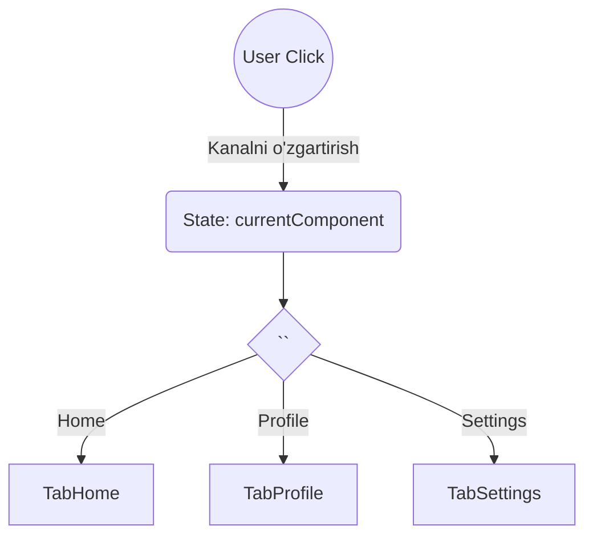

# Dynamic Components - Dinamik Komponent Almashtirish

## Kirish

> [!IMPORTANT]
> **Nima uchun muhim?**  
> Dasturlashda ko'pincha bitta joyning o'zida har xil qismlarni ko'rsatishga to'g'ri keladi (masalan, Tablar, Dialoglar, Forma bosqichlari). Bularning hammasini bitta joyga yozib, `v-if` bilan 10 xil komponentni yashirib-ko'rsatish kodni xunuk va o'qib bo'lmas darajaga olib keladi. **Dynamic Components** (Dinamik Komponentlar) orqali bittagina joy ajratib qo'yib, o'sha joyga "istalgan" komponentni joylashtirish imkoniyati paydo bo'ladi.

> [!NOTE]
> **Real-hayot analogiyasi: "Televizor ekrani"**  
> Dynamic Component (`<component :is="...">`) bu huddi televizorning ekrani. U o'z-o'zidan hech narsa ko'rsatmaydi. Lekin pult orqali kanalni (componentni) o'zgartirsangiz, ekran o'zida har xil ko'rsatuvlarni (Home, Profile, Settings) namoyish eta boshlaydi.



## Asosiy Syntax

### `<component :is="">`

```vue
<script setup>
import { ref, shallowRef } from 'vue'
import TabHome from './TabHome.vue'
import TabProfile from './TabProfile.vue'
import TabSettings from './TabSettings.vue'

// Component reference (shallowRef tavsiya etiladi)
const currentTab = shallowRef(TabHome)

const tabs = [
  { name: 'Home', component: TabHome },
  { name: 'Profile', component: TabProfile },
  { name: 'Settings', component: TabSettings }
]
</script>

<template>
  <div class="tabs">
    <button
      v-for="tab in tabs"
      :key="tab.name"
      :class="{ active: currentTab === tab.component }"
      @click="currentTab = tab.component"
    >
      {{ tab.name }}
    </button>
  </div>

  <!-- Dynamic component -->
  <component :is="currentTab" />
</template>
```

### String vs Component Reference

```vue
<script setup>
import { ref } from 'vue'
import HomeComponent from './Home.vue'
import AboutComponent from './About.vue'

// 1. Component reference (tavsiya etiladi)
const activeComponent = shallowRef(HomeComponent)

// 2. Registered component name (string)
const activeTabName = ref('home-tab')
</script>

<template>
  <!-- Component reference -->
  <component :is="activeComponent" />

  <!-- Registered component name -->
  <component :is="activeTabName" />

  <!-- HTML element -->
  <component :is="'div'">This is a div</component>
  <component :is="'button'">Click me</component>
</template>

<script>
// Global registration uchun
app.component('home-tab', HomeComponent)
app.component('about-tab', AboutComponent)
</script>
```

### Props va Events bilan

```vue
<script setup>
import { ref, shallowRef, computed } from 'vue'
import UserForm from './UserForm.vue'
import ProductForm from './ProductForm.vue'
import OrderForm from './OrderForm.vue'

const currentForm = shallowRef(UserForm)
const formData = ref({})

// Dynamic props
const formProps = computed(() => {
  if (currentForm.value === UserForm) {
    return { userId: 123, mode: 'edit' }
  }
  if (currentForm.value === ProductForm) {
    return { productId: 456, categories: ['A', 'B'] }
  }
  return {}
})

function handleSubmit(data) {
  console.log('Form submitted:', data)
  formData.value = data
}
</script>

<template>
  <component
    :is="currentForm"
    v-bind="formProps"
    @submit="handleSubmit"
    @cancel="currentForm = null"
  />
</template>
```

## KeepAlive - State Saqlash

### Basic KeepAlive

```vue
<script setup>
import { ref, shallowRef } from 'vue'
import TabA from './TabA.vue'
import TabB from './TabB.vue'

const currentTab = shallowRef(TabA)
</script>

<template>
  <!-- KeepAlive siz - har safar yangi instance -->
  <component :is="currentTab" />

  <!-- KeepAlive bilan - state saqlanadi -->
  <KeepAlive>
    <component :is="currentTab" />
  </KeepAlive>
</template>
```

### Include va Exclude

```vue
<script setup>
import { ref, shallowRef } from 'vue'
import TabHome from './TabHome.vue'
import TabProfile from './TabProfile.vue'
import TabSettings from './TabSettings.vue'
</script>

<template>
  <!-- Faqat belgilangan komponentlarni cache'lash -->
  <KeepAlive include="TabHome,TabProfile">
    <component :is="currentTab" />
  </KeepAlive>

  <!-- Array bilan -->
  <KeepAlive :include="['TabHome', 'TabProfile']">
    <component :is="currentTab" />
  </KeepAlive>

  <!-- RegExp bilan -->
  <KeepAlive :include="/Tab(Home|Profile)/">
    <component :is="currentTab" />
  </KeepAlive>

  <!-- Exclude - cache'lamaslik -->
  <KeepAlive exclude="TabSettings">
    <component :is="currentTab" />
  </KeepAlive>
</template>

<!-- Komponent nomi belgilash -->
<script>
export default {
  name: 'TabHome' // Bu nom include/exclude uchun ishlatiladi
}
</script>
```

### Max Cached Instances

```vue
<template>
  <!-- Maksimum 5 ta komponent cache'lanadi -->
  <KeepAlive :max="5">
    <component :is="currentTab" />
  </KeepAlive>

  <!-- Eng eski cache'langan komponent o'chiriladi -->
</template>
```

### Lifecycle Hooks - activated/deactivated

```vue
<script setup>
import { onActivated, onDeactivated } from 'vue'

// KeepAlive cache'dan chiqarilganda
onActivated(() => {
  console.log('Tab activated')

  // Data refresh
  fetchLatestData()

  // Polling boshlash
  startPolling()
})

// KeepAlive cache'ga qo'yilganda
onDeactivated(() => {
  console.log('Tab deactivated')

  // Polling to'xtatish
  stopPolling()

  // Cleanup
  clearTimers()
})
</script>
```

```javascript
// Options API
export default {
  activated() {
    console.log('Tab activated')
    this.fetchData()
  },

  deactivated() {
    console.log('Tab deactivated')
    this.cleanup()
  }
}
```

## Async Components

### defineAsyncComponent

```vue
<script setup>
import { defineAsyncComponent, shallowRef } from 'vue'

// Basic async component
const AsyncModal = defineAsyncComponent(() =>
  import('./Modal.vue')
)

// Loading va Error states bilan
const AsyncChart = defineAsyncComponent({
  loader: () => import('./HeavyChart.vue'),

  // Loading component
  loadingComponent: LoadingSpinner,
  delay: 200, // Loading ko'rsatish uchun kutish (ms)

  // Error component
  errorComponent: ErrorDisplay,
  timeout: 10000, // Error ko'rsatish uchun timeout

  // Suspense bilan ishlash
  suspensible: false,

  // Error handler
  onError(error, retry, fail, attempts) {
    if (attempts <= 3) {
      retry()
    } else {
      fail()
    }
  }
})

const currentComponent = shallowRef(null)

function loadChart() {
  currentComponent.value = AsyncChart
}
</script>

<template>
  <button @click="loadChart">Load Chart</button>
  <component :is="currentComponent" v-if="currentComponent" />
</template>
```

### Suspense bilan Async Components

```vue
<script setup>
import { defineAsyncComponent } from 'vue'

const AsyncUserProfile = defineAsyncComponent(() =>
  import('./UserProfile.vue')
)
</script>

<template>
  <Suspense>
    <template #default>
      <AsyncUserProfile :user-id="userId" />
    </template>

    <template #fallback>
      <div class="loading">
        <LoadingSpinner />
        <p>Loading profile...</p>
      </div>
    </template>
  </Suspense>
</template>
```

## Real-World Patterns

### Tab System

```vue
<script setup>
import { ref, shallowRef, computed, provide } from 'vue'
import TabOverview from './tabs/Overview.vue'
import TabAnalytics from './tabs/Analytics.vue'
import TabSettings from './tabs/Settings.vue'
import TabUsers from './tabs/Users.vue'

const tabs = [
  { id: 'overview', label: 'Overview', icon: 'home', component: TabOverview },
  { id: 'analytics', label: 'Analytics', icon: 'chart', component: TabAnalytics },
  { id: 'users', label: 'Users', icon: 'users', component: TabUsers },
  { id: 'settings', label: 'Settings', icon: 'settings', component: TabSettings }
]

const activeTabId = ref('overview')

const activeTab = computed(() =>
  tabs.find(tab => tab.id === activeTabId.value)
)

// Provide tab context to children
provide('activeTab', activeTabId)
provide('setActiveTab', (id) => activeTabId.value = id)
</script>

<template>
  <div class="tab-container">
    <nav class="tab-nav">
      <button
        v-for="tab in tabs"
        :key="tab.id"
        :class="['tab-button', { active: activeTabId === tab.id }]"
        @click="activeTabId = tab.id"
      >
        <Icon :name="tab.icon" />
        <span>{{ tab.label }}</span>
      </button>
    </nav>

    <main class="tab-content">
      <KeepAlive :include="['TabOverview', 'TabAnalytics']">
        <component
          :is="activeTab.component"
          :key="activeTab.id"
        />
      </KeepAlive>
    </main>
  </div>
</template>
```

### Multi-Step Wizard

```vue
<script setup>
import { ref, shallowRef, computed } from 'vue'
import Step1PersonalInfo from './steps/PersonalInfo.vue'
import Step2ContactInfo from './steps/ContactInfo.vue'
import Step3Preferences from './steps/Preferences.vue'
import Step4Review from './steps/Review.vue'

const steps = [
  { id: 1, label: 'Personal Info', component: Step1PersonalInfo },
  { id: 2, label: 'Contact', component: Step2ContactInfo },
  { id: 3, label: 'Preferences', component: Step3Preferences },
  { id: 4, label: 'Review', component: Step4Review }
]

const currentStep = ref(1)
const formData = ref({
  personal: {},
  contact: {},
  preferences: {}
})

const currentStepConfig = computed(() =>
  steps.find(step => step.id === currentStep.value)
)

const isFirstStep = computed(() => currentStep.value === 1)
const isLastStep = computed(() => currentStep.value === steps.length)

function nextStep() {
  if (!isLastStep.value) {
    currentStep.value++
  }
}

function prevStep() {
  if (!isFirstStep.value) {
    currentStep.value--
  }
}

function handleStepComplete(stepData) {
  Object.assign(formData.value, stepData)
  nextStep()
}

async function handleSubmit() {
  try {
    await api.submitForm(formData.value)
    // Success handling
  } catch (error) {
    // Error handling
  }
}
</script>

<template>
  <div class="wizard">
    <!-- Progress indicator -->
    <div class="wizard-progress">
      <div
        v-for="step in steps"
        :key="step.id"
        :class="[
          'wizard-step',
          {
            completed: step.id < currentStep,
            active: step.id === currentStep
          }
        ]"
      >
        <div class="step-number">{{ step.id }}</div>
        <div class="step-label">{{ step.label }}</div>
      </div>
    </div>

    <!-- Step content -->
    <div class="wizard-content">
      <KeepAlive>
        <component
          :is="currentStepConfig.component"
          :data="formData"
          :key="currentStep"
          @complete="handleStepComplete"
        />
      </KeepAlive>
    </div>

    <!-- Navigation -->
    <div class="wizard-nav">
      <button
        v-if="!isFirstStep"
        @click="prevStep"
        class="btn-secondary"
      >
        Previous
      </button>

      <button
        v-if="!isLastStep"
        @click="nextStep"
        class="btn-primary"
      >
        Next
      </button>

      <button
        v-else
        @click="handleSubmit"
        class="btn-success"
      >
        Submit
      </button>
    </div>
  </div>
</template>
```

### Modal System

```vue
<!-- ModalContainer.vue -->
<script setup>
import { shallowRef, provide } from 'vue'

const currentModal = shallowRef(null)
const modalProps = shallowRef({})

function openModal(component, props = {}) {
  currentModal.value = component
  modalProps.value = props
}

function closeModal() {
  currentModal.value = null
  modalProps.value = {}
}

// Provide modal functions
provide('openModal', openModal)
provide('closeModal', closeModal)

defineExpose({ openModal, closeModal })
</script>

<template>
  <slot />

  <Teleport to="body">
    <Transition name="modal">
      <div v-if="currentModal" class="modal-overlay" @click.self="closeModal">
        <div class="modal-container">
          <component
            :is="currentModal"
            v-bind="modalProps"
            @close="closeModal"
          />
        </div>
      </div>
    </Transition>
  </Teleport>
</template>
```

```vue
<!-- Ishlatish -->
<script setup>
import { inject } from 'vue'
import ConfirmDialog from './modals/ConfirmDialog.vue'
import UserFormModal from './modals/UserFormModal.vue'

const openModal = inject('openModal')
const closeModal = inject('closeModal')

function showConfirm() {
  openModal(ConfirmDialog, {
    title: "O'chirishni tasdiqlang",
    message: "Rostdan ham o'chirmoqchimisiz?",
    onConfirm: () => {
      deleteItem()
      closeModal()
    }
  })
}

function editUser(user) {
  openModal(UserFormModal, {
    user,
    mode: 'edit',
    onSave: (userData) => {
      saveUser(userData)
      closeModal()
    }
  })
}
</script>
```

### Dynamic Form Builder

```vue
<script setup>
import { computed, shallowRef } from 'vue'
import InputText from './fields/InputText.vue'
import InputNumber from './fields/InputNumber.vue'
import InputSelect from './fields/InputSelect.vue'
import InputCheckbox from './fields/InputCheckbox.vue'
import InputTextarea from './fields/InputTextarea.vue'

const fieldComponents = {
  text: InputText,
  number: InputNumber,
  select: InputSelect,
  checkbox: InputCheckbox,
  textarea: InputTextarea
}

const props = defineProps({
  schema: {
    type: Array,
    required: true
  },
  modelValue: {
    type: Object,
    default: () => ({})
  }
})

const emit = defineEmits(['update:modelValue'])

function updateField(fieldName, value) {
  emit('update:modelValue', {
    ...props.modelValue,
    [fieldName]: value
  })
}
</script>

<template>
  <form @submit.prevent>
    <div
      v-for="field in schema"
      :key="field.name"
      class="form-field"
    >
      <label :for="field.name">{{ field.label }}</label>

      <component
        :is="fieldComponents[field.type]"
        :id="field.name"
        :name="field.name"
        :model-value="modelValue[field.name]"
        v-bind="field.props"
        @update:model-value="updateField(field.name, $event)"
      />

      <span v-if="field.hint" class="hint">{{ field.hint }}</span>
    </div>
  </form>
</template>

<!-- Ishlatish -->
<script setup>
import DynamicForm from './DynamicForm.vue'
import { ref } from 'vue'

const formData = ref({
  name: '',
  age: 0,
  country: '',
  subscribe: false
})

const formSchema = [
  {
    name: 'name',
    type: 'text',
    label: 'Full Name',
    props: { placeholder: 'Enter your name' }
  },
  {
    name: 'age',
    type: 'number',
    label: 'Age',
    props: { min: 0, max: 120 }
  },
  {
    name: 'country',
    type: 'select',
    label: 'Country',
    props: {
      options: [
        { value: 'uz', label: "O'zbekiston" },
        { value: 'ru', label: 'Russia' },
        { value: 'us', label: 'USA' }
      ]
    }
  },
  {
    name: 'subscribe',
    type: 'checkbox',
    label: 'Subscribe to newsletter'
  }
]
</script>

<template>
  <DynamicForm
    :schema="formSchema"
    v-model="formData"
  />
</template>
```

## Vue 2 vs Vue 3

### Component Registration

```javascript
// Vue 2 - options da components
export default {
  components: {
    TabA,
    TabB
  },
  data() {
    return {
      currentTab: 'TabA'
    }
  }
}

// Vue 3 - import faqat yetarli (script setup)
<script setup>
import TabA from './TabA.vue'
import TabB from './TabB.vue'

const currentTab = shallowRef(TabA)
</script>
```

### Async Components

```javascript
// Vue 2
const AsyncComponent = () => ({
  component: import('./Component.vue'),
  loading: LoadingComponent,
  error: ErrorComponent,
  delay: 200,
  timeout: 3000
})

// Vue 3
const AsyncComponent = defineAsyncComponent({
  loader: () => import('./Component.vue'),
  loadingComponent: LoadingComponent,
  errorComponent: ErrorComponent,
  delay: 200,
  timeout: 3000
})
```

### KeepAlive

```vue
<!-- Vue 2 - snake-case -->
<keep-alive include="TabA,TabB">
  <component :is="currentTab" />
</keep-alive>

<!-- Vue 3 - PascalCase -->
<KeepAlive include="TabA,TabB">
  <component :is="currentTab" />
</KeepAlive>
```

## Interview Savollari

### 1. `<component :is="">` qanday ishlaydi?

**Javob:**

`<component>` - Vue ning built-in komponenti bo'lib, `:is` prop orqali qaysi komponentni render qilishni aniqlaydi.

```vue
<component :is="currentComponent" />
```

`:is` qabul qiladi:
1. **Component object** - Import qilingan component
2. **String** - Registered component name
3. **HTML tag** - 'div', 'button', etc.

```javascript
// Component reference (tavsiya etiladi)
const currentComponent = shallowRef(MyComponent)

// String (registered component)
const currentComponent = ref('my-component')

// HTML tag
const currentComponent = ref('button')
```

### 2. KeepAlive qanday ishlaydi va qachon kerak?

**Javob:**

`<KeepAlive>` komponentni cache'laydi - unmount qilish o'rniga. Bu:
- Form data saqlanadi
- Scroll position saqlanadi
- Internal state saqlanadi

**Kerak bo'lganda:**
- Tab interfaces (state saqlansin)
- Wizard steps (oldingi ma'lumotlar saqlansin)
- Frequently toggled components

```vue
<KeepAlive
  include="TabA,TabB"
  exclude="TabC"
  :max="5"
>
  <component :is="currentTab" />
</KeepAlive>
```

**Lifecycle hooks:**
- `onActivated` - cache'dan chiqqanda
- `onDeactivated` - cache'ga ketayotganda

### 3. shallowRef nima uchun component reference uchun ishlatiladi?

**Javob:**

```javascript
// ref - component'ni deep reactive qiladi
// Bu keraksiz va performance muammo
const component = ref(MyComponent)

// shallowRef - faqat reference'ni track qiladi
// Component ichki tuzilishini reactive qilmaydi
const component = shallowRef(MyComponent)
```

Component objects katta va complex. Deep reactivity:
- Performance muammo
- Keraksiz
- Warning'lar berishi mumkin

### 4. Async components qachon va qanday ishlatiladi?

**Javob:**

Async components lazy loading uchun:

```javascript
// Basic
const AsyncModal = defineAsyncComponent(() =>
  import('./Modal.vue')
)

// Full config
const AsyncChart = defineAsyncComponent({
  loader: () => import('./Chart.vue'),
  loadingComponent: Spinner,
  errorComponent: Error,
  delay: 200,
  timeout: 10000
})
```

**Use cases:**
- Katta komponentlar (charts, editors)
- Kamdan-kam ishlatiladigan features
- Code splitting
- Initial bundle kichraytirish

### 5. Dynamic components bilan props/events qanday uzatiladi?

**Javob:**

```vue
<component
  :is="currentComponent"
  v-bind="dynamicProps"
  v-on="dynamicEvents"
  @custom-event="handleEvent"
/>

<script setup>
const dynamicProps = computed(() => ({
  title: 'Hello',
  count: 5
}))

const dynamicEvents = {
  submit: handleSubmit,
  cancel: handleCancel
}
</script>
```

---

## Eng Yaxshi Amaliyotlar (Best Practices)

1. **`shallowRef` ishlating:** Komponent ob'ektini data (yoki `ref`) qilib saqlasangiz, Vue butun komponentni reactive qilishga urinib, katta performance xarajatiga tushadi. Shuning uchun Vue tarkibiy qismini faqat bitta qatlamli proxy - `shallowRef` orqali ishlating.
2. **Keshlashtirish (KeepAlive):** Tablar yoki shakllar orasida o'tganingizda, ma'lumotlar yo'qolmasligi uchun doim `<KeepAlive>` dan foydalaning. Bu o'chgan komponentni o'ldirmaydi, balki muzlatib qo'yadi.
3. **Lazy-loading (Kechiktirib yuklash):** Barcha dinamik komponentlarni bitta joyda import qilish bundle'ingizni katta qilib yuboradi. `defineAsyncComponent` bilan ularni "qachon kerak bo'lsa shundagina yuklaydigan" qilib qo'ying.

---

## Xulosa

Dynamic components Vue'da qudratli pattern:

- `<component :is="">` - Runtime da komponent tanlash
- `<KeepAlive>` - State saqlash
- `defineAsyncComponent` - Lazy loading
- `<Suspense>` - Async components uchun loading state

Bu patternlar tab systems, wizards, modal systems, va dynamic forms yaratishda juda foydali.
