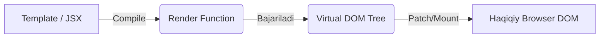

# Render Functions - Template'siz Render

## Kirish

> [!IMPORTANT]
> **Nima uchun muhim?**  
> Dasturchilar asosan `<template>` yozishni yaxshi ko'rishadi. Lekin ba'zan shunday holatlar bo'ladiki, `v-if` va `v-for` ni ming marta yozib chiqishga to'g'ri keladi (masalan dinamik head taglar, custom markdown render yoki UI kutubxonalar yaratishda). Shunday vaqtda to'g'ridan-to'g'ri JavaScript ishlatib DOM tugunlarini (Node) render qilish - ancha tez va moslashuvchan usul hisoblanadi.

> [!NOTE]
> **Real-hayot analogiyasi: "Rassom va Mashina"**  
> Tasavvur qiling, sizga 10 xil mashina rasmi kerak. `<template>` da ishlash — bu tayyor rangli qoliplar orqali mashina chizishdek gap (qulay va tushunarli). Lekin Render functions — bu qo'lga mo'yqalam olib uni erkin shaklda o'zingiz chizib chiqishga o'xshaydi. Oson emas, lekin erkinlik chegarasiz.

## Virtual DOM Tushunchasi



### VNode (Virtual Node)

```javascript
// VNode - DOM element'ning JavaScript tasviri
const vnode = {
  type: 'div',
  props: {
    class: 'container',
    id: 'app'
  },
  children: [
    {
      type: 'h1',
      props: null,
      children: 'Hello World'
    }
  ]
}

// Haqiqiy DOM ga tarjima qilinadi:
// <div class="container" id="app">
//   <h1>Hello World</h1>
// </div>
```

## h() Function - HyperScript

### Basic Syntax

```javascript
import { h } from 'vue'

// h(type, props, children)

// 1. Oddiy element
h('div')
// <div></div>

// 2. Props bilan
h('div', { class: 'container', id: 'app' })
// <div class="container" id="app"></div>

// 3. Children bilan
h('div', { class: 'container' }, 'Hello World')
// <div class="container">Hello World</div>

// 4. Multiple children
h('div', { class: 'container' }, [
  h('h1', 'Title'),
  h('p', 'Paragraph')
])
// <div class="container">
//   <h1>Title</h1>
//   <p>Paragraph</p>
// </div>

// 5. Props va children
h('button', {
  class: 'btn',
  onClick: () => console.log('clicked')
}, 'Click me')
```

### Props Binding

```javascript
import { h, ref } from 'vue'

export default {
  setup() {
    const count = ref(0)
    const inputValue = ref('')

    return () => h('div', [
      // Class binding
      h('div', {
        class: ['base-class', { active: count.value > 0 }]
      }),

      // Style binding
      h('div', {
        style: {
          color: 'red',
          fontSize: '16px'
        }
      }),

      // Event handlers
      h('button', {
        onClick: () => count.value++,
        onMouseenter: () => console.log('hover')
      }, `Count: ${count.value}`),

      // v-model equivalent
      h('input', {
        value: inputValue.value,
        onInput: (e) => inputValue.value = e.target.value
      }),

      // DOM props
      h('input', {
        type: 'checkbox',
        checked: true,
        disabled: false
      }),

      // Data attributes
      h('div', {
        'data-id': '123',
        'aria-label': 'Description'
      })
    ])
  }
}
```

### Components bilan

```javascript
import { h, resolveComponent } from 'vue'
import MyButton from './MyButton.vue'

export default {
  setup() {
    // Registered component
    const MyDialog = resolveComponent('MyDialog')

    return () => h('div', [
      // Imported component
      h(MyButton, {
        variant: 'primary',
        onClick: () => console.log('clicked')
      }, {
        default: () => 'Click me'
      }),

      // Resolved component
      h(MyDialog, {
        title: 'Hello',
        modelValue: true,
        'onUpdate:modelValue': (val) => console.log(val)
      })
    ])
  }
}
```

## Render Function Patterns

### Basic Component

```javascript
// Template version
// <template>
//   <div class="greeting">
//     <h1>{{ title }}</h1>
//     <p>{{ message }}</p>
//   </div>
// </template>

// Render function version
import { h } from 'vue'

export default {
  props: {
    title: String,
    message: String
  },

  setup(props) {
    return () => h('div', { class: 'greeting' }, [
      h('h1', props.title),
      h('p', props.message)
    ])
  }
}
```

### Conditional Rendering

```javascript
// Template: v-if / v-else
// Render function
import { h } from 'vue'

export default {
  props: ['isLoggedIn', 'user'],

  setup(props) {
    return () => {
      if (props.isLoggedIn) {
        return h('div', `Welcome, ${props.user.name}`)
      } else {
        return h('div', [
          h('p', 'Please log in'),
          h('button', { onClick: login }, 'Login')
        ])
      }
    }
  }
}
```

### List Rendering

```javascript
// Template: v-for
// Render function
import { h } from 'vue'

export default {
  props: ['items'],

  setup(props) {
    return () => h('ul', { class: 'list' },
      props.items.map((item, index) =>
        h('li', { key: item.id }, [
          h('span', { class: 'index' }, index + 1),
          h('span', { class: 'name' }, item.name)
        ])
      )
    )
  }
}
```

### Slots

```javascript
import { h, useSlots } from 'vue'

export default {
  setup(props, { slots }) {
    return () => h('div', { class: 'card' }, [
      // Default slot
      h('div', { class: 'card-body' },
        slots.default?.()
      ),

      // Named slots
      slots.header && h('div', { class: 'card-header' },
        slots.header()
      ),

      slots.footer && h('div', { class: 'card-footer' },
        slots.footer()
      )
    ])
  }
}

// Scoped slots
export default {
  props: ['items'],

  setup(props, { slots }) {
    return () => h('ul', { class: 'list' },
      props.items.map((item, index) =>
        h('li', { key: item.id },
          slots.default?.({ item, index })
        )
      )
    )
  }
}
```

### Component Children (Slots qaytarish)

```javascript
import { h } from 'vue'
import MyButton from './MyButton.vue'

export default {
  setup() {
    return () => h(MyButton, {
      variant: 'primary'
    }, {
      // Named slots as object
      default: () => 'Click me',
      icon: () => h('i', { class: 'icon-check' }),

      // Scoped slot
      tooltip: ({ content }) => h('span', content)
    })
  }
}
```

## JSX Alternative

### Setup

```javascript
// vite.config.js
import { defineConfig } from 'vite'
import vue from '@vitejs/plugin-vue'
import vueJsx from '@vitejs/plugin-vue-jsx'

export default defineConfig({
  plugins: [vue(), vueJsx()]
})
```

### JSX Syntax

```jsx
// MyComponent.jsx
import { ref, defineComponent } from 'vue'

export default defineComponent({
  props: {
    title: String,
    items: Array
  },

  setup(props, { emit, slots }) {
    const count = ref(0)
    const inputValue = ref('')

    return () => (
      <div class="container">
        {/* Conditional rendering */}
        {props.title && <h1>{props.title}</h1>}

        {/* List rendering */}
        <ul>
          {props.items.map((item, index) => (
            <li key={item.id}>
              {index + 1}. {item.name}
            </li>
          ))}
        </ul>

        {/* Events */}
        <button onClick={() => count.value++}>
          Count: {count.value}
        </button>

        {/* v-model equivalent */}
        <input
          value={inputValue.value}
          onInput={(e) => inputValue.value = e.target.value}
        />

        {/* Slots */}
        <div class="content">
          {slots.default?.()}
        </div>
      </div>
    )
  }
})
```

### JSX vs h()

```jsx
// JSX - o'qish oson
<div class="card">
  <h1>{title}</h1>
  <p>{content}</p>
  <button onClick={handleClick}>Submit</button>
</div>

// h() - ko'proq kod
h('div', { class: 'card' }, [
  h('h1', title),
  h('p', content),
  h('button', { onClick: handleClick }, 'Submit')
])
```

## Advanced Patterns

### Functional Components

```javascript
// Functional component - state yo'q, faqat props
import { h } from 'vue'

// Function as component
function FunctionalButton(props, { slots, emit }) {
  return h('button', {
    class: ['btn', `btn-${props.variant}`],
    onClick: () => emit('click')
  }, slots.default?.())
}

FunctionalButton.props = {
  variant: {
    type: String,
    default: 'primary'
  }
}

FunctionalButton.emits = ['click']

export default FunctionalButton
```

### Higher-Order Components (HOC)

```javascript
import { h, computed } from 'vue'

// withLoading HOC
function withLoading(WrappedComponent) {
  return {
    props: {
      ...WrappedComponent.props,
      loading: Boolean
    },

    setup(props, { slots, attrs }) {
      return () => {
        if (props.loading) {
          return h('div', { class: 'loading-overlay' }, [
            h('div', { class: 'spinner' }),
            h('p', 'Loading...')
          ])
        }

        return h(WrappedComponent, {
          ...props,
          ...attrs
        }, slots)
      }
    }
  }
}

// Ishlatish
import DataTable from './DataTable.vue'
const DataTableWithLoading = withLoading(DataTable)
```

### Render Props Pattern

```javascript
import { h, ref, onMounted, onBeforeUnmount } from 'vue'

// Mouse position tracker
export default {
  name: 'MouseTracker',

  setup(props, { slots }) {
    const x = ref(0)
    const y = ref(0)

    function updatePosition(e) {
      x.value = e.clientX
      y.value = e.clientY
    }

    onMounted(() => {
      window.addEventListener('mousemove', updatePosition)
    })

    onBeforeUnmount(() => {
      window.removeEventListener('mousemove', updatePosition)
    })

    // Render prop pattern
    return () => slots.default?.({
      x: x.value,
      y: y.value
    })
  }
}

// Ishlatish (template)
<template>
  <MouseTracker v-slot="{ x, y }">
    <div>Mouse: {{ x }}, {{ y }}</div>
  </MouseTracker>
</template>
```

### Dynamic Tag Name

```javascript
import { h, computed } from 'vue'

export default {
  props: {
    tag: {
      type: String,
      default: 'div'
    },
    href: String
  },

  setup(props, { slots, attrs }) {
    const computedTag = computed(() => {
      if (props.href) return 'a'
      return props.tag
    })

    return () => h(
      computedTag.value,
      {
        ...attrs,
        href: props.href
      },
      slots.default?.()
    )
  }
}
```

### Recursive Component (Tree)

```javascript
import { h } from 'vue'

const TreeNode = {
  name: 'TreeNode',

  props: {
    node: Object,
    depth: {
      type: Number,
      default: 0
    }
  },

  setup(props) {
    return () => h('div', {
      class: 'tree-node',
      style: { paddingLeft: `${props.depth * 20}px` }
    }, [
      h('span', { class: 'node-label' }, props.node.label),

      // Recursive children
      props.node.children?.length > 0 && h('div', { class: 'node-children' },
        props.node.children.map(child =>
          h(TreeNode, {
            key: child.id,
            node: child,
            depth: props.depth + 1
          })
        )
      )
    ])
  }
}

export default TreeNode
```

## Built-in Components

### Transition

```javascript
import { h, Transition, ref } from 'vue'

export default {
  setup() {
    const show = ref(true)

    return () => h('div', [
      h('button', {
        onClick: () => show.value = !show.value
      }, 'Toggle'),

      h(Transition, {
        name: 'fade',
        mode: 'out-in',
        onEnter: (el, done) => {
          // JS animation
          done()
        }
      }, {
        default: () => show.value && h('div', 'Content')
      })
    ])
  }
}
```

### TransitionGroup

```javascript
import { h, TransitionGroup, ref } from 'vue'

export default {
  setup() {
    const items = ref([1, 2, 3])

    return () => h('div', [
      h(TransitionGroup, {
        name: 'list',
        tag: 'ul'
      }, {
        default: () => items.value.map(item =>
          h('li', { key: item }, `Item ${item}`)
        )
      })
    ])
  }
}
```

### KeepAlive & Teleport

```javascript
import { h, KeepAlive, Teleport, ref } from 'vue'
import TabA from './TabA.vue'
import TabB from './TabB.vue'

export default {
  setup() {
    const currentTab = ref(TabA)
    const showModal = ref(false)

    return () => h('div', [
      // KeepAlive
      h(KeepAlive, {
        include: ['TabA', 'TabB'],
        max: 5
      }, {
        default: () => h(currentTab.value)
      }),

      // Teleport
      h(Teleport, {
        to: 'body',
        disabled: false
      }, {
        default: () => showModal.value && h('div', { class: 'modal' }, 'Modal content')
      })
    ])
  }
}
```

## Real-World Example: Table Component

```javascript
import { h, computed } from 'vue'

export default {
  name: 'DataTable',

  props: {
    columns: {
      type: Array,
      required: true
    },
    data: {
      type: Array,
      required: true
    },
    loading: Boolean,
    emptyText: {
      type: String,
      default: 'No data'
    }
  },

  emits: ['row-click', 'sort'],

  setup(props, { emit, slots }) {
    const renderHeader = () =>
      h('thead', [
        h('tr',
          props.columns.map(col =>
            h('th', {
              key: col.key,
              class: {
                sortable: col.sortable,
                [`sort-${col.sortOrder}`]: col.sortOrder
              },
              onClick: col.sortable
                ? () => emit('sort', col.key)
                : undefined
            }, [
              col.title,
              col.sortable && h('span', { class: 'sort-icon' })
            ])
          )
        )
      ])

    const renderBody = () => {
      if (props.loading) {
        return h('tbody', [
          h('tr', [
            h('td', {
              colspan: props.columns.length,
              class: 'loading-cell'
            }, [
              h('div', { class: 'spinner' }),
              'Loading...'
            ])
          ])
        ])
      }

      if (props.data.length === 0) {
        return h('tbody', [
          h('tr', [
            h('td', {
              colspan: props.columns.length,
              class: 'empty-cell'
            }, slots.empty?.() || props.emptyText)
          ])
        ])
      }

      return h('tbody',
        props.data.map((row, rowIndex) =>
          h('tr', {
            key: row.id || rowIndex,
            class: { clickable: true },
            onClick: () => emit('row-click', row, rowIndex)
          },
            props.columns.map(col =>
              h('td', { key: col.key }, [
                // Custom cell render
                slots[`cell-${col.key}`]
                  ? slots[`cell-${col.key}`]({ row, value: row[col.key] })
                  : col.render
                    ? col.render(row[col.key], row)
                    : row[col.key]
              ])
            )
          )
        )
      )
    }

    return () => h('div', { class: 'data-table-wrapper' }, [
      h('table', { class: 'data-table' }, [
        renderHeader(),
        renderBody()
      ])
    ])
  }
}
```

## Vue 2 vs Vue 3 Render Functions

```javascript
// Vue 2 - createElement (h) argument sifatida keladi
export default {
  render(h) {
    return h('div', {
      class: 'container',
      attrs: {
        id: 'app',
        'data-id': '123'
      },
      domProps: {
        innerHTML: 'content'
      },
      on: {
        click: this.handleClick
      },
      nativeOn: {
        click: this.handleNativeClick
      }
    }, this.$slots.default)
  }
}

// Vue 3 - h() import qilinadi, flat props
import { h } from 'vue'

export default {
  setup(props, { slots }) {
    return () => h('div', {
      class: 'container',
      id: 'app',
      'data-id': '123',
      innerHTML: 'content', // domProps kerak emas
      onClick: handleClick  // on prefix
    }, slots.default?.())
  }
}
```

| Jihat | Vue 2 | Vue 3 |
|-------|-------|-------|
| h() access | render(h) argument | import { h } |
| Props structure | Nested (attrs, on, domProps) | Flat |
| Event prefix | on: { click } | onClick |
| Slots | this.$slots | slots (setup context) |
| Functional | functional: true | Function component |

## Interview Savollari

### 1. Render function qachon template o'rniga ishlatiladi?

**Javob:**

1. **Dynamic tag names** - Tag runtime'da aniqlanadi
2. **Recursive components** - Tree structures
3. **Higher-order components** - Wrapper patterns
4. **Complex conditional logic** - Ko'p v-if/else
5. **Performance critical** - Fine-grained control
6. **Library/framework development**

```javascript
// Dynamic tag example
const tag = props.href ? 'a' : 'button'
return h(tag, props, slots.default?.())
```

### 2. h() function signature qanday?

**Javob:**

```javascript
h(type, props?, children?)

// type - string (HTML tag) yoki Component
// props - object (attributes, events, etc.)
// children - string, array, yoki slots object

// Examples
h('div')                    // Empty div
h('div', { class: 'box' })  // Div with class
h('div', 'Hello')           // Div with text
h('div', [h('span'), h('span')]) // Nested
h(MyComponent, { title: 'Hi' }, {
  default: () => 'Content'
})
```

### 3. JSX va h() farqi nima?

**Javob:**

**JSX:**
- HTML-like syntax
- O'qish oson
- Build step kerak (Babel/plugin)
- React dan tanish

**h():**
- Pure JavaScript
- Build step kerak emas
- Verbose
- Vue native

```jsx
// JSX
<div class="card">
  <h1>{title}</h1>
</div>

// h()
h('div', { class: 'card' }, [
  h('h1', title)
])
```

### 4. Render function'da slots qanday ishlatiladi?

**Javob:**

```javascript
setup(props, { slots }) {
  return () => h('div', [
    // Default slot
    slots.default?.(),

    // Named slot
    slots.header?.(),

    // Scoped slot
    slots.item?.({ data: item, index })
  ])
}

// Slots uzatish
h(MyComponent, null, {
  default: () => 'Content',
  header: () => h('h1', 'Title'),
  item: ({ data }) => h('span', data.name)
})
```

### 5. Functional component nima va qachon ishlatiladi?

**Javob:**

Functional component:
- State yo'q (no data)
- Instance yo'q (no this)
- Lifecycle hooks yo'q
- Faqat props → render

```javascript
function Badge(props) {
  return h('span', {
    class: ['badge', `badge-${props.type}`]
  }, props.text)
}

Badge.props = {
  type: String,
  text: String
}
```

**Qachon:**
- Simple presentational components
- Performance sensitive (kamroq overhead)
- Utility components (icons, badges)

---

## Eng Yaxshi Amaliyotlar (Best Practices)

1. **Faoliyatni murakkablashtirmang:** Agar siz qila oladigan ishni oddiy `<template>` bilan qilish iloji bo'lsa, qiling! Render funksiyalar kod o'qilishini qiyinlashtiradi.
2. **JSX haqida o'ylab ko'ring:** Agar loyihangizda Render Function ko'p bo'lsa, uni qo'lda `h('div', ...)` tarzida yozmasdan, Vue JSX/TSX ni yoqing. Reac'tdagiga o'xshab o'qilishi osonroq kod yozasiz.
3. **Statik analizdan mahrum bo'lish:** Vue compiler `<template>` da ko'p optimizatsiyalar qiladi (Statik tugunlarni olib qo'yish kabi). Render funksiya orqali bu optimizatsiyalardan tushib qolishingiz mumkinligini unutmang.

---

## Xulosa

| Yondashuv | Nima u? | Qachon ishlatiladi? |
|-----------|---------|---------------------|
| **Template (`<template>`)** | Oddiy HTML ga o'xshash, Vue compile qiladigan sintaksis. | Deyarli 95% hollarda, oddiy va tushunarli UI yasash uchun. |
| **Render Function (`h()`)** | JS funksiyasi orqali Virtual DOM yaratish usuli. | Yozish qiyin bo'lgan murakkab dinamik logikalarda (masalan ixtiyoriy tag nomini yasash `h(tagName)`). |
| **JSX / TSX** | React ga o'xshab JavaScript ichida HTML yozish imkoniyati. | Render funksiyalar kerak bo'lib, lekin `h()` ni o'qish qiyinlashib ketganda. |
| **Functional Component** | Faqat `props` olib UI qaytaradigan davlatsiz (stateless) komponent. | Hech qanday state yoki lifecycle yo'q, shunchaki HTML qaytaruvchi kichik ikonka/badgelar yasashda (Vue 3 da performance farqi deyarli yo'q). |

Render funksiyalar Vue ning "maxfiy quroli" bo'lib, kerak paytda cheksiz moslashuvchanlikni taqdim etadi. Lekin oddiy komponentlar uchun her doim Template afzalroq.
