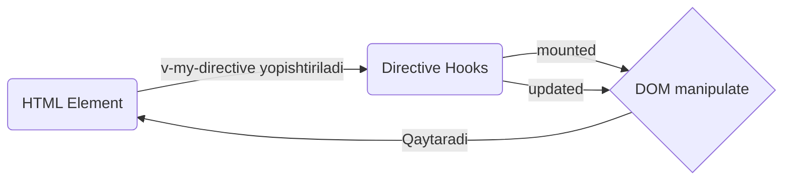

# Custom Directives - Maxsus Direktivalar

## Kirish

> [!IMPORTANT]
> **Nima uchun muhim?**  
> Dasturchilar UI yaratayotganda elementlar bilan to'g'ridan-to'g'ri (DOM orqali) ishlashdan imkon qadar qochishlari kerak (chunki buni Framework qiladi). Ammo ba'zan uchinchi tomon kutubxonalari bilan ishlash, Input'ga fokus qaratish, Scroll eventlarini kuzatish kabi pastki-daraja (low-level) amallar kerak bo'ladi. Bunday holatlarda HTML atributlarga o'zimiz yasagan qo'shimcha "sehrli so'zlarni" (`v-focus`, `v-tooltip`) yopishtirib, Vue ichida DOM elementini erkin boshqarishimiz mumkin. Buni **Custom Directives** deymiz.

> [!NOTE]
> **Real-hayot analogiyasi: "Sehrli tayoqcha"**  
> Tasavvur qiling, har safar eshikni ochish uchun qo'lingiz bilan tutqichga borish o'rniga, shunchaki eshikka "Ochil" degan tumor yopishtirib qo'yasiz. `v-tooltip` yoki `v-focus` ham huddi shunday "tumor" — uni HTML dagi oddiy tag (masalan `<input>`) ga yopishtirsangiz, Vue unga yangi xususiyatlarni biriktirib, jon kiritadi.



## Direktiva Lifecycle Hooks

```javascript
// Vue 3 directive hooks
const myDirective = {
  // Element DOM'ga qo'shilishidan oldin
  created(el, binding, vnode, prevVnode) {
    // ...
  },

  // Element DOM'ga qo'shilishidan oldin (parent mount bo'lishidan oldin)
  beforeMount(el, binding, vnode, prevVnode) {
    // ...
  },

  // Element DOM'ga qo'shilgandan keyin (parent mount bo'lgandan keyin)
  mounted(el, binding, vnode, prevVnode) {
    // ...
  },

  // Parent component update bo'lishidan oldin
  beforeUpdate(el, binding, vnode, prevVnode) {
    // ...
  },

  // Parent component update bo'lgandan keyin
  updated(el, binding, vnode, prevVnode) {
    // ...
  },

  // Parent unmount bo'lishidan oldin
  beforeUnmount(el, binding, vnode, prevVnode) {
    // ...
  },

  // Parent unmount bo'lgandan keyin
  unmounted(el, binding, vnode, prevVnode) {
    // ...
  }
}
```

### Binding Object

```javascript
const myDirective = {
  mounted(el, binding) {
    console.log(binding.value)      // v-my-dir="value" - qiymat
    console.log(binding.oldValue)   // oldingi qiymat (update da)
    console.log(binding.arg)        // v-my-dir:arg - argument
    console.log(binding.modifiers)  // v-my-dir.mod1.mod2 - { mod1: true, mod2: true }
    console.log(binding.instance)   // component instance
    console.log(binding.dir)        // directive object o'zi
  }
}

// Misol: v-my-dir:top.animated="100"
// binding = {
//   value: 100,
//   arg: 'top',
//   modifiers: { animated: true }
// }
```

## Direktiva Yaratish

### Function Shorthand

```javascript
// Faqat mounted va updated uchun bir xil logic
const vFocus = (el) => {
  el.focus()
}

// Ishlatish
<input v-focus />
```

### Object Syntax

```javascript
// Full control
const vHighlight = {
  mounted(el, binding) {
    el.style.backgroundColor = binding.value || 'yellow'
  },
  updated(el, binding) {
    el.style.backgroundColor = binding.value || 'yellow'
  }
}

// Ishlatish
<p v-highlight>Yellow background</p>
<p v-highlight="'red'">Red background</p>
```

## Ro'yxatdan O'tkazish

### Global Registration

```javascript
// main.js
import { createApp } from 'vue'
import App from './App.vue'

const app = createApp(App)

// Direktiva
app.directive('focus', {
  mounted(el) {
    el.focus()
  }
})

// Function shorthand
app.directive('color', (el, binding) => {
  el.style.color = binding.value
})

app.mount('#app')
```

### Local Registration

```vue
<script setup>
// v- prefix kerak EMAS
const vFocus = {
  mounted(el) {
    el.focus()
  }
}

const vColor = (el, binding) => {
  el.style.color = binding.value
}
</script>

<template>
  <input v-focus />
  <p v-color="'blue'">Blue text</p>
</template>
```

```javascript
// Options API
export default {
  directives: {
    focus: {
      mounted(el) {
        el.focus()
      }
    },
    color: (el, binding) => {
      el.style.color = binding.value
    }
  }
}
```

## Real-World Directives

### v-click-outside

```javascript
// directives/clickOutside.js
export const vClickOutside = {
  mounted(el, binding) {
    el._clickOutsideHandler = (event) => {
      // Element tashqarisida click bo'lganini tekshirish
      if (!el.contains(event.target) && el !== event.target) {
        binding.value(event)
      }
    }

    document.addEventListener('click', el._clickOutsideHandler)
  },

  unmounted(el) {
    document.removeEventListener('click', el._clickOutsideHandler)
    delete el._clickOutsideHandler
  }
}

// Ishlatish
<template>
  <div v-click-outside="closeDropdown" class="dropdown">
    <button @click="isOpen = !isOpen">Toggle</button>
    <ul v-if="isOpen">
      <li>Option 1</li>
      <li>Option 2</li>
    </ul>
  </div>
</template>

<script setup>
import { ref } from 'vue'
import { vClickOutside } from '@/directives/clickOutside'

const isOpen = ref(false)

function closeDropdown() {
  isOpen.value = false
}
</script>
```

### v-tooltip

```javascript
// directives/tooltip.js
export const vTooltip = {
  mounted(el, binding) {
    const tooltip = document.createElement('div')
    tooltip.className = 'tooltip'
    tooltip.textContent = binding.value

    // Position
    const position = binding.arg || 'top'
    tooltip.classList.add(`tooltip-${position}`)

    // Modifiers
    if (binding.modifiers.dark) {
      tooltip.classList.add('tooltip-dark')
    }

    el._tooltip = tooltip
    el._showTooltip = () => {
      document.body.appendChild(tooltip)
      positionTooltip(el, tooltip, position)
    }
    el._hideTooltip = () => {
      tooltip.remove()
    }

    el.addEventListener('mouseenter', el._showTooltip)
    el.addEventListener('mouseleave', el._hideTooltip)
  },

  updated(el, binding) {
    if (el._tooltip) {
      el._tooltip.textContent = binding.value
    }
  },

  unmounted(el) {
    el.removeEventListener('mouseenter', el._showTooltip)
    el.removeEventListener('mouseleave', el._hideTooltip)
    el._tooltip?.remove()
  }
}

function positionTooltip(el, tooltip, position) {
  const rect = el.getBoundingClientRect()

  switch (position) {
    case 'top':
      tooltip.style.left = `${rect.left + rect.width / 2}px`
      tooltip.style.top = `${rect.top - 8}px`
      break
    case 'bottom':
      tooltip.style.left = `${rect.left + rect.width / 2}px`
      tooltip.style.top = `${rect.bottom + 8}px`
      break
    // ... right, left
  }
}

// Ishlatish
<button v-tooltip="'Saqlash'">Save</button>
<button v-tooltip:bottom="'O\'chirish'">Delete</button>
<button v-tooltip.dark="'Dark tooltip'">Dark</button>
```

### v-permission

```javascript
// directives/permission.js
import { useAuthStore } from '@/stores/auth'

export const vPermission = {
  mounted(el, binding) {
    const authStore = useAuthStore()
    const requiredPermission = binding.value
    const modifiers = binding.modifiers

    const hasPermission = checkPermission(
      authStore.permissions,
      requiredPermission,
      modifiers
    )

    if (!hasPermission) {
      if (modifiers.hide) {
        el.style.display = 'none'
      } else if (modifiers.disable) {
        el.setAttribute('disabled', 'true')
        el.classList.add('disabled')
      } else {
        // Default: remove from DOM
        el.parentNode?.removeChild(el)
      }
    }
  }
}

function checkPermission(userPermissions, required, modifiers) {
  if (Array.isArray(required)) {
    if (modifiers.all) {
      return required.every(p => userPermissions.includes(p))
    }
    return required.some(p => userPermissions.includes(p))
  }
  return userPermissions.includes(required)
}

// Ishlatish
<button v-permission="'user:create'">Create User</button>
<button v-permission.disable="'user:delete'">Delete</button>
<button v-permission.hide="'admin'">Admin Panel</button>
<button v-permission.all="['user:read', 'user:write']">Edit</button>
```

### v-lazy-load

```javascript
// directives/lazyLoad.js
export const vLazyLoad = {
  mounted(el, binding) {
    const options = {
      root: null,
      rootMargin: '50px',
      threshold: 0.1
    }

    const observer = new IntersectionObserver((entries) => {
      entries.forEach(entry => {
        if (entry.isIntersecting) {
          // img element
          if (el.tagName === 'IMG') {
            el.src = binding.value
            el.classList.remove('lazy')
            el.classList.add('loaded')
          }
          // Background image
          else {
            el.style.backgroundImage = `url(${binding.value})`
          }

          observer.unobserve(el)
        }
      })
    }, options)

    el._lazyLoadObserver = observer
    observer.observe(el)

    // Placeholder
    if (el.tagName === 'IMG') {
      el.classList.add('lazy')
      el.src = binding.arg || '/placeholder.png'
    }
  },

  unmounted(el) {
    el._lazyLoadObserver?.disconnect()
  }
}

// Ishlatish


<div v-lazy-load="bgImageUrl" class="hero-section"></div>
```

### v-copy

```javascript
// directives/copy.js
export const vCopy = {
  mounted(el, binding) {
    el._copyHandler = async () => {
      const text = binding.value || el.textContent

      try {
        await navigator.clipboard.writeText(text)

        // Success feedback
        const originalText = el.textContent
        if (binding.modifiers.feedback) {
          el.textContent = 'Copied!'
          setTimeout(() => {
            el.textContent = originalText
          }, 1500)
        }

        // Custom callback
        if (typeof binding.arg === 'function') {
          binding.arg(text)
        }
      } catch (err) {
        console.error('Copy failed:', err)
      }
    }

    el.style.cursor = 'pointer'
    el.addEventListener('click', el._copyHandler)
  },

  unmounted(el) {
    el.removeEventListener('click', el._copyHandler)
  }
}

// Ishlatish
<span v-copy="secretCode">Click to copy</span>
<code v-copy.feedback>npm install vue</code>
<button v-copy="text" :arg="onCopied">Copy</button>
```

### v-intersection

```javascript
// directives/intersection.js
export const vIntersection = {
  mounted(el, binding) {
    const callback = binding.value
    const options = {
      root: binding.arg || null,
      threshold: binding.modifiers.half ? 0.5 : 0.1,
      rootMargin: '0px'
    }

    const observer = new IntersectionObserver((entries) => {
      entries.forEach(entry => {
        if (entry.isIntersecting) {
          callback(entry)

          // Once modifier - bir marta kuzatish
          if (binding.modifiers.once) {
            observer.unobserve(el)
          }
        }
      })
    }, options)

    el._intersectionObserver = observer
    observer.observe(el)
  },

  unmounted(el) {
    el._intersectionObserver?.disconnect()
  }
}

// Ishlatish
<div v-intersection="onVisible">Animated section</div>
<div v-intersection.once="loadMore">Load more trigger</div>
<div v-intersection.half="handleHalfVisible">50% visible trigger</div>
```

### v-debounce

```javascript
// directives/debounce.js
export const vDebounce = {
  mounted(el, binding) {
    const delay = parseInt(binding.arg) || 300
    const handler = binding.value
    let timeoutId = null

    const eventType = binding.modifiers.input ? 'input' :
                      binding.modifiers.click ? 'click' :
                      binding.modifiers.scroll ? 'scroll' : 'input'

    el._debounceHandler = (event) => {
      clearTimeout(timeoutId)
      timeoutId = setTimeout(() => {
        handler(event)
      }, delay)
    }

    el.addEventListener(eventType, el._debounceHandler)
  },

  unmounted(el) {
    el.removeEventListener('input', el._debounceHandler)
    el.removeEventListener('click', el._debounceHandler)
    el.removeEventListener('scroll', el._debounceHandler)
  }
}

// Ishlatish
<input v-debounce:500="search" />
<button v-debounce:1000.click="handleClick">Click</button>
<div v-debounce:200.scroll="handleScroll">Scroll area</div>
```

### v-resize

```javascript
// directives/resize.js
export const vResize = {
  mounted(el, binding) {
    const callback = binding.value

    el._resizeObserver = new ResizeObserver((entries) => {
      for (const entry of entries) {
        callback({
          width: entry.contentRect.width,
          height: entry.contentRect.height
        })
      }
    })

    el._resizeObserver.observe(el)
  },

  unmounted(el) {
    el._resizeObserver?.disconnect()
  }
}

// Ishlatish
<div v-resize="handleResize" class="resizable">
  Content
</div>

<script setup>
function handleResize({ width, height }) {
  console.log(`Size: ${width}x${height}`)
}
</script>
```

## Components va Directives

### Component'ga Directive

```vue
<template>
  <!-- Directive component'ning root elementiga qo'llaniladi -->
  <MyButton v-focus />

  <!-- Multiple root - Warning! -->
  <MyFragmentComponent v-focus />
</template>
```

### Directive ichida Component Access

```javascript
const vMyDirective = {
  mounted(el, binding) {
    // Component instance (Options API)
    const component = binding.instance

    // Component methods/data
    console.log(component.someMethod)
    console.log(component.someData)
  }
}
```

## Directives vs Composables

```javascript
// Directive - DOM manipulation uchun
const vFocus = {
  mounted(el) {
    el.focus()
  }
}

// Composable - reactive logic uchun
function useFocus(elementRef) {
  onMounted(() => {
    elementRef.value?.focus()
  })

  function focus() {
    elementRef.value?.focus()
  }

  return { focus }
}

// Qachon directive?
// - Oddiy DOM manipulation
// - Third-party library integration
// - Global DOM behaviors

// Qachon composable?
// - Reactive state kerak
// - Complex logic
// - Multiple elements
// - Conditional behavior
```

## Vue 2 vs Vue 3

### Hook Names

| Vue 2 | Vue 3 |
|-------|-------|
| bind | beforeMount |
| inserted | mounted |
| update | - (removed) |
| componentUpdated | updated |
| unbind | unmounted |
| - | created |
| - | beforeUpdate |
| - | beforeUnmount |

### Migration Example

```javascript
// Vue 2
export default {
  bind(el, binding) {
    // Element DOM'ga qo'shilishidan oldin
  },
  inserted(el, binding) {
    // Element DOM'ga qo'shilgandan keyin
  },
  update(el, binding) {
    // Component update, lekin children emas
  },
  componentUpdated(el, binding) {
    // Component va children updated
  },
  unbind(el, binding) {
    // Cleanup
  }
}

// Vue 3
export default {
  beforeMount(el, binding) {
    // bind
  },
  mounted(el, binding) {
    // inserted
  },
  // update o'chirilgan
  updated(el, binding) {
    // componentUpdated
  },
  unmounted(el, binding) {
    // unbind
  }
}
```

### Binding Object Changes

```javascript
// Vue 2
binding.expression  // "user.name"
binding.name        // "my-directive"

// Vue 3
binding.expression  // O'chirilgan
// binding.dir orqali directive o'ziga access
```

## Interview Savollari

### 1. Custom directive qachon kerak?

**Javob:**

Custom directives DOM elementlariga low-level access kerak bo'lganda ishlatiladi:

1. **Focus management** - Input focus qilish
2. **Scroll behavior** - Infinite scroll, sticky headers
3. **Third-party integrations** - Chart.js, tippy.js
4. **DOM observers** - Intersection, Resize, Mutation
5. **Event handling** - Click outside, keyboard shortcuts
6. **Animation triggers** - Scroll animations

```javascript
// Misol: v-scroll-reveal
const vScrollReveal = {
  mounted(el) {
    el.style.opacity = '0'
    el.style.transform = 'translateY(20px)'

    const observer = new IntersectionObserver(entries => {
      if (entries[0].isIntersecting) {
        el.style.transition = 'all 0.5s ease'
        el.style.opacity = '1'
        el.style.transform = 'translateY(0)'
        observer.unobserve(el)
      }
    })

    observer.observe(el)
  }
}
```

### 2. Directive vs Component farqi?

**Javob:**

| Jihat | Directive | Component |
|-------|-----------|-----------|
| DOM access | Direct | Template/render |
| Reusability | Behavior | UI + behavior |
| State | Yo'q (element da) | Ha (reactive) |
| Template | Yo'q | Ha |
| Slots | Yo'q | Ha |
| Props | Binding only | Full props |

**Directive** - DOM manipulation behavior (click outside, focus, tooltip)
**Component** - Reusable UI with state (Button, Modal, Card)

### 3. Directive cleanup nima uchun muhim?

**Javob:**

Memory leak oldini olish uchun unmounted hook'da cleanup qilish MUHIM:

```javascript
const vMyDirective = {
  mounted(el) {
    // Setup
    el._handler = () => console.log('event')
    el._observer = new IntersectionObserver(callback)
    el._timer = setInterval(() => {}, 1000)

    window.addEventListener('resize', el._handler)
    el._observer.observe(el)
  },

  unmounted(el) {
    // CLEANUP - yo'qsa memory leak!
    window.removeEventListener('resize', el._handler)
    el._observer.disconnect()
    clearInterval(el._timer)

    // Element properties tozalash
    delete el._handler
    delete el._observer
    delete el._timer
  }
}
```

### 4. Directive binding object tarkibi?

**Javob:**

```javascript
// v-my-dir:arg.mod1.mod2="value"

{
  value: /* computed value */,
  oldValue: /* previous value (updated only) */,
  arg: 'arg',
  modifiers: { mod1: true, mod2: true },
  instance: /* component instance */,
  dir: /* directive object */
}
```

### 5. Function shorthand qachon ishlatiladi?

**Javob:**

Faqat mounted va updated bir xil logic bo'lganda:

```javascript
// Full object - turli logic
const vHighlight = {
  mounted(el, binding) {
    el.style.backgroundColor = binding.value
    el.style.transition = 'background-color 0.3s'
  },
  updated(el, binding) {
    el.style.backgroundColor = binding.value
  },
  unmounted(el) {
    // cleanup
  }
}

// Function shorthand - bir xil logic
const vColor = (el, binding) => {
  el.style.color = binding.value
}
// mounted va updated da bir xil function chaqiriladi
```

---

## Eng Yaxshi Amaliyotlar (Best Practices)

1. **Juda ko'p ishlatavermang:** Agar muammoni `Components` yoki `Composables` orqali hal qila olsangiz, ularni ishlating. Direktivalar asosan DOM bilan yalang'och (raw) ishlash kerak bo'lgandagina kerak. Mantiq yozish joyi emas u.
2. **Nomlanish (Naming conventions):** O'z direktivangizga aniq va nima ish qilishini tushuntiruvchi nom bering (Masalan: `v-scroll-to-top`, `v-focus`).
3. **Tozalashni (Cleanup) unutmang:** Event listener qo'shgan bo'lsangiz (`addEventListener`), uni albatta `unmounted` hook'ida olib tashlang (`removeEventListener`). Aks holda ilovangiz xotirasiga og'irlik tushadi (Memory leak).

---

## Xulosa

Custom directives DOM elementlariga maxsus behavior berish uchun qudratli vosita:

- **Lifecycle hooks** - mounted, updated, unmounted
- **Binding object** - value, arg, modifiers
- **Cleanup** - Memory leak prevention
- **Function shorthand** - Sodda holatlar uchun

Ko'pincha composables yetarli, lekin direct DOM manipulation kerak bo'lganda directives ideal.
