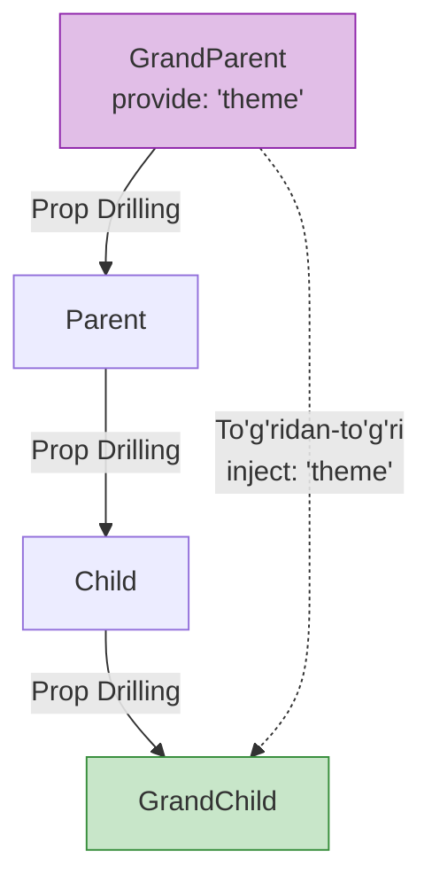

# Provide/Inject - Dependency Injection Pattern

## Kirish

> [!IMPORTANT]
> **Nima uchun muhim?**  
> Dasturlashda ota komponentdan bolaga ma'lumot uzatish oddiy ish (Props orqali). Ammo nabiraga yoki nevaraga o'tkazish kerak bo'lsa, har bir oraliq qatlamga ma'lumotni berib o'tish "Prop Drilling" (Prop teshilishi) muammosini keltirib chiqaradi. Bu oraliq qatlamlar aslida bu ma'lumotga mutlaqo qiziqmasligi mumkin! Provide/Inject orqali biz ota-bobodan to'g'ridan-to'g'ri nevaraga aloqa o'rnatamiz.

> [!NOTE]
> **Real-hayot analogiyasi: "Quduq va Quvur"**  
> Tasavvur qiling siz tog'ning tepasida (GrandParent) suvingiz bor. Pastdagi uchinchi uyga (Child) suv kerak. Uni 1-uyga, undan 2-uyga paqirda tashib kelish (Prop drilling) juda noqulay va be'mani. Buning o'rniga siz tog'dan to'g'ridan-to'g'ri o'sha 3-uyga suv quvuri (Provide/Inject) tortasiz. Oraliqdagi uylar bu suvdan bexabar qolaveradi.

## Asosiy Tushuncha



## Basic Usage

### Options API

```javascript
// GrandParent.vue - provide
export default {
  provide() {
    return {
      theme: 'dark',
      appName: 'MyApp'
    }
  }
}

// GrandChild.vue - inject
export default {
  inject: ['theme', 'appName'],

  mounted() {
    console.log(this.theme)   // 'dark'
    console.log(this.appName) // 'MyApp'
  }
}
```

### Composition API

```vue
<!-- GrandParent.vue -->
<script setup>
import { provide, ref, readonly } from 'vue'

const theme = ref('dark')
const appName = 'MyApp'

provide('theme', readonly(theme))
provide('appName', appName)
</script>

<!-- GrandChild.vue -->
<script setup>
import { inject } from 'vue'

const theme = inject('theme')
const appName = inject('appName')

console.log(theme.value) // 'dark'
console.log(appName)     // 'MyApp'
</script>
```

## Reactive Provide

### Reactivity O'tkazish

```vue
<!-- Provider.vue -->
<script setup>
import { provide, ref, reactive, computed, readonly } from 'vue'

// Reactive state
const user = ref({
  name: 'Ali',
  role: 'admin'
})

// Computed
const isAdmin = computed(() => user.value.role === 'admin')

// Methods
function updateUser(newData) {
  Object.assign(user.value, newData)
}

// Provide reactive values
provide('user', readonly(user))         // Readonly reactive
provide('isAdmin', isAdmin)              // Computed
provide('updateUser', updateUser)        // Method
</script>

<!-- Consumer.vue -->
<script setup>
import { inject, watch } from 'vue'

const user = inject('user')
const isAdmin = inject('isAdmin')
const updateUser = inject('updateUser')

// Watch ishlaydi!
watch(user, (newUser) => {
  console.log('User changed:', newUser)
}, { deep: true })

// Method chaqirish
function handleUpdate() {
  updateUser({ name: 'Vali' })
}
</script>
```

### Mutation Restriction

```vue
<!-- Provider.vue -->
<script setup>
import { provide, ref, readonly } from 'vue'

const count = ref(0)

// YAXSHI: readonly bilan - consumer o'zgartira olmaydi
provide('count', readonly(count))

// Method orqali o'zgartirish
provide('increment', () => count.value++)
</script>

<!-- Consumer.vue -->
<script setup>
import { inject } from 'vue'

const count = inject('count')
const increment = inject('increment')

// count.value = 10 // Warning: readonly!
increment() // OK - method orqali
</script>
```

## Symbol Keys

### Collision Prevention

```javascript
// injection-keys.js
export const ThemeKey = Symbol('theme')
export const UserKey = Symbol('user')
export const AuthKey = Symbol('auth')

// Provider.vue
import { provide } from 'vue'
import { ThemeKey, UserKey } from './injection-keys'

provide(ThemeKey, theme)
provide(UserKey, user)

// Consumer.vue
import { inject } from 'vue'
import { ThemeKey, UserKey } from './injection-keys'

const theme = inject(ThemeKey)
const user = inject(UserKey)
```

### TypeScript bilan

```typescript
// injection-keys.ts
import { InjectionKey, Ref } from 'vue'

interface User {
  name: string
  email: string
  role: 'admin' | 'user'
}

interface AuthContext {
  user: Ref<User | null>
  isAuthenticated: Ref<boolean>
  login: (credentials: { email: string; password: string }) => Promise<void>
  logout: () => void
}

export const AuthKey: InjectionKey<AuthContext> = Symbol('auth')

// Provider.vue
import { provide, ref, computed } from 'vue'
import { AuthKey } from './injection-keys'

const user = ref<User | null>(null)
const isAuthenticated = computed(() => !!user.value)

provide(AuthKey, {
  user,
  isAuthenticated,
  async login(credentials) { /* ... */ },
  logout() { /* ... */ }
})

// Consumer.vue
import { inject } from 'vue'
import { AuthKey } from './injection-keys'

const auth = inject(AuthKey)
// auth is fully typed!
```

## Default Values

```javascript
// Default value bilan inject
const theme = inject('theme', 'light') // 'light' default

// Factory function (lazy evaluation)
const expensiveDefault = inject('data', () => {
  // Faqat provide yo'q bo'lsa chaqiriladi
  return computeExpensiveDefault()
})

// Required injection (default yo'q)
const required = inject('required')
if (!required) {
  throw new Error('required injection missing')
}
```

## App-Level Provide

```javascript
// main.js
import { createApp } from 'vue'
import App from './App.vue'

const app = createApp(App)

// Global provide
app.provide('globalMessage', 'Hello from app!')
app.provide('api', apiService)
app.provide('config', {
  apiUrl: import.meta.env.VITE_API_URL,
  debug: import.meta.env.DEV
})

app.mount('#app')

// Har qanday komponentda inject qilish mumkin
const globalMessage = inject('globalMessage')
const api = inject('api')
const config = inject('config')
```

## Real-World Patterns

### Theme Provider

```vue
<!-- ThemeProvider.vue -->
<script setup>
import { provide, ref, computed, readonly } from 'vue'

const ThemeKey = Symbol('theme')

const currentTheme = ref('light')

const theme = computed(() => ({
  name: currentTheme.value,
  colors: currentTheme.value === 'dark'
    ? {
        background: '#1a1a1a',
        text: '#ffffff',
        primary: '#3b82f6'
      }
    : {
        background: '#ffffff',
        text: '#000000',
        primary: '#2563eb'
      }
}))

function setTheme(newTheme) {
  currentTheme.value = newTheme
}

function toggleTheme() {
  currentTheme.value = currentTheme.value === 'light' ? 'dark' : 'light'
}

provide(ThemeKey, {
  theme: readonly(theme),
  setTheme,
  toggleTheme
})

// Export for consumers
export { ThemeKey }
</script>

<template>
  <div
    :class="`theme-${theme.name}`"
    :style="{
      backgroundColor: theme.colors.background,
      color: theme.colors.text
    }"
  >
    <slot />
  </div>
</template>

<!-- Consumer: useTheme.js -->
import { inject } from 'vue'
import { ThemeKey } from '@/providers/ThemeProvider.vue'

export function useTheme() {
  const context = inject(ThemeKey)

  if (!context) {
    throw new Error('useTheme must be used within ThemeProvider')
  }

  return context
}

<!-- Usage -->
<script setup>
import { useTheme } from '@/composables/useTheme'

const { theme, toggleTheme } = useTheme()
</script>
```

### Auth Provider

```vue
<!-- AuthProvider.vue -->
<script setup>
import { provide, ref, computed, readonly, onMounted } from 'vue'
import { useRouter } from 'vue-router'
import api from '@/services/api'

const AuthKey = Symbol('auth')

const user = ref(null)
const token = ref(localStorage.getItem('token'))
const loading = ref(false)
const error = ref(null)

const isAuthenticated = computed(() => !!token.value)
const isAdmin = computed(() => user.value?.role === 'admin')

async function login(credentials) {
  loading.value = true
  error.value = null

  try {
    const response = await api.post('/auth/login', credentials)
    token.value = response.token
    user.value = response.user
    localStorage.setItem('token', response.token)
    return response
  } catch (e) {
    error.value = e.message
    throw e
  } finally {
    loading.value = false
  }
}

async function logout() {
  const router = useRouter()

  try {
    await api.post('/auth/logout')
  } finally {
    token.value = null
    user.value = null
    localStorage.removeItem('token')
    router.push('/login')
  }
}

async function fetchUser() {
  if (!token.value) return

  loading.value = true
  try {
    user.value = await api.get('/auth/me')
  } catch {
    await logout()
  } finally {
    loading.value = false
  }
}

// Initial fetch
onMounted(fetchUser)

provide(AuthKey, {
  user: readonly(user),
  token: readonly(token),
  loading: readonly(loading),
  error: readonly(error),
  isAuthenticated,
  isAdmin,
  login,
  logout,
  fetchUser
})

export { AuthKey }
</script>

<template>
  <slot v-if="!loading || isAuthenticated" />
  <LoadingScreen v-else />
</template>
```

### Notification System

```vue
<!-- NotificationProvider.vue -->
<script setup>
import { provide, ref, readonly } from 'vue'

const NotificationKey = Symbol('notification')

const notifications = ref([])
let nextId = 0

function show(options) {
  const notification = {
    id: nextId++,
    type: 'info',
    duration: 5000,
    ...options
  }

  notifications.value.push(notification)

  if (notification.duration > 0) {
    setTimeout(() => {
      dismiss(notification.id)
    }, notification.duration)
  }

  return notification.id
}

function dismiss(id) {
  const index = notifications.value.findIndex(n => n.id === id)
  if (index > -1) {
    notifications.value.splice(index, 1)
  }
}

function dismissAll() {
  notifications.value = []
}

// Convenience methods
const success = (message, options = {}) =>
  show({ type: 'success', message, ...options })

const error = (message, options = {}) =>
  show({ type: 'error', message, duration: 0, ...options })

const warning = (message, options = {}) =>
  show({ type: 'warning', message, ...options })

const info = (message, options = {}) =>
  show({ type: 'info', message, ...options })

provide(NotificationKey, {
  notifications: readonly(notifications),
  show,
  dismiss,
  dismissAll,
  success,
  error,
  warning,
  info
})

export { NotificationKey }
</script>

<template>
  <slot />

  <Teleport to="body">
    <div class="notification-container">
      <TransitionGroup name="notification">
        <div
          v-for="notification in notifications"
          :key="notification.id"
          :class="['notification', `notification-${notification.type}`]"
        >
          <p>{{ notification.message }}</p>
          <button @click="dismiss(notification.id)">×</button>
        </div>
      </TransitionGroup>
    </div>
  </Teleport>
</template>

<!-- useNotification.js -->
import { inject } from 'vue'
import { NotificationKey } from '@/providers/NotificationProvider.vue'

export function useNotification() {
  const context = inject(NotificationKey)

  if (!context) {
    throw new Error('useNotification must be used within NotificationProvider')
  }

  return context
}

<!-- Usage -->
<script setup>
import { useNotification } from '@/composables/useNotification'

const { success, error } = useNotification()

async function handleSave() {
  try {
    await api.save(data)
    success('Saved successfully!')
  } catch (e) {
    error(e.message)
  }
}
</script>
```

### Form Context

```vue
<!-- FormProvider.vue -->
<script setup>
import { provide, reactive, computed, readonly } from 'vue'

const FormKey = Symbol('form')

const props = defineProps({
  initialValues: {
    type: Object,
    default: () => ({})
  },
  validationSchema: {
    type: Object,
    default: () => ({})
  }
})

const emit = defineEmits(['submit'])

const values = reactive({ ...props.initialValues })
const errors = reactive({})
const touched = reactive({})

const isValid = computed(() =>
  Object.keys(errors).every(key => !errors[key])
)

const isDirty = computed(() =>
  Object.keys(props.initialValues).some(
    key => values[key] !== props.initialValues[key]
  )
)

function setFieldValue(field, value) {
  values[field] = value
  if (touched[field]) {
    validateField(field)
  }
}

function setFieldTouched(field) {
  touched[field] = true
  validateField(field)
}

function validateField(field) {
  const rules = props.validationSchema[field]
  if (!rules) return true

  for (const rule of rules) {
    const result = rule(values[field], values)
    if (result !== true) {
      errors[field] = result
      return false
    }
  }

  errors[field] = null
  return true
}

function validateAll() {
  let valid = true
  for (const field of Object.keys(props.validationSchema)) {
    if (!validateField(field)) {
      valid = false
    }
  }
  return valid
}

function handleSubmit() {
  Object.keys(values).forEach(setFieldTouched)

  if (validateAll()) {
    emit('submit', values)
  }
}

function reset() {
  Object.assign(values, props.initialValues)
  Object.keys(errors).forEach(key => delete errors[key])
  Object.keys(touched).forEach(key => delete touched[key])
}

provide(FormKey, {
  values: readonly(values),
  errors: readonly(errors),
  touched: readonly(touched),
  isValid,
  isDirty,
  setFieldValue,
  setFieldTouched,
  handleSubmit,
  reset
})

export { FormKey }
</script>

<template>
  <form @submit.prevent="handleSubmit">
    <slot />
  </form>
</template>

<!-- FormField.vue -->
<script setup>
import { inject, computed } from 'vue'
import { FormKey } from './FormProvider.vue'

const props = defineProps({
  name: String,
  label: String
})

const form = inject(FormKey)

const value = computed(() => form.values[props.name])
const error = computed(() => form.errors[props.name])
const isTouched = computed(() => form.touched[props.name])
const showError = computed(() => isTouched.value && error.value)
</script>

<template>
  <div :class="['form-field', { 'has-error': showError }]">
    <label>{{ label }}</label>
    <input
      :value="value"
      @input="form.setFieldValue(name, $event.target.value)"
      @blur="form.setFieldTouched(name)"
    />
    <span v-if="showError" class="error">{{ error }}</span>
  </div>
</template>
```

## Vue 2 vs Vue 3

### Options API Differences

```javascript
// Vue 2
export default {
  // Object syntax
  provide: {
    theme: 'dark'
  },

  // Function syntax (this access)
  provide() {
    return {
      theme: this.theme
    }
  },

  inject: ['theme'],

  // With options
  inject: {
    theme: {
      from: 'theme',
      default: 'light'
    }
  }
}

// Vue 3 - same Options API, plus Composition API
export default {
  provide() {
    return {
      theme: computed(() => this.theme) // reactive!
    }
  }
}
```

### Reactivity

```javascript
// Vue 2 - reactive emas (default)
provide() {
  return {
    user: this.user // Reaktiv emas!
  }
}

// Vue 2 - reactive qilish (workaround)
provide() {
  return {
    getUser: () => this.user // Getter function
  }
}

// Vue 3 - to'g'ridan-to'g'ri reactive
provide('user', readonly(user)) // ref yoki reactive
```

## Interview Savollari

### 1. Provide/Inject qachon ishlatiladi?

**Javob:**

1. **Prop drilling oldini olish** - Chuqur nested komponentlar
2. **Plugin/Library development** - Global state
3. **Theme/Config** - App-wide settings
4. **Auth context** - User state
5. **Form context** - Nested form fields

```javascript
// Props bilan (prop drilling)
<Parent :user="user">
  <Child :user="user">
    <GrandChild :user="user" />
  </Child>
</Parent>

// Provide/Inject bilan
<Parent> <!-- provide('user', user) -->
  <Child>
    <GrandChild /> <!-- inject('user') -->
  </Child>
</Parent>
```

### 2. Provide/Inject vs Props/Emits farqi?

**Javob:**

| Jihat | Props/Emits | Provide/Inject |
|-------|-------------|----------------|
| Bog'lanish | Parent-child | Har qanday ancestor |
| Explicit | Ha | Yo'q |
| Reactivity | Ha | Manual qilish kerak |
| TypeScript | Oson | Symbol kerak |
| Use case | Direct children | Deep nesting |

### 3. Reactive provide qanday qilinadi?

**Javob:**

```javascript
// ref yoki reactive ishlatish
const user = ref({ name: 'Ali' })
provide('user', user)

// readonly bilan himoya qilish
provide('user', readonly(user))

// computed bilan
provide('fullName', computed(() =>
  `${user.value.firstName} ${user.value.lastName}`
))
```

### 4. Provide/Inject TypeScript bilan qanday ishlatiladi?

**Javob:**

```typescript
// InjectionKey ishlatish
import { InjectionKey, Ref } from 'vue'

interface User {
  name: string
  role: string
}

export const UserKey: InjectionKey<Ref<User>> = Symbol('user')

// Provide
provide(UserKey, user)

// Inject - to'liq typed
const user = inject(UserKey)
// user: Ref<User> | undefined
```

### 5. Symbol key nima uchun kerak?

**Javob:**

String key'lar collision xavfi bor:

```javascript
// Library A
provide('config', libAConfig)

// Library B
provide('config', libBConfig) // CONFLICT!

// Symbol bilan
const LibAConfigKey = Symbol('lib-a-config')
const LibBConfigKey = Symbol('lib-b-config')

provide(LibAConfigKey, libAConfig) // Safe
provide(LibBConfigKey, libBConfig) // Safe
```

Symbol'lar unique va global namespace'ni ifloslantirmaydi.

---

## Eng Yaxshi Amaliyotlar (Best Practices)

1. **Reaktivlikni nazorat qiling:** `provide` orqali yuborilayotgan ma'lumotni nevaralar ham bilmasdan o'zgartirib qo'yishi mumkin (bu esa state pachoqlanishiga olib keladi). State buzilmasligi uchun uni `readonly()` bilan o'rab yuboring va o'zgartiradigan metodni ham yuboring.
2. **Keng qo'llanilmang:** Provide/Inject'ni har qadamda ishlatish (Ayniqsa global ma'lumotlar uchun) dastur arxitekturasini tushunarsiz qiladi, chunki bu ma'lumot qayerdan kelganini qidirish qiyin. Agar hamma joyga ma'lumot uzatayotgan bo'lsangiz, `Pinia` (Global Store) ishlatgan ma'qul.
3. **Symbol ishlating:** Har xil kutubxonalar bilan nomlashlar (masalan: `provide('user', ...)` ikkita joyda) to'qnash kelib qolmasligi uchun unikal (takrorlanmas) `Symbol()` klitlaridan foydalaning.

---

## Xulosa

Provide/Inject Vue'da dependency injection pattern:

- **Prop drilling** muammosini hal qiladi
- **Reactive** qiymatlar uzatish mumkin
- **Symbol keys** collision prevention
- **TypeScript** InjectionKey bilan to'liq support

Katta loyihalarda theme, auth, config kabi global context uchun ideal.
