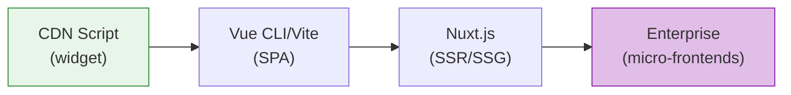
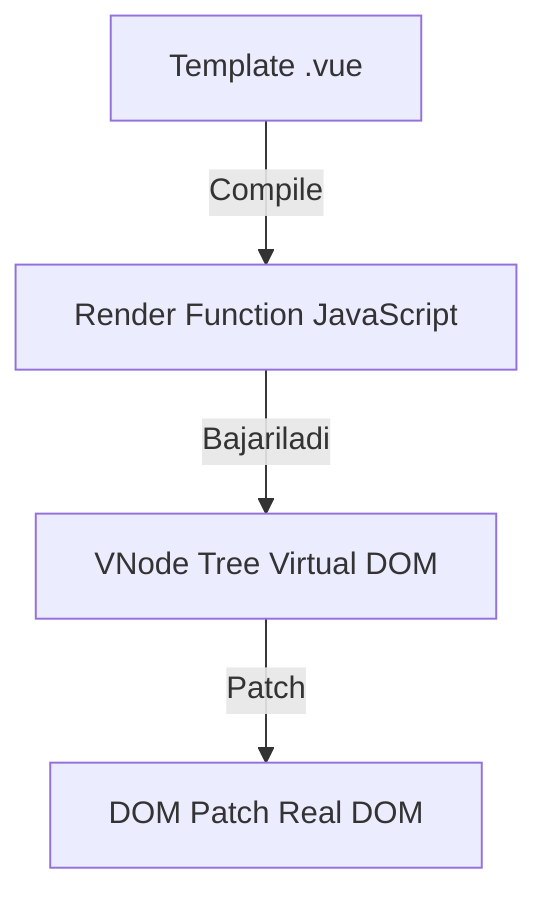
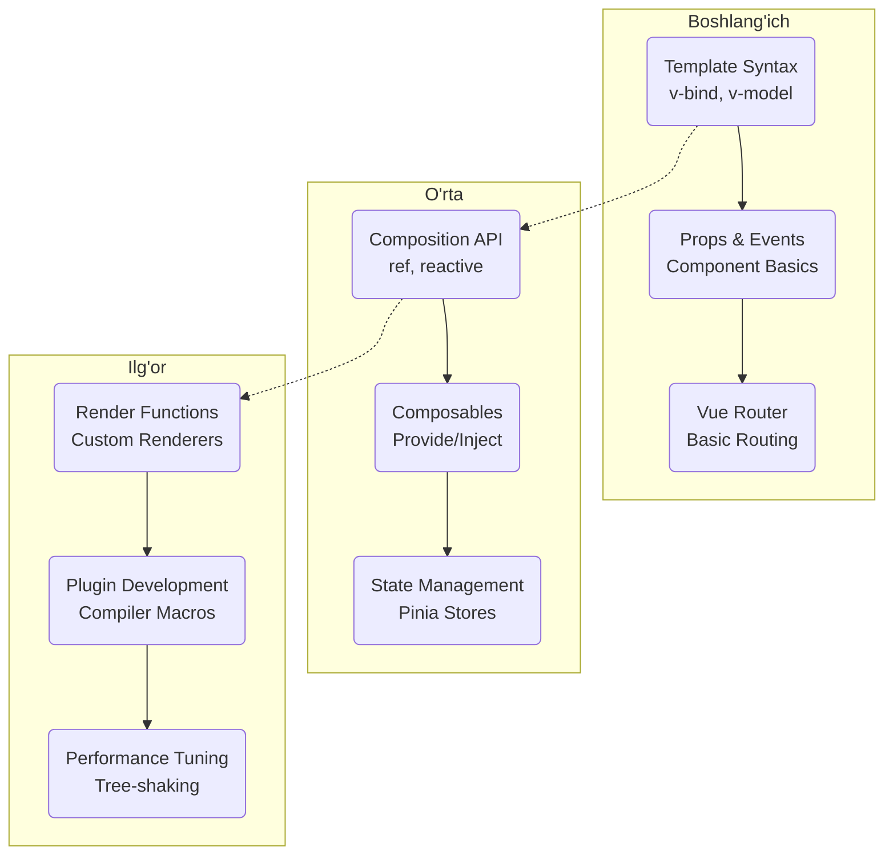

# Vue.js Ecosystem - Chuqur O'rganish

## Kirish

> [!IMPORTANT]
> **Nima uchun muhim?**  
> React'da ko'plab kutubxonalar uchinchi tomon (third-party) tomonidan yaratiladi (masalan: React Router, Redux). Vue'da esa barcha asosiy ekotizim asboblari (Vue Router, Pinia, Vue Devtools) to'g'ridan-to'g'ri Core Team (Asoschilar jamoasi) tomonidan yoziladi. Bu degani — hamma narsa bir-biriga 100% mos keladi, kelajakda buzilib qolmaydi va mukammal hujjatlashtirilgan. Vue ekotizimini tushunish, sizni tayyor va mustahkam arxitekturaga ega Dasturchiga aylantiradi.

> [!NOTE]
> **Real-hayot analogiyasi: "LEGO To'plami"**  
> Boshqa framework'larni shunchaki alohida g'ishtchalar (g'isht, taxta, sement) deb tasavvur qiling — hamma narsani ulab chiqish o'zingizga bog'liq, qanday ulashni o'zingiz izlashingiz kerak. Vue Ecosystem esa maxsus yig'ishga tayyorlangan LEGO to'plamidir. Har bir modul (Router, Pinia, Test Utilities) bir-biriga mos keluvchi tishlilarga ega bo'lib, o'rnatish juda silliq (seamless) kechadi.

Vue.js - progressiv JavaScript framework bo'lib, foydalanuvchi interfeyslarini yaratish uchun mo'ljallangan. "Progressiv" deganda, Vue.js loyihangiz o'sishi bilan birga o'sishi mumkinligini anglatadi - oddiy widget'dan tortib to murakkab SPA (Single Page Application) gacha.

## Ushbu Bo'lim Tarkibi

| # | Mavzu | Tavsif |
|---|-------|--------|
| 01 | [Vue 2 vs Vue 3](./01-vue2-vs-vue3.md) | Versiyalar orasidagi fundamental farqlar |
| 02 | [Composition API](./02-composition-api.md) | Vue 3 ning yangi reaktiv tizimi |
| 03 | [Options API](./03-options-api.md) | Klassik Vue yondashuvi |
| 04 | [Lifecycle Hooks](./04-lifecycle-hooks.md) | Komponent hayot sikli |
| 05 | [Watchers & Computed](./05-watchers-computed.md) | Reaktiv hisoblashlar va kuzatuvchilar |
| 06 | [Refs & Reactive](./06-refs-reactive.md) | Reaktivlik asoslari |
| 07 | [Dynamic Components](./07-dynamic-components.md) | Dinamik komponent almashtirish |
| 08 | [Render Functions](./08-render-functions.md) | Template'siz render |
| 09 | [Custom Directives](./09-custom-directives.md) | Maxsus direktivalar yaratish |
| 10 | [Composables](./10-composables.md) | Qayta ishlatiluvchi mantiq |
| 11 | [Provide/Inject](./11-provide-inject.md) | Dependency injection pattern |

## Vue.js Falsafasi

### 1. Progressiv Framework


### 2. Reaktivlik Modeli
Vue.js reaktivlik tizimi JavaScript Proxy (Vue 3) yoki Object.defineProperty (Vue 2) asosida qurilgan:

```javascript
// Vue 3 reaktivlik - Proxy asosida
const state = reactive({ count: 0 })

// Vue ichki mexanizmi (soddalashtirilgan)
const reactiveHandler = {
  get(target, key) {
    track(target, key) // qaramlikni kuzatish (dependency tracking)
    return target[key]
  },
  set(target, key, value) {
    target[key] = value
    trigger(target, key) // ekranni yangilash (re-render)
    return true
  }
}
```

### 3. Virtual DOM


## Eng Yaxshi Amaliyotlar (Best Practices)

1. **Vue 3 va Composition API ni tanlang:** Yangi loyihalarda doimo Vue 3 va `<script setup>` ishlating. U kodni o'qishni va qismlarga (Composables) bo'lishni osonlashtiradi.
2. **Kutubxonalarni to'g'ri tanlang:** Global ma'lumotlar uchun **Pinia** (Vuex o'rniga), routing uchun **Vue Router**, va asboblar zanjiri (build tool) uchun doimo **Vite** ishlating.
3. **Ekotizimdan to'laqonli foydalaning:** Har bir kichik narsani o'zingiz noldan yozavermang. Masalan, tayyor Composables uchun avvalo [VueUse](https://vueuse.org/) kutubxonasiga qarang.

## O'rganish Yo'l Xaritasi



## Senior Developer Uchun Muhim Mavzular

1. **Reaktivlik Chuqurligi** - Proxy traps, dependency tracking, effect scheduling mexanizmlari qanday ishlashi.
2. **Compiler Optimization** - Static hoisting, patch flags, block tree kabi compiler darajasidagi optimizatsiyalar.
3. **Memory Management** - Component unmounting, watcher cleanup va xotira sizib chiqishining (memory leaks) oldini olish.
4. **Performance Patterns** - Lazy loading, virtual scrolling, memoization va bundle size ni nazorat qilish.
5. **Testing Strategies** - Unit (Vitest), integration va e2e (Cypress, Playwright) testlarini to'g'ri yozish.
6. **TypeScript Integration** - Generic komponentlar, Type inference va `<script setup lang="ts">` dagi ilg'or tushunchalar.

## Xulosa

| Bosqich | Bilish kerak bo'lgan texnologiyalar | Nima qila olasiz? |
|---------|--------------------------------------|-------------------|
| **Boshlang'ich (Junior)** | Vue Basics, Options API, `<template>`, CSS bind | Oddiy komponentlar yasash, sahifalarni dizayn qilish. |
| **O'rta (Middle)** | Composition API, Pinia, Vue Router, Composables, Slots | Katta loyihalarda ma'lumotlar oqimi va murakkab logikalarni yozish. |
| **Ilg'or (Senior)** | Render Functions, Virtual DOM, Custom Directives, Performance | Kutubxonalar yozish, Tezlikni 100% ga chiqarish, Arxitektura qurish. |

---

> **Eslatma:** Ushbu bo'limdagi barcha misollar asosan Vue 3 uchun yozilgan, chunki kelajak shunga qarab ketmoqda, lekin Vue 2 dan farqlari va migratsiya jarayonlari ham to'liq yoritilgan.
