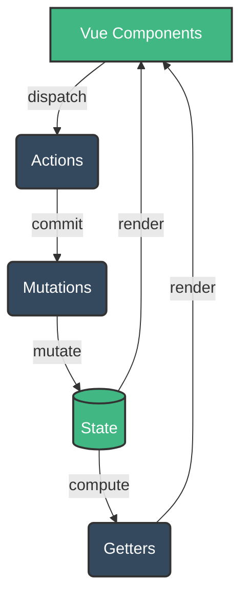

# Vuex Asoslari

## Mundarija
1. [Vuex Nima?](#vuex-nima)
2. [Asosiy Tushunchalar](#asosiy-tushunchalar)
3. [Store Yaratish](#store-yaratish)
4. [State](#state)
5. [Getters](#getters)
6. [Mutations](#mutations)
7. [Actions](#actions)
8. [Modules](#modules)
9. [To'g'ri va Noto'g'ri Yondashuvlar](#togri-va-notogri-yondashuvlar)
10. [Real-World Patterns](#real-world-patterns)
11. [Interview Savollari](#interview-savollari)

---

## Vuex Nima?

> [!IMPORTANT]
> **Nima uchun muhim?**  
> Katta ilovalarda o'nlab komponentlar bir xil ma'lumotga muhtoj bo'ladi (masalan, foydalanuvchi profili, korzinka). Agar props va emit orqali ma'lumot uzatilsa, "prop drilling" deb ataluvchi murakkab zanjir paydo bo'ladi. Vuex ma'lumotlarni yagona markazda saqlash va boshqarish orqali loyihani kengaytiruvchan (scalable) va oson test qilinadigan qiladi.

> [!NOTE]
> **Real-hayot analogiyasi: "Markaziy Bank"**  
> Tasavvur qiling, har bir Vue komponenti bu — alohida bank filliali. Agar filliallar o'zaro naqd pul (ma'lumot) almashishsa, xavfsizlik va nazoratni yo'qotadi. 
> Vuex bu — **Markaziy Bank**. Agar bitta fillialga pul kerak bo'lsa (Action), u Markaziy Bankka so'rov yuboradi. Pulni faqatgina maxsus xodimlar (Mutations) sanab, kiritish/chiqarish huquqiga ega. Boshqa filliallar (Getters) esa faqatgina hisob raqamdagi qoldiqni ko'ra oladi, lekin to'g'ridan-to'g'ri o'zgartira olmaydi.

Vuex - Vue.js ilovalari uchun markazlashtirilgan state management kutubxonasi. U Flux, Redux va Elm arxitekturalaridan ilhomlangan.

### Arxitektura va Data Flow



### Data Flow

```
User Action → dispatch(action) → commit(mutation) → State Change → Re-render
```

---

## Asosiy Tushunchalar

### 1. State
Ilova holati - yagona haqiqat manbai (single source of truth).

### 2. Getters
State'dan hisoblangan qiymatlar (computed properties for store).

### 3. Mutations
State'ni sinxron o'zgartiruvchi funksiyalar.

### 4. Actions
Asinxron operatsiyalar va murakkab mantiq uchun.

### 5. Modules
Katta store'larni bo'laklarga ajratish.

---

## Store Yaratish

### Vue 2 bilan

```javascript
// store/index.js
import Vue from 'vue'
import Vuex from 'vuex'

Vue.use(Vuex)

export default new Vuex.Store({
  state: {
    count: 0,
    user: null,
    products: []
  },

  getters: {
    doubleCount: state => state.count * 2,
    isLoggedIn: state => !!state.user,
    productCount: state => state.products.length
  },

  mutations: {
    INCREMENT(state) {
      state.count++
    },
    SET_USER(state, user) {
      state.user = user
    },
    SET_PRODUCTS(state, products) {
      state.products = products
    }
  },

  actions: {
    async fetchUser({ commit }) {
      const response = await api.getUser()
      commit('SET_USER', response.data)
    },
    async fetchProducts({ commit }) {
      const response = await api.getProducts()
      commit('SET_PRODUCTS', response.data)
    }
  }
})
```

### Vue 3 bilan (Vuex 4)

```javascript
// store/index.js
import { createStore } from 'vuex'

export default createStore({
  state() {
    return {
      count: 0,
      user: null
    }
  },

  getters: {
    doubleCount: state => state.count * 2
  },

  mutations: {
    INCREMENT(state) {
      state.count++
    }
  },

  actions: {
    incrementAsync({ commit }) {
      setTimeout(() => {
        commit('INCREMENT')
      }, 1000)
    }
  }
})

// main.js
import { createApp } from 'vue'
import store from './store'
import App from './App.vue'

createApp(App).use(store).mount('#app')
```

---

## State

State - ilovaning reaktiv holati.

### State'ga Kirish

```javascript
// Option API
export default {
  computed: {
    count() {
      return this.$store.state.count
    },
    user() {
      return this.$store.state.user
    }
  }
}

// mapState helper bilan
import { mapState } from 'vuex'

export default {
  computed: {
    // Array syntax
    ...mapState(['count', 'user', 'products']),

    // Object syntax (alias bilan)
    ...mapState({
      currentUser: 'user',
      itemCount: 'count'
    }),

    // Function syntax
    ...mapState({
      countPlusLocal(state) {
        return state.count + this.localCount
      }
    })
  }
}
```

### Composition API bilan

```javascript
import { computed } from 'vue'
import { useStore } from 'vuex'

export default {
  setup() {
    const store = useStore()

    const count = computed(() => store.state.count)
    const user = computed(() => store.state.user)

    return { count, user }
  }
}
```

### State Tuzilishi - Best Practices

```javascript
// YAXSHI - normalizatsiya qilingan
const state = {
  users: {
    byId: {
      1: { id: 1, name: 'John', email: 'john@example.com' },
      2: { id: 2, name: 'Jane', email: 'jane@example.com' }
    },
    allIds: [1, 2]
  },
  currentUserId: 1,
  isLoading: false,
  error: null
}

// YOMON - nested va normalizatsiya qilinmagan
const state = {
  users: [
    {
      id: 1,
      name: 'John',
      posts: [
        { id: 1, title: 'Post 1', comments: [...] }
      ]
    }
  ]
}
```

---

## Getters

Getters - store uchun computed properties.

### Asosiy Getters

```javascript
const store = createStore({
  state: {
    todos: [
      { id: 1, text: 'Learn Vue', done: true },
      { id: 2, text: 'Learn Vuex', done: false },
      { id: 3, text: 'Build app', done: false }
    ]
  },

  getters: {
    // Oddiy getter
    doneTodos(state) {
      return state.todos.filter(todo => todo.done)
    },

    // Boshqa getter'ga bog'liq
    doneTodosCount(state, getters) {
      return getters.doneTodos.length
    },

    // Parametr qabul qiluvchi getter (factory pattern)
    getTodoById: (state) => (id) => {
      return state.todos.find(todo => todo.id === id)
    },

    // Murakkab hisob-kitob
    todoStats(state) {
      const total = state.todos.length
      const done = state.todos.filter(t => t.done).length
      const pending = total - done
      const progress = total ? Math.round((done / total) * 100) : 0

      return { total, done, pending, progress }
    }
  }
})
```

### Getters'ga Kirish

```javascript
// Option API
export default {
  computed: {
    doneTodos() {
      return this.$store.getters.doneTodos
    },
    todoById() {
      return this.$store.getters.getTodoById(2)
    }
  }
}

// mapGetters bilan
import { mapGetters } from 'vuex'

export default {
  computed: {
    ...mapGetters(['doneTodos', 'doneTodosCount']),
    ...mapGetters({
      completed: 'doneTodos'
    })
  }
}

// Composition API
import { computed } from 'vue'
import { useStore } from 'vuex'

export default {
  setup() {
    const store = useStore()

    const doneTodos = computed(() => store.getters.doneTodos)
    const getTodoById = (id) => store.getters.getTodoById(id)

    return { doneTodos, getTodoById }
  }
}
```

---

## Mutations

Mutations - state'ni o'zgartirishning YAGONA yo'li. Doim SINXRON bo'lishi kerak.

### Mutations Yozish

```javascript
const store = createStore({
  state: {
    count: 0,
    user: null,
    items: []
  },

  mutations: {
    // Oddiy mutation
    INCREMENT(state) {
      state.count++
    },

    // Payload bilan
    INCREMENT_BY(state, amount) {
      state.count += amount
    },

    // Object payload (tavsiya etiladi)
    SET_USER(state, { user, timestamp }) {
      state.user = user
      state.lastLogin = timestamp
    },

    // Array manipulyatsiya
    ADD_ITEM(state, item) {
      state.items.push(item)
    },

    REMOVE_ITEM(state, id) {
      const index = state.items.findIndex(item => item.id === id)
      if (index !== -1) {
        state.items.splice(index, 1)
      }
    },

    UPDATE_ITEM(state, updatedItem) {
      const index = state.items.findIndex(item => item.id === updatedItem.id)
      if (index !== -1) {
        // Vue reaktivlik uchun to'g'ri usul
        state.items.splice(index, 1, updatedItem)
        // yoki Vue.set (Vue 2)
        // Vue.set(state.items, index, updatedItem)
      }
    }
  }
})
```

### Mutations'ni Chaqirish

```javascript
// To'g'ridan
store.commit('INCREMENT')
store.commit('INCREMENT_BY', 10)
store.commit('SET_USER', { user: userData, timestamp: Date.now() })

// Object style (tavsiya etiladi)
store.commit({
  type: 'SET_USER',
  user: userData,
  timestamp: Date.now()
})

// Komponentda
export default {
  methods: {
    increment() {
      this.$store.commit('INCREMENT')
    },
    ...mapMutations(['INCREMENT', 'SET_USER']),
    ...mapMutations({
      add: 'INCREMENT'
    })
  }
}
```

### Mutation Types - Konstanta Pattern

```javascript
// mutation-types.js
export const SET_USER = 'SET_USER'
export const SET_LOADING = 'SET_LOADING'
export const SET_ERROR = 'SET_ERROR'
export const ADD_PRODUCT = 'ADD_PRODUCT'
export const REMOVE_PRODUCT = 'REMOVE_PRODUCT'

// store/mutations.js
import * as types from './mutation-types'

export default {
  [types.SET_USER](state, user) {
    state.user = user
  },
  [types.SET_LOADING](state, loading) {
    state.loading = loading
  },
  [types.SET_ERROR](state, error) {
    state.error = error
  }
}
```

---

## Actions

Actions - asinxron operatsiyalar va murakkab biznes mantiq uchun.

### Actions Yozish

```javascript
const store = createStore({
  state: {
    user: null,
    posts: [],
    loading: false,
    error: null
  },

  mutations: {
    SET_USER(state, user) { state.user = user },
    SET_POSTS(state, posts) { state.posts = posts },
    SET_LOADING(state, loading) { state.loading = loading },
    SET_ERROR(state, error) { state.error = error }
  },

  actions: {
    // Oddiy action
    async fetchUser({ commit }) {
      commit('SET_LOADING', true)
      try {
        const response = await api.getUser()
        commit('SET_USER', response.data)
      } catch (error) {
        commit('SET_ERROR', error.message)
      } finally {
        commit('SET_LOADING', false)
      }
    },

    // Context destructuring
    async fetchPosts({ commit, state, getters, dispatch }) {
      // state'ga kirish
      if (!state.user) {
        await dispatch('fetchUser')
      }

      const response = await api.getPosts(state.user.id)
      commit('SET_POSTS', response.data)
    },

    // Payload bilan
    async createPost({ commit, state }, postData) {
      const response = await api.createPost({
        ...postData,
        userId: state.user.id
      })
      commit('ADD_POST', response.data)
      return response.data
    },

    // Boshqa action'larni chaqirish
    async initializeApp({ dispatch }) {
      await dispatch('fetchUser')
      await dispatch('fetchPosts')
      await dispatch('fetchSettings')
    },

    // Parallel actions
    async loadDashboard({ dispatch }) {
      await Promise.all([
        dispatch('fetchStats'),
        dispatch('fetchRecentActivity'),
        dispatch('fetchNotifications')
      ])
    }
  }
})
```

### Actions'ni Chaqirish

```javascript
// To'g'ridan
store.dispatch('fetchUser')
store.dispatch('createPost', { title: 'New Post', content: '...' })

// Promise sifatida
store.dispatch('fetchUser').then(() => {
  console.log('User loaded')
})

// async/await bilan
async function loadData() {
  await store.dispatch('fetchUser')
  await store.dispatch('fetchPosts')
}

// Komponentda
export default {
  methods: {
    async loadUser() {
      await this.$store.dispatch('fetchUser')
    },
    ...mapActions(['fetchUser', 'fetchPosts']),
    ...mapActions({
      load: 'fetchUser'
    })
  },

  created() {
    this.fetchUser()
  }
}

// Composition API
import { useStore } from 'vuex'

export default {
  setup() {
    const store = useStore()

    const fetchUser = () => store.dispatch('fetchUser')

    onMounted(async () => {
      await store.dispatch('initializeApp')
    })

    return { fetchUser }
  }
}
```

---

## Modules

Katta store'larni mantiqiy bo'laklarga ajratish.

### Modul Yaratish

```javascript
// store/modules/user.js
export default {
  namespaced: true,

  state: () => ({
    profile: null,
    preferences: {},
    isAuthenticated: false
  }),

  getters: {
    fullName(state) {
      if (!state.profile) return ''
      return `${state.profile.firstName} ${state.profile.lastName}`
    },

    // Root state va root getters'ga kirish
    userWithRole(state, getters, rootState, rootGetters) {
      return {
        ...state.profile,
        role: rootState.roles.currentRole
      }
    }
  },

  mutations: {
    SET_PROFILE(state, profile) {
      state.profile = profile
    },
    SET_AUTHENTICATED(state, value) {
      state.isAuthenticated = value
    },
    UPDATE_PREFERENCES(state, preferences) {
      state.preferences = { ...state.preferences, ...preferences }
    }
  },

  actions: {
    async login({ commit, dispatch }, credentials) {
      const response = await api.login(credentials)
      commit('SET_PROFILE', response.data.user)
      commit('SET_AUTHENTICATED', true)

      // Root action'ni chaqirish
      dispatch('notifications/fetchUnread', null, { root: true })

      return response.data
    },

    async logout({ commit }) {
      await api.logout()
      commit('SET_PROFILE', null)
      commit('SET_AUTHENTICATED', false)
    },

    async updateProfile({ commit, state }, updates) {
      const response = await api.updateProfile(state.profile.id, updates)
      commit('SET_PROFILE', response.data)
    }
  }
}

// store/modules/products.js
export default {
  namespaced: true,

  state: () => ({
    items: [],
    categories: [],
    currentCategory: null,
    filters: {
      minPrice: 0,
      maxPrice: Infinity,
      search: ''
    }
  }),

  getters: {
    filteredProducts(state) {
      return state.items.filter(product => {
        const matchesCategory = !state.currentCategory ||
          product.categoryId === state.currentCategory
        const matchesPrice = product.price >= state.filters.minPrice &&
          product.price <= state.filters.maxPrice
        const matchesSearch = product.name
          .toLowerCase()
          .includes(state.filters.search.toLowerCase())

        return matchesCategory && matchesPrice && matchesSearch
      })
    },

    productsByCategory(state) {
      return state.categories.map(category => ({
        ...category,
        products: state.items.filter(p => p.categoryId === category.id)
      }))
    }
  },

  mutations: {
    SET_ITEMS(state, items) {
      state.items = items
    },
    SET_CATEGORIES(state, categories) {
      state.categories = categories
    },
    SET_CURRENT_CATEGORY(state, categoryId) {
      state.currentCategory = categoryId
    },
    SET_FILTERS(state, filters) {
      state.filters = { ...state.filters, ...filters }
    }
  },

  actions: {
    async fetchAll({ dispatch }) {
      await Promise.all([
        dispatch('fetchProducts'),
        dispatch('fetchCategories')
      ])
    },

    async fetchProducts({ commit }) {
      const response = await api.getProducts()
      commit('SET_ITEMS', response.data)
    },

    async fetchCategories({ commit }) {
      const response = await api.getCategories()
      commit('SET_CATEGORIES', response.data)
    }
  }
}
```

### Store'ni Modullar bilan Yaratish

```javascript
// store/index.js
import { createStore } from 'vuex'
import user from './modules/user'
import products from './modules/products'
import cart from './modules/cart'
import notifications from './modules/notifications'

export default createStore({
  // Root state
  state: {
    appName: 'My App',
    version: '1.0.0',
    isInitialized: false
  },

  // Root mutations
  mutations: {
    SET_INITIALIZED(state, value) {
      state.isInitialized = value
    }
  },

  // Root actions
  actions: {
    async initializeApp({ commit, dispatch }) {
      await dispatch('user/fetchProfile', null, { root: false })
      await dispatch('notifications/fetchUnread')
      commit('SET_INITIALIZED', true)
    }
  },

  // Modullar
  modules: {
    user,
    products,
    cart,
    notifications
  }
})
```

### Namespaced Modullarga Kirish

```javascript
// State
this.$store.state.user.profile
this.$store.state.products.items

// Getters
this.$store.getters['user/fullName']
this.$store.getters['products/filteredProducts']

// Mutations
this.$store.commit('user/SET_PROFILE', profile)

// Actions
this.$store.dispatch('user/login', credentials)

// Map helpers bilan
import { mapState, mapGetters, mapMutations, mapActions } from 'vuex'

export default {
  computed: {
    ...mapState('user', ['profile', 'isAuthenticated']),
    ...mapGetters('user', ['fullName']),
    ...mapState('products', ['items', 'categories']),
    ...mapGetters('products', ['filteredProducts'])
  },

  methods: {
    ...mapMutations('user', ['SET_PROFILE']),
    ...mapActions('user', ['login', 'logout']),
    ...mapActions('products', ['fetchAll'])
  }
}

// createNamespacedHelpers bilan
import { createNamespacedHelpers } from 'vuex'

const { mapState, mapActions } = createNamespacedHelpers('user')

export default {
  computed: {
    ...mapState(['profile', 'isAuthenticated'])
  },
  methods: {
    ...mapActions(['login', 'logout'])
  }
}
```

---

## To'g'ri va Noto'g'ri Yondashuvlar

### State O'zgartirish

```javascript
// NOTO'G'RI - state'ni to'g'ridan o'zgartirish
this.$store.state.count = 10
this.$store.state.user.name = 'New Name'
this.$store.state.items.push(newItem)

// TO'G'RI - mutation orqali
this.$store.commit('SET_COUNT', 10)
this.$store.commit('SET_USER_NAME', 'New Name')
this.$store.commit('ADD_ITEM', newItem)
```

### Asinxron Operatsiyalar

```javascript
// NOTO'G'RI - mutation ichida asinxron
mutations: {
  async FETCH_USER(state) {
    const response = await api.getUser() // XATO!
    state.user = response.data
  }
}

// TO'G'RI - action ichida asinxron
actions: {
  async fetchUser({ commit }) {
    const response = await api.getUser()
    commit('SET_USER', response.data)
  }
}
```

### Getter vs Computed

```javascript
// NOTO'G'RI - har safar filter
computed: {
  doneTodos() {
    return this.$store.state.todos.filter(t => t.done)
  }
}

// TO'G'RI - getter ishlatish (keshlanadi)
// Store
getters: {
  doneTodos: state => state.todos.filter(t => t.done)
}

// Component
computed: {
  doneTodos() {
    return this.$store.getters.doneTodos
  }
}
```

### Error Handling

```javascript
// NOTO'G'RI - xatoni e'tiborsiz qoldirish
actions: {
  async fetchUser({ commit }) {
    const response = await api.getUser()
    commit('SET_USER', response.data)
  }
}

// TO'G'RI - to'g'ri xato boshqaruvi
actions: {
  async fetchUser({ commit }) {
    commit('SET_LOADING', true)
    commit('SET_ERROR', null)

    try {
      const response = await api.getUser()
      commit('SET_USER', response.data)
    } catch (error) {
      commit('SET_ERROR', {
        message: error.message,
        code: error.response?.status
      })

      // Logging
      console.error('Failed to fetch user:', error)

      // Re-throw agar kerak bo'lsa
      throw error
    } finally {
      commit('SET_LOADING', false)
    }
  }
}
```

### Module Organization

```javascript
// NOTO'G'RI - hamma narsa bitta faylda
// store/index.js - 2000 qator

// TO'G'RI - modullar bo'yicha ajratish
store/
├── index.js           # Store yaratish
├── mutation-types.js  # Konstantalar
├── modules/
│   ├── user.js
│   ├── products.js
│   ├── cart.js
│   └── notifications.js
└── plugins/
    ├── logger.js
    └── persistence.js
```

---

## Real-World Patterns

### 1. API Request Pattern

```javascript
// store/modules/data.js
const createAsyncMutation = (base) => ({
  [`${base}_REQUEST`]: (state) => {
    state.loading = true
    state.error = null
  },
  [`${base}_SUCCESS`]: (state, data) => {
    state.loading = false
    state.data = data
  },
  [`${base}_FAILURE`]: (state, error) => {
    state.loading = false
    state.error = error
  }
})

export default {
  namespaced: true,

  state: () => ({
    data: null,
    loading: false,
    error: null
  }),

  mutations: {
    ...createAsyncMutation('FETCH')
  },

  actions: {
    async fetch({ commit }, params) {
      commit('FETCH_REQUEST')

      try {
        const response = await api.getData(params)
        commit('FETCH_SUCCESS', response.data)
        return response.data
      } catch (error) {
        commit('FETCH_FAILURE', error.message)
        throw error
      }
    }
  }
}
```

### 2. Normalized State Pattern

```javascript
// store/modules/entities.js
export default {
  namespaced: true,

  state: () => ({
    users: {
      byId: {},
      allIds: []
    },
    posts: {
      byId: {},
      allIds: []
    },
    comments: {
      byId: {},
      allIds: []
    }
  }),

  getters: {
    getUserById: (state) => (id) => state.users.byId[id],

    getAllUsers: (state) => state.users.allIds.map(id => state.users.byId[id]),

    getPostWithAuthor: (state, getters) => (postId) => {
      const post = state.posts.byId[postId]
      if (!post) return null

      return {
        ...post,
        author: getters.getUserById(post.authorId)
      }
    },

    getPostComments: (state) => (postId) => {
      return Object.values(state.comments.byId)
        .filter(comment => comment.postId === postId)
    }
  },

  mutations: {
    ADD_USERS(state, users) {
      users.forEach(user => {
        state.users.byId[user.id] = user
        if (!state.users.allIds.includes(user.id)) {
          state.users.allIds.push(user.id)
        }
      })
    },

    ADD_POSTS(state, posts) {
      posts.forEach(post => {
        state.posts.byId[post.id] = post
        if (!state.posts.allIds.includes(post.id)) {
          state.posts.allIds.push(post.id)
        }
      })
    },

    UPDATE_ENTITY(state, { type, id, changes }) {
      if (state[type]?.byId[id]) {
        state[type].byId[id] = {
          ...state[type].byId[id],
          ...changes
        }
      }
    },

    REMOVE_ENTITY(state, { type, id }) {
      delete state[type].byId[id]
      state[type].allIds = state[type].allIds.filter(i => i !== id)
    }
  }
}
```

### 3. Optimistic Update Pattern

```javascript
// store/modules/posts.js
export default {
  namespaced: true,

  actions: {
    async likePost({ commit, state }, postId) {
      const post = state.items.find(p => p.id === postId)
      const previousLikeCount = post.likeCount
      const previousIsLiked = post.isLiked

      // Optimistic update
      commit('UPDATE_POST', {
        id: postId,
        changes: {
          likeCount: previousLikeCount + 1,
          isLiked: true
        }
      })

      try {
        await api.likePost(postId)
      } catch (error) {
        // Rollback on error
        commit('UPDATE_POST', {
          id: postId,
          changes: {
            likeCount: previousLikeCount,
            isLiked: previousIsLiked
          }
        })
        throw error
      }
    },

    async deletePost({ commit, state }, postId) {
      const postIndex = state.items.findIndex(p => p.id === postId)
      const deletedPost = state.items[postIndex]

      // Optimistic delete
      commit('REMOVE_POST', postId)

      try {
        await api.deletePost(postId)
      } catch (error) {
        // Rollback - restore post
        commit('INSERT_POST_AT', { post: deletedPost, index: postIndex })
        throw error
      }
    }
  }
}
```

### 4. Plugin Pattern - Persistence

```javascript
// store/plugins/persistence.js
export function createPersistencePlugin(options = {}) {
  const {
    key = 'vuex',
    paths = null,
    storage = localStorage
  } = options

  return (store) => {
    // Restore state from storage
    const savedState = storage.getItem(key)
    if (savedState) {
      try {
        const parsed = JSON.parse(savedState)
        store.replaceState({
          ...store.state,
          ...parsed
        })
      } catch (e) {
        console.error('Failed to restore state:', e)
      }
    }

    // Subscribe to mutations
    store.subscribe((mutation, state) => {
      let stateToPersist = state

      if (paths) {
        stateToPersist = paths.reduce((result, path) => {
          const value = path.split('.').reduce((obj, key) => obj?.[key], state)
          if (value !== undefined) {
            const keys = path.split('.')
            let current = result
            keys.forEach((k, i) => {
              if (i === keys.length - 1) {
                current[k] = value
              } else {
                current[k] = current[k] || {}
                current = current[k]
              }
            })
          }
          return result
        }, {})
      }

      storage.setItem(key, JSON.stringify(stateToPersist))
    })
  }
}

// store/index.js
import { createPersistencePlugin } from './plugins/persistence'

export default createStore({
  // ...
  plugins: [
    createPersistencePlugin({
      key: 'my-app-store',
      paths: ['user.profile', 'cart.items', 'settings']
    })
  ]
})
```

### 5. Form Handling Pattern

```javascript
// store/modules/form.js
export const createFormModule = (name, initialState, validateFn) => ({
  namespaced: true,

  state: () => ({
    data: { ...initialState },
    errors: {},
    touched: {},
    isSubmitting: false,
    isValid: true
  }),

  getters: {
    isFieldValid: (state) => (field) => !state.errors[field],

    canSubmit: (state) => {
      return state.isValid &&
        !state.isSubmitting &&
        Object.keys(state.touched).length > 0
    }
  },

  mutations: {
    SET_FIELD(state, { field, value }) {
      state.data[field] = value
    },

    SET_TOUCHED(state, field) {
      state.touched[field] = true
    },

    SET_ERRORS(state, errors) {
      state.errors = errors
      state.isValid = Object.keys(errors).length === 0
    },

    SET_SUBMITTING(state, value) {
      state.isSubmitting = value
    },

    RESET(state) {
      state.data = { ...initialState }
      state.errors = {}
      state.touched = {}
      state.isSubmitting = false
      state.isValid = true
    }
  },

  actions: {
    updateField({ commit, state, dispatch }, { field, value }) {
      commit('SET_FIELD', { field, value })
      commit('SET_TOUCHED', field)
      dispatch('validate')
    },

    validate({ commit, state }) {
      const errors = validateFn(state.data)
      commit('SET_ERRORS', errors)
      return Object.keys(errors).length === 0
    },

    async submit({ commit, state, dispatch }, submitFn) {
      const isValid = await dispatch('validate')
      if (!isValid) return false

      commit('SET_SUBMITTING', true)

      try {
        await submitFn(state.data)
        commit('RESET')
        return true
      } catch (error) {
        if (error.response?.data?.errors) {
          commit('SET_ERRORS', error.response.data.errors)
        }
        return false
      } finally {
        commit('SET_SUBMITTING', false)
      }
    }
  }
})

// Foydalanish
const loginForm = createFormModule(
  'login',
  { email: '', password: '' },
  (data) => {
    const errors = {}
    if (!data.email) errors.email = 'Email kerak'
    if (!data.password) errors.password = 'Parol kerak'
    return errors
  }
)
```

---

## Interview Savollari

### 1. Vuex'da mutations va actions orasidagi farq nima?

**Javob:**

| Xususiyat | Mutations | Actions |
|-----------|-----------|---------|
| Sinxronlik | Faqat sinxron | Asinxron mumkin |
| Vazifa | State'ni o'zgartirish | Biznes mantiq, API calls |
| Chaqirish | `commit('NAME')` | `dispatch('name')` |
| DevTools | Time-travel debugging | Console log |

```javascript
// Mutation - sinxron
mutations: {
  SET_USER(state, user) {
    state.user = user // Darhol bajariladi
  }
}

// Action - asinxron
actions: {
  async fetchUser({ commit }) {
    const response = await api.getUser() // Kutish mumkin
    commit('SET_USER', response.data)
  }
}
```

**Nima uchun bunday?**
- Mutations sinxron bo'lishi DevTools'da har bir state o'zgarishini aniq kuzatish imkonini beradi
- Actions murakkab mantiq va asinxron operatsiyalarni mutation'lardan ajratadi

---

### 2. Vuex'da namespaced modules qanday ishlaydi va nima uchun kerak?

**Javob:**

Namespaced modules state, getters, mutations, va actions'larni modul nomi bilan prefix qiladi.

```javascript
// store/modules/cart.js
export default {
  namespaced: true, // Bu kalit

  state: () => ({ items: [] }),

  getters: {
    total(state) { /* ... */ }
  },

  mutations: {
    ADD_ITEM(state, item) { /* ... */ }
  },

  actions: {
    checkout({ commit }) { /* ... */ }
  }
}

// Foydalanish
store.state.cart.items              // State
store.getters['cart/total']         // Getters
store.commit('cart/ADD_ITEM', item) // Mutations
store.dispatch('cart/checkout')     // Actions
```

**Nima uchun kerak?**
1. **Naming collisions** - Ikki modul bir xil mutation nomiga ega bo'lishi mumkin
2. **Modularity** - Katta ilovalarni mantiqiy bo'laklarga ajratish
3. **Reusability** - Modullarni boshqa loyihalarda qayta ishlatish
4. **Team work** - Har bir dasturchi o'z moduli ustida ishlashi

---

### 3. Vuex store'da state'ni qanday persist qilish mumkin?

**Javob:**

```javascript
// 1. Vuex plugin yozish
const persistPlugin = (store) => {
  // Saqlangan state'ni tiklash
  const saved = localStorage.getItem('vuex-state')
  if (saved) {
    store.replaceState(JSON.parse(saved))
  }

  // Har bir mutation'dan keyin saqlash
  store.subscribe((mutation, state) => {
    localStorage.setItem('vuex-state', JSON.stringify(state))
  })
}

// 2. Faqat kerakli qismlarni saqlash
const selectivePersist = (store) => {
  store.subscribe((mutation, state) => {
    const toPersist = {
      user: state.user,
      settings: state.settings
    }
    localStorage.setItem('vuex-state', JSON.stringify(toPersist))
  })
}

// 3. vuex-persistedstate kutubxonasi
import createPersistedState from 'vuex-persistedstate'

export default createStore({
  plugins: [
    createPersistedState({
      paths: ['user', 'cart'],
      storage: window.sessionStorage // yoki localStorage
    })
  ]
})
```

**Eslatmalar:**
- Katta state'lar uchun performance muammo bo'lishi mumkin
- Sensitive ma'lumotlarni localStorage'da saqlash xavfsiz emas
- SSR ilovalarida server'da localStorage yo'q

---

### 4. Vuex'da getters qachon ishlatiladi va ular qanday keshlanadi?

**Javob:**

Getters - store uchun computed properties. Ular o'z dependency'lari o'zgarmagunicha keshlanadi.

```javascript
getters: {
  // Keshlanadi - state.todos o'zgarguncha
  completedTodos(state) {
    return state.todos.filter(t => t.completed)
  },

  // Keshlanadi - getters.completedTodos o'zgarguncha
  completedCount(state, getters) {
    return getters.completedTodos.length
  },

  // KESHLANMAYDI - funksiya qaytaradi
  getTodoById: (state) => (id) => {
    return state.todos.find(t => t.id === id)
  }
}
```

**Qachon ishlatiladi:**
1. State'dan hisoblangan qiymatlar kerak bo'lganda
2. Bir xil filterlash/mapping bir necha komponentda kerak bo'lganda
3. Murakkab hisob-kitoblarni keshlab performance oshirish uchun

**Qachon ISHLATILMAYDI:**
1. Oddiy state'ga kirish uchun
2. Side effects kerak bo'lganda (actions ishlating)

---

### 5. Vuex'da strict mode nima va production'da uni o'chirish kerakmi?

**Javob:**

Strict mode - state mutation'lardan tashqarida o'zgartirilsa xato beradi.

```javascript
const store = createStore({
  strict: process.env.NODE_ENV !== 'production',
  // ...
})
```

**Strict mode ON:**
```javascript
// Bu xato beradi
this.$store.state.count = 10 // Error: mutation tashqarisida o'zgartirish

// Bu to'g'ri
this.$store.commit('SET_COUNT', 10)
```

**Production'da o'chirish kerakmi? HA.**

Sabablari:
1. **Performance** - Strict mode har bir state o'zgarishini deep watch qiladi
2. **Bundle size** - Development only kod kerak emas
3. **Error handling** - Production'da xato emas, faqat warning kerak

```javascript
// Tavsiya etilgan pattern
const store = createStore({
  strict: import.meta.env.DEV, // Vite
  // yoki
  strict: process.env.NODE_ENV === 'development' // Webpack
})
```

---

## Qachon Vuex Tanlash Kerak

### Vuex TO'G'RI tanlov qachon:
- Vue 2 loyihalari (Pinia Vue 2 uchun ham bor, lekin Vuex native)
- Mavjud Vuex loyihalarni qo'llab-quvvatlash
- Strict mutation tracking kerak bo'lganda
- Time-travel debugging muhim bo'lganda

### Vuex NOTO'G'RI tanlov qachon:
- Yangi Vue 3 loyihalari (Pinia tavsiya etiladi)
- TypeScript first-class support kerak
- Soddalikni afzal ko'rsangiz
- Bundle size muhim bo'lsa

## Eng Yaxshi Amaliyotlar (Best Practices)

1. **State'ni to'g'ridan-to'g'ri o'zgartirmang**: Hech qachon `this.$store.state.count++` qilmang. Har doim `commit` ishlating.
2. **Katta state'larni normallashtiring (Normalize)**: Ma'lumotlarni daraxt shaklida emas, ID bo'yicha yassi (flat) qilib saqlang. Bu CRUD operatsiyalarini osonlashtiradi.
3. **Mutations har doim sinxron bo'lsin**: API so'rovlarni va asinxron mantiqni faqat `actions` ichida yozing, aks holda devtools xato ishlaydi.
4. **Modullardan foydalaning**: Ilova biroz kattalashgandan boshlab, uni `user`, `products`, `cart` kabi modullarga bo'lib chiqing. Namespaced modullarni yoqishni unutmang.
5. **Konstantalardan foydalaning**: Katta jamoalarda mutation nomlarini `mutation-types.js` faylida konstanta (const) qilib saqlash imlo xatolarini oldini oladi.

---

## Xulosa

| Tushuncha | Vazifasi | O'xshatish (Analogiya) |
|-----------|----------|------------------------|
| **State** | O'zgaruvchilarni saqlaydi (Data) | Markaziy Bankdagi pul ombori |
| **Getters** | Ma'lumotlarni o'zgartirib qaytaradi (Computed) | Bankdagi hisob qoldig'ini ko'rsatuvchi ekran |
| **Mutations** | State'ni o'zgartiradigan yagona sinxron yo'l | Kassir (faqat ular pulni hisobdan yechishi mumkin) |
| **Actions** | Asinxron mantiq, API chaqiruvlar va mutatsiyalarni ishga tushiradi | Mijoz murojaati va navbatda turish jarayoni |

Vuex - Vue 2 loyihalari uchun kuchli state management yechimi. Uning asosiy kuchi Predictable state changes va Time-travel debugging. Lekin Vue 3 loyihalari uchun Pinia tavsiya etiladi chunki u soddaroq, TypeScript bilan yaxshiroq integratsiya qiladi va rasmiy Vue jamoasi tomonidan qo'llab-quvvatlanadi.
