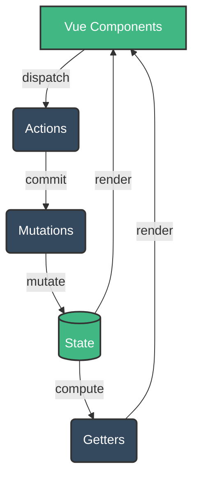

# Vuex Asoslari

## Kirish

> [!IMPORTANT]
> **Nima uchun muhim?**  
> Katta ilovalarda o'nlab komponentlar bir xil ma'lumotga muhtoj bo'ladi (masalan, foydalanuvchi profili, korzinka). Agar props va emit orqali ma'lumot uzatilsa, "prop drilling" deb ataluvchi murakkab zanjir paydo bo'ladi. Vuex ma'lumotlarni yagona markazda saqlash va boshqarish orqali loyihani kengaytiruvchan (scalable) va oson test qilinadigan qiladi.

> [!NOTE]
> **Real-hayot analogiyasi: "Markaziy Bank"**  
> Tasavvur qiling, har bir Vue komponenti bu — alohida bank filliali. Agar filliallar o'zaro naqd pul (ma'lumot) almashishsa, xavfsizlik va nazoratni yo'qotadi. 
> Vuex bu — **Markaziy Bank**. Agar bitta fillialga pul kerak bo'lsa (Action), u Markaziy Bankka so'rov yuboradi. Pulni faqatgina maxsus xodimlar (Mutations) sanab, kiritish/chiqarish huquqiga ega. Boshqa filliallar (Getters) esa faqatgina hisob raqamdagi qoldiqni ko'ra oladi, lekin to'g'ridan-to'g'ri o'zgartira olmaydi.

## 🟢 Junior (Asoslar va Tushunchalar)

### Asosiy Tushunchalar

Vuex - bu Vue ilovalari uchun markazlashgan state (holat) boshqaruvchisi. U 4 ta asosiy ustunga qurilgan:
1. **State** - O'zgaruvchilarni saqlaydigan joy (Data).
2. **Getters** - State dan biror narsani hisoblab yoki filtrlab olib beruvchi joy (Computed).
3. **Mutations** - State dagi ma'lumotni o'zgartira oladigan YAGONA qism. U doim Sinxron ishlaydi (Methods).
4. **Actions** - Asinxron (API ga ulanish) ishlarni qilib, natijasini Mutations'ga yuboradigan joy.

### Sodda Store Yaratish

```javascript
// store/index.js
import { createStore } from 'vuex'

export default createStore({
  // 1. STATE (Bankdagi Pul)
  state() {
    return {
      count: 0
    }
  },

  // 2. GETTERS (Balansni ko'rish)
  getters: {
    doubleCount(state) {
      return state.count * 2
    }
  },

  // 3. MUTATIONS (Pulni o'zgartirish huquqiga ega kassir)
  mutations: {
    INCREMENT(state) {
      state.count++
    }
  },

  // 4. ACTIONS (Pul kiritish/yechish haqidagi so'rov)
  actions: {
    incrementAsync({ commit }) {
      setTimeout(() => {
        // 1 soniyadan keyin Kassirga (Mutation) buyruq berish
        commit('INCREMENT')
      }, 1000)
    }
  }
})
```

Komponentda chaqirish:
```vue
<template>
  <div>
    <p>Sanoq: {{ $store.state.count }}</p>
    <button @click="$store.dispatch('incrementAsync')">Oshirish</button>
  </div>
</template>
```

---

## 🟡 Middle (Amaliyot va Detallar)

### Data Flow (Ma'lumotlar oqimi)
Vuex da ma'lumot har doim faqat bir tomonga qarab yuradi (One-way data flow).
`User Action` → `dispatch(action)` → `commit(mutation)` → `State Change` → `Re-render (UI)`



### Module Organization (Katta loyihalarda)
Loyiha kattalashgani sari barcha statelarni bitta faylda yozish uni o'qib bo'lmas holatga keltiradi. Shuning uchun biz `modules` dan foydalanamiz.

```javascript
// store/modules/user.js
export default {
  namespaced: true, // BU MUHIM! Nomlar to'qnashuvini oldini oladi.
  
  state: () => ({ profile: null }),
  mutations: {
    SET_PROFILE(state, payload) { state.profile = payload }
  },
  actions: {
    async fetchUser({ commit }) {
      const data = await api.getUser()
      commit('SET_PROFILE', data)
    }
  }
}

// store/index.js
import { createStore } from 'vuex'
import user from './modules/user'

export default createStore({
  modules: {
    user // Modul ulash
  }
})
```
Namespaced modulni chaqirish: `this.$store.dispatch('user/fetchUser')`.

### To'g'ri va Noto'g'ri yondashuvlar

**1. State ni to'g'ridan o'zgartirish:**
```javascript
// YOMON
this.$store.state.user.name = 'Eshmat' // Devtools buni payqamaydi

// YAXSHI
this.$store.commit('user/SET_NAME', 'Eshmat')
```

**2. Mutation ichida API so'rov yozish:**
```javascript
// YOMON (Mutationlar doim sinxron bo'lishi shart)
mutations: {
  async FETCH_DATA(state) {
    const res = await fetch(...) 
    state.data = res
  }
}

// YAXSHI
actions: {
  async fetchData({ commit }) {
    const res = await fetch(...)
    commit('SET_DATA', res)
  }
}
```

---

## 🔴 Senior (Arxitektura va Optimallashtirish)

### Keshlanadigan (Memoized) Getters
Vuex getters xuddi `computed` xususiyati kabi ishlaydi va ular keshlangan bo'ladi. Ular faqat o'ziga bog'liq bo'lgan (dependency) state o'zgarsagina qaytadan hisob-kitob qiladi. Bu - katta massivlarni filtrlashda performance uchun juda zo'r. Ammo agar siz getter dan funksiya qaytarsangiz, u keshlanmay qoladi!

```javascript
getters: {
  // BU KESHLANADI. Har chaqirilganda qayta ishlamaydi.
  activeUsers: state => state.users.filter(u => u.isActive),

  // BU KESHLANMAYDI. Har safar getters.userById(5) deyilganda noldan topadi.
  userById: state => id => state.users.find(u => u.id === id)
}
```

### Normalizatsiya (State Tuzilishi)
Senior dasturchilar ko'p qatorli, bir-birini ichiga kirib ketgan daraxt (Nested JSON) o'rniga ma'lumotlarni Flat (Yassi) formatda id bilan saqlaydi (Redux uslubi). Bu murakkab CRUD va update amallarini osonlashtiradi.

```javascript
// YOMON (Topish ham, o'zgartirish ham qiyin, map kerak bo'ladi)
const state = {
  users: [
    { id: 1, name: 'Ali', posts: [{ id: 11, title: 'Post' }] }
  ]
}

// YAXSHI (Normalizatsiya - O(1) time complexity)
const state = {
  users: {
    byId: { 1: { id: 1, name: 'Ali' } },
    allIds: [1]
  },
  posts: {
    byId: { 11: { id: 11, authorId: 1, title: 'Post' } },
    allIds: [11]
  }
}
```

### Strict Mode va Production
Vuex da `strict: true` degan rejim bor. Agar kimdir mutation siz state ni o'zgartirsa qizil xato beradi. Ammo bu rejim ilova tezligiga juda katta salbiy ta'sir ko'rsatadi (chuqur kuzatish sababli). Shuning uchun uni faqat Development da yoniq qoldirish shart.

```javascript
const store = createStore({
  strict: process.env.NODE_ENV !== 'production', // Muhim!
  state: { ... }
})
```

### Intervyu Savollari (Qiyin daraja)
**1. Vuex'da Mutation va Action ning asosiy farqi nima va nega shunday qilingan?**
*Javob:* Eng muhim farqi - Mutations sinxron, Actions esa asinxron. Vuex shunday qilinganki, Har bir state o'zgarishi (Mutation) amalga oshgan zahoti DevTools uning o'sha vaqtdagi holatini rasmga olib (Snapshot) qo'yadi va bu "Time-travel debugging" ni ta'minlaydi. Agar mutation ichiga setTimeout kabi asinxron ish qo'shsangiz, state o'zgarishi qachon bo'lganini bilib bo'lmay qoladi va Snapshot noto'g'ri ishlaydi. Actions esa murakkablikni va tashqi ta'sirlarni (API) o'ziga oladi.

**2. Vuex vs Pinia farqi?**
*Javob:* Vue 3 chiqqandan so'ng Vue jamoasi Piniani asosiy store sifatida e'lon qildi. Pinia ning Vuexdan ustunliklari:
1. `Mutations` olib tashlangan, logikani to'g'ridan to'g'ri `Actions` da qilaverasiz.
2. Nativ TypeScript qo'llab-quvvatlovi 100% ideal (Vuex da type inference do'zax edi).
3. Namespaced modules yo'q - Pinia da siz xohlagancha tayyor izolyatsiya qilingan store larni import qilib olaverasiz.

---

## Eng Yaxshi Amaliyotlar (Best Practices)

1. **State'ni to'g'ridan-to'g'ri o'zgartirmang**: Hech qachon `this.$store.state.count++` qilmang. Har doim `commit` ishlating.
2. **Katta state'larni normallashtiring (Normalize)**: Ma'lumotlarni daraxt shaklida emas, ID bo'yicha yassi (flat) qilib saqlang. Bu CRUD operatsiyalarini osonlashtiradi.
3. **Mutations har doim sinxron bo'lsin**: API so'rovlarni va asinxron mantiqni faqat `actions` ichida yozing, aks holda devtools xato ishlaydi.
4. **Modullardan foydalaning**: Ilova biroz kattalashgandan boshlab, uni `user`, `products`, `cart` kabi modullarga bo'lib chiqing. Namespaced modullarni yoqishni unutmang.
5. **Pinia ga o'ting**: Agar siz yangi loyiha boshlayotgan bo'lsangiz, Vuex o'rniga Pinia ni tanlaganingiz ma'qul. 

---

## Xulosa

| Tushuncha | Vazifasi | O'xshatish (Analogiya) |
|-----------|----------|------------------------|
| **State** | O'zgaruvchilarni saqlaydi (Data) | Markaziy Bankdagi pul ombori |
| **Getters** | Ma'lumotlarni o'zgartirib qaytaradi (Computed) | Bankdagi hisob qoldig'ini ko'rsatuvchi ekran |
| **Mutations** | State'ni o'zgartiradigan yagona sinxron yo'l | Kassir (faqat ular pulni hisobdan yechishi mumkin) |
| **Actions** | Asinxron mantiq, API chaqiruvlar va mutatsiyalarni ishga tushiradi | Mijoz murojaati va navbatda turish jarayoni |

Vuex - Vue 2 loyihalari uchun kuchli state management yechimi. Uning asosiy kuchi Predictable state changes va Time-travel debugging. Lekin Vue 3 loyihalari uchun **Pinia** tavsiya etiladi chunki u soddaroq, TypeScript bilan yaxshiroq integratsiya qiladi va rasmiy Vue jamoasi tomonidan qo'llab-quvvatlanadi.
