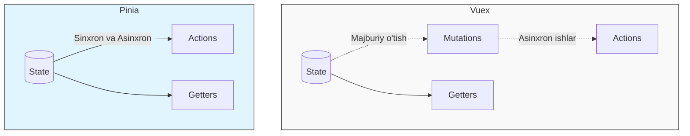

# Pinia Asoslari

## Kirish

> [!IMPORTANT]
> **Nima uchun muhim?**  
> Pinia modern Vue ilovalarining "miya markazi" hisoblanadi. U state'ni markazlashgan holda ushlab turadi, bu esa proplar yordamida chuqur komponentlarga ma'lumot uzatish (prop drilling) muammosidan qutqaradi. Vue 3 ning Composition API'si bilan uzviy bog'langan bo'lib, Type-safe bo'lgani uchun xatolarni kod yozish jarayonidayoq ushlash mumkin. Vue jamoasi hozirda Vuex o'rniga faqat Pinia ni tavsiya etadi.

> [!NOTE]
> **Real-hayot analogiyasi: "Kutubxona tizimi"**  
> Tasavvur qiling, har bir Vue komponenti — bu alohida o'quvchi. O'quvchilar kitoblarni (State) o'zaro almashishsa, qaysi kitob kimdaligini kuzatish qiyinlashadi. 
> Pinia — bu **Kutubxona boshqaruv tizimi**. Siz kitob olish yoki holatini o'zgartirish (Action) uchun murojaat qilasiz. Kutubxonachi vazifasini o'tovchi kod to'g'ridan-to'g'ri kitoblarni o'zgartiradi (Vuex'dagi kabi ortiqcha Mutation'larsiz). Qidiruv tizimi orqali (Getters) qaysi kitoblar borligini filtrlab bilib olasiz.

## 🟢 Junior (Asoslar va Tushunchalar)

### Pinia vs Vuex Farqi
Pinia da Vuex dagi kabi **Mutations yo'q**. Siz stateni to'g'ridan to'g'ri `Actions` ichida o'zgartiraverasiz. Bu kodni 30% ga qisqartiradi.



### Store Yaratish (Sodda usul)
Pinia'da store yaratishning eng zo'r usuli xuddi Composition API kabi yozishdir (Setup Syntax).
```javascript
// stores/counter.js
import { defineStore } from 'pinia'
import { ref, computed } from 'vue'

export const useCounterStore = defineStore('counter', () => {
  // 1. State - oddiy ref
  const count = ref(0)
  
  // 2. Getters - oddiy computed
  const doubleCount = computed(() => count.value * 2)

  // 3. Actions - oddiy funksiyalar
  function increment() {
    count.value++ // To'g'ridan to'g'ri mutation!
  }

  // Boshqalarga ko'rsatish
  return { count, doubleCount, increment }
})
```

### Komponentda Ishlatish
```vue
<script setup>
import { useCounterStore } from '@/stores/counter'

const counterStore = useCounterStore()
// To'g'ridan to'g'ri o'qish va chaqirish mumkin
console.log(counterStore.count)
counterStore.increment()
</script>
```

---

## 🟡 Middle (Amaliyot va Detallar)

### Reaktivlikni saqlab qolish (`storeToRefs`)
Komponentda store obyektidan o'zgaruvchilarni destructure (`const { count } = store`) qilib olsangiz, ularning **Reaktivligi Yo'qoladi!** Buni oldini olish uchun `storeToRefs` ishlating.

```vue
<script setup>
import { storeToRefs } from 'pinia'
import { useCounterStore } from '@/stores/counter'

const store = useCounterStore()

// YOMON: Reaktivlik o'ladi, html yangilanmaydi!
// const { count } = store 

// YAXSHI: State va Getters uchun storeToRefs ishlating
const { count, doubleCount } = storeToRefs(store)

// Actions uchun esa to'g'ridan to'g'ri olsangiz bo'ladi
const { increment } = store
</script>
```

### State ni Ommaviy O'zgartirish (`$patch`)
Agar birdaniga bir necha stateni o'zgartirmoqchi bo'lsangiz `$patch` metodidan foydalaning, u faqat bitta re-render chaqiradi (tezroq ishlaydi).

```javascript
const userStore = useUserStore()

// Bitta ob'ekt yordamida:
userStore.$patch({
  name: 'John Doe',
  age: 25,
  isAdmin: true
})

// Yoki callback orqali murakkab mantiq bilan:
userStore.$patch((state) => {
  state.items.push({ id: 1, text: 'Yangi narsa' })
  state.totalCount++
})
```

### Asinxron Actions (API So'rovlar)
Pinia da asinxron ishlarni bajarish shunchaki oddiy funksiya yozish bilan teng:

```javascript
export const useUserStore = defineStore('user', () => {
  const profile = ref(null)
  const isLoading = ref(false)

  async function fetchProfile() {
    isLoading.value = true
    try {
      const res = await api.get('/user/me')
      profile.value = res.data // Muvaffaqiyatli
    } catch (err) {
      console.error(err)
    } finally {
      isLoading.value = false
    }
  }

  return { profile, isLoading, fetchProfile }
})
```

---

## 🔴 Senior (Arxitektura va Optimallashtirish)

### Storelar orasida bog'lanish (Composition)
Pinia yordamida bitta Store ni boshqa bitta Store ichida chaqirib ishlatish mutlaqo xavfsiz va toza.

```javascript
import { useAuthStore } from './auth'
import { useCartStore } from './cart'

export const useOrderStore = defineStore('order', () => {
  const authStore = useAuthStore() // Boshqa store
  const cartStore = useCartStore() // Boshqa store

  async function placeOrder() {
    if (!authStore.isLoggedIn) {
      throw new Error('Iltimos ro\'yxatdan o\'ting')
    }
    
    await api.placeOrder({ items: cartStore.items })
    cartStore.clear() // O'sha store actionini shu yerdan chaqirish
  }

  return { placeOrder }
})
```

### State Persistence (Local Storage saqlash)
Odatda brauzer yangilansa (refresh), Store dagi ma'lumotlar o'chib ketadi. Buni saqlab qolish uchun eng mashhur yondashuv — Plugin yozish:

```javascript
// plugins/piniaPersistence.js
export function persistencePlugin({ store }) {
  // Saqlangan state ni yuklab olish
  const savedState = localStorage.getItem(`pinia-${store.$id}`)
  if (savedState) {
    store.$patch(JSON.parse(savedState))
  }

  // Har o'zgarganda saqlash
  store.$subscribe((mutation, state) => {
    localStorage.setItem(`pinia-${store.$id}`, JSON.stringify(state))
  })
}

// main.js
import { createPinia } from 'pinia'
import { persistencePlugin } from './plugins/piniaPersistence'

const pinia = createPinia()
pinia.use(persistencePlugin) // Barcha storelar ulandi!
```

### Intervyu Savollari (Qiyin daraja)
**1. Pinia Vuex ga nisbatan nega bundle size da yengilroq?**
*Javob:* Pinia o'z ichida juda ko'p narsani Composition API yordamida hal qilgan. Modullar (Namespaced) strukturasi yo'q. Har bir store alohida yashaydigan va faqat kerak bo'lganda (lazy) instansiatsiya qilinadigan ob'ektdir. Shuning uchun foydalanilmayotgan Store larni Webpack/Vite osongina "Tree-shaking" qilib (kesib) olib tashlay oladi. 

**2. Setup (Composition) Syntax bilan yozilgan Pinia store ni qachon ishlata olmaymiz?**
*Javob:* Vue 2 dagi Map helperlari (masalan `mapState`, `mapActions`) asosan Options API ko'rinishidagi storelarga asoslangan bo'ladi. Garchi u hozir ishlasada, uni `setup()` ichida return qilmasdan ishlata olmaysiz. Yana bir muammo shuki SSR (Server Side Rendering) jarayonida state ni hidratatsiya (hydration) qilish setup syntaxda qiyinroq kechadi va `$state` property ni qayta yozish kerak bo'lishi mumkin.

---

## Eng Yaxshi Amaliyotlar (Best Practices)

1. **Modulli dizayn**: Bitta ulkan store o'rniga kichik, mustaqil store'lar (`useUserStore`, `useCartStore`) yarating. Pinia avtomatik ravishda bularni modullashtiradi.
2. **Setup API dan foydalaning**: Composition API'ni ishlatsangiz, Pinia'da ham **Setup syntax** dan foydalaning. Bu ko'proq moslashuvchanlik beradi va Vue 3 uslubiga tushadi.
3. **State vs Local component state**: Hamma narsani ham Pinia'ga tiqavermang. Agar state faqatgina bitta komponentga tegishli bo'lsa (masalan, menyu ochiq/yopiq holati), local `ref()` yetarli.
4. **Xatolarni tutish**: Action'larda asinxron API so'rovlarni albatta `try/catch` ichida yozing, va zarur bo'lsa `error` o'zgaruvchisini state da saqlang.
5. **storeToRefs**: Komponent ichida store ma'lumotlarini destructure qilyapsizmi? Reaktivlikni yo'qotmaslik uchun faqatgina `storeToRefs` ishlating (Actionlar bundan mustasno).

---

## Xulosa

| Pinia Xususiyati | Vuex ga Nisbatan Ustunligi | Qanday Ishlaydi? |
|------------------|-----------------------------|------------------|
| **Mutations yo'q** | Ortiqcha qadamlar qisqardi | Action orqali to'g'ridan-to'g'ri state o'zgaradi |
| **TypeScript** | 100% Type-safe | Avtomatik (Inference) typelar ishlaydi |
| **Composition API**| Zamonaviy sintaksisga mos | `defineStore` ichiga `setup()` funksiyasi kabi ref/computed yoziladi |
| **Kichik hajm** | ~1.5kb gacha siqilgan | Brauzerga tezroq yuklanadi, Tree-shaking a'lo darajada |

Pinia - Vue 3 uchun eng yaxshi state management yechimi bo'lib, loyihangizga yengillik, modullilik va zamonaviy yondashuv bag'ishlaydi. Yangi loyihalarda Vuex o'rniga doim **Pinia** ni tanlang.
