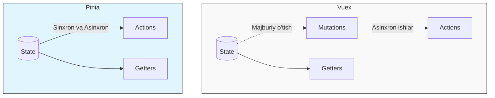

# Pinia Asoslari

## Mundarija
1. [Pinia Nima?](#pinia-nima)
2. [O'rnatish va Sozlash](#ornatish-va-sozlash)
3. [Store Yaratish](#store-yaratish)
4. [State](#state)
5. [Getters](#getters)
6. [Actions](#actions)
7. [Composition API bilan Ishlash](#composition-api-bilan-ishlash)
8. [Store Composition](#store-composition)
9. [To'g'ri va Noto'g'ri Yondashuvlar](#togri-va-notogri-yondashuvlar)
10. [Real-World Patterns](#real-world-patterns)
11. [Interview Savollari](#interview-savollari)

---

## Pinia Nima?

> [!IMPORTANT]
> **Nima uchun muhim?**  
> Pinia modern Vue ilovalarining "miya markazi" hisoblanadi. U state'ni markazlashgan holda ushlab turadi, bu esa proplar yordamida chuqur komponentlarga ma'lumot uzatish (prop drilling) muammosidan qutqaradi. Vue 3 ning Composition API'si bilan uzviy bog'langan bo'lib, Type-safe bo'lgani uchun xatolarni kod yozish jarayonidayoq ushlash mumkin.

> [!NOTE]
> **Real-hayot analogiyasi: "Kutubxona tizimi"**  
> Tasavvur qiling, har bir Vue komponenti — bu alohida o'quvchi. O'quvchilar kitoblarni (State) o'zaro almashishsa, qaysi kitob kimdaligini kuzatish qiyinlashadi. 
> Pinia — bu **Kutubxona boshqaruv tizimi**. Siz kitob olish yoki holatini o'zgartirish (Action) uchun murojaat qilasiz. Kutubxonachi vazifasini o'tovchi kod to'g'ridan-to'g'ri kitoblarni o'zgartiradi (Vuex'dagi kabi ortiqcha Mutation'larsiz). Qidiruv tizimi orqali (Getters) qaysi kitoblar borligini filtrlab bilib olasiz.

Pinia - Vue.js uchun rasmiy state management kutubxonasi. Vue 3 Composition API asosida qurilgan va Vuex'ning zamonaviy, soddalashtirilgan versiyasi.

### Pinia vs Vuex



### Pinia Afzalliklari

1. **Mutations yo'q** - state'ni to'g'ridan o'zgartirish mumkin
2. **TypeScript first-class** - to'liq type inference
3. **DevTools support** - time-travel, editing
4. **Hot Module Replacement** - state saqlanadi
5. **Plugins** - kengaytirish oson
6. **SSR support** - server-side rendering
7. **Lightweight** - ~1.5KB gzipped

---

## O'rnatish va Sozlash

### O'rnatish

```bash
# npm
npm install pinia

# yarn
yarn add pinia

# pnpm
pnpm add pinia
```

### Vue 3 bilan Sozlash

```javascript
// main.js
import { createApp } from 'vue'
import { createPinia } from 'pinia'
import App from './App.vue'

const app = createApp(App)
const pinia = createPinia()

app.use(pinia)
app.mount('#app')
```

### Vue 2 bilan Sozlash

```javascript
// main.js
import Vue from 'vue'
import { createPinia, PiniaVuePlugin } from 'pinia'
import App from './App.vue'

Vue.use(PiniaVuePlugin)

const pinia = createPinia()

new Vue({
  pinia,
  render: h => h(App)
}).$mount('#app')
```

---

## Store Yaratish

Pinia'da store yaratishning ikki usuli bor: Options API va Setup syntax.

### Options Syntax (Vuex-ga o'xshash)

```javascript
// stores/counter.js
import { defineStore } from 'pinia'

export const useCounterStore = defineStore('counter', {
  // State
  state: () => ({
    count: 0,
    name: 'Counter',
    items: []
  }),

  // Getters
  getters: {
    doubleCount: (state) => state.count * 2,

    // this orqali boshqa getters'ga kirish
    doubleCountPlusOne() {
      return this.doubleCount + 1
    },

    // Parametr qabul qiluvchi getter
    getItemById: (state) => {
      return (id) => state.items.find(item => item.id === id)
    }
  },

  // Actions
  actions: {
    increment() {
      this.count++
    },

    async fetchItems() {
      const response = await fetch('/api/items')
      this.items = await response.json()
    },

    // Action ichida boshqa action chaqirish
    reset() {
      this.count = 0
      this.items = []
      this.fetchItems()
    }
  }
})
```

### Setup Syntax (Composition API style)

```javascript
// stores/counter.js
import { defineStore } from 'pinia'
import { ref, computed } from 'vue'

export const useCounterStore = defineStore('counter', () => {
  // State - ref/reactive
  const count = ref(0)
  const name = ref('Counter')
  const items = ref([])

  // Getters - computed
  const doubleCount = computed(() => count.value * 2)
  const doubleCountPlusOne = computed(() => doubleCount.value + 1)
  const getItemById = computed(() => {
    return (id) => items.value.find(item => item.id === id)
  })

  // Actions - functions
  function increment() {
    count.value++
  }

  async function fetchItems() {
    const response = await fetch('/api/items')
    items.value = await response.json()
  }

  function reset() {
    count.value = 0
    items.value = []
    fetchItems()
  }

  // Public API
  return {
    count,
    name,
    items,
    doubleCount,
    doubleCountPlusOne,
    getItemById,
    increment,
    fetchItems,
    reset
  }
})
```

### Store Nomlanishi

```javascript
// YAXSHI - use prefix, Store suffix
export const useUserStore = defineStore('user', { ... })
export const useCartStore = defineStore('cart', { ... })
export const useProductStore = defineStore('product', { ... })

// YOMON
export const user = defineStore('user', { ... })
export const UserStore = defineStore('user', { ... })
```

---

## State

### State'ga Kirish

```javascript
// stores/user.js
export const useUserStore = defineStore('user', {
  state: () => ({
    profile: null,
    preferences: {
      theme: 'light',
      language: 'uz'
    },
    isLoading: false
  })
})
```

```vue
<script setup>
import { useUserStore } from '@/stores/user'

const userStore = useUserStore()

// To'g'ridan kirish
console.log(userStore.profile)
console.log(userStore.preferences.theme)

// Reaktiv
const theme = computed(() => userStore.preferences.theme)
</script>

<template>
  <div>
    <p>Theme: {{ userStore.preferences.theme }}</p>
    <p>Loading: {{ userStore.isLoading }}</p>
  </div>
</template>
```

### State'ni O'zgartirish

```javascript
const userStore = useUserStore()

// 1. To'g'ridan o'zgartirish
userStore.isLoading = true
userStore.profile = { name: 'John' }

// 2. $patch - bir nechta o'zgarish
userStore.$patch({
  isLoading: false,
  profile: { name: 'John', email: 'john@example.com' }
})

// 3. $patch function - murakkab o'zgarishlar
userStore.$patch((state) => {
  state.preferences.theme = 'dark'
  state.preferences.language = 'en'
})

// 4. State'ni to'liq almashtirish
userStore.$state = {
  profile: null,
  preferences: { theme: 'light', language: 'uz' },
  isLoading: false
}

// 5. $reset - boshlang'ich holatga qaytarish
userStore.$reset()
```

### State Tuzilishi

```javascript
// stores/entities.js
export const useEntitiesStore = defineStore('entities', {
  state: () => ({
    // Normalizatsiya qilingan
    users: {
      byId: {},
      allIds: []
    },

    // Loading states
    loading: {
      users: false,
      posts: false
    },

    // Errors
    errors: {
      users: null,
      posts: null
    },

    // Pagination
    pagination: {
      users: {
        page: 1,
        perPage: 20,
        total: 0
      }
    }
  })
})
```

---

## Getters

### Oddiy Getters

```javascript
export const useProductStore = defineStore('products', {
  state: () => ({
    products: [],
    selectedCategory: null,
    filters: {
      minPrice: 0,
      maxPrice: Infinity,
      inStock: false
    }
  }),

  getters: {
    // Oddiy getter
    totalProducts: (state) => state.products.length,

    // Murakkab filter
    filteredProducts(state) {
      return state.products.filter(product => {
        // Category filter
        if (state.selectedCategory && product.categoryId !== state.selectedCategory) {
          return false
        }

        // Price filter
        if (product.price < state.filters.minPrice ||
            product.price > state.filters.maxPrice) {
          return false
        }

        // Stock filter
        if (state.filters.inStock && product.stock === 0) {
          return false
        }

        return true
      })
    },

    // Boshqa getter'ga bog'liq
    filteredProductCount() {
      return this.filteredProducts.length
    },

    // Statistika
    priceStats(state) {
      if (state.products.length === 0) {
        return { min: 0, max: 0, avg: 0 }
      }

      const prices = state.products.map(p => p.price)
      return {
        min: Math.min(...prices),
        max: Math.max(...prices),
        avg: prices.reduce((a, b) => a + b, 0) / prices.length
      }
    }
  }
})
```

### Parametrli Getters

```javascript
export const useProductStore = defineStore('products', {
  state: () => ({
    products: []
  }),

  getters: {
    // Parametr qabul qiluvchi
    getProductById: (state) => {
      return (id) => state.products.find(p => p.id === id)
    },

    // Ko'p parametrli
    getProductsByPriceRange: (state) => {
      return (minPrice, maxPrice) => {
        return state.products.filter(
          p => p.price >= minPrice && p.price <= maxPrice
        )
      }
    },

    // Object parametr
    searchProducts: (state) => {
      return ({ query, category, sortBy }) => {
        let result = [...state.products]

        if (query) {
          const q = query.toLowerCase()
          result = result.filter(p =>
            p.name.toLowerCase().includes(q)
          )
        }

        if (category) {
          result = result.filter(p => p.categoryId === category)
        }

        if (sortBy) {
          result.sort((a, b) => {
            if (sortBy === 'price-asc') return a.price - b.price
            if (sortBy === 'price-desc') return b.price - a.price
            if (sortBy === 'name') return a.name.localeCompare(b.name)
            return 0
          })
        }

        return result
      }
    }
  }
})

// Foydalanish
const store = useProductStore()
const product = store.getProductById(123)
const expensiveProducts = store.getProductsByPriceRange(100, 500)
const searchResults = store.searchProducts({
  query: 'phone',
  category: 'electronics',
  sortBy: 'price-asc'
})
```

### Boshqa Store'lardan Getter

```javascript
import { useUserStore } from './user'

export const useCartStore = defineStore('cart', {
  state: () => ({
    items: []
  }),

  getters: {
    // Boshqa store'dan foydalanish
    itemsWithUserDiscount(state) {
      const userStore = useUserStore()
      const discount = userStore.profile?.membershipDiscount || 0

      return state.items.map(item => ({
        ...item,
        discountedPrice: item.price * (1 - discount / 100)
      }))
    },

    totalWithDiscount() {
      return this.itemsWithUserDiscount.reduce(
        (sum, item) => sum + item.discountedPrice * item.quantity,
        0
      )
    }
  }
})
```

---

## Actions

### Sinxron Actions

```javascript
export const useCartStore = defineStore('cart', {
  state: () => ({
    items: []
  }),

  actions: {
    addItem(product, quantity = 1) {
      const existingItem = this.items.find(
        item => item.productId === product.id
      )

      if (existingItem) {
        existingItem.quantity += quantity
      } else {
        this.items.push({
          productId: product.id,
          name: product.name,
          price: product.price,
          quantity
        })
      }
    },

    removeItem(productId) {
      const index = this.items.findIndex(
        item => item.productId === productId
      )
      if (index !== -1) {
        this.items.splice(index, 1)
      }
    },

    updateQuantity(productId, quantity) {
      const item = this.items.find(i => i.productId === productId)
      if (item) {
        if (quantity <= 0) {
          this.removeItem(productId)
        } else {
          item.quantity = quantity
        }
      }
    },

    clearCart() {
      this.items = []
    }
  }
})
```

### Asinxron Actions

```javascript
export const useUserStore = defineStore('user', {
  state: () => ({
    profile: null,
    isLoading: false,
    error: null
  }),

  actions: {
    async login(email, password) {
      this.isLoading = true
      this.error = null

      try {
        const response = await api.post('/auth/login', { email, password })
        this.profile = response.data.user

        // Token saqlash
        localStorage.setItem('token', response.data.token)

        return response.data
      } catch (error) {
        this.error = error.response?.data?.message || 'Login failed'
        throw error
      } finally {
        this.isLoading = false
      }
    },

    async logout() {
      try {
        await api.post('/auth/logout')
      } finally {
        this.profile = null
        localStorage.removeItem('token')
      }
    },

    async fetchProfile() {
      this.isLoading = true

      try {
        const response = await api.get('/user/profile')
        this.profile = response.data
      } catch (error) {
        if (error.response?.status === 401) {
          this.logout()
        }
        throw error
      } finally {
        this.isLoading = false
      }
    },

    async updateProfile(updates) {
      this.isLoading = true

      try {
        const response = await api.patch('/user/profile', updates)
        this.profile = { ...this.profile, ...response.data }
        return response.data
      } catch (error) {
        this.error = error.message
        throw error
      } finally {
        this.isLoading = false
      }
    }
  }
})
```

### Boshqa Store'lardan Action

```javascript
import { useNotificationStore } from './notification'
import { useCartStore } from './cart'

export const useOrderStore = defineStore('order', {
  state: () => ({
    currentOrder: null,
    orders: [],
    isProcessing: false
  }),

  actions: {
    async placeOrder(shippingInfo) {
      const cartStore = useCartStore()
      const notificationStore = useNotificationStore()

      if (cartStore.items.length === 0) {
        notificationStore.showError('Cart is empty')
        return
      }

      this.isProcessing = true

      try {
        const orderData = {
          items: cartStore.items,
          shipping: shippingInfo,
          total: cartStore.total
        }

        const response = await api.post('/orders', orderData)
        this.currentOrder = response.data
        this.orders.push(response.data)

        // Cart'ni tozalash
        cartStore.clearCart()

        // Notification
        notificationStore.showSuccess('Order placed successfully!')

        return response.data
      } catch (error) {
        notificationStore.showError('Failed to place order')
        throw error
      } finally {
        this.isProcessing = false
      }
    }
  }
})
```

---

## Composition API bilan Ishlash

### Setup Script bilan

```vue
<script setup>
import { storeToRefs } from 'pinia'
import { useUserStore } from '@/stores/user'
import { useCartStore } from '@/stores/cart'

// Store instances
const userStore = useUserStore()
const cartStore = useCartStore()

// Reaktiv state - storeToRefs KERAK
const { profile, isLoading, error } = storeToRefs(userStore)
const { items, total } = storeToRefs(cartStore)

// Actions - storeToRefs KERAK EMAS
const { login, logout } = userStore
const { addItem, removeItem } = cartStore

// Methods
async function handleLogin(credentials) {
  try {
    await login(credentials.email, credentials.password)
  } catch (err) {
    console.error('Login failed:', err)
  }
}
</script>

<template>
  <div>
    <div v-if="isLoading">Loading...</div>
    <div v-else-if="error">{{ error }}</div>
    <div v-else-if="profile">
      <p>Welcome, {{ profile.name }}</p>
      <p>Cart items: {{ items.length }}</p>
      <p>Total: {{ total }}</p>
      <button @click="logout">Logout</button>
    </div>
  </div>
</template>
```

### Composable Pattern

```javascript
// composables/useAuth.js
import { computed } from 'vue'
import { storeToRefs } from 'pinia'
import { useUserStore } from '@/stores/user'
import { useRouter } from 'vue-router'

export function useAuth() {
  const userStore = useUserStore()
  const router = useRouter()

  const { profile, isLoading, error } = storeToRefs(userStore)

  const isAuthenticated = computed(() => !!profile.value)
  const userName = computed(() => profile.value?.name || 'Guest')

  async function login(email, password) {
    try {
      await userStore.login(email, password)
      router.push('/dashboard')
      return true
    } catch (err) {
      return false
    }
  }

  async function logout() {
    await userStore.logout()
    router.push('/login')
  }

  async function requireAuth() {
    if (!isAuthenticated.value) {
      router.push('/login')
      return false
    }
    return true
  }

  return {
    profile,
    isLoading,
    error,
    isAuthenticated,
    userName,
    login,
    logout,
    requireAuth
  }
}
```

```vue
<script setup>
import { useAuth } from '@/composables/useAuth'

const {
  profile,
  isAuthenticated,
  userName,
  login,
  logout
} = useAuth()
</script>
```

---

## Store Composition

### Store'larni Birlashtirish

```javascript
// stores/app.js
import { defineStore } from 'pinia'
import { useUserStore } from './user'
import { useCartStore } from './cart'
import { useNotificationStore } from './notification'

export const useAppStore = defineStore('app', {
  state: () => ({
    isInitialized: false,
    appVersion: '1.0.0'
  }),

  actions: {
    async initialize() {
      const userStore = useUserStore()
      const cartStore = useCartStore()
      const notificationStore = useNotificationStore()

      try {
        // Token mavjud bo'lsa, profile yuklash
        const token = localStorage.getItem('token')
        if (token) {
          await userStore.fetchProfile()
          await cartStore.loadCart()
        }

        this.isInitialized = true
      } catch (error) {
        notificationStore.showError('Failed to initialize app')
        throw error
      }
    },

    async reset() {
      const userStore = useUserStore()
      const cartStore = useCartStore()

      userStore.$reset()
      cartStore.$reset()
      this.isInitialized = false
    }
  }
})
```

### Shared State Pattern

```javascript
// stores/shared.js
import { defineStore } from 'pinia'

export const useSharedStore = defineStore('shared', () => {
  // Modal state
  const modals = ref({
    login: false,
    register: false,
    cart: false,
    confirm: false
  })

  const confirmData = ref({
    title: '',
    message: '',
    onConfirm: null,
    onCancel: null
  })

  function openModal(name) {
    modals.value[name] = true
  }

  function closeModal(name) {
    modals.value[name] = false
  }

  function showConfirm({ title, message, onConfirm, onCancel }) {
    confirmData.value = { title, message, onConfirm, onCancel }
    modals.value.confirm = true
  }

  function handleConfirm() {
    confirmData.value.onConfirm?.()
    closeModal('confirm')
  }

  function handleCancel() {
    confirmData.value.onCancel?.()
    closeModal('confirm')
  }

  return {
    modals,
    confirmData,
    openModal,
    closeModal,
    showConfirm,
    handleConfirm,
    handleCancel
  }
})
```

---

## To'g'ri va Noto'g'ri Yondashuvlar

### State Destructuring

```javascript
// NOTO'G'RI - reaktivlik yo'qoladi
const { count, name } = useCounterStore()
// count, name oddiy qiymatlar bo'lib qoladi

// TO'G'RI - storeToRefs bilan
const store = useCounterStore()
const { count, name } = storeToRefs(store)
// count, name refs bo'lib qoladi

// TO'G'RI - actions uchun to'g'ridan destructure
const { increment, reset } = useCounterStore()
// Actions'lar this'ni yo'qotmaydi
```

### Store Outside Components

```javascript
// NOTO'G'RI - pinia tayyor bo'lmagan
// stores/user.js
import { useCartStore } from './cart'

const cartStore = useCartStore() // XATO! Pinia hali o'rnatilmagan

export const useUserStore = defineStore('user', {
  actions: {
    doSomething() {
      cartStore.addItem() // Ishlamaydi
    }
  }
})

// TO'G'RI - action ichida chaqirish
export const useUserStore = defineStore('user', {
  actions: {
    doSomething() {
      const cartStore = useCartStore() // Bu yerda OK
      cartStore.addItem()
    }
  }
})
```

### $patch vs Direct Mutation

```javascript
// YOMON - ko'p alohida o'zgarish (ko'p re-render)
store.name = 'New Name'
store.email = 'new@email.com'
store.age = 25
store.isActive = true

// YAXSHI - bitta $patch (bitta re-render)
store.$patch({
  name: 'New Name',
  email: 'new@email.com',
  age: 25,
  isActive: true
})

// YAXSHI - murakkab o'zgarish
store.$patch((state) => {
  state.items.push(newItem)
  state.total = state.items.reduce((sum, i) => sum + i.price, 0)
  state.lastUpdated = Date.now()
})
```

### Async Error Handling

```javascript
// NOTO'G'RI - xato yo'qoladi
actions: {
  async fetchData() {
    const response = await api.getData()
    this.data = response.data
    // Xato bo'lsa, hech narsa qilinmaydi
  }
}

// TO'G'RI - to'g'ri xato boshqaruvi
actions: {
  async fetchData() {
    this.isLoading = true
    this.error = null

    try {
      const response = await api.getData()
      this.data = response.data
    } catch (error) {
      this.error = error.message

      // Logging
      console.error('Failed to fetch data:', error)

      // Notification (optional)
      const notifyStore = useNotificationStore()
      notifyStore.showError('Failed to load data')

      // Re-throw agar kerak
      throw error
    } finally {
      this.isLoading = false
    }
  }
}
```

---

## Real-World Patterns

### 1. API Resource Pattern

```javascript
// stores/resource.js
import { defineStore } from 'pinia'

// Generic resource store factory
export function createResourceStore(name, apiEndpoint) {
  return defineStore(name, {
    state: () => ({
      items: [],
      currentItem: null,
      isLoading: false,
      error: null,
      pagination: {
        page: 1,
        perPage: 20,
        total: 0,
        totalPages: 0
      }
    }),

    getters: {
      getById: (state) => (id) => state.items.find(item => item.id === id),
      isEmpty: (state) => state.items.length === 0,
      hasMore: (state) => state.pagination.page < state.pagination.totalPages
    },

    actions: {
      async fetchAll(params = {}) {
        this.isLoading = true
        this.error = null

        try {
          const response = await api.get(apiEndpoint, { params })
          this.items = response.data.items
          this.pagination = response.data.pagination
        } catch (error) {
          this.error = error.message
          throw error
        } finally {
          this.isLoading = false
        }
      },

      async fetchOne(id) {
        this.isLoading = true

        try {
          const response = await api.get(`${apiEndpoint}/${id}`)
          this.currentItem = response.data

          // Cache'ni yangilash
          const index = this.items.findIndex(i => i.id === id)
          if (index !== -1) {
            this.items[index] = response.data
          }

          return response.data
        } catch (error) {
          this.error = error.message
          throw error
        } finally {
          this.isLoading = false
        }
      },

      async create(data) {
        this.isLoading = true

        try {
          const response = await api.post(apiEndpoint, data)
          this.items.unshift(response.data)
          this.pagination.total++
          return response.data
        } catch (error) {
          this.error = error.message
          throw error
        } finally {
          this.isLoading = false
        }
      },

      async update(id, data) {
        this.isLoading = true

        try {
          const response = await api.patch(`${apiEndpoint}/${id}`, data)

          const index = this.items.findIndex(i => i.id === id)
          if (index !== -1) {
            this.items[index] = response.data
          }

          if (this.currentItem?.id === id) {
            this.currentItem = response.data
          }

          return response.data
        } catch (error) {
          this.error = error.message
          throw error
        } finally {
          this.isLoading = false
        }
      },

      async delete(id) {
        this.isLoading = true

        try {
          await api.delete(`${apiEndpoint}/${id}`)

          this.items = this.items.filter(i => i.id !== id)
          this.pagination.total--

          if (this.currentItem?.id === id) {
            this.currentItem = null
          }
        } catch (error) {
          this.error = error.message
          throw error
        } finally {
          this.isLoading = false
        }
      },

      async loadMore() {
        if (!this.hasMore || this.isLoading) return

        this.pagination.page++
        this.isLoading = true

        try {
          const response = await api.get(apiEndpoint, {
            params: { page: this.pagination.page }
          })
          this.items.push(...response.data.items)
        } catch (error) {
          this.pagination.page--
          this.error = error.message
        } finally {
          this.isLoading = false
        }
      }
    }
  })
}

// Foydalanish
export const useProductStore = createResourceStore('products', '/api/products')
export const useOrderStore = createResourceStore('orders', '/api/orders')
export const useUserStore = createResourceStore('users', '/api/users')
```

### 2. Optimistic Update Pattern

```javascript
// stores/posts.js
export const usePostStore = defineStore('posts', {
  state: () => ({
    posts: []
  }),

  actions: {
    async likePost(postId) {
      const post = this.posts.find(p => p.id === postId)
      if (!post) return

      // Oldingi holat
      const previousLikes = post.likes
      const previousIsLiked = post.isLiked

      // Optimistic update
      post.likes = previousIsLiked ? previousLikes - 1 : previousLikes + 1
      post.isLiked = !previousIsLiked

      try {
        await api.post(`/posts/${postId}/like`)
      } catch (error) {
        // Rollback
        post.likes = previousLikes
        post.isLiked = previousIsLiked
        throw error
      }
    },

    async deletePost(postId) {
      const postIndex = this.posts.findIndex(p => p.id === postId)
      if (postIndex === -1) return

      // Saqlash
      const deletedPost = this.posts[postIndex]

      // Optimistic delete
      this.posts.splice(postIndex, 1)

      try {
        await api.delete(`/posts/${postId}`)
      } catch (error) {
        // Rollback
        this.posts.splice(postIndex, 0, deletedPost)
        throw error
      }
    },

    async updatePost(postId, updates) {
      const post = this.posts.find(p => p.id === postId)
      if (!post) return

      // Saqlash
      const previousData = { ...post }

      // Optimistic update
      Object.assign(post, updates)

      try {
        const response = await api.patch(`/posts/${postId}`, updates)
        Object.assign(post, response.data)
        return response.data
      } catch (error) {
        // Rollback
        Object.assign(post, previousData)
        throw error
      }
    }
  }
})
```

### 3. Persistence Plugin

```javascript
// plugins/persistence.js
import { watch } from 'vue'

export function createPersistencePlugin(options = {}) {
  const {
    key = 'pinia',
    storage = localStorage,
    paths = null,
    beforeRestore = null,
    afterRestore = null
  } = options

  return ({ store }) => {
    // Restore
    const savedState = storage.getItem(`${key}-${store.$id}`)

    if (savedState) {
      if (beforeRestore) {
        beforeRestore(store)
      }

      try {
        const parsed = JSON.parse(savedState)
        store.$patch(parsed)
      } catch (e) {
        console.error(`Failed to restore ${store.$id}:`, e)
      }

      if (afterRestore) {
        afterRestore(store)
      }
    }

    // Persist
    watch(
      () => {
        if (paths) {
          return paths.reduce((acc, path) => {
            const keys = path.split('.')
            let value = store.$state
            for (const k of keys) {
              value = value?.[k]
            }
            acc[path] = value
            return acc
          }, {})
        }
        return store.$state
      },
      (state) => {
        storage.setItem(`${key}-${store.$id}`, JSON.stringify(state))
      },
      { deep: true }
    )
  }
}

// main.js
import { createPinia } from 'pinia'
import { createPersistencePlugin } from './plugins/persistence'

const pinia = createPinia()

pinia.use(createPersistencePlugin({
  key: 'my-app',
  paths: ['user.profile', 'cart.items', 'settings']
}))
```

### 4. Loading State Manager

```javascript
// stores/loading.js
import { defineStore } from 'pinia'

export const useLoadingStore = defineStore('loading', () => {
  const loadingStates = ref({})
  const errorStates = ref({})

  function isLoading(key) {
    return loadingStates.value[key] ?? false
  }

  function getError(key) {
    return errorStates.value[key] ?? null
  }

  function startLoading(key) {
    loadingStates.value[key] = true
    errorStates.value[key] = null
  }

  function stopLoading(key) {
    loadingStates.value[key] = false
  }

  function setError(key, error) {
    errorStates.value[key] = error
    loadingStates.value[key] = false
  }

  function clearError(key) {
    errorStates.value[key] = null
  }

  // Wrapper function
  async function withLoading(key, asyncFn) {
    startLoading(key)
    try {
      const result = await asyncFn()
      stopLoading(key)
      return result
    } catch (error) {
      setError(key, error.message)
      throw error
    }
  }

  return {
    loadingStates,
    errorStates,
    isLoading,
    getError,
    startLoading,
    stopLoading,
    setError,
    clearError,
    withLoading
  }
})

// Boshqa store'da foydalanish
export const useUserStore = defineStore('user', {
  actions: {
    async fetchProfile() {
      const loadingStore = useLoadingStore()

      return loadingStore.withLoading('user.profile', async () => {
        const response = await api.get('/user/profile')
        this.profile = response.data
        return response.data
      })
    }
  }
})
```

### 5. Form Store Pattern

```javascript
// stores/form.js
import { defineStore } from 'pinia'

export function createFormStore(name, initialValues, validateFn) {
  return defineStore(name, () => {
    const values = ref({ ...initialValues })
    const errors = ref({})
    const touched = ref({})
    const isSubmitting = ref(false)
    const isDirty = ref(false)

    const isValid = computed(() => Object.keys(errors.value).length === 0)

    const canSubmit = computed(() => {
      return isValid.value &&
        isDirty.value &&
        !isSubmitting.value
    })

    function setFieldValue(field, value) {
      values.value[field] = value
      touched.value[field] = true
      isDirty.value = true
      validateField(field)
    }

    function setFieldTouched(field) {
      touched.value[field] = true
      validateField(field)
    }

    function validateField(field) {
      const fieldErrors = validateFn(values.value)
      if (fieldErrors[field]) {
        errors.value[field] = fieldErrors[field]
      } else {
        delete errors.value[field]
      }
    }

    function validate() {
      errors.value = validateFn(values.value)
      return Object.keys(errors.value).length === 0
    }

    async function submit(submitFn) {
      // Touch all fields
      Object.keys(values.value).forEach(key => {
        touched.value[key] = true
      })

      if (!validate()) {
        return { success: false, errors: errors.value }
      }

      isSubmitting.value = true

      try {
        const result = await submitFn(values.value)
        reset()
        return { success: true, data: result }
      } catch (error) {
        if (error.response?.data?.errors) {
          errors.value = error.response.data.errors
        }
        return { success: false, error: error.message }
      } finally {
        isSubmitting.value = false
      }
    }

    function reset() {
      values.value = { ...initialValues }
      errors.value = {}
      touched.value = {}
      isDirty.value = false
      isSubmitting.value = false
    }

    return {
      values,
      errors,
      touched,
      isSubmitting,
      isDirty,
      isValid,
      canSubmit,
      setFieldValue,
      setFieldTouched,
      validate,
      submit,
      reset
    }
  })
}

// Foydalanish
export const useLoginForm = createFormStore(
  'loginForm',
  { email: '', password: '' },
  (values) => {
    const errors = {}

    if (!values.email) {
      errors.email = 'Email kerak'
    } else if (!/\S+@\S+\.\S+/.test(values.email)) {
      errors.email = 'Email noto\'g\'ri'
    }

    if (!values.password) {
      errors.password = 'Parol kerak'
    } else if (values.password.length < 6) {
      errors.password = 'Parol kamida 6 ta belgi bo\'lishi kerak'
    }

    return errors
  }
)
```

---

## Interview Savollari

### 1. Pinia va Vuex orasidagi asosiy farqlar nima?

**Javob:**

| Xususiyat | Vuex | Pinia |
|-----------|------|-------|
| Mutations | Majburiy | Yo'q |
| TypeScript | Qo'shimcha sozlash | First-class |
| DevTools | Ha | Ha |
| Composition API | Qisman | To'liq |
| Bundle size | ~10KB | ~1.5KB |
| API | Murakkab | Sodda |

```javascript
// Vuex
mutations: {
  SET_USER(state, user) {
    state.user = user
  }
},
actions: {
  async fetchUser({ commit }) {
    const user = await api.getUser()
    commit('SET_USER', user)
  }
}

// Pinia - soddaroq
actions: {
  async fetchUser() {
    this.user = await api.getUser()
  }
}
```

**Asosiy farqlar:**
1. Pinia'da mutations yo'q - state'ni to'g'ridan o'zgartirish mumkin
2. Pinia TypeScript bilan yaxshiroq ishlaydi
3. Pinia Composition API style'da yozilishi mumkin
4. Pinia kichikroq (bundle size)
5. Pinia Vue 3 uchun rasmiy kutubxona

---

### 2. storeToRefs nima uchun kerak?

**Javob:**

`storeToRefs` - store'dan state va getters'ni reaktiv refs sifatida olish uchun ishlatiladi.

```javascript
import { storeToRefs } from 'pinia'

const store = useCounterStore()

// NOTO'G'RI - reaktivlik yo'qoladi
const { count } = store
console.log(count) // 0 (oddiy qiymat)
store.count++
console.log(count) // 0 (o'zgarmadi!)

// TO'G'RI - storeToRefs bilan
const { count } = storeToRefs(store)
console.log(count.value) // 0 (ref)
store.count++
console.log(count.value) // 1 (reaktiv!)
```

**Nima uchun kerak?**
1. Destructuring reaktivlikni buzadi
2. `storeToRefs` refs qaytaradi
3. Actions uchun kerak emas (`this` context saqlanadi)

```javascript
// Amalda
const store = useUserStore()

// State va getters - storeToRefs
const { profile, isAuthenticated } = storeToRefs(store)

// Actions - to'g'ridan
const { login, logout } = store
```

---

### 3. Pinia'da store'larni qanday test qilish mumkin?

**Javob:**

```javascript
// stores/counter.js
import { defineStore } from 'pinia'

export const useCounterStore = defineStore('counter', {
  state: () => ({ count: 0 }),

  getters: {
    doubleCount: (state) => state.count * 2
  },

  actions: {
    increment() {
      this.count++
    },
    async fetchCount() {
      const response = await api.getCount()
      this.count = response.data
    }
  }
})
```

```javascript
// __tests__/counter.test.js
import { setActivePinia, createPinia } from 'pinia'
import { useCounterStore } from '@/stores/counter'
import { vi, describe, it, expect, beforeEach } from 'vitest'

describe('Counter Store', () => {
  beforeEach(() => {
    // Har test uchun yangi pinia
    setActivePinia(createPinia())
  })

  it('initializes with count 0', () => {
    const store = useCounterStore()
    expect(store.count).toBe(0)
  })

  it('increments count', () => {
    const store = useCounterStore()
    store.increment()
    expect(store.count).toBe(1)
  })

  it('computes doubleCount', () => {
    const store = useCounterStore()
    store.count = 5
    expect(store.doubleCount).toBe(10)
  })

  it('fetches count from API', async () => {
    // Mock API
    vi.mock('@/api', () => ({
      getCount: vi.fn().mockResolvedValue({ data: 42 })
    }))

    const store = useCounterStore()
    await store.fetchCount()
    expect(store.count).toBe(42)
  })

  it('resets state', () => {
    const store = useCounterStore()
    store.count = 100
    store.$reset()
    expect(store.count).toBe(0)
  })
})
```

---

### 4. Pinia'da plugins qanday ishlaydi?

**Javob:**

Pinia plugins - har bir store'ga qo'shimcha funksionallik qo'shish usuli.

```javascript
// plugins/logger.js
export function loggerPlugin({ store }) {
  // Har bir action chaqirilganda
  store.$onAction(({ name, args, after, onError }) => {
    const startTime = Date.now()

    console.log(`Action "${name}" started with args:`, args)

    after((result) => {
      console.log(
        `Action "${name}" finished in ${Date.now() - startTime}ms`,
        result
      )
    })

    onError((error) => {
      console.error(`Action "${name}" failed:`, error)
    })
  })
}

// plugins/persistence.js
export function persistencePlugin({ store }) {
  // State restore
  const saved = localStorage.getItem(store.$id)
  if (saved) {
    store.$patch(JSON.parse(saved))
  }

  // State save
  store.$subscribe((mutation, state) => {
    localStorage.setItem(store.$id, JSON.stringify(state))
  })
}

// plugins/router.js
import router from '@/router'

export function routerPlugin({ store }) {
  // Router'ni store'ga qo'shish
  store.router = markRaw(router)
}

// main.js
import { createPinia } from 'pinia'
import { loggerPlugin } from './plugins/logger'
import { persistencePlugin } from './plugins/persistence'

const pinia = createPinia()

pinia.use(loggerPlugin)
pinia.use(persistencePlugin)
```

**Plugin imkoniyatlari:**
1. `store.$onAction` - action tracking
2. `store.$subscribe` - state changes
3. Custom properties qo'shish
4. State persistence
5. Logging va debugging

---

### 5. Setup syntax va Options syntax - qachon qaysi birini tanlash kerak?

**Javob:**

```javascript
// OPTIONS SYNTAX
export const useUserStore = defineStore('user', {
  state: () => ({
    profile: null
  }),

  getters: {
    fullName: (state) => `${state.profile?.firstName} ${state.profile?.lastName}`
  },

  actions: {
    async login(credentials) {
      this.profile = await api.login(credentials)
    }
  }
})

// SETUP SYNTAX
export const useUserStore = defineStore('user', () => {
  const profile = ref(null)

  const fullName = computed(() =>
    `${profile.value?.firstName} ${profile.value?.lastName}`
  )

  async function login(credentials) {
    profile.value = await api.login(credentials)
  }

  return { profile, fullName, login }
})
```

**Options syntax tanlang:**
- Vuex'dan ko'chayotganda
- Team Composition API'ni bilmaganda
- Sodda store'lar uchun
- Code consistency muhim bo'lganda

**Setup syntax tanlang:**
- Composition API yaxshi bilsangiz
- Composables ishlatmoqchi bo'lsangiz
- Murakkab reaktiv mantiq kerak bo'lganda
- Maximum flexibility kerak bo'lganda

```javascript
// Setup syntax - composable integratsiyasi
export const useUserStore = defineStore('user', () => {
  // Composable ishlatish
  const { data: profile, isLoading, error, execute: fetchProfile } =
    useAsyncData(() => api.getProfile())

  // Watch ishlatish
  watch(profile, (newProfile) => {
    if (newProfile) {
      analytics.identify(newProfile.id)
    }
  })

  return { profile, isLoading, error, fetchProfile }
})
```

---

## Qachon Pinia Tanlash Kerak

### Pinia TO'G'RI tanlov qachon:
- Yangi Vue 3 loyihalari
- TypeScript ishlatilganda
- Sodda API kerak bo'lganda
- Composition API bilan ishlashda
- Bundle size muhim bo'lganda

### Pinia bilan ehtiyot bo'lish kerak:
- SSR'da hydration muammolari bo'lishi mumkin
- Juda ko'p kichik store'lar - overhead
- Store'lar orasida ko'p bog'lanish - complexity

## Eng Yaxshi Amaliyotlar (Best Practices)

1. **Modulli dizayn**: Bitta ulkan store o'rniga kichik, mustaqil store'lar (`useUserStore`, `useCartStore`) yarating. Pinia avtomatik ravishda bularni modullashtiradi.
2. **Setup API dan foydalaning**: Composition API'ni ishlatsangiz, Pinia'da ham **Setup syntax** dan foydalaning. Bu ko'proq moslashuvchanlik beradi va Vue 3 uslubiga tushadi.
3. **State vs Local component state**: Hamma narsani ham Pinia'ga tiqavermang. Agar state faqatgina bitta komponentga tegishli bo'lsa (masalan, oyna ochiq/yopiq holati), local `ref` yetarli.
4. **Xatolarni tutish**: Action'larda asinxron so'rovlarni albatta `try/catch` ichida yozing, to'g'ri error state yarating.
5. **storeToRefs**: Komponent ichida store ma'lumotlarini destructure qilyapsizmi? Reaktivlikni yo'qotmaslik uchun faqatgina `storeToRefs` ishlating.

---

## Xulosa

Pinia - Vue 3 uchun eng yaxshi state management yechimi:

1. **Sodda API** - mutations yo'q, to'g'ridan state o'zgartirish
2. **TypeScript** - to'liq type inference
3. **Composition API** - setup syntax qo'llab-quvvatlash
4. **DevTools** - time-travel, editing
5. **Lightweight** - kichik bundle size
6. **Modular** - har bir store mustaqil
7. **Testable** - oson test qilish

Vue 3 loyihalari uchun Pinia rasmiy tavsiya etiladi.
