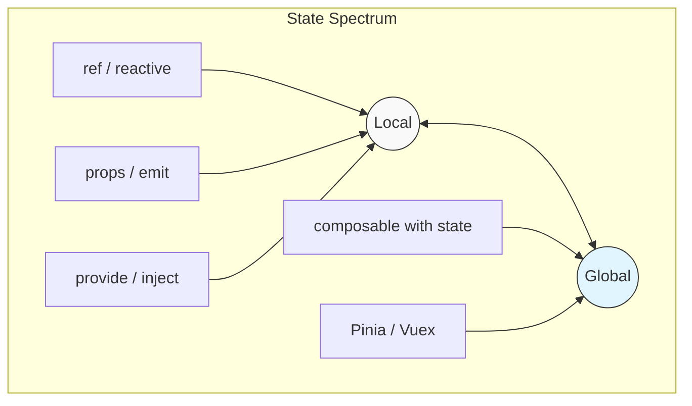
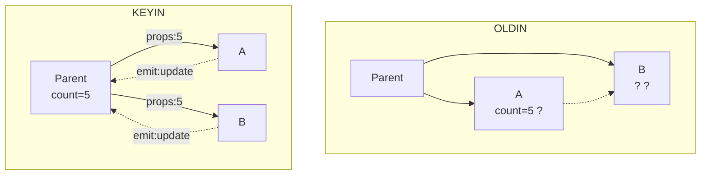

# Global vs Local State

## Kirish

> [!IMPORTANT]
> **Nima uchun muhim?**  
> Ilovada State (holat)ni to'g'ri joyda saqlash — dastur arxitekturasining poydevori. Hamma narsani Global saqlash ilovani sekinlashtiradi va xotirani band qiladi. Hamma narsani Local saqlash esa ma'lumotlarni uzatishda qiyinchilik tug'diradi (prop drilling).

> [!NOTE]
> **Real-hayot analogiyasi: "Sirlar va Ommaviy e'lonlar"**  
> **Local State:** Bu sizning shaxsiy siringiz. Uni faqat o'zingiz bilasiz va kerak bo'lsa, faqat yaqinlaringizga aytasiz (Props orqali).
> **Global State:** Bu shahar markazidagi katta reklama ekrani. Uni shahardagi hamma (barcha komponentlar) ko'radi. Qayerda bo'lishingizdan qat'iy nazar (Pinia orqali) ma'lumotga ega bo'lasiz.

State management'da eng muhim qaror - bu state'ni qayerda saqlash.



---

## 🟢 Junior (Asoslar va Tushunchalar)

### Local State Nima?
Faqatgina bitta (o'sha) komponent ichida saqlanadigan va ishlatiladigan holat bu Local state deyiladi. Boshqa komponentlar uni to'g'ridan to'g'ri ishlata olmaydi. Masalan, Modallarning ochiq/yopiqligi, Formalardagi input matnlari kabilar local state bo'lishi kerak.

```vue
<script setup>
import { ref, reactive } from 'vue'

// Local state
const isModalOpen = ref(false)
const formData = reactive({ name: '', email: '' })
</script>
```

### Global State Nima?
Butun ilova bo'ylab (hamma komponentlarda) ishlatilishi kerak bo'lgan holat - bu Global state. Masalan: Foydalanuvchi profil ma'lumotlari (Auth), savatchadagi tovarlar (Cart), yoki ilova temasi (Light/Dark). Ular asosan **Pinia** da saqlanadi.

```javascript
// stores/app.js (Pinia orqali global state)
export const useAppStore = defineStore('app', () => {
  const theme = ref('light') // Hamma joyda ishlatiladi
  return { theme }
})
```

### Parent dan Child ga ma'lumot uzatish (Props)
Agar komponentlar ota-bola ko'rinishida yozilgan bo'lsa, global state ochish shart emas. Oddiy `props` yordamida ota o'zining local state'ini bolaga bera oladi.

```vue
<!-- Ota komponent -->
<script setup>
const count = ref(5)
</script>
<template>
  <BolaKomponent :count="count" />
</template>
```

---

## 🟡 Middle (Amaliyot va Detallar)

### State Lifting (Holatni yuqoriga ko'tarish)
Ikkita qo'shni (Sibling) komponent bitta ma'lumotni ulashishi kerak bo'lib qoldi. A komponent B komponentga ma'lumot bera olmaydi. Shu paytda A va B komponentning ota komponentiga (Parent) state ochiladi va ikkala bolaga uzatiladi.



### Prop Drilling va Provide/Inject
Agar ma'lumotni 5-10 qavat ichkaridagi bola komponentga bermoqchi bo'lsak, props orqali birma bir berib chiqish (Prop drilling deniladi) juda xunuk kodga olib keladi. Buni `provide` / `inject` orqali hal qilamiz. U xuddi radio stansiyasiga o'xshaydi: Ota signal beradi, bola uzoqda turib ham qabul qiladi.

```vue
<!-- App.vue (Eng katta ota) -->
<script setup>
import { provide, ref } from 'vue'
const user = ref({ name: 'Jonish' })
provide('user_data', user) // Tarqatdi
</script>

<!-- DeepChild.vue (Ichkaridagi bola) -->
<script setup>
import { inject } from 'vue'
const user = inject('user_data') // O'qib oldi
</script>
```

### Qachon Global va Qachon Local ishlatamiz?
- **Faqat UI holatlari (Tabs, Accordions, Dropdowns)**: faqat va faqat Local State (`ref()`).
- **Formalar**: odatda Local State. Faqat qadamli (wizard) formalar uchungina Global yoki Provide ishlatiladi.
- **Foydalanuvchi ma'lumoti, Temalar, Avtorizatsiya**: Global State (Pinia).
- **Keshlangan API ma'lumotlari (Mahsulotlar ro'yxati)**: Global State (Pinia).

---

## 🔴 Senior (Arxitektura va Optimallashtirish)

### Readonly Provider Pattern
`provide` / `inject` bilan ishlashda eng katta muammo — qabul qiluvchi (inject qilingan) komponent bilmasdan turib ma'lumotni mutate (o'zgartirib) qo'yishidir. Buni oldini olish uchun "Single Source of Truth" tamoyiliga amal qilib, readonly wrapper ishlatiladi.

```javascript
// Ota komponent
import { provide, readonly, ref } from 'vue'
const user = ref({ name: 'Hacker' })

// Bola o'zgartira olmasligi uchun readonly qilinib beriladi
provide('user', readonly(user))

// O'zgartiruvchi funksiyani alohida beramiz
provide('updateUser', (newName) => {
  user.value.name = newName
})
```

```javascript
// Bola komponent
const user = inject('user')
user.value.name = 'Yangi Ism' // Warning! Ishlamaydi (Buzishdan saqladik)

const update = inject('updateUser')
update('Yangi Ism') // To'g'ri yo'l!
```

### Singleton vs Instance Composables
Composables bilan qanday qilib ham Local, ham Global (shared) state yaratish mumkinligini farqlash arxitektura uchun muhim:

```javascript
// 1. INSTANCE (Local State Composable)
// Funksiya chaqirilganda har safar yangi xotira ajraladi
export function useCounter() {
  const count = ref(0) 
  return { count }
}

// 2. SINGLETON (Shared Global State Composable)
// ref tashqariga chiqdi, butun loyihada faqat 1 ta xotira bor
const count = ref(0) 

export function useSharedCounter() {
  return { count }
}
```

### Feature-Based Architecture (Modulli yondashuv)
Katta loyihalarda barcha state'larni markaziy Pinia ga tiqib tashlash yomon amaliyot. Ularni funksiyalar (feature) ga qarab ajratish kerak.
```text
src/
  features/
    products/
      components/
        ProductCard.vue     (Local state ishlatsin)
      stores/
        productStore.ts     (Global product state ishlatsin)
      composables/
        useProductSearch.ts (Local & Shared mantiqni o'rasin)
```

### Intervyu Savollari (Qiyin daraja)
**1. Nega biz barcha statelarni Pinia da saqlab qo'yaqolmaymiz?**
*Javob:* Xotira bandligi va Unmounting muammolari. Komponent yo'qotilganda (unmount), uning ichidagi local `ref` lar Garbage Collector tomonidan xotiradan tozalanadi. Agar ular Pinia da bo'lsa, butun dastur yopilmaguncha xotirada qolaveradi (Memory leak xavfi ortadi). Shuningdek, kodni o'qish qiyinlashadi, chunki oddiy dropdown ni yopish mantiqi qayerdadir Global o'tirgan bo'ladi.

**2. Provide/Inject yordamida Global state qilsa bo'ladi-ku, Piniani nima keragi bor?**
*Javob:* Ha, `App.vue` ga hamma narsani Provide qilib, butun loyihaga tarqatsa bo'ladi. Lekin: 1. Vue DevTools da uzoq provide qilingan datalarni track qilish imkoni yo'q. 2. Ma'lumotlarni Persistence qilish (LocalStorage da ushlab qolish) juda qiyinlashadi. 3. SSR (Server Side Rendering) jarayonida state hidratatsiyasini qo'lda qilish azob. Pinia shularning hammasini "out-of-the-box" hal qilib beradi.

---

## Eng Yaxshi Amaliyotlar (Best Practices)

1. **State lifting'ni ortiqcha ishlatmang**: Agar ma'lumotni 3-4 qavat tepaga ko'tarishingiz kerak bo'lsa, `provide/inject` yoki Store haqida o'ylang. Props drilling kodni o'qishni qiyinlashtiradi.
2. **Kapsulatsiya (Encapsulation)**: Komponentning ichki state'ini iloji boricha local saqlang. Hamma narsani global store'ga qo'shish xotirani band qiladi va debugging'ni qiyinlashtiradi.
3. **Provide/Inject da Readonly ishlatish**: Provider har doim `readonly` state yuborishi va state'ni o'zgartiradigan funksiyalarni alohida provide qilishi kerak. Shunda ma'lumotni kim qayerda o'zgartirgani aniq bo'ladi.
4. **Composables**: Biznes logikani qayta ishlatishda eng kuchli qurol. Komponent ichida 100 qator lokal state va metodlar yozgandan ko'ra, buni alohida `.js/ts` fayldagi Composable ichiga oling.

---

## Xulosa

| Holat Saqlash Joyi | Xususiyati | Qachon ishlatiladi? |
|--------------------|------------|---------------------|
| **Local (`ref`/`reactive`)** | Faqat o'z komponentiga tegishli (Sir) | Tugma bosilishi, Modal ochiq/yopiqligi, Kichik formalar |
| **Props / Emit** | Ota-bolani bog'laydi (Qo'shni) | Ma'lumotni 1 yoki 2 qavat yuqoriga/pastga uzatish |
| **Provide / Inject** | Chuqur komponentlarni bog'laydi (Karnay) | Temalar, Til sozlamalari, Murakkab formalar (3+ qavat) |
| **Composables** | Mantiqni qayta ishlatadi (Yordamchi) | API so'rovlar, Brauzer voqealari (Scroll, Mouse) |
| **Global (Pinia)** | Butun loyihaga tegishli (Markaziy Bank) | Foydalanuvchi ma'lumoti (Auth), Savatcha, Global xatolar |

State management - bu muvozanat ushlash san'ati. Avval eng sodda yo'lni (Local) tanlang, muammo seza boshlasangiz (Prop drilling) sekin yuqoriga (Provide yoki Global) ko'taring. "Over-engineering" dan qoching.
