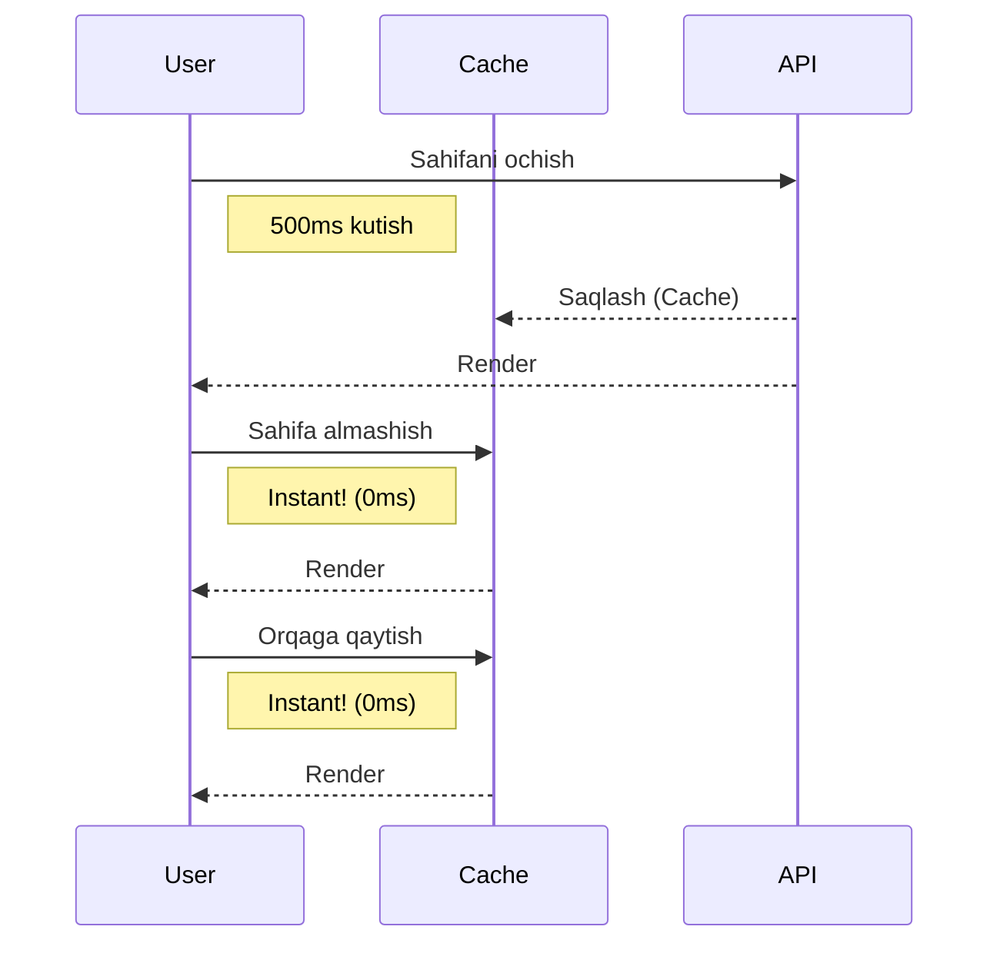

# Caching Strategies

## Kirish

> [!IMPORTANT]
> **Nima uchun muhim?**  
> Foydalanuvchilar tezlikni yaxshi ko'rishadi. Har safar sahifa o'zgarganda serverdan bir xil ma'lumotlarni qayta so'rash tarmoqni band qiladi va foydalanuvchini kuttirib qo'yadi. Caching orqali ilova tezligini oshiramiz va serverga tushadigan yuklamani kamaytiramiz.

> [!NOTE]
> **Real-hayot analogiyasi: "Muzlatgich"**  
> Tasavvur qiling, har doim suv ichgingiz kelganda do'konga borib kelasiz (Bu Cachesiz holat - API'ga har safar murojaat qilish). Boshqa yo'li esa suvni bir marta sotib olib, muzlatgichga qo'yishdir. Keyingi safar suv ichgingiz kelsa, muzlatgichdan olasiz (Bu Caching). Agar suv eskirgan bo'lsa, yana do'konga borib yangisini olib kelasiz (Cache invalidation/update).

Caching - tez-tez ishlatiladigan ma'lumotlarni vaqtincha saqlash, qayta fetch qilmaslik uchun ishlatiladigan texnika hisoblanadi.



---

## 🟢 Junior (Asoslar va Tushunchalar)

### Kesh turlari
Brauzerda va dasturlashda keshning turli xil joylari bor:
1. **Memory Cache (O'zgaruvchilar)**: Dastur yopilguncha saqlanadi. Eng tez ishlaydi. (Masalan, Pinia State yoki oddiy JavaScript Obyekti).
2. **LocalStorage / SessionStorage**: Kichik ma'lumotlarni (5MB gacha) matn ko'rinishida saqlash. Brauzer yopilsa ham qoladi (LocalStorage uchun).
3. **HTTP Caching**: Brauzerning o'zi avtomatik tarzda rasmlar, CSS, JS larni qayta yuklamaslik uchun saqlab qoladi.

### Sodda Keshlash Muammosi
Agar siz ma'lumotni shunchaki o'zgaruvchiga saqlab qo'ysangiz, birinchi marta ishlagan API yana qayta chaqirilmaydi. Lekin serverdagi yangi o'zgarishlar ham mijozga yetib kelmaydi.

```javascript
// YOMON YONDASHUV - Stale (eskirib ketish) xavfi
const cache = {}

async function getUser() {
  if (cache['user']) {
    return cache['user'] // 10 kundan keyin ham eskisini beraveradi!
  }
  const data = await api.get('/user')
  cache['user'] = data
  return data
}
```

---

## 🟡 Middle (Amaliyot va Detallar)

### In-Memory Caching va TTL (Time-to-Live)
Eskirib ketishning oldini olish uchun yashash davomiyligini (TTL) qo'shamiz.

```javascript
// utils/cache.js
const cache = new Map()
const TTL = 5 * 60 * 1000 // 5 daqiqa

export async function fetchWithCache(key, apiCall) {
  const cachedData = cache.get(key)

  if (cachedData && Date.now() < cachedData.expiresAt) {
    return cachedData.value // Keshdan qaytaramiz
  }

  // API dan olingan yangi datani keshga yozish
  const data = await apiCall()
  cache.set(key, { value: data, expiresAt: Date.now() + TTL })
  return data
}
```

### Stale-While-Revalidate (SWR) Pattern
Keshning eng zamonaviy strategiyalaridan biri bu SWR. U shunday ishlaydi:
1. Agar ma'lumot keshda bo'lsa darhol mijozga shuni ko'rsat.
2. Lekin, orqa fonda serverga so'rov yubor.
3. Yangi ma'lumot kelsa, foydalanuvchining ekranini yangilab qo'y.

```javascript
// Oddiy SWR konsepti
async function fetchWithSWR(key, fetcher, updateUI) {
  const cached = cache.get(key)
  
  if (cached) {
    updateUI(cached.data) // Eski datani darhol ko'rsatish
    
    // Agar eskisa orqa fonda yangilash
    if (Date.now() - cached.timestamp > 60000) {
      fetcher().then(newData => {
         cache.set(key, { data: newData, timestamp: Date.now() })
         updateUI(newData) // Yangi datani ko'rsatish
      })
    }
  } else {
    // Keshda umuman yo'q bo'lsa kutishga majbur
    const newData = await fetcher()
    cache.set(key, { data: newData, timestamp: Date.now() })
    updateUI(newData)
  }
}
```

*Amalda buni noldan yozish o'rniga Vue uchun `@tanstack/vue-query` kabi kutubxonalar ishlatiladi.*

### Request Deduplication (So'rovlarni birlashtirish)
Agar 3 ta alohida komponent birdaniga API ga bir xil so'rov yuborsa, qanday qilib ularni birlashtirib 1 ta qilib ketamiz?

```javascript
const pendingRequests = new Map()

async function dedupeRequest(key, requestFn) {
  if (pendingRequests.has(key)) {
    return pendingRequests.get(key) // Boshqa komponent yuborgan va kutilayotgan Promiseni qaytarish
  }

  const promise = requestFn().finally(() => {
    pendingRequests.delete(key)
  })

  pendingRequests.set(key, promise)
  return promise
}
```

---

## 🔴 Senior (Arxitektura va Optimallashtirish)

### Cache Invalidation (Keshni tozalash) strategiyalari
> "Dasturlashda ikkita eng qiyin narsa bor: Keshni tozalash va O'zgaruvchilarga nom berish."

Keshni eskirganda tozalashning bir necha turlari bor:
1. **Time-Based (TTL):** Tepadagi ko'rganimizdek, 5 minutdan keyin o'chadi.
2. **Event-Based:** Bitta o'zgarish bo'lganda boshqasini o'chirish. Masalan, Post tahrirlanganda barcha postlar keshini tozalash.
3. **Manual Invalidation (Write-Through):** Update zaprosi muvaffaqiyatli o'tgach darhol o'sha obyekt keshini qo'lda yangilash. Bu usul API ga qayta murojaatni talab qilmaydi.

### IndexedDB Cache (Murakkab Keshlar)
Katta hajmli ma'lumotlar (50MB+), fayllar, yoki Offline Support uchun xizmat ko'rsatilganda Memory yoki LocalStorage yetarli bo'lmaydi. IndexedDB ishlatiladi. IndexedDB Asinxron ishlaydi va Thread ni block qilmaydi.

```javascript
// utils/idbCache.js
import { openDB } from 'idb'

class IDBCache {
  constructor() {
    this.dbPromise = openDB('myAppCache', 1, {
      upgrade(db) {
        db.createObjectStore('cache')
      }
    })
  }

  async get(key) {
    return (await this.dbPromise).get('cache', key)
  }

  async set(key, value) {
    return (await this.dbPromise).put('cache', value, key)
  }
}
```

### Optimistic Updates
Eng tezkor kesh - bu Optimistik Yangilash. Foydalanuvchi tugmani bossa, keshni shu zahoti o'zgartiramiz, garchi API dan javob kelmagan bo'lsa ham. Xato bo'lsa orqaga (rollback) qaytamiz.
```javascript
async function likePost(post) {
  const originalLikes = post.likes
  post.likes++ // UI ni darhol o'zgartirish (Optimistic Update)

  try {
    await api.post(`/posts/${post.id}/like`) // Backgroundda yuborish
  } catch (error) {
    post.likes = originalLikes // Xato bersa qaytarib qo'yamiz
    showError('Xatolik yuz berdi')
  }
}
```

### Intervyu Savollari (Qiyin daraja)
**1. LocalStorage va SessionStorage qachon yomon tanlov?**
*Javob:* Agar siz 5MB dan katta ma'lumot saqlamoqchi bo'lsangiz. Yoki JSON ni to'liq parse qilib saqlashga sarflanadigan vaqt CPU ni bloklaydigan darajada katta bo'lsa, chunki ular sinxron API. Bulardan farqli o'laroq IndexedDB Asinxron ishlaydi va DOM renderini to'xtatib qo'ymaydi.

**2. Memory Leak kesh bilan qanday kelib chiqishi mumkin?**
*Javob:* Agar Map() ichida datani faqat Set qilsak va delete (clear) qilmasak, foydalanuvchi saytda qancha ko'p o'tirsa Memory hajmi shuncha oshib ketadi. Buni LRU (Least Recently Used) kesh algoritmi (maksimal hajmni belgilash va eskisini o'chirish) orqali hal qilish mumkin. Yoki WeakMap lardan ob'ekt reference si o'chishi bilan garbagedan tozalanishi uchun foydalanish mumkin.

---

## Eng Yaxshi Amaliyotlar (Best Practices)

1. **Caching Layer'ni aniq belgilang**: Cache'ni to'g'ridan-to'g'ri komponentlar ichida emas, Pinia store yoki maxsus composable (masalan, Vue Query) orqali boshqaring.
2. **SWR Pattern'dan keng foydalaning**: User kutishni yoqtirmaydi. Iloji bo'lsa, eskirgan cache ma'lumotini ko'rsatib, fonda yangilash usulini ishlating.
3. **Invalidation shartlarini yoddan chiqarmang**: Keshni qachon tozalash/yangilash kerakligini oldindan rejalashtiring (Masalan: User logout bo'lganda, ma'lumot tahrirlanganda yoxud vaqti tugaganda).
4. **Faqat kerakli narsani cache qiling**: Hamma narsani Cache qilaverish memory leak va ma'lumotlar chalkashligiga olib keladi.

---

## Xulosa

| Caching Turi | Nima uchun kerak? | Qayerda saqlanadi? | Analogiya |
|--------------|-------------------|--------------------|-----------|
| **In-Memory** | API so'rovlarni kamaytirish, tezlik | RAM (O'zgaruvchilarda) | Cho'ntakdagi pul (Tez tugaydi, oson) |
| **LocalStorage** | Kichik va doimiy ma'lumotlar uchun | Brauzer LocalStorage | Seyfdagi pul (Xavfsizroq, lekin sekinroq) |
| **IndexedDB** | Katta hajmli fayllar, offline qo'llab-quvvatlash | Brauzer IndexedDB | Bankdagi pul (Katta xajm, biroz murakkab) |
| **SWR (Stale-While-Revalidate)** | UI bloklanib qolmasligi uchun eski ma'lumotni ko'rsatib turish | Barcha Cachelarda | Yangi non yopilguncha eskini yeb turish |

Samarali caching - bu shunchaki hamma narsani saqlash emas, balki "qachon yangilashni bilish" san'ati. Cache'ni xato boshqarish (Invalidation) yanglish ma'lumot ko'rinib qolishiga sabab bo'ladi. Ehtiyotkorlik bilan ishlating.
