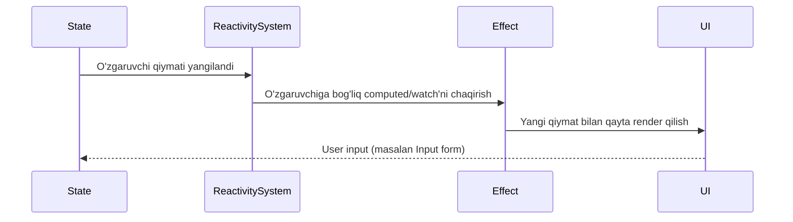

# Reactive Patterns

## Kirish

> [!IMPORTANT]
> **Nima uchun muhim?**  
> Zamonaviy web-dasturlashda eng katta muammo DOM ni qo'lda yangilash (masalan `document.getElementById('...').innerText = ...`). Reaktivlik bizni bu azobdan qutqaradi. Siz faqat o'zgaruvchilarni (state) o'zgartirasiz, UI esa o'zi avtomatik yangilanadi.

> [!NOTE]
> **Real-hayot analogiyasi: "Excel Jadvallari"**  
> Tasavvur qiling sizda Excel jadvali bor. A1 katakchada `10`, B1 katakchada `20` qiymati bor. C1 katakchaga `=A1+B1` formulasini yozdingiz (`30` chiqdi). Agar A1 ni `50` ga o'zgartirsangiz, siz C1 ni yangilab o'tirmaysiz — u avtomatik `70` bo'lib qoladi. Reaktivlik xuddi shunday ishlaydi! Ma'lumot (A1) o'zgarganda, unga bog'liq bo'lgan hamma narsa (C1) avtomatik qayta hisoblanadi.

Reaktivlik - ma'lumot o'zgarganda UI (yoki boshqa bog'langan logikalar) avtomatik yangilanishi jarayonidir.



---

## 🟢 Junior (Asoslar va Tushunchalar)

### `ref` va `reactive` 

Vue'da ma'lumotni reaktiv (o'zgarganda UIni yangilaydigan) qilishning 2 ta asosiy yo'li bor.

**1. `ref` - Barcha tiplar uchun (Primitive va Object)**
Qoidasi: Kod ichida qiymatini o'zgartirish yoki olish uchun doim `.value` qo'shiladi. Template'da (`<template>`) esa o'zi yechiladi (`.value` kerak emas).

```javascript
import { ref } from 'vue'

const count = ref(0)
const isActive = ref(true)

function increment() {
  count.value++ // .value kerak
}
```

**2. `reactive` - Faqat Obyektlar va Massivlar (Arrays) uchun**
Qoidasi: Ichidagi ma'lumotga to'g'ridan to'g'ri nuqta orqali kiriladi (`.value` shart emas).

```javascript
import { reactive } from 'vue'

const state = reactive({
  user: 'John',
  age: 25
})

function updateAge() {
  state.age++ // .value shart emas
}
```

### `computed` xossasi (Avtomatik Hisob-kitoblar)
`computed` bu boshqa reaktiv qiymatlarga tayanadigan xossadir. U doim nimadir `return` qilishi shart. Agar unga bog'liq ma'lumot o'zgarmasa qayta hisoblanmaydi (keshlanadi).

```javascript
import { ref, computed } from 'vue'

const price = ref(100)
const quantity = ref(2)

// price yoki quantity o'zgargandagina qayta hisoblanadi
const total = computed(() => {
  return price.value * quantity.value 
})
```

---

## 🟡 Middle (Amaliyot va Detallar)

### `watch` va `watchEffect`

Qachonki bir ma'lumot o'zgarganda hisob-kitob emas, balki qandaydir amal bajarish (masalan API dan data yuklash) kerak bo'lsa bular ishlatiladi.

**`watch` - Aniq bir narsani kuzatish**
Faqat ko'rsatilgan o'zgaruvchi o'zgargandagina ishga tushadi. Eskisi (oldValue) va yangisi (newValue) ni ko'rish mumkin.

```javascript
import { ref, watch } from 'vue'

const userId = ref(1)

// Faqat userId o'zgarganda ishlaydi
watch(userId, async (newId, oldId) => {
  console.log(`User ID o'zgardi: ${oldId} -> ${newId}`)
  await fetchUserFromApi(newId)
})
```

**`watchEffect` - Avtomatik kuzatish**
Ichida qaysi reaktiv o'zgaruvchi ishtirok etgan bo'lsa, o'shani o'zi avtomatik bilib olib, ular o'zgarganda qayta ishga tushaveradi. Shuningdek komponent render bo'lishi bilan (immediate) 1 marta darhol ishlaydi.

```javascript
import { ref, watchEffect } from 'vue'

const postId = ref(1)

watchEffect(async () => {
  // PostId o'zgarganda avtomatik qayta ishlaydi
  const data = await api.get(`/posts/${postId.value}`)
  console.log(data)
})
```

### `toRefs` (Destructuring Muammosi)
Agar siz `reactive` obyektini destructure qilsangiz, u o'zining reaktivligini yo'qotib oddiy qiymatga aylanib qoladi! 

```javascript
const state = reactive({ count: 0, name: 'Vue' })

// NOTO'G'RI (Reaktivlik yo'qoladi)
const { count, name } = state 

// TO'G'RI (Reaktivlik qoladi)
import { toRefs } from 'vue'
const { count, name } = toRefs(state) 
```

---

## 🔴 Senior (Arxitektura va Optimizatsiya)

### Performance: `shallowRef` va `shallowReactive`
Katta hajmdagi ma'lumotlar (masalan, minglab obyektli massiv yoki katta API javobi) bilan ishlaganda ularni to'liq `ref` yoxud `reactive` qilish ilovani qotirib qo'yishi mumkin. Chunki Vue har bir xususiyatini alohida kuzatishni (Deep Reactivity) boshlaydi.

Shu hollarda faqat Obyekt yoki massivni o'zi almashgandagina UIni yangilaydigan (ichidagi narsalar o'zgarganini sezmaydigan) versiyalar ishlatiladi.

```javascript
import { shallowRef } from 'vue'

// Ichidagi narsalar kuzatilmaydi
const bigData = shallowRef([{ id: 1, text: '...' }, /* minglab items */])

// UI yangilanMAYDI!
bigData.value[0].text = 'O'zgartirildi' 

// UI yangilanADI! (Butun massivni to'liq almashtirish kerak)
bigData.value = [...bigData.value, { id: 2, text: 'Yangi' }]
```

### Advanced Composables: Debounced Ref (Custom Ref)
Qidiruv oynasida (Search Input) foydalanuvchi har harf yozganda API ga murojaat qilish serverni qotiradi. `customRef` orqali kuttirib (debounce qilib) keyin reaktivlikni trigger qilish mumkin.

```javascript
import { customRef } from 'vue'

export function useDebouncedRef(value, delay = 300) {
  let timeout
  return customRef((track, trigger) => ({
    get() {
      track() // Vue ga kim shuni chaqirganini kuzatishni buyurish
      return value
    },
    set(newValue) {
      clearTimeout(timeout)
      timeout = setTimeout(() => {
        value = newValue
        trigger() // Kutish tugagach UI ni va kuzatuvchilarni yangilash
      }, delay)
    }
  }))
}

// Ishlatish:
const searchQuery = useDebouncedRef('', 500) // 500ms dan keyin reaktiv ishlaydi
```

### Intervyu Savollari (Qiyin daraja)
**1. `watch` da `flush` xususiyati nima vazifa bajaradi?**
*Javob:* Vue DOM'ni asinxron holda yangilaydi (batch update). `watch` avtomatik tarzda (default) komponent render (yangilanish) bo'lishidan OLDIN (`pre`) ishga tushadi. Agar sizga `watch` ishlaganda DOM allaqachon yangi dataga qarab render bo'lgan bo'lishi kerak bo'lsa (masalan DOM elemetlari hajmini o'lchash), `flush: 'post'` yoki `watchPostEffect` dan foydalanishingiz kerak.

**2. Effect Scope nima va u qachon kerak?**
*Javob:* Ba'zida bitta komponentdan tashqarida bo'lgan global funksiyalar yozishda ko'plab `watch` va `computed` lar yaratiladi. Ularni birdaniga to'xtatish (memory leak bo'lmasligi uchun) kerak bo'lganda `effectScope` ishlatiladi. U ichidagi barcha reaktiv kuzatuvchilarni yig'ib turadi va `.stop()` chaqirilganda barchasini birdaniga o'chiradi.

---

## Eng Yaxshi Amaliyotlar (Best Practices)

1. **`ref` va `reactive` dan foydalanish**: Oddiy va primitive ma'lumotlar uchun doim `ref` ishlating. Kompleks obyektlar yoki guruhlangan ma'lumotlar uchungina `reactive` ishlating.
2. **Destructuring xavfi**: `reactive` obyektni komponent ichida oddiy `const { ... } = state` shaklida destructure qilsangiz reaktivlik buziladi! Reaktivlikni saqlab qolish uchun `toRefs(state)` ishlating.
3. **`computed` qiymatlarni o'zgartirmang**: `computed` qiymatlar faqat ma'lumotni o'qish va transformatsiya qilish uchun. Ularning ichida ma'lumotlarni o'zgartirish (side-effect) ga aslo yo'l qo'ymang.
4. **Shallow tiplardan to'g'ri foydalaning**: Katta o'lchamli massivlar (minglab elementlar) bilan ishlaganda `shallowRef` ishlating, bu Vue'ni har bir elementni kuzatish (deep watch) dan qutqarib performance'ni oshiradi.

---

## Xulosa

| Reaktivlik Turi | Vazifasi | Qachon ishlatiladi? |
|-----------------|----------|---------------------|
| **`ref()`** | Har qanday tipdagi datani reaktiv qilish | String, Number kabi primitive tiplar va oddiy o'zgaruvchilar |
| **`reactive()`** | Obyekt va massivlarni chuqur reaktiv qilish | Formalar, Murakkab obyektlar va guruhlangan holatlar |
| **`computed()`** | Boshqa ma'lumotlarga asoslanib hisob-kitob qilish | Filtrlar, Formatlash, State'ga bog'liq formula qiymatlar |
| **`watch()`** | Ma'lum o'zgaruvchi o'zgarganida kod ishga tushirish | API ga o'zgarishni yuborish, Aniq o'zgarishga reaksiya bildirish |
| **`watchEffect()`**| Ichida ishlatilgan har qanday reaktiv data o'zgarganda ishlash | Fetch operatsiyalari, Dastlabki qiymatni avtomatik o'qish uchun |
| **`shallowRef()`**| Katta obyektning faqat o'zgaruvchini (root) reaktiv qilish | Katta API javoblari, Chart data (Performance optimizatsiya) |
| **`toRefs()`** | Reaktiv obyektni strukturasini buzmasdan qismlarga bo'lish | `reactive` dan destructuring orqali alohida ref lar olishda |

Reaktivlik Vue'ning asosiy kuchi hisoblanadi. O'zgaruvchilar va ularni ishlatish qoidalarini yaxshi bilgan dasturchi ortiqcha UI renderlarini oldini oladi va tezkor ilovalar yoza oladi.
