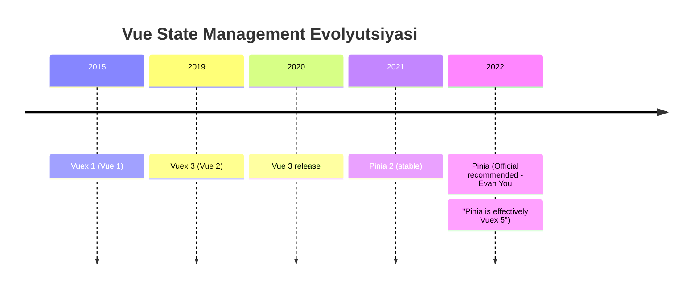
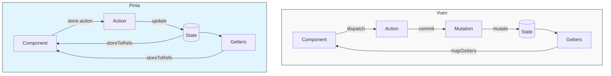

# Vuex vs Pinia - To'liq Taqqoslash

## Mundarija
1. [Umumiy Taqqoslash](#umumiy-taqqoslash)
2. [API Farqlari](#api-farqlari)
3. [TypeScript Qo'llab-quvvatlash](#typescript-qollab-quvvatlash)
4. [Performance](#performance)
5. [DevTools](#devtools)
6. [Migration Guide](#migration-guide)
7. [Real-World Comparison](#real-world-comparison)
8. [Qachon Qaysi Birini Tanlash](#qachon-qaysi-birini-tanlash)
9. [Interview Savollari](#interview-savollari)

---

## Umumiy Taqqoslash

> [!IMPORTANT]
> **Nima uchun muhim?**  
> Ko'plab eski Vue loyihalari Vuex'dan foydalanadi, yangi loyihalar esa Pinia'ni tanlaydi. Ushbu ikki texnologiyaning farqini tushunish, loyihani to'g'ri baholash, xatolarni tezda topish va agar kerak bo'lsa Vuex'dan Pinia'ga og'riqsiz migratsiya qilish uchun eng kerakli bilimdir.

> [!NOTE]
> **Real-hayot analogiyasi: "Qattiqqo'l menejer va O'z-o'ziga xizmat do'koni"**  
> **Vuex (Eski uslub):** Do'kondan nimadir olmoqchi yoki o'zgartirmoqchi bo'lsangiz, menejerga (Action) borishingiz kerak. U ishchilarga (Mutation) buyruq beradi va ishchilar omborni (State) o'zgartiradi. Juda xavfsiz, lekin ortiqcha qadamlar ko'p.
> **Pinia (Yangi uslub):** O'z-o'ziga xizmat do'koni. Qoidalarga (Action) amal qilgan holda o'zingiz to'g'ridan-to'g'ri omborni (State) o'zgartira olasiz. O'rtakashlar (Mutation) yo'q, tez va oson.

### Tarix va Status



### Asosiy Farqlar

| Xususiyat | Vuex | Pinia |
|-----------|------|-------|
| Vue versiya | 2 & 3 | 2 & 3 |
| TypeScript | Qo'shimcha sozlash | First-class |
| Mutations | Majburiy | Yo'q |
| Actions | Asinxron | Sinxron + Asinxron |
| Modules | namespaced: true | Alohida stores |
| DevTools | Ha | Ha |
| Bundle size | ~10KB | ~1.5KB |
| API | Options only | Options + Setup |
| Hot reload | Qisman | To'liq |

### Arxitektura



---

## API Farqlari

### Store Yaratish

```javascript
// ═══════════════════════════════════════════════════════════
// VUEX
// ═══════════════════════════════════════════════════════════
import { createStore } from 'vuex'

const store = createStore({
  state: {
    count: 0,
    user: null
  },

  getters: {
    doubleCount: (state) => state.count * 2,
    isLoggedIn: (state) => !!state.user
  },

  mutations: {
    INCREMENT(state) {
      state.count++
    },
    SET_USER(state, user) {
      state.user = user
    }
  },

  actions: {
    increment({ commit }) {
      commit('INCREMENT')
    },
    async fetchUser({ commit }) {
      const user = await api.getUser()
      commit('SET_USER', user)
    }
  }
})

// ═══════════════════════════════════════════════════════════
// PINIA - Options Syntax
// ═══════════════════════════════════════════════════════════
import { defineStore } from 'pinia'

export const useCounterStore = defineStore('counter', {
  state: () => ({
    count: 0,
    user: null
  }),

  getters: {
    doubleCount: (state) => state.count * 2,
    isLoggedIn: (state) => !!state.user
  },

  actions: {
    increment() {
      this.count++ // To'g'ridan o'zgartirish
    },
    async fetchUser() {
      this.user = await api.getUser()
    }
  }
})

// ═══════════════════════════════════════════════════════════
// PINIA - Setup Syntax
// ═══════════════════════════════════════════════════════════
import { defineStore } from 'pinia'
import { ref, computed } from 'vue'

export const useCounterStore = defineStore('counter', () => {
  // State
  const count = ref(0)
  const user = ref(null)

  // Getters
  const doubleCount = computed(() => count.value * 2)
  const isLoggedIn = computed(() => !!user.value)

  // Actions
  function increment() {
    count.value++
  }

  async function fetchUser() {
    user.value = await api.getUser()
  }

  return {
    count,
    user,
    doubleCount,
    isLoggedIn,
    increment,
    fetchUser
  }
})
```

### Komponentda Foydalanish

```vue
<!-- ═══════════════════════════════════════════════════════════
     VUEX
     ═══════════════════════════════════════════════════════════ -->
<script>
import { mapState, mapGetters, mapMutations, mapActions } from 'vuex'

export default {
  computed: {
    // State
    ...mapState(['count', 'user']),
    ...mapState({
      myCount: 'count'
    }),

    // Getters
    ...mapGetters(['doubleCount', 'isLoggedIn']),

    // Manual
    tripleCount() {
      return this.$store.state.count * 3
    }
  },

  methods: {
    // Mutations
    ...mapMutations(['INCREMENT']),

    // Actions
    ...mapActions(['fetchUser']),

    // Manual
    customIncrement() {
      this.$store.commit('INCREMENT')
      this.$store.dispatch('fetchUser')
    }
  }
}
</script>

<!-- ═══════════════════════════════════════════════════════════
     PINIA - Composition API
     ═══════════════════════════════════════════════════════════ -->
<script setup>
import { storeToRefs } from 'pinia'
import { useCounterStore } from '@/stores/counter'

const store = useCounterStore()

// State & Getters (reaktiv)
const { count, user, doubleCount, isLoggedIn } = storeToRefs(store)

// Actions
const { increment, fetchUser } = store

// Manual
const tripleCount = computed(() => store.count * 3)

function customIncrement() {
  store.increment()
  store.fetchUser()
}
</script>

<!-- ═══════════════════════════════════════════════════════════
     PINIA - Options API
     ═══════════════════════════════════════════════════════════ -->
<script>
import { mapState, mapGetters, mapActions } from 'pinia'
import { useCounterStore } from '@/stores/counter'

export default {
  computed: {
    ...mapState(useCounterStore, ['count', 'user']),
    ...mapGetters(useCounterStore, ['doubleCount'])
  },

  methods: {
    ...mapActions(useCounterStore, ['increment', 'fetchUser'])
  }
}
</script>
```

### Modules/Multiple Stores

```javascript
// ═══════════════════════════════════════════════════════════
// VUEX - Namespaced Modules
// ═══════════════════════════════════════════════════════════

// store/modules/user.js
export default {
  namespaced: true,

  state: () => ({
    profile: null
  }),

  mutations: {
    SET_PROFILE(state, profile) {
      state.profile = profile
    }
  },

  actions: {
    async fetchProfile({ commit }) {
      const profile = await api.getProfile()
      commit('SET_PROFILE', profile)
    }
  }
}

// store/modules/cart.js
export default {
  namespaced: true,

  state: () => ({
    items: []
  }),

  mutations: {
    ADD_ITEM(state, item) {
      state.items.push(item)
    }
  },

  actions: {
    addItem({ commit, rootState, dispatch }) {
      // Root state'ga kirish
      const userId = rootState.user.profile?.id

      // Boshqa module action
      dispatch('notifications/show', 'Added!', { root: true })

      commit('ADD_ITEM', item)
    }
  }
}

// store/index.js
import { createStore } from 'vuex'
import user from './modules/user'
import cart from './modules/cart'

export default createStore({
  modules: {
    user,
    cart
  }
})

// Komponentda
this.$store.state.user.profile
this.$store.getters['user/fullName']
this.$store.commit('cart/ADD_ITEM', item)
this.$store.dispatch('cart/addItem', item)

// ═══════════════════════════════════════════════════════════
// PINIA - Alohida Stores
// ═══════════════════════════════════════════════════════════

// stores/user.js
export const useUserStore = defineStore('user', {
  state: () => ({
    profile: null
  }),

  actions: {
    async fetchProfile() {
      this.profile = await api.getProfile()
    }
  }
})

// stores/cart.js
import { useUserStore } from './user'
import { useNotificationStore } from './notification'

export const useCartStore = defineStore('cart', {
  state: () => ({
    items: []
  }),

  actions: {
    addItem(item) {
      // Boshqa store'larni ishlatish - sodda!
      const userStore = useUserStore()
      const notifyStore = useNotificationStore()

      const userId = userStore.profile?.id

      this.items.push(item)

      notifyStore.show('Added!')
    }
  }
})

// Komponentda - sodda!
const userStore = useUserStore()
const cartStore = useCartStore()

userStore.profile
cartStore.items
cartStore.addItem(item)
```

### State O'zgartirish

```javascript
// ═══════════════════════════════════════════════════════════
// VUEX - Faqat mutations orqali
// ═══════════════════════════════════════════════════════════

// XATO!
this.$store.state.count = 10

// TO'G'RI
this.$store.commit('SET_COUNT', 10)

// Strict mode'da console error
// [vuex] do not mutate vuex store state outside mutation handlers.

// ═══════════════════════════════════════════════════════════
// PINIA - Har qanday usul
// ═══════════════════════════════════════════════════════════

const store = useCounterStore()

// 1. To'g'ridan
store.count = 10
store.user = { name: 'John' }

// 2. $patch - object
store.$patch({
  count: 10,
  user: { name: 'John' }
})

// 3. $patch - function
store.$patch((state) => {
  state.items.push(newItem)
  state.total = calculateTotal(state.items)
})

// 4. Action orqali
store.setCount(10)

// 5. $state - to'liq almashtirish
store.$state = { count: 0, user: null }

// 6. $reset - boshlang'ich holatga
store.$reset()
```

---

## TypeScript Qo'llab-quvvatlash

### Vuex bilan TypeScript

```typescript
// ═══════════════════════════════════════════════════════════
// VUEX - Murakkab type sozlamalar
// ═══════════════════════════════════════════════════════════

// store/types.ts
export interface User {
  id: number
  name: string
  email: string
}

export interface RootState {
  count: number
  user: User | null
}

// store/index.ts
import { createStore, Store } from 'vuex'
import { InjectionKey } from 'vue'

export const key: InjectionKey<Store<RootState>> = Symbol()

export const store = createStore<RootState>({
  state: {
    count: 0,
    user: null
  },

  mutations: {
    SET_COUNT(state, payload: number) {
      state.count = payload
    },
    SET_USER(state, payload: User | null) {
      state.user = payload
    }
  },

  actions: {
    async fetchUser({ commit }): Promise<void> {
      const user = await api.getUser()
      commit('SET_USER', user)
    }
  }
})

// main.ts
import { store, key } from './store'
app.use(store, key)

// Component - useStore type kerak
import { useStore } from 'vuex'
import { key } from '@/store'

const store = useStore(key)
// store.state.count - typed
// store.commit('SET_COUNT', 10) - typed

// Custom useStore
// store/helpers.ts
import { useStore as baseUseStore } from 'vuex'
import { key, RootState } from './index'

export function useStore() {
  return baseUseStore<RootState>(key)
}
```

### Pinia bilan TypeScript

```typescript
// ═══════════════════════════════════════════════════════════
// PINIA - Avtomatik type inference
// ═══════════════════════════════════════════════════════════

// stores/user.ts
import { defineStore } from 'pinia'

interface User {
  id: number
  name: string
  email: string
}

interface UserState {
  profile: User | null
  isLoading: boolean
  error: string | null
}

// Options syntax - type annotation
export const useUserStore = defineStore('user', {
  state: (): UserState => ({
    profile: null,
    isLoading: false,
    error: null
  }),

  getters: {
    // Return type avtomatik infer qilinadi
    isLoggedIn: (state) => !!state.profile,

    // Manual type
    fullName(): string {
      return this.profile?.name ?? 'Guest'
    }
  },

  actions: {
    async fetchProfile(): Promise<User | null> {
      this.isLoading = true

      try {
        const response = await api.get<User>('/profile')
        this.profile = response.data
        return this.profile
      } catch (e) {
        this.error = (e as Error).message
        return null
      } finally {
        this.isLoading = false
      }
    }
  }
})

// Setup syntax - to'liq type inference
export const useUserStore = defineStore('user', () => {
  const profile = ref<User | null>(null)
  const isLoading = ref(false)
  const error = ref<string | null>(null)

  const isLoggedIn = computed(() => !!profile.value)
  const fullName = computed(() => profile.value?.name ?? 'Guest')

  async function fetchProfile(): Promise<User | null> {
    isLoading.value = true

    try {
      const response = await api.get<User>('/profile')
      profile.value = response.data
      return profile.value
    } catch (e) {
      error.value = (e as Error).message
      return null
    } finally {
      isLoading.value = false
    }
  }

  return {
    profile,
    isLoading,
    error,
    isLoggedIn,
    fullName,
    fetchProfile
  }
})

// Komponentda - hech qanday qo'shimcha type kerak emas!
const store = useUserStore()
store.profile // User | null
store.isLoggedIn // boolean
store.fetchProfile() // Promise<User | null>
```

### Type Comparison

```typescript
// VUEX - getter type
// Qiyin: rootState, rootGetters types

getters: {
  userWithPosts(
    state: State,
    getters: any, // :(
    rootState: RootState,
    rootGetters: any // :(
  ) {
    return {
      ...state.user,
      posts: rootState.posts.items
    }
  }
}

// PINIA - sodda
getters: {
  userWithPosts(state) {
    const postsStore = usePostsStore()
    return {
      ...state.user,
      posts: postsStore.items
    }
  }
}
```

---

## Performance

### Bundle Size

```
VUEX 4:
├── vuex.esm-bundler.js  ~10KB (gzip ~4KB)
└── Dependencies: none

PINIA:
├── pinia.esm-bundler.js ~1.5KB (gzip ~1KB)
└── Dependencies: vue-demi (Vue 2/3 compat)

Farq: ~7x kichikroq
```

### Runtime Performance

```javascript
// STATE UPDATE BENCHMARK

// Vuex - commit + mutation + deep clone
store.commit('UPDATE_ITEMS', newItems)
// 1. commit() chaqiriladi
// 2. mutation handler topiladi
// 3. mutation ishga tushadi
// 4. devtools notification

// Pinia - to'g'ridan
store.items = newItems
// 1. Proxy setter
// 2. Trigger reactivity
// 3. devtools notification (lazy)

// REAL BENCHMARK (1000 items update):
// Vuex:  ~15ms
// Pinia: ~8ms
```

### Memory Usage

```javascript
// VUEX - strict mode deep watch
const store = createStore({
  strict: true, // Har o'zgarishni kuzatadi
  state: { items: [...1000 items] }
})

// Muammo: Strict mode katta state'da sekin

// PINIA - kerak bo'lmaganda watch yo'q
const store = useStore()
// Development'da debug, production'da yo'q
```

---

## DevTools

### Vuex DevTools

```
Features:
✓ Time-travel debugging
✓ State snapshot
✓ Mutation log
✓ Action log
✓ State editing
✓ Import/Export state

Limitations:
✗ Module navigation murakkab
✗ Action async tracking qiyin
✗ Hot reload ba'zan buziladi
```

### Pinia DevTools

```
Features:
✓ Time-travel debugging
✓ State snapshot
✓ Action log
✓ State editing (inline)
✓ Import/Export state
✓ Store navigation (alohida ko'rsatadi)
✓ Action duration tracking
✓ Nested action calls
✓ Hot reload to'liq ishlaydi

New in Pinia:
✓ $patch history
✓ Store groups
✓ Action timeline
```

---

## Migration Guide

### Vuex'dan Pinia'ga Ko'chish

```javascript
// ═══════════════════════════════════════════════════════════
// QADAM 1: Pinia o'rnatish
// ═══════════════════════════════════════════════════════════

// main.js
import { createPinia } from 'pinia'
import store from './store' // Vuex

const pinia = createPinia()

app.use(store)  // Vuex saqlab qolish
app.use(pinia)  // Pinia qo'shish

// ═══════════════════════════════════════════════════════════
// QADAM 2: Store konvertatsiya
// ═══════════════════════════════════════════════════════════

// OLDIN: store/modules/user.js (Vuex)
export default {
  namespaced: true,

  state: () => ({
    profile: null,
    isLoading: false
  }),

  getters: {
    isLoggedIn: (state) => !!state.profile,
    fullName: (state) => state.profile?.name ?? 'Guest'
  },

  mutations: {
    SET_PROFILE(state, profile) {
      state.profile = profile
    },
    SET_LOADING(state, loading) {
      state.isLoading = loading
    }
  },

  actions: {
    async fetchProfile({ commit }) {
      commit('SET_LOADING', true)
      try {
        const response = await api.getProfile()
        commit('SET_PROFILE', response.data)
      } finally {
        commit('SET_LOADING', false)
      }
    }
  }
}

// KEYIN: stores/user.js (Pinia)
import { defineStore } from 'pinia'

export const useUserStore = defineStore('user', {
  state: () => ({
    profile: null,
    isLoading: false
  }),

  getters: {
    isLoggedIn: (state) => !!state.profile,
    fullName: (state) => state.profile?.name ?? 'Guest'
  },

  // Mutations YO'Q!

  actions: {
    async fetchProfile() {
      this.isLoading = true
      try {
        const response = await api.getProfile()
        this.profile = response.data
      } finally {
        this.isLoading = false
      }
    }
  }
})

// ═══════════════════════════════════════════════════════════
// QADAM 3: Komponent konvertatsiya
// ═══════════════════════════════════════════════════════════

// OLDIN: Options API + Vuex
export default {
  computed: {
    ...mapState('user', ['profile', 'isLoading']),
    ...mapGetters('user', ['isLoggedIn', 'fullName'])
  },

  methods: {
    ...mapActions('user', ['fetchProfile']),

    logout() {
      this.$store.commit('user/SET_PROFILE', null)
    }
  },

  created() {
    this.fetchProfile()
  }
}

// KEYIN: Composition API + Pinia
import { storeToRefs } from 'pinia'
import { useUserStore } from '@/stores/user'

const userStore = useUserStore()

const { profile, isLoading, isLoggedIn, fullName } = storeToRefs(userStore)

function logout() {
  userStore.profile = null
}

onMounted(() => {
  userStore.fetchProfile()
})

// ═══════════════════════════════════════════════════════════
// QADAM 4: Root state/getters konvertatsiya
// ═══════════════════════════════════════════════════════════

// OLDIN: Vuex rootState
actions: {
  someAction({ state, rootState, rootGetters, dispatch }) {
    const userId = rootState.user.profile?.id
    const isAdmin = rootGetters['user/isAdmin']
    dispatch('notifications/show', 'Done', { root: true })
  }
}

// KEYIN: Pinia - alohida store import
import { useUserStore } from './user'
import { useNotificationStore } from './notification'

actions: {
  someAction() {
    const userStore = useUserStore()
    const notifyStore = useNotificationStore()

    const userId = userStore.profile?.id
    const isAdmin = userStore.isAdmin
    notifyStore.show('Done')
  }
}

// ═══════════════════════════════════════════════════════════
// QADAM 5: Vuex'ni o'chirish
// ═══════════════════════════════════════════════════════════

// package.json
// - "vuex": "^4.0.0"

// main.js
// - import store from './store'
// - app.use(store)

// Hamma fayl konvertatsiya bo'lgandan keyin
```

### Migration Checklist

```markdown
## Vuex → Pinia Migration Checklist

### Tayyorgarlik
- [ ] Pinia o'rnatish
- [ ] main.js'ga qo'shish
- [ ] Test yozish (migration oldidan)

### Har bir modul uchun
- [ ] defineStore bilan qayta yozish
- [ ] mutations'ni actions'ga birlashtirish
- [ ] namespaced → store function
- [ ] rootState → import other store
- [ ] rootGetters → import other store
- [ ] dispatch({ root: true }) → direct call

### Har bir komponent uchun
- [ ] $store → useStore()
- [ ] mapState → storeToRefs
- [ ] mapGetters → storeToRefs
- [ ] mapMutations → store actions
- [ ] mapActions → store methods

### Final
- [ ] Barcha testlar pass
- [ ] Vuex dependency o'chirish
- [ ] store folder tozalash
```

---

## Real-World Comparison

### E-commerce Store Example

```javascript
// ═══════════════════════════════════════════════════════════
// VUEX IMPLEMENTATION
// ═══════════════════════════════════════════════════════════

// store/modules/cart.js
export default {
  namespaced: true,

  state: () => ({
    items: [],
    coupon: null,
    isLoading: false,
    error: null
  }),

  getters: {
    itemCount: (state) => state.items.reduce((sum, i) => sum + i.quantity, 0),

    subtotal: (state) => state.items.reduce(
      (sum, i) => sum + i.price * i.quantity, 0
    ),

    discount: (state, getters) => {
      if (!state.coupon) return 0
      return getters.subtotal * (state.coupon.percentage / 100)
    },

    total: (state, getters) => {
      return getters.subtotal - getters.discount
    },

    isEmpty: (state) => state.items.length === 0
  },

  mutations: {
    ADD_ITEM(state, item) {
      const existing = state.items.find(i => i.productId === item.productId)
      if (existing) {
        existing.quantity += item.quantity
      } else {
        state.items.push(item)
      }
    },

    REMOVE_ITEM(state, productId) {
      state.items = state.items.filter(i => i.productId !== productId)
    },

    UPDATE_QUANTITY(state, { productId, quantity }) {
      const item = state.items.find(i => i.productId === productId)
      if (item) {
        item.quantity = quantity
      }
    },

    SET_COUPON(state, coupon) {
      state.coupon = coupon
    },

    CLEAR(state) {
      state.items = []
      state.coupon = null
    },

    SET_LOADING(state, loading) {
      state.isLoading = loading
    },

    SET_ERROR(state, error) {
      state.error = error
    }
  },

  actions: {
    addItem({ commit, dispatch }, item) {
      commit('ADD_ITEM', item)
      dispatch('notifications/show', {
        type: 'success',
        message: 'Item added to cart'
      }, { root: true })
    },

    async applyCoupon({ commit, state }, code) {
      commit('SET_LOADING', true)
      commit('SET_ERROR', null)

      try {
        const response = await api.validateCoupon(code)
        commit('SET_COUPON', response.data)
      } catch (error) {
        commit('SET_ERROR', error.message)
        throw error
      } finally {
        commit('SET_LOADING', false)
      }
    },

    async checkout({ commit, state, rootState }) {
      commit('SET_LOADING', true)

      try {
        const order = {
          items: state.items,
          coupon: state.coupon?.code,
          userId: rootState.user.profile?.id
        }

        const response = await api.createOrder(order)
        commit('CLEAR')

        return response.data
      } finally {
        commit('SET_LOADING', false)
      }
    }
  }
}

// Component usage
export default {
  computed: {
    ...mapState('cart', ['items', 'isLoading', 'error']),
    ...mapGetters('cart', ['itemCount', 'subtotal', 'total', 'isEmpty'])
  },

  methods: {
    ...mapActions('cart', ['addItem', 'applyCoupon', 'checkout']),

    removeItem(productId) {
      this.$store.commit('cart/REMOVE_ITEM', productId)
    },

    updateQuantity(productId, quantity) {
      this.$store.commit('cart/UPDATE_QUANTITY', { productId, quantity })
    }
  }
}

// ═══════════════════════════════════════════════════════════
// PINIA IMPLEMENTATION
// ═══════════════════════════════════════════════════════════

// stores/cart.js
import { defineStore } from 'pinia'
import { useUserStore } from './user'
import { useNotificationStore } from './notification'

export const useCartStore = defineStore('cart', {
  state: () => ({
    items: [],
    coupon: null,
    isLoading: false,
    error: null
  }),

  getters: {
    itemCount: (state) => state.items.reduce((sum, i) => sum + i.quantity, 0),

    subtotal: (state) => state.items.reduce(
      (sum, i) => sum + i.price * i.quantity, 0
    ),

    discount() {
      if (!this.coupon) return 0
      return this.subtotal * (this.coupon.percentage / 100)
    },

    total() {
      return this.subtotal - this.discount
    },

    isEmpty: (state) => state.items.length === 0
  },

  actions: {
    addItem(item) {
      const existing = this.items.find(i => i.productId === item.productId)

      if (existing) {
        existing.quantity += item.quantity
      } else {
        this.items.push(item)
      }

      // Boshqa store - sodda!
      const notifyStore = useNotificationStore()
      notifyStore.show({
        type: 'success',
        message: 'Item added to cart'
      })
    },

    removeItem(productId) {
      this.items = this.items.filter(i => i.productId !== productId)
    },

    updateQuantity(productId, quantity) {
      const item = this.items.find(i => i.productId === productId)
      if (item) {
        item.quantity = quantity
      }
    },

    async applyCoupon(code) {
      this.isLoading = true
      this.error = null

      try {
        const response = await api.validateCoupon(code)
        this.coupon = response.data
      } catch (error) {
        this.error = error.message
        throw error
      } finally {
        this.isLoading = false
      }
    },

    async checkout() {
      const userStore = useUserStore()

      this.isLoading = true

      try {
        const order = {
          items: this.items,
          coupon: this.coupon?.code,
          userId: userStore.profile?.id
        }

        const response = await api.createOrder(order)
        this.$reset()

        return response.data
      } finally {
        this.isLoading = false
      }
    },

    clear() {
      this.$reset()
    }
  }
})

// Component usage
<script setup>
import { storeToRefs } from 'pinia'
import { useCartStore } from '@/stores/cart'

const cartStore = useCartStore()

const {
  items,
  isLoading,
  error,
  itemCount,
  subtotal,
  total,
  isEmpty
} = storeToRefs(cartStore)

const {
  addItem,
  removeItem,
  updateQuantity,
  applyCoupon,
  checkout
} = cartStore
</script>
```

### Code Comparison

| Aspect | Vuex | Pinia |
|--------|------|-------|
| Lines of code | ~120 | ~80 |
| Boilerplate | Ko'p (mutations) | Kam |
| Type safety | Manual | Avtomatik |
| Cross-store | rootState, { root: true } | Import qiling |
| Readability | O'rtacha | Yaxshi |

---

## Qachon Qaysi Birini Tanlash

### Pinia Tanlang

```
✓ Yangi Vue 3 loyiha
✓ TypeScript ishlatilayotgan
✓ Composition API
✓ Bundle size muhim
✓ Sodda API kerak
✓ Yaxshi DevTools experience
✓ Hot Module Replacement kerak
```

### Vuex Tanlang

```
✓ Mavjud Vue 2 loyiha (migration qiyin)
✓ Team Vuex bilan tanish
✓ Strict mutation tracking kerak
✓ Katta mavjud codebase
```

### Migration Qilish Kerakmi?

```
Yangi loyiha?
    │
    └─► Pinia ishlating

Mavjud Vuex loyiha?
    │
    ├─► Vue 3'ga migrate qilyapsizmi? ──► Pinia'ga o'ting
    │
    ├─► Vue 2'da qolasizmi?
    │       │
    │       ├─► Katta loyiha? ──► Vuex'da qoling
    │       │
    │       └─► Kichik loyiha? ──► Pinia (Vue 2 support bor)
    │
    └─► Performance muammo bormi? ──► Pinia'ga o'ting
```

---

## Interview Savollari

### 1. Vuex va Pinia orasidagi eng muhim farqlar nimada?

**Javob:**

1. **Mutations yo'q**
```javascript
// Vuex - majburiy mutation
mutations: {
  SET_USER(state, user) {
    state.user = user
  }
}
actions: {
  async fetchUser({ commit }) {
    const user = await api.getUser()
    commit('SET_USER', user)
  }
}

// Pinia - to'g'ridan
actions: {
  async fetchUser() {
    this.user = await api.getUser()
  }
}
```

2. **TypeScript first-class**
```typescript
// Pinia - avtomatik inference
const store = useUserStore()
store.user // typed!
store.fetchUser() // typed!
```

3. **Modules → Alohida stores**
```javascript
// Vuex
this.$store.dispatch('user/fetchProfile')
this.$store.state.user.profile

// Pinia
const userStore = useUserStore()
userStore.fetchProfile()
userStore.profile
```

4. **Bundle size**
- Vuex: ~10KB
- Pinia: ~1.5KB

---

### 2. Pinia'da mutations nima uchun yo'q?

**Javob:**

Vuex'da mutations'ning maqsadi:
1. State o'zgarishini track qilish (DevTools)
2. Sinxron o'zgarish kafolati

Pinia'da bular boshqacha hal qilingan:

```javascript
// DevTools tracking - $patch va actions orqali
store.$patch({ count: 10 }) // DevTools ko'radi

// Direct mutation ham track qilinadi
store.count = 10 // DevTools'da ko'rinadi

// Sinxron kafolat - Vue 3 reactivity yetarli
store.count++ // Sinxron
store.items.push(item) // Sinxron
```

**Evan You fikri:**
> "Mutations were required in Vuex to enable devtools integration, but with Vue 3's Proxy-based reactivity, we can track direct mutations, making the mutation layer unnecessary boilerplate."

---

### 3. Vuex'dan Pinia'ga ko'chishning asosiy qadamlari qanday?

**Javob:**

```javascript
// 1. State - deyarli bir xil
// Vuex
state: { count: 0 }

// Pinia
state: () => ({ count: 0 })

// 2. Getters - bir xil
// Vuex & Pinia
getters: {
  doubleCount: (state) => state.count * 2
}

// 3. Mutations → Actions'ga birlashtirish
// Vuex
mutations: { SET_COUNT(state, val) { state.count = val } }
actions: { setCount({ commit }, val) { commit('SET_COUNT', val) } }

// Pinia
actions: {
  setCount(val) { this.count = val }
}

// 4. Namespaced modules → Alohida stores
// Vuex
modules: { user: userModule }
this.$store.dispatch('user/login')

// Pinia
const userStore = useUserStore()
userStore.login()

// 5. Root access → Store import
// Vuex
rootState.user.profile
dispatch('other/action', null, { root: true })

// Pinia
const userStore = useUserStore()
userStore.profile
const otherStore = useOtherStore()
otherStore.action()
```

---

### 4. Pinia'da store'lar orasidagi aloqa qanday amalga oshiriladi?

**Javob:**

```javascript
// stores/cart.js
import { useUserStore } from './user'
import { useProductStore } from './product'
import { useNotificationStore } from './notification'

export const useCartStore = defineStore('cart', {
  actions: {
    addToCart(productId) {
      // Boshqa store'larni ACTION ichida import qiling
      const userStore = useUserStore()
      const productStore = useProductStore()
      const notifyStore = useNotificationStore()

      // User tekshiruvi
      if (!userStore.isLoggedIn) {
        notifyStore.error('Please login first')
        return
      }

      // Product olish
      const product = productStore.getById(productId)

      // Cart'ga qo'shish
      this.items.push({
        productId,
        price: product.price,
        quantity: 1
      })

      // Notification
      notifyStore.success('Added to cart!')
    }
  }
})
```

**Muhim:** Store'larni ACTION ichida import qiling, module level'da emas:

```javascript
// NOTO'G'RI
const userStore = useUserStore() // Module level - xato!

export const useCartStore = defineStore('cart', {
  actions: {
    addToCart() {
      userStore.profile // Pinia hali ready bo'lmagan!
    }
  }
})

// TO'G'RI
export const useCartStore = defineStore('cart', {
  actions: {
    addToCart() {
      const userStore = useUserStore() // Action ichida - OK
      userStore.profile
    }
  }
})
```

---

### 5. Pinia'da $reset() qanday ishlaydi va uni customize qilish mumkinmi?

**Javob:**

`$reset()` - store'ni boshlang'ich holatga qaytaradi.

```javascript
// Options syntax - avtomatik ishlaydi
export const useCounterStore = defineStore('counter', {
  state: () => ({
    count: 0,
    name: 'Counter'
  })
})

const store = useCounterStore()
store.count = 100
store.$reset() // count: 0, name: 'Counter'

// Setup syntax - manual implement kerak
export const useCounterStore = defineStore('counter', () => {
  const count = ref(0)
  const name = ref('Counter')

  // $reset avtomatik ishlamaydi!
  function $reset() {
    count.value = 0
    name.value = 'Counter'
  }

  return { count, name, $reset }
})

// Custom reset logic
export const useCartStore = defineStore('cart', {
  state: () => ({
    items: [],
    coupon: null,
    lastSync: null
  }),

  actions: {
    // Custom reset - ba'zi state saqlanadi
    softReset() {
      this.items = []
      this.coupon = null
      // lastSync saqlanadi
    }
  }
})
```

---

## Eng Yaxshi Amaliyotlar (Best Practices)

1. **Yangi loyiha = Pinia**: Vue 2 da ishlaysizmi yoki Vue 3 da farqi yo'q. Hozirda barcha yangi loyihalar uchun Pinia ishlatish standarti tavsiya etiladi. Vuex yangilanmaydi.
2. **State mutate qilmang (Vuex)**: Agar loyiha eski va Vuex ishlatsa, hech qachon stateni to'g'ridan-to'g'ri o'zgartirmang (doim mutation ishlating). Pinia da bo'lsa buni to'g'ridan-to'g'ri qilsangiz bo'ladi.
3. **Module o'rniga bir nechta Pinia Store**: Vuex'dagi katta bir daraxt va namespace'lar o'rniga, Pinia'da turli kichik fayllarda alohida-alohida do'konlar (`useUserStore`, `useCartStore`) saqlash afzal. Bu TypeScript ga tiplarni tezroq topishga yordam beradi.

---

## Xulosa

### Final Recommendation

> [!TIP]
> **2024+ Loyihalar uchun: PINIA**
> 
> Sabablar:
> - Vue core team tomonidan rasmiy
> - Sodda API (no mutations)
> - TypeScript first-class
> - ~7x kichikroq bundle
> - Yaxshi DevTools
> - Hot reload to'liq ishlaydi
> - Evan You: "Pinia is effectively Vuex 5"

Vuex hali ham qo'llab-quvvatlanadi, lekin yangi loyihalar uchun Pinia tavsiya etiladi.
