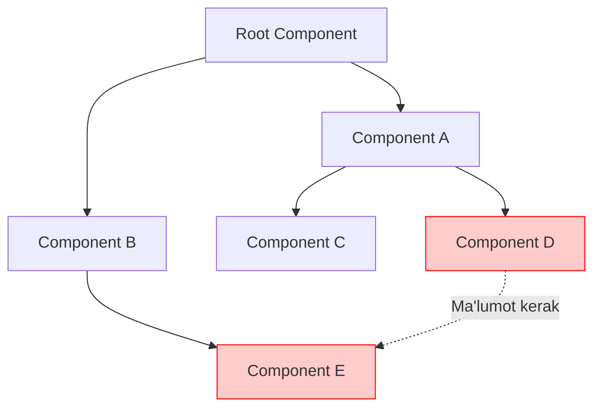
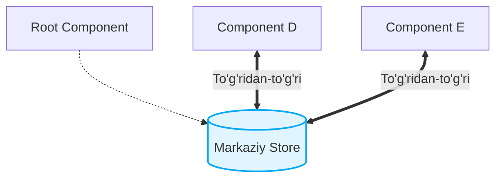
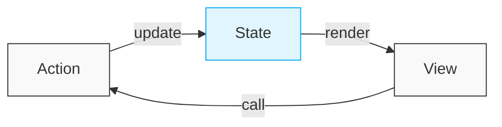

# State Management - Vue.js

## Mundarija

Bu bo'limda Vue.js ilovalarida state management (holat boshqaruvi) haqida chuqur o'rganamiz.

### Mavzular

| # | Fayl | Mavzu |
|---|------|-------|
| 1 | [01-vuex-basics.md](./01-vuex-basics.md) | Vuex asoslari - store, state, mutations, actions, getters |
| 2 | [02-pinia-basics.md](./02-pinia-basics.md) | Pinia asoslari - zamonaviy state management |
| 3 | [03-global-vs-local-state.md](./03-global-vs-local-state.md) | Global va lokal state - qachon qaysi birini ishlatish |
| 4 | [04-caching-strategies.md](./04-caching-strategies.md) | Caching strategiyalari - samarali ma'lumot saqlash |
| 5 | [05-reactive-patterns.md](./05-reactive-patterns.md) | Reaktiv patternlar - computed, watch, watchEffect |
| 6 | [06-vuex-vs-pinia.md](./06-vuex-vs-pinia.md) | Vuex vs Pinia - to'liq taqqoslash va tanlash mezonlari |

---

## State Management Nima?

> [!IMPORTANT]
> **Nima uchun muhim?**  
> Loyiha kichikligida komponentlar o'rtasida ma'lumot almashish (props va events orqali) oson bo'ladi. Ammo loyiha kattalashgani sari, bu jarayon juda qiyinlashib, "prop drilling" (ma'lumotni uzoqdagi komponentga yetkazish uchun o'rtadagi barcha komponentlardan o'tkazish) muammosiga aylanadi. State management ma'lumotlarni markazda saqlash orqali bu muammoni hal qiladi.

> [!NOTE]
> **Real-hayot analogiyasi: "Pochta vs Kuryer Xizmati"**  
> **Prop drilling (Oddiy usul):** Toshkentdan Samarqandga xat yuborish uchun o'rtadagi hamma shaharlardan qo'ldan-qo'lga uzatib o'tish.
> **State Management (Markazlashtirilgan usul):** Pochtaga (Store) xatni berasiz, u to'g'ridan-to'g'ri Samarqanddagi qabul qiluvchiga yetkazadi. O'rtadagi shaharlar aralashmaydi.

State management - bu ilovadagi ma'lumotlar holatini markazlashtirilgan tarzda boshqarish usuli. Katta ilovalarda komponentlar o'rtasida ma'lumot almashish murakkablashadi va bu muammoni hal qilish uchun state management kutubxonalari ishlatiladi.

### Muammo (Prop Drilling)



### Yechim (Store)



---

## 🟢 Junior (Asoslar va Tushunchalar)

### Asosiy Tushunchalar

**1. State (Holat)**
Ilovaning joriy holati - foydalanuvchi ma'lumotlari, ochiq/yopiq menyular kabi UI holati, mahsulotlar ro'yxati va boshqalar. Bu shunchaki markazdagi o'zgaruvchilar bazasi.

**2. Mutations/Actions**
State'ni o'zgartirish usullari. **Mutations** - ma'lumotni to'g'ridan-to'g'ri o'zgartiradigan sinxron funksiyalar (Vuex'da ishlatiladi). **Actions** - ichida asinxron jarayonlarni (masalan API dan data yuklash) bajarib so'ng State ni yangilaydigan operatsiyalar.

**3. Getters/Computed**
State'dan olingan (hisoblangan) qiymatlar. Masalan, savatdagi (State.items) barcha narsalarning umumiy summasi - Getter orqali hisoblanadi.

**4. Reactivity**
State o'zgarganda UIning o'zi avtomatik tarzda yangilanishi. Buni siz qilmaysiz, Vue avtomatik bajaradi.

---

## 🟡 Middle (Amaliyot va Detallar)

### Qachon State Management Kerak?

**Kerak BO'LMAGAN holatlar:**
- Kichik ilovalar (5-10 komponent).
- Faqatgina ota-bola (parent-child) aloqasi (props/emits) yetarli bo'lganda.
- Component faqat o'ziga tegishli (Local) statelari bor bo'lganda (masalan, dropdown menu ochiq yoki yopiqligi).

**Kerak BO'LGAN holatlar:**
- Katta ilovalar (50+ komponent).
- Chuqur nested (ichi-ichiga kirgan) komponentlar.
- Ko'p joyda bir xil ma'lumot kerak bo'lganda (User Profile, Shopping Cart).
- Murakkab asinxron operatsiyalar.

### Vue.js State Management Evolyutsiyasi

```
Vue 1.x ──► Vue 2.x ──► Vue 3.x
   │           │           │
   ▼           ▼           ▼
  Vuex 1    Vuex 3-4    Pinia (rasmiy)
```

**Vuex (2015-2022)**
Vue 2 uchun standart. Unda "Strict mutations" degan qattiq qoida bor edi, unga ko'ra holatni o'zgartirish uchun albatta mutation ishlatish shart edi. Modullari bor, lekin ishlatish biroz murakkab.

**Pinia (2021-hozir)**
Vue 3 uchun rasmiy kutubxona. U Vuex ning muammolarini yechgan: Mutations olib tashlangan, TypeScript ni mukammal darajada (First-class) qo'llab-quvvatlaydi.

---

## 🔴 Senior (Arxitektura va Optimizatsiya)

### Arxitektura Prinsiplari

**1. Single Source of Truth (Yagona haqiqat manbai)**
Xuddi ma'lumotlar bazasi bitta bo'lgani kabi, muhim ma'lumotlar ilovaning barcha qismiga faqat va faqat bitta joydan tarqalishi kerak. 
```javascript
// YAXSHI - bitta manba (Hamma uni Store dan o'qiydi)
const store = {
  user: { name: 'John', role: 'admin' }
}

// YOMON - ko'p manba (Ikkita komponent datani alohida olib keldi, endi chalkashlik bo'ladi)
componentA.user = { name: 'John' }
componentB.user = { name: 'John' }
```

**2. Predictable State Changes (Kutilgan o'zgarishlar)**
Har qanday o'zgarish Store da maxsus usulda qilinishi kerak (Action yoki Store.$patch orqali).
```javascript
// YAXSHI - aniq o'zgarish
store.updateUser(newUser)

// YOMON - to'g'ridan o'zgartirish (Component ichida mutation qilyapti)
store.state.user = newUser
```

**3. Unidirectional Data Flow (Bir tomonlama ma'lumot oqimi)**
State -> UI ni render qiladi. UI (masalan Button Click) -> Action ni chaqiradi. Action -> State ni yangilaydi. Sikl shu tarzda faqat bitta yo'nalishda davom etadi.


---

## Eng Yaxshi Amaliyotlar (Best Practices)

1. **State minimal bo'lishi kerak**: Faqatgina bir nechta komponentlarga kerak bo'ladigan ma'lumotlarni store'da saqlang. Local holatda ishlashi mumkin bo'lgan narsani o'z komponentida saqlagan ma'qul.
2. **Computed property'lardan maksimal foydalanish**: State dagi asl ma'lumotni o'zgartirmasdan, getters/computed orqali uni turli ko'rinishlarga o'tkazing (masalan, filterlash, sanash).
3. **Katta state'larni parchalang**: Hamma narsani bitta ulkan store ichiga yozmang. User, Cart, Products kabi kichik va izolyatsiya qilingan store'larga bo'ling.
4. **Side-effect'larni Action'ga qo'ying**: API chaqiruvlari, localStorage ga yozish yoki asinxron operatsiyalarni faqat action ichida bajaring, state'ni to'g'ridan-to'g'ri mutation qiladigan joyda emas.

---

## Xulosa

| Yondashuv | Nima u? | Qachon ishlatiladi? |
|-----------|---------|---------------------|
| **Props/Events (Local)** | Komponentlar o'zaro (Ota-Bola) ma'lumot uzatishi. | Kichik qismlar (masalan, Input formasi) uchun. |
| **Provide/Inject** | Ota komponentdan barcha pastki bolalariga ma'lumot berish. | Tema (Theme), Til (i18n) kabi o'zgarmas sozlamalar. |
| **Vuex (Legacy)** | Vue 2 va ilk Vue 3 loyihalari uchun markazlashgan state. | Eskidan qolgan (Legacy) katta loyihalarni qo'llab-quvvatlash. |
| **Pinia (Modern)** | Vue 3 ning rasmiy, yengil va tiplangan State menejeri. | Barcha yangi Vue 3 loyihalari uchun standart. |

State Management - bu loyihangizning "Miyagi". Qachon oddiy (Local) xotirani va qachon umumiy (Global) miyani ishlatishni bilish arxitekturangiz poydevorini belgilaydi.
