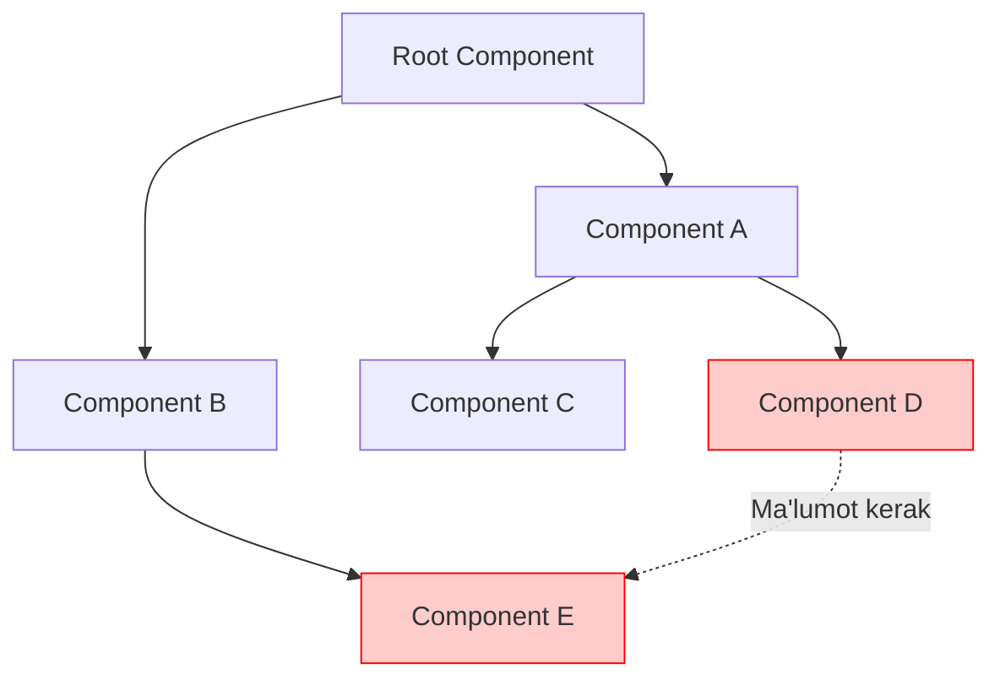
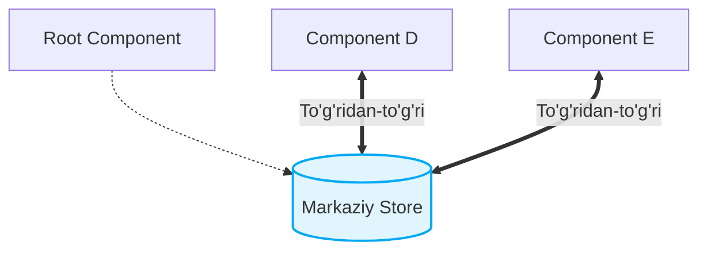
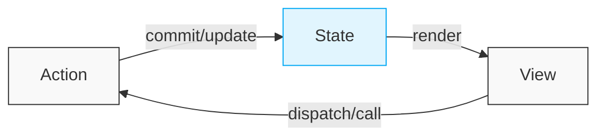

# State Management - Vue.js

## Mundarija

Bu bo'limda Vue.js ilovalarida state management (holat boshqaruvi) haqida chuqur o'rganamiz.

### Mavzular

| # | Fayl | Mavzu |
|---|------|-------|
| 1 | [01-vuex-basics.md](./01-vuex-basics.md) | Vuex asoslari - store, state, mutations, actions, getters |
| 2 | [02-pinia-basics.md](./02-pinia-basics.md) | Pinia asoslari - zamonaviy state management |
| 3 | [03-global-vs-local-state.md](./03-global-vs-local-state.md) | Global va lokal state - qachon qaysi birini ishlatish |
| 4 | [04-caching-strategies.md](./04-caching-strategies.md) | Caching strategiyalari - samarali ma'lumot saqlash |
| 5 | [05-reactive-patterns.md](./05-reactive-patterns.md) | Reaktiv patternlar - computed, watch, watchEffect |
| 6 | [06-vuex-vs-pinia.md](./06-vuex-vs-pinia.md) | Vuex vs Pinia - to'liq taqqoslash va tanlash mezonlari |

---

## State Management Nima?

> [!IMPORTANT]
> **Nima uchun muhim?**  
> Loyiha kichikligida komponentlar o'rtasida ma'lumot almashish (props va events orqali) oson bo'ladi. Ammo loyiha kattalashgani sari, bu jarayon juda qiyinlashib, "prop drilling" (ma'lumotni uzoqdagi komponentga yetkazish uchun o'rtadagi barcha komponentlardan o'tkazish) muammosiga aylanadi. State management ma'lumotlarni markazda saqlash orqali bu muammoni hal qiladi.

> [!NOTE]
> **Real-hayot analogiyasi: "Pochta vs Kuryer Xizmati"**  
> **Prop drilling (Oddiy usul):** Toshkentdan Samarqandga xat yuborish uchun o'rtadagi hamma shaharlardan qo'ldan-qo'lga uzatib o'tish.
> **State Management (Markazlashtirilgan usul):** Pochtaga (Store) xatni berasiz, u to'g'ridan-to'g'ri Samarqanddagi qabul qiluvchiga yetkazadi. O'rtadagi shaharlar aralashmaydi.

State management - bu ilovadagi ma'lumotlar holatini markazlashtirilgan tarzda boshqarish usuli. Katta ilovalarda komponentlar o'rtasida ma'lumot almashish murakkablashadi va bu muammoni hal qilish uchun state management kutubxonalari ishlatiladi.

### Muammo (Prop Drilling)



### Yechim (Store)



---

## Asosiy Tushunchalar

### 1. State (Holat)
Ilovaning joriy holati - foydalanuvchi ma'lumotlari, UI holati, cache va boshqalar.

### 2. Mutations/Actions
State'ni o'zgartirish usullari - sinxron va asinxron operatsiyalar.

### 3. Getters/Computed
State'dan hisoblangan qiymatlar - filtrlangan ro'yxatlar, statistika.

### 4. Reactivity
State o'zgarganda UI avtomatik yangilanishi.

---

## Vue.js State Management Evolyutsiyasi

```
Vue 1.x ──► Vue 2.x ──► Vue 3.x
   │           │           │
   ▼           ▼           ▼
  Vuex 1    Vuex 3-4    Pinia (rasmiy)
```

### Vuex (2015-2022)
- Vue 2 uchun standart
- Flux arxitekturasi
- Strict mutations qoidalari
- Module tizimi

### Pinia (2021-hozir)
- Vue 3 uchun rasmiy kutubxona
- Composition API integratsiyasi
- TypeScript first-class qo'llab-quvvatlash
- Mutations yo'q - soddalashtirilgan

---

## Qachon State Management Kerak?

### Kerak BO'LMAGAN holatlar
- Kichik ilovalar (5-10 komponent)
- Faqat props/emits yetarli bo'lganda
- Server-side rendering (SSR) bilan sodda ilovalar

### Kerak BO'LGAN holatlar
- Katta ilovalar (50+ komponent)
- Chuqur nested komponentlar
- Ko'p joyda bir xil ma'lumot kerak
- Murakkab asinxron operatsiyalar
- Time-travel debugging kerak

---

## Arxitektura Prinsiplari

### Single Source of Truth
```javascript
// YAXSHI - bitta manba
const store = {
  user: { name: 'John', role: 'admin' }
}

// YOMON - ko'p manba
componentA.user = { name: 'John' }
componentB.user = { name: 'John' }
```

### Predictable State Changes
```javascript
// YAXSHI - aniq o'zgarish
store.commit('SET_USER', newUser)

// YOMON - to'g'ridan o'zgartirish
store.state.user = newUser
```

### Unidirectional Data Flow


---

## Eng Yaxshi Amaliyotlar (Best Practices)

1. **State minimal bo'lishi kerak**: Faqatgina bir nechta komponentlarga kerak bo'ladigan ma'lumotlarni store'da saqlang. Local holatda ishlashi mumkin bo'lgan narsani o'z komponentida saqlagan ma'qul.
2. **Computed property'lardan maksimal foydalanish**: State dagi asl ma'lumotni o'zgartirmasdan, getters/computed orqali uni turli ko'rinishlarga o'tkazing (masalan, filterlash, sanash).
3. **Katta state'larni parchalang**: Hamma narsani bitta ulkan store ichiga yozmang. User, Cart, Products kabi kichik va izolyatsiya qilingan store'larga bo'ling.
4. **Side-effect'larni Action'ga qo'ying**: API chaqiruvlari, localStorage ga yozish yoki asinxron operatsiyalarni faqat action ichida bajaring, state'ni to'g'ridan-to'g'ri mutation qiladigan joyda emas.

---

## O'rganish Tartibi

1. **Boshlang'ich**: Vuex/Pinia asoslarini o'rganing
2. **O'rta**: Global vs Local state farqini tushuning
3. **Ilg'or**: Caching va reactive patternlarni qo'llang
4. **Ekspert**: Arxitektura qarorlarini mustaqil qabul qiling

---

## Foydali Resurslar

- [Vuex Rasmiy Docs](https://vuex.vuejs.org/)
- [Pinia Rasmiy Docs](https://pinia.vuejs.org/)
- [Vue.js State Management Guide](https://vuejs.org/guide/scaling-up/state-management.html)

---

## Eslatma

Bu materiallar senior-level tushunish uchun mo'ljallangan. Har bir mavzuda:
- Nazariy tushuntirish
- To'g'ri va noto'g'ri kod misollari
- Real loyiha tajribalari
- Interview savollari

bor.
