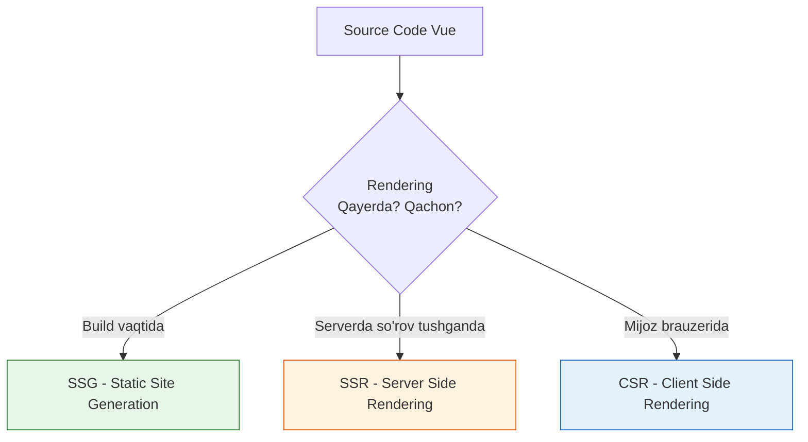

# SSR vs SSG vs CSR

## Kirish

> [!IMPORTANT]
> **Nima uchun muhim?**  
> Oddiy Vue (yoki React) dagi eng katta muammo bu SEO (Qidiruv tizimi optimizatsiyasi) va Birinchi Ekranning yuklanish tezligi (FCP) hisoblanadi. Chunki server mijozga shunchaki "bo'sh oq varaq" jo'natadi, qolgan hamma narsani brauzerning o'zi yuklab chizishi kerak. Bunga CSR deyiladi. SSR va SSG esa "oq varaq" o'rniga "tayyor chizilgan rasm" ni yuborish texnologiyalaridir. Qachon va qayerda qaysi birini ishlatishni bilish - Nuxt mutaxassisining asosiy belgisidir.

> [!NOTE]
> **Real-hayot analogiyasi: "Restoranda Ovqatlanish (Rendering)"**  
> - **CSR (Client-Side Rendering):** Siz restoranga bordingiz. Ofitsiant sizga bo'sh idish (Bo'sh HTML), xom go'sht, sabzavotlar (JSON Data) va retsept kitobi (JS fayllar) olib keldi. O'tirib o'zingiz ovqatni pishirasiz (Brauzerda chizish). **Kamchiligi:** Ko'p vaqt va kuch ketadi, lekin bir marta pishirgach, qolgan hamma narsani stolda hal qilaverasiz (Tez navigatsiya).
> - **SSR (Server-Side Rendering):** Siz restoranga bordingiz. Oshpaz (Server) oshxonada siz istagan ovqatni to'liq pishirdi va tayyor holda (HTML) oldingizga olib keldi. **Afzalligi:** Darhol yeysiz (Tez ko'rinadi). **Kamchiligi:** Har safar yangi ovqat (yangi Page) xohlaganda oshxonada pishishini kutasiz.
> - **SSG (Static Site Generation):** Siz restoranga kelguningizcha hamma ovqatlar allaqachon pishirib muzlatgichga (CDN) taxlab qo'yilgan. Siz so'rashingiz bilan tayyorini berishadi. **Afzalligi:** Eng tezi va arzonga tushadigani. **Kamchiligi:** Ovqat tez-tez o'zgarib turmaydi (Statik).

Rendering strategiyalari web application'ning performance, SEO va user experience'ini belgilaydi. Nuxt.js barcha strategiyalarni qo'llab-quvvatlaydi va ularni gibrid shaklda aralashtirib yozish imkonini ham beradi.

---

## 🟢 Junior (Asoslar va Tushunchalar)

### Rendering Nima?

Rendering - bu JavaScript/Vue kodini brauzerda ko'rish mumkin bo'lgan HTML ga aylantiirish jarayoni. Bu jarayon **qayerda** va **qachon** sodir bo'lishi rendering strategiyasini belgilaydi.



### Uch Asosiy Tushuncha
1. **CSR (Mijoz Tomonidan Chizish):** Server brauzerga oppoq sahifa (div id="app") va JS fayllarni jo'natadi. Brauzer JS kodini o'qib bo'lgach keyin sahifa chiziladi.
2. **SSR (Server Tomonidan Chizish):** Foydalanuvchi saytga kirganda, Nuxt.js (Server) o'zida hamma ma'lumotlarni yig'ib, Vue komponentlarni HTML ga o'girib keyin jo'natadi. Sayt 1 soniyada to'liq ochiq holda ko'rinadi.
3. **SSG (Statik Sayt Yaratish):** Sayt dasturchi tomonidan `npm run build` qilingan vaqtdayoq barcha sahifalar HTML ga o'girilib taxlab qo'yiladi. So'rov tushganda, hech qanday kod ishlamaydi, shunchaki tayyor HTML jo'natiladi. 

---

## 🟡 Middle (Amaliyot va Detallar)

### Konfiguratsiya Qilish (Nuxt 3)

Nuxt.js da barcha sozlamalar `nuxt.config.ts` da yoki har bir sahifaning o'zida `defineRouteRules` orqali sozlanadi. 

**Global Konfiguratsiya**
```typescript
// nuxt.config.ts
export default defineNuxtConfig({
  ssr: true // Default holati SSR yonik bo'ladi. False qilsangiz butun loyiha CSR bo'lib qoladi.
})
```

**Route-Level (Gibrid Rendering)**
Bu Nuxt 3 dagi eng kuchli "Route Rules" xususiyatidir. Turli xil URL manzillari uchun turli xil rendering ishlatiladi.

```typescript
// nuxt.config.ts
export default defineNuxtConfig({
  routeRules: {
    // SSG - build vaqtida render qilib qo'yadi (SEO zo'r)
    '/about': { prerender: true },

    // SSR - har request'da render qiladi (Real-time data uchun)
    '/dashboard/**': { ssr: true },

    // CSR - faqat client'da render (User dashboard, SEO kerak emas)
    '/admin/**': { ssr: false },

    // ISR - 60 sekundlik cache'li SSG (Tez o'zgaruvchi e-commerce)
    '/products/**': {
      isr: 60, // 60 sekunddan so'ng fonda yangilaydi
    }
  }
})
```

### SSR vs CSR farqini kodda his qilish
SSR da eng katta xato - brauzerga xos bo'lgan o'zgaruvchilarni (`window`, `document`, `localStorage`) top-level da yozishdir. Ular serverda yo'qligi sababli darhol xato (500 Error) yuz beradi.

**Noto'g'ri (SSR Crash qiladi):**
```vue
<script setup>
// Xato! Serverda localStorage degan narsa yo'q.
const theme = localStorage.getItem('theme') 
</script>
```

**To'g'ri (CSR ga qoldirish):**
```vue
<script setup>
import { ref, onMounted } from 'vue'

const theme = ref('light')

// onMounted faqat Client (Brauzer) da ishlaydi
onMounted(() => {
  theme.value = localStorage.getItem('theme')
})
</script>
```

---

## 🔴 Senior (Arxitektura va Optimizatsiya)

### ISR (Incremental Static Regeneration)
Bu SSG ning yangilangan (advanced) versiyasi. SSG da ma'lumot o'zgarsa, butun loyihani boshqadan Build qilish kerak bo'ladi. ISR esa ma'lum vaqt oralig'ida faqat kerakli sahifalarni **background** da build qilib oladi.

1. Birinchi marta zapros kelganda: Server ma'lumotni oladi, sahifa yasaydi va jo'natib uni Keshlashga (Cache) olib qo'yadi.
2. TTL (Time to live - misol uchun 60s) vaqti ichida kelgan zaproslarga Cache dagi ma'lumotni jo'natadi (SSG kabi juda tez).
3. Vaqt tugadi. Foydalanuvchi kirdi: Nuxt unga eskirgan ma'lumotni (Stale) ko'rsatadi, lekin fonda saktagina yangisini qurib keladi va Cache ni yangilaydi (Revalidate).

### Data Fetching Strategiyasi
Ma'lumot tortishda SEO uchun serverdan chaqirish muhim. Nuxt buning uchun xususiy `useFetch` ni taqdim etadi. Lekin CSR dagi sahifalar uchun ortiqcha server yuklamasi bermasligi uchun `server: false` qilib ketish tavsiya etiladi.

```vue
<script setup>
// SSR uchun doimiy:
const { data: posts } = await useFetch('/api/posts')

// Admin panel CSR sahifasida (server ishtirok etmaydi)
const { data: stats } = await useFetch('/api/admin/stats', { server: false })
</script>
```

### `<ClientOnly>` Komponenti
Serverda render qilib bo'lmaydigan qiyin kutubxonalar (masalan, Xarita (Leaflet), Chart.js kabi grafikalarni) faqatgina brauzerda ishga tushirish uchun maxsus konveyer qisqichi.
```vue
<template>
  <ClientOnly>
    <!-- Bu joy faqat brauzerda chiziladi -->
    <ChartComponent />
    <!-- Server o'rniga nima yuborishini belgilash -->
    <template #fallback>
       <p>Xarita yuklanmoqda...</p>
    </template>
  </ClientOnly>
</template>
```

### Intervyu Savollari (Qiyin daraja)
**1. SSR va SSG farqi nima? Qachon qaysi birini tanlaysiz?**
*Javob:* SSR har safar foydalanuvchi sahifaga kirganda Serverdan HTML yig'ib beradi. Serverga kuch tushadi, lekin data doim yangi turadi. SSG loyiha build bo'lgan vaqtda hamma HTML fayllarni taxlab qo'yadi. CDN ga tashlab qo'yilsa tekin xostingda ham ishlayveradi (server yuki yo'q). Tanlov: Blog va Docs uchun - SSG. E-commerce va real-time qidiruv sahifalari uchun - SSR.

**2. Hydration Mismatch (mos kelmasligi) xatosi nima?**
*Javob:* Server Vue dan yig'gan HTML ni jo'natadi. Brauzer olgach u yana ustidan Vue ni ishga tushiradi. Agar HTML dagi ma'lumot bilan Brauzer hisoblagan ma'lumot ikki xil chiqib qolsa Mismatch bo'ladi. Bunga ko'pincha `Math.random()`, bugungi sana kabi o'zgaruvchan kodlar yoki brauzerga xos narsalarni serverda o'qish sabab bo'ladi.

**3. CSR'ning SEO muammosi nima? Qanday yechiladi?**
*Javob:* CSR brauzerga `<div id="app"></div>` degan oppoq qog'oz beradi. Google Qidiruv robotlari (Bot) kelganda uni oq sahifa deb tushunib chiqib ketadi (garchi o'zida JavaScript ni render qila olsa ham, ko'pincha kutib o'tirmaydi). Yechim - Nuxt da SSR, SSG ni yoqish va `routeRules` orqali gibrid yondashuv qo'llash.

---

## Eng Yaxshi Amaliyotlar (Best Practices)

1. **Gibrid Yondashuv (Route Rules):** Butun loyihani bitta qoida bilan qotirib qo'ymang. Admin panel uchun har doim `ssr: false` (CSR), Landing page'lar va blog uchun `prerender: true` (SSG), tez o'zgaradigan E-commerce sahifalari uchun esa SSR yoki ISR (`swr`) ishlating.
2. **Server/Client contextni biling:** Komponentingiz ichida `window` yoki `localStorage` chaqirgan bo'lsangiz va fayl SSR da ishlayotgan bo'lsa darhol XATO (500) olasiz. Bunga qarshi `onMounted` hook'idan foydalaning (u faqat Clientda ishlaydi).
3. **Hydration Mismatch ni oldini oling:** Serverda tayyorlangan HTML bilan mijozdagi HTML bir xil bo'lishi shart. Ularda turli xil qiymatlar chiqaradigan funksiyalarni (`Math.random()` yoki sanalar) faqat Client tarafda qo'llang yoki `<ClientOnly>` komponentiga soling.
4. **Data fetching:** `useFetch` da agar server tarafdan data tortish shart bo'lmasa uni faqat `server: false` parametrilab oling. Bu ortiqcha request lar va server yukini tejaydi.

---

## Xulosa

| Yondashuv | Server yuki | SEO | Ma'lumot yangiligi | Qachon ishlatish kerak? |
|-----------|-------------|-----|--------------------|-------------------------|
| **SSG** | Yo'q (Statik) | Juda zo'r | Eskirgan bo'lishi mumkin | Bloglar, Qo'llanmalar (Docs), Landing sahifalar |
| **SSR** | Yuqori | Juda zo'r | Har doim yangi | E-commerce do'konlari, Yangiliklar portallari |
| **CSR** | Juda past | Yomon | Har doim yangi | Admin panellar, Foydalanuvchining shaxsiy kabineti |
| **ISR/SWR** | O'rtacha | Yaxshi | Belgilangan vaqtda yangi | Tez o'zgaradigan lekin baribir keshlash mumkin bo'lgan sahifalar |

Rendering strategiyasi tanlash murakkab qaror - bitta "eng yaxshi" yechim yo'q. Har bir sahifa turi uchun alohida strategiya tanlab, hybrid (gibrid) yondashuvni qo'llang. Nuxt.js 3 ning `routeRules` bu imkoniyatni eng oson darajaga olib chiqqan.
