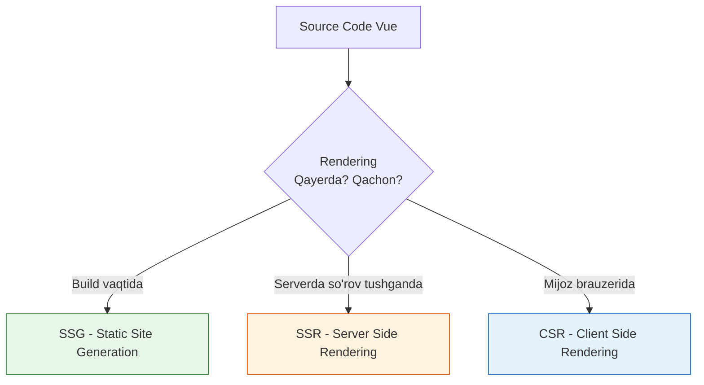
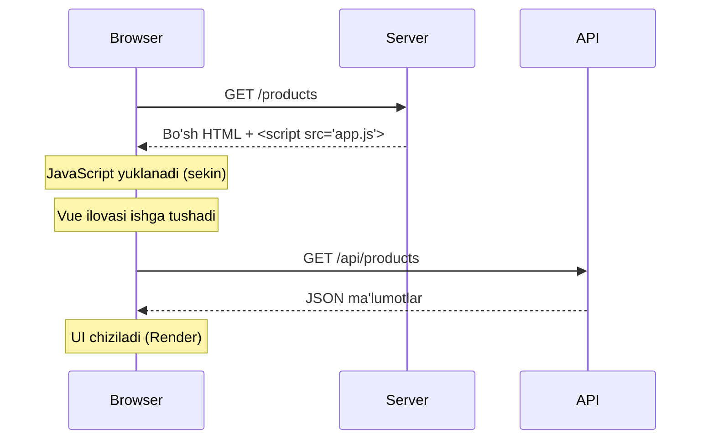

# SSR vs SSG vs CSR

Rendering strategiyalari web application'ning performance, SEO va user experience'ini belgilaydi. Nuxt.js barcha strategiyalarni qo'llab-quvvatlaydi va hybrid yondashuv imkonini beradi.

## Nazariya

> [!IMPORTANT]
> **Nima uchun muhim?**  
> Oddiy Vue (yoki React) dagi eng katta muammo bu SEO (Qidiruv tizimi optimizatsiyasi) va Birinchi Ekranning yuklanish tezligi (FCP) hisoblanadi. Chunki server mijozga shunchaki "bo'sh oq varaq" jo'natadi, qolgan hamma narsani brauzerning o'zi yuklab chizishi kerak. Bunga CSR deyiladi. SSR va SSG esa "oq varaq" o'rniga "tayyor chizilgan rasm" ni yuborish texnologiyalaridir. Qachon va qayerda qaysi birini ishlatishni bilish - Nuxt mutaxassisining asosiy belgisidir.

> [!NOTE]
> **Real-hayot analogiyasi: "Restoranda Ovqatlanish (Rendering)"**  
> - **CSR (Client-Side Rendering):** Siz restoranga bordingiz. Ofitsiant sizga bo'sh idish (Bo'sh HTML), xom go'sht, sabzavotlar (JSON Data) va retsept kitobi (JS fayllar) olib keldi. O'tirib o'zingiz ovqatni pishirasiz (Brauzerda chizish). **Kamchiligi:** Ko'p vaqt va kuch ketadi, lekin bir marta pishirgach, qolgan hamma narsani stolda hal qilaverasiz (Tez navigatsiya).
> - **SSR (Server-Side Rendering):** Siz restoranga bordingiz. Oshpaz (Server) oshxonada siz istagan ovqatni to'liq pishirdi va tayyor holda (HTML) oldingizga olib keldi. **Afzalligi:** Darhol yeysiz (Tez ko'rinadi). **Kamchiligi:** Har safar yangi ovqat (yangi Page) xohlaganda oshxonada pishishini kutasiz.
> - **SSG (Static Site Generation):** Siz restoranga kelguningizcha hamma ovqatlar allaqachon pishirib muzlatgichga (CDN) taxlab qo'yilgan. Siz so'rashingiz bilan tayyorini berishadi. **Afzalligi:** Eng tezi va arzonga tushadigani. **Kamchiligi:** Ovqat tez-tez o'zgarib turmaydi (Statik).

### Rendering Nima?

Rendering - bu JavaScript/Vue kodni HTML'ga aylantiirish jarayoni. Bu jarayon **qayerda** va **qachon** sodir bo'lishi rendering strategiyasini belgilaydi.



### Client-Side Rendering (CSR)

CSR - bu an'anaviy SPA (Single Page Application) yondashuvi. Server bo'sh HTML yuboradi, JavaScript browser'da HTML'ni yaratadi.



**Timeline:**

```
0ms     200ms    500ms    1000ms   1500ms   2000ms
|--------|--------|--------|--------|--------|
|← HTML →|
         |←─── JS Download ──→|
                               |← Vue Mount →|
                                              |← API Call + Render →|
                                                                    [FCP]
```

### Server-Side Rendering (SSR)

SSR - har bir request uchun server'da HTML generatsiya qilinadi.

```
┌─────────────────────────────────────────────────────────────┐
│                    SSR Flow                                  │
└─────────────────────────────────────────────────────────────┘

1. Browser → Nuxt Server: GET /products

2. Nuxt Server:
   - Vue componentlarni renderlaуdi
   - API'dan data oladi
   - To'liq HTML yaratadi

3. Nuxt Server → Browser:
   ┌──────────────────────────────────┐
   │ <!DOCTYPE html>                  │
   │ <html>                           │
   │   <body>                         │
   │     <div id="app">               │
   │       <h1>Products</h1>          │  ← To'liq content
   │       <div class="product">      │
   │         MacBook Pro - $2000      │
   │       </div>                     │
   │     </div>                       │
   │     <script src="app.js"/>       │
   │     <script>                     │
   │       window.__NUXT__ = {...}    │  ← Hydration data
   │     </script>                    │
   │   </body>                        │
   │ </html>                          │
   └──────────────────────────────────┘

4. Browser: HTML darhol ko'rinadi (FCP)

5. Browser: JavaScript yuklanadi

6. Browser: Hydration - interaktiv bo'ladi
```

**Timeline:**

```
0ms     200ms    500ms    800ms    1200ms
|--------|--------|--------|--------|
|←─ Server Render + Response ─→|
                                [FCP]
         |←── JS Download ──→|
                              |← Hydration →|
                                            [TTI]
```

### Static Site Generation (SSG)

SSG - barcha sahifalar build vaqtida HTML'ga aylantiriladi.

```
┌─────────────────────────────────────────────────────────────┐
│                    SSG Flow                                  │
└─────────────────────────────────────────────────────────────┘

BUILD TIME (npm run generate):
┌─────────────────────────────────────┐
│ Nuxt Build Process                  │
├─────────────────────────────────────┤
│                                     │
│  pages/index.vue  → index.html      │
│  pages/about.vue  → about.html      │
│  pages/products/                    │
│    index.vue      → products.html   │
│    [id].vue       → products/1.html │
│                   → products/2.html │
│                   → products/3.html │
│                                     │
│  API calls: Build vaqtida           │
│                                     │
└─────────────────────────────────────┘
                    ↓
            .output/public/
                    ↓
              Deploy to CDN

RUNTIME:
┌─────────────────────────────────────┐
│                                     │
│  Browser → CDN: GET /products       │
│                                     │
│  CDN → Browser: products.html       │
│                                     │
│  (Server computation yo'q!)         │
│                                     │
└─────────────────────────────────────┘
```

### Incremental Static Regeneration (ISR)

ISR - SSG'ning yangilangan versiyasi. Sahifalar background'da qayta generatsiya qilinadi.

```
┌─────────────────────────────────────────────────────────────┐
│                    ISR Flow                                  │
└─────────────────────────────────────────────────────────────┘

1. Birinchi request: Cached HTML qaytariladi

2. TTL (Time-To-Live) o'tgandan keyin:
   - Eski HTML qaytariladi (stale)
   - Background'da yangi HTML generatsiya qilinadi
   - Keyingi request yangi HTML oladi

   ┌───────────────────────────────────────────────────┐
   │  Time: 0      60s        120s       180s          │
   │  │────────────│──────────│──────────│             │
   │  [Build]      [Stale]    [Regen]    [Fresh]       │
   │   ↓            ↓          ↓          ↓            │
   │  v1.html     v1.html    v1→v2     v2.html        │
   │               (serve)   (background)              │
   └───────────────────────────────────────────────────┘
```

## Nuxt.js'da Rendering Konfiguratsiyasi

### Global SSR (default)

```typescript
// nuxt.config.ts
export default defineNuxtConfig({
  // SSR yoqilgan (default)
  ssr: true
})
```

### Global CSR (SPA Mode)

```typescript
// nuxt.config.ts
export default defineNuxtConfig({
  // Butun app CSR
  ssr: false
})
```

### Static Generation (SSG)

```typescript
// nuxt.config.ts
export default defineNuxtConfig({
  // Pre-render all routes
  nitro: {
    prerender: {
      routes: ['/'],
      crawlLinks: true
    }
  }
})

// Build command:
// npm run generate
```

### Route-Level Configuration

```typescript
// nuxt.config.ts
export default defineNuxtConfig({
  routeRules: {
    // SSG - build vaqtida render
    '/': { prerender: true },
    '/about': { prerender: true },

    // SSR - har request'da render
    '/dashboard/**': { ssr: true },

    // CSR - faqat client'da render
    '/admin/**': { ssr: false },

    // ISR - cache + background revalidation
    '/products/**': {
      isr: 60, // 60 sekund cache
      prerender: true
    },

    // SWR - stale-while-revalidate
    '/api/products': {
      swr: 3600, // 1 soat
      headers: { 'cache-control': 'public, max-age=3600' }
    },

    // Static assets
    '/images/**': {
      headers: { 'cache-control': 'public, max-age=31536000' }
    }
  }
})
```

### Page-Level Configuration

```vue
<!-- pages/admin/index.vue -->
<script setup>
// Bu sahifa faqat CSR
defineRouteRules({
  ssr: false
})
</script>

<!-- pages/products/[id].vue -->
<script setup>
// ISR - 1 daqiqada yangilanadi
defineRouteRules({
  isr: 60
})
</script>
```

## Kod Misollari

### To'g'ri: Hybrid Rendering

```typescript
// nuxt.config.ts
export default defineNuxtConfig({
  routeRules: {
    // Marketing sahifalari - SSG (tez, SEO)
    '/': { prerender: true },
    '/about': { prerender: true },
    '/pricing': { prerender: true },
    '/blog/**': { prerender: true },

    // E-commerce - ISR (yangilanishi kerak)
    '/products': { isr: 300 }, // 5 daqiqa
    '/products/**': { isr: 3600 }, // 1 soat

    // User dashboard - SSR (personalized)
    '/dashboard/**': { ssr: true },
    '/profile/**': { ssr: true },

    // Admin panel - CSR (SEO kerak emas)
    '/admin/**': { ssr: false },

    // API routes - cache
    '/api/products': { swr: 600 },
    '/api/categories': { swr: 3600 }
  }
})
```

### To'g'ri: Data Fetching Strategiyalari

```vue
<!-- pages/products/index.vue -->
<script setup lang="ts">
interface Product {
  id: number
  name: string
  price: number
}

// SSR/SSG uchun - server'da execute bo'ladi
const { data: products, error } = await useFetch<Product[]>('/api/products', {
  // Cache key
  key: 'products-list',

  // Transform response
  transform: (data) => data.slice(0, 20),

  // Cache on client
  getCachedData(key, nuxtApp) {
    return nuxtApp.payload.data[key] || nuxtApp.static.data[key]
  }
})

// Error handling
if (error.value) {
  throw createError({
    statusCode: 500,
    statusMessage: 'Failed to load products'
  })
}
</script>

<template>
  <div>
    <h1>Products</h1>
    <div v-for="product in products" :key="product.id">
      {{ product.name }} - ${{ product.price }}
    </div>
  </div>
</template>
```

### To'g'ri: CSR uchun Lazy Loading

```vue
<!-- pages/admin/dashboard.vue -->
<script setup lang="ts">
// Bu sahifa CSR (ssr: false)
defineRouteRules({
  ssr: false
})

// Client-side only data fetching
const { data: stats, pending, refresh } = await useFetch('/api/admin/stats', {
  // Faqat client'da
  server: false,

  // Auto-refresh
  watch: false
})

// Manual refresh
const refreshStats = () => {
  refresh()
}

// Periodic refresh
onMounted(() => {
  const interval = setInterval(refresh, 30000) // 30 sekund
  onUnmounted(() => clearInterval(interval))
})
</script>

<template>
  <div>
    <h1>Admin Dashboard</h1>

    <button @click="refreshStats">Refresh</button>

    <div v-if="pending">Loading...</div>
    <div v-else-if="stats">
      <p>Total Users: {{ stats.users }}</p>
      <p>Total Orders: {{ stats.orders }}</p>
    </div>
  </div>
</template>
```

### Noto'g'ri: Rendering Strategy Xatolari

```vue
<!-- NOTO'G'RI: SSR sahifada window ishlatish -->
<script setup>
// Bu SSR'da crash qiladi!
const width = window.innerWidth // ReferenceError: window is not defined
</script>

<!-- TO'G'RI: Client-side check -->
<script setup>
import { ref, onMounted } from 'vue'

const width = ref(0)

// onMounted faqat client'da ishlaydi
onMounted(() => {
  width.value = window.innerWidth
})

// Yoki process.client tekshiruvi
if (process.client) {
  // Client-only code
}
</script>
```

```vue
<!-- NOTO'G'RI: SSG sahifada dinamik data -->
<script setup>
// Bu build vaqtida fetch qilinadi - eskirgan data!
const { data } = await useFetch('/api/live-prices')
</script>

<!-- TO'G'RI: ISR yoki SSR ishlatish -->
<script setup>
// ISR - har 1 daqiqada yangilanadi
defineRouteRules({
  isr: 60
})

const { data } = await useFetch('/api/live-prices')
</script>
```

```vue
<!-- NOTO'G'RI: Barcha sahifalarni SSR qilish -->
<script setup>
// Admin dashboard SSR - kerak emas, sekinlashtiradi
</script>

<!-- TO'G'RI: Admin uchun CSR -->
<script setup>
defineRouteRules({
  ssr: false
})
</script>
```

```typescript
// NOTO'G'RI: Har route uchun prerender
// nuxt.config.ts
export default defineNuxtConfig({
  nitro: {
    prerender: {
      routes: ['/users/1', '/users/2', ...] // 10000 user = 10000 html
    }
  }
})

// TO'G'RI: Dynamic routes uchun SSR/ISR
export default defineNuxtConfig({
  routeRules: {
    '/users/**': { isr: 3600 } // On-demand generation
  }
})
```

### To'g'ri: Environment-Aware Rendering

```vue
<!-- components/ClientOnlyChart.vue -->
<template>
  <!-- ClientOnly wrapper - faqat client'da renderlanadi -->
  <ClientOnly>
    <Chart :data="chartData" />

    <template #fallback>
      <!-- SSR'da ko'rinadigan placeholder -->
      <div class="chart-placeholder">
        Loading chart...
      </div>
    </template>
  </ClientOnly>
</template>

<script setup>
// Chart library client-only import
const Chart = defineAsyncComponent(() => import('chart.js'))

const chartData = ref([])
</script>
```

```vue
<!-- pages/map.vue -->
<script setup>
// Leaflet - client-only library
const MapComponent = defineAsyncComponent({
  loader: () => import('~/components/MapView.vue'),
  loadingComponent: () => h('div', 'Loading map...'),
  // SSR'da import qilinmaydi
  ssr: false
})
</script>

<template>
  <ClientOnly>
    <MapComponent :center="[41.311, 69.279]" />
  </ClientOnly>
</template>
```

## Real-World Cases

### Case 1: E-Commerce Platform

```typescript
// nuxt.config.ts
export default defineNuxtConfig({
  routeRules: {
    // Home - ISR, 5 daqiqa (featured products o'zgaradi)
    '/': { isr: 300 },

    // Category pages - ISR, 1 soat
    '/category/**': { isr: 3600 },

    // Product pages - ISR, 15 daqiqa (narx, stock)
    '/product/**': { isr: 900 },

    // Search - SSR (real-time results)
    '/search': { ssr: true },

    // Cart, Checkout - CSR (user-specific, no SEO)
    '/cart': { ssr: false },
    '/checkout/**': { ssr: false },

    // User account - CSR
    '/account/**': { ssr: false },

    // Static pages - SSG
    '/about': { prerender: true },
    '/contact': { prerender: true },
    '/terms': { prerender: true },

    // API cache
    '/api/products': { swr: 300 },
    '/api/categories': { swr: 3600 }
  }
})
```

**Sababi:**
- Product pages SEO uchun server-render kerak
- Cart/Checkout personalized - CSR yetarli
- Static pages o'zgarmaydi - SSG optimal

### Case 2: News Portal

```typescript
// nuxt.config.ts
export default defineNuxtConfig({
  routeRules: {
    // Home - ISR, 2 daqiqa (yangiliklar tez o'zgaradi)
    '/': { isr: 120 },

    // Breaking news - SSR (real-time)
    '/breaking/**': { ssr: true },

    // Article pages - ISR, 10 daqiqa
    '/article/**': { isr: 600 },

    // Category/Archive - ISR, 30 daqiqa
    '/category/**': { isr: 1800 },
    '/archive/**': { isr: 1800 },

    // Author pages - ISR, 1 soat
    '/author/**': { isr: 3600 },

    // Search - SSR
    '/search': { ssr: true },

    // User dashboard - CSR
    '/dashboard/**': { ssr: false },

    // Static
    '/about': { prerender: true },
    '/advertise': { prerender: true }
  }
})
```

### Case 3: SaaS Dashboard

```typescript
// nuxt.config.ts
export default defineNuxtConfig({
  routeRules: {
    // Marketing pages - SSG (maximum speed)
    '/': { prerender: true },
    '/features': { prerender: true },
    '/pricing': { prerender: true },
    '/blog/**': { prerender: true },

    // Documentation - SSG
    '/docs/**': { prerender: true },

    // Auth pages - SSR (SEO kerak emas, lekin SSR token check)
    '/login': { ssr: true },
    '/register': { ssr: true },

    // App/Dashboard - butunlay CSR
    '/app/**': { ssr: false },

    // API routes - no prerender
    '/api/**': { prerender: false }
  }
})
```

**Sababi:**
- Marketing pages tezlik uchun SSG
- Dashboard SEO kerak emas, CSR yetarli
- Complex state management CSR'da oson

### Case 4: Multi-Language Blog

```typescript
// nuxt.config.ts
export default defineNuxtConfig({
  routeRules: {
    // Home pages per language - SSG
    '/': { prerender: true },
    '/uz': { prerender: true },
    '/ru': { prerender: true },
    '/en': { prerender: true },

    // Blog posts - SSG with crawl
    '/uz/blog/**': { prerender: true },
    '/ru/blog/**': { prerender: true },
    '/en/blog/**': { prerender: true },

    // Dynamic pages - ISR
    '/*/author/**': { isr: 3600 },
    '/*/tag/**': { isr: 1800 }
  },

  nitro: {
    prerender: {
      crawlLinks: true, // Auto-discover pages
      routes: ['/', '/uz', '/ru', '/en']
    }
  }
})
```

## Performance Comparison

```
┌─────────────────────────────────────────────────────────────────────┐
│                    Performance Metrics                               │
├──────────────┬──────────┬──────────┬──────────┬──────────┬─────────┤
│ Metric       │   CSR    │   SSR    │   SSG    │   ISR    │  SWR    │
├──────────────┼──────────┼──────────┼──────────┼──────────┼─────────┤
│ TTFB         │ ~50ms    │ ~200ms+  │ ~20ms    │ ~20ms    │ ~20ms   │
│ FCP          │ ~1500ms  │ ~300ms   │ ~100ms   │ ~100ms   │ ~100ms  │
│ TTI          │ ~2000ms  │ ~800ms   │ ~500ms   │ ~500ms   │ ~500ms  │
│ Server Load  │ Low      │ High     │ None     │ Low      │ Low     │
│ Build Time   │ Fast     │ Fast     │ Slow*    │ Medium   │ Medium  │
│ Data Fresh   │ Always   │ Always   │ Stale    │ Interval │ Interval│
│ SEO          │ Poor     │ Good     │ Good     │ Good     │ Good    │
└──────────────┴──────────┴──────────┴──────────┴──────────┴─────────┘

* SSG build time sahifalar soniga bog'liq
```

## Decision Matrix

```
┌─────────────────────────────────────────────────────────────────────┐
│                    Qaysi Strategiyani Tanlash?                       │
├─────────────────────────────────────────────────────────────────────┤
│                                                                      │
│  SEO kerakmi?                                                        │
│  │                                                                   │
│  ├─► Ha ──► Data qanchalik tez o'zgaradi?                           │
│  │          │                                                        │
│  │          ├─► Real-time (seconds) ──────► SSR                      │
│  │          ├─► Tez-tez (minutes) ────────► ISR (short TTL)         │
│  │          ├─► Vaqti-vaqti (hours) ──────► ISR (long TTL)          │
│  │          └─► Kam (days/weeks) ─────────► SSG                      │
│  │                                                                   │
│  └─► Yo'q ──► User-specific content?                                │
│               │                                                      │
│               ├─► Ha ──────────────────────► CSR                     │
│               └─► Yo'q ─► Internal tool? ──► CSR                     │
│                                                                      │
└─────────────────────────────────────────────────────────────────────┘
```

### Quick Reference

| Sahifa turi | Strategiya | Sabab |
|-------------|------------|-------|
| Landing page | SSG | O'zgarmaydi, SEO muhim |
| Blog post | SSG/ISR | Kam o'zgaradi, SEO muhim |
| Product page | ISR | Narx/stock o'zgaradi |
| Search results | SSR | Real-time, SEO kerak |
| User dashboard | CSR | Personalized, SEO kerak emas |
| Admin panel | CSR | Internal, SEO kerak emas |
| News article | ISR | Tez-tez yangilanadi |
| Documentation | SSG | Kam o'zgaradi |

## Interview Savollari

### Savol 1: SSR va SSG farqi nima? Qachon qaysi birini tanlaysiz?

**Javob:**

**SSR (Server-Side Rendering):**
- Har request uchun server'da HTML generatsiya qilinadi
- Data doim fresh
- Server load yuqori
- Dynamic content uchun mos

**SSG (Static Site Generation):**
- Build vaqtida barcha HTML generatsiya qilinadi
- CDN'dan serve qilinadi - juda tez
- Server load yo'q
- Static content uchun mos

**Tanlov:**
- Blog, documentation, marketing pages → SSG
- E-commerce (real-time inventory), search results → SSR
- ISR ikkalasining afzalliklarini birlashtiradi

### Savol 2: ISR (Incremental Static Regeneration) qanday ishlaydi?

**Javob:**

ISR SSG'ning "on-demand" versiyasi:

1. **Birinchi request:** Agar cache'da bo'lsa - qaytariladi, bo'lmasa - generatsiya qilinib cache'lanadi
2. **TTL davomida:** Cache'dan serve qilinadi
3. **TTL tugagandan keyin:** Eski HTML qaytariladi (stale), background'da yangi versiya generatsiya qilinadi
4. **Keyingi request:** Yangi HTML qaytariladi

```typescript
// Nuxt'da ISR
defineRouteRules({
  isr: 60 // 60 sekund cache, keyin revalidate
})
```

Afzalliklari:
- SSG tezligi + SSR freshnessi
- Server load minimal
- Build time qisqa (on-demand)

### Savol 3: CSR'ning SEO muammosi nima? Qanday yechiladi?

**Javob:**

**Muammo:**
- Search engine crawlers JavaScript'ni to'liq execute qilmasligi mumkin
- Bo'sh HTML ko'radi - indexlamaслик
- Social media preview'lar ishlamaydi

**Dalil:**
```html
<!-- CSR HTML -->
<body>
  <div id="app"></div>  <!-- Crawler bu ni ko'radi -->
  <script src="app.js"></script>
</body>
```

**Yechimlar:**
1. **SSR/SSG** - server'da render qilish
2. **Prerendering** - static HTML + hydration
3. **Dynamic rendering** - crawler uchun SSR, user uchun CSR

```typescript
// Nuxt'da hybrid
routeRules: {
  '/public/**': { prerender: true }, // SEO kerak
  '/app/**': { ssr: false }          // CSR - internal
}
```

### Savol 4: Hydration muammolari SSR'da qanday sodir bo'ladi?

**Javob:**

Hydration - server HTML'ni client'da interaktiv qilish jarayoni.

**Muammolar:**
1. **Mismatch** - server va client HTML'i farq qiladi
2. **Performance** - katta app'larda sekin
3. **Memory** - virtual DOM ikki marta yaratiladi

```vue
<!-- MUAMMO: Mismatch -->
<template>
  <!-- Server: "2024-01-01 10:00:00" -->
  <!-- Client: "2024-01-01 10:00:05" -->
  <span>{{ new Date().toISOString() }}</span>
</template>

<!-- YECHIM -->
<template>
  <ClientOnly>
    <span>{{ currentTime }}</span>
  </ClientOnly>
</template>
```

### Savol 5: Production'da rendering strategiyasini qanday monitoring qilasiz?

**Javob:**

```typescript
// 1. Performance monitoring
export default defineNuxtPlugin(() => {
  if (process.client) {
    // Core Web Vitals
    const observer = new PerformanceObserver((list) => {
      for (const entry of list.getEntries()) {
        // Send to analytics
        console.log(entry.name, entry.startTime)
      }
    })
    observer.observe({ entryTypes: ['paint', 'largest-contentful-paint'] })
  }
})

// 2. Server metrics (Nuxt server plugin)
// server/plugins/metrics.ts
export default defineNitroPlugin((nitro) => {
  nitro.hooks.hook('render:response', (response, { event }) => {
    const renderTime = Date.now() - event.context.startTime
    // Log or send to monitoring
  })
})

// 3. Route-level analytics
// middleware/analytics.global.ts
export default defineNuxtRouteMiddleware((to) => {
  if (process.client) {
    // Track navigation timing
  }
})
```

**Muhim metriklar:**
- TTFB (Time to First Byte) - server response time
- FCP (First Contentful Paint) - birinchi content
- TTI (Time to Interactive) - interaktiv bo'lish
- Cache hit ratio - ISR/SWR uchun

## Best Practices

### 1. Har Sahifa Uchun To'g'ri Strategiya

```typescript
// nuxt.config.ts
export default defineNuxtConfig({
  routeRules: {
    // Aniq belgilang - default'ga ishonmang
    '/': { prerender: true },
    '/blog/**': { isr: 3600 },
    '/dashboard/**': { ssr: false }
  }
})
```

### 2. Data Fetching Strategiyalarini Moslash

```vue
<script setup>
// SSG/SSR uchun
const { data } = await useFetch('/api/data')

// CSR uchun (ssr: false sahifada)
const { data } = await useFetch('/api/data', { server: false })

// Lazy loading (navigatsiyadan keyin)
const { data, pending } = await useLazyFetch('/api/data')
</script>
```

### 3. Client-Only Componentlar

```vue
<template>
  <!-- Heavy libraries client'da -->
  <ClientOnly>
    <ChartComponent />
    <template #fallback>
      <div class="skeleton">Loading...</div>
    </template>
  </ClientOnly>
</template>
```

### 4. Caching Strategiyasi

```typescript
// API routes uchun cache headers
// server/api/products.ts
export default defineEventHandler(async (event) => {
  // Cache 5 daqiqa
  setResponseHeaders(event, {
    'Cache-Control': 'public, max-age=300, s-maxage=300'
  })

  return await getProducts()
})
```

### 5. Error Handling

```vue
<script setup>
const { data, error } = await useFetch('/api/data')

// Graceful degradation
if (error.value) {
  if (process.server) {
    // SSR'da - 500 yoki cached version
    throw createError({ statusCode: 500 })
  } else {
    // Client'da - fallback UI
  }
}
</script>
```

### 6. Build Optimization

```typescript
// nuxt.config.ts
export default defineNuxtConfig({
  nitro: {
    prerender: {
      // Parallel rendering
      concurrency: 4,

      // Timeout
      timeout: 60000,

      // Ignore failing routes
      failOnError: false
    }
  }
})
```

## Eng Yaxshi Amaliyotlar (Best Practices)

1. **Gibrid Yondashuv (Route Rules):** Butun loyihani bitta qoida bilan qotirib qo'ymang. Admin panel uchun har doim `ssr: false` (CSR), Landing page'lar va blog uchun `prerender: true` (SSG), tez o'zgaradigan E-commerce sahifalari uchun esa SSR yoki ISR (`swr`) ishlating.
2. **Server/Client contextni biling:** Komponentingiz ichida `window` yoki `localStorage` chaqirgan bo'lsangiz va fayl SSR da ishlayotgan bo'lsa darhol XATO (500) olasiz. Bunga qarshi `onMounted` hook'idan foydalaning (u faqat Clientda ishlaydi).
3. **Hydration Mismatch:** Serverda tayyorlangan HTML bilan mijozdagi HTML bir xil bo'lishi shart (Hydration). Ularda turli xil qiymatlar chiqaradigan xatolar (masalan, `Math.random()` yoki sanalar) ishlatishdan qoching.

---

## Xulosa

Rendering strategiyasi tanlash murakkab qaror - bitta "eng yaxshi" yechim yo'q. Har bir sahifa turi uchun alohida strategiya tanlab, hybrid approach qo'llang. Nuxt.js'ning `routeRules` bu imkoniyatni osonlashtiradi.

**Eslab qoling:**
- SSG = Tezlik + SEO (static content)
- SSR = Freshness + SEO (dynamic content)
- CSR = Interaktivlik (user-specific)
- ISR = SSG tezligi + SSR freshnessi
