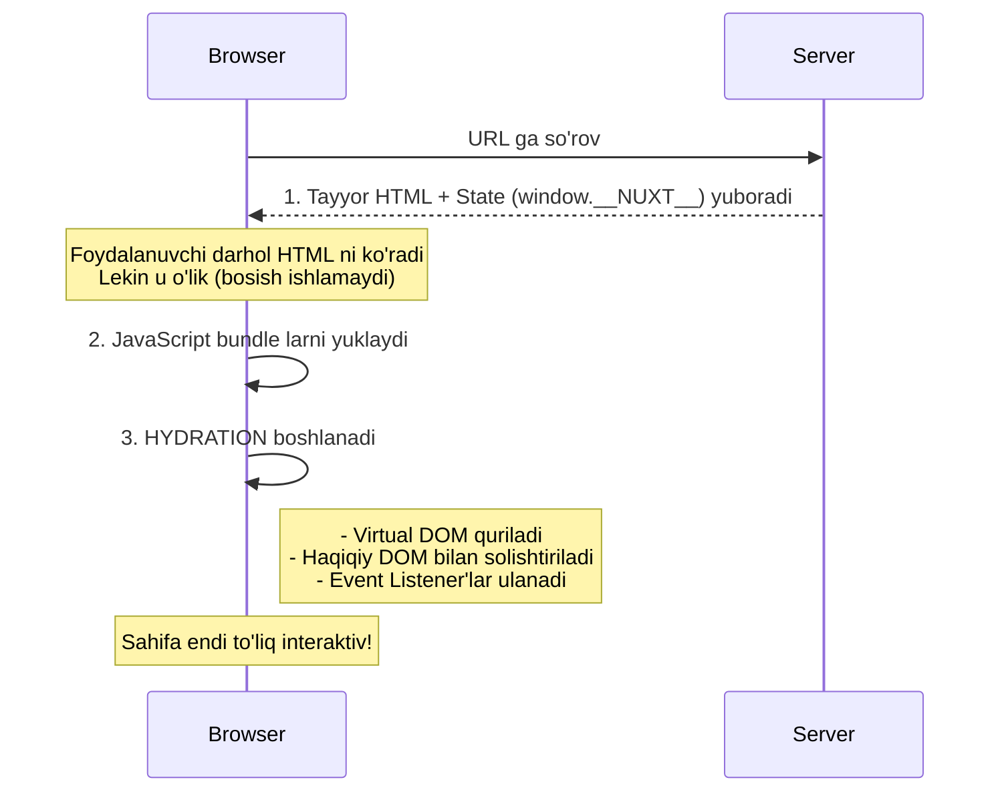

# Hydration

Hydration - bu SSR'da server tomonidan yaratilgan statik HTML'ni client'da interaktiv Vue application'ga aylantirish jarayoni. Bu jarayon to'g'ri tushunilmasa, performance muammolari va buglar kelib chiqadi.

## Nazariya

> [!IMPORTANT]
> **Nima uchun muhim?**  
> Agar siz "Hydration Mismatch" degan yashil/qizil xatoni ko'rgan bo'lsangiz, demak bu bo'lim aynan siz uchun. Hydration - Nuxt yoki Next.js dagi eng sehrli, shu bilan birga eng asabni buzadigan jarayon. Server chizib bergan o'lik HTML sahifani "tiriltirish" (Reactivity va Event Listenerlarni ulash) amaliyotini Hydration deb ataymiz. Buni tushunmaslik "Nega DOM taglarim takrorlanib qolyapti?" degan savolni tug'diradi.

> [!NOTE]
> **Real-hayot analogiyasi: "Skelet va Ruh (Jon berish)"**  
> - **Server:** Shifokor odamning suyaklari va terisini qotirib bitta "Skelet" yasadi va yubordi. Bu **Static HTML** (u o'lik, bossangiz hech narsa qilmaydi, faqat ko'rinishi odamga o'xshaydi).
> - **Brauzer:** Bu skeletni darhol mijozga ko'rsatadi (FCP zo'r!).
> - **Hydration:** Endi "Ruh" uchib keladi (JavaScript) va bu skeletning har bir uzvini tanib chiqib, qon yugurtiradi (Event Listeners ulaydi). Shundan keyingina u qo'lini qimirlata oladigan haqiqiy insonga aylanadi.
> **Hydration Mismatch:** Agar server "O'ng qo'li tepada bo'lsin" deb skelet yasagan bo'lsa-yu, ruh uchib kelib "Yo'q, o'ng qo'l pastda bo'lishi kerak" deb tortishsa, "Hydration Mismatch" xatosi kelib chiqadi. Ikkalasi bir xil narsani ko'rishi shart.

### Hydration Nima?

Hydration - "suv qo'shish" degan ma'noni anglatadi. Server'dan kelgan "quruq" HTML'ga JavaScript "suv qo'shib" uni jonli qilish.



### Hydration vs Re-render

```
HYDRATION (to'g'ri):
┌──────────────────────────────────────────────────────────┐
│                                                           │
│  Server HTML:    <button>Count: 0</button>               │
│                         │                                 │
│                         ▼ (reuse)                         │
│  After Hydration: <button>Count: 0</button>              │
│                   └── onClick attached                   │
│                   └── reactive binding                   │
│                                                           │
│  DOM element SAQLANADI, faqat behavior qo'shiladi        │
│                                                           │
└──────────────────────────────────────────────────────────┘

RE-RENDER (noto'g'ri - mismatch bo'lganda):
┌──────────────────────────────────────────────────────────┐
│                                                           │
│  Server HTML:    <button>Count: 0</button>               │
│                         │                                 │
│                         ▼ (destroy)                       │
│                                                           │
│  Client creates: <button>Count: 1</button>               │
│                                                           │
│  Yangi DOM element yaratiladi - SEKIN, FLASH              │
│                                                           │
└──────────────────────────────────────────────────────────┘
```

### Nuxt Hydration Ma'lumotlari

Nuxt server'dan client'ga quyidagi ma'lumotlarni uzatadi:

```html
<!-- Server response -->
<script>
  window.__NUXT__ = {
    // Fetch qilingan data
    data: {
      'products-list': [{ id: 1, name: 'MacBook' }]
    },

    // State (useState)
    state: {
      'user': { id: 1, name: 'John' }
    },

    // Error state
    error: null,

    // Server timestamp
    serverRendered: true,

    // Config
    config: {
      public: { apiBase: 'https://api.example.com' }
    }
  }
</script>
```

## Hydration Muammolari

### 1. Hydration Mismatch

Eng keng tarqalgan muammo - server va client HTML'i farq qilganda.

```
SERVER:                          CLIENT:
┌─────────────────────┐         ┌─────────────────────┐
│ <span>              │         │ <span>              │
│   10:30:00          │   ≠     │   10:30:05          │
│ </span>             │         │ </span>             │
└─────────────────────┘         └─────────────────────┘
                │                         │
                └────────┬────────────────┘
                         │
                    MISMATCH!
                         │
                         ▼
        ⚠️ Hydration text content mismatch
```

**Sabablari:**
- Vaqt (Date)
- Random qiymatlar
- Browser-specific API (localStorage, window)
- User-specific data

### 2. Double Fetch

Data server'da ham, client'da ham fetch qilinadi.

```
Timeline:
0ms      100ms     300ms     500ms     800ms
|---------|---------|---------|---------|
|← Server Fetch →|
        |← HTML Response →|
                  |← JS Load →|
                          |← Client Fetch (TAKROR!) →|
```

### 3. Layout Shift

Hydration paytida content joylashuvi o'zgaradi.

```
BEFORE HYDRATION:           AFTER HYDRATION:
┌─────────────────────┐    ┌─────────────────────┐
│ ████████████████████│    │ ████████████████████│
│                     │    │                     │
│ Loading...          │ →  │ ┌─────────────────┐ │
│                     │    │ │ Actual Content  │ │
│                     │    │ │ with real data  │ │
│                     │    │ └─────────────────┘ │
└─────────────────────┘    └─────────────────────┘
       ↑ SHIFT!
```

## Kod Misollari

### Mismatch Xatolari va Yechimlari

```vue
<!-- NOTO'G'RI: Server va client farq qiladi -->
<template>
  <div>
    <!-- Har safar farq qiladi -->
    <span>{{ Math.random() }}</span>

    <!-- Server: "2024-01-01 10:00:00", Client: "2024-01-01 10:00:05" -->
    <span>{{ new Date().toISOString() }}</span>

    <!-- Server'da mavjud emas -->
    <span>{{ window.innerWidth }}</span>

    <!-- Server'da localStorage yo'q -->
    <span>{{ localStorage.getItem('theme') }}</span>
  </div>
</template>

<!-- TO'G'RI: ClientOnly wrapper -->
<template>
  <div>
    <!-- Client-only content -->
    <ClientOnly>
      <span>{{ Math.random() }}</span>
      <span>{{ currentTime }}</span>
      <span>{{ windowWidth }}</span>

      <template #fallback>
        <span class="skeleton">Loading...</span>
      </template>
    </ClientOnly>
  </div>
</template>

<script setup>
import { ref, onMounted } from 'vue'

const currentTime = ref('')
const windowWidth = ref(0)

onMounted(() => {
  currentTime.value = new Date().toISOString()
  windowWidth.value = window.innerWidth
})
</script>
```

### To'g'ri: Hydration-Safe State

```vue
<!-- pages/counter.vue -->
<script setup>
// NOTO'G'RI: ref() server'da 0, client'da localStorage'dan
// const count = ref(parseInt(localStorage.getItem('count') || '0'))

// TO'G'RI: useState - SSR-safe
const count = useState('count', () => 0)

// Client'da localStorage bilan sync
onMounted(() => {
  const saved = localStorage.getItem('count')
  if (saved) {
    count.value = parseInt(saved)
  }
})

watch(count, (val) => {
  if (process.client) {
    localStorage.setItem('count', String(val))
  }
})
</script>

<template>
  <div>
    <p>Count: {{ count }}</p>
    <button @click="count++">Increment</button>
  </div>
</template>
```

### To'g'ri: Data Fetching

```vue
<!-- pages/products.vue -->
<script setup>
// TO'G'RI: useFetch - server'da fetch, client'da reuse
const { data: products, pending, error } = await useFetch('/api/products', {
  // Unique key for hydration
  key: 'products-list',

  // Server'da fetch qilinadi, client'da cache'dan olinadi
  // Double fetch yo'q
})

// NOTO'G'RI: oddiy fetch - double fetch bo'ladi
// onMounted(async () => {
//   const res = await fetch('/api/products')
//   products.value = await res.json()
// })
</script>

<template>
  <div>
    <div v-if="pending">Loading...</div>
    <div v-else-if="error">Error: {{ error.message }}</div>
    <div v-else>
      <ProductCard v-for="p in products" :key="p.id" :product="p" />
    </div>
  </div>
</template>
```

### To'g'ri: Conditional Rendering

```vue
<!-- components/UserGreeting.vue -->
<script setup>
const user = useState('user')
const isClient = ref(false)

onMounted(() => {
  isClient.value = true
})
</script>

<template>
  <div>
    <!-- NOTO'G'RI: v-if condition server/client farq qiladi -->
    <!-- <div v-if="typeof window !== 'undefined'">Client only</div> -->

    <!-- TO'G'RI: Deterministic rendering -->
    <div v-if="user">
      Welcome, {{ user.name }}
    </div>
    <div v-else>
      Please log in
    </div>

    <!-- Client-only interactive elements -->
    <ClientOnly>
      <UserDropdown v-if="isClient" />
    </ClientOnly>
  </div>
</template>
```

### To'g'ri: Third-Party Libraries

```vue
<!-- components/ChartView.vue -->
<script setup>
// NOTO'G'RI: SSR'da import qilish
// import Chart from 'chart.js' // Server'da crash!

// TO'G'RI: Dynamic import
const ChartComponent = defineAsyncComponent(() =>
  import('chart.js').then(m => ({
    // Wrapper component
    setup(props) {
      // Chart logic
    },
    render() {
      return h('canvas', { ref: 'chart' })
    }
  }))
)

// Yoki shartli import
let Chart
if (process.client) {
  Chart = (await import('chart.js')).default
}
</script>

<template>
  <ClientOnly>
    <ChartComponent :data="chartData" />
    <template #fallback>
      <div class="chart-skeleton">
        Loading chart...
      </div>
    </template>
  </ClientOnly>
</template>
```

### To'g'ri: Teleport va Portals

```vue
<!-- components/Modal.vue -->
<script setup>
const isOpen = defineModel<boolean>()
const isMounted = ref(false)

// Teleport faqat client'da ishlaydi
onMounted(() => {
  isMounted.value = true
})
</script>

<template>
  <!-- Server'da teleport'siz render -->
  <template v-if="isOpen">
    <!-- Client'da teleport ishlaydi -->
    <Teleport v-if="isMounted" to="body">
      <div class="modal-overlay">
        <div class="modal-content">
          <slot />
        </div>
      </div>
    </Teleport>

    <!-- Server'da fallback -->
    <div v-else class="modal-ssr">
      <slot />
    </div>
  </template>
</template>
```

### To'g'ri: Environment Detection

```typescript
// composables/useEnvironment.ts
export function useEnvironment() {
  const isServer = computed(() => process.server)
  const isClient = computed(() => process.client)

  // Hydration-safe window check
  const windowWidth = ref(0)
  const windowHeight = ref(0)

  if (process.client) {
    windowWidth.value = window.innerWidth
    windowHeight.value = window.innerHeight

    // Resize listener
    const updateSize = () => {
      windowWidth.value = window.innerWidth
      windowHeight.value = window.innerHeight
    }

    onMounted(() => {
      window.addEventListener('resize', updateSize)
    })

    onUnmounted(() => {
      window.removeEventListener('resize', updateSize)
    })
  }

  // Browser detection (client-only)
  const browser = computed(() => {
    if (process.server) return 'unknown'

    const ua = navigator.userAgent
    if (ua.includes('Chrome')) return 'chrome'
    if (ua.includes('Firefox')) return 'firefox'
    if (ua.includes('Safari')) return 'safari'
    return 'other'
  })

  return {
    isServer,
    isClient,
    windowWidth: readonly(windowWidth),
    windowHeight: readonly(windowHeight),
    browser
  }
}
```

### Noto'g'ri Patterns va To'g'rilash

```vue
<!-- NOTO'G'RI: ID generation -->
<script setup>
// Server va client'da farq qiladi!
const id = `el-${Math.random().toString(36).slice(2)}`
</script>

<template>
  <div :id="id">Content</div>
</template>

<!-- TO'G'RI: useId() composable -->
<script setup>
// Nuxt'ning useId() - hydration-safe
const id = useId()
</script>

<template>
  <div :id="id">Content</div>
</template>
```

```vue
<!-- NOTO'G'RI: Async component initialization -->
<script setup>
// Server'da ishlaydi, client'da qayta ishlamaydi
const data = await fetchData()
</script>

<!-- TO'G'RI: Nuxt composables -->
<script setup>
// useFetch - bir marta fetch, payload orqali uzatiladi
const { data } = await useFetch('/api/data')

// Yoki useAsyncData
const { data } = await useAsyncData('my-data', () => fetchData())
</script>
```

```vue
<!-- NOTO'G'RI: Direct DOM manipulation -->
<script setup>
onMounted(() => {
  // Hydration tugamasdan oldin DOM o'zgartirish
  document.getElementById('app').innerHTML = 'Changed!'
})
</script>

<!-- TO'G'RI: Template refs va Vue reactivity -->
<script setup>
const content = ref('Changed!')
</script>

<template>
  <div>{{ content }}</div>
</template>
```

## Real-World Cases

### Case 1: E-Commerce Product Page

```vue
<!-- pages/product/[id].vue -->
<script setup>
const route = useRoute()

// Product data - SSR, hydration orqali client'ga
const { data: product, error } = await useFetch(
  `/api/products/${route.params.id}`,
  { key: `product-${route.params.id}` }
)

if (error.value) {
  throw createError({ statusCode: 404, message: 'Product not found' })
}

// Client-only state
const selectedVariant = ref(null)
const quantity = ref(1)

// Cart state - client'da localStorage bilan sync
const cartItems = useState<CartItem[]>('cart', () => [])

onMounted(() => {
  // Restore cart from localStorage
  const saved = localStorage.getItem('cart')
  if (saved) {
    cartItems.value = JSON.parse(saved)
  }
})

const addToCart = () => {
  const item = {
    productId: product.value.id,
    variantId: selectedVariant.value?.id,
    quantity: quantity.value
  }

  cartItems.value.push(item)
  localStorage.setItem('cart', JSON.stringify(cartItems.value))
}
</script>

<template>
  <div class="product-page">
    <!-- SSR content - SEO, fast FCP -->
    <div class="product-info">
      <h1>{{ product.name }}</h1>
      <p>{{ product.description }}</p>
      <span class="price">${{ product.price }}</span>
    </div>

    <!-- Client-only interactive elements -->
    <ClientOnly>
      <div class="product-actions">
        <!-- Variant selector -->
        <VariantSelector
          :variants="product.variants"
          v-model="selectedVariant"
        />

        <!-- Quantity -->
        <QuantityInput v-model="quantity" :max="product.stock" />

        <!-- Add to cart -->
        <button @click="addToCart" :disabled="!selectedVariant">
          Add to Cart ({{ cartItems.length }})
        </button>
      </div>

      <template #fallback>
        <div class="actions-skeleton">
          <div class="skeleton-button"></div>
          <div class="skeleton-button"></div>
        </div>
      </template>
    </ClientOnly>

    <!-- SSR content - more SEO -->
    <div class="product-details">
      <h2>Description</h2>
      <div v-html="product.longDescription"></div>
    </div>
  </div>
</template>
```

### Case 2: Real-Time Dashboard

```vue
<!-- pages/dashboard.vue -->
<script setup>
// Bu sahifa CSR - hydration kerak emas
defineRouteRules({
  ssr: false
})

// Auth check
const { user } = useAuth()
if (!user.value) {
  navigateTo('/login')
}

// Real-time data - faqat client'da
const { data: stats, refresh } = await useFetch('/api/dashboard/stats', {
  server: false // Client-only fetch
})

// WebSocket connection
let ws: WebSocket | null = null

onMounted(() => {
  ws = new WebSocket('wss://api.example.com/realtime')

  ws.onmessage = (event) => {
    const update = JSON.parse(event.data)
    // Update stats
  }
})

onUnmounted(() => {
  ws?.close()
})
</script>

<template>
  <div class="dashboard">
    <h1>Dashboard</h1>

    <div v-if="stats" class="stats-grid">
      <StatCard title="Users" :value="stats.users" />
      <StatCard title="Orders" :value="stats.orders" />
      <StatCard title="Revenue" :value="stats.revenue" />
    </div>

    <!-- Charts - client-only library -->
    <RevenueChart :data="stats?.revenueHistory" />
  </div>
</template>
```

### Case 3: Blog with Comments

```vue
<!-- pages/blog/[slug].vue -->
<script setup>
const route = useRoute()

// Article - SSR (SEO)
const { data: article } = await useFetch(
  `/api/blog/${route.params.slug}`,
  { key: `blog-${route.params.slug}` }
)

// Comments - client-only (personalized, real-time)
const { data: comments, refresh: refreshComments } = await useFetch(
  `/api/blog/${route.params.slug}/comments`,
  {
    key: `comments-${route.params.slug}`,
    server: false, // Client-only
    lazy: true // Load after page
  }
)

// Comment form state
const newComment = ref('')
const isSubmitting = ref(false)

const submitComment = async () => {
  if (!newComment.value.trim()) return

  isSubmitting.value = true
  try {
    await $fetch(`/api/blog/${route.params.slug}/comments`, {
      method: 'POST',
      body: { content: newComment.value }
    })
    newComment.value = ''
    await refreshComments()
  } finally {
    isSubmitting.value = false
  }
}
</script>

<template>
  <article class="blog-post">
    <!-- SSR - SEO critical -->
    <header>
      <h1>{{ article.title }}</h1>
      <time :datetime="article.publishedAt">
        {{ formatDate(article.publishedAt) }}
      </time>
    </header>

    <div class="content" v-html="article.content"></div>

    <!-- Comments - below fold, client-only -->
    <section class="comments">
      <h2>Comments</h2>

      <ClientOnly>
        <!-- Comment form -->
        <form @submit.prevent="submitComment" class="comment-form">
          <textarea
            v-model="newComment"
            placeholder="Write a comment..."
            :disabled="isSubmitting"
          ></textarea>
          <button type="submit" :disabled="isSubmitting">
            {{ isSubmitting ? 'Posting...' : 'Post Comment' }}
          </button>
        </form>

        <!-- Comments list -->
        <div v-if="comments" class="comments-list">
          <CommentCard
            v-for="comment in comments"
            :key="comment.id"
            :comment="comment"
          />
        </div>

        <template #fallback>
          <div class="comments-loading">Loading comments...</div>
        </template>
      </ClientOnly>
    </section>
  </article>
</template>
```

### Case 4: Theme Switching

```typescript
// composables/useTheme.ts
export function useTheme() {
  // Server'da default, client'da localStorage/system preference
  const theme = useState<'light' | 'dark'>('theme', () => 'light')
  const isHydrated = ref(false)

  if (process.client) {
    onMounted(() => {
      // Read preference after hydration
      const saved = localStorage.getItem('theme')
      if (saved) {
        theme.value = saved as 'light' | 'dark'
      } else if (window.matchMedia('(prefers-color-scheme: dark)').matches) {
        theme.value = 'dark'
      }

      // Apply to document
      document.documentElement.classList.toggle('dark', theme.value === 'dark')
      isHydrated.value = true
    })

    // Watch changes
    watch(theme, (val) => {
      localStorage.setItem('theme', val)
      document.documentElement.classList.toggle('dark', val === 'dark')
    })
  }

  const toggle = () => {
    theme.value = theme.value === 'light' ? 'dark' : 'light'
  }

  return {
    theme: readonly(theme),
    isHydrated: readonly(isHydrated),
    toggle
  }
}
```

```vue
<!-- components/ThemeToggle.vue -->
<script setup>
const { theme, isHydrated, toggle } = useTheme()
</script>

<template>
  <!-- Prevent flash - show only after hydration -->
  <button
    @click="toggle"
    :class="{ 'opacity-0': !isHydrated }"
    class="theme-toggle"
  >
    <span v-if="theme === 'light'">🌙</span>
    <span v-else>☀️</span>
  </button>
</template>

<style>
/* SSR'da flash prevention */
.theme-toggle {
  transition: opacity 0.2s;
}
</style>
```

## Performance Optimization

### 1. Selective Hydration

```vue
<!-- components/HeavyComponent.vue -->
<script setup>
// Lazy hydration - hydrate when visible
const isVisible = ref(false)

const observer = new IntersectionObserver((entries) => {
  if (entries[0].isIntersecting) {
    isVisible.value = true
    observer.disconnect()
  }
})

const el = ref<HTMLElement>()

onMounted(() => {
  if (el.value) {
    observer.observe(el.value)
  }
})
</script>

<template>
  <div ref="el">
    <template v-if="isVisible">
      <ActualHeavyContent />
    </template>
    <template v-else>
      <div class="placeholder">Loading...</div>
    </template>
  </div>
</template>
```

### 2. Partial Hydration Pattern

```vue
<!-- layouts/default.vue -->
<template>
  <div class="layout">
    <!-- Static - no hydration needed -->
    <StaticHeader />

    <!-- Dynamic - needs hydration -->
    <main>
      <slot />
    </main>

    <!-- Interactive parts only -->
    <ClientOnly>
      <ChatWidget />
      <NotificationCenter />
    </ClientOnly>

    <!-- Static -->
    <StaticFooter />
  </div>
</template>
```

### 3. Payload Optimization

```typescript
// nuxt.config.ts
export default defineNuxtConfig({
  // Payload size optimization
  experimental: {
    // Reduce payload size
    payloadExtraction: true
  },

  // Minimal payload for specific routes
  routeRules: {
    '/static/**': {
      // No payload needed
      experimentalNoScripts: true
    }
  }
})
```

```vue
<!-- pages/products.vue -->
<script setup>
const { data } = await useFetch('/api/products', {
  // Transform to reduce payload size
  transform: (products) => products.map(p => ({
    id: p.id,
    name: p.name,
    price: p.price
    // Exclude unnecessary fields
  }))
})
</script>
```

## Debugging Hydration Issues

### Console Warnings

```javascript
// Development mode warnings:

// 1. Text content mismatch
// [Vue warn]: Hydration text content mismatch
// - rendered on server: "10:30:00"
// - expected on client: "10:30:05"

// 2. Node type mismatch
// [Vue warn]: Hydration node mismatch
// - Server rendered: div
// - Client expected: span

// 3. Children count mismatch
// [Vue warn]: Hydration children mismatch
// - Server rendered 5 children
// - Client expected 3 children
```

### Debug Plugin

```typescript
// plugins/hydration-debug.client.ts
export default defineNuxtPlugin(() => {
  if (process.dev) {
    const originalWarn = console.warn

    console.warn = (...args) => {
      if (args[0]?.includes?.('Hydration')) {
        console.group('🚰 Hydration Issue')
        console.trace()
        console.groupEnd()
      }
      originalWarn.apply(console, args)
    }
  }
})
```

### Hydration Timing

```typescript
// plugins/hydration-timing.client.ts
export default defineNuxtPlugin((nuxtApp) => {
  const start = performance.now()

  nuxtApp.hook('app:mounted', () => {
    const hydrationTime = performance.now() - start
    console.log(`Hydration completed in ${hydrationTime.toFixed(2)}ms`)

    // Send to analytics
    if (window.gtag) {
      window.gtag('event', 'hydration', {
        value: Math.round(hydrationTime)
      })
    }
  })
})
```

## Interview Savollari

### Savol 1: Hydration nima va nima uchun kerak?

**Javob:**

Hydration - SSR'da server tomonidan yaratilgan statik HTML'ni client'da interaktiv Vue application'ga aylantirish jarayoni.

**Nima uchun kerak:**
1. **Fast FCP (First Contentful Paint)** - HTML darhol ko'rinadi
2. **SEO** - Search engines to'liq HTML ko'radi
3. **Interaktivlik** - Foydalanuvchi click, hover qila oladi

**Jarayon:**
1. Server Vue componentlarni string HTML'ga render qiladi
2. State `window.__NUXT__`ga serialize qilinadi
3. Browser HTML'ni darhol ko'rsatadi (FCP)
4. JavaScript yuklanadi
5. Vue mavjud DOM'ni "adopt" qiladi (qayta yaratmaydi)
6. Event listeners ulanadi
7. State restore qilinadi
8. App interaktiv bo'ladi (TTI)

### Savol 2: Hydration mismatch nima va qanday oldini olish mumkin?

**Javob:**

**Mismatch** - server'da render qilingan HTML client'da kutilgan HTML'dan farq qilganda.

**Sabablari:**
```vue
<!-- Date - har render farq -->
<span>{{ new Date() }}</span>

<!-- Random - har render farq -->
<span>{{ Math.random() }}</span>

<!-- Browser API - server'da yo'q -->
<span>{{ window.innerWidth }}</span>

<!-- Conditional - server/client farq -->
<div v-if="typeof window !== 'undefined'">...</div>
```

**Oldini olish:**
```vue
<script setup>
// 1. ClientOnly wrapper
// 2. onMounted ichida
// 3. process.client tekshiruvi
// 4. useState (SSR-safe state)

const width = ref(0)

onMounted(() => {
  width.value = window.innerWidth
})
</script>

<template>
  <ClientOnly>
    <span>{{ width }}</span>
  </ClientOnly>
</template>
```

### Savol 3: useFetch va oddiy fetch farqi nima? Hydration bilan qanday bog'liq?

**Javob:**

**useFetch:**
```vue
<script setup>
// 1. Server'da fetch qilinadi
// 2. Data payload'ga qo'shiladi
// 3. Client'da payload'dan olinadi (fetch YO'Q)
const { data } = await useFetch('/api/products')
</script>
```

**oddiy fetch:**
```vue
<script setup>
// 1. Server'da fetch (agar SSR)
// 2. Client'da YANA fetch (double fetch!)
// 3. Mismatch xavfi
onMounted(async () => {
  const data = await fetch('/api/products')
})
</script>
```

**Hydration bilan bog'liqlik:**
- useFetch data'ni `window.__NUXT__.data`ga saqlaydi
- Client hydration vaqtida bu data'ni ishlatadi
- Qayta fetch kerak emas - tezroq, consistent

### Savol 4: ClientOnly componenti qachon ishlatiladi?

**Javob:**

**Ishlatish kerak:**
1. **Browser API** - window, document, localStorage
2. **Third-party libraries** - Chart.js, Leaflet, yoki boshqa client-only libs
3. **Dynamic content** - vaqt, random, user-specific
4. **Heavy components** - katta interactive widgets

```vue
<template>
  <ClientOnly>
    <!-- Browser API -->
    <BrowserInfo />

    <!-- Chart library -->
    <ChartComponent :data="chartData" />

    <!-- Map library -->
    <LeafletMap :center="[41.3, 69.3]" />

    <template #fallback>
      <!-- SSR'da ko'rinadigan placeholder -->
      <div class="skeleton">Loading...</div>
    </template>
  </ClientOnly>
</template>
```

### Savol 5: Hydration performance qanday optimize qilinadi?

**Javob:**

**1. Payload size kamaytirish:**
```vue
<script setup>
const { data } = await useFetch('/api/products', {
  // Faqat kerakli fieldlar
  transform: (data) => data.map(p => ({
    id: p.id,
    name: p.name
  }))
})
</script>
```

**2. Lazy hydration:**
```vue
<!-- Viewport'ga kirganida hydrate -->
<LazyHeavyComponent />
```

**3. Selective hydration:**
```vue
<!-- Static content - hydration kerak emas -->
<StaticHeader />

<!-- Dynamic content - hydration kerak -->
<ClientOnly>
  <InteractiveWidget />
</ClientOnly>
```

**4. Code splitting:**
```vue
<script setup>
// Lazy load heavy components
const HeavyEditor = defineAsyncComponent(() =>
  import('~/components/HeavyEditor.vue')
)
</script>
```

**5. Route-level optimization:**
```typescript
// Ayrim sahifalar uchun SSR o'chirish
routeRules: {
  '/admin/**': { ssr: false } // CSR - hydration kerak emas
}
```

## Best Practices

### 1. State Management

```typescript
// useState - SSR-safe
const user = useState('user', () => null)

// ref - faqat component scope
const localState = ref(0)

// Qoida: Global state = useState, Local state = ref
```

### 2. Data Fetching

```vue
<script setup>
// Doim useFetch/useAsyncData
const { data } = await useFetch('/api/data')

// HECH QACHON onMounted ichida fetch (SSR uchun)
// onMounted(async () => { ... }) - NOTO'G'RI
</script>
```

### 3. Browser APIs

```vue
<script setup>
// process.client yoki onMounted
if (process.client) {
  // localStorage, window, etc.
}

onMounted(() => {
  // Guaranteed client
})
</script>
```

### 4. Third-Party Libraries

```vue
<script setup>
// Dynamic import
const Lib = defineAsyncComponent({
  loader: () => import('heavy-lib'),
  ssr: false
})
</script>

<template>
  <ClientOnly>
    <Lib />
  </ClientOnly>
</template>
```

### 5. Testing

```typescript
// Hydration test
describe('ProductPage', () => {
  it('should hydrate without mismatch', async () => {
    // SSR render
    const serverHtml = await renderToString(ProductPage)

    // Client mount
    const wrapper = mount(ProductPage, {
      attachTo: createContainer(serverHtml)
    })

    // No warnings
    expect(console.warn).not.toHaveBeenCalled()
  })
})
```

## Eng Yaxshi Amaliyotlar (Best Practices)

1. **Vaqt va Tasodifiylik:** Component ichida hech qachon `new Date()`, `Math.random()`, `uuid()` ishlata ko'rmang, chunki bu funksiyalar serverda bir xil, mijozda boshqa xil qiymat qaytaradi va Hydration Mismatch ga olib keladi.
2. **Qora quti (`<ClientOnly>`):** Agar qandaydir uchinchi tomon kutubxonasi (Masalan Carousel, Chart.js) document/window bilan ishlasa, uni har doim `<ClientOnly>` komponentiga o'rab qo'ying, shunda server uni umuman chizishga urinib ko'rmaydi.
3. **Semantik HTML:** `<p>` ichida `<div>` ochib qo'yish kabi oddiy HTML qoidalari buzilishlari ham hydration xatolariga olib kelishi mumkin. Brauzer yomon HTML ni o'zicha tuzatib (masalan, `div` ni `p` dan tashqariga chiqarib) oladi, Vue Virtual DOM esa hali ham eski xato HTML ni ko'radi - natijada Mismatch! HTML qoidalariga jiddiy rioya qiling.

---

## Xulosa

Hydration SSR'ning muhim qismi. To'g'ri tushunmasdan production'da qiyin muammolarga duch kelasiz:

1. **Server va client** bir xil HTML render qilishi kerak
2. **useFetch/useAsyncData** double fetch'ni oldini oladi
3. **ClientOnly** browser-specific kod uchun
4. **useState** SSR-safe state management
5. **Performance** - payload size, lazy hydration, code splitting

Hydration muammolarini debug qilish uchun Vue DevTools va console warnings'ga e'tibor bering.
