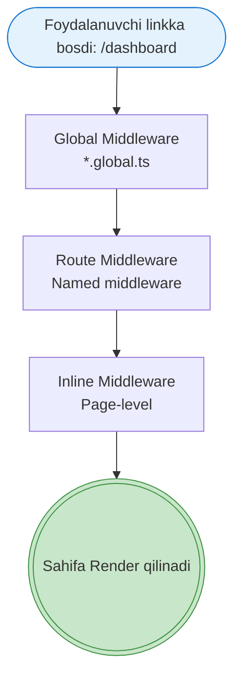
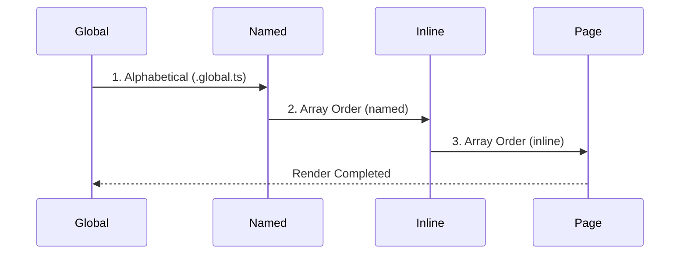

# Middleware

## Kirish

> [!IMPORTANT]
> **Nima uchun muhim?**  
> Foydalanuvchilar veb-sahifalar o'rtasida harakatlanayotganda (masalan, `/login` dan `/dashboard` ga o'tayotganda), ularni ma'lum bir tekshiruvlardan o'tkazish kerak bo'ladi. Ular ro'yxatdan o'tganmi? Ularning bunga huquqi bormi? Xuddi shu vazifalarni **Nuxt Middleware** orqali hal qilamiz. Middleware sahifa ko'rsatilishidan avval ishga tushib, foydalanuvchini yo'naltirish, qaytarib yuborish (redirect) yoki statistika yig'ish imkonini beradi.

> [!NOTE]
> **Real-hayot analogiyasi: "Bojxona nazorati"**  
> Tasavvur qiling, siz bir davlatdan ikkinchi davlatga (Sahifa A dan Sahifa B ga) uchib o'tmoqchisiz.  
> Samolyot qo'nganidan keyin, shaharga kirishdan oldin **Bojxona tekshiruvidan (Middleware)** o'tasiz:
> 1. Pasportingiz bormi? (Auth tekshiruvi)
> 2. Vizada muammo yo'qmi? (Role tekshiruvi)
> 3. Hamma narsa joyida bo'lsagina shaharga kiritilasiz (Sahifa ochiladi). Aks holda, orqaga (login sahifasiga) qaytarib yuborilasiz.

## Middleware Nima?

Middleware - bu "oraliq dastur" ma'nosini anglatadi. Route'lar orasida ishlaydigan kod - foydalanuvchi bir sahifadan ikkinchisiga o'tganida, middleware avval ishga tushadi.



### Middleware Turlari

| Turi | Qayerda ishlatiladi? | Fayl nomi formati | Xususiyati |
| --- | --- | --- | --- |
| **Global** | Barcha routelarda | `*.global.ts` | Har safar sahifa o'zgarganda avtomatik ishlaydi. |
| **Named** | Ma'lum sahifalarda | `middleware/auth.ts` | `definePageMeta({ middleware: 'auth' })` orqali ulanadi. |
| **Inline** | Biriktirilgan sahifa ichida | Sahifa `script`ida | Faqat shu sahifaga tegishli bo'ladi. |
| **Server** | API Requestlarda | `server/middleware/` | Node.js (Nitro) qatlamida har bir HTTP so'rovda ishlaydi. |

### Middleware Execution Order (Ishlash Ketma-ketligi)



## Kod Misollari

### Global Middleware

```typescript
// middleware/analytics.global.ts
export default defineNuxtRouteMiddleware((to, from) => {
  // Har route o'zgarishida analytics yuborish
  if (process.client) {
    // Google Analytics
    window.gtag?.('config', 'GA_MEASUREMENT_ID', {
      page_path: to.fullPath
    })

    // Custom analytics
    trackPageView({
      path: to.fullPath,
      referrer: from.fullPath,
      timestamp: Date.now()
    })
  }
})
```

```typescript
// middleware/01.init.global.ts
// 01 prefix - birinchi bo'lib ishlaydi
export default defineNuxtRouteMiddleware(async (to, from) => {
  const { user, fetchUser } = useAuth()

  // Agar user yo'q va token bor bo'lsa - fetch
  if (!user.value && process.client) {
    const token = localStorage.getItem('auth_token')
    if (token) {
      await fetchUser()
    }
  }
})
```

### Named Middleware - Auth

```typescript
// middleware/auth.ts
export default defineNuxtRouteMiddleware((to, from) => {
  const { user, isAuthenticated } = useAuth()

  // Agar autentifikatsiya qilinmagan bo'lsa
  if (!isAuthenticated.value) {
    // Login sahifasiga redirect
    // Return URL'ni saqlash
    return navigateTo({
      path: '/login',
      query: {
        redirect: to.fullPath
      }
    })
  }
})
```

```vue
<!-- pages/dashboard.vue -->
<script setup>
// Auth middleware ishlatish
definePageMeta({
  middleware: 'auth'
})
</script>

<template>
  <div>
    <h1>Dashboard</h1>
    <!-- Faqat authenticated users ko'radi -->
  </div>
</template>
```

### Named Middleware - Admin

```typescript
// middleware/admin.ts
export default defineNuxtRouteMiddleware((to, from) => {
  const { user } = useAuth()

  // User yo'q yoki admin emas
  if (!user.value || user.value.role !== 'admin') {
    // 403 Forbidden
    throw createError({
      statusCode: 403,
      statusMessage: 'Access Denied',
      message: 'You do not have permission to access this page'
    })
  }
})
```

```vue
<!-- pages/admin/index.vue -->
<script setup>
// Ketma-ket: avval auth, keyin admin
definePageMeta({
  middleware: ['auth', 'admin']
})
</script>
```

### Named Middleware - Guest Only

```typescript
// middleware/guest.ts
export default defineNuxtRouteMiddleware((to, from) => {
  const { isAuthenticated } = useAuth()

  // Agar allaqachon login qilgan bo'lsa
  if (isAuthenticated.value) {
    // Dashboard'ga redirect
    return navigateTo('/dashboard')
  }
})
```

```vue
<!-- pages/login.vue -->
<script setup>
definePageMeta({
  middleware: 'guest'
})
</script>
```

### Inline Middleware

```vue
<!-- pages/checkout.vue -->
<script setup>
definePageMeta({
  middleware: [
    // Inline middleware #1 - cart check
    function (to, from) {
      const { items } = useCart()

      if (items.value.length === 0) {
        return navigateTo('/cart')
      }
    },

    // Inline middleware #2 - auth check
    'auth',

    // Inline middleware #3 - custom logic
    async function (to, from) {
      const { hasValidPaymentMethod } = usePayment()

      if (!hasValidPaymentMethod.value) {
        return navigateTo('/payment-methods')
      }
    }
  ]
})
</script>
```

### Server Middleware

```typescript
// server/middleware/cors.ts
export default defineEventHandler((event) => {
  // CORS headers
  setResponseHeaders(event, {
    'Access-Control-Allow-Origin': '*',
    'Access-Control-Allow-Methods': 'GET, POST, PUT, DELETE, OPTIONS',
    'Access-Control-Allow-Headers': 'Content-Type, Authorization'
  })

  // Preflight request
  if (event.method === 'OPTIONS') {
    event.node.res.statusCode = 204
    event.node.res.end()
    return
  }
})
```

```typescript
// server/middleware/auth.ts
export default defineEventHandler(async (event) => {
  // API routes uchun auth check
  const url = getRequestURL(event)

  // /api/public/* - auth kerak emas
  if (url.pathname.startsWith('/api/public')) {
    return
  }

  // /api/* - auth kerak
  if (url.pathname.startsWith('/api/')) {
    const token = getHeader(event, 'authorization')?.split(' ')[1]

    if (!token) {
      throw createError({
        statusCode: 401,
        message: 'Unauthorized'
      })
    }

    try {
      const user = await verifyToken(token)
      // Request context'ga user qo'shish
      event.context.user = user
    } catch {
      throw createError({
        statusCode: 401,
        message: 'Invalid token'
      })
    }
  }
})
```

```typescript
// server/middleware/logging.ts
export default defineEventHandler((event) => {
  const start = Date.now()
  const url = getRequestURL(event)

  // Response tugagandan keyin log
  event.node.res.on('finish', () => {
    const duration = Date.now() - start
    console.log(`[${event.method}] ${url.pathname} - ${event.node.res.statusCode} (${duration}ms)`)
  })
})
```

### Noto'g'ri Patterns

```typescript
// NOTO'G'RI: Async logic to'g'ri handle qilinmagan
// middleware/bad-auth.ts
export default defineNuxtRouteMiddleware((to, from) => {
  // Promise return qilinmayapti!
  fetch('/api/user').then(res => {
    if (!res.ok) {
      navigateTo('/login') // Bu ishlamaydi!
    }
  })
})

// TO'G'RI: Async/await bilan
export default defineNuxtRouteMiddleware(async (to, from) => {
  try {
    const res = await fetch('/api/user')
    if (!res.ok) {
      return navigateTo('/login')
    }
  } catch {
    return navigateTo('/login')
  }
})
```

```typescript
// NOTO'G'RI: Server-side API call client'da crash
// middleware/bad-server.ts
export default defineNuxtRouteMiddleware(async (to, from) => {
  // Bu faqat server'da ishlaydi!
  const db = await connectToDatabase()
  const user = await db.users.findOne({ id: 1 })
})

// TO'G'RI: Server API orqali
export default defineNuxtRouteMiddleware(async (to, from) => {
  // useFetch server va client'da ishlaydi
  const { data: user, error } = await useFetch('/api/user')

  if (error.value || !user.value) {
    return navigateTo('/login')
  }
})
```

```typescript
// NOTO'G'RI: Infinite redirect loop
// middleware/infinite-loop.ts
export default defineNuxtRouteMiddleware((to, from) => {
  // /login'ga redirect
  return navigateTo('/login')
  // /login ham auth middleware ishlatsa = infinite loop!
})

// TO'G'RI: Target route'ni tekshirish
export default defineNuxtRouteMiddleware((to, from) => {
  // Agar allaqachon login sahifasida bo'lsa, skip
  if (to.path === '/login') {
    return
  }

  if (!isAuthenticated()) {
    return navigateTo('/login')
  }
})
```

```vue
<!-- NOTO'G'RI: Middleware nomini noto'g'ri yozish -->
<script setup>
definePageMeta({
  // Fayl nomi: middleware/auth.ts
  middleware: 'Auth' // Case-sensitive! Ishlamaydi
})
</script>

<!-- TO'G'RI: To'g'ri nom -->
<script setup>
definePageMeta({
  middleware: 'auth' // Fayl nomi bilan bir xil
})
</script>
```

### To'g'ri: Advanced Auth Middleware

```typescript
// middleware/auth.ts
export default defineNuxtRouteMiddleware(async (to, from) => {
  const { user, token, refreshToken, logout } = useAuth()

  // Public routes - skip auth
  const publicRoutes = ['/login', '/register', '/forgot-password']
  if (publicRoutes.includes(to.path)) {
    return
  }

  // Token yo'q
  if (!token.value) {
    return navigateTo({
      path: '/login',
      query: { redirect: to.fullPath }
    })
  }

  // Token expired - refresh
  if (isTokenExpired(token.value)) {
    try {
      await refreshToken()
    } catch {
      // Refresh failed - logout
      await logout()
      return navigateTo('/login')
    }
  }

  // User data yo'q - fetch
  if (!user.value) {
    try {
      await fetchUser()
    } catch {
      await logout()
      return navigateTo('/login')
    }
  }
})
```

### To'g'ri: Role-Based Access Control

```typescript
// middleware/rbac.ts
interface RoutePermission {
  path: string
  roles: string[]
}

const routePermissions: RoutePermission[] = [
  { path: '/admin', roles: ['admin'] },
  { path: '/admin/users', roles: ['admin', 'moderator'] },
  { path: '/dashboard', roles: ['admin', 'moderator', 'user'] },
  { path: '/reports', roles: ['admin', 'analyst'] }
]

export default defineNuxtRouteMiddleware((to, from) => {
  const { user } = useAuth()

  // Find matching permission
  const permission = routePermissions.find(p =>
    to.path.startsWith(p.path)
  )

  // No permission config - allow
  if (!permission) {
    return
  }

  // Check user role
  if (!user.value || !permission.roles.includes(user.value.role)) {
    throw createError({
      statusCode: 403,
      statusMessage: 'Forbidden',
      message: `This page requires one of these roles: ${permission.roles.join(', ')}`
    })
  }
})
```

### To'g'ri: Feature Flags Middleware

```typescript
// middleware/feature.ts
export default defineNuxtRouteMiddleware(async (to, from) => {
  const { isFeatureEnabled } = useFeatureFlags()

  // Route meta'dan feature flag olish
  const requiredFeature = to.meta.feature as string | undefined

  if (requiredFeature) {
    const enabled = await isFeatureEnabled(requiredFeature)

    if (!enabled) {
      // Feature disabled - redirect or error
      throw createError({
        statusCode: 404,
        statusMessage: 'Not Found',
        message: 'This feature is not available'
      })
    }
  }
})
```

```vue
<!-- pages/beta-feature.vue -->
<script setup>
definePageMeta({
  middleware: 'feature',
  feature: 'beta-dashboard' // Custom meta
})
</script>
```

## Real-World Cases

### Case 1: E-Commerce Auth Flow

```typescript
// middleware/01.auth-init.global.ts
export default defineNuxtRouteMiddleware(async (to, from) => {
  const { user, fetchUser, token } = useAuth()

  // Birinchi yuklanishda user fetch
  if (process.client && token.value && !user.value) {
    try {
      await fetchUser()
    } catch {
      // Token invalid - clear
      token.value = null
    }
  }
})

// middleware/checkout-guard.ts
export default defineNuxtRouteMiddleware(async (to, from) => {
  const { isAuthenticated } = useAuth()
  const { items, subtotal } = useCart()
  const { hasAddress } = useShipping()

  // Step 1: Cart must have items
  if (items.value.length === 0) {
    return navigateTo('/cart')
  }

  // Step 2: Must be authenticated
  if (!isAuthenticated.value) {
    return navigateTo({
      path: '/login',
      query: { redirect: '/checkout' }
    })
  }

  // Step 3: Checkout steps flow
  const checkoutSteps = [
    { path: '/checkout/shipping', check: () => true },
    { path: '/checkout/payment', check: () => hasAddress.value },
    { path: '/checkout/review', check: () => hasAddress.value }
  ]

  for (const step of checkoutSteps) {
    if (to.path === step.path && !step.check()) {
      // Redirect to previous required step
      const prevStep = checkoutSteps[checkoutSteps.indexOf(step) - 1]
      return navigateTo(prevStep?.path || '/cart')
    }
  }
})
```

```vue
<!-- pages/checkout/[[step]].vue -->
<script setup>
definePageMeta({
  middleware: 'checkout-guard'
})

const route = useRoute()
const step = computed(() => route.params.step || 'shipping')
</script>

<template>
  <div class="checkout">
    <CheckoutSteps :current="step" />

    <ShippingForm v-if="step === 'shipping'" />
    <PaymentForm v-if="step === 'payment'" />
    <OrderReview v-if="step === 'review'" />
  </div>
</template>
```

### Case 2: Multi-Tenant SaaS

```typescript
// middleware/tenant.global.ts
export default defineNuxtRouteMiddleware(async (to, from) => {
  const { setTenant, tenant } = useTenant()

  // Subdomain'dan tenant olish
  if (process.client) {
    const hostname = window.location.hostname
    const subdomain = hostname.split('.')[0]

    if (subdomain && subdomain !== 'www' && subdomain !== 'app') {
      try {
        await setTenant(subdomain)
      } catch {
        // Tenant not found - redirect to main site
        window.location.href = 'https://app.example.com'
        return
      }
    }
  }

  // Server-side tenant detection
  if (process.server) {
    const event = useRequestEvent()
    const host = getHeader(event, 'host')
    const subdomain = host?.split('.')[0]

    if (subdomain && !['www', 'app'].includes(subdomain)) {
      try {
        await setTenant(subdomain)
      } catch {
        throw createError({ statusCode: 404, message: 'Tenant not found' })
      }
    }
  }
})

// middleware/tenant-admin.ts
export default defineNuxtRouteMiddleware((to, from) => {
  const { user } = useAuth()
  const { tenant } = useTenant()

  // User must be tenant admin
  if (!user.value || user.value.tenantId !== tenant.value?.id) {
    throw createError({ statusCode: 403, message: 'Access denied' })
  }

  if (user.value.role !== 'admin' && user.value.role !== 'owner') {
    throw createError({ statusCode: 403, message: 'Admin access required' })
  }
})
```

### Case 3: Wizard/Multi-Step Form

```typescript
// middleware/wizard.ts
interface WizardState {
  currentStep: number
  completedSteps: number[]
  data: Record<string, unknown>
}

export default defineNuxtRouteMiddleware((to, from) => {
  const wizardState = useState<WizardState>('wizard', () => ({
    currentStep: 1,
    completedSteps: [],
    data: {}
  }))

  // Parse step from route
  const stepMatch = to.path.match(/\/wizard\/step-(\d+)/)
  const targetStep = stepMatch ? parseInt(stepMatch[1]) : 1

  // Can only go to completed steps or next step
  const maxAllowedStep = Math.max(...wizardState.value.completedSteps, 0) + 1

  if (targetStep > maxAllowedStep) {
    // Redirect to highest allowed step
    return navigateTo(`/wizard/step-${maxAllowedStep}`)
  }
})

// composables/useWizard.ts
export function useWizard() {
  const wizardState = useState<WizardState>('wizard')

  const completeStep = (step: number, data: Record<string, unknown>) => {
    wizardState.value.completedSteps.push(step)
    wizardState.value.data = { ...wizardState.value.data, ...data }
    wizardState.value.currentStep = step + 1
  }

  const goToStep = (step: number) => {
    navigateTo(`/wizard/step-${step}`)
  }

  const reset = () => {
    wizardState.value = {
      currentStep: 1,
      completedSteps: [],
      data: {}
    }
  }

  return {
    state: readonly(wizardState),
    completeStep,
    goToStep,
    reset
  }
}
```

### Case 4: Maintenance Mode

```typescript
// middleware/maintenance.global.ts
export default defineNuxtRouteMiddleware(async (to, from) => {
  const config = useRuntimeConfig()

  // Check maintenance mode
  if (config.public.maintenanceMode) {
    // Allow access to maintenance page
    if (to.path === '/maintenance') {
      return
    }

    // Allow admin bypass with secret param
    if (to.query.bypass === config.maintenanceBypassKey) {
      // Store bypass in session
      if (process.client) {
        sessionStorage.setItem('maintenance_bypass', 'true')
      }
      return
    }

    // Check bypass session
    if (process.client && sessionStorage.getItem('maintenance_bypass')) {
      return
    }

    // Redirect to maintenance page
    return navigateTo('/maintenance')
  }
})
```

### Case 5: A/B Testing

```typescript
// middleware/ab-test.global.ts
export default defineNuxtRouteMiddleware((to, from) => {
  const { assignVariant, getVariant } = useABTest()

  // Assign variant on first visit
  if (process.client && !getVariant('homepage')) {
    const variant = Math.random() > 0.5 ? 'A' : 'B'
    assignVariant('homepage', variant)
  }

  // Route-based experiment
  if (to.path === '/') {
    const variant = getVariant('homepage')

    if (variant === 'B') {
      // Redirect to variant B
      return navigateTo('/home-v2')
    }
  }
})
```

## Middleware vs Navigation Guards

```
┌─────────────────────────────────────────────────────────────┐
│           Nuxt Middleware vs Vue Router Guards               │
├─────────────────────────────────────────────────────────────┤
│                                                              │
│  Nuxt Middleware                 Vue Router Guards           │
│  ────────────────                ─────────────────           │
│  - Server + Client               - Client only              │
│  - defineNuxtRouteMiddleware     - beforeEach/beforeEnter   │
│  - SSR support                   - SPA only                 │
│  - File-based organization       - Code-based               │
│  - Global/Named/Inline           - Global/Per-route/In-comp │
│                                                              │
│  Qachon Nuxt Middleware:                                    │
│  - SSR kerak bo'lganda                                      │
│  - Server-side auth check                                   │
│  - SEO-critical redirects                                   │
│                                                              │
│  Qachon Vue Guard:                                          │
│  - Client-only logic                                        │
│  - Component-specific                                       │
│  - Nuxt ichida router plugin                               │
│                                                              │
└─────────────────────────────────────────────────────────────┘
```

### Vue Router Guards in Nuxt

```typescript
// plugins/router-guards.ts
export default defineNuxtPlugin(() => {
  const router = useRouter()

  // Global before guard
  router.beforeEach((to, from) => {
    // Client-only logic
    if (process.client) {
      // Page transition animation
      document.body.classList.add('page-transitioning')
    }
  })

  // Global after guard
  router.afterEach((to, from) => {
    if (process.client) {
      document.body.classList.remove('page-transitioning')

      // Scroll to top
      window.scrollTo({ top: 0, behavior: 'smooth' })
    }
  })
})
```

## Interview Savollari

### Savol 1: Nuxt middleware va Vue navigation guard farqi nima?

**Javob:**

**Nuxt Middleware:**
- Server va client'da ishlaydi (universal)
- `defineNuxtRouteMiddleware` API
- SSR qo'llab-quvvatlaydi
- File-based organization (middleware/ papkasi)
- Global (.global.ts), named, inline turlari

**Vue Navigation Guards:**
- Faqat client'da ishlaydi
- `beforeEach`, `beforeEnter`, `beforeRouteEnter`
- SPA-only
- Kod-based (plugin yoki component ichida)

**Qachon nima ishlatish:**
- SSR auth check → Nuxt middleware
- Client-only animation → Vue guard
- Server-side redirect (SEO) → Nuxt middleware
- Component-level guard → Vue `beforeRouteEnter`

### Savol 2: Middleware execution order qanday?

**Javob:**

```typescript
// Execution order:
// 1. Global middlewares (alphabetically)
//    01.auth.global.ts → 02.analytics.global.ts
//
// 2. Page middlewares (array order)
//    middleware: ['auth', 'admin'] → auth → admin
//
// 3. Inline middlewares (array order)
//    middleware: ['auth', function() {...}] → auth → inline fn
```

**Misolda:**
```
Global: 01.init.global.ts    ← First
Global: 02.analytics.global.ts
Named:  auth.ts
Named:  admin.ts
Inline: custom function       ← Last
        ↓
    Page renders
```

### Savol 3: Server middleware va route middleware farqi?

**Javob:**

**Server Middleware (server/middleware/):**
- Nitro server'da ishlaydi
- Barcha HTTP requests uchun
- API routes, static files, page requests
- Low-level: CORS, logging, auth headers
- `defineEventHandler` API

```typescript
// server/middleware/cors.ts
export default defineEventHandler((event) => {
  setResponseHeaders(event, {
    'Access-Control-Allow-Origin': '*'
  })
})
```

**Route Middleware (middleware/):**
- Vue Router level'da ishlaydi
- Faqat page navigations uchun
- High-level: auth check, redirects
- `defineNuxtRouteMiddleware` API

```typescript
// middleware/auth.ts
export default defineNuxtRouteMiddleware((to, from) => {
  if (!isAuthenticated()) {
    return navigateTo('/login')
  }
})
```

### Savol 4: Middleware'da async operation qanday handle qilinadi?

**Javob:**

```typescript
// TO'G'RI: async/await bilan
export default defineNuxtRouteMiddleware(async (to, from) => {
  // 1. Async operation
  const { data, error } = await useFetch('/api/user')

  // 2. Error handling
  if (error.value) {
    return navigateTo('/login')
  }

  // 3. Condition check
  if (!data.value?.isActive) {
    return navigateTo('/inactive')
  }

  // 4. Continue (implicit return undefined)
})

// NOTO'G'RI: Promise return qilinmagan
export default defineNuxtRouteMiddleware((to, from) => {
  // Bu ishlamaydi - navigation davom etadi
  fetch('/api/user').then(res => {
    if (!res.ok) navigateTo('/login')
  })
})
```

### Savol 5: Infinite redirect loop'ni qanday oldini olish?

**Javob:**

```typescript
// MUAMMO: Infinite loop
export default defineNuxtRouteMiddleware((to, from) => {
  return navigateTo('/login') // Har safar redirect
})

// YECHIM 1: Target route'ni tekshirish
export default defineNuxtRouteMiddleware((to, from) => {
  const publicRoutes = ['/login', '/register', '/forgot-password']

  // Public route'larda skip
  if (publicRoutes.includes(to.path)) {
    return // Continue without redirect
  }

  if (!isAuthenticated()) {
    return navigateTo('/login')
  }
})

// YECHIM 2: Middleware'ni faqat kerakli sahifalarda ishlatish
// middleware/auth.ts - named middleware
// pages/dashboard.vue:
// definePageMeta({ middleware: 'auth' })
//
// pages/login.vue:
// definePageMeta({}) - no middleware
```

## Best Practices

### 1. Middleware Organization

```
middleware/
├── 01.init.global.ts      # First: initialize app state
├── 02.analytics.global.ts # Second: track all pages
├── auth.ts                # Named: auth check
├── admin.ts               # Named: admin check
├── guest.ts               # Named: non-authenticated only
└── feature.ts             # Named: feature flag check
```

### 2. Error Handling

```typescript
// middleware/auth.ts
export default defineNuxtRouteMiddleware(async (to, from) => {
  try {
    const { data } = await useFetch('/api/user')

    if (!data.value) {
      return navigateTo('/login')
    }
  } catch (error) {
    // Log error
    console.error('Auth middleware error:', error)

    // Graceful fallback
    return navigateTo('/login')
  }
})
```

### 3. TypeScript Integration

```typescript
// types/middleware.d.ts
declare module '#app' {
  interface PageMeta {
    feature?: string
    requiredRoles?: string[]
  }
}

// middleware/rbac.ts
export default defineNuxtRouteMiddleware((to, from) => {
  const roles = to.meta.requiredRoles as string[] | undefined

  if (roles && roles.length > 0) {
    // Check roles
  }
})
```

### 4. Testing

```typescript
// tests/middleware/auth.test.ts
import { describe, it, expect, vi } from 'vitest'
import authMiddleware from '~/middleware/auth'

describe('Auth Middleware', () => {
  it('redirects to login when not authenticated', async () => {
    const to = { path: '/dashboard', fullPath: '/dashboard' }
    const from = { path: '/', fullPath: '/' }

    // Mock useAuth
    vi.mock('~/composables/useAuth', () => ({
      useAuth: () => ({
        isAuthenticated: ref(false)
      })
    }))

    const result = await authMiddleware(to, from)

    expect(result).toEqual({
      path: '/login',
      query: { redirect: '/dashboard' }
    })
  })
})
```

### 5. Performance

```typescript
// NOTO'G'RI: Har navigatsiyada heavy operation
export default defineNuxtRouteMiddleware(async (to, from) => {
  // Heavy API call har safar
  const { data } = await useFetch('/api/heavy-data')
})

// TO'G'RI: Cache va conditional fetch
export default defineNuxtRouteMiddleware(async (to, from) => {
  const userData = useState('user')

  // Faqat kerak bo'lganda fetch
  if (!userData.value) {
    const { data } = await useFetch('/api/user')
    userData.value = data.value
  }
})
```

---

## Eng Yaxshi Amaliyotlar (Best Practices)

1. **Cheksiz Loopdan saqlaning:** Redirect qilinayotgan sahifada ham shu middleware ishlamasligiga ishonch hosil qiling. (Masalan, loginga redirect qildingiz, lekin login sahifada ham middleware yana loginga jo'natsa cheksiz loop bo'ladi). `if (to.path === '/login') return` bilan himoyalang.
2. **Global Middleware'ni og'irlashtirmang:** Global middleware har safar route o'zgarganda ishlaydi. Unda sekin ishlovchi (heavy) API chaqiruvlarni yoki qiyin hisob-kitoblarni unchalik ko'p amalga oshirmang.
3. **Mantiqni ajrating:** UI / Component mantig'i bilan Middleware mantig'ini aralashtirmang. Middleware asosan marshrutlash va yo'naltirish bilan shug'ullanishi kerak. Murakkab huquq tekshiruvlarini alohida xizmatga (`useAuth`) chiqarib qo'ying.

---

## Xulosa

| Middleware Turi | Fayl Nomi | Qayerda ishlaydi? | Qachon ishlatish kerak? |
|-----------------|-----------|-------------------|-------------------------|
| **Global** | `*.global.ts` | Har bir sahifaga o'tishda | Analytics (Statistika), Global texnik xizmat holati |
| **Named** | `auth.ts` | Sahifa meta'sida nom bilan ko'rsatilganda | Auth (Foydalanuvchini tekshirish), Admin ruxsatnomalari |
| **Inline** | `definePageMeta` ichida | Faqat bitta komponent ichida | Kichik Wizard, Anketalar orasidagi yo'nalishlar |
| **Server** | `server/middleware` | Backend ga har so'rov tushganda | API Xavfsizligi, CORS sozlamalari, Server Loglar |

Nuxt Middleware marshrutlash bo'yicha kuchli nazorat beradi. To'g'ri ishlatilsa loyihani xavfsiz va boshqarish oson qiladi, xato yozilsa (Cheksiz Loop) esa loyihani butunlay "qotirib" qo'yadi.
