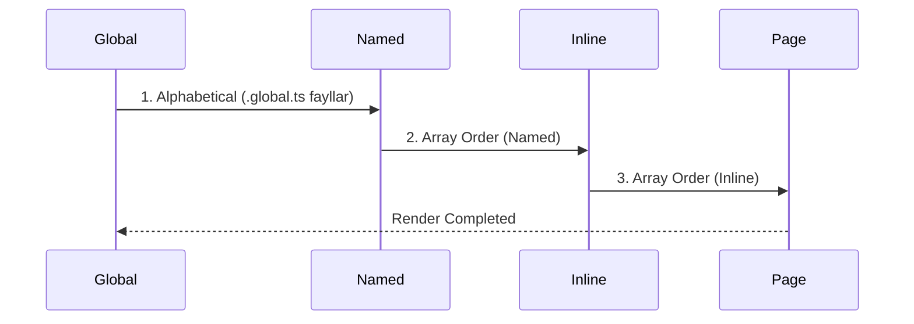

# Middleware

## Kirish

> [!IMPORTANT]
> **Nima uchun muhim?**  
> Foydalanuvchilar veb-sahifalar o'rtasida harakatlanayotganda (masalan, `/login` dan `/dashboard` ga o'tayotganda), ularni ma'lum bir tekshiruvlardan o'tkazish kerak bo'ladi. Ular ro'yxatdan o'tganmi? Ularning bunga huquqi bormi? Xuddi shu vazifalarni **Nuxt Middleware** orqali hal qilamiz. Middleware sahifa ko'rsatilishidan avval ishga tushib, foydalanuvchini yo'naltirish, qaytarib yuborish (redirect) yoki statistika yig'ish imkonini beradi.

> [!NOTE]
> **Real-hayot analogiyasi: "Bojxona nazorati"**  
> Tasavvur qiling, siz bir davlatdan ikkinchi davlatga (Sahifa A dan Sahifa B ga) uchib o'tmoqchisiz.  
> Samolyot qo'nganidan keyin, shaharga kirishdan oldin **Bojxona tekshiruvidan (Middleware)** o'tasiz:
> 1. Pasportingiz bormi? (Auth tekshiruvi)
> 2. Vizada muammo yo'qmi? (Role tekshiruvi)
> 3. Hamma narsa joyida bo'lsagina shaharga kiritilasiz (Sahifa ochiladi). Aks holda, orqaga (login sahifasiga) qaytarib yuborilasiz.

Middleware - bu "oraliq dastur" ma'nosini anglatadi. Route'lar orasida ishlaydigan kod - foydalanuvchi bir sahifadan ikkinchisiga o'tganida, middleware avval ishga tushadi.

---

## 🟢 Junior (Asoslar va Tushunchalar)

### Middleware Turlari
Nuxt da 4 xil middleware mavjud:

| Turi | Qayerda ishlatiladi? | Fayl nomi formati | Xususiyati |
| --- | --- | --- | --- |
| **Global** | Barcha routelarda | `*.global.ts` | Har safar sahifa o'zgarganda avtomatik ishlaydi. |
| **Named** | Ma'lum sahifalarda | `middleware/auth.ts` | `definePageMeta({ middleware: 'auth' })` orqali ulanadi. |
| **Inline** | Biriktirilgan sahifa ichida | Sahifa `script`ida | Faqat shu sahifaga tegishli bo'ladi. |
| **Server** | API Requestlarda | `server/middleware/` | Node.js (Nitro) qatlamida har bir HTTP so'rovda ishlaydi. |

### Eng sodda "Auth" Middleware (Named)
Keling, faqat tizimga kirganlar ko'ra oladigan sahifa quramiz.
Buning uchun `middleware/auth.ts` faylini ochib tekshiruv yozamiz:

```typescript
// middleware/auth.ts
export default defineNuxtRouteMiddleware((to, from) => {
  const { isAuthenticated } = useAuth() // Buni o'zimizning auth fayldan olamiz deb tasavvur qilamiz

  // Agar tizimga kirmagan bo'lsa
  if (!isAuthenticated.value) {
    // Login sahifasiga qaytarib yuborish (Redirect)
    return navigateTo('/login')
  }
})
```

Endi shuni himoyalangan sahifada ishlatamiz:
```vue
<!-- pages/dashboard.vue -->
<script setup>
// Bu yozuv sahifaga kirishdan oldin 'auth' middleware ishlashini ta'minlaydi
definePageMeta({
  middleware: 'auth'
})
</script>

<template>
  <div>Xush kelibsiz, Admin!</div>
</template>
```

---

## 🟡 Middle (Amaliyot va Detallar)

### Global Middleware
Agar siz har bir sahifaga o'tganda qandaydir qoidani ishlatmoqchi bo'lsangiz (masalan Google Analytics ga ma'lumot jo'natish), `*.global.ts` fayli qulay. Unda `definePageMeta` chaqirish shart emas, Nuxt o'zi hamma sahifaga ulab qo'yadi.

```typescript
// middleware/analytics.global.ts
export default defineNuxtRouteMiddleware((to, from) => {
  if (process.client) {
    // Analytics yuborish (Faqat mijoz tomonda)
    console.log(`Foydalanuvchi ${from.path} dan ${to.path} ga o'tdi`)
  }
})
```

### Server Middleware
Server Middleware bu sahifa o'zgarishini emas, balki Backend ga borayotgan barcha HTTP API so'rovlarni (`/api/*`) nazorat qiladigan bojxonadir.
Server middleware lari `server/middleware/` papkasida yoziladi va faqat server qismida ishlaydi (brauzerga tushmaydi).

```typescript
// server/middleware/cors.ts
export default defineEventHandler((event) => {
  // Barcha API so'rovlar uchun CORS ga ruxsat berish
  setResponseHeaders(event, {
    'Access-Control-Allow-Origin': '*',
    'Access-Control-Allow-Methods': 'GET, POST, PUT, DELETE, OPTIONS',
    'Access-Control-Allow-Headers': 'Content-Type, Authorization'
  })
})
```

### Middleware Execution Order (Ishlash Ketma-ketligi)
Agar sizda bir nechta middleware bo'lsa, ular qaysi tartibda ishlaydi?


Masalan `middleware: ['auth', 'admin']` deb bersangiz, avval foydalanuvchimi (auth) shuni tekshiradi, keyin haqiqatdan adminmi (admin) yo'qmi tekshiradi.

---

## 🔴 Senior (Arxitektura va Optimizatsiya)

### Cheksiz Loop (Infinite Loop) Muammosi
Nuxt Routerdagi eng katta va keng tarqalgan xato bu - foydalanuvchini yo'naltirayotgan sahifa ham middleware nazoratiga tushib qolishidir.
```typescript
// NOTO'G'RI
export default defineNuxtRouteMiddleware((to, from) => {
  // Agar user yo'q bo'lsa login ga jo'natadi. 
  // Login sahifaga o'tayotganda Middleware yana ishlaydi va YANA loginga jo'natadi! (Infinite Loop)
  return navigateTo('/login') 
})

// TO'G'RI
export default defineNuxtRouteMiddleware((to, from) => {
  // Agar u shundoq ham loginga ketayotgan bo'lsa teginma
  if (to.path === '/login') return 

  if (!isAuthenticated) {
    return navigateTo('/login')
  }
})
```

### Asinxron (Async) Middleware yozish
Agar Middleware ichida API dan nimadir kutayotgan bo'lsangiz, albatta `async / await` ishlating. `then` ishlatish navigatsiyani to'xtata olmaydi (Nuxt kutib o'tirmaydi).
```typescript
// NOTO'G'RI (Promise kutib o'tirmaydi va baribir himoyalangan sahifa ochilib ketadi)
export default defineNuxtRouteMiddleware((to, from) => {
  fetch('/api/user').then(res => {
    if (!res.ok) navigateTo('/login')
  })
})

// TO'G'RI
export default defineNuxtRouteMiddleware(async (to, from) => {
  const { data, error } = await useFetch('/api/user')
  if (error.value) {
    return navigateTo('/login') // Nuxt kod to'liq tugashini va qarorni kutadi
  }
})
```

### Intervyu Savollari (Qiyin daraja)
**1. Nuxt middleware va Vue Router (Navigation Guard) farqi nima?**
*Javob:* Vue dagi `beforeEach` kabi Guard lar faqat brauzerda (Client-side) ishlaydi va loyiha SPA kabi ishlaganda foydasi tegadi. Nuxt Middleware lari esa Universal bo'lib ham Server, ham Client da ishlay oladi, bu SSR arxitekturada sahifalarni bloklash (masalan serverning o'zidayoq `/login` ga burib yuborish) imkonini beradi. Shuningdek Nuxt uni fayllar asosida tartiblaydi.

**2. Agar global middleware dan tashqari "auth" va "admin" kabi bir nechta middleware bo'lsa, ular qanday tartibda ishga tushadi?**
*Javob:* 1. Avval fayl nomi alifbosi bo'yicha `*.global.ts` dagi Global middleware lar ketma ket ishladi. 2. Keyin sahifa ichida `middleware: ['auth', 'admin']` deb berilgan yozish ketma-ketligi (Array Order) asosida ishlaydi. 3. Eng oxirida Inline (shundoq faylning ichiga function deb yozib ketilgan) middleware ishlaydi.

**3. Server Middleware nima va u Vue Route middleware dan qanday farq qiladi?**
*Javob:* Server middleware `server/middleware` papkasida yoziladi va sahifalar orasida o'tishni emas, balki Backend (Nitro API) ga kelayotgan va ketayotgan so'rovlarni nazorat qiladi. Unda asosan CORS, Loglar yoki API uchun Authorization Token lar tekshiriladi. U frontend da emas, faqat Node.js muhitida ishlaydi.

---

## Eng Yaxshi Amaliyotlar (Best Practices)

1. **Cheksiz Loopdan saqlaning:** Redirect qilinayotgan sahifada ham shu middleware ishlamasligiga ishonch hosil qiling. (Masalan, loginga redirect qildingiz, lekin login sahifada ham middleware yana loginga jo'natsa cheksiz loop bo'ladi). `if (to.path === '/login') return` bilan himoyalang.
2. **Global Middleware'ni og'irlashtirmang:** Global middleware har safar route o'zgarganda ishlaydi. Unda sekin ishlovchi (heavy) API chaqiruvlarni yoki qiyin hisob-kitoblarni unchalik ko'p amalga oshirmang.
3. **Mantiqni ajrating:** UI / Component mantig'i bilan Middleware mantig'ini aralashtirmang. Middleware asosan marshrutlash va yo'naltirish bilan shug'ullanishi kerak. Murakkab huquq tekshiruvlarini alohida xizmatga (`useAuth`) chiqarib qo'ying.

---

## Xulosa

| Middleware Turi | Fayl Nomi | Qayerda ishlaydi? | Qachon ishlatish kerak? |
|-----------------|-----------|-------------------|-------------------------|
| **Global** | `*.global.ts` | Har bir sahifaga o'tishda | Analytics (Statistika), Global texnik xizmat holati |
| **Named** | `auth.ts` | Sahifa meta'sida nom bilan ko'rsatilganda | Auth (Foydalanuvchini tekshirish), Admin ruxsatnomalari |
| **Inline** | `definePageMeta` ichida | Faqat bitta komponent ichida | Kichik Wizard, Anketalar orasidagi yo'nalishlar |
| **Server** | `server/middleware` | Backend ga har so'rov tushganda | API Xavfsizligi, CORS sozlamalari, Server Loglar |

Nuxt Middleware marshrutlash bo'yicha kuchli nazorat beradi. To'g'ri ishlatilsa loyihani xavfsiz va boshqarish oson qiladi, xato yozilsa (Cheksiz Loop) esa loyihani butunlay "qotirib" qo'yadi.
