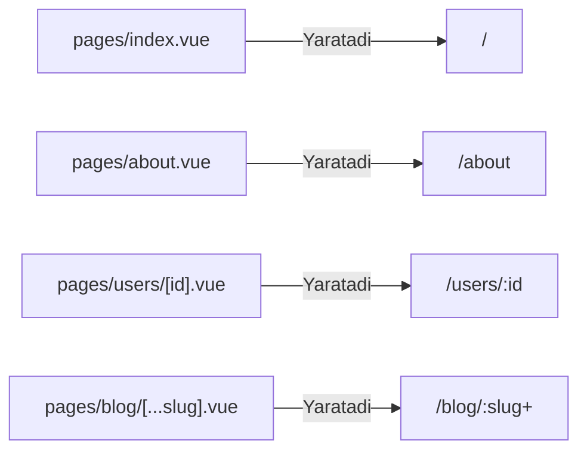

# Routing

## Kirish

> [!IMPORTANT]
> **Nima uchun muhim?**  
> An'anaviy Vue.js da (`Vue Router` yordamida) har bir yangi sahifa yaratganda, uni bitta katta "router" fayliga borib qo'lda ro'yxatdan o'tkazish (import qilish va path ko'rsatish) kerak. Loyiha kattalashgani sari, bu joy minglab qatorlarga aylanib ketadi. **Nuxt Routing** bu muammoni avtomatlashtiradi. Siz shunchaki `pages/` papkasiga fayl yaratasiz, Nuxt.js uning nomi va joylashuviga qarab o'zi router'ni shakllantiradi (File-system based routing). 

> [!NOTE]
> **Real-hayot analogiyasi: "Yangi Xodimlar va Ish xonasi"**  
> - **Vue Router:** Har safar yangi xodim ishga kelsa (yangi sahifa yaratsangiz), ofis menejeriga borib qog'oz to'ldirishingiz, unga bo'sh xona qidirishingiz (router konfig yozishingiz) kerak. 
> - **Nuxt Routing:** Ofisning tartibi aniq. "Menegerlar" bo'limida bo'sh stol bor, xodim shu joyga kelib o'tiradi va ish boshlaydi (pages papkasiga tushdi — o'z-o'zidan url tayyor).

---

## 🟢 Junior (Asoslar va Tushunchalar)

### File-Based Routing Nima?
Nuxt `pages/` papkasidagi fayl strukturasini Vue Router konfiguratsiyasiga avtomatik aylantiradi:



### Route Turlari

| Turi | Misol fayl formati | Yaratilgan URL Route | Tushuntirish |
| --- | --- | --- | --- |
| **Statik (Static)** | `pages/about.vue` | `/about` | Aniq va o'zgarmas manzillar. |
| **Dinamik (Dynamic)** | `pages/users/[id].vue` | `/users/:id` | `id` joyiga istalgan qiymat tushishi mumkin (`/users/12`). |
| **Barchasini qamrab oluvchi (Catch-all)** | `pages/[...slug].vue` | `/:slug(.*)*` | Slash `/` bilan ajratilgan hamma narsani ushlab oladi (`/a/b/c`). |
| **Majburiy emas (Optional)** | `pages/[[slug]].vue` | `/:slug?` | Bo'lmasa ham xato bermaydi. |
| **Ichki (Nested)** | `pages/users.vue` + `pages/users/index.vue` | `/users` | Ota komponent ichida (`NuxtPage`) bola komponentlarini chiqarish. |

### Havolalar Yaratish (NuxtLink)
Oddiy HTML `<a>` tegi o'rniga har doim `<NuxtLink>` ishlating.
```vue
<template>
  <div>
    <!-- Noto'g'ri (Sayt to'liq refresh bo'ladi) -->
    <a href="/about">About</a>

    <!-- To'g'ri (SPA kabi tez o'tadi) -->
    <NuxtLink to="/about">About</NuxtLink>

    <!-- Dinamik route ga o'tish -->
    <NuxtLink :to="`/users/${userId}`">Profile</NuxtLink>
  </div>
</template>
```

---

## 🟡 Middle (Amaliyot va Detallar)

### Route Resolution Order (Izlash ketma-ketligi)
URL ga so'rov kelganida Nuxt sahifalarni quyidagi qat'iy tartibda qidiradi (Masalan: `/users/123` so'ralganda):

```mermaid
flowchart TD
    A([So'rov: /users/123]) --> B{1. Statik Route<br>users/123.vue?}
    B -- Yo'q --> C{2. Dinamik Route<br>users/[id].vue?}
    B -- Bor --> F[Topildi]
    C -- Yo'q --> D{3. Catch-all Route<br>[...slug].vue?}
    C -- Bor --> F
    D -- Yo'q --> E[4. Sahifa topilmadi 404]
    D -- Bor --> F
```

### Dinamik Parametrlarni Olish
Dinamik marshrutdan o'zgaruvchini olish uchun `useRoute()` dan foydalanamiz.

```vue
<!-- pages/users/[id].vue -->
<script setup lang="ts">
const route = useRoute()

// Parametr har doim string bo'ladi
const userId = computed(() => route.params.id)

// Parametr o'zgarganini kuzatib turish kerak bo'lsa
const { data: user } = await useFetch(
  () => `/api/users/${route.params.id}`,
  { watch: [() => route.params.id] } // Bu route o'zgarganda qayta fetch qilish uchun muhim!
)
</script>

<template>
  <div>
    <h1>Foydalanuvchi ID: {{ userId }}</h1>
  </div>
</template>
```

### Layouts va Nested Routes
Agar ba'zi sahifalar (masalan, dashboard sahifalari) umuman boshqacha menyu yoki dizaynga ega bo'lsa Layout lar ishlatiladi.
```vue
<!-- layouts/admin.vue -->
<template>
  <div class="admin-layout">
    <AdminSidebar />
    <div class="admin-content">
      <slot /> <!-- Sahifa shu yerga tushadi -->
    </div>
  </div>
</template>

<!-- pages/admin/index.vue -->
<script setup>
definePageMeta({
  layout: 'admin' // Qaysi layout kerakligini aytamiz
})
</script>
```

---

## 🔴 Senior (Arxitektura va Optimizatsiya)

### Route Validation (Marshrutni tasdiqlash)
Ba'zan noto'g'ri qiymat kiritilganda uni tekshirib, darhol 404 xatoligiga tushirish kerak bo'ladi (masalan, foydalanuvchi IDsi faqat raqam bo'lishi kerak).
```vue
<!-- pages/users/[id].vue -->
<script setup lang="ts">
definePageMeta({
  validate: async (route) => {
    // id faqat raqamlardan iborat bo'lishi kerak
    return /^\d+$/.test(route.params.id as string)
  }
})
</script>
```

### Dasturiy Yo'naltirish (Programmatic Navigation)
Foydalanuvchini kod orqali (masalan, formani to'ldirib bo'lgach) boshqa sahifaga yuborish. Vue Router dagi `router.push()` o'rniga Nuxt da `navigateTo()` qulay.

```vue
<script setup lang="ts">
const submitForm = async () => {
  await xatoTekshirish()
  
  // Oddiy o'tish
  await navigateTo('/success')

  // Query parameterlar bilan o'tish (/search?q=nuxt)
  await navigateTo({
    path: '/search',
    query: { q: 'nuxt' }
  })
  
  // Tashqi havolaga yuborish
  await navigateTo('https://google.com', { external: true })
}
</script>
```

### Intervyu Savollari (Qiyin daraja)
**1. Nuxt file-based routing qanday ishlaydi va uning qanday yashirin ishlari bor?**
*Javob:* Nuxt build vaqtida `pages/` papkasini analiz qiladi va avtomatik tarzda `routes` massivini generatsiya qilib, Vue Router ni sozlaydi. Dinamik ([id]), catch-all ([...slug]) kabi pattern larni qidiradi va tartiblaydi (Statik fayllar har doim dinamiklaridan ustun turadi).

**2. route.params qanday qilib reaktiv bo'ladi?**
*Javob:* `const id = route.params.id` kabi yozish xato, u reaktivlikni yo'qotadi va bitta sahifada (`/user/1` dan `/user/2` ga o'tganda) yangilanmaydi. Har doim uni `computed(() => route.params.id)` yoki `useFetch` ni `watch` xususiyati bilan ishlatish kerak.

**3. NuxtLink va `<a>` tegining asil farqi (under the hood) nima?**
*Javob:* `<a>` tegi brauzerga yangi sahifa so'rash buyrug'ini beradi, bu Full Page Reload (Serverdan noldan HTML yuklash) olib keladi. `<NuxtLink>` esa Vue Router dan foydalanadi va sahifa o'zgarganda faqat kerakli JSON (yoki komponent)larni fetch qilib, SPA (Single Page Application) sifatida ishlaydi. Bundan tashqari `<NuxtLink>` viewport ga kirganda havola manzilidagi sahifa kodini orqa fonda (prefetch) yuklab tayyorlab qo'yadi.

---

## Eng Yaxshi Amaliyotlar (Best Practices)

1. **Juda ko'p papkalar ochmang:** `/pages/category/subcategory/item/[id].vue` kabi juda chuqur fayl strukturasi papkalar o'rtasida navigatsiya qilishni va fayllarni izlashni qiyinlashtiradi. Mantiqiy jihatdan tekisroq ushlashga harakat qiling.
2. **`NuxtLink` ni to'g'ri ishlating:** Barcha ichki havolalar (internal links) uchun oddiy `<a>` emas, `<NuxtLink>` ishlating. U orqa fonda (hover qilinganda) sahifa ma'lumotlarini o'zi yuklab keladi, bu mijozga sahifa zumda (instantly) ochilayotgandek tuyg'u beradi.
3. **SEO uchun SEO Metani dinamik Route larda unutmang:** Dinamik routelarda har doim `useSeoMeta` dan foydalanib, canonical url va title ni moslab keting, aks holda barcha mahsulotlaringiz Google'da bitta sahifa kabi indexlanishi mumkin.

---

## Xulosa

| Fayl Nomi | Nuxt dagi Turi | Brauzerdagi URL |
|-----------|----------------|-----------------|
| `about.vue` | Standart (Static) Route | `/about` |
| `[id].vue` | Dinamik (Dynamic) Route | `/123` yoki `/abc` |
| `[...slug].vue` | Tutib Qoluvchi (Catch-all) | `/category/shoes/nike` (cheksiz chuqurlik) |
| `index.vue` | Bosh (Index) Route | `/` yoki qaysi papkada bo'lsa o'shaning ildizi |

Nuxt routing file-based approach bilan konfiguratsiyani minimallashtirib, development tezligini oshiradi. `NuxtLink` ni o'z o'rnida qo'llab, to'g'ri papkalar strukturasini tanlash loyihaning muvaffaqiyat garovidir.
