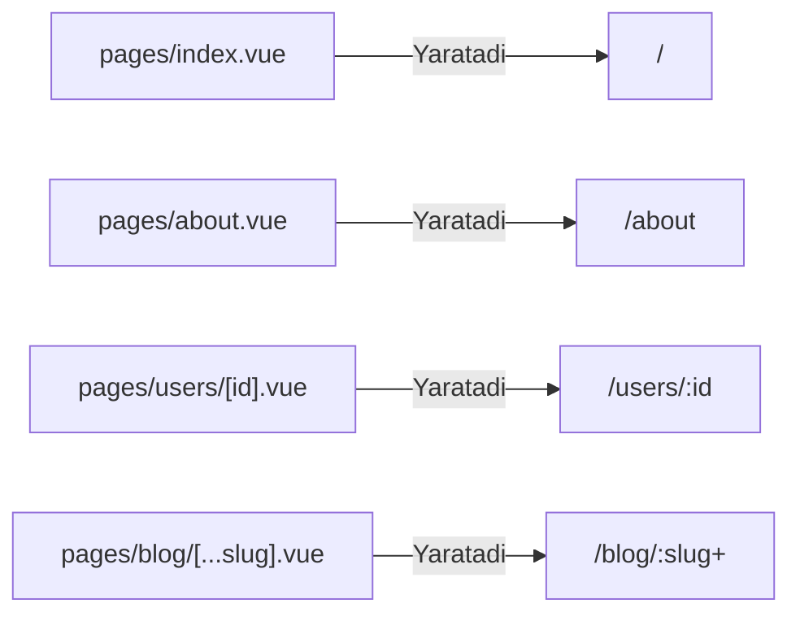

# Routing

## Kirish

> [!IMPORTANT]
> **Nima uchun muhim?**  
> An'anaviy Vue.js da (`Vue Router` yordamida) har bir yangi sahifa yaratganda, uni bitta katta "router" fayliga borib qo'lda ro'yxatdan o'tkazish (import qilish va path ko'rsatish) kerak. Loyiha kattalashgani sari, bu joy minglab qatorlarga aylanib ketadi. **Nuxt Routing** bu muammoni avtomatlashtiradi. Siz shunchaki `pages/` papkasiga fayl yaratasiz, Nuxt.js uning nomi va joylashuviga qarab o'zi router'ni shakllantiradi (File-system based routing). 

> [!NOTE]
> **Real-hayot analogiyasi: "Yangi Xodimlar va Ish xonasi"**  
> - **Vue Router:** Har safar yangi xodim ishga kelsa (yangi sahifa yaratsangiz), ofis menejeriga borib qog'oz to'ldirishingiz, unga bo'sh xona qidirishingiz (router konfig yozishingiz) kerak. 
> - **Nuxt Routing:** Ofisning tartibi aniq. "Menegerlar" bo'limida bo'sh stol bor, xodim shu joyga kelib o'tiradi va ish boshlaydi (pages papkasiga tushdi — o'z-o'zidan url tayyor).

## Nazariya

### File-Based Routing

Nuxt `pages/` papkasidagi fayl strukturasini Vue Router konfiguratsiyasiga aylantiradi:



### Route Types

### Route Turlari

| Turi | Misol fayl formati | Yaratilgan URL Route | Tushuntirish |
| --- | --- | --- | --- |
| **Statik (Static)** | `pages/about.vue` | `/about` | Aniq va o'zgarmas manzillar. |
| **Dinamik (Dynamic)** | `pages/users/[id].vue` | `/users/:id` | `id` joyiga istalgan qiymat tushishi mumkin (`/users/12`). |
| **Barchasini qamrab oluvchi (Catch-all)** | `pages/[...slug].vue` | `/:slug(.*)*` | Slash `/` bilan ajratilgan hamma narsani ushlab oladi (`/a/b/c`). |
| **Majburiy emas (Optional)** | `pages/[[slug]].vue` | `/:slug?` | Bo'lmasa ham xato bermaydi. |
| **Ichki (Nested)** | `pages/users.vue` + `pages/users/index.vue` | `/users` | Ota komponent ichida (NuxtPage) bola komponentlarini chiqarish. |

### Route Resolution

### Route Resolution Order (Izlash ketma-ketligi)

URL ga so'rov kelganida Nuxt sahifalarni quyidagi qat'iy tartibda qidiradi (M: `/users/123` so'ralganda):

```mermaid
flowchart TD
    A([So'rov: /users/123]) --> B{1. Statik Route<br>users/123.vue?}
    B -- Yo'q --> C{2. Dinamik Route<br>users/[id].vue?}
    B -- Bor --> F[Topildi]
    C -- Yo'q --> D{3. Catch-all Route<br>[...slug].vue?}
    C -- Bor --> F
    D -- Yo'q --> E[4. Sahifa topilmadi 404]
    D -- Bor --> F
```

## Kod Misollari

### Static Routes

```vue
<!-- pages/index.vue -->
<template>
  <div>
    <h1>Home Page</h1>
    <NuxtLink to="/about">About</NuxtLink>
  </div>
</template>

<!-- pages/about.vue -->
<template>
  <div>
    <h1>About Us</h1>
    <NuxtLink to="/">Back to Home</NuxtLink>
  </div>
</template>

<!-- pages/contact.vue -->
<template>
  <div>
    <h1>Contact</h1>
    <form @submit.prevent="submit">
      <!-- form fields -->
    </form>
  </div>
</template>
```

### Dynamic Routes

```vue
<!-- pages/users/[id].vue -->
<script setup lang="ts">
const route = useRoute()

// Type-safe params
const userId = computed(() => route.params.id as string)

// Fetch user data
const { data: user, error } = await useFetch(`/api/users/${userId.value}`)

if (error.value) {
  throw createError({ statusCode: 404, message: 'User not found' })
}
</script>

<template>
  <div>
    <h1>{{ user?.name }}</h1>
    <p>Email: {{ user?.email }}</p>
  </div>
</template>
```

```vue
<!-- pages/blog/[...slug].vue -->
<!-- Catch-all: /blog/2024/01/my-post → slug = ['2024', '01', 'my-post'] -->
<script setup lang="ts">
const route = useRoute()

// slug is an array
const slugParts = computed(() => route.params.slug as string[])
const fullSlug = computed(() => slugParts.value.join('/'))

// Fetch blog post
const { data: post } = await useFetch(`/api/blog/${fullSlug.value}`)
</script>

<template>
  <article>
    <h1>{{ post?.title }}</h1>
    <div v-html="post?.content"></div>
  </article>
</template>
```

### Optional Parameters

```vue
<!-- pages/products/[[category]].vue -->
<!-- Matches: /products AND /products/electronics -->
<script setup lang="ts">
const route = useRoute()

// category is optional
const category = computed(() => route.params.category as string | undefined)

// Fetch products (with or without category)
const { data: products } = await useFetch('/api/products', {
  query: {
    category: category.value || undefined
  }
})
</script>

<template>
  <div>
    <h1>{{ category ? `${category} Products` : 'All Products' }}</h1>

    <div class="products-grid">
      <ProductCard v-for="p in products" :key="p.id" :product="p" />
    </div>
  </div>
</template>
```

### Nested Routes

```vue
<!-- pages/dashboard.vue -->
<!-- Parent layout for all /dashboard/* routes -->
<template>
  <div class="dashboard-layout">
    <aside class="sidebar">
      <nav>
        <NuxtLink to="/dashboard">Overview</NuxtLink>
        <NuxtLink to="/dashboard/analytics">Analytics</NuxtLink>
        <NuxtLink to="/dashboard/settings">Settings</NuxtLink>
      </nav>
    </aside>

    <main class="content">
      <!-- Child routes render here -->
      <NuxtPage />
    </main>
  </div>
</template>
```

```vue
<!-- pages/dashboard/index.vue -->
<template>
  <div>
    <h1>Dashboard Overview</h1>
    <!-- Dashboard content -->
  </div>
</template>

<!-- pages/dashboard/analytics.vue -->
<template>
  <div>
    <h1>Analytics</h1>
    <!-- Analytics content -->
  </div>
</template>

<!-- pages/dashboard/settings.vue -->
<template>
  <div>
    <h1>Settings</h1>
    <!-- Settings content -->
  </div>
</template>
```

### Multiple Dynamic Parameters

```vue
<!-- pages/[category]/[productId].vue -->
<!-- /electronics/123, /clothing/456 -->
<script setup lang="ts">
const route = useRoute()

const category = computed(() => route.params.category as string)
const productId = computed(() => route.params.productId as string)

const { data: product } = await useFetch(
  `/api/categories/${category.value}/products/${productId.value}`
)
</script>
```

```vue
<!-- pages/blog/[year]/[month]/[slug].vue -->
<!-- /blog/2024/01/my-post -->
<script setup lang="ts">
const route = useRoute()

interface BlogParams {
  year: string
  month: string
  slug: string
}

const params = computed(() => route.params as BlogParams)

const { data: post } = await useFetch(
  `/api/blog/${params.value.year}/${params.value.month}/${params.value.slug}`
)
</script>
```

### Navigation

```vue
<script setup lang="ts">
const router = useRouter()

// Programmatic navigation
const goToProduct = (id: number) => {
  navigateTo(`/products/${id}`)
}

// With query params
const searchProducts = (query: string) => {
  navigateTo({
    path: '/products',
    query: { search: query, page: 1 }
  })
}

// Replace (no history entry)
const replaceRoute = () => {
  navigateTo('/new-page', { replace: true })
}

// External URL
const goExternal = () => {
  navigateTo('https://google.com', { external: true })
}

// Redirect (server-side compatible)
const redirect = () => {
  navigateTo('/login', { redirectCode: 301 })
}
</script>

<template>
  <div>
    <!-- NuxtLink - recommended -->
    <NuxtLink to="/about">About</NuxtLink>

    <!-- With params -->
    <NuxtLink :to="{ path: '/users', query: { page: 2 } }">
      Users Page 2
    </NuxtLink>

    <!-- Named route (if configured) -->
    <NuxtLink :to="{ name: 'user-id', params: { id: 123 } }">
      User 123
    </NuxtLink>

    <!-- External link -->
    <NuxtLink to="https://google.com" external>
      Google
    </NuxtLink>

    <!-- Programmatic -->
    <button @click="goToProduct(123)">View Product</button>
  </div>
</template>
```

### Route Meta and Page Configuration

```vue
<!-- pages/admin/index.vue -->
<script setup lang="ts">
// Define page meta
definePageMeta({
  // Layout
  layout: 'admin',

  // Middleware
  middleware: ['auth', 'admin'],

  // Custom meta (accessible via route.meta)
  title: 'Admin Dashboard',
  requiredPermissions: ['admin.read'],

  // Page transition
  pageTransition: {
    name: 'slide',
    mode: 'out-in'
  },

  // Keep alive
  keepalive: true
})

// SEO
useHead({
  title: 'Admin Dashboard'
})

useSeoMeta({
  title: 'Admin Dashboard',
  description: 'Manage your application'
})
</script>
```

### Route Validation

```vue
<!-- pages/users/[id].vue -->
<script setup lang="ts">
const route = useRoute()

// Validate route params
definePageMeta({
  validate: async (route) => {
    // id must be numeric
    const id = route.params.id as string
    if (!/^\d+$/.test(id)) {
      return false // 404
    }

    // Check if user exists
    try {
      const res = await $fetch(`/api/users/${id}`)
      return !!res
    } catch {
      return false
    }
  }
})
</script>
```

### Custom 404 Page

```vue
<!-- pages/[...slug].vue -->
<!-- Catch-all route as 404 -->
<script setup lang="ts">
// Set error state
throw createError({
  statusCode: 404,
  statusMessage: 'Page Not Found',
  message: 'The page you are looking for does not exist'
})
</script>

<!-- Or use error.vue -->
<!-- error.vue -->
<script setup lang="ts">
const props = defineProps<{
  error: {
    statusCode: number
    statusMessage: string
    message: string
  }
}>()

const handleError = () => {
  clearError({ redirect: '/' })
}
</script>

<template>
  <div class="error-page">
    <h1>{{ error.statusCode }}</h1>
    <p>{{ error.message }}</p>
    <button @click="handleError">Go Home</button>
  </div>
</template>
```

### Noto'g'ri Patterns

```vue
<!-- NOTO'G'RI: Route params reactive emas -->
<script setup>
const route = useRoute()
const id = route.params.id // Bir marta olinadi

// Route o'zgarganda yangilanmaydi!
const { data } = await useFetch(`/api/users/${id}`)
</script>

<!-- TO'G'RI: Computed yoki watch -->
<script setup>
const route = useRoute()

// Variant 1: Computed
const id = computed(() => route.params.id)

// Variant 2: Watch bilan useFetch
const { data } = await useFetch(
  () => `/api/users/${route.params.id}`,
  { watch: [() => route.params.id] }
)
</script>
```

```vue
<!-- NOTO'G'RI: NuxtLink o'rniga a tag -->
<template>
  <a href="/about">About</a>  <!-- Full page reload! -->
</template>

<!-- TO'G'RI: NuxtLink -->
<template>
  <NuxtLink to="/about">About</NuxtLink>  <!-- SPA navigation -->
</template>
```

```vue
<!-- NOTO'G'RI: router.push o'rniga window.location -->
<script setup>
const goToPage = () => {
  window.location.href = '/about'  // Full reload, SSR issues
}
</script>

<!-- TO'G'RI: navigateTo -->
<script setup>
const goToPage = () => {
  navigateTo('/about')  // SPA navigation, SSR compatible
}
</script>
```

## Layouts

### Default Layout

```vue
<!-- layouts/default.vue -->
<template>
  <div class="layout">
    <AppHeader />

    <main>
      <slot />  <!-- Page content -->
    </main>

    <AppFooter />
  </div>
</template>
```

### Custom Layouts

```vue
<!-- layouts/admin.vue -->
<template>
  <div class="admin-layout">
    <AdminSidebar />

    <div class="admin-content">
      <AdminHeader />
      <slot />
    </div>
  </div>
</template>

<!-- pages/admin/index.vue -->
<script setup>
definePageMeta({
  layout: 'admin'
})
</script>
```

### Dynamic Layout

```vue
<!-- pages/flexible.vue -->
<script setup>
const route = useRoute()

// Dynamic layout based on query
const layout = computed(() => {
  return route.query.embed === 'true' ? 'embed' : 'default'
})

// Or change layout programmatically
const setLayout = (name: string) => {
  setPageLayout(name)
}
</script>
```

### Disable Layout

```vue
<!-- pages/landing.vue -->
<script setup>
definePageMeta({
  layout: false  // No layout wrapper
})
</script>

<template>
  <div class="landing-page">
    <!-- Full control over page structure -->
  </div>
</template>
```

## Route Rules

```typescript
// nuxt.config.ts
export default defineNuxtConfig({
  routeRules: {
    // Prerender
    '/': { prerender: true },
    '/blog/**': { prerender: true },

    // SPA mode
    '/admin/**': { ssr: false },

    // ISR
    '/products/**': { isr: 3600 },

    // Redirects
    '/old-page': { redirect: '/new-page' },
    '/old-blog/**': { redirect: '/blog/**' },

    // Headers
    '/api/**': {
      cors: true,
      headers: {
        'Access-Control-Allow-Origin': '*'
      }
    },

    // Cache
    '/_nuxt/**': {
      headers: {
        'Cache-Control': 'public, max-age=31536000, immutable'
      }
    }
  }
})
```

## Real-World Cases

### Case 1: E-Commerce Product Routes

```
pages/
├── index.vue                           /
├── products/
│   ├── index.vue                       /products
│   └── [category]/
│       ├── index.vue                   /products/:category
│       └── [id].vue                    /products/:category/:id
├── cart.vue                            /cart
├── checkout/
│   ├── index.vue                       /checkout (redirect to shipping)
│   ├── shipping.vue                    /checkout/shipping
│   ├── payment.vue                     /checkout/payment
│   └── confirmation.vue                /checkout/confirmation
└── orders/
    ├── index.vue                       /orders
    └── [id].vue                        /orders/:id
```

```vue
<!-- pages/products/[category]/[id].vue -->
<script setup lang="ts">
const route = useRoute()

interface ProductParams {
  category: string
  id: string
}

const params = computed(() => route.params as ProductParams)

// Validate params
definePageMeta({
  validate: async (route) => {
    const { category, id } = route.params

    // Category must be valid
    const validCategories = ['electronics', 'clothing', 'home']
    if (!validCategories.includes(category as string)) {
      return false
    }

    // ID must be numeric
    return /^\d+$/.test(id as string)
  }
})

// Fetch product
const { data: product, error } = await useFetch(
  `/api/products/${params.value.category}/${params.value.id}`,
  { key: `product-${params.value.id}` }
)

// 404 if not found
if (error.value) {
  throw createError({
    statusCode: 404,
    message: 'Product not found'
  })
}

// SEO
useSeoMeta({
  title: () => product.value?.name,
  description: () => product.value?.description,
  ogImage: () => product.value?.image
})
</script>

<template>
  <div class="product-page">
    <Breadcrumbs
      :items="[
        { label: 'Products', to: '/products' },
        { label: params.category, to: `/products/${params.category}` },
        { label: product.name }
      ]"
    />

    <ProductDetail :product="product" />
  </div>
</template>
```

### Case 2: Blog with Pagination

```vue
<!-- pages/blog/[[page]].vue -->
<!-- /blog, /blog/2, /blog/3 -->
<script setup lang="ts">
const route = useRoute()

// Page number (default 1)
const page = computed(() => {
  const p = route.params.page as string | undefined
  return p ? parseInt(p) : 1
})

// Validate page number
definePageMeta({
  validate: async (route) => {
    const page = route.params.page
    if (page && !/^\d+$/.test(page as string)) {
      return false
    }
    return true
  }
})

const postsPerPage = 10

// Fetch posts
const { data } = await useFetch('/api/blog', {
  query: {
    page: page.value,
    limit: postsPerPage
  },
  key: `blog-page-${page.value}`
})

const totalPages = computed(() =>
  Math.ceil((data.value?.total || 0) / postsPerPage)
)
</script>

<template>
  <div class="blog-list">
    <h1>Blog</h1>

    <PostList :posts="data?.posts" />

    <Pagination
      :current="page"
      :total="totalPages"
      base-url="/blog"
    />
  </div>
</template>
```

```vue
<!-- components/Pagination.vue -->
<script setup lang="ts">
const props = defineProps<{
  current: number
  total: number
  baseUrl: string
}>()

const pages = computed(() => {
  const range = []
  for (let i = 1; i <= props.total; i++) {
    range.push(i)
  }
  return range
})

const getPageUrl = (page: number) => {
  return page === 1 ? props.baseUrl : `${props.baseUrl}/${page}`
}
</script>

<template>
  <nav class="pagination">
    <NuxtLink
      v-if="current > 1"
      :to="getPageUrl(current - 1)"
      class="prev"
    >
      Previous
    </NuxtLink>

    <NuxtLink
      v-for="page in pages"
      :key="page"
      :to="getPageUrl(page)"
      :class="{ active: page === current }"
    >
      {{ page }}
    </NuxtLink>

    <NuxtLink
      v-if="current < total"
      :to="getPageUrl(current + 1)"
      class="next"
    >
      Next
    </NuxtLink>
  </nav>
</template>
```

### Case 3: Multi-Language Routes

```
pages/
├── index.vue                    /  (redirect to default locale)
├── [locale]/
│   ├── index.vue                /en, /uz, /ru
│   ├── about.vue                /en/about, /uz/about
│   └── blog/
│       ├── index.vue            /en/blog
│       └── [slug].vue           /en/blog/my-post
```

```vue
<!-- pages/[locale]/index.vue -->
<script setup lang="ts">
const route = useRoute()
const { setLocale, locales } = useI18n()

const currentLocale = computed(() => route.params.locale as string)

// Validate locale
definePageMeta({
  validate: async (route) => {
    const locale = route.params.locale as string
    const validLocales = ['en', 'uz', 'ru']
    return validLocales.includes(locale)
  }
})

// Set i18n locale
watch(currentLocale, (locale) => {
  setLocale(locale)
}, { immediate: true })
</script>

<template>
  <div>
    <h1>{{ $t('home.title') }}</h1>

    <!-- Language switcher -->
    <div class="language-switcher">
      <NuxtLink
        v-for="locale in locales"
        :key="locale"
        :to="`/${locale}${route.path.replace(/^\/[a-z]{2}/, '')}`"
        :class="{ active: currentLocale === locale }"
      >
        {{ locale.toUpperCase() }}
      </NuxtLink>
    </div>
  </div>
</template>
```

### Case 4: Dashboard with Tabs

```
pages/
├── dashboard.vue                # Parent with tabs
├── dashboard/
│   ├── index.vue                # Overview (default)
│   ├── analytics.vue            # Analytics tab
│   ├── reports.vue              # Reports tab
│   └── settings/
│       ├── index.vue            # Settings overview
│       ├── profile.vue          # Profile settings
│       └── security.vue         # Security settings
```

```vue
<!-- pages/dashboard.vue -->
<script setup>
const route = useRoute()

const tabs = [
  { path: '/dashboard', label: 'Overview', exact: true },
  { path: '/dashboard/analytics', label: 'Analytics' },
  { path: '/dashboard/reports', label: 'Reports' },
  { path: '/dashboard/settings', label: 'Settings' }
]

const isActive = (tab: typeof tabs[0]) => {
  if (tab.exact) {
    return route.path === tab.path
  }
  return route.path.startsWith(tab.path)
}
</script>

<template>
  <div class="dashboard">
    <nav class="dashboard-tabs">
      <NuxtLink
        v-for="tab in tabs"
        :key="tab.path"
        :to="tab.path"
        :class="{ active: isActive(tab) }"
      >
        {{ tab.label }}
      </NuxtLink>
    </nav>

    <div class="dashboard-content">
      <NuxtPage />
    </div>
  </div>
</template>
```

### Case 5: Search with Filters

```vue
<!-- pages/search.vue -->
<script setup lang="ts">
const route = useRoute()
const router = useRouter()

// Query params as reactive state
const filters = reactive({
  q: route.query.q as string || '',
  category: route.query.category as string || '',
  minPrice: parseInt(route.query.minPrice as string) || 0,
  maxPrice: parseInt(route.query.maxPrice as string) || 1000,
  sort: route.query.sort as string || 'relevance'
})

// Watch route changes
watch(
  () => route.query,
  (query) => {
    filters.q = query.q as string || ''
    filters.category = query.category as string || ''
    filters.minPrice = parseInt(query.minPrice as string) || 0
    filters.maxPrice = parseInt(query.maxPrice as string) || 1000
    filters.sort = query.sort as string || 'relevance'
  }
)

// Update URL when filters change
const updateFilters = () => {
  const query: Record<string, string> = {}

  if (filters.q) query.q = filters.q
  if (filters.category) query.category = filters.category
  if (filters.minPrice > 0) query.minPrice = String(filters.minPrice)
  if (filters.maxPrice < 1000) query.maxPrice = String(filters.maxPrice)
  if (filters.sort !== 'relevance') query.sort = filters.sort

  navigateTo({ path: '/search', query }, { replace: true })
}

// Debounced search
const debouncedUpdate = useDebounceFn(updateFilters, 300)

// Fetch results
const { data: results, pending } = await useFetch('/api/search', {
  query: filters,
  watch: [filters]
})
</script>

<template>
  <div class="search-page">
    <aside class="filters">
      <input
        v-model="filters.q"
        placeholder="Search..."
        @input="debouncedUpdate"
      />

      <select v-model="filters.category" @change="updateFilters">
        <option value="">All Categories</option>
        <option value="electronics">Electronics</option>
        <option value="clothing">Clothing</option>
      </select>

      <PriceRange
        v-model:min="filters.minPrice"
        v-model:max="filters.maxPrice"
        @change="updateFilters"
      />

      <select v-model="filters.sort" @change="updateFilters">
        <option value="relevance">Relevance</option>
        <option value="price-asc">Price: Low to High</option>
        <option value="price-desc">Price: High to Low</option>
      </select>
    </aside>

    <main class="results">
      <div v-if="pending">Loading...</div>
      <ProductGrid v-else :products="results?.items" />
    </main>
  </div>
</template>
```

## Routing Hooks

```typescript
// plugins/router-hooks.ts
export default defineNuxtPlugin(() => {
  const router = useRouter()

  // Before each navigation
  router.beforeEach((to, from) => {
    console.log(`Navigating from ${from.path} to ${to.path}`)
  })

  // After each navigation
  router.afterEach((to, from) => {
    // Scroll to top
    if (process.client) {
      window.scrollTo({ top: 0, behavior: 'smooth' })
    }
  })

  // On navigation error
  router.onError((error) => {
    console.error('Router error:', error)
  })
})
```

## Interview Savollari

### Savol 1: Nuxt file-based routing qanday ishlaydi?

**Javob:**

Nuxt `pages/` papkasini scan qiladi va Vue Router konfiguratsiyasini avtomatik generatsiya qiladi:

```
pages/                      →  Vue Router Config
─────────────────────────────────────────────────
index.vue                   →  { path: '/', component: Index }
about.vue                   →  { path: '/about', component: About }
users/[id].vue              →  { path: '/users/:id', component: UserId }
blog/[...slug].vue          →  { path: '/blog/:slug(.*)*', component: BlogSlug }
```

**Afzalliklari:**
- Konfiguratsiya yozish shart emas
- Fayl strukturasi = URL strukturasi
- Auto-import - component register kerak emas

**Build vaqtida:**
1. Nuxt pages/ ni scan qiladi
2. Routes array generatsiya qiladi
3. Vue Router konfiguratsiya qiladi

### Savol 2: Dynamic va catch-all routes farqi nima?

**Javob:**

**Dynamic Route `[param]`:**
- Bitta segment match qiladi
- `/users/[id].vue` → `/users/123` (id = '123')
- `/users/123/posts` - match qilmaydi

**Catch-All Route `[...slug]`:**
- Bir yoki ko'p segment match qiladi
- `/blog/[...slug].vue` → `/blog/2024/01/post` (slug = ['2024', '01', 'post'])
- Array qaytaradi

**Optional `[[param]]`:**
- 0 yoki 1 segment
- `/products/[[category]].vue` → `/products` va `/products/electronics`

```typescript
// Dynamic: single segment
// /users/123 → { id: '123' }

// Catch-all: multiple segments
// /blog/2024/01/post → { slug: ['2024', '01', 'post'] }

// Optional: zero or one
// /products → { category: undefined }
// /products/electronics → { category: 'electronics' }
```

### Savol 3: NuxtLink va oddiy a tag farqi?

**Javob:**

**NuxtLink:**
- Client-side navigation (SPA)
- Page reload yo'q
- Prefetch qiladi (hover'da)
- Vue Router integration
- SSR compatible

**`<a>` tag:**
- Full page reload
- Server request har safar
- State yo'qoladi
- SEO crawler'lar uchun OK, lekin UX yomon

```vue
<!-- NuxtLink - SPA navigation -->
<NuxtLink to="/about">About</NuxtLink>

<!-- a tag - full reload -->
<a href="/about">About</a>

<!-- External links - use external prop -->
<NuxtLink to="https://google.com" external>Google</NuxtLink>
```

### Savol 4: Route params qanday reaktiv bo'ladi?

**Javob:**

`route.params` reaktiv **emas** - computed yoki watch kerak:

```vue
<script setup>
const route = useRoute()

// NOTO'G'RI - bir marta olinadi
const id = route.params.id

// TO'G'RI - reactive computed
const id = computed(() => route.params.id)

// useFetch uchun - watch option
const { data } = await useFetch(
  () => `/api/users/${route.params.id}`,
  { watch: [() => route.params.id] }
)
</script>
```

### Savol 5: Nested routes qanday ishlaydi?

**Javob:**

Parent va child routes - parent layout, child content:

```
pages/
├── dashboard.vue          # Parent (layout + <NuxtPage />)
└── dashboard/
    ├── index.vue          # Child: /dashboard
    ├── analytics.vue      # Child: /dashboard/analytics
    └── settings.vue       # Child: /dashboard/settings
```

```vue
<!-- pages/dashboard.vue (Parent) -->
<template>
  <div class="dashboard-layout">
    <Sidebar />
    <main>
      <NuxtPage />  <!-- Child renders here -->
    </main>
  </div>
</template>
```

**Qoida:** Agar `pages/xxx.vue` va `pages/xxx/` ikkalasi bo'lsa - xxx.vue parent bo'lib, ichidagi fayllar child bo'ladi.

## Best Practices

### 1. Route Structure Planning

```
# URL struktura = fayl struktura
# Oldin URL'larni rejalashtiring

/                           pages/index.vue
/products                   pages/products/index.vue
/products/:category         pages/products/[category]/index.vue
/products/:category/:id     pages/products/[category]/[id].vue
/cart                       pages/cart.vue
/checkout                   pages/checkout/index.vue
/checkout/shipping          pages/checkout/shipping.vue
```

### 2. Type-Safe Params

```typescript
// types/routes.d.ts
declare module '#app' {
  interface PageMeta {
    requiredPermissions?: string[]
  }
}

// pages/users/[id].vue
interface UserParams {
  id: string
}

const route = useRoute()
const params = computed(() => route.params as UserParams)
```

### 3. SEO-Friendly URLs

```vue
<script setup>
// Slug-based URLs
// /blog/my-awesome-post (yaxshi)
// /blog/12345 (yomon - SEO uchun)

// Canonical URL
useSeoMeta({
  canonicalUrl: `https://example.com${route.path}`
})
</script>
```

### 4. Prefetch Strategy

```vue
<template>
  <!-- Default: prefetch on hover -->
  <NuxtLink to="/products">Products</NuxtLink>

  <!-- Disable prefetch -->
  <NuxtLink to="/heavy-page" :prefetch="false">Heavy Page</NuxtLink>

  <!-- Prefetch specific data -->
  <NuxtLink to="/products" :prefetch-on="['visibility']">
    Products
  </NuxtLink>
</template>
```

### 5. Error Handling

```vue
<script setup>
const route = useRoute()

// Validate params
definePageMeta({
  validate: async (route) => {
    return /^\d+$/.test(route.params.id as string)
  }
})

// Handle fetch errors
const { data, error } = await useFetch(`/api/item/${route.params.id}`)

if (error.value) {
  throw createError({
    statusCode: 404,
    message: 'Item not found'
  })
}
</script>
```

---

## Eng Yaxshi Amaliyotlar (Best Practices)

1. **Juda ko'p papkalar ochmang:** `/pages/category/subcategory/item/[id].vue` kabi juda chuqur fayl strukturasi papkalar o'rtasida navigatsiya qilishni va fayllarni izlashni qiyinlashtiradi. Mantiqiy jihatdan tekisroq ushlashga harakat qiling.
2. **`NuxtLink` ni to'g'ri ishlating:** Barcha ichki havolalar (internal links) uchun oddiy `<a>` emas, `<NuxtLink>` ishlating. U orqa fonda (hover qilinganda) sahifa ma'lumotlarini o'zi yuklab keladi, bu mijozga sahifa zumda (instantly) ochilayotgandek tuyg'u beradi.
3. **SEO uchun SEO Metani dinamik Route larda unutmang:** Dinamik routelarda har doim `useSeoMeta` dan foydalanib, canonical url va title ni moslab keting, aks holda barcha mahsulotlaringiz Google'da bitta sahifa kabi indexlanishi mumkin.

---

## Xulosa

Nuxt routing file-based approach bilan konfiguratsiyani minimallashtirib, development tezligini oshiradi:

1. **File = Route** - `pages/about.vue` → `/about`
2. **Dynamic** - `[param]` single, `[...slug]` multiple segments
3. **Nested** - parent layout + `<NuxtPage />` child content
4. **NuxtLink** - SPA navigation with prefetch
5. **navigateTo** - programmatic, SSR-compatible

To'g'ri route struktura UX, SEO va maintainability uchun muhim.
