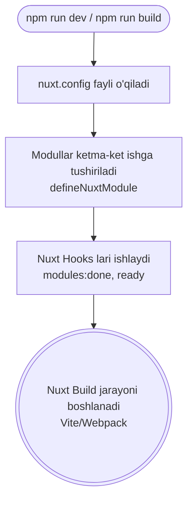

# Modules

## Kirish

> [!IMPORTANT]
> **Nima uchun muhim?**  
> Plaginlar (Plugins) faqat mijozning brauzeriga yetib borganidan keyingina ishlay boshlaydi (Runtime). Ammo siz shunday bir kutubxona yasamoqchisizki, u kodlaringizni qurish jarayonida (Build time) fayllarni yaratib berishi, Vue komponentlarini avto-import qilib qo'yishi, yoki Nuxt ni qanday ishlashini o'zgartirishi kerak. Bunga Plaginlar orqali erishib bo'lmaydi. **Modules (Modullar)** shu maqsadda — Nuxt'ning qurish (build) jarayoniga aralashish va uni kengaytirish uchun ishlatiladi. Masalan: `@nuxtjs/tailwindcss`, `@nuxtjs/i18n`, `@pinia/nuxt` kabilarning hammasi Modullardir.

> [!NOTE]
> **Real-hayot analogiyasi: "Zavod va Aksessuar"**  
> - **Plaginlar (Aksessuar):** Mashina yig'ilib bo'ldi, endi uni ichiga gul va xushbo'y hid beruvchi sprey sepib qo'ydingiz (Mashina ishlashiga tayyor bo'lganidan keyingi qadam - Runtime).
> - **Modullar (Zavod):** Mashina yig'ilayotgan konveyer liniyasiga aralashib, zavod stanoklarini o'zgartirib, mashina dvigatelini kuchaytirish jarayoni (Build time).

## Nazariya

### Module Nima?

Module - Nuxt app build vaqtida ishga tushadigan kod. Runtime'da emas, balki build/dev vaqtida configuration va functionality qo'shadi.

### Module vs Plugin

| Xususiyat | Module (Modul) | Plugin (Plagin) |
| --- | --- | --- |
| **Qachon ishlaydi?** | Build time (npm run dev/build paytida) | Runtime (Browser/Serverda dastur ishga tushganda) |
| **Nima qila oladi?** | Nuxt configuration'ni kengaytiradi, avto-importlar qo'shadi, papkalar yaratadi | Vue app instance'ga globallar qo'shadi (Provide/Inject) |
| **Qanday yoziladi?** | `defineNuxtModule()` orqali Node.js muhitida ishlaydi | `defineNuxtPlugin()` orqali Browser/Node da ishlaydi |

### Module Lifecycle



### Module Categories

```
┌─────────────────────────────────────────────────────────────┐
│                    Module Categories                         │
├─────────────────────────────────────────────────────────────┤
│                                                              │
│  1. OFFICIAL MODULES                                        │
│     @nuxt/content, @nuxt/image, @nuxt/fonts                 │
│     @nuxtjs/tailwindcss, @nuxtjs/color-mode                 │
│                                                              │
│  2. COMMUNITY MODULES                                       │
│     @pinia/nuxt, @vueuse/nuxt, nuxt-icon                    │
│     @nuxtjs/i18n, @nuxtjs/google-fonts                      │
│                                                              │
│  3. LOCAL MODULES                                           │
│     modules/analytics.ts                                    │
│     Loyiha-specific functionality                           │
│                                                              │
│  4. INLINE MODULES                                          │
│     nuxt.config.ts ichida aniqlangan                        │
│                                                              │
└─────────────────────────────────────────────────────────────┘
```

## Kod Misollari

### Module Ishlatish

```typescript
// nuxt.config.ts
export default defineNuxtConfig({
  modules: [
    // NPM modules
    '@nuxt/content',
    '@nuxt/image',
    '@nuxtjs/tailwindcss',
    '@pinia/nuxt',

    // With options
    ['@nuxtjs/google-fonts', {
      families: {
        Roboto: [400, 700]
      }
    }],

    // Local module
    './modules/analytics'
  ]
})
```

### Basic Local Module

```typescript
// modules/analytics.ts
import { defineNuxtModule, addPlugin, createResolver } from '@nuxt/kit'

export default defineNuxtModule({
  // Module metadata
  meta: {
    name: 'analytics',
    configKey: 'analytics', // nuxt.config.analytics
    compatibility: {
      nuxt: '^3.0.0'
    }
  },

  // Default options
  defaults: {
    enabled: true,
    trackingId: ''
  },

  // Setup function
  setup(options, nuxt) {
    // Skip if disabled
    if (!options.enabled) return

    const resolver = createResolver(import.meta.url)

    // Add plugin
    addPlugin(resolver.resolve('./runtime/plugin'))

    // Extend config
    nuxt.options.runtimeConfig.public.analytics = {
      trackingId: options.trackingId
    }

    console.log('Analytics module loaded!')
  }
})
```

```typescript
// modules/runtime/plugin.ts
export default defineNuxtPlugin(() => {
  const config = useRuntimeConfig()

  if (process.client && config.public.analytics.trackingId) {
    // Initialize analytics
    console.log('Analytics initialized:', config.public.analytics.trackingId)
  }
})
```

```typescript
// nuxt.config.ts
export default defineNuxtConfig({
  modules: ['./modules/analytics'],

  analytics: {
    enabled: true,
    trackingId: 'GA-XXXXX'
  }
})
```

### Module with Auto-Imports

```typescript
// modules/api/index.ts
import {
  defineNuxtModule,
  addImports,
  addImportsDir,
  createResolver
} from '@nuxt/kit'

export default defineNuxtModule({
  meta: {
    name: 'api-module',
    configKey: 'api'
  },

  defaults: {
    baseURL: '/api'
  },

  setup(options, nuxt) {
    const resolver = createResolver(import.meta.url)

    // Auto-import single composable
    addImports({
      name: 'useApi',
      from: resolver.resolve('./runtime/composables/useApi')
    })

    // Auto-import directory
    addImportsDir(resolver.resolve('./runtime/composables'))

    // Store options in runtime config
    nuxt.options.runtimeConfig.public.api = options
  }
})
```

```typescript
// modules/api/runtime/composables/useApi.ts
export function useApi() {
  const config = useRuntimeConfig()

  const fetch = async <T>(url: string, options = {}): Promise<T> => {
    return await $fetch<T>(`${config.public.api.baseURL}${url}`, options)
  }

  return {
    get: <T>(url: string) => fetch<T>(url),
    post: <T>(url: string, body: unknown) =>
      fetch<T>(url, { method: 'POST', body }),
    put: <T>(url: string, body: unknown) =>
      fetch<T>(url, { method: 'PUT', body }),
    delete: (url: string) => fetch(url, { method: 'DELETE' })
  }
}
```

### Module with Components

```typescript
// modules/ui/index.ts
import {
  defineNuxtModule,
  addComponent,
  addComponentsDir,
  createResolver
} from '@nuxt/kit'

export default defineNuxtModule({
  meta: {
    name: 'ui-module',
    configKey: 'ui'
  },

  defaults: {
    prefix: 'Ui'
  },

  setup(options, nuxt) {
    const resolver = createResolver(import.meta.url)

    // Add single component
    addComponent({
      name: `${options.prefix}Button`,
      filePath: resolver.resolve('./runtime/components/Button.vue')
    })

    // Add all components from directory
    addComponentsDir({
      path: resolver.resolve('./runtime/components'),
      prefix: options.prefix
    })
  }
})
```

```vue
<!-- modules/ui/runtime/components/Button.vue -->
<script setup lang="ts">
defineProps<{
  variant?: 'primary' | 'secondary'
  size?: 'sm' | 'md' | 'lg'
}>()
</script>

<template>
  <button :class="['btn', `btn--${variant}`, `btn--${size}`]">
    <slot />
  </button>
</template>
```

### Module with Hooks

```typescript
// modules/seo/index.ts
import { defineNuxtModule, addPlugin, createResolver } from '@nuxt/kit'

export default defineNuxtModule({
  meta: {
    name: 'seo-module',
    configKey: 'seo'
  },

  defaults: {
    siteName: 'My Site',
    defaultTitle: 'Welcome'
  },

  setup(options, nuxt) {
    const resolver = createResolver(import.meta.url)

    // Hook: Extend pages
    nuxt.hook('pages:extend', (pages) => {
      // Add sitemap page
      pages.push({
        name: 'sitemap',
        path: '/sitemap',
        file: resolver.resolve('./runtime/pages/sitemap.vue')
      })
    })

    // Hook: Before build
    nuxt.hook('build:before', () => {
      console.log('SEO: Preparing build...')
    })

    // Hook: Nitro config
    nuxt.hook('nitro:config', (nitroConfig) => {
      // Add server routes
      nitroConfig.handlers = nitroConfig.handlers || []
      nitroConfig.handlers.push({
        route: '/robots.txt',
        handler: resolver.resolve('./runtime/server/robots.txt')
      })
    })

    // Hook: Vite config
    nuxt.hook('vite:extendConfig', (viteConfig) => {
      // Extend Vite config
    })

    // Add runtime config
    nuxt.options.runtimeConfig.public.seo = options
  }
})
```

### Module with Server Routes

```typescript
// modules/api-generator/index.ts
import {
  defineNuxtModule,
  addServerHandler,
  createResolver
} from '@nuxt/kit'

export default defineNuxtModule({
  meta: {
    name: 'api-generator',
    configKey: 'apiGenerator'
  },

  defaults: {
    prefix: '/api/generated'
  },

  setup(options, nuxt) {
    const resolver = createResolver(import.meta.url)

    // Add server handler
    addServerHandler({
      route: `${options.prefix}/health`,
      handler: resolver.resolve('./runtime/server/health')
    })

    addServerHandler({
      route: `${options.prefix}/stats`,
      handler: resolver.resolve('./runtime/server/stats')
    })

    // Dynamic routes
    addServerHandler({
      route: `${options.prefix}/:entity`,
      handler: resolver.resolve('./runtime/server/entity')
    })
  }
})
```

```typescript
// modules/api-generator/runtime/server/health.ts
export default defineEventHandler(() => {
  return {
    status: 'ok',
    timestamp: new Date().toISOString()
  }
})
```

### Inline Module

```typescript
// nuxt.config.ts
export default defineNuxtConfig({
  modules: [
    // Inline module function
    (options, nuxt) => {
      // Simple inline module
      nuxt.hook('ready', () => {
        console.log('Nuxt is ready!')
      })
    },

    // Inline with defineNuxtModule
    defineNuxtModule({
      setup(options, nuxt) {
        nuxt.hook('pages:extend', (pages) => {
          // Modify pages
        })
      }
    })
  ]
})
```

### Advanced Module: Full Example

```typescript
// modules/auth/index.ts
import {
  defineNuxtModule,
  addPlugin,
  addImports,
  addServerHandler,
  addRouteMiddleware,
  createResolver,
  addTemplate
} from '@nuxt/kit'
import { defu } from 'defu'

export interface ModuleOptions {
  enabled: boolean
  loginPath: string
  logoutPath: string
  redirectPath: string
  cookieName: string
  cookieMaxAge: number
}

export default defineNuxtModule<ModuleOptions>({
  meta: {
    name: '@my/auth-module',
    configKey: 'auth',
    compatibility: {
      nuxt: '^3.0.0'
    }
  },

  defaults: {
    enabled: true,
    loginPath: '/login',
    logoutPath: '/logout',
    redirectPath: '/dashboard',
    cookieName: 'auth_token',
    cookieMaxAge: 60 * 60 * 24 * 7 // 7 days
  },

  setup(options, nuxt) {
    if (!options.enabled) {
      console.log('Auth module disabled')
      return
    }

    const resolver = createResolver(import.meta.url)

    // 1. Add composables
    addImports([
      {
        name: 'useAuth',
        from: resolver.resolve('./runtime/composables/useAuth')
      },
      {
        name: 'useAuthState',
        from: resolver.resolve('./runtime/composables/useAuth')
      }
    ])

    // 2. Add plugin
    addPlugin({
      src: resolver.resolve('./runtime/plugin'),
      mode: 'all' // 'client' | 'server' | 'all'
    })

    // 3. Add middleware
    addRouteMiddleware({
      name: 'auth',
      path: resolver.resolve('./runtime/middleware/auth')
    })

    // 4. Add server routes
    addServerHandler({
      route: '/api/auth/login',
      method: 'post',
      handler: resolver.resolve('./runtime/server/api/login.post')
    })

    addServerHandler({
      route: '/api/auth/logout',
      method: 'post',
      handler: resolver.resolve('./runtime/server/api/logout.post')
    })

    addServerHandler({
      route: '/api/auth/me',
      method: 'get',
      handler: resolver.resolve('./runtime/server/api/me.get')
    })

    // 5. Generate types
    addTemplate({
      filename: 'types/auth.d.ts',
      getContents: () => `
        declare module '#auth' {
          export interface User {
            id: string
            email: string
            name: string
          }

          export interface AuthState {
            user: User | null
            isAuthenticated: boolean
          }
        }
      `
    })

    // 6. Add runtime config
    nuxt.options.runtimeConfig = defu(nuxt.options.runtimeConfig, {
      auth: {
        secret: process.env.AUTH_SECRET || 'secret'
      },
      public: {
        auth: {
          loginPath: options.loginPath,
          logoutPath: options.logoutPath,
          redirectPath: options.redirectPath,
          cookieName: options.cookieName
        }
      }
    })

    // 7. Extend pages
    nuxt.hook('pages:extend', (pages) => {
      // Could add login/logout pages automatically
    })

    console.log('Auth module loaded successfully!')
  }
})
```

```typescript
// modules/auth/runtime/composables/useAuth.ts
import type { User, AuthState } from '#auth'

export function useAuthState() {
  return useState<AuthState>('auth', () => ({
    user: null,
    isAuthenticated: false
  }))
}

export function useAuth() {
  const state = useAuthState()
  const config = useRuntimeConfig()

  const login = async (email: string, password: string) => {
    const { user, token } = await $fetch('/api/auth/login', {
      method: 'POST',
      body: { email, password }
    })

    // Set cookie
    const cookie = useCookie(config.public.auth.cookieName, {
      maxAge: 60 * 60 * 24 * 7
    })
    cookie.value = token

    state.value = {
      user,
      isAuthenticated: true
    }

    return user
  }

  const logout = async () => {
    await $fetch('/api/auth/logout', { method: 'POST' })

    const cookie = useCookie(config.public.auth.cookieName)
    cookie.value = null

    state.value = {
      user: null,
      isAuthenticated: false
    }

    navigateTo(config.public.auth.loginPath)
  }

  const fetchUser = async () => {
    try {
      const user = await $fetch<User>('/api/auth/me')
      state.value = {
        user,
        isAuthenticated: true
      }
      return user
    } catch {
      state.value = {
        user: null,
        isAuthenticated: false
      }
      return null
    }
  }

  return {
    ...toRefs(state.value),
    login,
    logout,
    fetchUser
  }
}
```

### Noto'g'ri Patterns

```typescript
// NOTO'G'RI: Runtime code module'da
// modules/bad.ts
export default defineNuxtModule({
  setup(options, nuxt) {
    // Bu runtime'da ishlamaydi!
    const user = await fetch('/api/user')
    useState('user', () => user)
  }
})

// TO'G'RI: Plugin orqali runtime code
// modules/good.ts
export default defineNuxtModule({
  setup(options, nuxt) {
    addPlugin(resolver.resolve('./runtime/plugin'))
  }
})
```

```typescript
// NOTO'G'RI: Sync heavy operation
// modules/heavy.ts
export default defineNuxtModule({
  setup(options, nuxt) {
    // Build'ni sekinlashtiradi!
    const data = fs.readFileSync(hugeFile)
    processHeavyData(data)
  }
})

// TO'G'RI: Async va hook'larda
export default defineNuxtModule({
  async setup(options, nuxt) {
    // Async OK
    const data = await fs.promises.readFile(file)

    // Yoki hook'da
    nuxt.hook('build:before', async () => {
      // Heavy work
    })
  }
})
```

## Real-World Cases

### Case 1: Icon Module

```typescript
// modules/icons/index.ts
import {
  defineNuxtModule,
  addComponent,
  createResolver
} from '@nuxt/kit'
import { readFileSync } from 'fs'
import { join } from 'path'

export default defineNuxtModule({
  meta: {
    name: 'icons-module',
    configKey: 'icons'
  },

  defaults: {
    path: 'assets/icons',
    prefix: 'Icon'
  },

  setup(options, nuxt) {
    const resolver = createResolver(import.meta.url)
    const iconsDir = join(nuxt.options.srcDir, options.path)

    // Scan icons directory
    const icons = fs.readdirSync(iconsDir)
      .filter(f => f.endsWith('.svg'))
      .map(f => f.replace('.svg', ''))

    // Generate component for each icon
    icons.forEach(icon => {
      const componentName = `${options.prefix}${pascalCase(icon)}`
      const svgContent = readFileSync(join(iconsDir, `${icon}.svg`), 'utf-8')

      addTemplate({
        filename: `icons/${icon}.vue`,
        getContents: () => `
          <template>
            ${svgContent.replace('<svg', '<svg v-bind="$attrs"')}
          </template>
          <script setup>
          defineOptions({ inheritAttrs: false })
          </script>
        `
      })

      addComponent({
        name: componentName,
        filePath: `#build/icons/${icon}.vue`
      })
    })

    console.log(`Registered ${icons.length} icons`)
  }
})
```

### Case 2: Feature Flags Module

```typescript
// modules/feature-flags/index.ts
import {
  defineNuxtModule,
  addPlugin,
  addImports,
  createResolver
} from '@nuxt/kit'

interface FeatureFlag {
  name: string
  enabled: boolean
  percentage?: number
}

export default defineNuxtModule<{
  flags: FeatureFlag[]
  endpoint?: string
}>({
  meta: {
    name: 'feature-flags',
    configKey: 'featureFlags'
  },

  defaults: {
    flags: [],
    endpoint: '/api/feature-flags'
  },

  setup(options, nuxt) {
    const resolver = createResolver(import.meta.url)

    // Add composable
    addImports({
      name: 'useFeatureFlag',
      from: resolver.resolve('./runtime/composables')
    })

    // Add plugin for initialization
    addPlugin(resolver.resolve('./runtime/plugin'))

    // Store flags in runtime config
    nuxt.options.runtimeConfig.public.featureFlags = {
      flags: options.flags,
      endpoint: options.endpoint
    }

    // Add server route for dynamic flags
    if (options.endpoint) {
      addServerHandler({
        route: options.endpoint,
        handler: resolver.resolve('./runtime/server/flags')
      })
    }
  }
})
```

```typescript
// modules/feature-flags/runtime/composables.ts
export function useFeatureFlag(name: string) {
  const flags = useState<Record<string, boolean>>('feature-flags')
  return computed(() => flags.value?.[name] ?? false)
}

export function useFeatureFlags() {
  const flags = useState<Record<string, boolean>>('feature-flags')
  const config = useRuntimeConfig()

  const refresh = async () => {
    if (config.public.featureFlags.endpoint) {
      const data = await $fetch(config.public.featureFlags.endpoint)
      flags.value = data
    }
  }

  const isEnabled = (name: string) => flags.value?.[name] ?? false

  return {
    flags: readonly(flags),
    isEnabled,
    refresh
  }
}
```

### Case 3: Logger Module

```typescript
// modules/logger/index.ts
import {
  defineNuxtModule,
  addPlugin,
  addServerPlugin,
  createResolver
} from '@nuxt/kit'

export default defineNuxtModule({
  meta: {
    name: 'logger-module',
    configKey: 'logger'
  },

  defaults: {
    level: 'info',
    prefix: '[App]'
  },

  setup(options, nuxt) {
    const resolver = createResolver(import.meta.url)

    // Client logger plugin
    addPlugin({
      src: resolver.resolve('./runtime/plugin.client'),
      mode: 'client'
    })

    // Server logger plugin
    addServerPlugin(resolver.resolve('./runtime/server-plugin'))

    // Runtime config
    nuxt.options.runtimeConfig.public.logger = options

    // Hook: Log build info
    nuxt.hook('build:done', () => {
      console.log(`${options.prefix} Build completed`)
    })

    // Hook: Log errors
    nuxt.hook('vue:error', (error) => {
      console.error(`${options.prefix} Vue Error:`, error)
    })
  }
})
```

## Popular Nuxt Modules

### @nuxt/content

```typescript
// nuxt.config.ts
export default defineNuxtConfig({
  modules: ['@nuxt/content'],

  content: {
    highlight: {
      theme: 'github-dark'
    },
    markdown: {
      toc: { depth: 3 }
    }
  }
})
```

```vue
<!-- pages/blog/[...slug].vue -->
<script setup>
const { data: article } = await useAsyncData(
  `blog-${route.path}`,
  () => queryContent(route.path).findOne()
)
</script>

<template>
  <article>
    <ContentRenderer :value="article" />
  </article>
</template>
```

### @nuxt/image

```typescript
// nuxt.config.ts
export default defineNuxtConfig({
  modules: ['@nuxt/image'],

  image: {
    quality: 80,
    format: ['webp', 'avif'],
    screens: {
      sm: 640,
      md: 768,
      lg: 1024,
      xl: 1280
    }
  }
})
```

```vue
<template>
  <NuxtImg
    src="/hero.jpg"
    width="800"
    height="600"
    loading="lazy"
    placeholder
  />

  <NuxtPicture
    src="/banner.jpg"
    :imgAttrs="{ class: 'rounded-lg' }"
  />
</template>
```

### @pinia/nuxt

```typescript
// nuxt.config.ts
export default defineNuxtConfig({
  modules: ['@pinia/nuxt'],

  pinia: {
    storesDirs: ['./stores/**']
  }
})
```

```typescript
// stores/user.ts
export const useUserStore = defineStore('user', () => {
  const user = ref<User | null>(null)

  const fetchUser = async () => {
    user.value = await $fetch('/api/user')
  }

  return {
    user,
    fetchUser
  }
})
```

## Interview Savollari

### Savol 1: Nuxt module nima va plugin'dan farqi?

**Javob:**

**Module:**
- Build time'da ishlaydi
- Nuxt configuration'ni o'zgartiradi
- Auto-imports, components, plugins qo'shadi
- Hook'lar orqali build process'ga ta'sir qiladi
- Publish qilib, boshqa loyihalarda ishlatish mumkin

**Plugin:**
- Runtime'da ishlaydi
- Vue app'ga functionality qo'shadi
- Provide/inject, directives, global components
- Faqat shu loyihada ishlaydi

```typescript
// Module - build time
export default defineNuxtModule({
  setup(options, nuxt) {
    // Nuxt config o'zgaradi
    addPlugin(...)      // Plugin qo'shadi
    addComponent(...)   // Component qo'shadi
    addImports(...)     // Auto-import qo'shadi
  }
})

// Plugin - runtime
export default defineNuxtPlugin((nuxtApp) => {
  // Vue app'ga qo'shiladi
  return { provide: { api } }
})
```

### Savol 2: Module qanday yaratiladi?

**Javob:**

```typescript
// modules/my-module/index.ts
import { defineNuxtModule, createResolver } from '@nuxt/kit'

export default defineNuxtModule({
  // 1. Metadata
  meta: {
    name: 'my-module',
    configKey: 'myModule',
    compatibility: { nuxt: '^3.0.0' }
  },

  // 2. Default options
  defaults: {
    enabled: true,
    option1: 'value'
  },

  // 3. Setup function
  setup(options, nuxt) {
    const resolver = createResolver(import.meta.url)

    // Add functionality
    addPlugin(resolver.resolve('./runtime/plugin'))
    addImports({ name: 'useMyHook', from: '...' })

    // Use hooks
    nuxt.hook('pages:extend', (pages) => {
      // Modify pages
    })
  }
})
```

### Savol 3: Module hooks qanday ishlaydi?

**Javob:**

```typescript
export default defineNuxtModule({
  setup(options, nuxt) {
    // Config phase
    nuxt.hook('modules:done', () => {
      console.log('All modules loaded')
    })

    // Build phase
    nuxt.hook('build:before', () => {
      console.log('Build starting')
    })

    nuxt.hook('build:done', () => {
      console.log('Build complete')
    })

    // Pages
    nuxt.hook('pages:extend', (pages) => {
      pages.push({ name: 'custom', path: '/custom', file: '...' })
    })

    // Components
    nuxt.hook('components:extend', (components) => {
      // Modify components
    })

    // Vite
    nuxt.hook('vite:extendConfig', (config) => {
      // Modify Vite config
    })

    // Nitro
    nuxt.hook('nitro:config', (config) => {
      // Modify Nitro config
    })
  }
})
```

### Savol 4: @nuxt/kit nima?

**Javob:**

`@nuxt/kit` - module yaratish uchun utility library:

```typescript
import {
  // Module definition
  defineNuxtModule,

  // Resolvers
  createResolver,
  resolvePath,

  // Adding functionality
  addPlugin,
  addComponent,
  addComponentsDir,
  addImports,
  addImportsDir,
  addServerHandler,
  addRouteMiddleware,

  // Templates
  addTemplate,
  addTypeTemplate,

  // Config
  extendViteConfig,
  extendWebpackConfig,

  // Utilities
  useLogger,
  useNuxt
} from '@nuxt/kit'
```

### Savol 5: Module'ni NPM'ga publish qilish?

**Javob:**

```
my-nuxt-module/
├── src/
│   ├── module.ts          # Module definition
│   └── runtime/           # Runtime code
│       ├── plugin.ts
│       ├── composables/
│       └── components/
├── playground/            # Test app
│   ├── nuxt.config.ts
│   └── app.vue
├── package.json
├── tsconfig.json
└── README.md
```

```json
// package.json
{
  "name": "@my/nuxt-module",
  "version": "1.0.0",
  "type": "module",
  "exports": {
    ".": {
      "import": "./dist/module.mjs",
      "require": "./dist/module.cjs"
    }
  },
  "main": "./dist/module.cjs",
  "types": "./dist/types.d.ts",
  "files": ["dist"],
  "scripts": {
    "build": "nuxt-module-build",
    "dev": "nuxi dev playground",
    "prepublishOnly": "npm run build"
  },
  "dependencies": {
    "@nuxt/kit": "^3.0.0"
  },
  "devDependencies": {
    "@nuxt/module-builder": "latest",
    "nuxt": "^3.0.0"
  }
}
```

## Best Practices

### 1. Module Structure

```
modules/
└── my-module/
    ├── index.ts           # Module definition
    └── runtime/           # Runtime code
        ├── plugin.ts
        ├── composables/
        │   └── useFeature.ts
        ├── components/
        │   └── Component.vue
        └── server/
            └── api/
                └── endpoint.ts
```

### 2. Options Validation

```typescript
import { z } from 'zod'

const optionsSchema = z.object({
  enabled: z.boolean().default(true),
  apiKey: z.string().min(1),
  endpoint: z.string().url().optional()
})

export default defineNuxtModule({
  setup(rawOptions, nuxt) {
    const options = optionsSchema.parse(rawOptions)
    // Use validated options
  }
})
```

### 3. Proper Logging

```typescript
import { useLogger } from '@nuxt/kit'

export default defineNuxtModule({
  setup(options, nuxt) {
    const logger = useLogger('my-module')

    logger.info('Module loaded')
    logger.warn('Deprecated option used')
    logger.error('Configuration error')
  }
})
```

### 4. Compatibility

```typescript
export default defineNuxtModule({
  meta: {
    compatibility: {
      nuxt: '^3.0.0',
      bridge: false
    }
  },

  setup(options, nuxt) {
    // Check Nuxt version
    const nuxtVersion = nuxt.options._majorVersion

    if (nuxtVersion < 3) {
      throw new Error('This module requires Nuxt 3')
    }
  }
})
```

---

## Eng Yaxshi Amaliyotlar (Best Practices)

1. **`@nuxt/kit` dan to'liq foydalaning:** Modul yozayotganda standart Node.js asboblaridan ko'ra, har doim Nuxt jamoasi yaratgan `@nuxt/kit` ni ishlating (masalan fayl yaratish, plagin qo'shish kabi ishlar uchun u xavfsiz va kafolatlangan usul).
2. **Kodni ikkiga ajrating:** Modul kodi faqat build time da ishlashi kerak. Agar modul dastur runtime da nimanidir ko'rsatishi (masalan, Component) kutilsa, uni runtime jildiga olib, `addPlugin` yoki `addComponent` orqali moduldan turib chaqirib qo'ying. Hech qachon brauzer kodini modulni asosiy qismida yozmang.
3. **Konfliktlardan himoyalaning:** Modulingiz konfiguratsiya opsiyalarini va qo'shilgan plaginlar nomini takrorlanmas qiling. Boshqa uchinchi tomon modullari bilan to'qnash kelib qolmasligi uchun modul ismingizni prevfiks (prefix) sifatida qo'shing.

---

## Xulosa

## Xulosa

| Tushuncha | Modul (Module) | Plagin (Plugin) |
|-----------|----------------|-----------------|
| **Qachon ishlashi?** | Build vaqtida (npm run dev/build) | Dastur ishlash vaqtida (Runtime) |
| **Qanday yoziladi?** | `defineNuxtModule()` orqali | `defineNuxtPlugin()` orqali |
| **Asosiy maqsadi** | Nuxt imkoniyatlarini kengaytirish (Avto-importlar, Papkalar avtomatizatsiyasi) | Tayyor loyihaga Global holatlar qo'shish |
| **Misol** | `@nuxtjs/tailwindcss`, `@pinia/nuxt` | `Google Analytics`, `v-tooltip` direktivasi |

Module vs Plugin farqini tushunish o'ta muhim. Modullar Nuxt loyihasining yuragiga o'zgartirish kiritib, Dasturchining ishlash tezligini (Developer Experience) oshirishga yordam beradi. Oddiy mantiq yoki kichik API integratsiyalari uchun plagin yetarli, lekin Vue/Nuxt tizimini avtomatlashtirish kerak bo'lsa - Modul yoziladi.
