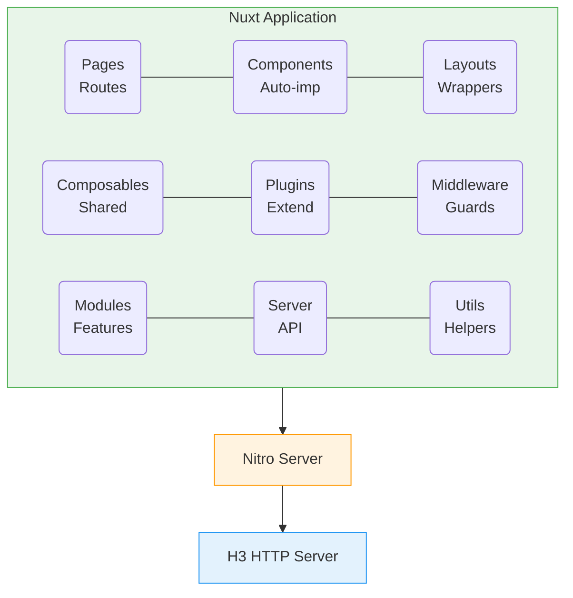

# Nuxt.js Ecosystem

## Kirish

> [!IMPORTANT]
> **Nima uchun muhim?**  
> Oddiy Vue.js bitta sahifali dastur (Single Page Application - SPA) yaratadi, ya'ni brauzer saytga kirganda oldin bo'sh oq ekran (HTML) yuklab olinadi, keyin esa JavaScript orqali butun sahifa chizib chiqiladi. Bu qidiruv tizimlari (Google SEO) va dastlabki yuklanish tezligi uchun yomon. **Nuxt.js** ushbu muammoni Server-Side Rendering (SSR) va Static Site Generation (SSG) yordamida hal qiladi. Ya'ni, sahifa HTML si serverda tayyorlanib, foydalanuvchiga tayyor holda yuboriladi.

> [!NOTE]
> **Real-hayot analogiyasi: "IKEA Mebellari vs Tayyor Mebellar"**  
> - **Vue.js (SPA):** IKEA dan mebel sotib oldingiz. Uyga qutini olib kelasiz (HTML), u ichida bo'laklar va yig'ish qo'llanmasi (JavaScript) bor. Uni o'zingiz yig'ib chiqishingiz kerak (Sahifa sekin chiziladi).
> - **Nuxt.js (SSR):** Do'konga tayyor yig'ilgan mebel buyurtma qildingiz. Uyingizga shundoq tayyor holda keladi (Tez va darhol foydalanishga tayyor HTML).

---

## 🟢 Junior (Asoslar va Tushunchalar)

### Nuxt.js nima o'zi?
Nuxt.js - bu Vue.js ustiga qurilgan, veb-dasturlarni yaratishni qulaylashtiruvchi freymvork. U asosan serverda render qilish (SSR) va static saytlar (SSG) yaratish uchun ishlatiladi. Vue.js da siz hamma narsani (router, vuex/pinia, webpack) o'zingiz sozlab chiqishingiz kerak bo'lsa, Nuxt.js bularning hammasini avtomatik sozlab, "qutidan tayyor" (out of the box) holatda beradi.

### Vue.js vs Nuxt.js

| Xususiyat | Vue.js (SPA) | Nuxt.js (Universal) |
| --- | --- | --- |
| **Rendering** | Client-side rendering (Faqat Brauzerda) | SSR / SSG / CSR / ISR |
| **Routing** | Qo'lda sozlanadigan Router | Papkalarga asoslangan (File-based) |
| **SEO Meta Teglar** | Qo'lda qo'shiladi | `useHead` / `useSeoMeta` orqali SEO do'stona |
| **Code Splitting** | Qo'lda optimizatsiya qilinadi | Avtomatik optimizatsiya |
| **Backend API** | Server mantiqlari yo'q (Faqat Frontend) | Server routelar / API mavjud |

### Papkalar Strukturasi (Folder Structure)
Nuxt 3 o'zining maxsus papkalar tuzilishiga ega. Har bir papka o'z vazifasini bajaradi:

```
my-nuxt-app/
├── components/            # Vue komponentlar (Avtomatik import bo'ladi)
├── composables/           # Umumiy funksiyalar va hooklar (Avtomatik import)
├── layouts/               # Umumiy sahifa qoliplari (Header, Footer)
├── pages/                 # Har bir Vue fayl avtomatik URL manzilga aylanadi
├── plugins/               # Ilova yuklanishidan oldin ishlaydigan kodlar (Masalan, Analytics)
├── public/                # Rasm, font va statik fayllar (Build jarayonidan o'tmaydi)
├── server/                # Backend API yozish uchun (Nuxt ichidagi backend)
├── nuxt.config.ts         # Butun loyihaning sozlamalari
└── app.vue                # Dasturning asosiy komponenti
```

---

## 🟡 Middle (Amaliyot va Detallar)

### Rendering Strategiyalari
Loyihaning maqsadiga qarab turli xil qurish turlarini tanlashingiz mumkin:

| Strategiya | Qurish (Build) Vaqtidagi Jarayon | Ishlash (Runtime) Vaqtidagi Jarayon |
| --- | --- | --- |
| **SSG (Static)** | Barcha sahifalar HTML ga aylantiriladi | Server kerak emas (CDN orqali uzatiladi) |
| **SSR (Server)** | Bajarilmaydi | Har bir so'rov uchun HTML serverda generatsiya qilinadi |
| **CSR (Client)** | Bo'sh HTML va JS fayllar | JavaScript brauzerda sahifani shakllantiradi |
| **ISR (Incremental)**| Boshlang'ich HTML generatsiya qilinadi | Belgilangan o'sha HTML fayl ma'lum vaqtdan so'ng (interval) fonda yangilanadi |

### Nuxt 3 Arxitekturasi (Qanday ishlaydi?)



Nuxt orqa fonda **Nitro** nomli kuchli dvigateldan foydalanadi. Nitro o'z navbatida H3 deb ataluvchi juda yengil va tezkor HTTP serverga tayanadi. Bularning bari siz yozgan kodni nafaqat Node.js da, balki Vercel, Cloudflare Workers kabi istalgan muhitda ishlashiga sharoit yaratadi.

### Auto-Imports (Avtomatik Yuklash)
Siz Vue da har doim `import { ref } from 'vue'` yoki `import MyButton from './MyButton.vue'` qilishingiz kerak. Nuxt 3 da bularning bari avtomatlashtirilgan.
- Barcha Vue composition API lari (`ref`, `computed`, `watch`) o'zi keladi.
- `components/` ichidagi hamma komponentlar o'zi keladi.
- `composables/` ichidagi funksiyalar o'zi keladi.

```vue
<!-- components/MyButton.vue bor deb faraz qilamiz -->
<template>
  <MyButton /> <!-- Hech qanday import shart emas! -->
</template>

<script setup>
const count = ref(0) // ref() ni ham import qilish shart emas!
</script>
```

---

## 🔴 Senior (Arxitektura va Optimizatsiya)

### Real-World Use Cases (Qachon qaysi strategiya tanlanadi?)

**1. E-commerce (SSR + ISR)**
- Product pages: ISR (Aytaylik narxlar tez-tez o'zgaradi, shunga 1 soatda 1 marta yangilansa yetadi)
- Category pages: SSR (Juda ko'p filtrlar bor, real-time inventory kerak)
- Static pages: SSG (Biz haqimizda, Kontaktlar kabi sahifalar o'zgarmaydi)

**2. Dashboard / Admin Panel (CSR + SSR)**
- Login sahifasi: SSR (Tezkor va SEO uchun ochiq)
- Dashboard ichi: CSR (U yerni qidiruv tizimlari indekslamaydi. SPA behavior yaxshiroq)

**3. Blog yoki Dokumentatsiya (SSG)**
- Barcha sahifalar build vaqtida HTML qilinadi.
- Hech qanday server kerak emas (Arzon va juda tez).

### Muhim Nuxt Composables (Hooklar)

```typescript
// Ma'lumotlarni serverdan tortish uchun ishlatiladigan maxsus funksiyalar
useFetch('/api/users') // Komponent yuklanganda ishlaydi, SSR da xavfsiz.
useAsyncData('users', () => $fetch('/api/users')) // Key'ga asoslangan qiyin asinxron ishlarda

// Davlat (State) bilan ishlash
useState('counter', () => 0) // SSR da xavfsiz state (Server va Client bir xil ma'lumot ko'radi)
useCookie('auth_token') // Cookie larni oson o'qish va yozish
```

### Intervyu Savollari (Qiyin daraja)
**1. Nuxt dagi Auto-import jarayoni dasturning yakuniy hajmi (Bundle size) ni oshirib yubormaydimi?**
*Javob:* Yo'q, oshirmaydi. Nuxt Tree-shaking (Qurib qolgan shoxlarni kesish) texnologiyasidan foydalanadi. U faqatgina fayl ichida aniq ishlatilgan komponent va funksiyalarnigina yakuniy kodga qoshib beradi.

**2. SSR va SSG ning farqi nimada va Hydration tushunchasi bularga qanday bog'lanadi?**
*Javob:* SSR da har bir so'rov kelganida server qaytadan HTML tayyorlaydi. SSG da HTML lar bir marta qurish jarayonida tayyorlanadi va so'rov kelganda shunchaki uzatiladi xolos. Hydration esa o'sha "o'lik" tayyor HTML brauzerga borgandan so'ng, unga Vue reaktivligini va Event Listener larni "jonlantirib" (suv berib) qo'shish jarayonidir.

**3. Nimaga brauzerning `window` yoki `document` obyektlarini Nuxt dagi `created` yoki ochiq `setup` hooklarida ishlatib bo'lmaydi?**
*Javob:* Chunki Nuxt ularni birinchi bo'lib Serverda ishga tushiradi (SSR). Server - bu Node.js muhiti. Node.js da esa ekran (window) va sahifa (document) umuman mavjud emas. Ularni faqat sahifa brauzerga borib tushgandan so'ng, ya'ni `onMounted` ichida, yoki maxsus `<ClientOnly>` yordamida ishlatish mumkin.

---

## Eng Yaxshi Amaliyotlar (Best Practices)

1. **Auto-importlarga ishonish:** Nuxt da komponentlar, composables va plaginlarni har bir faylda `import` qilish shart emas. Nuxt buni o'zi amalga oshiradi. Bunga tezroq ko'nikish kodni toza va ixcham qiladi.
2. **"To'g'ri Papka" qoidasi:** Har qanday mantiqni to'g'ri joyga joylashtiring. Kichik qismlar - `components/`, global logika - `composables/`, 3-tomon plaginlari - `plugins/`, backend - `server/`.
3. **SSR va CSR ni farqlash:** Brauzer API laridan (`window`, `localStorage`) faqat SSR jarayoni yakunlangandan so'ng (`onMounted` da) foydalaning, yoki `<ClientOnly>` komponentidan foydalanib xatolarni oldini oling.

---

## Xulosa

| Nuxt Texnologiyasi | Ma'nosi | Asosiy Foydasi | Qachon ishlatiladi? |
|--------------------|---------|----------------|---------------------|
| **SSR** | Server-Side Rendering | SEO va Tezkor birinchi yuklanish | Bloglar, E-commerce loyihalar, Yangiliklar sayti |
| **SSG** | Static Site Generation | O'ta tez ishlashi, Server kuchi kamligi | Portfoliolar, Qo'llanma saytlari (Documentation) |
| **CSR** | Client-Side Rendering | Serverni qiynamaydi, Oddiy Vue.js usuli | Admin panellar, Dastur ichidagi interfeyslar |
| **ISR / SWR** | Vaqti-vaqti bilan yangilanish | Ma'lumotlarni doimiy yangilab turish | Ob-havo, Birjalar, Yangiliklar bosh sahifasi |

Nuxt.js Vue imkoniyatlarini Frontend doirasidan chiqarib, unga kuchli Full-Stack qobiliyatini qo'shadi. Agar loyihangiz SEO (Qidiruv tizimlari) va Dastlabki tezlikka muhtoj bo'lsa, Nuxt eng to'g'ri tanlovdir.
