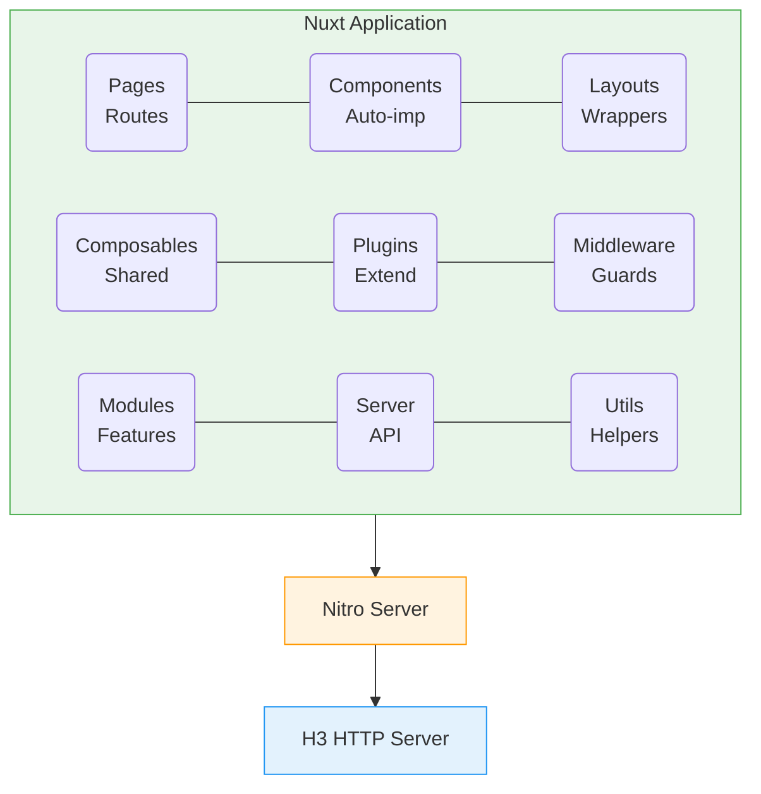

# Nuxt.js Ecosystem

Bu bo'lim Nuxt.js framework'ini chuqur o'rganishga bag'ishlangan. SSR, SSG, CSR farqlaridan tortib, deployment strategiyalarigacha barcha muhim mavzular qamrab olingan.

## Bo'lim Tarkibi

| # | Mavzu | Tavsif |
|---|-------|--------|
| 01 | [SSR vs SSG vs CSR](./01-ssr-ssg-csr.md) | Rendering strategiyalari, farqlari, qachon qaysi birini tanlash |
| 02 | [Hydration](./02-hydration.md) | Hydration mexanizmi, muammolar va yechimlar |
| 03 | [Middleware](./03-middleware.md) | Route middleware, server middleware, global middleware |
| 04 | [Routing](./04-routing.md) | File-based routing, dynamic routes, nested routes |
| 05 | [Plugins](./05-plugins.md) | Plugin yaratish, lifecycle, client/server plugins |
| 06 | [Modules](./06-modules.md) | Module system, custom module yaratish |
| 07 | [Deployment](./07-deployment.md) | Turli platformalarga deploy qilish |

## Nima Uchun Nuxt.js?

> [!IMPORTANT]
> **Nima uchun muhim?**  
> Oddiy Vue.js bitta sahifali dastur (Single Page Application - SPA) yaratadi, ya'ni brauzer saytga kirganda oldin bo'sh oq ekran (HTML) yuklab olinadi, keyin esa JavaScript orqali butun sahifa chizib chiqiladi. Bu qidiruv tizimlari (Google SEO) va dastlabki yuklanish tezligi uchun yomon. **Nuxt.js** ushbu muammoni Server-Side Rendering (SSR) va Static Site Generation (SSG) yordamida hal qiladi. Ya'ni, sahifa HTML si serverda tayyorlanib, foydalanuvchiga tayyor holda yuboriladi.

> [!NOTE]
> **Real-hayot analogiyasi: "IKEA Mebellari vs Tayyor Mebellar"**  
> - **Vue.js (SPA):** IKEA dan mebel sotib oldingiz. Uyga qutini olib kelasiz (HTML), u ichida bo'laklar va yig'ish qo'llanmasi (JavaScript) bor. Uni o'zingiz yig'ib chiqishingiz kerak (Sahifa sekin chiziladi).
> - **Nuxt.js (SSR):** Do'konga tayyor yig'ilgan mebel buyurtma qildingiz. Uyingizga shundoq tayyor holda keladi (Tez va darhol foydalanishga tayyor HTML).

### Vue.js vs Nuxt.js

| Xususiyat | Vue.js (SPA) | Nuxt.js (Universal) |
| --- | --- | --- |
| **Rendering** | Client-side rendering (Faqat Brauzerda) | SSR / SSG / CSR / ISR |
| **Routing** | Qo'lda sozlanadigan Router | Papkalarga asoslangan (File-based) |
| **SEO Meta Teglar** | Qo'lda qo'shiladi | `useHead` / `useSeoMeta` orqali SEO do'stona |
| **Code Splitting** | Qo'lda optimizatsiya qilinadi | Avtomatik optimizatsiya |
| **Backend API** | Server mantiqlari yo'q (Faqat Frontend) | Server routelar / API mavjud |

### Nuxt.js Asosiy Afzalliklari

1. **SEO-friendly** - SSR/SSG orqali to'liq indexlash
2. **Performance** - Automatic code splitting, lazy loading
3. **Developer Experience** - Auto-imports, file-based routing
4. **Flexibility** - SSR, SSG, CSR, ISR - kerakli strategiyani tanlash
5. **Full-stack** - Server routes orqali backend API

## Nuxt 3 Arxitekturasi



## Rendering Strategiyalari Overview

| Strategiya | Qurish (Build) Vaqtidagi Jarayon | Ishlash (Runtime) Vaqtidagi Jarayon |
| --- | --- | --- |
| **SSG (Static)** | Barcha sahifalar HTML ga aylantiriladi | Server kerak emas (CDN orqali uzatiladi) |
| **SSR (Server)** | - | Har bir so'rov uchun HTML serverda generatsiya qilinadi |
| **CSR (Client)** | Bo'sh HTML va JS fayllar | JavaScript brauzerda sahifani shakllantiradi |
| **ISR (Incremental)**| Boshlang'ich HTML generatsiya qilinadi | Belgilangan vaqtdan so'ng (interval) orqa fonda yangilanadi |
| **SWR (Stale-While)**| Keshlangan eski HTML beriladi | Sahifa darhol beriladi va orqa fonda yangilab qo'yiladi |

## Nuxt 3 Folder Structure

```
my-nuxt-app/
├── .nuxt/                 # Build output (gitignore)
├── .output/               # Production build
├── assets/                # Uncompiled assets (SCSS, images)
├── components/            # Auto-imported Vue components
│   ├── base/              # BaseButton.vue, BaseInput.vue
│   ├── feature/           # Feature-specific components
│   └── layout/            # Header.vue, Footer.vue
├── composables/           # Auto-imported composables
│   ├── useAuth.ts
│   └── useApi.ts
├── content/               # Markdown content (Nuxt Content)
├── layouts/               # Page layouts
│   ├── default.vue
│   └── admin.vue
├── middleware/            # Route middleware
│   ├── auth.ts
│   └── admin.ts
├── modules/               # Local Nuxt modules
├── pages/                 # File-based routing
│   ├── index.vue          # /
│   ├── about.vue          # /about
│   └── users/
│       ├── index.vue      # /users
│       └── [id].vue       # /users/:id
├── plugins/               # Nuxt plugins
│   ├── api.ts
│   └── sentry.client.ts
├── public/                # Static files (robots.txt, favicon)
├── server/                # Server-side code
│   ├── api/               # API routes
│   │   └── users.ts       # /api/users
│   ├── middleware/        # Server middleware
│   └── plugins/           # Server plugins
├── utils/                 # Utility functions
├── app.vue                # Root component
├── app.config.ts          # Runtime app config
├── nuxt.config.ts         # Nuxt configuration
└── tsconfig.json          # TypeScript config
```

## O'rganish Tartibi

1. **SSR vs SSG vs CSR** - rendering farqlarini tushunish (asos)
2. **Hydration** - server va client qanday birlashadi
3. **Routing** - Nuxt routing systemasi
4. **Middleware** - route protection va logic
5. **Plugins** - functionality qo'shish
6. **Modules** - Nuxt ecosystem kengaytirish
7. **Deployment** - production'ga chiqarish

## Nuxt 3 vs Nuxt 2 Farqlari

| Feature | Nuxt 2 | Nuxt 3 |
|---------|--------|--------|
| Vue version | Vue 2 | Vue 3 |
| Build tool | Webpack | Vite/Webpack |
| Server engine | Connect | Nitro (H3) |
| TypeScript | Partial | First-class |
| Composition API | Plugin | Native |
| Auto-imports | Limited | Full |
| Rendering modes | SSR/SSG | SSR/SSG/ISR/SWR |
| State management | Vuex | Pinia (native) |

## Real-World Use Cases

### E-commerce (SSR + ISR)
- Product pages: ISR (yangilanishi kerak)
- Category pages: SSR (real-time inventory)
- Static pages: SSG (About, Contact)

### Blog/Marketing (SSG)
- Barcha sahifalar build vaqtida
- CDN orqali tez yuklash
- Nuxt Content moduli

### Dashboard (CSR + SSR)
- Auth pages: SSR
- Dashboard: CSR (SPA behavior)
- Reports: SSR (SEO kerak emas)

### News Portal (ISR)
- Home page: ISR (5 daqiqada yangilash)
- Article pages: ISR (1 soatda yangilash)
- Breaking news: SSR (real-time)

## Interview Tayyorgarlik

Har bir faylda 3-5 ta interview savollari mavjud. Quyidagi mavzular eng ko'p so'raladi:

1. SSR va SSG farqi nima?
2. Hydration nima va qanday muammolar bo'lishi mumkin?
3. Nuxt middleware va Vue navigation guard farqi?
4. Nuxt modules qanday ishlaydi?
5. Universal rendering qanday amalga oshiriladi?

## Muhim Nuxt Composables

```typescript
// Data fetching
useFetch()      // Component-level data fetching
useAsyncData()  // Custom async data
$fetch()        // Direct HTTP requests

// State
useState()      // SSR-friendly reactive state
useCookie()     // Cookie management

// Routing
useRoute()      // Current route info
useRouter()     // Navigation
navigateTo()    // Programmatic navigation

// Head/SEO
useHead()       // Meta tags
useSeoMeta()    // SEO-specific meta

// Runtime
useRuntimeConfig() // Environment variables
useAppConfig()     // App configuration

// Error handling
useError()      // Error state
createError()   // Throw errors
showError()     // Display error page
clearError()    // Clear error
```

## Muhim Links

- [Nuxt 3 Documentation](https://nuxt.com/docs)
- [Nuxt Modules](https://nuxt.com/modules)
- [Nuxt Examples](https://nuxt.com/docs/examples/essentials/hello-world)
- [UnJS Ecosystem](https://unjs.io/)
- [Nitro Documentation](https://nitro.unjs.io/)

---

## Eng Yaxshi Amaliyotlar (Best Practices)

1. **Auto-importlarga ishonish:** Nuxt da komponentlar, composables va plaginlarni har bir faylda `import` qilish shart emas. Nuxt buni o'zi amalga oshiradi. Bunga tezroq ko'nikish kodni toza va ixcham qiladi.
2. **"To'g'ri Papka" qoidasi:** Har qanday mantiqni to'g'ri joyga joylashtiring. Kichik qismlar - `components/`, global logika - `composables/`, 3-tomon plaginlari - `plugins/`, backend - `server/`.
3. **SSR va CSR ni farqlash:** Brauzer API laridan (`window`, `localStorage`) faqat SSR jarayoni yakunlangandan so'ng (`onMounted` da) foydalaning, yoki `<ClientOnly>` komponentidan foydalanib xatolarni oldini oling.

## Xulosa

| Nuxt Texnologiyasi | Ma'nosi | Asosiy Foydasi | Qachon ishlatiladi? |
|--------------------|---------|----------------|---------------------|
| **SSR** | Server-Side Rendering | SEO va Tezkor birinchi yuklanish | Bloglar, E-commerce loyihalar, Yangiliklar sayti |
| **SSG** | Static Site Generation | O'ta tez ishlashi, Server kuchi kamligi | Portfoliolar, Qo'llanma saytlari (Documentation) |
| **CSR** | Client-Side Rendering | Serverni qiynamaydi, Oddiy Vue.js usuli | Admin panellar, Dastur ichidagi interfeyslar |
| **ISR / SWR** | Vaqti-vaqti bilan yangilanish | Ma'lumotlarni doimiy yangilab turish | Ob-havo, Birjalar, Yangiliklar bosh sahifasi |

Nuxt.js Vue imkoniyatlarini Frontend doirasidan chiqarib, unga kuchli Full-Stack qobiliyatini qo'shadi. Agar loyihangiz SEO (Qidiruv tizimlari) va Dastlabki tezlikka muhtoj bo'lsa, Nuxt eng to'g'ri tanlovdir.

**Eslatma:** Har bir mavzuni nazariy o'rganishdan tashqari, real loyihada qo'llash muhim. Kod misollarini local environment'da ishlatib ko'ring.
