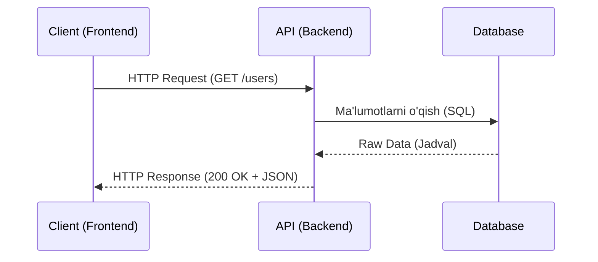

# REST API

## Kirish

> [!IMPORTANT]
> **Nima uchun muhim?**  
> REST API — bu frontend (UI) va backend (Ma'lumotlar bazasi) o'rtasidagi eng asosiy aloqa ko'prigi. Uni to'g'ri tushunmaslik va xato HTTP metodlardan foydalanish, keyinchalik xavfsizlik teshiklari va ma'lumotlar chalkashligiga olib keladi.

> [!NOTE]
> **Real-hayot analogiyasi: "Restoran"**  
> Tasavvur qiling, siz restorandasiz (Client). Oshpaz (Server) oshxonada ishlaydi. Siz oshpaz bilan to'g'ridan-to'g'ri gaplasha olmaysiz. O'rtada ofitsiant (API) bor.
> 1. Siz menyudan ovqat tanlab, ofitsiantga buyurtma berasiz (Request).
> 2. Ofitsiant oshxonaga borib tayyorlatadi va sizga olib keladi (Response).
> 3. Har bir buyurtma alohida: Ofitsiant avval nima yeganingizni eslab qolmaydi (Statelessness). Siz har safar to'liq ma'lumot berishingiz kerak ("1 ta choy bering").

REST (Representational State Transfer) - Roy Fielding tomonidan 2000-yilda taqdim etilgan arxitektura uslubi. Bu HTTP protokoli ustiga qurilgan bo'lib, zamonaviy web API'larning standarti hisoblanadi.



---

## 🟢 Junior (Asoslar va Tushunchalar)

### REST nima o'zi?
REST - bu mijoz (Frontend) va server (Backend) o'rtasida ma'lumot almashish uchun ma'lum bir qoidalar to'plami. Ular asosan **JSON** formatida gaplashishadi. Barcha ma'lumotlar (User, Product, Order) "Resource" deb ataladi.

### HTTP Metodlar (CRUD)
Ma'lumot ustida 4 xil asosiy amal bajarish mumkin (CRUD - Create, Read, Update, Delete). REST bularni HTTP Metodlar orqali amalga oshiradi:

| HTTP Metodi | CRUD vazifasi | Ma'nosi | Misol (URL) |
| --- | --- | --- | --- |
| **GET** | Read | Ma'lumotlarni o'qish/olish | `GET /api/users` |
| **POST** | Create | Yangi ma'lumot qo'shish | `POST /api/users` |
| **PUT/PATCH** | Update | Mavjud ma'lumotni tahrirlash | `PUT /api/users/123` |
| **DELETE** | Delete | Ma'lumotni o'chirib tashlash | `DELETE /api/users/123` |

### GET va POST misolida
```javascript
// GET - Ma'lumot o'qish (Hech narsa yuborilmaydi)
const users = await fetch('/api/users').then(r => r.json())

// POST - Yangi ma'lumot yaratish (Body qismida ma'lumot yuboriladi)
await fetch('/api/users', {
  method: 'POST',
  headers: { 'Content-Type': 'application/json' },
  body: JSON.stringify({ name: 'Ali', yosh: 25 })
})
```

---

## 🟡 Middle (Amaliyot va Detallar)

### HTTP Status Kodlari
Ofitsiant sizga har doim nima bo'lganini raqamlar bilan aytadi. Siz ularni yoddan bilishingiz kerak:

| Kod | Toifa | Ma'nosi va Nima qilish kerak? |
| --- | --- | --- |
| **200** | OK | Muvaffaqiyatli! (Oddiy javoblar) |
| **201** | Created | Yangi narsa muvaffaqiyatli yaratildi (POST uchun) |
| **400** | Bad Request | Frontend formani xato to'ldirib jo'natdi (Validation xatosi) |
| **401** | Unauthorized| Siz tizimga kirmagansiz (Login qilish kerak) |
| **403** | Forbidden | Tizimga kirgansiz, lekin bu amalga ruxsat yo'q (Siz Admin emassiz) |
| **404** | Not Found | Bunday manzil yoki element bazada yo'q |
| **500** | Server Error | Backend da xatolik bo'ldi (Frontendning aybi yo'q) |

### PUT vs PATCH farqi
Ikkovi ham tahrirlash uchun ishlatiladi, ammo:
- **PUT** - To'liq almashtirish. Agar userning nomini o'zgartirmoqchi bo'lsangiz u bilan qo'shib familiyasi, yoshi kabi hamma ma'lumotini qaytadan yuborish kerak. Agar bittasi qolib ketsa, u o'chib ketadi.
- **PATCH** - Qisman almashtirish. Faqat o'zgargan narsani yuborasiz (Masalan, faqat ismini o'zgartirish).

```javascript
// PATCH - Faqat telefon raqami o'zgaradi, qolgani joyida qoladi
fetch('/api/users/123', {
  method: 'PATCH',
  body: JSON.stringify({ phone: '+998901234567' })
})
```

### URL Parameter va Query String
Ma'lumotlarga aniqlik kiritish:
1. **URL Parametr (`/users/:id`)** - Aniq bitta ob'ektni olish: `/api/users/123`
2. **Query String (`?key=value`)** - Filtr va qidiruv: `/api/users?role=admin&age=25`

---

## 🔴 Senior (Arxitektura va Optimizatsiya)

### Idempotency (Idempotentlik) tushunchasi
Senior darajadagi API intervyularining eng sevimli savoli.
Idempotent operatsiya - bir xil so'rovni 1 marta yuborsangiz ham, 100 marta yuborsangiz ham **serverdagi yakuniy natija bir xil bo'lib qoladigan** operatsiya.

- **GET, PUT, DELETE** - Idempotent! Masalan, `DELETE /users/1` qilsangiz, user o'chadi. Uni yana 100 marta jo'natsangiz ham o'sha bitta user o'chgan holida qolaveradi. Yoki `PUT /users/1` orqali ismni "Ali" qilsangiz, 100 marta yuborsangiz ham ism "Ali" bo'lib turaveradi.
- **POST** - Idempotent EMAS! Agar `POST /orders` (zakaz berish) so'rovini internetingiz qotib qolib 3 marta jo'natib yuborsangiz, bazada 3 ta alohida yangi zakaz yaratilib qoladi.

**Yechim:** POST so'rovlarni xavfsiz qilish uchun Header orqali `Idempotency-Key` yuboriladi. Backend bir xil key ga ega so'rovni ikkinchi marta qabul qilmaydi.

### HATEOAS (Hypermedia as the Engine of Application State)
Bu REST ning eng yuqori, yetib borilishi eng qiyin bo'lgan bosqichidir (Richardson yetuklik modelida 3-daraja). Bunda API javob (response) ichida shunchaki ma'lumot emas, balki "Endi yana qanday amallar bajarish mumkinligi" haqidagi URL ssilkalarini (`_links`) ham qaytaradi.

```javascript
// HATEOAS Response
{
  "id": 123,
  "status": "pending",
  "total": 99.99,
  
  "_links": {
    "self": { "href": "/api/orders/123" },
    "payment": { "href": "/api/orders/123/payment", "method": "POST" }, // To'lov qilish mumkin
    "cancel": { "href": "/api/orders/123/cancel", "method": "POST" }   // Bekor qilish mumkin
  }
}
```
Frontend o'zi xulosa qilib Buttonlarni chizib o'tirmaydi, backend qanday linklarni bersa shuni ko'rsatadi.

### Intervyu Savollari (Qiyin daraja)
**1. RESTful API da Nima uchun `POST /updateUser/123` kabi endpointlar noto'g'ri hisoblanadi?**
*Javob:* Chunki REST da URL (endpoint) fe'llardan (update, delete, get) iborat bo'lmasligi kerak. URL faqat ism/ot (user, order) ni ko'rsatishi, nima amal bajarilayotganini esa HTTP Metodlar (GET, POST, PUT, DELETE) belgilashi kerak. To'g'ri shakl: `PUT /users/123`

**2. 401 Unauthorized va 403 Forbidden ning prinsipial farqi nimada?**
*Javob:* `401 Unauthorized` degani server sizni umuman tanimadi degani (Siz Token yubormagansiz yoki muddati o'tgan). Siz qaytadan Login qilishingiz kerak. `403 Forbidden` da esa server sizni kimligingizni yaxshi biladi, lekin siz bajarmaydigan amalga qo'l urayapsiz (Masalan siz oddiy usersiz, lekin boshqalarni o'chirib tashlamoqchisiz). Bu holatda sizga ruxsat yetishmayapti.

**3. Fetch (API) orqali ma'lumot olayotganda 404 (Not Found) statusi kelsa, JavaScript kodidagi `catch` bloki (yoki try-catch) ishlaydimi?**
*Javob:* Yo'q, ishlamaydi! `fetch()` funksiyasida `catch` bloki faqat internet uzilib qolsa (Network error) yoki CORS xatoligidagina ishlaydi. U 404, 400 yoki 500 status kodlarini "muvaffaqiyatli HTTP so'rovi" deb qabul qiladi. Uni qo'lda `if (!response.ok)` deb tekshirish kerak bo'ladi (Biroq, `axios` ishlatilganda status 400 dan yursori bo'lsa u to'g'ridan to'g'ri catch blokiga tushadi).

---

## Eng Yaxshi Amaliyotlar (Best Practices)

1. **URL'da fe'llardan qoching**: API endpoitlari fe'llardan emas, otlardan (nouns) iborat bo'lishi kerak. Masalan: `POST /createUser` o'rniga `POST /users` ishlating.
2. **Kolleksiyalarni ko'plikda ishlating**: Yagona ob'ektni ko'rsatsa ham API path ko'plikda bo'lsin (`/user/123` emas, `/users/123`).
3. **To'g'ri HTTP metodlardan foydalaning**: Yangi ma'lumot yaratish uchun doim `POST`, mavjudini o'zgartirish uchun `PUT/PATCH`, o'qish uchun `GET`, o'chirish uchun `DELETE` ishlating.
4. **Aniq Status Code qaytaring**: 200 (OK), 201 (Created), 400 (Bad Request), 404 (Not Found), 500 (Internal Server Error) kabi status kodlarini maqsadga muvofiq qaytaring. Hamma xatolarni 200 yoki 500 qilib yubormang.

---

## Xulosa

| HTTP Metod | Asosiy Vazifasi | Idempotent (Xavfsizmi?) | URL namunasi |
|------------|-----------------|-------------------------|--------------|
| **GET** | Ma'lumotni o'qib olish | Ha (Cheksiz marta qaytarish mumkin) | `/users` yoki `/users/1` |
| **POST** | Yangi ma'lumot yaratish | Yo'q (Har safar yangi yozuv yaratadi) | `/users` |
| **PUT** | Ma'lumotni to'liq almashtirish | Ha | `/users/1` |
| **PATCH** | Ma'lumotni qisman o'zgartirish | Ha/Yo'q (Vaziyatga qarab) | `/users/1` |
| **DELETE** | Ma'lumotni o'chirish | Ha | `/users/1` |

REST API - zamonaviy web development'ning fundamental qismi. To'g'ri status code'lar, error handling, va HTTP method'larni bilish senior frontend developer uchun majburiy. HATEOAS kabi advanced tushunchalar API design'ni yanada yaxshilaydi.
