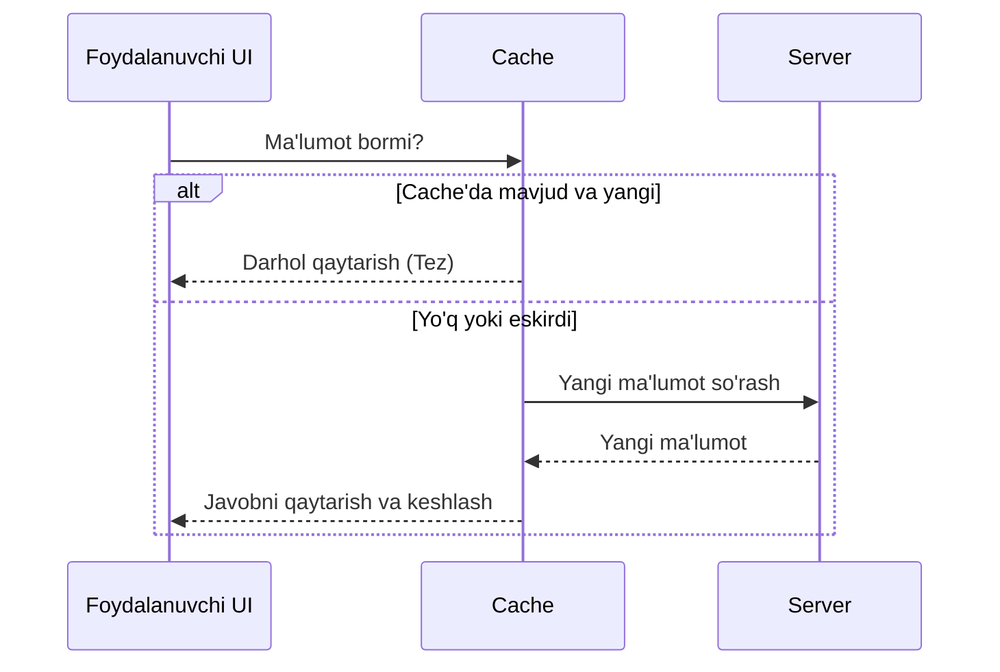

# Caching

## Kirish

> [!IMPORTANT]
> **Nima uchun muhim?**  
> Foydalanuvchi bir xil ma'lumotni ko'rish uchun har safar serverga so'rov yuborishi va kutishi kerak emas. Kesh xotiradan foydalanish (Caching) orqali biz dastur tezligini 10 barobargacha oshiramiz, server xarajatlarini kamaytiramiz va foydalanuvchiga muammosiz UX taqdim etamiz. Lekin, "eski" (stale) ma'lumotni ko'rsatib qo'ymaslik juda nozik masala.

> [!NOTE]
> **Real-hayot analogiyasi: "Oziq-ovqat do'koni va Muzlatgich"**  
> **Keshsiz holat:** Har safar suvsaganingizda uyga qarab yugurib borib emas, supermarketga (Server) borib bitta suv sotib olib kelasiz. Sekin va charchatadigan jarayon.
> **Kesh bilan holat:** Supermarketdan bir quti suv olib kelib muzlatgichingizga (Cache) qo'yib qo'yasiz. Suvsaganda, shunchaki muzlatgichni ochib olasiz (Juda tez). Lekin ma'lum vaqtdan so'ng suvning muddati o'tsa (Cache expiry), siz muzlatgichdagi suvni to'kib tashlab, yana yangisini olib kelishingiz (Cache invalidation) kerak bo'ladi.

Caching - tez-tez ishlatiladigan data'ni vaqtinchalik saqlash texnikasi. API integration'da caching network request'larni kamaytiradi, UX yaxshilaydi, va server yukini tushiradi. Lekin "Cache invalidation" kompyuter fanidagi eng qiyin muammolardan biri hisoblanadi.



## HTTP Caching

### Cache-Control Header

Server response'da caching ko'rsatmalarini beradi.

```javascript
// Server response headers
Cache-Control: max-age=3600        // 1 soat cache
Cache-Control: no-cache            // Har safar revalidate
Cache-Control: no-store            // Umuman cache qilma
Cache-Control: private, max-age=0  // Faqat browser, shared cache emas
Cache-Control: public, max-age=86400, immutable // CDN cache, o'zgarmaydi

// Fetch with cache control
async function fetchWithCache(url, cacheMode = 'default') {
  const response = await fetch(url, {
    cache: cacheMode,
    // 'default' - browser cache policy
    // 'no-store' - umuman cache ishlatma
    // 'reload' - yangi fetch, lekin response cache qil
    // 'no-cache' - har doim revalidate
    // 'force-cache' - cache'dan ol, eski bo'lsa ham
    // 'only-if-cached' - faqat cache'dan (offline)
  });

  return response.json();
}

// Cache busting for static assets
function getCacheBustedUrl(url) {
  const separator = url.includes('?') ? '&' : '?';
  return `${url}${separator}v=${Date.now()}`;
}
```

### ETag va Conditional Requests

```javascript
// ETag - content fingerprint
// Response: ETag: "abc123"

class ConditionalFetch {
  constructor() {
    this.etags = new Map(); // url -> etag
    this.cache = new Map(); // url -> data
  }

  async fetch(url) {
    const headers = {};
    const cachedEtag = this.etags.get(url);

    if (cachedEtag) {
      headers['If-None-Match'] = cachedEtag;
    }

    const response = await fetch(url, { headers });

    // 304 - content o'zgarmagan, cache'dan ishlat
    if (response.status === 304) {
      return this.cache.get(url);
    }

    // 200 - yangi content
    if (response.ok) {
      const etag = response.headers.get('ETag');
      const data = await response.json();

      if (etag) {
        this.etags.set(url, etag);
        this.cache.set(url, data);
      }

      return data;
    }

    throw new Error(`HTTP ${response.status}`);
  }
}

// Usage
const client = new ConditionalFetch();

// First request: 200 OK, full response
const data1 = await client.fetch('/api/products');

// Second request: 304 Not Modified (agar o'zgarmagan bo'lsa)
const data2 = await client.fetch('/api/products');
```

### Last-Modified

```javascript
// Server: Last-Modified: Wed, 15 Jan 2024 10:30:00 GMT

class LastModifiedCache {
  constructor() {
    this.lastModified = new Map();
    this.cache = new Map();
  }

  async fetch(url) {
    const headers = {};
    const cached = this.lastModified.get(url);

    if (cached) {
      headers['If-Modified-Since'] = cached;
    }

    const response = await fetch(url, { headers });

    if (response.status === 304) {
      return this.cache.get(url);
    }

    if (response.ok) {
      const lastMod = response.headers.get('Last-Modified');
      const data = await response.json();

      if (lastMod) {
        this.lastModified.set(url, lastMod);
        this.cache.set(url, data);
      }

      return data;
    }

    throw new Error(`HTTP ${response.status}`);
  }
}
```

## Client-Side Caching Strategies

### 1. Stale-While-Revalidate (SWR)

Cache'dan darhol ko'rsat, background'da yangilash.

```javascript
// SWR pattern implementation
class SWRCache {
  constructor() {
    this.cache = new Map();
  }

  async get(key, fetcher, options = {}) {
    const { maxAge = 60000, staleWhileRevalidate = true } = options;
    const cached = this.cache.get(key);
    const now = Date.now();

    // Fresh cache - return immediately
    if (cached && now - cached.timestamp < maxAge) {
      return cached.data;
    }

    // Stale cache - return and revalidate
    if (cached && staleWhileRevalidate) {
      // Background revalidation
      this.revalidate(key, fetcher);
      return cached.data;
    }

    // No cache - fetch and cache
    return this.revalidate(key, fetcher);
  }

  async revalidate(key, fetcher) {
    try {
      const data = await fetcher();
      this.cache.set(key, {
        data,
        timestamp: Date.now(),
      });
      return data;
    } catch (error) {
      // Return stale data on error
      const cached = this.cache.get(key);
      if (cached) {
        return cached.data;
      }
      throw error;
    }
  }

  invalidate(key) {
    this.cache.delete(key);
  }

  invalidatePattern(pattern) {
    for (const key of this.cache.keys()) {
      if (key.match(pattern)) {
        this.cache.delete(key);
      }
    }
  }
}

// Usage
const cache = new SWRCache();

const users = await cache.get(
  'users',
  () => fetch('/api/users').then(r => r.json()),
  { maxAge: 30000 } // 30 seconds
);
```

### 2. React Query / TanStack Query

Professional-grade data fetching va caching.

```javascript
import {
  QueryClient,
  QueryClientProvider,
  useQuery,
  useMutation,
  useQueryClient,
} from '@tanstack/react-query';

// Setup
const queryClient = new QueryClient({
  defaultOptions: {
    queries: {
      staleTime: 60 * 1000,        // 1 minute
      cacheTime: 5 * 60 * 1000,    // 5 minutes
      refetchOnWindowFocus: true,
      retry: 3,
      retryDelay: attemptIndex => Math.min(1000 * 2 ** attemptIndex, 30000),
    },
  },
});

// Query hook
function useUser(userId) {
  return useQuery({
    queryKey: ['user', userId],
    queryFn: () => fetch(`/api/users/${userId}`).then(r => r.json()),
    staleTime: 5 * 60 * 1000, // 5 minutes
    enabled: !!userId, // conditional fetch
  });
}

// Dependent queries
function useUserPosts(userId) {
  const { data: user } = useUser(userId);

  return useQuery({
    queryKey: ['posts', { userId }],
    queryFn: () => fetch(`/api/users/${userId}/posts`).then(r => r.json()),
    enabled: !!user, // fetch after user loaded
  });
}

// Mutation with cache update
function useUpdateUser() {
  const queryClient = useQueryClient();

  return useMutation({
    mutationFn: (userData) =>
      fetch(`/api/users/${userData.id}`, {
        method: 'PATCH',
        body: JSON.stringify(userData),
      }).then(r => r.json()),

    // Optimistic update
    onMutate: async (newData) => {
      // Cancel outgoing refetches
      await queryClient.cancelQueries({ queryKey: ['user', newData.id] });

      // Snapshot previous value
      const previousUser = queryClient.getQueryData(['user', newData.id]);

      // Optimistically update
      queryClient.setQueryData(['user', newData.id], old => ({
        ...old,
        ...newData,
      }));

      return { previousUser };
    },

    // Rollback on error
    onError: (err, newData, context) => {
      queryClient.setQueryData(
        ['user', newData.id],
        context.previousUser
      );
    },

    // Refetch after success
    onSettled: (data, error, variables) => {
      queryClient.invalidateQueries({ queryKey: ['user', variables.id] });
    },
  });
}

// Component
function UserProfile({ userId }) {
  const { data: user, isLoading, error } = useUser(userId);
  const updateUser = useUpdateUser();

  if (isLoading) return <Skeleton />;
  if (error) return <Error message={error.message} />;

  return (
    <div>
      <h1>{user.name}</h1>
      <button
        onClick={() => updateUser.mutate({ id: userId, name: 'New Name' })}
        disabled={updateUser.isLoading}
      >
        Update Name
      </button>
    </div>
  );
}
```

### 3. Vue Query

```javascript
import { useQuery, useMutation, useQueryClient } from '@tanstack/vue-query';

// Composable
export function useUser(userId) {
  return useQuery({
    queryKey: ['user', userId],
    queryFn: () => fetch(`/api/users/${userId.value}`).then(r => r.json()),
    enabled: computed(() => !!userId.value),
  });
}

export function useUpdateUser() {
  const queryClient = useQueryClient();

  return useMutation({
    mutationFn: (userData) =>
      fetch(`/api/users/${userData.id}`, {
        method: 'PATCH',
        headers: { 'Content-Type': 'application/json' },
        body: JSON.stringify(userData),
      }).then(r => r.json()),

    onSuccess: (data, variables) => {
      // Update cache
      queryClient.setQueryData(['user', variables.id], data);
      // Or invalidate
      queryClient.invalidateQueries({ queryKey: ['user', variables.id] });
    },
  });
}

// Component
// <script setup>
// const userId = ref(1);
// const { data: user, isLoading } = useUser(userId);
// const { mutate: updateUser } = useUpdateUser();
// </script>
```

## Cache Invalidation Strategies

### 1. Time-Based Invalidation

```javascript
class TTLCache {
  constructor(defaultTTL = 60000) {
    this.cache = new Map();
    this.defaultTTL = defaultTTL;
  }

  set(key, value, ttl = this.defaultTTL) {
    this.cache.set(key, {
      value,
      expiry: Date.now() + ttl,
    });
  }

  get(key) {
    const cached = this.cache.get(key);

    if (!cached) return null;

    if (Date.now() > cached.expiry) {
      this.cache.delete(key);
      return null;
    }

    return cached.value;
  }

  // Periodic cleanup
  startCleanup(interval = 60000) {
    setInterval(() => {
      const now = Date.now();
      for (const [key, value] of this.cache.entries()) {
        if (now > value.expiry) {
          this.cache.delete(key);
        }
      }
    }, interval);
  }
}
```

### 2. Event-Based Invalidation

```javascript
// WebSocket-based cache invalidation
class RealtimeCache {
  constructor() {
    this.cache = new Map();
    this.subscribers = new Map();
    this.ws = null;
  }

  connect(url) {
    this.ws = new WebSocket(url);

    this.ws.onmessage = (event) => {
      const { type, key, data } = JSON.parse(event.data);

      switch (type) {
        case 'invalidate':
          this.invalidate(key);
          break;
        case 'update':
          this.set(key, data);
          break;
      }

      // Notify subscribers
      this.notifySubscribers(key);
    };
  }

  subscribe(key, callback) {
    if (!this.subscribers.has(key)) {
      this.subscribers.set(key, new Set());
    }
    this.subscribers.get(key).add(callback);

    return () => {
      this.subscribers.get(key).delete(callback);
    };
  }

  notifySubscribers(key) {
    const callbacks = this.subscribers.get(key);
    if (callbacks) {
      callbacks.forEach(cb => cb(this.cache.get(key)));
    }
  }

  set(key, value) {
    this.cache.set(key, value);
    this.notifySubscribers(key);
  }

  get(key) {
    return this.cache.get(key);
  }

  invalidate(key) {
    this.cache.delete(key);
    this.notifySubscribers(key);
  }
}

// Usage with React
function useRealtimeData(key, fetcher) {
  const [data, setData] = useState(null);
  const cache = useContext(CacheContext);

  useEffect(() => {
    // Initial fetch
    const cached = cache.get(key);
    if (cached) {
      setData(cached);
    } else {
      fetcher().then(result => {
        cache.set(key, result);
        setData(result);
      });
    }

    // Subscribe to updates
    return cache.subscribe(key, setData);
  }, [key]);

  return data;
}
```

### 3. Tag-Based Invalidation

```javascript
class TaggedCache {
  constructor() {
    this.cache = new Map();
    this.tags = new Map(); // tag -> Set of keys
  }

  set(key, value, tags = []) {
    this.cache.set(key, { value, tags });

    // Index by tags
    tags.forEach(tag => {
      if (!this.tags.has(tag)) {
        this.tags.set(tag, new Set());
      }
      this.tags.get(tag).add(key);
    });
  }

  get(key) {
    return this.cache.get(key)?.value;
  }

  invalidateByTag(tag) {
    const keys = this.tags.get(tag);

    if (keys) {
      keys.forEach(key => {
        this.cache.delete(key);
      });
      this.tags.delete(tag);
    }
  }

  invalidateByTags(tags) {
    tags.forEach(tag => this.invalidateByTag(tag));
  }
}

// Usage
const cache = new TaggedCache();

// Cache user data with tags
cache.set('user:123', userData, ['users', 'user:123', 'premium-users']);
cache.set('user:123:posts', posts, ['posts', 'user:123']);
cache.set('user:123:orders', orders, ['orders', 'user:123']);

// User o'chirilganda - barcha bog'liq cache'ni tozalash
cache.invalidateByTag('user:123');
// user:123, user:123:posts, user:123:orders - hammasi o'chadi
```

## Offline Support va Service Worker

```javascript
// service-worker.js
const CACHE_NAME = 'api-cache-v1';
const API_URL = 'https://api.example.com';

// Cache-first for GET requests
self.addEventListener('fetch', (event) => {
  const { request } = event;

  // Faqat API GET requests
  if (!request.url.startsWith(API_URL) || request.method !== 'GET') {
    return;
  }

  event.respondWith(
    caches.match(request).then((cachedResponse) => {
      // Cache hit - return cached, fetch in background
      if (cachedResponse) {
        // Background update
        fetch(request).then(response => {
          if (response.ok) {
            caches.open(CACHE_NAME).then(cache => {
              cache.put(request, response);
            });
          }
        });

        return cachedResponse;
      }

      // Cache miss - fetch and cache
      return fetch(request).then(response => {
        if (response.ok) {
          const responseClone = response.clone();
          caches.open(CACHE_NAME).then(cache => {
            cache.put(request, responseClone);
          });
        }
        return response;
      }).catch(() => {
        // Network error - return offline fallback
        return new Response(
          JSON.stringify({ error: 'offline' }),
          { headers: { 'Content-Type': 'application/json' } }
        );
      });
    })
  );
});

// Mutation queueing (offline mutations)
const mutationQueue = [];

self.addEventListener('fetch', (event) => {
  const { request } = event;

  if (request.method !== 'GET' && request.url.startsWith(API_URL)) {
    event.respondWith(
      fetch(request).catch(async () => {
        // Queue mutation for later
        const body = await request.clone().json();

        mutationQueue.push({
          url: request.url,
          method: request.method,
          body,
          timestamp: Date.now(),
        });

        // Store in IndexedDB
        await saveMutationQueue(mutationQueue);

        return new Response(
          JSON.stringify({ queued: true }),
          { headers: { 'Content-Type': 'application/json' } }
        );
      })
    );
  }
});

// Sync when online
self.addEventListener('sync', async (event) => {
  if (event.tag === 'sync-mutations') {
    event.waitUntil(processMutationQueue());
  }
});

async function processMutationQueue() {
  const queue = await loadMutationQueue();

  for (const mutation of queue) {
    try {
      await fetch(mutation.url, {
        method: mutation.method,
        headers: { 'Content-Type': 'application/json' },
        body: JSON.stringify(mutation.body),
      });

      // Remove from queue on success
      queue.splice(queue.indexOf(mutation), 1);
    } catch (error) {
      // Keep in queue for next sync
      console.error('Failed to sync mutation:', error);
    }
  }

  await saveMutationQueue(queue);
}
```

## Error Handling

```javascript
class CacheError extends Error {
  constructor(message, type, originalError = null) {
    super(message);
    this.name = 'CacheError';
    this.type = type;
    this.originalError = originalError;
  }
}

// Robust caching with fallbacks
class RobustCache {
  constructor() {
    this.memoryCache = new Map();
    this.localStorageAvailable = this.checkLocalStorage();
  }

  checkLocalStorage() {
    try {
      localStorage.setItem('test', 'test');
      localStorage.removeItem('test');
      return true;
    } catch {
      return false;
    }
  }

  async set(key, value, options = {}) {
    const { persist = false, ttl = null } = options;

    const cacheItem = {
      value,
      timestamp: Date.now(),
      expiry: ttl ? Date.now() + ttl : null,
    };

    // Memory cache
    this.memoryCache.set(key, cacheItem);

    // Persist to localStorage
    if (persist && this.localStorageAvailable) {
      try {
        localStorage.setItem(
          `cache:${key}`,
          JSON.stringify(cacheItem)
        );
      } catch (error) {
        // Quota exceeded - clear old items
        if (error.name === 'QuotaExceededError') {
          await this.evictOldest();
          try {
            localStorage.setItem(
              `cache:${key}`,
              JSON.stringify(cacheItem)
            );
          } catch {
            console.warn('Cache persist failed after eviction');
          }
        }
      }
    }
  }

  get(key) {
    // Try memory first
    let item = this.memoryCache.get(key);

    // Try localStorage
    if (!item && this.localStorageAvailable) {
      try {
        const stored = localStorage.getItem(`cache:${key}`);
        if (stored) {
          item = JSON.parse(stored);
          // Restore to memory
          this.memoryCache.set(key, item);
        }
      } catch {
        // Corrupted data
        localStorage.removeItem(`cache:${key}`);
      }
    }

    if (!item) return null;

    // Check expiry
    if (item.expiry && Date.now() > item.expiry) {
      this.delete(key);
      return null;
    }

    return item.value;
  }

  delete(key) {
    this.memoryCache.delete(key);
    if (this.localStorageAvailable) {
      localStorage.removeItem(`cache:${key}`);
    }
  }

  async evictOldest() {
    const items = [];

    for (let i = 0; i < localStorage.length; i++) {
      const key = localStorage.key(i);
      if (key.startsWith('cache:')) {
        try {
          const item = JSON.parse(localStorage.getItem(key));
          items.push({ key, timestamp: item.timestamp });
        } catch {
          localStorage.removeItem(key);
        }
      }
    }

    // Sort by timestamp and remove oldest 20%
    items.sort((a, b) => a.timestamp - b.timestamp);
    const toRemove = Math.ceil(items.length * 0.2);

    for (let i = 0; i < toRemove; i++) {
      localStorage.removeItem(items[i].key);
    }
  }
}
```

## Real-World Case: E-commerce Product Cache

```javascript
// Complete e-commerce caching strategy
class EcommerceCacheManager {
  constructor(queryClient) {
    this.queryClient = queryClient;
  }

  // Product pages - aggressive caching
  prefetchProduct(productId) {
    this.queryClient.prefetchQuery({
      queryKey: ['product', productId],
      queryFn: () => fetchProduct(productId),
      staleTime: 5 * 60 * 1000, // 5 minutes
    });
  }

  // Search results - short cache
  getSearchCache(query, filters) {
    return this.queryClient.getQueryData([
      'search',
      query,
      JSON.stringify(filters),
    ]);
  }

  // Cart - no cache (always fresh)
  invalidateCart() {
    this.queryClient.invalidateQueries({ queryKey: ['cart'] });
  }

  // After purchase - cascade invalidation
  async onPurchaseComplete(orderId) {
    await Promise.all([
      // Clear cart
      this.queryClient.invalidateQueries({ queryKey: ['cart'] }),
      // Update user orders
      this.queryClient.invalidateQueries({ queryKey: ['user', 'orders'] }),
      // Update product stock (might change)
      this.queryClient.invalidateQueries({ queryKey: ['products'] }),
      // Prefetch new order
      this.queryClient.prefetchQuery({
        queryKey: ['order', orderId],
        queryFn: () => fetchOrder(orderId),
      }),
    ]);
  }

  // Inventory update (from WebSocket)
  updateProductStock(productId, newStock) {
    this.queryClient.setQueryData(['product', productId], (old) => ({
      ...old,
      stock: newStock,
      inStock: newStock > 0,
    }));
  }

  // Price change - invalidate affected caches
  onPriceChange(productId) {
    // Product detail
    this.queryClient.invalidateQueries({ queryKey: ['product', productId] });
    // Product in lists
    this.queryClient.invalidateQueries({
      queryKey: ['products'],
      refetchType: 'none', // Don't auto-refetch, let stale data
    });
    // Cart (price affects total)
    this.queryClient.invalidateQueries({ queryKey: ['cart'] });
  }
}

// Usage in React
function ProductPage({ productId }) {
  const cacheManager = useCacheManager();

  // Prefetch related products
  useEffect(() => {
    const relatedIds = getRelatedProductIds(productId);
    relatedIds.forEach(id => cacheManager.prefetchProduct(id));
  }, [productId]);

  const { data: product } = useQuery({
    queryKey: ['product', productId],
    queryFn: () => fetchProduct(productId),
    staleTime: 5 * 60 * 1000,
    cacheTime: 30 * 60 * 1000,
  });

  // WebSocket for real-time stock updates
  useEffect(() => {
    const ws = subscribeToProduct(productId, (update) => {
      if (update.type === 'stock') {
        cacheManager.updateProductStock(productId, update.stock);
      }
      if (update.type === 'price') {
        cacheManager.onPriceChange(productId);
      }
    });

    return () => ws.close();
  }, [productId]);

  return <ProductDisplay product={product} />;
}
```

## Interview Savollari

### 1. Cache invalidation qachon va qanday qilinadi?

**Javob:**

**Qachon:**
- Data o'zgarganda (mutation after)
- Vaqt o'tganda (TTL expiry)
- User action (manual refresh)
- Real-time event (WebSocket notification)

**Qanday:**
```javascript
// 1. Time-based
cache.set('data', value, { ttl: 60000 });

// 2. Manual invalidation
cache.invalidate('data');

// 3. Pattern-based
cache.invalidateByPattern(/^user:/);

// 4. Tag-based
cache.invalidateByTag('user:123');

// 5. Mutation-triggered
useMutation({
  onSuccess: () => {
    queryClient.invalidateQueries({ queryKey: ['data'] });
  }
});
```

### 2. Optimistic update va cache qanday birgalikda ishlaydi?

**Javob:** Optimistic update - server response kutmasdan UI'ni darhol yangilash, keyin rollback yoki confirm.

```javascript
const { mutate } = useMutation({
  mutationFn: updateTodo,

  // 1. Optimistic update
  onMutate: async (newTodo) => {
    await queryClient.cancelQueries(['todos']);
    const previous = queryClient.getQueryData(['todos']);

    queryClient.setQueryData(['todos'], old =>
      old.map(t => t.id === newTodo.id ? newTodo : t)
    );

    return { previous };
  },

  // 2. Error - rollback
  onError: (err, newTodo, context) => {
    queryClient.setQueryData(['todos'], context.previous);
    toast.error('Failed to update');
  },

  // 3. Success - confirm (optional refetch)
  onSettled: () => {
    queryClient.invalidateQueries(['todos']);
  },
});
```

### 3. SWR (Stale-While-Revalidate) pattern qanday ishlaydi?

**Javob:**
1. Cache'dan darhol eski data qaytariladi (instant UX)
2. Background'da yangi data fetch qilinadi
3. Yangi data kelgach cache va UI yangilanadi

```javascript
// Timeline:
// t=0: Request
// t=0: Return stale data from cache (instant)
// t=0: Start background fetch
// t=200ms: Fresh data arrives
// t=200ms: Update cache and UI

const { data } = useQuery({
  queryKey: ['posts'],
  queryFn: fetchPosts,
  staleTime: 60000,        // 1 min fresh
  cacheTime: 5 * 60000,    // 5 min in cache
  refetchOnMount: true,
  refetchOnWindowFocus: true,
});
```

### 4. Offline-first app qanday implement qilinadi?

**Javob:**

```javascript
// 1. Service Worker cache
// 2. IndexedDB for mutations
// 3. Sync when online

// Read: Cache-first
async function getData(key) {
  const cached = await localDB.get(key);
  if (cached) return cached;

  const fresh = await fetch(`/api/${key}`);
  await localDB.set(key, fresh);
  return fresh;
}

// Write: Queue if offline
async function saveData(data) {
  if (!navigator.onLine) {
    await mutationQueue.add(data);
    return { queued: true };
  }

  return fetch('/api/data', {
    method: 'POST',
    body: JSON.stringify(data),
  });
}

// Sync on reconnect
window.addEventListener('online', async () => {
  const queue = await mutationQueue.getAll();
  for (const mutation of queue) {
    await processMutation(mutation);
  }
});
```

### 5. Cache consistency multi-tab'da qanday saqlanadi?

**Javob:**

```javascript
// BroadcastChannel API
const channel = new BroadcastChannel('cache-sync');

// Send invalidation to other tabs
function invalidateCache(key) {
  localCache.delete(key);
  channel.postMessage({ type: 'invalidate', key });
}

// Receive from other tabs
channel.onmessage = (event) => {
  if (event.data.type === 'invalidate') {
    localCache.delete(event.data.key);
    // Trigger re-render
    notifySubscribers(event.data.key);
  }
};

// Or use localStorage event
window.addEventListener('storage', (event) => {
  if (event.key === 'cache-invalidation') {
    const { keys } = JSON.parse(event.newValue);
    keys.forEach(key => localCache.delete(key));
  }
});
```

## Eng Yaxshi Amaliyotlar (Best Practices)

1. **GET so'rovlarini keshlang**: Faqat o'qish (GET) operatsiyalarini keshga oling. Hech qachon POST, PUT, DELETE operatsiyalari javoblarini keshlashga urinmang.
2. **SWR (Stale-While-Revalidate) patternini ishlating**: Iloji boricha SWR'dan (VueUse'dagi `useFetch` yoki `@tanstack/vue-query`) foydalaning. Bu UX uchun eng ideal variant — foydalanuvchiga eski ma'lumotni darhol ko'rsatib, orqa fonda jimgina uni yangilab qo'yadi.
3. **Invalidation (Tozalash) muhim**: Agar ma'lumot qayerdadir o'zgargan bo'lsa (masalan foydalanuvchi ismini tahrirladi), butun foydalanuvchi profili keshini darhol tozalashingiz (`invalidateQueries`) shart, aks holda tahrirlangan profil sahifada eski ism bilan ko'rinib qoladi.
4. **ETag'dan foydalaning**: Katta o'lchamdagi fayllar yoki ma'lumotlar ro'yxatini yuklashda ETag'larni (If-None-Match) server sozlamalarida yoqtirib qo'ying (304 Not Modified).

---

## Xulosa

Caching - performance va UX uchun critical, lekin to'g'ri invalidation strategiyasi kerak. SWR pattern eng yaxshi UX beradi, React Query/TanStack Query production-ready solution. Offline support uchun Service Worker va IndexedDB kombinatsiyasi ishlatiladi.

**Keyingi qadam:** [05-retries-interceptors.md](./05-retries-interceptors.md) - network xatolarini handle qilish va request/response transformation.
