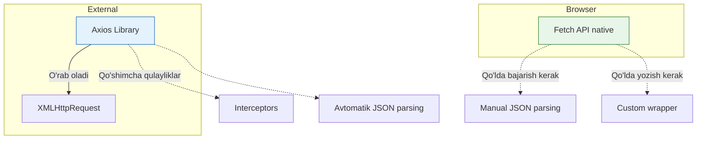

# Axios vs Fetch

## Kirish

> [!IMPORTANT]
> **Nima uchun muhim?**  
> Loyiha boshida tarmoq (network) kutubxonasini to'g'ri tanlash juda muhim, chunki keyinchalik butun loyihani o'zgartirish katta mehnat talab qiladi. Fetch bu quruq fundament (brauzerga o'rnatilgan), Axios esa tayyor imorat. Ikkalasining afzalliklari va cheklovlarini tushunish, loyihaning hajmiga qarab to'g'ri qaror qabul qilishingizga yordam beradi.

> [!NOTE]
> **Real-hayot analogiyasi: "Pitsa tayyorlash vs Tayyor pitsa buyurtma qilish"**  
> **Fetch (Pitsa tayyorlash):** Hamiri, pomidori, pishlog'ini alohida-alohida o'zingiz sotib olasiz va o'zingiz pishirasiz. Arzon tushadi (Bundle size = 0), lekin mehnat ko'p (Manual JSON parse, error handling).
> **Axios (Tayyor pitsa):** Kuryer tayyor quti bilan olib keladi. Barcha xizmatlar ichida bor (Automatic JSON parse, Interceptors). Lekin kuryerga ozgina haq to'laysiz (Bundle size ~11kb).

HTTP so'rovlar yuborish uchun JavaScript'da ikki asosiy variant mavjud: browser native `fetch()` API va third-party `axios` kutubxonasi. Har birining o'z kuchli va kuchsiz tomonlari bor. Bu bo'limda ularni chuqur solishtiramiz va qachon qaysi birini tanlash kerakligini ko'rib chiqamiz.

## Asosiy Farqlar



### 1. Syntax va Ergonomics

```javascript
// ========== FETCH ==========

// GET request
const response = await fetch('/api/users');
const data = await response.json();

// POST request
const response = await fetch('/api/users', {
  method: 'POST',
  headers: {
    'Content-Type': 'application/json',
  },
  body: JSON.stringify({ name: 'John', email: 'john@example.com' }),
});
const data = await response.json();

// ========== AXIOS ==========

// GET request
const { data } = await axios.get('/api/users');

// POST request
const { data } = await axios.post('/api/users', {
  name: 'John',
  email: 'john@example.com',
});
// Content-Type avtomatik set bo'ladi
```

### 2. Error Handling

```javascript
// ========== FETCH ==========
// Fetch faqat network error'da reject bo'ladi
// 4xx, 5xx response'lar error EMAS

async function fetchUser(id) {
  try {
    const response = await fetch(`/api/users/${id}`);

    // Manual error check kerak
    if (!response.ok) {
      throw new Error(`HTTP ${response.status}: ${response.statusText}`);
    }

    return response.json();
  } catch (error) {
    if (error.name === 'TypeError') {
      // Network error
      console.error('Network error');
    } else {
      // HTTP error
      console.error('HTTP error:', error.message);
    }
  }
}

// ========== AXIOS ==========
// Axios 4xx, 5xx da avtomatik reject bo'ladi

async function fetchUser(id) {
  try {
    const { data } = await axios.get(`/api/users/${id}`);
    return data;
  } catch (error) {
    if (error.response) {
      // Server responded with error
      console.error('HTTP error:', error.response.status);
      console.error('Data:', error.response.data);
    } else if (error.request) {
      // No response received
      console.error('Network error');
    } else {
      // Request setup error
      console.error('Error:', error.message);
    }
  }
}
```

### 3. Request/Response Transformation

```javascript
// ========== FETCH ==========
// Manual transformation

// Request
const response = await fetch('/api/users', {
  method: 'POST',
  headers: { 'Content-Type': 'application/json' },
  body: JSON.stringify(data), // Manual stringify
});

// Response
const jsonData = await response.json(); // Manual parse

// ========== AXIOS ==========
// Automatic JSON transformation

// Request - avtomatik stringify
const { data } = await axios.post('/api/users', userData);

// Response - avtomatik parse
// data allaqachon JavaScript object

// Custom transformers
const api = axios.create({
  transformRequest: [
    (data, headers) => {
      // Convert dates to ISO strings
      return JSON.stringify(data, (key, value) => {
        if (value instanceof Date) {
          return value.toISOString();
        }
        return value;
      });
    },
  ],
  transformResponse: [
    (data) => {
      // Parse and convert ISO dates back to Date objects
      return JSON.parse(data, (key, value) => {
        if (typeof value === 'string' && /^\d{4}-\d{2}-\d{2}T/.test(value)) {
          return new Date(value);
        }
        return value;
      });
    },
  ],
});
```

### 4. Interceptors

```javascript
// ========== FETCH ==========
// Native interceptors yo'q - wrapper kerak

class FetchWrapper {
  constructor() {
    this.requestInterceptors = [];
    this.responseInterceptors = [];
  }

  addRequestInterceptor(fn) {
    this.requestInterceptors.push(fn);
  }

  addResponseInterceptor(fn) {
    this.responseInterceptors.push(fn);
  }

  async fetch(url, options = {}) {
    // Run request interceptors
    let config = { url, ...options };
    for (const interceptor of this.requestInterceptors) {
      config = await interceptor(config);
    }

    let response = await fetch(config.url, config);

    // Run response interceptors
    for (const interceptor of this.responseInterceptors) {
      response = await interceptor(response);
    }

    return response;
  }
}

// ========== AXIOS ==========
// Built-in interceptors

axios.interceptors.request.use(
  (config) => {
    config.headers.Authorization = `Bearer ${getToken()}`;
    return config;
  },
  (error) => Promise.reject(error)
);

axios.interceptors.response.use(
  (response) => response,
  (error) => {
    if (error.response?.status === 401) {
      redirectToLogin();
    }
    return Promise.reject(error);
  }
);
```

### 5. Timeout

```javascript
// ========== FETCH ==========
// Native timeout yo'q - AbortController kerak

async function fetchWithTimeout(url, timeout = 5000) {
  const controller = new AbortController();
  const timeoutId = setTimeout(() => controller.abort(), timeout);

  try {
    const response = await fetch(url, { signal: controller.signal });
    clearTimeout(timeoutId);
    return response;
  } catch (error) {
    clearTimeout(timeoutId);
    if (error.name === 'AbortError') {
      throw new Error('Request timed out');
    }
    throw error;
  }
}

// ========== AXIOS ==========
// Built-in timeout

const { data } = await axios.get('/api/users', {
  timeout: 5000, // 5 seconds
});

// Global default
axios.defaults.timeout = 10000;
```

### 6. Request Cancellation

```javascript
// ========== FETCH ==========
const controller = new AbortController();

// Start request
fetch('/api/users', { signal: controller.signal })
  .then(response => response.json())
  .then(data => console.log(data))
  .catch(error => {
    if (error.name === 'AbortError') {
      console.log('Request cancelled');
    }
  });

// Cancel request
controller.abort();

// ========== AXIOS ==========
// New way (v0.22+) - AbortController
const controller = new AbortController();

axios.get('/api/users', { signal: controller.signal })
  .then(({ data }) => console.log(data))
  .catch(error => {
    if (axios.isCancel(error)) {
      console.log('Request cancelled');
    }
  });

controller.abort();

// Old way - CancelToken (deprecated)
const source = axios.CancelToken.source();
axios.get('/api/users', { cancelToken: source.token });
source.cancel('Operation cancelled');
```

### 7. Progress Tracking

```javascript
// ========== FETCH ==========
// Upload progress - yo'q
// Download progress - ReadableStream orqali

async function downloadWithProgress(url, onProgress) {
  const response = await fetch(url);
  const reader = response.body.getReader();
  const contentLength = +response.headers.get('Content-Length');

  let receivedLength = 0;
  const chunks = [];

  while (true) {
    const { done, value } = await reader.read();

    if (done) break;

    chunks.push(value);
    receivedLength += value.length;

    onProgress({
      loaded: receivedLength,
      total: contentLength,
      percent: (receivedLength / contentLength) * 100,
    });
  }

  const blob = new Blob(chunks);
  return blob;
}

// ========== AXIOS ==========
// Built-in progress for both upload and download

// Download progress
axios.get('/api/file', {
  onDownloadProgress: (progressEvent) => {
    const percent = Math.round(
      (progressEvent.loaded * 100) / progressEvent.total
    );
    console.log(`Downloaded ${percent}%`);
  },
});

// Upload progress
axios.post('/api/upload', formData, {
  onUploadProgress: (progressEvent) => {
    const percent = Math.round(
      (progressEvent.loaded * 100) / progressEvent.total
    );
    console.log(`Uploaded ${percent}%`);
  },
});
```

### 8. Browser Support va Node.js

```javascript
// ========== FETCH ==========
// Modern browsers (IE yo'q)
// Node.js 18+ (native), yoki node-fetch package

// Check support
if (typeof fetch === 'undefined') {
  // Polyfill kerak (whatwg-fetch, isomorphic-fetch)
}

// ========== AXIOS ==========
// Barcha zamonaviy browserlar + IE11
// Node.js (built-in support)

// Isomorphic - browser va Node.js'da bir xil kod
// Browser: XMLHttpRequest
// Node.js: http/https module
```

## Feature Comparison Table

| Feature | Fetch | Axios |
|---------|-------|-------|
| Built-in | Ha | Yo'q (package) |
| Bundle size | 0kb | ~13kb (min+gzip) |
| JSON auto-parse | Yo'q | Ha |
| Error on 4xx/5xx | Yo'q | Ha |
| Interceptors | Yo'q | Ha |
| Timeout | Yo'q (manual) | Ha |
| Upload progress | Yo'q | Ha |
| Download progress | Partial | Ha |
| Cancel | AbortController | AbortController/CancelToken |
| Node.js support | v18+ | Ha |
| IE11 support | Yo'q | Ha |
| TypeScript | Built-in types | Built-in types |

## Custom Fetch Wrapper

Fetch'ni Axios'ga o'xshash qilish:

```javascript
class HttpClient {
  constructor(config = {}) {
    this.baseURL = config.baseURL || '';
    this.timeout = config.timeout || 30000;
    this.headers = config.headers || {};
    this.requestInterceptors = [];
    this.responseInterceptors = [];
  }

  // Interceptors
  addRequestInterceptor(fulfilled, rejected) {
    this.requestInterceptors.push({ fulfilled, rejected });
    return this.requestInterceptors.length - 1;
  }

  addResponseInterceptor(fulfilled, rejected) {
    this.responseInterceptors.push({ fulfilled, rejected });
    return this.responseInterceptors.length - 1;
  }

  // Core request method
  async request(url, options = {}) {
    let config = {
      url: `${this.baseURL}${url}`,
      method: options.method || 'GET',
      headers: { ...this.headers, ...options.headers },
      body: options.body,
      params: options.params,
      timeout: options.timeout || this.timeout,
    };

    // Run request interceptors
    for (const interceptor of this.requestInterceptors) {
      try {
        config = await interceptor.fulfilled(config);
      } catch (error) {
        if (interceptor.rejected) {
          config = await interceptor.rejected(error);
        } else {
          throw error;
        }
      }
    }

    // Add query params
    if (config.params) {
      const searchParams = new URLSearchParams(config.params);
      config.url += `?${searchParams}`;
    }

    // Setup abort controller for timeout
    const controller = new AbortController();
    const timeoutId = setTimeout(() => controller.abort(), config.timeout);

    try {
      // Make request
      const response = await fetch(config.url, {
        method: config.method,
        headers: config.headers,
        body: config.body ? JSON.stringify(config.body) : undefined,
        signal: controller.signal,
      });

      clearTimeout(timeoutId);

      // Create response object
      let result = {
        status: response.status,
        statusText: response.statusText,
        headers: response.headers,
        config,
        data: null,
      };

      // Parse response
      const contentType = response.headers.get('Content-Type');
      if (contentType?.includes('application/json')) {
        result.data = await response.json();
      } else {
        result.data = await response.text();
      }

      // Check for HTTP errors
      if (!response.ok) {
        const error = new HttpError(
          `HTTP ${response.status}: ${response.statusText}`,
          response.status,
          result
        );
        throw error;
      }

      // Run response interceptors
      for (const interceptor of this.responseInterceptors) {
        try {
          result = await interceptor.fulfilled(result);
        } catch (error) {
          if (interceptor.rejected) {
            result = await interceptor.rejected(error);
          } else {
            throw error;
          }
        }
      }

      return result;
    } catch (error) {
      clearTimeout(timeoutId);

      if (error.name === 'AbortError') {
        throw new TimeoutError(`Request timed out after ${config.timeout}ms`);
      }

      // Run error interceptors
      for (const interceptor of this.responseInterceptors) {
        if (interceptor.rejected) {
          try {
            return await interceptor.rejected(error);
          } catch (e) {
            error = e;
          }
        }
      }

      throw error;
    }
  }

  // Convenience methods
  get(url, config) {
    return this.request(url, { ...config, method: 'GET' });
  }

  post(url, data, config) {
    return this.request(url, { ...config, method: 'POST', body: data });
  }

  put(url, data, config) {
    return this.request(url, { ...config, method: 'PUT', body: data });
  }

  patch(url, data, config) {
    return this.request(url, { ...config, method: 'PATCH', body: data });
  }

  delete(url, config) {
    return this.request(url, { ...config, method: 'DELETE' });
  }
}

// Custom errors
class HttpError extends Error {
  constructor(message, status, response) {
    super(message);
    this.name = 'HttpError';
    this.status = status;
    this.response = response;
  }
}

class TimeoutError extends Error {
  constructor(message) {
    super(message);
    this.name = 'TimeoutError';
  }
}

// Usage
const http = new HttpClient({
  baseURL: 'https://api.example.com',
  timeout: 10000,
  headers: {
    'Content-Type': 'application/json',
  },
});

// Add auth interceptor
http.addRequestInterceptor((config) => {
  const token = localStorage.getItem('token');
  if (token) {
    config.headers.Authorization = `Bearer ${token}`;
  }
  return config;
});

// Add error interceptor
http.addResponseInterceptor(
  (response) => response,
  (error) => {
    if (error.status === 401) {
      window.location.href = '/login';
    }
    throw error;
  }
);

// Make requests
const { data: users } = await http.get('/users');
const { data: newUser } = await http.post('/users', { name: 'John' });
```

## Modern Alternatives

### 1. ky - Tiny Fetch Wrapper

```javascript
import ky from 'ky';

// Fetch-based, tiny (~3kb), modern
const api = ky.create({
  prefixUrl: 'https://api.example.com',
  timeout: 10000,
  hooks: {
    beforeRequest: [
      (request) => {
        request.headers.set('Authorization', `Bearer ${getToken()}`);
      },
    ],
    afterResponse: [
      async (request, options, response) => {
        if (response.status === 401) {
          const token = await refreshToken();
          request.headers.set('Authorization', `Bearer ${token}`);
          return ky(request);
        }
      },
    ],
  },
});

// JSON by default
const users = await api.get('users').json();
const newUser = await api.post('users', { json: { name: 'John' } }).json();
```

### 2. ofetch (Nuxt)

```javascript
import { ofetch } from 'ofetch';

// Universal (Node.js, browser, workers)
// Auto JSON, better errors
const users = await ofetch('/api/users', {
  baseURL: 'https://api.example.com',
  headers: {
    Authorization: `Bearer ${token}`,
  },
  retry: 3,
  retryDelay: 500,
  timeout: 10000,
  onRequest({ request, options }) {
    console.log('Request:', request);
  },
  onRequestError({ request, error }) {
    console.error('Request error:', error);
  },
  onResponse({ response }) {
    console.log('Response:', response.status);
  },
  onResponseError({ response }) {
    console.error('Response error:', response.status);
  },
});
```

### 3. wretch

```javascript
import wretch from 'wretch';

// Fluent API, tiny, modular
const api = wretch('https://api.example.com')
  .auth(`Bearer ${token}`)
  .errorType('json')
  .resolve((r) => r.json());

// Chained error handling
const user = await api
  .get('/users/1')
  .notFound((error) => ({ notFound: true }))
  .unauthorized((error) => {
    refreshToken();
    throw error;
  })
  .internalError((error) => ({ serverError: true }))
  .json();
```

## Qachon Qaysi Birini Tanlash

### Fetch Tanlang:

```javascript
// ✅ Bundle size critical (0kb vs ~13kb)
// ✅ Simple requests, minimal error handling
// ✅ Modern browsers only
// ✅ Already have custom wrapper/library
// ✅ Minimal dependencies policy

// Good for:
// - Static sites, landing pages
// - Simple API calls
// - When you control the API
```

### Axios Tanlang:

```javascript
// ✅ Complex error handling kerak
// ✅ Interceptors kerak (auth, logging)
// ✅ Upload/download progress kerak
// ✅ IE11 support kerak
// ✅ Node.js + browser isomorphic
// ✅ Team axios biladi

// Good for:
// - Enterprise applications
// - Complex API integrations
// - Multi-platform (web, mobile, SSR)
```

### ky/ofetch Tanlang:

```javascript
// ✅ Fetch-based, lekin ergonomic
// ✅ Minimal bundle size (~3kb)
// ✅ Modern features (retry, timeout)
// ✅ TypeScript first-class

// Good for:
// - Modern web apps
// - Nuxt/Next.js projects
// - When you want fetch + convenience
```

## Error Handling Patterns

```javascript
// Universal error handling
class APIError extends Error {
  constructor(message, status, data) {
    super(message);
    this.name = 'APIError';
    this.status = status;
    this.data = data;
  }

  isClientError() {
    return this.status >= 400 && this.status < 500;
  }

  isServerError() {
    return this.status >= 500;
  }

  isNotFound() {
    return this.status === 404;
  }

  isUnauthorized() {
    return this.status === 401;
  }
}

// Fetch error handling
async function handleFetchError(response) {
  if (response.ok) return response;

  let data;
  try {
    data = await response.json();
  } catch {
    data = { message: response.statusText };
  }

  throw new APIError(
    data.message || `HTTP ${response.status}`,
    response.status,
    data
  );
}

// Usage
try {
  const response = await fetch('/api/users');
  await handleFetchError(response);
  const data = await response.json();
} catch (error) {
  if (error instanceof APIError) {
    if (error.isUnauthorized()) {
      redirectToLogin();
    } else if (error.isNotFound()) {
      show404Page();
    } else {
      showErrorMessage(error.message);
    }
  } else {
    // Network error
    showOfflineMessage();
  }
}

// Axios error handling
try {
  const { data } = await axios.get('/api/users');
} catch (error) {
  if (axios.isAxiosError(error)) {
    const apiError = new APIError(
      error.response?.data?.message || error.message,
      error.response?.status || 0,
      error.response?.data
    );

    if (apiError.isUnauthorized()) {
      redirectToLogin();
    } else {
      showErrorMessage(apiError.message);
    }
  } else {
    showErrorMessage('An unexpected error occurred');
  }
}
```

## Real-World Case: API Client Factory

```javascript
// Factory pattern for different environments
function createAPIClient(type = 'axios') {
  const config = {
    baseURL: process.env.API_URL,
    timeout: 30000,
  };

  switch (type) {
    case 'fetch':
      return createFetchClient(config);
    case 'axios':
      return createAxiosClient(config);
    case 'ky':
      return createKyClient(config);
    default:
      throw new Error(`Unknown client type: ${type}`);
  }
}

function createAxiosClient(config) {
  const instance = axios.create(config);

  // Request interceptor
  instance.interceptors.request.use((config) => {
    const token = getAccessToken();
    if (token) {
      config.headers.Authorization = `Bearer ${token}`;
    }
    return config;
  });

  // Response interceptor
  instance.interceptors.response.use(
    (response) => response.data,
    async (error) => {
      if (error.response?.status === 401) {
        try {
          const newToken = await refreshToken();
          error.config.headers.Authorization = `Bearer ${newToken}`;
          return instance(error.config);
        } catch {
          logout();
          throw error;
        }
      }
      throw normalizeError(error);
    }
  );

  return {
    get: (url, params) => instance.get(url, { params }),
    post: (url, data) => instance.post(url, data),
    put: (url, data) => instance.put(url, data),
    patch: (url, data) => instance.patch(url, data),
    delete: (url) => instance.delete(url),
  };
}

function createFetchClient(config) {
  const request = async (url, options = {}) => {
    const token = getAccessToken();
    const headers = {
      'Content-Type': 'application/json',
      ...(token && { Authorization: `Bearer ${token}` }),
      ...options.headers,
    };

    const controller = new AbortController();
    const timeoutId = setTimeout(() => controller.abort(), config.timeout);

    try {
      const response = await fetch(`${config.baseURL}${url}`, {
        ...options,
        headers,
        signal: controller.signal,
        body: options.body ? JSON.stringify(options.body) : undefined,
      });

      clearTimeout(timeoutId);

      if (response.status === 401) {
        const newToken = await refreshToken();
        return request(url, {
          ...options,
          headers: { ...headers, Authorization: `Bearer ${newToken}` },
        });
      }

      if (!response.ok) {
        const error = await response.json().catch(() => ({}));
        throw normalizeError({ response, error });
      }

      return response.json();
    } catch (error) {
      clearTimeout(timeoutId);
      throw error;
    }
  };

  return {
    get: (url, params) => {
      const query = params ? `?${new URLSearchParams(params)}` : '';
      return request(`${url}${query}`);
    },
    post: (url, data) => request(url, { method: 'POST', body: data }),
    put: (url, data) => request(url, { method: 'PUT', body: data }),
    patch: (url, data) => request(url, { method: 'PATCH', body: data }),
    delete: (url) => request(url, { method: 'DELETE' }),
  };
}

// Usage
const api = createAPIClient(process.env.HTTP_CLIENT || 'axios');

const users = await api.get('/users', { page: 1 });
const newUser = await api.post('/users', { name: 'John' });
```

## Interview Savollari

### 1. Fetch va Axios'ning asosiy farqlari?

**Javob:**

| Aspect | Fetch | Axios |
|--------|-------|-------|
| JSON parse | Manual | Automatic |
| Error handling | response.ok check | Auto-reject on 4xx/5xx |
| Interceptors | Yo'q | Built-in |
| Timeout | Manual (AbortController) | Built-in |
| Bundle | 0kb | ~13kb |

```javascript
// Fetch - more code
const response = await fetch(url);
if (!response.ok) throw new Error(response.status);
const data = await response.json();

// Axios - less code
const { data } = await axios.get(url);
```

### 2. Fetch'da 404 yoki 500 error qanday handle qilinadi?

**Javob:** Fetch faqat network error'da reject bo'ladi. HTTP error'lar uchun `response.ok` tekshirish kerak.

```javascript
const response = await fetch('/api/users');

// 404 yoki 500 bo'lsa ham bu yerga keladi!
console.log(response.status); // 404, 500, etc.

// Manual check
if (!response.ok) {
  throw new Error(`HTTP ${response.status}`);
}
```

### 3. Bundle size muhim bo'lganda qaysi birini tanlaysiz?

**Javob:** Fetch - 0kb (native). Lekin agar features kerak bo'lsa, ky (~3kb) yoki custom wrapper.

```javascript
// Ultra-minimal
await fetch('/api/data').then(r => r.json());

// Axios features, minimal size
import ky from 'ky';
await ky.get('/api/data').json();
```

### 4. Server-side rendering (SSR) da qaysi biri yaxshi?

**Javob:** Ikkalasi ham ishlaydi. Node.js 18+ da fetch native. Axios har joyda isomorphic.

```javascript
// Next.js - fetch recommended
// Nuxt.js - ofetch recommended
// Universal - axios (same code everywhere)
```

### 5. Request cancellation qanday qilinadi?

**Javob:** Ikkalasida ham AbortController.

```javascript
const controller = new AbortController();

// Fetch
fetch(url, { signal: controller.signal });

// Axios
axios.get(url, { signal: controller.signal });

// Cancel
controller.abort();
```

## Eng Yaxshi Amaliyotlar (Best Practices)

1. **Native Fetch ni o'rganing**: Axios o'rniga hozirgi kunda Fetch API ning o'zi ham juda ko'p loyihalarga yetarli. Zamonaviy framework'lar (masalan Nuxt) o'zining Fetch wrapper'iga (ofetch) ega.
2. **Katta loyihalarga custom wrapper yozing**: Fetch yoki Axios ishlatishingizdan qat'iy nazar, loyihangiz uchun `apiClient.js` nomli markazlashtirilgan ob'ekt yarating. Qachondir Axios dan Fetch ga o'tish kerak bo'lsa, faqat bitta faylni o'zgartirasiz.
3. **HTTP xatolarni Fetch da to'g'ri ushlang**: Har doim `if (!response.ok) throw new Error(...)` tekshiruvini yozishni unutmang. Aks holda `fetch` sizga 500 yoki 404 kelganda ham "hammasi joyida" (success) deb o'tqazib yuboradi.

---

## Xulosa

| Xususiyat | Fetch API | Axios |
|-----------|-----------|-------|
| **Asos (Platforma)** | Brauzerni o'zida bor (Native) | Uchinchi tomon kutubxonasi (NPM package) |
| **JSON formatlash** | Qo'lda `.json()` qilish kerak | Avtomatik (o'zi o'qiydi) |
| **Xatoliklarni ushlash** | Faqat internet uzilsa `catch` ga tushadi | 400 va 500 statuslar ham `catch` ga tushadi |
| **Fayl yuborish/olinish** | Biroz noqulay | Avtomatlashtirilgan taraqqiyot paneli (Progress bar) bor |

Fetch va Axios har ikkalasi ham production-ready. Fetch native va lightweight, lekin ko'proq boilerplate kerak. Axios feature-rich, lekin bundle size qo'shadi. Zamonaviy muqobillar (ky, ofetch) ikkalasining yaxshi tomonlarini birlashtiradi.

**Tanlash qoidasi:**
- Oddiy so'rovlar, bundle hajmi muhim → **Fetch**
- Murakkab API, jamoa Axios ga o'rganib qolgan → **Axios**
- Yangi avlod loyihalar, Vue/Nuxt tizimlari → **ky/ofetch**

---

## Bo'lim Yakunlandi

Bu bo'limda API integration'ning barcha asosiy jihatlarini ko'rib chiqdik:

1. **REST API** - fundamental tushunchalar va HTTP methods
2. **GraphQL** - flexible data fetching
3. **Pagination** - katta data bilan ishlash
4. **Caching** - performance optimization
5. **Retries & Interceptors** - robust network layer
6. **Token Refresh** - seamless authentication
7. **Axios vs Fetch** - to'g'ri tool tanlash

Bu bilimlar senior frontend developer uchun zarur va real loyihalarda doimiy ishlatiladi.
