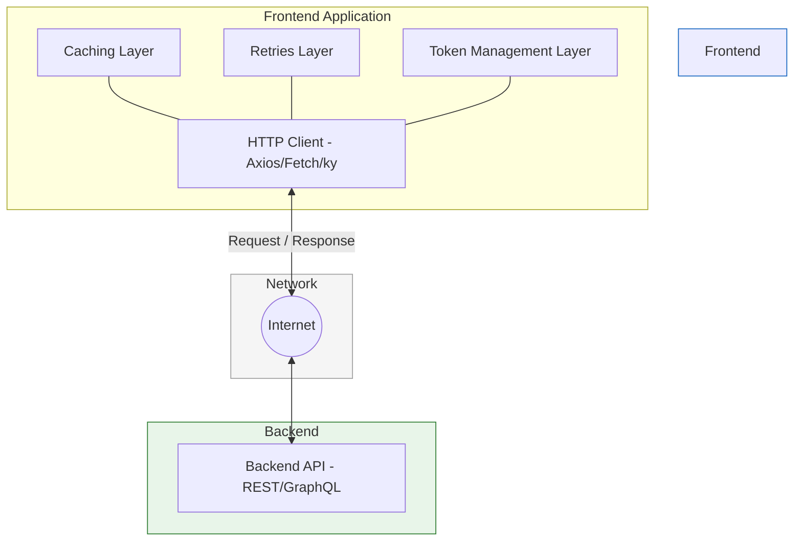

# API Integration

## Kirish

> [!IMPORTANT]
> **Nima uchun muhim?**  
> Bugungi kunda Frontend ilovalar juda aqlli bo'lib ketgan, lekin ma'lumotlarsiz ular faqatgina chiroyli quti, xolos. Backend bilan xavfsiz, tezkor va barqaror aloqa o'rnatish har bir web-ilovaning yuragi hisoblanadi. 

> [!NOTE]
> **Real-hayot analogiyasi: "Restoran zanjiri"**  
> Frontend — bu mijozlar o'tiradigan zal. 
> Backend — bu oshxona. 
> **API Integratsiya** — bu ofitsiantlar, menyular, kassalar va ovqat yetkazib berish tizimi. Bu tizim (API) qanchalik mukammal, xatosiz va tez ishlasa, restoran (Ilova) shunchalik muvaffaqiyatli bo'ladi.

Bu bo'lim frontend-backend integratsiyasi, REST va GraphQL API'lar bilan ishlash, hamda zamonaviy HTTP client pattern'larini chuqur o'rganishga bag'ishlangan.

## Bo'lim Tarkibi

| # | Mavzu | Tavsif |
|---|-------|--------|
| 01 | [REST API](./01-rest-api.md) | REST principlari, HTTP metodlar, status kodlar, HATEOAS |
| 02 | [GraphQL](./02-graphql.md) | Query, Mutation, Subscription, Apollo Client, caching |
| 03 | [Pagination](./03-pagination.md) | Offset, cursor, infinite scroll, virtual scrolling |
| 04 | [Caching](./04-caching.md) | HTTP cache, SWR, React Query, cache invalidation |
| 05 | [Retries & Interceptors](./05-retries-interceptors.md) | Exponential backoff, request/response interceptors |
| 06 | [Token Refresh](./06-token-refresh.md) | JWT refresh, silent renewal, race condition handling |
| 07 | [Axios vs Fetch](./07-axios-vs-fetch.md) | Comparison, wrapper patterns, modern alternatives |

## Nima Uchun Bu Mavzular?

Zamonaviy web ilovalar deyarli 100% API-driven. Backend bilan samarali integratsiya - senior frontend developer'ning asosiy ko'nikmalaridan biri.

### REST API
- Industry standard hisoblangan arxitektura
- Barcha backend framework'lar bilan ishlash
- Mobile va web uchun yagona endpoint'lar

### GraphQL
- Over-fetching va under-fetching muammolarini hal qilish
- Real-time subscription'lar
- Type-safe frontend development

### Pagination
- Million qatorli data'ni samarali ko'rsatish
- UX va performance balance
- SEO uchun pagination strategiyalari

### Caching
- Network request'larni kamaytirish
- Offline-first ilovalar
- Optimistic updates

### Retries & Interceptors
- Network instability handling
- Global error handling
- Request/response transformation

### Token Refresh
- Seamless authentication
- Security best practices
- Multi-tab synchronization

### Axios vs Fetch
- To'g'ri tool tanlash
- Custom HTTP client yaratish
- Bundle size optimization

## Real-World Ahamiyati

## O'rganish Tartibi

1. **REST API** - fundamental tushunchalar
2. **Axios vs Fetch** - HTTP client tanlash
3. **Retries & Interceptors** - robust network layer
4. **Token Refresh** - authentication flow
5. **Caching** - performance optimization
6. **Pagination** - large data handling
7. **GraphQL** - advanced API patterns

## Interview Tayyorgarlik

Har bir faylda 3-5 ta interview savol va javoblar mavjud. Ko'p uchraydigan mavzular:

- REST vs GraphQL farqlari
- HTTP status kodlarni tushuntiring
- Token refresh qanday ishlaydi?
- Axios interceptor'lar nimaga kerak?
- Infinite scroll qanday implement qilinadi?
- Cache invalidation strategiyalari

## Eng Yaxshi Amaliyotlar (Best Practices)

1. **Markazlashtirish**: Hamma API chaqiruvlarini bitta `apiClient` yoki shunga o'xshash xizmat fayllarida saqlang. Komponentlar ichida to'g'ridan-to'g'ri `fetch` yoki `axios` yozishdan qoching.
2. **Kesh ishlating**: Qayta-qayta o'zgarmaydigan ma'lumotlarni so'rash uchun Backend'ga yuguravermang. SWR yoki Vue Query ishlating.
3. **Xavfsizlik**: Tokenlarni va sezgir ma'lumotlarni hech qachon `localStorage` da saqlamang. Eng yaxshisi "HttpOnly" cookie-fayllardan foydalaning.

---

## Amaliy Mashqlar

Har bir bo'limda real-world case'lar va kod misollari mavjud. Ularni:

1. O'z loyihangizda sinab ko'ring
2. Edge case'larni o'ylab toping
3. Error handling'ni yaxshilang
4. Unit test'lar yozing

**Eslatma:** API integratsiya - bu nafaqat kod yozish, balki arxitektura qarorlari ham. Har bir pattern'ning trade-off'larini tushunish muhim.
