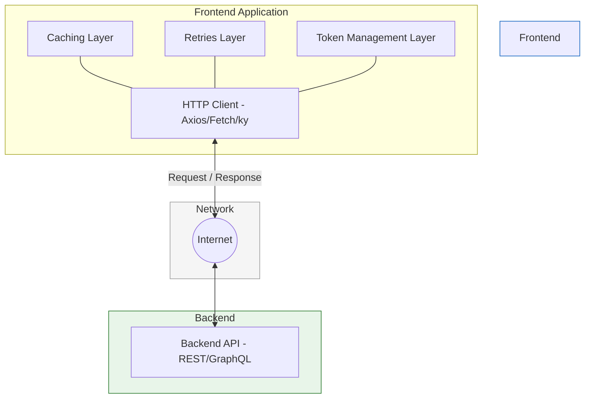

# API Integration

## Kirish

> [!IMPORTANT]
> **Nima uchun muhim?**  
> Bugungi kunda Frontend ilovalar juda aqlli bo'lib ketgan, lekin ma'lumotlarsiz ular faqatgina chiroyli quti, xolos. Backend bilan xavfsiz, tezkor va barqaror aloqa o'rnatish har bir web-ilovaning yuragi hisoblanadi. 

> [!NOTE]
> **Real-hayot analogiyasi: "Restoran zanjiri"**  
> Frontend — bu mijozlar o'tiradigan zal. 
> Backend — bu oshxona. 
> **API Integratsiya** — bu ofitsiantlar, menyular, kassalar va ovqat yetkazib berish tizimi. Bu tizim (API) qanchalik mukammal, xatosiz va tez ishlasa, restoran (Ilova) shunchalik muvaffaqiyatli bo'ladi.

Bu bo'lim frontend-backend integratsiyasi, REST va GraphQL API'lar bilan ishlash, hamda zamonaviy HTTP client pattern'larini chuqur o'rganishga bag'ishlangan.

---

## 🟢 Junior (Asoslar va Tushunchalar)

### API Nima o'zi?
API (Application Programming Interface) - bu ikki xil dasturning bir-biri bilan gaplashishi uchun qoidalar to'plami. Frontend vizual oyna yasasa, uni haqiqiy foydalanuvchilar, rasmlar, mahsulotlar kabi ma'lumotlar (Data) bilan to'ldirish uchun Backend API ga murojaat (Request) qiladi va javob (Response) oladi.

### Asosiy Mavzular
Bo'limda o'rganiladigan asosiy yo'nalishlar:

| # | Mavzu | Tavsif |
|---|-------|--------|
| 01 | [REST API](./01-rest-api.md) | REST principlari, HTTP metodlar, status kodlar |
| 02 | [GraphQL](./02-graphql.md) | Query, Mutation, Subscription, Apollo Client, caching |
| 03 | [Pagination](./03-pagination.md) | Katta ma'lumotlarni qism-qism ko'rsatish (Offset, cursor) |
| 04 | [Caching](./04-caching.md) | Tarmoq so'rovlarini kamaytirish strategiyalari |
| 05 | [Retries & Interceptors](./05-retries-interceptors.md) | Tarmoqdagi uzilishlarni nazorat qilish |
| 06 | [Token Refresh](./06-token-refresh.md) | Xavfsizlik kalitlarini avtomatik yangilash |
| 07 | [Axios vs Fetch](./07-axios-vs-fetch.md) | HTTP Clientlarni taqqoslash va to'g'ri tanlash |

---

## 🟡 Middle (Amaliyot va Detallar)

### Arxitektura: Tarmoq bilan ishlash Qatlami (Network Layer)
Yaxshi loyihalarda API chaqiruvlari komponentlarning ichida sochilib yotmaydi. Buning o'rniga "Network Layer" (Tarmoq Qatlami) yaratiladi.

### O'rganish Tartibi
Bularni qay tartibda o'rganganga ma'qul:
1. **REST API** - Eng ommabop va fundamental tushunchalar
2. **Axios vs Fetch** - Ma'lumotlarni olib keluvchi asbobni (HTTP client) to'g'ri tanlash
3. **Token Refresh** - Tizimga kirish va xavfsizlik (Authentication) muammolari
4. **Retries & Interceptors** - Mustahkam tarmoq mantiqi (Interceptors)
5. **Pagination & Caching** - Tezlik, performans va foydalanuvchi qulayligi (UX)
6. **GraphQL** - Murakkab arxitekturali loyihalar uchun mo'ljallangan ilg'or API tili

---

## 🔴 Senior (Arxitektura va Optimizatsiya)

### Trade-offs (Tanlov kelishuvlari)
Senior darajasida har bir API texnologiyasi o'zining plyus va minuslariga (Trade-off) ekanligini anglab yetish muhimdir. Barcha loyihaga ham GraphQL tiqishtiraverish to'g'ri emas.

- **REST:** Standartlashgan, kesh (HTTP caching) oson, o'rganish tez. Ammo ortiqcha ma'lumotlar kelishi (over-fetching) yoki bir necha marta so'rov yuborishga to'g'ri kelishi (under-fetching) kabi muammolari bor.
- **GraphQL:** Frontend to'liq nazoratga ega bo'ladi (faqat keraklisini so'raydi), bitta URL orqali hamma ishni bajara oladi. Ammo backendda `N+1` muammosi yuzaga keladi, so'rovlarni analiz qilish (Performance monitoring) qiyinlashadi, fayl yuklash biroz noqulay.

### Intervyu Savollari (Qiyin daraja)
**1. Request qotib qolganda (Timeout bo'lganda) Frontend uni nechchi marta qayta (Retry) yuborishi kerak va bu jarayonda qanday matematik algoritm qo'llaniladi?**
*Javob:* Odatda 3 martagacha Retry qilinadi. Bunda darhol yubormasdan "Exponential Backoff" algoritmi qo'llaniladi, ya'ni har bir muvaffaqiyatsiz urunishdan keyin kutish vaqti eksponensial tarzda uzayib boradi (masalan: 1-marta 1 soniya, 2-marta 2 soniya, 3-marta 4 soniyadan so'ng yuborish). Bu vaqtinchalik o'chib qolgan yoki bosim ostida qiynalayotgan Serverni battar qulatib qo'ymaslik uchun shart.

**2. Kesh yaroqsizlanishi (Cache Invalidation) nima va u qachon ishlatiladi?**
*Javob:* Frontend xotiradagi o'zgartirilmagan ma'lumotlarni qachon eskirganligini (Stale) va Serverdan yangitdan olib kelishi kerakligini hal qilish jarayoni "Cache Invalidation" deyiladi. Masalan "UserList"ni serverdan olib kelib keshga yozib qo'ydik. Agar administrator yangi user qo'shsa (Mutation/POST) darhol eski UserList keshini Invalid qilish kerak (Keshni tozalash va Fetch qilish). Bu SWR va Vue Query da `invalidateQueries` yordamida qilinadi.

**3. Ovozli qo'ng'iroqlar, chatchalar, hamda doimiy yangilanadigan Birja jadvallari uchun siz REST API, GraphQL Mutation, Server-Sent Events (SSE) va WebSocketlardan qaysi birini tanlaysiz va nega?**
*Javob:* 
- GraphQL Mutation va REST bular uchun juda og'ir va sekin.
- Bir tomonlama, serverdan tez-tez keladigan ma'lumotlar (Birja jadvali) uchun **SSE** yaxshiroq. Chunki u asosan HTTP ustida ishlaydi, oddiy va resurs tejamkor.
- Ikki tomonlama, past kechikishli muloqot (Chat yoki Ovoz/Video oqim) uchun esa yagona yechim bu **WebSocket** (Yoki WebRTC) dir. U uzoq vaqt aloqani ochiq saqlab tura oladi.

---

## Eng Yaxshi Amaliyotlar (Best Practices)

1. **Markazlashtirish**: Hamma API chaqiruvlarini bitta `apiClient` yoki shunga o'xshash xizmat fayllarida saqlang. Komponentlar ichida to'g'ridan-to'g'ri `fetch` yoki `axios` yozishdan qoching.
2. **Kesh ishlating**: Qayta-qayta o'zgarmaydigan ma'lumotlarni so'rash uchun Backend'ga yuguravermang. SWR yoki Vue Query ishlating.
3. **Xavfsizlik**: Tokenlarni va sezgir ma'lumotlarni hech qachon `localStorage` da saqlamang. Eng yaxshisi "HttpOnly" cookie-fayllardan foydalaning.

---

## Xulosa

| Mavzu | Asosiy Mohiyati | Qachon ishlatish kerak? |
|-------|-----------------|-------------------------|
| **REST API** | Standard HTTP metodlar orqali ishlash | Deyarli barcha an'anaviy loyihalarda |
| **GraphQL** | O'zingizga kerakli datani tanlab olish | Ko'p relatsiyali, murakkab va katta ma'lumotli ilovalarda |
| **Axios vs Fetch** | Ma'lumot olib keluvchi vosita | Kichik loyihada Fetch, Katta va murakkab logikalarda Axios |
| **Token Refresh** | Xavfsizlikni davomiy ushlash | Auth ishlatiladigan har qanday joyda |

Backend API qanchalik chiroyli ishlagan taqdirda ham, uzoq masofa, internet tezligi yoki server bandligi kabi muammolar uni sekinlashtiradi. Shu sababli API integratsiyasida "xatolarga tayyor turish" (Error Handling va Retry) mexanizmlari eng qadrlanadigan xususiyat hisoblanadi.

**Eslatma:** API integratsiya - bu nafaqat kod yozish, balki arxitektura qarorlari ham. Har bir pattern'ning plyus va minuslarini (trade-off) tushunish muhim.
